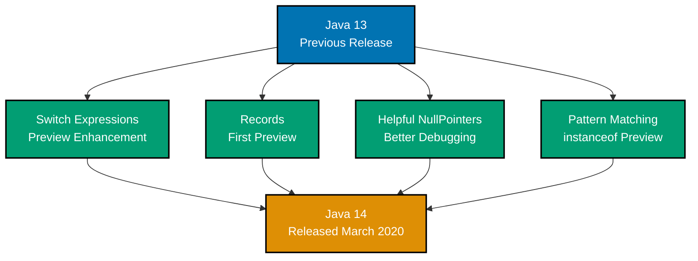
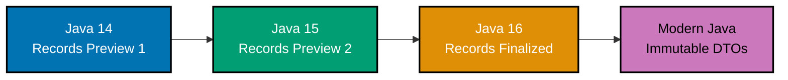

# Java 14 Release

## Overview

Java 14 introduces new features, JVM performance improvements, and language enhancements. This release continues Java's evolution toward better performance and developer productivity.

## Key Features

This release includes improvements to the JVM, language features, and standard library.

### Feature Timeline



### Records Preview Evolution



## Breaking Changes

Consult the official Java 14 documentation for detailed breaking changes and migration guidance.

## References

- [Java 14 Release Notes](https://www.oracle.com/java/technologies/javase/14-relnotes.html)
- [Java Documentation](https://docs.oracle.com/en/java/)

---

**Last Updated**: 2026-01-24
**Java Version**: 17+ (baseline LTS), 21+ (latest LTS), 25 (latest stable)
**Maintainers**: OSE Platform Documentation Team

```mermaid
%%{init: {'theme':'base', 'themeVariables': { 'primaryColor':'#0173B2','primaryTextColor':'#fff','primaryBorderColor':'#0173B2','lineColor':'#DE8F05','secondaryColor':'#029E73','tertiaryColor':'#CC78BC','fontSize':'16px'}}}%%
flowchart TD
    A[Java 14<br/>March 2020] --> B[Records Preview<br/>Data Classes]
    A --> C[Switch Expressions<br/>Standard Feature]
    A --> D[Text Blocks<br/>Multi-line Strings]
    A --> E[NullPointerException<br/>Helpful Messages]

    B --> B1[Compact Syntax<br/>Immutable Data]
    B --> B2[Auto Methods<br/>Generated Code]

    C --> C1[Expression Form<br/>Return Values]
    C --> C2[Arrow Syntax<br/>Modern Style]

    D --> D1[Triple Quotes<br/>""" Text """]
    D --> D2[Formatting<br/>Indentation]

    E --> E1[Precise Messages<br/>Which Variable]
    E --> E2[Better Debugging<br/>Clear Errors]

    B1 --> F[Donation DTO<br/>Immutable Record]
    C1 --> G[Status Mapping<br/>Switch Expression]
    D1 --> H[SQL Queries<br/>Readable Text]

    style A fill:#0173B2,color:#fff
    style B fill:#DE8F05,color:#fff
    style C fill:#029E73,color:#fff
    style D fill:#CC78BC,color:#fff
    style E fill:#0173B2,color:#fff
    style F fill:#DE8F05,color:#fff
    style G fill:#029E73,color:#fff
    style H fill:#CC78BC,color:#fff
```
