# Java Test-Driven Development

**Quick Reference**: [Why TDD in Finance](#why-tdd-in-finance) | [Red-Green-Refactor Cycle](#red-green-refactor-cycle) | [JUnit 5 Fundamentals](#junit-5-fundamentals) | [Assertions with AssertJ](#assertions-with-assertj) | [Mocking with Mockito](#mocking-with-mockito) | [Testing Strategies](#testing-strategies) | [Testing Domain Models](#testing-domain-models) | [Testing Patterns](#testing-patterns) | [TDD Best Practices](#tdd-best-practices) | [TDD Checklist](#tdd-checklist) | [Performance and Coverage](#performance-and-coverage) | [Related Principles](#related-principles) | [Sources](#sources) | [Related Documentation](#related-documentation)
**Understanding-oriented documentation** for test-driven development practices with Java, JUnit 5, Mockito, and AssertJ.

## Quick Reference

**Jump to:**

- [Why TDD in Finance](#why-tdd-in-finance) - Domain context and benefits
- [Red-Green-Refactor Cycle](#red-green-refactor-cycle) - Core TDD workflow
- [JUnit 5 Fundamentals](#junit-5-fundamentals) - Modern testing framework
- [Assertions with AssertJ](#assertions-with-assertj) - Fluent assertions
- [Mocking with Mockito](#mocking-with-mockito) - Test doubles
- [Testing Strategies](#testing-strategies) - Unit, integration, E2E
- [Testing Domain Models](#testing-domain-models) - DDD with TDD
- [Testing Patterns](#testing-patterns) - Best practices

**Related Documentation:**

- [Java Idioms](./ex-so-stla-ja__idioms.md) - Modern Java patterns for testable code
- [Java Functional Programming](./ex-so-stla-ja__functional-programming.md) - Pure functions are easy to test
- [Domain-Driven Design](./ex-so-stla-ja__domain-driven-design.md) - Testing aggregates and value objects
- [Behavior-Driven Development](./ex-so-stla-ja__behaviour-driven-development.md) - BDD complements TDD

## Why TDD in Finance

Test-Driven Development is critical for financial systems because it:

- **Prevents costly bugs**: Catch calculation errors before production
- **Ensures correctness**: Test-first forces thinking about requirements
- **Enables refactoring**: Tests provide safety net for improvements
- **Documents behavior**: Tests serve as executable specifications
- **Builds confidence**: High test coverage reduces deployment risk

**Example: Zakat Calculation Bug Prevented by TDD**

```java
// Initial requirement: Calculate 2.5% Zakat
@Test
void testZakatCalculation() {
    Money balance = Money.of(100000, "USD");
    Money nisab = Money.of(5000, "USD");

    Money zakat = ZakatCalculator.calculate(balance, nisab);

    // Expected: (100000 - 5000) * 0.025 = 2375
    assertThat(zakat.getAmount())
        .isEqualByComparingTo(new BigDecimal("2375.00"));
}

// First implementation (RED - test fails)
public static Money calculate(Money balance, Money nisab) {
    return balance.multiply(new BigDecimal("0.025"));  // WRONG: Forgot to subtract nisab!
}

// Test output:
// Expected: 2375.00
// Actual: 2500.00
// FAILURE - Test caught the bug!

// Fixed implementation (GREEN - test passes)
public static Money calculate(Money balance, Money nisab) {
    if (balance.compareTo(nisab) < 0) {
        return Money.zero(balance.getCurrency());
    }
    return balance.subtract(nisab).multiply(new BigDecimal("0.025"));
}

// Without TDD: Bug goes to production, thousands of incorrect Zakat calculations!
// With TDD: Bug caught in seconds, never reaches production.
```

## Red-Green-Refactor Cycle

TDD follows a simple three-step cycle:

```mermaid
%% Color Palette: Blue #0173B2, Orange #DE8F05, Teal #029E73, Purple #CC78BC
%% All colors are color-blind friendly and meet WCAG AA contrast standards

stateDiagram-v2
    [*] --> Red: Write test

    Red --> Green: Test fails
    Green --> Refactor: Test passes
    Refactor --> Red: Tests still pass,<br/>next feature

    note right of Red
        🔴 RED
        Write failing test
        Specify desired behavior
    end note

    note right of Green
        🟢 GREEN
        Write minimum code
        Make test pass
    end note

    note right of Refactor
        ♻️ REFACTOR
        Improve code quality
        Keep tests passing
    end note

    classDef redState fill:#CC78BC,stroke:#000000,color:#FFFFFF,stroke-width:3px
    classDef greenState fill:#029E73,stroke:#000000,color:#FFFFFF,stroke-width:3px
    classDef refactorState fill:#0173B2,stroke:#000000,color:#FFFFFF,stroke-width:3px

    class Red redState
    class Green greenState
    class Refactor refactorState
```



### Step 1: RED - Write Failing Test

Write a test that specifies desired behavior. Test fails because feature doesn't exist yet.

**Example: Donation Processing**

```java
@Test
void testProcessDonation() {
    // Arrange
    Donation donation = Donation.create(
        DonorId.of("D-001"),
        Money.of(1000, "USD")
    );

    // Act
    donation.process();

    // Assert
    assertThat(donation.getStatus()).isEqualTo(DonationStatus.PROCESSED);
    assertThat(donation.getNetAmount().getAmount())
        .isEqualByComparingTo(new BigDecimal("970.00"));  // After 3% fee
    assertThat(donation.getFee().getAmount())
        .isEqualByComparingTo(new BigDecimal("30.00"));
}

// Test fails: process() method doesn't exist!
// Error: Cannot resolve method 'process()'
```

### Step 2: GREEN - Make It Pass

Write minimum code to make the test pass. Don't worry about perfection yet.

```java
public class Donation {
    private DonationId id;
    private DonorId donorId;
    private Money amount;
    private DonationStatus status;
    private Money netAmount;
    private Money fee;

    // Minimum code to make test pass
    public void process() {
        BigDecimal feeRate = new BigDecimal("0.03");
        this.fee = this.amount.multiply(feeRate);
        this.netAmount = this.amount.subtract(this.fee);
        this.status = DonationStatus.PROCESSED;
    }

    public Money getNetAmount() { return netAmount; }
    public Money getFee() { return fee; }
    public DonationStatus getStatus() { return status; }
}

// Test passes! GREEN.
```

### Step 3: REFACTOR - Improve Code

Improve code quality while keeping tests green.

```java
public class Donation {
    private static final BigDecimal FEE_RATE = new BigDecimal("0.03");

    // Refactored: extract constant, improve naming
    public void process() {
        if (this.status != DonationStatus.PENDING) {
            throw new IllegalStateException("Can only process pending donations");
        }

        this.fee = calculateFee();
        this.netAmount = calculateNetAmount();
        this.status = DonationStatus.PROCESSED;

        recordEvent(new DonationProcessed(this.id, this.netAmount, this.fee));
    }

    private Money calculateFee() {
        return this.amount.multiply(FEE_RATE);
    }

    private Money calculateNetAmount() {
        return this.amount.subtract(this.fee);
    }
}

// Tests still pass after refactoring!
```

### TDD Workflow Example: Money Addition

```java
// RED: Write failing test
@Test
void testMoneyAddition() {
    Money a = Money.of(100, "USD");
    Money b = Money.of(50, "USD");

    Money sum = a.add(b);

    assertThat(sum.getAmount()).isEqualByComparingTo(new BigDecimal("150"));
}
// Compilation error: Money.add() doesn't exist

// GREEN: Minimum code to pass
public record Money(BigDecimal amount, Currency currency) {
    public Money add(Money other) {
        return new Money(this.amount.add(other.amount), this.currency);
    }
}
// Test passes!

// RED: Add test for currency mismatch
@Test
void testCannotAddDifferentCurrencies() {
    Money usd = Money.of(100, "USD");
    Money eur = Money.of(50, "EUR");

    assertThrows(CurrencyMismatchException.class, () -> usd.add(eur));
}
// Test fails: No currency check!

// GREEN: Add currency validation
public record Money(BigDecimal amount, Currency currency) {
    public Money add(Money other) {
        if (!this.currency.equals(other.currency)) {
            throw new CurrencyMismatchException(this.currency, other.currency);
        }
        return new Money(this.amount.add(other.amount), this.currency);
    }
}
// All tests pass!

// REFACTOR: Extract validation
public record Money(BigDecimal amount, Currency currency) {
    public Money add(Money other) {
        ensureSameCurrency(other);
        return new Money(this.amount.add(other.amount), this.currency);
    }

    private void ensureSameCurrency(Money other) {
        if (!this.currency.equals(other.currency)) {
            throw new CurrencyMismatchException(this.currency, other.currency);
        }
    }
}
// Tests still pass after refactoring!
```

## JUnit 5 Fundamentals

JUnit 5 is the modern testing framework for Java.

### Installation

**Maven**:

```xml
<dependency>
    <groupId>org.junit.jupiter</groupId>
    <artifactId>junit-jupiter</artifactId>
    <version>5.14.2</version>
    <scope>test</scope>
</dependency>
```

### Basic Test Structure

```java
import org.junit.jupiter.api.*;
import static org.assertj.core.api.Assertions.*;

class ZakatCalculatorTest {
    private ZakatCalculator calculator;

    @BeforeEach
    void setUp() {
        calculator = new ZakatCalculator();
    }

    @AfterEach
    void tearDown() {
        // Cleanup if needed
    }

    @Test
    void testCalculateZakat() {
        Money balance = Money.of(100000, "USD");
        Money nisab = Money.of(5000, "USD");

        Money zakat = calculator.calculate(balance, nisab);

        assertThat(zakat.getAmount())
            .isEqualByComparingTo(new BigDecimal("2375.00"));
    }

    @Test
    @DisplayName("Zakat should be zero when balance is below nisab")
    void testZakatBelowNisab() {
        Money balance = Money.of(4000, "USD");
        Money nisab = Money.of(5000, "USD");

        Money zakat = calculator.calculate(balance, nisab);

        assertThat(zakat.getAmount()).isEqualByComparingTo(BigDecimal.ZERO);
    }

    @Test
    @Disabled("Not implemented yet")
    void testZakatWithGoldNisab() {
        // TODO: Implement gold nisab calculation
    }
}
```

### Lifecycle Hooks

```java
class DonationServiceTest {
    @BeforeAll
    static void initAll() {
        // Run once before all tests
        System.out.println("Starting test suite");
    }

    @BeforeEach
    void init() {
        // Run before each test
        System.out.println("Starting test");
    }

    @Test
    void testCase1() {
        // Test code
    }

    @Test
    void testCase2() {
        // Test code
    }

    @AfterEach
    void tearDown() {
        // Run after each test
        System.out.println("Finished test");
    }

    @AfterAll
    static void tearDownAll() {
        // Run once after all tests
        System.out.println("Finished test suite");
    }
}

// Output:
// Starting test suite
// Starting test
// Finished test
// Starting test
// Finished test
// Finished test suite
```

### Parameterized Tests

```java
@ParameterizedTest
@CsvSource({
    "100000, 5000, 2375.00",
    "50000,  5000, 1125.00",
    "10000,  5000,  125.00",
    "4000,   5000,    0.00"
})
void testZakatCalculation(BigDecimal balance, BigDecimal nisab, BigDecimal expectedZakat) {
    Money balanceMoney = Money.of(balance, "USD");
    Money nisabMoney = Money.of(nisab, "USD");

    Money zakat = ZakatCalculator.calculate(balanceMoney, nisabMoney);

    assertThat(zakat.getAmount()).isEqualByComparingTo(expectedZakat);
}

@ParameterizedTest
@ValueSource(strings = {"USD", "EUR", "GBP", "JPY"})
void testSupportedCurrencies(String currencyCode) {
    Currency currency = Currency.getInstance(currencyCode);
    Money money = Money.of(1000, currency);

    assertThat(money.currency()).isEqualTo(currency);
}

@ParameterizedTest
@MethodSource("provideDonationAmounts")
void testDonationValidation(Money amount, boolean isValid) {
    if (isValid) {
        assertDoesNotThrow(() -> Donation.create(DonorId.generate(), amount));
    } else {
        assertThrows(IllegalArgumentException.class, () ->
            Donation.create(DonorId.generate(), amount)
        );
    }
}

static Stream<Arguments> provideDonationAmounts() {
    return Stream.of(
        Arguments.of(Money.of(1000, "USD"), true),
        Arguments.of(Money.of(0, "USD"), false),
        Arguments.of(Money.of(-100, "USD"), false)
    );
}
```

### Nested Tests

```java
@DisplayName("Donation Tests")
class DonationTest {
    private Donation donation;

    @Nested
    @DisplayName("When donation is created")
    class WhenCreated {
        @BeforeEach
        void createDonation() {
            donation = Donation.create(
                DonorId.of("D-001"),
                Money.of(1000, "USD")
            );
        }

        @Test
        @DisplayName("Status should be PENDING")
        void statusShouldBePending() {
            assertThat(donation.getStatus()).isEqualTo(DonationStatus.PENDING);
        }

        @Test
        @DisplayName("Amount should be set correctly")
        void amountShouldBeSet() {
            assertThat(donation.getAmount().getAmount())
                .isEqualByComparingTo(new BigDecimal("1000"));
        }

        @Nested
        @DisplayName("When donation is processed")
        class WhenProcessed {
            @BeforeEach
            void processDonation() {
                donation.process();
            }

            @Test
            @DisplayName("Status should be PROCESSED")
            void statusShouldBeProcessed() {
                assertThat(donation.getStatus())
                    .isEqualTo(DonationStatus.PROCESSED);
            }

            @Test
            @DisplayName("Net amount should be calculated")
            void netAmountShouldBeCalculated() {
                assertThat(donation.getNetAmount().getAmount())
                    .isEqualByComparingTo(new BigDecimal("970.00"));
            }
        }
    }
}
```

### Timeout Tests

```java
@Test
@Timeout(value = 500, unit = TimeUnit.MILLISECONDS)
void testZakatCalculationPerformance() {
    // Must complete within 500ms
    Money balance = Money.of(100000, "USD");
    Money nisab = Money.of(5000, "USD");

    Money zakat = ZakatCalculator.calculate(balance, nisab);

    assertThat(zakat).isNotNull();
}

@Test
void testWithManualTimeout() {
    assertTimeout(Duration.ofSeconds(2), () -> {
        // Code must complete within 2 seconds
        Thread.sleep(1000);
        return "Completed";
    });
}
```

## Assertions with AssertJ

AssertJ provides fluent, readable assertions.

### Installation

**Maven**:

```xml
<dependency>
    <groupId>org.assertj</groupId>
    <artifactId>assertj-core</artifactId>
    <version>3.27.6</version>
    <scope>test</scope>
</dependency>
```

### Basic Assertions

```java
import static org.assertj.core.api.Assertions.*;

@Test
void testBasicAssertions() {
    // Equality
    assertThat("hello").isEqualTo("hello");
    assertThat(42).isEqualTo(42);

    // Null checks
    assertThat(null).isNull();
    assertThat("value").isNotNull();

    // Boolean
    assertThat(true).isTrue();
    assertThat(false).isFalse();

    // Strings
    assertThat("hello world")
        .startsWith("hello")
        .endsWith("world")
        .contains("lo wo");

    // Numbers
    assertThat(100).isGreaterThan(50)
        .isLessThan(200)
        .isBetween(90, 110);

    // BigDecimal
    assertThat(new BigDecimal("100.50"))
        .isEqualByComparingTo(new BigDecimal("100.50"));
}
```

### Collection Assertions

```java
@Test
void testCollectionAssertions() {
    List<String> donors = List.of("Alice", "Bob", "Charlie");

    assertThat(donors)
        .hasSize(3)
        .contains("Bob")
        .containsExactly("Alice", "Bob", "Charlie")
        .containsExactlyInAnyOrder("Charlie", "Alice", "Bob")
        .doesNotContain("David")
        .allMatch(name -> name.length() > 2);
}

@Test
void testMapAssertions() {
    Map<String, Money> balances = Map.of(
        "Alice", Money.of(10000, "USD"),
        "Bob", Money.of(25000, "USD")
    );

    assertThat(balances)
        .hasSize(2)
        .containsKey("Alice")
        .containsValue(Money.of(10000, "USD"))
        .containsEntry("Bob", Money.of(25000, "USD"));
}
```

### Object Assertions

```java
@Test
void testObjectAssertions() {
    Donation donation = Donation.create(
        DonorId.of("D-001"),
        Money.of(1000, "USD")
    );

    assertThat(donation)
        .isNotNull()
        .hasFieldOrPropertyWithValue("status", DonationStatus.PENDING)
        .extracting(Donation::getAmount)
        .isEqualTo(Money.of(1000, "USD"));

    // Soft assertions (all assertions execute even if some fail)
    SoftAssertions.assertSoftly(softly -> {
        softly.assertThat(donation.getAmount().getAmount())
            .isEqualByComparingTo(new BigDecimal("1000"));
        softly.assertThat(donation.getStatus())
            .isEqualTo(DonationStatus.PENDING);
        softly.assertThat(donation.getId()).isNotNull();
    });
}
```

### Exception Assertions

```java
@Test
void testExceptionAssertions() {
    // Assert exception is thrown
    assertThatThrownBy(() -> {
        Money.of(-100, "USD");
    })
        .isInstanceOf(IllegalArgumentException.class)
        .hasMessage("Amount cannot be negative");

    // Assert specific exception
    assertThatIllegalArgumentException()
        .isThrownBy(() -> Money.of(-100, "USD"))
        .withMessage("Amount cannot be negative");

    // Assert no exception
    assertThatNoException()
        .isThrownBy(() -> Money.of(100, "USD"));
}
```

### Custom Assertions

```java
public class MoneyAssert extends AbstractAssert<MoneyAssert, Money> {
    public MoneyAssert(Money actual) {
        super(actual, MoneyAssert.class);
    }

    public static MoneyAssert assertThat(Money actual) {
        return new MoneyAssert(actual);
    }

    public MoneyAssert hasAmount(BigDecimal expectedAmount) {
        isNotNull();

        if (actual.getAmount().compareTo(expectedAmount) != 0) {
            failWithMessage("Expected amount to be <%s> but was <%s>",
                expectedAmount, actual.getAmount());
        }

        return this;
    }

    public MoneyAssert hasCurrency(String expectedCurrency) {
        isNotNull();

        if (!actual.currency().getCurrencyCode().equals(expectedCurrency)) {
            failWithMessage("Expected currency to be <%s> but was <%s>",
                expectedCurrency, actual.currency().getCurrencyCode());
        }

        return this;
    }

    public MoneyAssert isPositive() {
        isNotNull();

        if (actual.isNegativeOrZero()) {
            failWithMessage("Expected money to be positive but was <%s>",
                actual.getAmount());
        }

        return this;
    }
}

// Usage
@Test
void testCustomAssertions() {
    Money donation = Money.of(1000, "USD");

    MoneyAssert.assertThat(donation)
        .hasAmount(new BigDecimal("1000"))
        .hasCurrency("USD")
        .isPositive();
}
```

## Mocking with Mockito

Mockito provides test doubles for isolating units under test.

### Installation

**Maven**:

```xml
<dependency>
    <groupId>org.mockito</groupId>
    <artifactId>mockito-core</artifactId>
    <version>5.15.2</version>
    <scope>test</scope>
</dependency>
<dependency>
    <groupId>org.mockito</groupId>
    <artifactId>mockito-junit-jupiter</artifactId>
    <version>5.15.2</version>
    <scope>test</scope>
</dependency>
```

### Creating Mocks

```java
import static org.mockito.Mockito.*;

@ExtendWith(MockitoExtension.class)
class DonationServiceTest {
    @Mock
    private DonationRepository donationRepository;

    @Mock
    private DonorRepository donorRepository;

    @Mock
    private EventPublisher eventPublisher;

    @InjectMocks
    private DonationService donationService;

    @Test
    void testProcessDonation() {
        // Arrange
        DonationId donationId = DonationId.of("DON-001");
        Donation donation = Donation.create(
            DonorId.of("D-001"),
            Money.of(1000, "USD")
        );

        when(donationRepository.findById(donationId))
            .thenReturn(Optional.of(donation));

        // Act
        donationService.processDonation(donationId);

        // Assert
        verify(donationRepository).save(donation);
        verify(eventPublisher).publishAll(any());
    }
}
```

### Stubbing Behavior

```java
@Test
void testStubbingExamples() {
    DonorRepository mock = mock(DonorRepository.class);

    // Return specific value
    when(mock.findById(DonorId.of("D-001")))
        .thenReturn(Optional.of(donor));

    // Return different values on successive calls
    when(mock.count())
        .thenReturn(10L)
        .thenReturn(20L)
        .thenReturn(30L);

    assertThat(mock.count()).isEqualTo(10L);
    assertThat(mock.count()).isEqualTo(20L);
    assertThat(mock.count()).isEqualTo(30L);

    // Throw exception
    when(mock.findById(DonorId.of("INVALID")))
        .thenThrow(new DonorNotFoundException("INVALID"));

    // Argument matchers
    when(mock.findByEmail(anyString()))
        .thenReturn(Optional.of(donor));

    when(mock.findByEmail(startsWith("test")))
        .thenReturn(Optional.empty());
}
```

### Verification

```java
@Test
void testVerificationExamples() {
    DonationRepository mock = mock(DonationRepository.class);
    Donation donation = createTestDonation();

    // Call methods
    mock.save(donation);
    mock.save(donation);
    mock.findById(donation.getId());

    // Verify method called
    verify(mock).findById(donation.getId());

    // Verify method called specific number of times
    verify(mock, times(2)).save(donation);
    verify(mock, atLeastOnce()).findById(any());
    verify(mock, never()).remove(any());

    // Verify method called with specific arguments
    verify(mock).save(argThat(d ->
        d.getAmount().getAmount().compareTo(new BigDecimal("1000")) == 0
    ));

    // Verify no more interactions
    verifyNoMoreInteractions(mock);
}
```

### Argument Captors

```java
@Test
void testArgumentCaptor() {
    DonationRepository mock = mock(DonationRepository.class);
    DonationService service = new DonationService(mock, donorRepository, eventPublisher);

    service.createDonation(DonorId.of("D-001"), Money.of(1000, "USD"));

    // Capture argument
    ArgumentCaptor<Donation> captor = ArgumentCaptor.forClass(Donation.class);
    verify(mock).save(captor.capture());

    Donation captured = captor.getValue();
    assertThat(captured.getAmount().getAmount())
        .isEqualByComparingTo(new BigDecimal("1000"));
    assertThat(captured.getStatus()).isEqualTo(DonationStatus.PENDING);
}
```

### Spies

Spies allow partial mocking of real objects.

```java
@Test
void testSpy() {
    // Spy on real object
    List<String> spyList = spy(new ArrayList<>());

    // Use real methods
    spyList.add("Alice");
    spyList.add("Bob");
    assertThat(spyList).hasSize(2);

    // Verify interactions
    verify(spyList, times(2)).add(anyString());

    // Stub specific methods
    when(spyList.size()).thenReturn(100);
    assertThat(spyList).hasSize(100);  // Stubbed!
}
```

## Testing Strategies

### Unit Tests

Test individual units in isolation.

**Characteristics**:

- Fast execution (< 100ms each)
- No external dependencies (database, network, file system)
- Use mocks for dependencies
- Test single class/method

**Example**:

```java
@Test
void testZakatCalculation() {
    // Pure unit test - no dependencies
    Money balance = Money.of(100000, "USD");
    Money nisab = Money.of(5000, "USD");

    Money zakat = ZakatCalculator.calculate(balance, nisab);

    assertThat(zakat.getAmount())
        .isEqualByComparingTo(new BigDecimal("2375.00"));
}

@Test
void testDonationServiceWithMocks() {
    // Unit test with mocks
    DonationRepository mockRepo = mock(DonationRepository.class);
    EventPublisher mockPublisher = mock(EventPublisher.class);

    DonationService service = new DonationService(mockRepo, mockPublisher);

    DonationId id = DonationId.generate();
    Donation donation = Donation.create(DonorId.of("D-001"), Money.of(1000, "USD"));

    when(mockRepo.findById(id)).thenReturn(Optional.of(donation));

    service.processDonation(id);

    verify(mockRepo).save(donation);
    verify(mockPublisher).publishAll(any());
}
```

### Integration Tests

Test multiple components working together.

**Characteristics**:

- Slower execution (1-10 seconds)
- Real dependencies (database, message broker)
- Test interactions between components
- Use TestContainers for databases

**Example with Spring Boot**:

```java
@SpringBootTest
@Transactional
class DonationServiceIntegrationTest {
    @Autowired
    private DonationService donationService;

    @Autowired
    private DonationRepository donationRepository;

    @Autowired
    private EntityManager entityManager;

    @Test
    void testCreateAndProcessDonation() {
        // Real database interaction
        DonationId id = donationService.createDonation(
            DonorId.of("D-001"),
            Money.of(1000, "USD")
        );

        entityManager.flush();
        entityManager.clear();

        donationService.processDonation(id);

        Donation donation = donationRepository.findById(id).orElseThrow();
        assertThat(donation.getStatus()).isEqualTo(DonationStatus.PROCESSED);
    }
}
```

### Test Containers

Use real databases in tests.

**Installation**:

```xml
<dependency>
    <groupId>org.testcontainers</groupId>
    <artifactId>testcontainers</artifactId>
    <version>1.20.4</version>
    <scope>test</scope>
</dependency>
<dependency>
    <groupId>org.testcontainers</groupId>
    <artifactId>postgresql</artifactId>
    <version>1.20.4</version>
    <scope>test</scope>
</dependency>
<dependency>
    <groupId>org.testcontainers</groupId>
    <artifactId>junit-jupiter</artifactId>
    <version>1.20.4</version>
    <scope>test</scope>
</dependency>
```

**Example**:

```java
@SpringBootTest
@Testcontainers
class DonationRepositoryIntegrationTest {
    @Container
    static PostgreSQLContainer<?> postgres = new PostgreSQLContainer<>("postgres:17")
        .withDatabaseName("test")
        .withUsername("test")
        .withPassword("test");

    @DynamicPropertySource
    static void configureProperties(DynamicPropertyRegistry registry) {
        registry.add("spring.datasource.url", postgres::getJdbcUrl);
        registry.add("spring.datasource.username", postgres::getUsername);
        registry.add("spring.datasource.password", postgres::getPassword);
    }

    @Autowired
    private DonationRepository repository;

    @Test
    void testSaveAndFind() {
        Donation donation = Donation.create(
            DonorId.of("D-001"),
            Money.of(1000, "USD")
        );

        repository.save(donation);

        Optional<Donation> found = repository.findById(donation.getId());
        assertThat(found).isPresent();
        assertThat(found.get().getAmount()).isEqualTo(donation.getAmount());
    }
}
```

## Testing Domain Models

### Testing Value Objects

```java
class MoneyTest {
    @Test
    void testCreation() {
        Money money = Money.of(1000, "USD");

        assertThat(money.getAmount()).isEqualByComparingTo(new BigDecimal("1000"));
        assertThat(money.currency().getCurrencyCode()).isEqualTo("USD");
    }

    @Test
    void testValidation() {
        assertThatIllegalArgumentException()
            .isThrownBy(() -> Money.of(null, "USD"))
            .withMessage("Amount cannot be null");

        assertThatIllegalArgumentException()
            .isThrownBy(() -> Money.of(new BigDecimal("1000"), (Currency) null))
            .withMessage("Currency cannot be null");
    }

    @Test
    void testImmutability() {
        Money original = Money.of(1000, "USD");
        Money doubled = original.multiply(new BigDecimal("2"));

        // Original unchanged
        assertThat(original.getAmount())
            .isEqualByComparingTo(new BigDecimal("1000"));

        // New instance created
        assertThat(doubled.getAmount())
            .isEqualByComparingTo(new BigDecimal("2000"));

        assertThat(original).isNotSameAs(doubled);
    }

    @Test
    void testEquality() {
        Money a = Money.of(1000, "USD");
        Money b = Money.of(1000, "USD");
        Money c = Money.of(2000, "USD");

        assertThat(a).isEqualTo(b);
        assertThat(a).isNotEqualTo(c);
        assertThat(a.hashCode()).isEqualTo(b.hashCode());
    }
}
```

### Testing Entities

```java
class DonorTest {
    @Test
    void testRegister() {
        Donor donor = Donor.register(
            PersonName.of("John", "Doe"),
            EmailAddress.of("john@example.com"),
            PhoneNumber.of("+1234567890"),
            Address.of("123 Main St", "New York", "NY", "10001", "USA")
        );

        assertThat(donor.getId()).isNotNull();
        assertThat(donor.getStatus()).isEqualTo(DonorStatus.ACTIVE);
        assertThat(donor.getEmail().getValue()).isEqualTo("john@example.com");
    }

    @Test
    void testUpdateContactInfo() {
        Donor donor = createTestDonor();

        EmailAddress newEmail = EmailAddress.of("newemail@example.com");
        PhoneNumber newPhone = PhoneNumber.of("+9876543210");

        donor.updateContactInfo(newEmail, newPhone);

        assertThat(donor.getEmail()).isEqualTo(newEmail);
        assertThat(donor.getPhoneNumber()).isEqualTo(newPhone);
    }

    @Test
    void testCannotUpdateSuspendedDonor() {
        Donor donor = createTestDonor();
        donor.suspend("Fraud");

        assertThatIllegalStateException()
            .isThrownBy(() -> donor.updateContactInfo(
                EmailAddress.of("new@example.com"),
                PhoneNumber.of("+1111111111")
            ))
            .withMessage("Cannot update suspended donor");
    }

    @Test
    void testEqualityById() {
        DonorId id = DonorId.of("D-001");

        Donor donor1 = new Donor(id, /* other fields */);
        Donor donor2 = new Donor(id, /* different other fields */);

        assertThat(donor1).isEqualTo(donor2);  // Same ID = equal
        assertThat(donor1.hashCode()).isEqualTo(donor2.hashCode());
    }
}
```

### Testing Aggregates

```java
class DonationTest {
    @Test
    void testCreate() {
        Donation donation = Donation.create(
            DonorId.of("D-001"),
            Money.of(1000, "USD")
        );

        assertThat(donation.getId()).isNotNull();
        assertThat(donation.getStatus()).isEqualTo(DonationStatus.PENDING);
        assertThat(donation.getDomainEvents())
            .hasSize(1)
            .first()
            .isInstanceOf(DonationCreated.class);
    }

    @Test
    void testProcess() {
        Donation donation = Donation.create(
            DonorId.of("D-001"),
            Money.of(1000, "USD")
        );
        donation.clearDomainEvents();

        donation.process();

        assertThat(donation.getStatus()).isEqualTo(DonationStatus.PROCESSED);
        assertThat(donation.getNetAmount().getAmount())
            .isEqualByComparingTo(new BigDecimal("970.00"));
        assertThat(donation.getFee().getAmount())
            .isEqualByComparingTo(new BigDecimal("30.00"));

        assertThat(donation.getDomainEvents())
            .hasSize(1)
            .first()
            .isInstanceOf(DonationProcessed.class);
    }

    @Test
    void testCannotProcessTwice() {
        Donation donation = Donation.create(
            DonorId.of("D-001"),
            Money.of(1000, "USD")
        );
        donation.process();

        assertThatIllegalStateException()
            .isThrownBy(() -> donation.process())
            .withMessage("Can only process pending donations");
    }

    @Test
    void testInvariantsEnforced() {
        assertThatIllegalArgumentException()
            .isThrownBy(() -> Donation.create(
                DonorId.of("D-001"),
                Money.of(-100, "USD")
            ))
            .withMessage("Amount must be positive");
    }
}
```

## Testing Patterns

### AAA Pattern (Arrange-Act-Assert)

Structure every test with three clear sections.

```java
@Test
void testDonationProcessing() {
    // ARRANGE: Set up test data and dependencies
    DonorId donorId = DonorId.of("D-001");
    Money amount = Money.of(1000, "USD");
    Donation donation = Donation.create(donorId, amount);

    // ACT: Execute the behavior being tested
    donation.process();

    // ASSERT: Verify the expected outcome
    assertThat(donation.getStatus()).isEqualTo(DonationStatus.PROCESSED);
    assertThat(donation.getNetAmount().getAmount())
        .isEqualByComparingTo(new BigDecimal("970.00"));
}
```

### Given-When-Then Pattern

BDD-style structure (similar to AAA).

```java
@Test
void shouldCalculateZakatWhenBalanceAboveNisab() {
    // GIVEN a Zakat donation_account with balance above nisab
    Money balance = Money.of(100000, "USD");
    Money nisab = Money.of(5000, "USD");

    // WHEN calculating Zakat
    Money zakat = ZakatCalculator.calculate(balance, nisab);

    // THEN Zakat should be 2.5% of (balance - nisab)
    assertThat(zakat.getAmount())
        .isEqualByComparingTo(new BigDecimal("2375.00"));
}
```

### Test Builders

Create test data easily with builders.

```java
public class DonationBuilder {
    private DonorId donorId = DonorId.of("D-001");
    private Money amount = Money.of(1000, "USD");
    private DonationStatus status = DonationStatus.PENDING;

    public DonationBuilder withDonorId(DonorId donorId) {
        this.donorId = donorId;
        return this;
    }

    public DonationBuilder withAmount(Money amount) {
        this.amount = amount;
        return this;
    }

    public DonationBuilder withStatus(DonationStatus status) {
        this.status = status;
        return this;
    }

    public DonationBuilder processed() {
        this.status = DonationStatus.PROCESSED;
        return this;
    }

    public Donation build() {
        Donation donation = Donation.create(donorId, amount);
        // Set status via reflection if needed for testing
        return donation;
    }
}

// Usage
@Test
void testDonationBuilder() {
    Donation donation = new DonationBuilder()
        .withDonorId(DonorId.of("D-999"))
        .withAmount(Money.of(5000, "EUR"))
        .build();

    assertThat(donation.getAmount().getAmount())
        .isEqualByComparingTo(new BigDecimal("5000"));
}
```

### Object Mother Pattern

Factory methods for test objects.

```java
public class DonationMother {
    public static Donation smallDonation() {
        return Donation.create(
            DonorId.of("D-001"),
            Money.of(100, "USD")
        );
    }

    public static Donation largeDonation() {
        return Donation.create(
            DonorId.of("D-002"),
            Money.of(10000, "USD")
        );
    }

    public static Donation processedDonation() {
        Donation donation = Donation.create(
            DonorId.of("D-003"),
            Money.of(1000, "USD")
        );
        donation.process();
        return donation;
    }

    public static Donation withAmount(BigDecimal amount, String currency) {
        return Donation.create(
            DonorId.generate(),
            Money.of(amount, currency)
        );
    }
}

// Usage
@Test
void testWithObjectMother() {
    Donation small = DonationMother.smallDonation();
    Donation large = DonationMother.largeDonation();

    assertThat(small.getAmount().getAmount())
        .isLessThan(large.getAmount().getAmount());
}
```

## TDD Best Practices

### 1. Write Tests First

Always write the test before the implementation.

```java
// STEP 1: Write failing test
@Test
void testEmailValidation() {
    assertThatIllegalArgumentException()
        .isThrownBy(() -> EmailAddress.of("invalid-email"))
        .withMessage("Invalid email format");
}

// STEP 2: Write minimum code to pass
public record EmailAddress(String value) {
    public EmailAddress {
        if (!value.matches("^[^@]+@[^@]+\\.[^@]+$")) {
            throw new IllegalArgumentException("Invalid email format");
        }
    }
}

// STEP 3: Refactor
public record EmailAddress(String value) {
    private static final Pattern EMAIL_PATTERN =
        Pattern.compile("^[a-zA-Z0-9._%+-]+@[a-zA-Z0-9.-]+\\.[a-zA-Z]{2,}$");

    public EmailAddress {
        if (!EMAIL_PATTERN.matcher(value).matches()) {
            throw new IllegalArgumentException("Invalid email format");
        }
    }
}
```

### 2. One Assertion Per Test

Focus each test on a single behavior.

```java
// BAD: Multiple unrelated assertions
@Test
void testDonation() {
    Donation donation = Donation.create(DonorId.of("D-001"), Money.of(1000, "USD"));

    assertThat(donation.getId()).isNotNull();  // Creation
    donation.process();
    assertThat(donation.getStatus()).isEqualTo(DonationStatus.PROCESSED);  // Processing
    // Too many concerns in one test!
}

// GOOD: Separate tests for each concern
@Test
void testDonationIsCreatedWithId() {
    Donation donation = Donation.create(DonorId.of("D-001"), Money.of(1000, "USD"));
    assertThat(donation.getId()).isNotNull();
}

@Test
void testDonationCanBeProcessed() {
    Donation donation = Donation.create(DonorId.of("D-001"), Money.of(1000, "USD"));
    donation.process();
    assertThat(donation.getStatus()).isEqualTo(DonationStatus.PROCESSED);
}
```

### 3. Use Descriptive Test Names

Test names should describe the behavior being tested.

```java
// BAD: Vague names
@Test
void testDonation() { /* ... */ }

@Test
void test1() { /* ... */ }

// GOOD: Descriptive names
@Test
void shouldCreateDonationWithPendingStatus() { /* ... */ }

@Test
void shouldThrowExceptionWhenAmountIsNegative() { /* ... */ }

@Test
void shouldCalculateNetAmountAfterDeductingFee() { /* ... */ }

// ALTERNATIVE: Display names
@Test
@DisplayName("Donation should be created with PENDING status")
void testDonationCreation() { /* ... */ }
```

### 4. Keep Tests Independent

Tests should not depend on each other.

```java
// BAD: Tests depend on execution order
class BadTest {
    private static Donation donation;

    @Test
    void test1_createDonation() {
        donation = Donation.create(DonorId.of("D-001"), Money.of(1000, "USD"));
    }

    @Test
    void test2_processDonation() {
        donation.process();  // Depends on test1!
    }
}

// GOOD: Each test is independent
class GoodTest {
    @Test
    void testCreateDonation() {
        Donation donation = Donation.create(DonorId.of("D-001"), Money.of(1000, "USD"));
        assertThat(donation.getStatus()).isEqualTo(DonationStatus.PENDING);
    }

    @Test
    void testProcessDonation() {
        Donation donation = Donation.create(DonorId.of("D-001"), Money.of(1000, "USD"));
        donation.process();
        assertThat(donation.getStatus()).isEqualTo(DonationStatus.PROCESSED);
    }
}
```

### 5. Test Behavior, Not Implementation

Test what code does, not how it does it.

```java
// BAD: Testing implementation details
@Test
void testDonationUsesArrayListForEvents() {
    Donation donation = Donation.create(DonorId.of("D-001"), Money.of(1000, "USD"));
    Field field = Donation.class.getDeclaredField("domainEvents");
    field.setAccessible(true);
    assertThat(field.get(donation)).isInstanceOf(ArrayList.class);  // Implementation detail!
}

// GOOD: Testing behavior
@Test
void testDonationRecordsDomainEventOnCreation() {
    Donation donation = Donation.create(DonorId.of("D-001"), Money.of(1000, "USD"));

    assertThat(donation.getDomainEvents())
        .hasSize(1)
        .first()
        .isInstanceOf(DonationCreated.class);
}
```

## TDD Checklist

### Before Writing Code

- [ ] Write a failing test first
- [ ] Test describes desired behavior clearly
- [ ] Test name is descriptive
- [ ] Test uses AAA or Given-When-Then structure

### Writing Implementation

- [ ] Write minimum code to make test pass
- [ ] All tests pass (GREEN)
- [ ] No shortcuts or workarounds

### After Tests Pass

- [ ] Refactor code for clarity
- [ ] Extract duplicated logic
- [ ] Improve naming
- [ ] All tests still pass after refactoring

### Code Review

- [ ] Tests cover edge cases
- [ ] Tests are independent
- [ ] No implementation details tested
- [ ] Test coverage is adequate (> 80%)
- [ ] Fast execution (unit tests < 100ms)

## Performance and Coverage

### Test Execution Speed

```java
// Fast: Unit tests should be < 100ms
@Test
void fastTest() {
    Money money = Money.of(1000, "USD");
    assertThat(money).isNotNull();
}
// Execution: 5ms

// Slow: Integration tests can be 1-10 seconds
@SpringBootTest
@Test
void slowIntegrationTest() {
    // Database, network calls
}
// Execution: 2.5s
```

### Code Coverage

Use JaCoCo for coverage reports.

**Maven**:

```xml
<plugin>
    <groupId>org.jacoco</groupId>
    <artifactId>jacoco-maven-plugin</artifactId>
    <version>0.8.15</version>
    <executions>
        <execution>
            <goals>
                <goal>prepare-agent</goal>
            </goals>
        </execution>
        <execution>
            <id>report</id>
            <phase>test</phase>
            <goals>
                <goal>report</goal>
            </goals>
        </execution>
    </executions>
</plugin>
```

**Target Coverage**:

- **Domain models**: 95-100%
- **Application services**: 80-90%
- **Infrastructure**: 60-80%
- **Overall project**: > 80%

## Related Principles

This document implements the following [software engineering principles](../../../../../governance/principles/software-engineering/README.md):

1. **[Pure Functions Over Side Effects](../../../../../governance/principles/software-engineering/pure-functions.md)** - Pure functions are inherently testable, predictable, and enable isolated unit tests
2. **[Automation Over Manual](../../../../../governance/principles/software-engineering/automation-over-manual.md)** - Automated test execution, CI/CD integration, test coverage measurement
3. **[Reproducibility First](../../../../../governance/principles/software-engineering/reproducibility.md)** - Deterministic tests that always produce the same result, reproducible test environments
4. **[Explicit Over Implicit](../../../../../governance/principles/software-engineering/explicit-over-implicit.md)** - Explicit test names, AAA pattern makes test structure explicit, clear assertions

### Principle-to-Feature Mapping

| TDD Feature/Pattern              | Automation | Explicit     | Immutability | Pure Functions | Reproducibility |
| -------------------------------- | ---------- | ------------ | ------------ | -------------- | --------------- |
| Red-Green-Refactor Cycle         | -          | ✅ Secondary | -            | -              | ✅ Primary      |
| AAA Pattern (Arrange-Act-Assert) | -          | ✅ Primary   | -            | -              | -               |
| Test Isolation                   | -          | -            | -            | ✅ Primary     | ✅ Primary      |
| Pure Function Testing            | -          | -            | ✅ Secondary | ✅ Primary     | ✅ Primary      |
| Automated Test Execution         | ✅ Primary | -            | -            | -              | ✅ Secondary    |
| Test Coverage Measurement        | ✅ Primary | ✅ Secondary | -            | -              | -               |
| Mutation Testing (PIT)           | ✅ Primary | -            | -            | -              | ✅ Secondary    |
| CI/CD Test Integration           | ✅ Primary | -            | -            | -              | ✅ Primary      |
| Deterministic Test Data          | -          | ✅ Secondary | ✅ Primary   | -              | ✅ Primary      |
| Test Doubles (Mocks/Stubs)       | -          | ✅ Primary   | -            | ✅ Secondary   | ✅ Secondary    |

**Legend:**

- ✅ Primary: Core demonstration of principle
- ✅ Secondary: Supporting demonstration
- `-`: Not directly related

## Sources

### TDD Practices

- [Mastering Test-Driven Development (TDD) in Java: A Comprehensive Guide](https://medium.com/@ahmettemelkundupoglu/mastering-test-driven-development-tdd-in-java-a-comprehensive-guide-with-examples-bc350597e6c9)
- [Test-Driven Development in Java, JUnit, and Mockito](https://codesignal.com/learn/paths/test-driven-development-in-java-junit-and-mockito)
- [Test Driven Development using JUnit5 and Mockito](https://www.tutorialspoint.com/test-driven-development-using-junit5-and-mockito)

### Testing Frameworks

- [Modern Java Testing: A Guide to JUnit 5 & Mockito](https://www.backendbytes.com/java/modern-java-testing-junit5-mockito-guide/)
- [Test Driven Development using JUnit5 and Mockito - GeeksforGeeks](https://www.geeksforgeeks.org/software-testing/test-driven-development-using-junit5-and-mockito/)
- [TDD and Unit Test with JUnit 5 and Mockito](https://www.vincenzoracca.com/en/blog/framework/spring/unit-test/)

### TDD Philosophy

- [Test Driven Development (TDD): A Practical, Modern Guide to Writing Better Software Faster](https://engini.io/blog/test-driven-development-tdd/)
- [A very simple Test Driven Development Tutorial](https://dev.to/vepo/a-very-simple-test-driven-development-tutorial-3309)

## Related Documentation

### Core Java Documentation

- **[Java Idioms](./ex-so-stla-ja__idioms.md)** - Modern patterns for testable code
- **[Java Functional Programming](./ex-so-stla-ja__functional-programming.md)** - Pure functions are easy to test
- **[Domain-Driven Design](./ex-so-stla-ja__domain-driven-design.md)** - Testing domain models

### Specialized Topics

- **[Behavior-Driven Development](./ex-so-stla-ja__behaviour-driven-development.md)** - BDD complements TDD
- **[Java Type Safety](./ex-so-stla-ja__type-safety.md)** - Type-safe tests
- **[Java Best Practices](./ex-so-stla-ja__best-practices.md)** - Testing best practices

### Platform Documentation

- **[Tech Stack Languages Index](../README.md)** - Parent language documentation
- **[Software Design Index](../../README.md)** - Software documentation root
- **[Code Quality Standards](../../../../../governance/development/quality/code.md)** - Quality requirements including test coverage

---

- **Last Updated**: 2026-01-21
- **Java Version**: 8+ (JUnit 5 requires Java 8+)
- **Blessed Frameworks**: JUnit 5.14.2, Mockito 5.15.2, AssertJ 3.27.6, TestContainers 1.20.4

---

**Last Updated**: 2026-01-23
**Java Version**: 17+ (baseline), 21+ (recommended), 23 (latest)
**Maintainers**: Platform Documentation Team
