# Java Web Services and APIs

**Quick Reference**: [Overview](#overview) | [RESTful APIs with Spring Boot](#restful-apis-with-spring-boot) | [JAX-RS (Jakarta RESTful Web Services)](#jax-rs-jakarta-restful-web-services) | [GraphQL Services](#graphql-services) | [gRPC Services](#grpc-services) | [API Security](#api-security) | [API Documentation](#api-documentation) | [API Versioning](#api-versioning) | [Testing Web Services](#testing-web-services) | [Best Practices](#best-practices) | [Web Services Checklist](#web-services-checklist) | [Principle-to-Feature Mapping](#principle-to-feature-mapping) | [Sources](#sources) | [Related Documentation](#related-documentation)
**Understanding-oriented documentation** for building production-ready web services and APIs in modern Java, covering RESTful APIs with Spring Boot, JAX-RS, GraphQL, gRPC, API security, and best practices for enterprise systems.

## Quick Reference

**Jump to:**

- [Overview](#overview) - Web service types, Spring Boot dominance, Jakarta EE alternatives
- [RESTful APIs with Spring Boot](#restful-apis-with-spring-boot) - @RestController, HTTP methods, validation, exception handling
- [JAX-RS (Jakarta RESTful Web Services)](#jax-rs-jakarta-restful-web-services) - @Path, @GET/@POST, resource classes, CDI integration
- [GraphQL Services](#graphql-services) - Schema, resolvers, DataLoader, N+1 problem prevention
- [gRPC Services](#grpc-services) - Protocol Buffers, service definition, streaming types
- [API Security](#api-security) - JWT, OAuth2, RBAC, CORS, rate limiting
- [API Documentation](#api-documentation) - OpenAPI/Swagger, SpringDoc, GraphiQL
- [API Versioning](#api-versioning) - URI versioning, header versioning, content negotiation
- [Testing Web Services](#testing-web-services) - MockMvc, WebTestClient, REST Assured, murabaha_contract testing
- [Best Practices](#best-practices) - RESTful design, idempotency, pagination, HATEOAS
- [Checklist](#web-services-checklist) - Production readiness verification

**Related Documentation:**

- [Java Best Practices](./ex-so-stla-ja__best-practices.md) - Clean code, composition over inheritance
- [Java Security](./ex-so-stla-ja__security.md) - Secure coding, authentication, authorization
- [Java Performance](./ex-so-stla-ja__performance.md) - API performance optimization
- [Java Test-Driven Development](./ex-so-stla-ja__test-driven-development.md) - Testing strategies
- [Java Domain-Driven Design](./ex-so-stla-ja__domain-driven-design.md) - DDD patterns for APIs
- [Go Web Services](../golang/ex-so-stla-go__web-services.md) - Go web services comparison

This document demonstrates how Java's rich web ecosystem embodies the [Explicit Over Implicit](../../../../../governance/principles/software-engineering/explicit-over-implicit.md) principle through declarative annotations, explicit configuration, and compile-time verification of API contracts.

## Overview

### Why Java Excels at Web Services

Java dominates enterprise web services development due to:

- **Rich ecosystem**: Spring Boot, Jakarta EE, Micronaut, Quarkus
- **Mature frameworks**: Battle-tested libraries with production-proven stability
- **Type safety**: Compile-time verification of API contracts and request/response models
- **Enterprise integration**: Seamless database, messaging, and security integration
- **Performance**: JIT optimization for high-throughput APIs
- **Observability**: Built-in metrics, tracing, and logging

**Enterprise Java Web Service Stack:**


### Web Service Types

**REST (Representational State DonationTransfer)**:

- Resource-oriented architecture
- HTTP methods (GET, POST, PUT, DELETE)
- Stateless, cacheable, uniform interface
- **Use case**: Public APIs, CRUD operations, mobile backends

**GraphQL**:

- Query language for APIs
- Client-specified response structure
- Single endpoint for multiple resources
- **Use case**: Complex queries, mobile apps, microservices aggregation

**gRPC (gRPC Remote Procedure Call)**:

- Binary protocol using Protocol Buffers
- Strongly-typed service contracts
- Bidirectional streaming support
- **Use case**: Microservice communication, low-latency requirements

**Financial Domain Considerations:**

- **Idempotency**: Critical for donation processing (duplicate prevention)
- **Audit trails**: Every API call logged for compliance
- **Data integrity**: DonationTransaction boundaries, ACID guarantees
- **Security**: PCI DSS compliance for donation data

## RESTful APIs with Spring Boot

### Getting Started with Spring Boot

**Maven Dependencies:**

```xml
<parent>
  <groupId>org.springframework.boot</groupId>
  <artifactId>spring-boot-starter-parent</artifactId>
  <version>3.2.1</version>
</parent>

<dependencies>
  <dependency>
    <groupId>org.springframework.boot</groupId>
    <artifactId>spring-boot-starter-web</artifactId>
  </dependency>

  <dependency>
    <groupId>org.springframework.boot</groupId>
    <artifactId>spring-boot-starter-validation</artifactId>
  </dependency>

  <dependency>
    <groupId>org.springframework.boot</groupId>
    <artifactId>spring-boot-starter-data-jpa</artifactId>
  </dependency>
</dependencies>
```

**Main Application:**

```java
@SpringBootApplication
public class DonationPlatformApplication {
  public static void main(String[] args) {
    SpringApplication.run(DonationPlatformApplication.class, args);
  }
}
```

### @RestController Basics

**Simple REST Controller:**

```java
@RestController
@RequestMapping("/api/v1/donations")
public class DonationController {
  private final DonationService donationService;

  public DonationController(DonationService donationService) {
    this.donationService = donationService;
  }

  @GetMapping
  public ResponseEntity<List<DonationDTO>> listDonations() {
    List<DonationDTO> donations = donationService.findAll();
    return ResponseEntity.ok(donations);
  }

  @GetMapping("/{id}")
  public ResponseEntity<DonationDTO> getDonation(@PathVariable String id) {
    DonationDTO donation = donationService.findById(id)
      .orElseThrow(() -> new DonationNotFoundException(id));
    return ResponseEntity.ok(donation);
  }

  @PostMapping
  public ResponseEntity<DonationDTO> createDonation(
    @Valid @RequestBody CreateDonationRequest request
  ) {
    DonationDTO created = donationService.create(request);
    URI location = ServletUriComponentsBuilder
      .fromCurrentRequest()
      .path("/{id}")
      .buildAndExpand(created.id())
      .toUri();
    return ResponseEntity.created(location).body(created);
  }

  @PutMapping("/{id}")
  public ResponseEntity<DonationDTO> updateDonation(
    @PathVariable String id,
    @Valid @RequestBody UpdateDonationRequest request
  ) {
    DonationDTO updated = donationService.update(id, request);
    return ResponseEntity.ok(updated);
  }

  @DeleteMapping("/{id}")
  public ResponseEntity<Void> deleteDonation(@PathVariable String id) {
    donationService.delete(id);
    return ResponseEntity.noContent().build();
  }
}
```

### Request/Response DTOs

**Data DonationTransfer Objects with Validation:**

```java
public record CreateDonationRequest(
  @NotNull(message = "Donor ID is required")
  String donorId,

  @NotNull(message = "Amount is required")
  @Positive(message = "Amount must be positive")
  BigDecimal amount,

  @NotNull(message = "Currency is required")
  @Size(min = 3, max = 3, message = "Currency must be ISO 4217 code")
  String currency,

  @NotBlank(message = "Purpose is required")
  @Size(max = 500, message = "Purpose must not exceed 500 characters")
  String purpose,

  @Pattern(regexp = "ZAKAT|SADAQAH|WAQF", message = "Invalid donation type")
  String type
) {}

public record DonationDTO(
  String id,
  String donorId,
  BigDecimal amount,
  String currency,
  String purpose,
  String type,
  DonationStatus status,
  LocalDateTime createdAt,
  LocalDateTime updatedAt
) {}

public enum DonationStatus {
  PENDING,
  PROCESSING,
  COMPLETED,
  FAILED,
  REFUNDED
}
```

**Mapping Entities to DTOs:**

```java
@Service
public class DonationMapper {
  public DonationDTO toDTO(Donation donation) {
    return new DonationDTO(
      donation.getId(),
      donation.getDonorId(),
      donation.getAmount().getAmount(),
      donation.getAmount().getCurrency().getCurrencyCode(),
      donation.getPurpose(),
      donation.getType().name(),
      donation.getStatus(),
      donation.getCreatedAt(),
      donation.getUpdatedAt()
    );
  }

  public Donation toEntity(CreateDonationRequest request) {
    Money amount = Money.of(
      request.amount(),
      Currency.getInstance(request.currency())
    );
    return Donation.builder()
      .donorId(request.donorId())
      .amount(amount)
      .purpose(request.purpose())
      .type(DonationType.valueOf(request.type()))
      .status(DonationStatus.PENDING)
      .build();
  }
}
```

### HTTP Method Semantics

**RESTful HTTP Methods:**

| Method  | Idempotent | Safe | Use Case                   | Response Code          |
| ------- | ---------- | ---- | -------------------------- | ---------------------- |
| GET     | Yes        | Yes  | Retrieve resource          | 200 OK, 404 Not Found  |
| POST    | No         | No   | Create resource            | 201 Created            |
| PUT     | Yes        | No   | Replace entire resource    | 200 OK, 204 No Content |
| PATCH   | No         | No   | Partial update             | 200 OK                 |
| DELETE  | Yes        | No   | Remove resource            | 204 No Content         |
| HEAD    | Yes        | Yes  | Retrieve headers only      | 200 OK                 |
| OPTIONS | Yes        | Yes  | Retrieve supported methods | 200 OK                 |

**Financial Domain Example - Zakat DonationPayment API:**

```java
@RestController
@RequestMapping("/api/v1/zakat-payments")
public class ZakatPaymentController {
  private final ZakatPaymentService paymentService;

  public ZakatPaymentController(ZakatPaymentService paymentService) {
    this.paymentService = paymentService;
  }

  // GET: Retrieve donation by ID (idempotent, safe)
  @GetMapping("/{paymentId}")
  public ResponseEntity<ZakatPaymentDTO> getPayment(@PathVariable String paymentId) {
    return paymentService.findById(paymentId)
      .map(ResponseEntity::ok)
      .orElse(ResponseEntity.notFound().build());
  }

  // POST: Create new donation (NOT idempotent)
  // Use idempotency key for safety
  @PostMapping
  public ResponseEntity<ZakatPaymentDTO> createPayment(
    @Valid @RequestBody CreateZakatPaymentRequest request,
    @RequestHeader("Idempotency-Key") String idempotencyKey
  ) {
    ZakatPaymentDTO donation = paymentService.createWithIdempotency(request, idempotencyKey);
    return ResponseEntity
      .created(URI.create("/api/v1/zakat-payments/" + donation.id()))
      .body(donation);
  }

  // PUT: Replace entire donation record (idempotent)
  // WARNING: Rarely used in financial systems (use PATCH instead)
  @PutMapping("/{paymentId}")
  public ResponseEntity<ZakatPaymentDTO> replacePayment(
    @PathVariable String paymentId,
    @Valid @RequestBody ZakatPaymentDTO replacement
  ) {
    ZakatPaymentDTO updated = paymentService.replace(paymentId, replacement);
    return ResponseEntity.ok(updated);
  }

  // PATCH: Partial update (NOT idempotent, but designed for safety)
  @PatchMapping("/{paymentId}")
  public ResponseEntity<ZakatPaymentDTO> updatePaymentStatus(
    @PathVariable String paymentId,
    @Valid @RequestBody UpdatePaymentStatusRequest request
  ) {
    ZakatPaymentDTO updated = paymentService.updateStatus(paymentId, request);
    return ResponseEntity.ok(updated);
  }

  // DELETE: Cancel donation (idempotent)
  @DeleteMapping("/{paymentId}")
  public ResponseEntity<Void> cancelPayment(@PathVariable String paymentId) {
    paymentService.cancel(paymentId);
    return ResponseEntity.noContent().build();
  }
}
```

**Idempotency Implementation:**

```java
@Service
public class ZakatPaymentService {
  private final ZakatPaymentRepository paymentRepository;
  private final IdempotencyKeyRepository idempotencyRepository;

  public ZakatPaymentDTO createWithIdempotency(
    CreateZakatPaymentRequest request,
    String idempotencyKey
  ) {
    // Check if request already processed
    return idempotencyRepository.findByKey(idempotencyKey)
      .map(IdempotencyRecord::getPaymentId)
      .flatMap(paymentRepository::findById)
      .map(this::toDTO)
      .orElseGet(() -> {
        // First time seeing this key - process donation
        ZakatPayment donation = processNewPayment(request);
        idempotencyRepository.save(new IdempotencyRecord(
          idempotencyKey,
          donation.getId(),
          LocalDateTime.now()
        ));
        return toDTO(donation);
      });
  }

  private ZakatPayment processNewPayment(CreateZakatPaymentRequest request) {
    // Business logic for creating donation
    ZakatPayment donation = ZakatPayment.builder()
      .donorId(request.donorId())
      .amount(Money.of(request.amount(), Currency.getInstance(request.currency())))
      .zakatCategory(ZakatCategory.valueOf(request.category()))
      .status(PaymentStatus.PENDING)
      .build();
    return paymentRepository.save(donation);
  }
}
```

### Validation

**Bean Validation Annotations:**

```java
public record CreateMurabahaLoanRequest(
  @NotNull(message = "Donor ID is required")
  @Pattern(regexp = "^CUST-[0-9]{8}$", message = "Invalid donor ID format")
  String customerId,

  @NotNull(message = "Asset cost is required")
  @Positive(message = "Asset cost must be positive")
  BigDecimal assetCost,

  @NotNull(message = "Profit rate is required")
  @DecimalMin(value = "0.0", inclusive = false, message = "Profit rate must be positive")
  @DecimalMax(value = "0.50", message = "Profit rate cannot exceed 50%")
  BigDecimal profitRate,

  @NotNull(message = "Term in months is required")
  @Min(value = 6, message = "Minimum term is 6 months")
  @Max(value = 360, message = "Maximum term is 360 months (30 years)")
  Integer termMonths,

  @NotNull(message = "Currency is required")
  @Size(min = 3, max = 3, message = "Currency must be ISO 4217 code")
  String currency,

  @NotNull(message = "First donation date is required")
  @FutureOrPresent(message = "First donation date cannot be in the past")
  LocalDate firstPaymentDate,

  @Valid  // Nested validation
  CollateralDetails collateral
) {
  // Custom validation logic
  @AssertTrue(message = "Collateral is required for loans above 100,000")
  public boolean isCollateralValid() {
    if (assetCost.compareTo(new BigDecimal("100000")) > 0) {
      return collateral != null && collateral.value() != null;
    }
    return true;
  }
}

public record CollateralDetails(
  @NotBlank(message = "Collateral type is required")
  String type,

  @NotNull(message = "Collateral value is required")
  @Positive(message = "Collateral value must be positive")
  BigDecimal value,

  @Size(max = 1000, message = "Description must not exceed 1000 characters")
  String description
) {}
```

**Custom Validator:**

```java
@Target({ElementType.FIELD, ElementType.PARAMETER})
@Retention(RetentionPolicy.RUNTIME)
@Constraint(validatedBy = ShariaCompliantValidator.class)
public @interface ShariaCompliant {
  String message() default "Product does not meet Sharia compliance standards";
  Class<?>[] groups() default {};
  Class<? extends Payload>[] payload() default {};
}

public class ShariaCompliantValidator implements ConstraintValidator<ShariaCompliant, CreateMurabahaLoanRequest> {
  @Override
  public boolean isValid(CreateMurabahaLoanRequest request, ConstraintValidatorContext context) {
    if (request == null) {
      return true;  // Handled by @NotNull
    }

    // Sharia compliance rules:
    // 1. No interest-based calculations (use profit rate)
    // 2. Asset must be identifiable and tangible
    // 3. DonationTransaction must involve real asset transfer

    boolean isCompliant = true;
    context.disableDefaultConstraintViolation();

    // Check for interest-bearing terms (forbidden)
    if (request.profitRate().compareTo(BigDecimal.ZERO) < 0) {
      context.buildConstraintViolationWithTemplate(
        "Profit rate cannot be negative (interest-based qard_hasan prohibited)"
      ).addConstraintViolation();
      isCompliant = false;
    }

    // Ensure asset exists
    if (request.assetCost().compareTo(BigDecimal.ZERO) <= 0) {
      context.buildConstraintViolationWithTemplate(
        "Asset cost must be specified (Murabaha requires real asset)"
      ).addConstraintViolation();
      isCompliant = false;
    }

    return isCompliant;
  }
}
```

**Validation in Controller:**

```java
@RestController
@RequestMapping("/api/v1/murabaha-loans")
@Validated  // Enable method-level validation
public class MurabahaLoanController {
  private final MurabahaLoanService loanService;

  @PostMapping
  public ResponseEntity<MurabahaLoanDTO> createLoan(
    @Valid @RequestBody CreateMurabahaLoanRequest request  // Triggers validation
  ) {
    MurabahaLoanDTO qard_hasan = loanService.create(request);
    return ResponseEntity
      .created(URI.create("/api/v1/murabaha-loans/" + qard_hasan.id()))
      .body(qard_hasan);
  }

  // Manual validation for complex scenarios
  @PostMapping("/validate")
  public ResponseEntity<ValidationResult> validateLoanRequest(
    @RequestBody CreateMurabahaLoanRequest request
  ) {
    ValidatorFactory factory = Validation.buildDefaultValidatorFactory();
    Validator validator = factory.getValidator();
    Set<ConstraintViolation<CreateMurabahaLoanRequest>> violations = validator.validate(request);

    if (violations.isEmpty()) {
      return ResponseEntity.ok(new ValidationResult(true, List.of()));
    } else {
      List<String> errors = violations.stream()
        .map(ConstraintViolation::getMessage)
        .toList();
      return ResponseEntity.ok(new ValidationResult(false, errors));
    }
  }
}
```

### Exception Handling

**Global Exception Handler:**

```java
@RestControllerAdvice
public class GlobalExceptionHandler {

  // Domain-specific exceptions
  @ExceptionHandler(DonationNotFoundException.class)
  public ResponseEntity<ErrorResponse> handleDonationNotFound(DonationNotFoundException ex) {
    ErrorResponse error = ErrorResponse.builder()
      .status(HttpStatus.NOT_FOUND.value())
      .error("Donation Not Found")
      .message(ex.getMessage())
      .timestamp(LocalDateTime.now())
      .build();
    return ResponseEntity.status(HttpStatus.NOT_FOUND).body(error);
  }

  @ExceptionHandler(InsufficientFundsException.class)
  public ResponseEntity<ErrorResponse> handleInsufficientFunds(InsufficientFundsException ex) {
    ErrorResponse error = ErrorResponse.builder()
      .status(HttpStatus.PAYMENT_REQUIRED.value())
      .error("Insufficient Funds")
      .message(ex.getMessage())
      .details(Map.of(
        "required", ex.getRequiredAmount(),
        "available", ex.getAvailableAmount()
      ))
      .timestamp(LocalDateTime.now())
      .build();
    return ResponseEntity.status(HttpStatus.PAYMENT_REQUIRED).body(error);
  }

  // Validation errors
  @ExceptionHandler(MethodArgumentNotValidException.class)
  public ResponseEntity<ErrorResponse> handleValidationErrors(MethodArgumentNotValidException ex) {
    List<String> errors = ex.getBindingResult()
      .getFieldErrors()
      .stream()
      .map(error -> error.getField() + ": " + error.getDefaultMessage())
      .toList();

    ErrorResponse error = ErrorResponse.builder()
      .status(HttpStatus.BAD_REQUEST.value())
      .error("Validation Failed")
      .message("Request validation failed")
      .details(Map.of("errors", errors))
      .timestamp(LocalDateTime.now())
      .build();
    return ResponseEntity.badRequest().body(error);
  }

  // Constraint violation (query params, path variables)
  @ExceptionHandler(ConstraintViolationException.class)
  public ResponseEntity<ErrorResponse> handleConstraintViolation(ConstraintViolationException ex) {
    List<String> errors = ex.getConstraintViolations()
      .stream()
      .map(ConstraintViolation::getMessage)
      .toList();

    ErrorResponse error = ErrorResponse.builder()
      .status(HttpStatus.BAD_REQUEST.value())
      .error("Constraint Violation")
      .message("Request parameters validation failed")
      .details(Map.of("errors", errors))
      .timestamp(LocalDateTime.now())
      .build();
    return ResponseEntity.badRequest().body(error);
  }

  // Generic errors
  @ExceptionHandler(Exception.class)
  public ResponseEntity<ErrorResponse> handleGenericException(Exception ex) {
    ErrorResponse error = ErrorResponse.builder()
      .status(HttpStatus.INTERNAL_SERVER_ERROR.value())
      .error("Internal Server Error")
      .message("An unexpected error occurred")
      .timestamp(LocalDateTime.now())
      .build();
    return ResponseEntity.status(HttpStatus.INTERNAL_SERVER_ERROR).body(error);
  }
}

@Builder
public record ErrorResponse(
  int status,
  String error,
  String message,
  Map<String, Object> details,
  LocalDateTime timestamp
) {}
```

**RFC 7807 Problem Details:**

```java
// Spring Boot 3.0+ supports RFC 7807 Problem Details
@ExceptionHandler(DonationNotFoundException.class)
public ProblemDetail handleDonationNotFound(DonationNotFoundException ex) {
  ProblemDetail problemDetail = ProblemDetail.forStatusAndDetail(
    HttpStatus.NOT_FOUND,
    ex.getMessage()
  );
  problemDetail.setTitle("Donation Not Found");
  problemDetail.setProperty("donationId", ex.getDonationId());
  problemDetail.setProperty("timestamp", LocalDateTime.now());
  return problemDetail;
}
```

### Query Parameters and Filtering

**Pagination and Sorting:**

```java
@RestController
@RequestMapping("/api/v1/donations")
public class DonationController {
  private final DonationService donationService;

  @GetMapping
  public ResponseEntity<Page<DonationDTO>> listDonations(
    @RequestParam(defaultValue = "0") int page,
    @RequestParam(defaultValue = "20") int size,
    @RequestParam(defaultValue = "createdAt") String sortBy,
    @RequestParam(defaultValue = "DESC") Sort.Direction sortDirection,
    @RequestParam(required = false) String donorId,
    @RequestParam(required = false) DonationStatus status,
    @RequestParam(required = false) String type
  ) {
    Pageable pageable = PageRequest.of(page, size, Sort.by(sortDirection, sortBy));
    DonationFilter filter = DonationFilter.builder()
      .donorId(donorId)
      .status(status)
      .type(type)
      .build();

    Page<DonationDTO> donations = donationService.findAll(filter, pageable);
    return ResponseEntity.ok(donations);
  }
}

// Service layer
@Service
public class DonationService {
  private final DonationRepository donationRepository;

  public Page<DonationDTO> findAll(DonationFilter filter, Pageable pageable) {
    Specification<Donation> spec = DonationSpecification.withFilter(filter);
    Page<Donation> donations = donationRepository.findAll(spec, pageable);
    return donations.map(this::toDTO);
  }
}

// Specification for dynamic queries
public class DonationSpecification {
  public static Specification<Donation> withFilter(DonationFilter filter) {
    return (root, query, cb) -> {
      List<Predicate> predicates = new ArrayList<>();

      if (filter.donorId() != null) {
        predicates.add(cb.equal(root.get("donorId"), filter.donorId()));
      }
      if (filter.status() != null) {
        predicates.add(cb.equal(root.get("status"), filter.status()));
      }
      if (filter.type() != null) {
        predicates.add(cb.equal(root.get("type"), filter.type()));
      }

      return cb.and(predicates.toArray(new Predicate[0]));
    };
  }
}
```

**Response with Pagination Metadata:**

```java
public record PagedResponse<T>(
  List<T> content,
  PageMetadata page
) {}

public record PageMetadata(
  int number,        // Current page number
  int size,          // Page size
  int totalPages,    // Total number of pages
  long totalElements // Total number of elements
) {}

@GetMapping
public ResponseEntity<PagedResponse<DonationDTO>> listDonations(
  @RequestParam(defaultValue = "0") int page,
  @RequestParam(defaultValue = "20") int size
) {
  Pageable pageable = PageRequest.of(page, size);
  Page<DonationDTO> donations = donationService.findAll(pageable);

  PagedResponse<DonationDTO> response = new PagedResponse<>(
    donations.getContent(),
    new PageMetadata(
      donations.getNumber(),
      donations.getSize(),
      donations.getTotalPages(),
      donations.getTotalElements()
    )
  );

  return ResponseEntity.ok(response);
}
```

### Content Negotiation

**Multiple Response Formats:**

```java
@RestController
@RequestMapping("/api/v1/reports")
public class ReportController {
  private final ReportService reportService;

  // Returns JSON by default
  @GetMapping(value = "/donations", produces = MediaType.APPLICATION_JSON_VALUE)
  public ResponseEntity<DonationReport> getDonationReportJson() {
    DonationReport report = reportService.generateDonationReport();
    return ResponseEntity.ok(report);
  }

  // Returns XML when requested
  @GetMapping(value = "/donations", produces = MediaType.APPLICATION_XML_VALUE)
  public ResponseEntity<DonationReport> getDonationReportXml() {
    DonationReport report = reportService.generateDonationReport();
    return ResponseEntity.ok(report);
  }

  // Returns CSV for downloads
  @GetMapping(value = "/donations", produces = "text/csv")
  public ResponseEntity<Resource> getDonationReportCsv() throws IOException {
    ByteArrayResource resource = reportService.generateDonationReportCsv();
    return ResponseEntity.ok()
      .header(HttpHeaders.CONTENT_DISPOSITION, "attachment; filename=donations.csv")
      .contentType(MediaType.parseMediaType("text/csv"))
      .body(resource);
  }

  // Automatic content negotiation based on Accept header
  @GetMapping("/donations/auto")
  public ResponseEntity<DonationReport> getDonationReportAuto() {
    DonationReport report = reportService.generateDonationReport();
    return ResponseEntity.ok(report);
    // Returns JSON for Accept: application/json
    // Returns XML for Accept: application/xml
  }
}
```

## JAX-RS (Jakarta RESTful Web Services)

### What is JAX-RS?

JAX-RS is the Jakarta EE standard for building RESTful web services. It provides a set of annotations for creating REST APIs without Spring Boot.

**When to use JAX-RS:**

- Jakarta EE environments (WildFly, Payara, TomEE)
- Preference for Java EE standards over Spring
- Microservices on Quarkus or Helidon
- Lightweight REST APIs without Spring overhead

**Maven Dependencies (Jakarta EE 11):**

```xml
<dependency>
  <groupId>jakarta.ws.rs</groupId>
  <artifactId>jakarta.ws.rs-api</artifactId>
  <version>4.0.0</version>
</dependency>

<dependency>
  <groupId>org.glassfish.jersey.core</groupId>
  <artifactId>jersey-server</artifactId>
  <version>3.1.5</version>
</dependency>

<dependency>
  <groupId>org.glassfish.jersey.inject</groupId>
  <artifactId>jersey-hk2</artifactId>
  <version>3.1.5</version>
</dependency>
```

### JAX-RS Resource Classes

**Basic Resource:**

```java
@Path("/api/v1/zakat-payments")
@Produces(MediaType.APPLICATION_JSON)
@Consumes(MediaType.APPLICATION_JSON)
public class ZakatPaymentResource {

  @Inject
  private ZakatPaymentService paymentService;

  @GET
  public Response listPayments() {
    List<ZakatPaymentDTO> payments = paymentService.findAll();
    return Response.ok(payments).build();
  }

  @GET
  @Path("/{id}")
  public Response getPayment(@PathParam("id") String id) {
    return paymentService.findById(id)
      .map(donation -> Response.ok(donation).build())
      .orElse(Response.status(Response.Status.NOT_FOUND).build());
  }

  @POST
  public Response createPayment(
    @Valid CreateZakatPaymentRequest request,
    @Context UriInfo uriInfo
  ) {
    ZakatPaymentDTO donation = paymentService.create(request);
    URI location = uriInfo.getAbsolutePathBuilder()
      .path(donation.id())
      .build();
    return Response.created(location).entity(donation).build();
  }

  @PUT
  @Path("/{id}")
  public Response updatePayment(
    @PathParam("id") String id,
    @Valid UpdateZakatPaymentRequest request
  ) {
    ZakatPaymentDTO updated = paymentService.update(id, request);
    return Response.ok(updated).build();
  }

  @DELETE
  @Path("/{id}")
  public Response deletePayment(@PathParam("id") String id) {
    paymentService.delete(id);
    return Response.noContent().build();
  }
}
```

### JAX-RS Annotations

**Core Annotations:**

| Annotation     | Purpose                       | Example                                 |
| -------------- | ----------------------------- | --------------------------------------- |
| `@Path`        | Define resource path          | `@Path("/donations")`                   |
| `@GET`         | Handle GET requests           | `@GET`                                  |
| `@POST`        | Handle POST requests          | `@POST`                                 |
| `@PUT`         | Handle PUT requests           | `@PUT`                                  |
| `@DELETE`      | Handle DELETE requests        | `@DELETE`                               |
| `@PathParam`   | Extract path parameters       | `@PathParam("id") String id`            |
| `@QueryParam`  | Extract query parameters      | `@QueryParam("page") int page`          |
| `@HeaderParam` | Extract header values         | `@HeaderParam("Auth") String token`     |
| `@Produces`    | Specify response media types  | `@Produces(MediaType.APPLICATION_JSON)` |
| `@Consumes`    | Specify request media types   | `@Consumes(MediaType.APPLICATION_JSON)` |
| `@Context`     | Inject JAX-RS context objects | `@Context UriInfo uriInfo`              |

### Exception Mapping

**JAX-RS Exception Mapper:**

```java
@Provider
public class DonationNotFoundExceptionMapper
  implements ExceptionMapper<DonationNotFoundException> {

  @Override
  public Response toResponse(DonationNotFoundException exception) {
    ErrorResponse error = ErrorResponse.builder()
      .status(Response.Status.NOT_FOUND.getStatusCode())
      .error("Donation Not Found")
      .message(exception.getMessage())
      .timestamp(LocalDateTime.now())
      .build();

    return Response
      .status(Response.Status.NOT_FOUND)
      .entity(error)
      .build();
  }
}

@Provider
public class ValidationExceptionMapper
  implements ExceptionMapper<ConstraintViolationException> {

  @Override
  public Response toResponse(ConstraintViolationException exception) {
    List<String> errors = exception.getConstraintViolations()
      .stream()
      .map(violation -> violation.getPropertyPath() + ": " + violation.getMessage())
      .toList();

    ErrorResponse error = ErrorResponse.builder()
      .status(Response.Status.BAD_REQUEST.getStatusCode())
      .error("Validation Failed")
      .message("Request validation failed")
      .details(Map.of("errors", errors))
      .timestamp(LocalDateTime.now())
      .build();

    return Response
      .status(Response.Status.BAD_REQUEST)
      .entity(error)
      .build();
  }
}
```

### CDI Integration

**Context and Dependency Injection:**

```java
@ApplicationScoped
public class ZakatPaymentService {

  @Inject
  private ZakatPaymentRepository repository;

  @Inject
  private ZakatCalculator calculator;

  @Inject
  private NotificationService notificationService;

  public ZakatPaymentDTO create(CreateZakatPaymentRequest request) {
    // Business logic
    ZakatPayment donation = toEntity(request);
    donation = repository.save(donation);
    notificationService.sendConfirmation(donation);
    return toDTO(donation);
  }
}

@Path("/api/v1/zakat-payments")
public class ZakatPaymentResource {

  @Inject  // CDI injection
  private ZakatPaymentService paymentService;

  @POST
  public Response createPayment(@Valid CreateZakatPaymentRequest request) {
    ZakatPaymentDTO donation = paymentService.create(request);
    return Response.ok(donation).build();
  }
}
```

### JAX-RS vs Spring Boot REST

**Comparison:**

| Aspect                   | JAX-RS (Jakarta EE)            | Spring Boot REST                 |
| ------------------------ | ------------------------------ | -------------------------------- |
| **Standard**             | Jakarta EE specification       | Spring Framework                 |
| **Annotations**          | `@Path`, `@GET`, `@POST`       | `@RequestMapping`, `@GetMapping` |
| **Dependency Injection** | CDI (`@Inject`)                | Spring DI (`@Autowired`)         |
| **Exception Handling**   | `ExceptionMapper`              | `@ExceptionHandler`              |
| **Validation**           | Bean Validation (`@Valid`)     | Bean Validation (`@Valid`)       |
| **Server**               | Jakarta EE container (WildFly) | Embedded Tomcat/Jetty            |
| **Ecosystem**            | Jakarta EE standards           | Spring ecosystem                 |

**When to choose JAX-RS:**

- Jakarta EE environment required
- Preference for Java standards
- Lightweight microservices (Quarkus, Helidon)
- Multi-vendor portability

**When to choose Spring Boot:**

- Rapid development priority
- Rich Spring ecosystem needed
- Strong community support
- Comprehensive Spring integrations

## GraphQL Services

### What is GraphQL?

GraphQL is a query language for APIs that allows clients to request exactly the data they need. Unlike REST, which exposes multiple endpoints, GraphQL uses a single endpoint with flexible queries.

**Benefits:**

- **Client-specified queries**: Fetch only required fields
- **Single request**: Retrieve multiple resources in one query
- **Type safety**: Strongly-typed schema
- **Introspection**: Self-documenting API

**Maven Dependencies (Spring GraphQL):**

```xml
<dependency>
  <groupId>org.springframework.boot</groupId>
  <artifactId>spring-boot-starter-graphql</artifactId>
</dependency>

<dependency>
  <groupId>org.springframework.boot</groupId>
  <artifactId>spring-boot-starter-webflux</artifactId>
</dependency>
```

### GraphQL Schema

**Schema Definition (schema.graphqls):**

```graphql
type Query {
  # Get donor by ID
  donor(id: ID!): Donor

  # List donors with filtering and pagination
  donors(filter: DonorFilter, page: Int = 0, size: Int = 20): DonorPage!

  # Get donation by ID
  donation(id: ID!): Donation

  # List donations
  donations(donorId: ID, status: DonationStatus, page: Int = 0, size: Int = 20): DonationPage!
}

type Mutation {
  # Create new donor
  createDonor(input: CreateDonorInput!): Donor!

  # Update donor
  updateDonor(id: ID!, input: UpdateDonorInput!): Donor!

  # Create donation
  createDonation(input: CreateDonationInput!): Donation!

  # Update donation status
  updateDonationStatus(id: ID!, status: DonationStatus!): Donation!
}

type Donor {
  id: ID!
  name: String!
  email: String!
  phone: String
  address: Address
  donations: [Donation!]! # Donor's donations
  totalDonated: Money! # Computed field
  createdAt: String!
  updatedAt: String!
}

type Donation {
  id: ID!
  donor: Donor! # Related donor
  amount: Money!
  purpose: String!
  type: DonationType!
  status: DonationStatus!
  createdAt: String!
  updatedAt: String!
}

type Money {
  amount: Float!
  currency: String!
  formatted: String! # Computed field
}

type Address {
  street: String!
  city: String!
  state: String
  postalCode: String!
  country: String!
}

enum DonationType {
  ZAKAT
  SADAQAH
  WAQF
  FIDYAH
}

enum DonationStatus {
  PENDING
  PROCESSING
  COMPLETED
  FAILED
  REFUNDED
}

input CreateDonorInput {
  name: String!
  email: String!
  phone: String
  address: AddressInput
}

input UpdateDonorInput {
  name: String
  email: String
  phone: String
  address: AddressInput
}

input CreateDonationInput {
  donorId: ID!
  amount: MoneyInput!
  purpose: String!
  type: DonationType!
}

input MoneyInput {
  amount: Float!
  currency: String!
}

input AddressInput {
  street: String!
  city: String!
  state: String
  postalCode: String!
  country: String!
}

input DonorFilter {
  name: String
  email: String
}

type DonorPage {
  content: [Donor!]!
  totalElements: Int!
  totalPages: Int!
  number: Int!
  size: Int!
}

type DonationPage {
  content: [Donation!]!
  totalElements: Int!
  totalPages: Int!
  number: Int!
  size: Int!
}
```

### GraphQL Resolvers

**Query Resolvers:**

```java
@Controller
public class DonorQueryResolver {
  private final DonorService donorService;

  public DonorQueryResolver(DonorService donorService) {
    this.donorService = donorService;
  }

  @QueryMapping
  public Donor donor(@Argument String id) {
    return donorService.findById(id)
      .orElseThrow(() -> new DonorNotFoundException(id));
  }

  @QueryMapping
  public DonorPage donors(
    @Argument DonorFilter filter,
    @Argument Integer page,
    @Argument Integer size
  ) {
    Pageable pageable = PageRequest.of(page, size);
    return donorService.findAll(filter, pageable);
  }
}

@Controller
public class DonationQueryResolver {
  private final DonationService donationService;

  public DonationQueryResolver(DonationService donationService) {
    this.donationService = donationService;
  }

  @QueryMapping
  public Donation donation(@Argument String id) {
    return donationService.findById(id)
      .orElseThrow(() -> new DonationNotFoundException(id));
  }

  @QueryMapping
  public DonationPage donations(
    @Argument String donorId,
    @Argument DonationStatus status,
    @Argument Integer page,
    @Argument Integer size
  ) {
    DonationFilter filter = DonationFilter.builder()
      .donorId(donorId)
      .status(status)
      .build();
    Pageable pageable = PageRequest.of(page, size);
    return donationService.findAll(filter, pageable);
  }
}
```

**Mutation Resolvers:**

```java
@Controller
public class DonorMutationResolver {
  private final DonorService donorService;

  public DonorMutationResolver(DonorService donorService) {
    this.donorService = donorService;
  }

  @MutationMapping
  public Donor createDonor(@Argument CreateDonorInput input) {
    return donorService.create(input);
  }

  @MutationMapping
  public Donor updateDonor(
    @Argument String id,
    @Argument UpdateDonorInput input
  ) {
    return donorService.update(id, input);
  }
}

@Controller
public class DonationMutationResolver {
  private final DonationService donationService;

  public DonationMutationResolver(DonationService donationService) {
    this.donationService = donationService;
  }

  @MutationMapping
  public Donation createDonation(@Argument CreateDonationInput input) {
    return donationService.create(input);
  }

  @MutationMapping
  public Donation updateDonationStatus(
    @Argument String id,
    @Argument DonationStatus status
  ) {
    return donationService.updateStatus(id, status);
  }
}
```

**Field Resolvers:**

```java
@Controller
public class DonorFieldResolver {
  private final DonationService donationService;

  public DonorFieldResolver(DonationService donationService) {
    this.donationService = donationService;
  }

  // Resolve donations for a donor
  @SchemaMapping(typeName = "Donor", field = "donations")
  public List<Donation> donations(Donor donor) {
    return donationService.findByDonorId(donor.getId());
  }

  // Computed field: total donated amount
  @SchemaMapping(typeName = "Donor", field = "totalDonated")
  public Money totalDonated(Donor donor) {
    List<Donation> donations = donationService.findByDonorId(donor.getId());
    BigDecimal total = donations.stream()
      .filter(d -> d.getStatus() == DonationStatus.COMPLETED)
      .map(d -> d.getAmount().getAmount())
      .reduce(BigDecimal.ZERO, BigDecimal::add);
    return Money.of(total, Currency.getInstance("USD"));
  }
}

@Controller
public class MoneyFieldResolver {

  // Computed field: formatted money string
  @SchemaMapping(typeName = "Money", field = "formatted")
  public String formatted(Money money) {
    NumberFormat formatter = NumberFormat.getCurrencyInstance();
    formatter.setCurrency(money.getCurrency());
    return formatter.format(money.getAmount());
  }
}
```

### N+1 Query Problem and DataLoader

**Problem: N+1 Queries**

When fetching a list of donors and their donations, naive implementation causes N+1 database queries:

```graphql
query {
  donors(page: 0, size: 10) {
    content {
      id
      name
      donations {
        # This triggers separate query for EACH donor!
        id
        amount
      }
    }
  }
}
```

Result: 1 query for donors + 10 queries for donations (one per donor) = 11 queries total.

**Solution: DataLoader (Batch Loading)**

```java
@Configuration
public class DataLoaderConfig {

  @Bean
  public DataLoader<String, List<Donation>> donationsDataLoader(
    DonationService donationService
  ) {
    BatchLoader<String, List<Donation>> batchLoader = donorIds ->
      Mono.fromCallable(() -> donationService.findByDonorIds(donorIds));

    return DataLoaderFactory.newDataLoader(batchLoader);
  }
}

@Controller
public class DonorFieldResolver {
  private final DonationService donationService;

  @SchemaMapping(typeName = "Donor", field = "donations")
  public CompletableFuture<List<Donation>> donations(
    Donor donor,
    DataLoader<String, List<Donation>> donationsDataLoader
  ) {
    // DataLoader batches requests automatically
    return donationsDataLoader.load(donor.getId());
  }
}

// Service implementation with batch loading
@Service
public class DonationService {
  private final DonationRepository repository;

  // Single query fetches donations for all donor IDs
  public Map<String, List<Donation>> findByDonorIds(List<String> donorIds) {
    List<Donation> donations = repository.findByDonorIdIn(donorIds);
    return donations.stream()
      .collect(Collectors.groupingBy(Donation::getDonorId));
  }
}
```

**Result**: 1 query for donors + 1 batched query for all donations = 2 queries total (instead of 11).

### GraphQL Example Queries

**Simple Query:**

```graphql
query GetDonor {
  donor(id: "DON-12345") {
    id
    name
    email
  }
}
```

**Query with Nested Fields:**

```graphql
query GetDonorWithDonations {
  donor(id: "DON-12345") {
    id
    name
    email
    donations {
      id
      amount {
        amount
        currency
        formatted
      }
      purpose
      status
    }
    totalDonated {
      formatted
    }
  }
}
```

**Query with Variables:**

```graphql
query ListDonations($donorId: ID!, $status: DonationStatus) {
  donations(donorId: $donorId, status: $status, page: 0, size: 20) {
    content {
      id
      amount {
        formatted
      }
      purpose
      status
      createdAt
    }
    totalElements
  }
}

# Variables
{
  "donorId": "DON-12345",
  "status": "COMPLETED"
}
```

**Mutation Example:**

```graphql
mutation CreateDonation($input: CreateDonationInput!) {
  createDonation(input: $input) {
    id
    amount {
      formatted
    }
    status
    donor {
      name
    }
  }
}

# Variables
{
  "input": {
    "donorId": "DON-12345",
    "amount": {
      "amount": 500.00,
      "currency": "USD"
    },
    "purpose": "Sadaqah for orphans",
    "type": "SADAQAH"
  }
}
```

## gRPC Services

### What is gRPC?

gRPC is a high-performance RPC framework that uses Protocol Buffers for serialization. It provides strongly-typed service contracts and supports bidirectional streaming.

**Benefits:**

- **Performance**: Binary protocol, efficient serialization
- **Streaming**: Client/server/bidirectional streaming
- **Type safety**: Strongly-typed contracts
- **Multi-language**: Client/server in different languages
- **HTTP/2**: Multiplexing, header compression

**Maven Dependencies:**

```xml
<dependencies>
  <dependency>
    <groupId>io.grpc</groupId>
    <artifactId>grpc-netty-shaded</artifactId>
    <version>1.62.2</version>
  </dependency>

  <dependency>
    <groupId>io.grpc</groupId>
    <artifactId>grpc-protobuf</artifactId>
    <version>1.62.2</version>
  </dependency>

  <dependency>
    <groupId>io.grpc</groupId>
    <artifactId>grpc-stub</artifactId>
    <version>1.62.2</version>
  </dependency>

  <dependency>
    <groupId>com.google.protobuf</groupId>
    <artifactId>protobuf-java</artifactId>
    <version>3.25.3</version>
  </dependency>
</dependencies>

<build>
  <extensions>
    <extension>
      <groupId>kr.motd.maven</groupId>
      <artifactId>os-maven-plugin</artifactId>
      <version>1.7.1</version>
    </extension>
  </extensions>
  <plugins>
    <plugin>
      <groupId>org.xolstice.maven.plugins</groupId>
      <artifactId>protobuf-maven-plugin</artifactId>
      <version>0.6.1</version>
      <configuration>
        <protocArtifact>com.google.protobuf:protoc:3.25.3:exe:${os.detected.classifier}</protocArtifact>
        <pluginId>grpc-java</pluginId>
        <pluginArtifact>io.grpc:protoc-gen-grpc-java:1.62.2:exe:${os.detected.classifier}</pluginArtifact>
      </configuration>
      <executions>
        <execution>
          <goals>
            <goal>compile</goal>
            <goal>compile-custom</goal>
          </goals>
        </execution>
      </executions>
    </plugin>
  </plugins>
</build>
```

### Protocol Buffers Service Definition

**donation_service.proto:**

```protobuf
syntax = "proto3";

package com.sharia.finance.donation;

option java_multiple_files = true;
option java_package = "com.sharia.finance.donation.grpc";
option java_outer_classname = "DonationServiceProto";

// Donation service definition
service DonationService {
  // Unary RPC: single request, single response
  rpc GetDonation(GetDonationRequest) returns (Donation);

  // Unary RPC: create donation
  rpc CreateDonation(CreateDonationRequest) returns (Donation);

  // Server streaming: single request, stream of responses
  rpc ListDonations(ListDonationsRequest) returns (stream Donation);

  // Client streaming: stream of requests, single response
  rpc BatchCreateDonations(stream CreateDonationRequest) returns (BatchCreateDonationsResponse);

  // Bidirectional streaming: stream of requests, stream of responses
  rpc ProcessDonations(stream ProcessDonationRequest) returns (stream ProcessDonationResponse);
}

// Messages
message Donation {
  string id = 1;
  string donor_id = 2;
  Money amount = 3;
  string purpose = 4;
  DonationType type = 5;
  DonationStatus status = 6;
  int64 created_at = 7;  // Unix timestamp
  int64 updated_at = 8;
}

message Money {
  double amount = 1;
  string currency = 2;
}

message GetDonationRequest {
  string id = 1;
}

message CreateDonationRequest {
  string donor_id = 1;
  Money amount = 2;
  string purpose = 3;
  DonationType type = 4;
}

message ListDonationsRequest {
  string donor_id = 1;
  DonationStatus status = 2;
  int32 page = 3;
  int32 page_size = 4;
}

message BatchCreateDonationsResponse {
  int32 created_count = 1;
  repeated string donation_ids = 2;
}

message ProcessDonationRequest {
  string donation_id = 1;
  DonationStatus new_status = 2;
}

message ProcessDonationResponse {
  string donation_id = 1;
  DonationStatus status = 2;
  bool success = 3;
  string message = 4;
}

enum DonationType {
  DONATION_TYPE_UNSPECIFIED = 0;
  ZAKAT = 1;
  SADAQAH = 2;
  WAQF = 3;
  FIDYAH = 4;
}

enum DonationStatus {
  DONATION_STATUS_UNSPECIFIED = 0;
  PENDING = 1;
  PROCESSING = 2;
  COMPLETED = 3;
  FAILED = 4;
  REFUNDED = 5;
}
```

**Generate Java code:**

```bash
mvn clean compile
```

### gRPC Server Implementation

**Unary RPC:**

```java
public class DonationServiceImpl extends DonationServiceGrpc.DonationServiceImplBase {
  private final DonationService donationService;

  public DonationServiceImpl(DonationService donationService) {
    this.donationService = donationService;
  }

  @Override
  public void getDonation(
    GetDonationRequest request,
    StreamObserver<Donation> responseObserver
  ) {
    try {
      DonationDTO donation = donationService.findById(request.getId())
        .orElseThrow(() -> new DonationNotFoundException(request.getId()));

      Donation grpcDonation = toGrpcDonation(donation);
      responseObserver.onNext(grpcDonation);
      responseObserver.onCompleted();
    } catch (DonationNotFoundException e) {
      responseObserver.onError(Status.NOT_FOUND
        .withDescription(e.getMessage())
        .asRuntimeException());
    } catch (Exception e) {
      responseObserver.onError(Status.INTERNAL
        .withDescription("Internal server error")
        .asRuntimeException());
    }
  }

  @Override
  public void createDonation(
    CreateDonationRequest request,
    StreamObserver<Donation> responseObserver
  ) {
    try {
      DonationDTO created = donationService.create(fromGrpcRequest(request));
      Donation grpcDonation = toGrpcDonation(created);
      responseObserver.onNext(grpcDonation);
      responseObserver.onCompleted();
    } catch (IllegalArgumentException e) {
      responseObserver.onError(Status.INVALID_ARGUMENT
        .withDescription(e.getMessage())
        .asRuntimeException());
    } catch (Exception e) {
      responseObserver.onError(Status.INTERNAL
        .withDescription("Internal server error")
        .asRuntimeException());
    }
  }
}
```

**Server Streaming:**

```java
@Override
public void listDonations(
  ListDonationsRequest request,
  StreamObserver<Donation> responseObserver
) {
  try {
    DonationFilter filter = DonationFilter.builder()
      .donorId(request.getDonorId().isEmpty() ? null : request.getDonorId())
      .status(fromGrpcStatus(request.getStatus()))
      .build();

    List<DonationDTO> donations = donationService.findAll(filter);

    // Stream each donation to client
    for (DonationDTO donation : donations) {
      Donation grpcDonation = toGrpcDonation(donation);
      responseObserver.onNext(grpcDonation);
    }

    responseObserver.onCompleted();
  } catch (Exception e) {
    responseObserver.onError(Status.INTERNAL
      .withDescription("Failed to list donations")
      .asRuntimeException());
  }
}
```

**Client Streaming:**

```java
@Override
public StreamObserver<CreateDonationRequest> batchCreateDonations(
  StreamObserver<BatchCreateDonationsResponse> responseObserver
) {
  return new StreamObserver<CreateDonationRequest>() {
    private final List<String> createdIds = new ArrayList<>();

    @Override
    public void onNext(CreateDonationRequest request) {
      try {
        DonationDTO created = donationService.create(fromGrpcRequest(request));
        createdIds.add(created.id());
      } catch (Exception e) {
        // Log error but continue processing
        System.err.println("Failed to create donation: " + e.getMessage());
      }
    }

    @Override
    public void onError(Throwable t) {
      System.err.println("Error in client stream: " + t.getMessage());
    }

    @Override
    public void onCompleted() {
      BatchCreateDonationsResponse response = BatchCreateDonationsResponse.newBuilder()
        .setCreatedCount(createdIds.size())
        .addAllDonationIds(createdIds)
        .build();
      responseObserver.onNext(response);
      responseObserver.onCompleted();
    }
  };
}
```

**Bidirectional Streaming:**

```java
@Override
public StreamObserver<ProcessDonationRequest> processDonations(
  StreamObserver<ProcessDonationResponse> responseObserver
) {
  return new StreamObserver<ProcessDonationRequest>() {
    @Override
    public void onNext(ProcessDonationRequest request) {
      try {
        DonationDTO updated = donationService.updateStatus(
          request.getDonationId(),
          fromGrpcStatus(request.getNewStatus())
        );

        ProcessDonationResponse response = ProcessDonationResponse.newBuilder()
          .setDonationId(updated.id())
          .setStatus(toGrpcStatus(updated.status()))
          .setSuccess(true)
          .setMessage("Status updated successfully")
          .build();

        responseObserver.onNext(response);
      } catch (Exception e) {
        ProcessDonationResponse response = ProcessDonationResponse.newBuilder()
          .setDonationId(request.getDonationId())
          .setSuccess(false)
          .setMessage("Failed: " + e.getMessage())
          .build();

        responseObserver.onNext(response);
      }
    }

    @Override
    public void onError(Throwable t) {
      System.err.println("Error in bidirectional stream: " + t.getMessage());
    }

    @Override
    public void onCompleted() {
      responseObserver.onCompleted();
    }
  };
}
```

**gRPC Server Startup:**

```java
public class DonationGrpcServer {
  private final Server server;

  public DonationGrpcServer(int port, DonationService donationService) {
    this.server = ServerBuilder.forPort(port)
      .addService(new DonationServiceImpl(donationService))
      .build();
  }

  public void start() throws IOException {
    server.start();
    System.out.println("gRPC server started on port " + server.getPort());
    Runtime.getRuntime().addShutdownHook(new Thread(() -> {
      System.err.println("Shutting down gRPC server");
      DonationGrpcServer.this.stop();
    }));
  }

  public void stop() {
    if (server != null) {
      server.shutdown();
    }
  }

  public void blockUntilShutdown() throws InterruptedException {
    if (server != null) {
      server.awaitTermination();
    }
  }

  public static void main(String[] args) throws Exception {
    DonationService service = new DonationService(/* dependencies */);
    DonationGrpcServer server = new DonationGrpcServer(9090, service);
    server.start();
    server.blockUntilShutdown();
  }
}
```

### gRPC Client

```java
public class DonationGrpcClient {
  private final ManagedChannel channel;
  private final DonationServiceGrpc.DonationServiceBlockingStub blockingStub;
  private final DonationServiceGrpc.DonationServiceStub asyncStub;

  public DonationGrpcClient(String host, int port) {
    this.channel = ManagedChannelBuilder.forAddress(host, port)
      .usePlaintext()  // For development only
      .build();
    this.blockingStub = DonationServiceGrpc.newBlockingStub(channel);
    this.asyncStub = DonationServiceGrpc.newStub(channel);
  }

  // Unary call
  public Donation getDonation(String id) {
    GetDonationRequest request = GetDonationRequest.newBuilder()
      .setId(id)
      .build();
    return blockingStub.getDonation(request);
  }

  // Server streaming
  public Iterator<Donation> listDonations(String donorId) {
    ListDonationsRequest request = ListDonationsRequest.newBuilder()
      .setDonorId(donorId)
      .setPage(0)
      .setPageSize(100)
      .build();
    return blockingStub.listDonations(request);
  }

  // Client streaming (async)
  public void batchCreateDonations(
    List<CreateDonationRequest> requests,
    StreamObserver<BatchCreateDonationsResponse> responseObserver
  ) {
    StreamObserver<CreateDonationRequest> requestObserver =
      asyncStub.batchCreateDonations(responseObserver);

    for (CreateDonationRequest request : requests) {
      requestObserver.onNext(request);
    }
    requestObserver.onCompleted();
  }

  public void shutdown() throws InterruptedException {
    channel.shutdown().awaitTermination(5, TimeUnit.SECONDS);
  }

  public static void main(String[] args) throws Exception {
    DonationGrpcClient client = new DonationGrpcClient("localhost", 9090);

    try {
      // Unary call
      Donation donation = client.getDonation("DON-12345");
      System.out.println("Donation: " + donation);

      // Server streaming
      Iterator<Donation> donations = client.listDonations("DONOR-67890");
      while (donations.hasNext()) {
        System.out.println("Donation: " + donations.next());
      }
    } finally {
      client.shutdown();
    }
  }
}
```

### gRPC Streaming Types

```mermaid
%% Color Palette: Blue #0173B2, Orange #DE8F05, Teal #029E73, Purple #CC78BC
%% All colors are color-blind friendly and meet WCAG AA contrast standards

graph TD
    subgraph Unary[" Unary RPC"]
        UnaryClient[Client sends<br/>single request]:::blue
        UnaryServer[Server sends<br/>single response]:::teal
        UnaryClient -->|Request| UnaryServer
        UnaryServer -->|Response| UnaryClient
    end

    subgraph ServerStream[" Server Streaming RPC"]
        SSClient[Client sends<br/>single request]:::blue
        SSServer[Server sends<br/>stream of responses]:::teal
        SSClient -->|Request| SSServer
        SSServer -->|Response 1| SSClient
        SSServer -->|Response 2| SSClient
        SSServer -->|Response N| SSClient
    end

    subgraph ClientStream[" Client Streaming RPC"]
        CSClient[Client sends<br/>stream of requests]:::blue
        CSServer[Server sends<br/>single response]:::teal
        CSClient -->|Request 1| CSServer
        CSClient -->|Request 2| CSServer
        CSClient -->|Request N| CSServer
        CSServer -->|Response| CSClient
    end

    subgraph BiDirectional[" Bidirectional Streaming RPC"]
        BDClient[Client sends<br/>stream of requests]:::blue
        BDServer[Server sends<br/>stream of responses]:::teal
        BDClient -->|Request 1| BDServer
        BDServer -->|Response 1| BDClient
        BDClient -->|Request 2| BDServer
        BDServer -->|Response 2| BDClient
    end

    Note1[Use Unary for:<br/>Single request-response]:::orange
    Note2[Use Server Streaming for:<br/>Large result sets, subscriptions]:::orange
    Note3[Use Client Streaming for:<br/>Batch uploads, telemetry]:::orange
    Note4[Use Bidirectional for:<br/>Chat, real-time processing]:::orange

    Note1 -.-> Unary
    Note2 -.-> ServerStream
    Note3 -.-> ClientStream
    Note4 -.-> BiDirectional

    classDef blue fill:#0173B2,stroke:#000000,color:#FFFFFF,stroke-width:2px
    classDef orange fill:#DE8F05,stroke:#000000,color:#000000,stroke-width:2px
    classDef teal fill:#029E73,stroke:#000000,color:#FFFFFF,stroke-width:2px
    classDef purple fill:#CC78BC,stroke:#000000,color:#FFFFFF,stroke-width:2px
```



## API Security

### JWT (JSON Web Tokens)

**JWT Structure**: Header.Payload.Signature

**Spring Security JWT Configuration:**

```xml
<dependency>
  <groupId>org.springframework.boot</groupId>
  <artifactId>spring-boot-starter-security</artifactId>
</dependency>

<dependency>
  <groupId>io.jsonwebtoken</groupId>
  <artifactId>jjwt-api</artifactId>
  <version>0.12.5</version>
</dependency>

<dependency>
  <groupId>io.jsonwebtoken</groupId>
  <artifactId>jjwt-impl</artifactId>
  <version>0.12.5</version>
  <scope>runtime</scope>
</dependency>

<dependency>
  <groupId>io.jsonwebtoken</groupId>
  <artifactId>jjwt-jackson</artifactId>
  <version>0.12.5</version>
  <scope>runtime</scope>
</dependency>
```

**JWT Utility Class:**

```java
@Component
public class JwtUtil {

  @Value("${jwt.secret}")
  private String secret;

  @Value("${jwt.expiration}")
  private long expiration;  // milliseconds

  private Key getSigningKey() {
    byte[] keyBytes = Decoders.BASE64.decode(secret);
    return Keys.hmacShaKeyFor(keyBytes);
  }

  public String generateToken(String userId, List<String> roles) {
    Map<String, Object> claims = new HashMap<>();
    claims.put("roles", roles);
    claims.put("userId", userId);

    return Jwts.builder()
      .claims(claims)
      .subject(userId)
      .issuedAt(new Date())
      .expiration(new Date(System.currentTimeMillis() + expiration))
      .signWith(getSigningKey())
      .compact();
  }

  public Claims extractClaims(String token) {
    return Jwts.parser()
      .verifyWith((SecretKey) getSigningKey())
      .build()
      .parseSignedClaims(token)
      .getPayload();
  }

  public String extractUserId(String token) {
    return extractClaims(token).getSubject();
  }

  @SuppressWarnings("unchecked")
  public List<String> extractRoles(String token) {
    return (List<String>) extractClaims(token).get("roles");
  }

  public boolean isTokenValid(String token, String userId) {
    String tokenUserId = extractUserId(token);
    return tokenUserId.equals(userId) && !isTokenExpired(token);
  }

  private boolean isTokenExpired(String token) {
    return extractClaims(token).getExpiration().before(new Date());
  }
}
```

**JWT Authentication Filter:**

```java
@Component
public class JwtAuthenticationFilter extends OncePerRequestFilter {

  private final JwtUtil jwtUtil;
  private final UserDetailsService userDetailsService;

  public JwtAuthenticationFilter(JwtUtil jwtUtil, UserDetailsService userDetailsService) {
    this.jwtUtil = jwtUtil;
    this.userDetailsService = userDetailsService;
  }

  @Override
  protected void doFilterInternal(
    HttpServletRequest request,
    HttpServletResponse response,
    FilterChain filterChain
  ) throws ServletException, IOException {

    String authHeader = request.getHeader("Authorization");

    if (authHeader == null || !authHeader.startsWith("Bearer ")) {
      filterChain.doFilter(request, response);
      return;
    }

    String token = authHeader.substring(7);

    try {
      String userId = jwtUtil.extractUserId(token);

      if (userId != null && SecurityContextHolder.getContext().getAuthentication() == null) {
        UserDetails userDetails = userDetailsService.loadUserByUsername(userId);

        if (jwtUtil.isTokenValid(token, userId)) {
          UsernamePasswordAuthenticationToken authToken = new UsernamePasswordAuthenticationToken(
            userDetails,
            null,
            userDetails.getAuthorities()
          );
          authToken.setDetails(new WebAuthenticationDetailsSource().buildDetails(request));
          SecurityContextHolder.getContext().setAuthentication(authToken);
        }
      }
    } catch (Exception e) {
      // Log and continue (authentication will fail)
      System.err.println("JWT validation failed: " + e.getMessage());
    }

    filterChain.doFilter(request, response);
  }
}
```

**Security Configuration:**

```java
@Configuration
@EnableWebSecurity
@EnableMethodSecurity
public class SecurityConfig {

  private final JwtAuthenticationFilter jwtAuthFilter;

  public SecurityConfig(JwtAuthenticationFilter jwtAuthFilter) {
    this.jwtAuthFilter = jwtAuthFilter;
  }

  @Bean
  public SecurityFilterChain securityFilterChain(HttpSecurity http) throws Exception {
    http
      .csrf(csrf -> csrf.disable())
      .authorizeHttpRequests(auth -> auth
        .requestMatchers("/api/v1/auth/**").permitAll()
        .requestMatchers("/api/v1/public/**").permitAll()
        .requestMatchers("/swagger-ui/**", "/v3/api-docs/**").permitAll()
        .requestMatchers("/api/v1/admin/**").hasRole("ADMIN")
        .anyRequest().authenticated()
      )
      .sessionManagement(session -> session
        .sessionCreationPolicy(SessionCreationPolicy.STATELESS)
      )
      .addFilterBefore(jwtAuthFilter, UsernamePasswordAuthenticationFilter.class);

    return http.build();
  }

  @Bean
  public PasswordEncoder passwordEncoder() {
    return new BCryptPasswordEncoder();
  }

  @Bean
  public AuthenticationManager authenticationManager(AuthenticationConfiguration config)
      throws Exception {
    return config.getAuthenticationManager();
  }
}
```

### OAuth2 and OIDC

**OAuth2 Resource Server Configuration:**

```xml
<dependency>
  <groupId>org.springframework.boot</groupId>
  <artifactId>spring-boot-starter-oauth2-resource-server</artifactId>
</dependency>
```

**application.yml:**

```yaml
spring:
  security:
    oauth2:
      resourceserver:
        jwt:
          issuer-uri: https://auth.example.com
          jwk-set-uri: https://auth.example.com/.well-known/jwks.json
```

**OAuth2 Security Configuration:**

```java
@Configuration
@EnableWebSecurity
public class OAuth2SecurityConfig {

  @Bean
  public SecurityFilterChain securityFilterChain(HttpSecurity http) throws Exception {
    http
      .authorizeHttpRequests(auth -> auth
        .requestMatchers("/api/v1/public/**").permitAll()
        .requestMatchers("/api/v1/donations/**").hasAuthority("SCOPE_donations:read")
        .requestMatchers(HttpMethod.POST, "/api/v1/donations").hasAuthority("SCOPE_donations:write")
        .anyRequest().authenticated()
      )
      .oauth2ResourceServer(oauth2 -> oauth2
        .jwt(jwt -> jwt
          .jwtAuthenticationConverter(jwtAuthenticationConverter())
        )
      );

    return http.build();
  }

  @Bean
  public JwtAuthenticationConverter jwtAuthenticationConverter() {
    JwtGrantedAuthoritiesConverter grantedAuthoritiesConverter = new JwtGrantedAuthoritiesConverter();
    grantedAuthoritiesConverter.setAuthoritiesClaimName("roles");
    grantedAuthoritiesConverter.setAuthorityPrefix("ROLE_");

    JwtAuthenticationConverter jwtAuthenticationConverter = new JwtAuthenticationConverter();
    jwtAuthenticationConverter.setJwtGrantedAuthoritiesConverter(grantedAuthoritiesConverter);
    return jwtAuthenticationConverter;
  }
}
```

### Role-Based Access Control (RBAC)

**Method-Level Security:**

```java
@RestController
@RequestMapping("/api/v1/donations")
public class DonationController {

  private final DonationService donationService;

  @GetMapping
  @PreAuthorize("hasAnyRole('USER', 'ADMIN')")
  public ResponseEntity<List<DonationDTO>> listDonations() {
    List<DonationDTO> donations = donationService.findAll();
    return ResponseEntity.ok(donations);
  }

  @PostMapping
  @PreAuthorize("hasRole('USER')")
  public ResponseEntity<DonationDTO> createDonation(
    @Valid @RequestBody CreateDonationRequest request,
    @AuthenticationPrincipal UserDetails userDetails
  ) {
    DonationDTO donation = donationService.create(request, userDetails.getUsername());
    return ResponseEntity.ok(donation);
  }

  @DeleteMapping("/{id}")
  @PreAuthorize("hasRole('ADMIN')")
  public ResponseEntity<Void> deleteDonation(@PathVariable String id) {
    donationService.delete(id);
    return ResponseEntity.noContent().build();
  }

  // Custom authorization expression
  @PutMapping("/{id}")
  @PreAuthorize("hasRole('ADMIN') or @donationService.isDonationOwner(#id, authentication.name)")
  public ResponseEntity<DonationDTO> updateDonation(
    @PathVariable String id,
    @Valid @RequestBody UpdateDonationRequest request
  ) {
    DonationDTO updated = donationService.update(id, request);
    return ResponseEntity.ok(updated);
  }
}

@Service
public class DonationService {
  private final DonationRepository repository;

  public boolean isDonationOwner(String donationId, String userId) {
    return repository.findById(donationId)
      .map(donation -> donation.getDonorId().equals(userId))
      .orElse(false);
  }
}
```

### CORS Configuration

```java
@Configuration
public class WebConfig implements WebMvcConfigurer {

  @Override
  public void addCorsMappings(CorsRegistry registry) {
    registry.addMapping("/api/**")
      .allowedOrigins(
        "https://app.example.com",
        "https://mobile.example.com"
      )
      .allowedMethods("GET", "POST", "PUT", "DELETE", "OPTIONS")
      .allowedHeaders("*")
      .allowCredentials(true)
      .maxAge(3600);
  }
}

// Or via Security configuration
@Bean
public SecurityFilterChain securityFilterChain(HttpSecurity http) throws Exception {
  http
    .cors(cors -> cors.configurationSource(corsConfigurationSource()))
    // ... other config
    ;
  return http.build();
}

@Bean
public CorsConfigurationSource corsConfigurationSource() {
  CorsConfiguration configuration = new CorsConfiguration();
  configuration.setAllowedOrigins(List.of("https://app.example.com"));
  configuration.setAllowedMethods(List.of("GET", "POST", "PUT", "DELETE"));
  configuration.setAllowedHeaders(List.of("*"));
  configuration.setAllowCredentials(true);

  UrlBasedCorsConfigurationSource source = new UrlBasedCorsConfigurationSource();
  source.registerCorsConfiguration("/api/**", configuration);
  return source;
}
```

### Rate Limiting

**Bucket4j Configuration:**

```xml
<dependency>
  <groupId>com.bucket4j</groupId>
  <artifactId>bucket4j-core</artifactId>
  <version>8.10.0</version>
</dependency>
```

**Rate Limit Filter:**

```java
@Component
public class RateLimitFilter implements Filter {

  private final Map<String, Bucket> buckets = new ConcurrentHashMap<>();

  @Override
  public void doFilter(
    ServletRequest request,
    ServletResponse response,
    FilterChain chain
  ) throws IOException, ServletException {

    HttpServletRequest httpRequest = (HttpServletRequest) request;
    HttpServletResponse httpResponse = (HttpServletResponse) response;

    String clientId = getClientId(httpRequest);
    Bucket bucket = resolveBucket(clientId);

    if (bucket.tryConsume(1)) {
      chain.doFilter(request, response);
    } else {
      httpResponse.setStatus(HttpStatus.TOO_MANY_REQUESTS.value());
      httpResponse.setContentType(MediaType.APPLICATION_JSON_VALUE);
      httpResponse.getWriter().write(
        "{\"error\": \"Too many requests\", \"message\": \"Rate limit exceeded\"}"
      );
    }
  }

  private Bucket resolveBucket(String clientId) {
    return buckets.computeIfAbsent(clientId, this::newBucket);
  }

  private Bucket newBucket(String clientId) {
    // 100 requests per minute
    Bandwidth limit = Bandwidth.builder()
      .capacity(100)
      .refillIntervally(100, Duration.ofMinutes(1))
      .build();

    return Bucket.builder()
      .addLimit(limit)
      .build();
  }

  private String getClientId(HttpServletRequest request) {
    // Use API key, beneficiary ID, or IP address
    String apiKey = request.getHeader("X-API-Key");
    if (apiKey != null) {
      return apiKey;
    }
    return request.getRemoteAddr();
  }
}
```

### OWASP API Security Top 10

**Critical API Security Risks:**

1. **Broken Object Level Authorization (BOLA)**
   - **Risk**: Users access objects they shouldn't
   - **Mitigation**: Verify ownership before returning resources

```java
@GetMapping("/{donationId}")
@PreAuthorize("@donationService.canAccess(#donationId, authentication.name)")
public ResponseEntity<DonationDTO> getDonation(@PathVariable String donationId) {
  DonationDTO donation = donationService.findById(donationId)
    .orElseThrow(() -> new DonationNotFoundException(donationId));
  return ResponseEntity.ok(donation);
}
```

1. **Broken Authentication**
   - **Risk**: Weak authentication mechanisms
   - **Mitigation**: Use strong JWT, OAuth2, MFA

2. **Broken Object Property Level Authorization**
   - **Risk**: Mass assignment vulnerabilities
   - **Mitigation**: Use DTOs, whitelist fields

```java
// BAD: Exposes all entity fields
@GetMapping("/{id}")
public ResponseEntity<Donation> getDonation(@PathVariable String id) {
  return ResponseEntity.ok(donationRepository.findById(id).get());
}

// GOOD: DTO with only allowed fields
@GetMapping("/{id}")
public ResponseEntity<DonationDTO> getDonation(@PathVariable String id) {
  return ResponseEntity.ok(donationService.findById(id).get());
}
```

1. **Unrestricted Resource Consumption**
   - **Risk**: API abuse, DoS attacks
   - **Mitigation**: Rate limiting, pagination

2. **Broken Function Level Authorization**
   - **Risk**: Users access admin functions
   - **Mitigation**: @PreAuthorize with role checks

3. **Unrestricted Access to Sensitive Business Flows**
   - **Risk**: Bypassing business logic
   - **Mitigation**: Idempotency keys, donation_transaction verification

4. **Server-Side Request Forgery (SSRF)**
   - **Risk**: Attacker controls server requests
   - **Mitigation**: Validate and sanitize URLs

5. **Security Misconfiguration**
   - **Risk**: Default credentials, verbose errors
   - **Mitigation**: Production-ready configs, error sanitization

6. **Improper Inventory Management**
   - **Risk**: Undocumented/deprecated endpoints
   - **Mitigation**: OpenAPI documentation, versioning

7. **Unsafe Consumption of APIs**
   - **Risk**: Trust external APIs blindly
   - **Mitigation**: Validate external responses, timeouts

## API Documentation

### OpenAPI/Swagger with SpringDoc

**Maven Dependency:**

```xml
<dependency>
  <groupId>org.springdoc</groupId>
  <artifactId>springdoc-openapi-starter-webmvc-ui</artifactId>
  <version>2.3.0</version>
</dependency>
```

**OpenAPI Configuration:**

```java
@Configuration
public class OpenAPIConfig {

  @Bean
  public OpenAPI donationPlatformOpenAPI() {
    return new OpenAPI()
      .info(new Info()
        .title("Donation Platform API")
        .description("RESTful API for managing donations and zakat payments")
        .version("v1.0.0")
        .contact(new Contact()
          .name("API Support")
          .email("api@example.com")
          .url("https://example.com/support")
        )
        .license(new License()
          .name("MIT License")
          .url("https://opensource.org/licenses/MIT")
        )
      )
      .servers(List.of(
        new Server()
          .url("https://api.example.com")
          .description("Production server"),
        new Server()
          .url("https://staging-api.example.com")
          .description("Staging server"),
        new Server()
          .url("http://localhost:8080")
          .description("Development server")
      ))
      .components(new Components()
        .addSecuritySchemes("bearerAuth", new SecurityScheme()
          .type(SecurityScheme.Type.HTTP)
          .scheme("bearer")
          .bearerFormat("JWT")
        )
      )
      .addSecurityItem(new SecurityRequirement().addList("bearerAuth"));
  }
}
```

**Controller Documentation:**

```java
@RestController
@RequestMapping("/api/v1/donations")
@Tag(name = "Donations", description = "Donation management endpoints")
public class DonationController {

  @Operation(
    summary = "List all donations",
    description = "Retrieve paginated list of donations with optional filtering",
    responses = {
      @ApiResponse(
        responseCode = "200",
        description = "Successful operation",
        content = @Content(
          mediaType = "application/json",
          schema = @Schema(implementation = PagedResponse.class)
        )
      ),
      @ApiResponse(
        responseCode = "401",
        description = "Unauthorized - Invalid or missing authentication token"
      ),
      @ApiResponse(
        responseCode = "403",
        description = "Forbidden - Insufficient permissions"
      )
    }
  )
  @GetMapping
  public ResponseEntity<PagedResponse<DonationDTO>> listDonations(
    @Parameter(description = "Page number (zero-based)", example = "0")
    @RequestParam(defaultValue = "0") int page,

    @Parameter(description = "Page size", example = "20")
    @RequestParam(defaultValue = "20") int size,

    @Parameter(description = "Filter by donor ID")
    @RequestParam(required = false) String donorId,

    @Parameter(description = "Filter by donation status")
    @RequestParam(required = false) DonationStatus status
  ) {
    // Implementation
    return ResponseEntity.ok(/* ... */);
  }

  @Operation(
    summary = "Create new donation",
    description = "Create a new donation record",
    requestBody = @io.swagger.v3.oas.annotations.parameters.RequestBody(
      description = "Donation details",
      required = true,
      content = @Content(
        mediaType = "application/json",
        schema = @Schema(implementation = CreateDonationRequest.class),
        examples = @ExampleObject(
          name = "Zakat donation",
          value = """
            {
              "donorId": "DONOR-12345",
              "amount": 500.00,
              "currency": "USD",
              "purpose": "Zakat al-Mal",
              "type": "ZAKAT"
            }
            """
        )
      )
    ),
    responses = {
      @ApiResponse(
        responseCode = "201",
        description = "Donation created successfully",
        content = @Content(
          mediaType = "application/json",
          schema = @Schema(implementation = DonationDTO.class)
        ),
        headers = @Header(
          name = "Location",
          description = "URI of created donation",
          schema = @Schema(type = "string")
        )
      ),
      @ApiResponse(
        responseCode = "400",
        description = "Invalid request body"
      )
    }
  )
  @PostMapping
  public ResponseEntity<DonationDTO> createDonation(
    @Valid @RequestBody CreateDonationRequest request
  ) {
    // Implementation
    return ResponseEntity.ok(/* ... */);
  }
}
```

**DTO Schema Documentation:**

```java
@Schema(description = "Donation data transfer object")
public record DonationDTO(
  @Schema(description = "Unique donation identifier", example = "DON-12345")
  String id,

  @Schema(description = "Donor identifier", example = "DONOR-67890")
  String donorId,

  @Schema(description = "Donation amount", example = "500.00")
  BigDecimal amount,

  @Schema(description = "ISO 4217 currency code", example = "USD")
  String currency,

  @Schema(description = "Purpose of donation", example = "Zakat al-Mal")
  String purpose,

  @Schema(description = "Type of donation")
  DonationType type,

  @Schema(description = "Current donation status")
  DonationStatus status,

  @Schema(description = "Creation timestamp", example = "2024-01-20T10:30:00Z")
  LocalDateTime createdAt,

  @Schema(description = "Last update timestamp", example = "2024-01-20T12:45:00Z")
  LocalDateTime updatedAt
) {}
```

**Access Swagger UI:**

```
http://localhost:8080/swagger-ui.html
```

### GraphQL Documentation (GraphiQL)

**Maven Dependency:**

```xml
<dependency>
  <groupId>org.springframework.boot</groupId>
  <artifactId>spring-boot-starter-graphql</artifactId>
</dependency>

<!-- GraphiQL UI -->
<dependency>
  <groupId>com.graphql-java-kickstart</groupId>
  <artifactId>graphiql-spring-boot-starter</artifactId>
  <version>15.1.0</version>
</dependency>
```

**Configuration:**

```yaml
spring:
  graphql:
    graphiql:
      enabled: true
      path: /graphiql
```

**Access GraphiQL:**

```
http://localhost:8080/graphiql
```

GraphiQL provides:

- Interactive query builder
- Auto-completion
- Schema documentation
- Query history

## API Versioning

### URI Versioning

**Most common approach:**

```java
@RestController
@RequestMapping("/api/v1/donations")
public class DonationControllerV1 {
  // Version 1 implementation
}

@RestController
@RequestMapping("/api/v2/donations")
public class DonationControllerV2 {
  // Version 2 implementation with breaking changes
}
```

**Pros:**

- Simple and explicit
- Easy to route in API gateways
- Clear documentation

**Cons:**

- URL pollution
- Duplicate code

### Header Versioning

```java
@RestController
@RequestMapping("/api/donations")
public class DonationController {

  @GetMapping(headers = "X-API-Version=1")
  public ResponseEntity<List<DonationDTOV1>> listDonationsV1() {
    // V1 implementation
    return ResponseEntity.ok(/* ... */);
  }

  @GetMapping(headers = "X-API-Version=2")
  public ResponseEntity<List<DonationDTOV2>> listDonationsV2() {
    // V2 implementation
    return ResponseEntity.ok(/* ... */);
  }
}
```

**Client request:**

```
GET /api/donations
X-API-Version: 2
```

**Pros:**

- Clean URLs
- Flexible versioning

**Cons:**

- Less visible
- Harder to test manually

### Content Negotiation (Accept Header)

```java
@RestController
@RequestMapping("/api/donations")
public class DonationController {

  @GetMapping(produces = "application/vnd.example.v1+json")
  public ResponseEntity<List<DonationDTOV1>> listDonationsV1() {
    return ResponseEntity.ok(/* ... */);
  }

  @GetMapping(produces = "application/vnd.example.v2+json")
  public ResponseEntity<List<DonationDTOV2>> listDonationsV2() {
    return ResponseEntity.ok(/* ... */);
  }
}
```

**Client request:**

```
GET /api/donations
Accept: application/vnd.example.v2+json
```

**Pros:**

- RESTful (follows HTTP standards)
- Clean URLs

**Cons:**

- Complex client implementation
- Less intuitive

### Deprecation Strategy

```java
@RestController
@RequestMapping("/api/v1/donations")
@Deprecated
public class DonationControllerV1 {

  @GetMapping
  @Operation(deprecated = true)
  @Deprecated
  public ResponseEntity<List<DonationDTOV1>> listDonations(
    HttpServletResponse response
  ) {
    // Add deprecation headers
    response.setHeader("X-API-Deprecated", "true");
    response.setHeader("X-API-Sunset", "2025-12-31");
    response.setHeader("X-API-Replacement", "/api/v2/donations");

    return ResponseEntity.ok(/* ... */);
  }
}
```

**Deprecation Timeline:**

1. **Announce**: 6 months before sunset
2. **Warn**: Add deprecation headers
3. **Document**: Update API docs
4. **Monitor**: Track v1 usage
5. **Sunset**: Remove v1 after deadline

## Testing Web Services

### MockMvc (Unit Testing)

```java
@WebMvcTest(DonationController.class)
class DonationControllerTest {

  @Autowired
  private MockMvc mockMvc;

  @MockBean
  private DonationService donationService;

  @Test
  void shouldGetDonationById() throws Exception {
    // Arrange
    String donationId = "DON-12345";
    DonationDTO donation = new DonationDTO(
      donationId,
      "DONOR-67890",
      new BigDecimal("500.00"),
      "USD",
      "Zakat al-Mal",
      DonationType.ZAKAT,
      DonationStatus.COMPLETED,
      LocalDateTime.now(),
      LocalDateTime.now()
    );

    when(donationService.findById(donationId))
      .thenReturn(Optional.of(donation));

    // Act & Assert
    mockMvc.perform(get("/api/v1/donations/{id}", donationId)
        .contentType(MediaType.APPLICATION_JSON))
      .andExpect(status().isOk())
      .andExpect(jsonPath("$.id").value(donationId))
      .andExpect(jsonPath("$.amount").value(500.00))
      .andExpect(jsonPath("$.type").value("ZAKAT"));

    verify(donationService).findById(donationId);
  }

  @Test
  void shouldReturnNotFoundForNonexistentDonation() throws Exception {
    when(donationService.findById("INVALID"))
      .thenReturn(Optional.empty());

    mockMvc.perform(get("/api/v1/donations/{id}", "INVALID"))
      .andExpect(status().isNotFound());
  }

  @Test
  void shouldCreateDonation() throws Exception {
    // Arrange
    CreateDonationRequest request = new CreateDonationRequest(
      "DONOR-67890",
      new BigDecimal("500.00"),
      "USD",
      "Zakat al-Mal",
      "ZAKAT"
    );

    DonationDTO created = new DonationDTO(
      "DON-12345",
      request.donorId(),
      request.amount(),
      request.currency(),
      request.purpose(),
      DonationType.valueOf(request.type()),
      DonationStatus.PENDING,
      LocalDateTime.now(),
      LocalDateTime.now()
    );

    when(donationService.create(any(CreateDonationRequest.class)))
      .thenReturn(created);

    // Act & Assert
    mockMvc.perform(post("/api/v1/donations")
        .contentType(MediaType.APPLICATION_JSON)
        .content("""
          {
            "donorId": "DONOR-67890",
            "amount": 500.00,
            "currency": "USD",
            "purpose": "Zakat al-Mal",
            "type": "ZAKAT"
          }
          """))
      .andExpect(status().isCreated())
      .andExpect(header().exists("Location"))
      .andExpect(jsonPath("$.id").value("DON-12345"))
      .andExpect(jsonPath("$.status").value("PENDING"));
  }

  @Test
  void shouldRejectInvalidDonation() throws Exception {
    mockMvc.perform(post("/api/v1/donations")
        .contentType(MediaType.APPLICATION_JSON)
        .content("""
          {
            "donorId": "",
            "amount": -100,
            "currency": "INVALID"
          }
          """))
      .andExpect(status().isBadRequest());
  }
}
```

### WebTestClient (Reactive Testing)

```java
@SpringBootTest(webEnvironment = SpringBootTest.WebEnvironment.RANDOM_PORT)
class DonationControllerIntegrationTest {

  @Autowired
  private WebTestClient webTestClient;

  @Test
  void shouldGetDonationById() {
    webTestClient.get()
      .uri("/api/v1/donations/{id}", "DON-12345")
      .accept(MediaType.APPLICATION_JSON)
      .exchange()
      .expectStatus().isOk()
      .expectBody()
      .jsonPath("$.id").isEqualTo("DON-12345")
      .jsonPath("$.amount").isEqualTo(500.00);
  }

  @Test
  void shouldCreateDonation() {
    CreateDonationRequest request = new CreateDonationRequest(
      "DONOR-67890",
      new BigDecimal("500.00"),
      "USD",
      "Zakat al-Mal",
      "ZAKAT"
    );

    webTestClient.post()
      .uri("/api/v1/donations")
      .contentType(MediaType.APPLICATION_JSON)
      .bodyValue(request)
      .exchange()
      .expectStatus().isCreated()
      .expectHeader().exists("Location")
      .expectBody()
      .jsonPath("$.id").isNotEmpty()
      .jsonPath("$.status").isEqualTo("PENDING");
  }
}
```

### REST Assured (BDD-Style Testing)

```xml
<dependency>
  <groupId>io.rest-assured</groupId>
  <artifactId>rest-assured</artifactId>
  <version>5.4.0</version>
  <scope>test</scope>
</dependency>
```

```java
@SpringBootTest(webEnvironment = SpringBootTest.WebEnvironment.RANDOM_PORT)
class DonationApiTest {

  @LocalServerPort
  private int port;

  @BeforeEach
  void setUp() {
    RestAssured.port = port;
  }

  @Test
  void shouldGetDonationById() {
    given()
      .contentType(ContentType.JSON)
      .pathParam("id", "DON-12345")
    .when()
      .get("/api/v1/donations/{id}")
    .then()
      .statusCode(200)
      .body("id", equalTo("DON-12345"))
      .body("amount", equalTo(500.00f))
      .body("type", equalTo("ZAKAT"));
  }

  @Test
  void shouldCreateDonation() {
    String requestBody = """
      {
        "donorId": "DONOR-67890",
        "amount": 500.00,
        "currency": "USD",
        "purpose": "Zakat al-Mal",
        "type": "ZAKAT"
      }
      """;

    given()
      .contentType(ContentType.JSON)
      .body(requestBody)
    .when()
      .post("/api/v1/donations")
    .then()
      .statusCode(201)
      .header("Location", notNullValue())
      .body("id", notNullValue())
      .body("status", equalTo("PENDING"));
  }

  @Test
  void shouldRejectUnauthorizedRequest() {
    given()
      .contentType(ContentType.JSON)
    .when()
      .get("/api/v1/admin/donations")
    .then()
      .statusCode(401);
  }
}
```

### MurabahaContract Testing (Pact)

**Consumer Test:**

```java
@ExtendWith(PactConsumerTestExt.class)
@PactTestFor(providerName = "donation-service", port = "8080")
class DonationConsumerPactTest {

  @Pact(consumer = "donation-client")
  public RequestResponsePact getDonationPact(PactDslWithProvider builder) {
    return builder
      .given("donation DON-12345 exists")
      .uponReceiving("a request to get donation by ID")
      .path("/api/v1/donations/DON-12345")
      .method("GET")
      .willRespondWith()
      .status(200)
      .headers(Map.of("Content-Type", "application/json"))
      .body(new PactDslJsonBody()
        .stringValue("id", "DON-12345")
        .numberValue("amount", 500.00)
        .stringValue("type", "ZAKAT")
      )
      .toPact();
  }

  @Test
  @PactTestFor(pactMethod = "getDonationPact")
  void testGetDonation(MockServer mockServer) {
    DonationClient client = new DonationClient(mockServer.getUrl());
    DonationDTO donation = client.getDonation("DON-12345");

    assertThat(donation.id()).isEqualTo("DON-12345");
    assertThat(donation.amount()).isEqualByComparingTo("500.00");
  }
}
```

### Performance Testing (JMeter)

**JMeter Test Plan (donation-api.jmx):**

```xml
<?xml version="1.0" encoding="UTF-8"?>
<jmeterTestPlan>
  <ThreadGroup guiclass="ThreadGroupGui" testname="Donation API Load Test">
    <stringProp name="ThreadGroup.num_threads">100</stringProp>
    <stringProp name="ThreadGroup.ramp_time">10</stringProp>
    <stringProp name="ThreadGroup.duration">60</stringProp>

    <HTTPSamplerProxy guiclass="HttpTestSampleGui" testname="GET Donation">
      <stringProp name="HTTPSampler.domain">localhost</stringProp>
      <stringProp name="HTTPSampler.port">8080</stringProp>
      <stringProp name="HTTPSampler.path">/api/v1/donations/DON-12345</stringProp>
      <stringProp name="HTTPSampler.method">GET</stringProp>
    </HTTPSamplerProxy>
  </ThreadGroup>
</jmeterTestPlan>
```

Run JMeter test:

```bash
jmeter -n -t donation-api.jmx -l results.jtl
```

## Best Practices

### RESTful API Design Principles

**Resource Naming:**

- Use nouns, not verbs: `/api/v1/donations` not `/api/v1/getDonations`
- Plural for collections: `/donations` not `/donation`
- Hierarchical relationships: `/donors/{donorId}/donations`
- Lowercase with hyphens: `/zakat-payments` not `/zakatPayments`

**HTTP Method Usage:**

```
GET    /donations              # List donations
GET    /donations/{id}         # Get specific donation
POST   /donations              # Create donation
PUT    /donations/{id}         # Replace donation (full update)
PATCH  /donations/{id}         # Partial update
DELETE /donations/{id}         # Delete donation
```

**HTTP Status Codes:**

| Status | Use Case                 | Example                    |
| ------ | ------------------------ | -------------------------- |
| 200    | Successful GET/PUT/PATCH | Donation retrieved/updated |
| 201    | Resource created         | Donation created           |
| 204    | Successful DELETE        | Donation deleted           |
| 400    | Invalid request          | Validation failed          |
| 401    | Authentication required  | Missing JWT token          |
| 403    | Forbidden                | Insufficient permissions   |
| 404    | Resource not found       | Donation doesn't exist     |
| 409    | Conflict                 | Duplicate donation ID      |
| 422    | Unprocessable entity     | Business rule violation    |
| 429    | Too many requests        | Rate limit exceeded        |
| 500    | Internal server error    | Unexpected error           |

### Idempotency

**Idempotent Methods**: GET, PUT, DELETE

**Non-Idempotent**: POST (creates new resource each time)

**Making POST Idempotent:**

```java
@PostMapping
public ResponseEntity<DonationDTO> createDonation(
  @Valid @RequestBody CreateDonationRequest request,
  @RequestHeader("Idempotency-Key") String idempotencyKey
) {
  // Check if already processed
  Optional<DonationDTO> existing = donationService.findByIdempotencyKey(idempotencyKey);
  if (existing.isPresent()) {
    return ResponseEntity.ok(existing.get());  // Return cached result
  }

  // Process new request
  DonationDTO created = donationService.createWithIdempotency(request, idempotencyKey);
  return ResponseEntity.created(/* ... */).body(created);
}
```

### Pagination Best Practices

**Offset-Based Pagination:**

```java
@GetMapping
public ResponseEntity<PagedResponse<DonationDTO>> listDonations(
  @RequestParam(defaultValue = "0") int page,
  @RequestParam(defaultValue = "20") int size
) {
  // Validate size
  if (size > 100) {
    throw new IllegalArgumentException("Maximum page size is 100");
  }

  Pageable pageable = PageRequest.of(page, size);
  Page<DonationDTO> donations = donationService.findAll(pageable);

  return ResponseEntity.ok(new PagedResponse<>(
    donations.getContent(),
    new PageMetadata(
      donations.getNumber(),
      donations.getSize(),
      donations.getTotalPages(),
      donations.getTotalElements()
    )
  ));
}
```

**Cursor-Based Pagination (for large datasets):**

```java
@GetMapping
public ResponseEntity<CursorPagedResponse<DonationDTO>> listDonations(
  @RequestParam(required = false) String cursor,
  @RequestParam(defaultValue = "20") int size
) {
  CursorPage<DonationDTO> page = donationService.findAllByCursor(cursor, size);

  return ResponseEntity.ok(new CursorPagedResponse<>(
    page.getContent(),
    page.getNextCursor(),
    page.hasNext()
  ));
}
```

### HATEOAS (Hypermedia as the Engine of Application State)

**Spring HATEOAS:**

```xml
<dependency>
  <groupId>org.springframework.boot</groupId>
  <artifactId>spring-boot-starter-hateoas</artifactId>
</dependency>
```

```java
@GetMapping("/{id}")
public ResponseEntity<EntityModel<DonationDTO>> getDonation(@PathVariable String id) {
  DonationDTO donation = donationService.findById(id)
    .orElseThrow(() -> new DonationNotFoundException(id));

  EntityModel<DonationDTO> resource = EntityModel.of(donation);

  // Add links
  resource.add(linkTo(methodOn(DonationController.class).getDonation(id)).withSelfRel());
  resource.add(linkTo(methodOn(DonationController.class).listDonations(0, 20, null, null)).withRel("all-donations"));
  resource.add(linkTo(methodOn(DonorController.class).getDonor(donation.donorId())).withRel("donor"));

  if (donation.status() == DonationStatus.PENDING) {
    resource.add(linkTo(methodOn(DonationController.class).updateDonationStatus(id, null)).withRel("update-status"));
  }

  return ResponseEntity.ok(resource);
}
```

**Response with HATEOAS:**

```json
{
  "id": "DON-12345",
  "amount": 500.0,
  "status": "PENDING",
  "_links": {
    "self": {
      "href": "http://localhost:8080/api/v1/donations/DON-12345"
    },
    "all-donations": {
      "href": "http://localhost:8080/api/v1/donations"
    },
    "donor": {
      "href": "http://localhost:8080/api/v1/donors/DONOR-67890"
    },
    "update-status": {
      "href": "http://localhost:8080/api/v1/donations/DON-12345/status"
    }
  }
}
```

### RFC 7807 Problem Details

```java
@ExceptionHandler(InsufficientFundsException.class)
public ProblemDetail handleInsufficientFunds(InsufficientFundsException ex) {
  ProblemDetail problemDetail = ProblemDetail.forStatusAndDetail(
    HttpStatus.PAYMENT_REQUIRED,
    ex.getMessage()
  );

  problemDetail.setTitle("Insufficient Funds");
  problemDetail.setType(URI.create("https://api.example.com/errors/insufficient-funds"));
  problemDetail.setProperty("required", ex.getRequiredAmount());
  problemDetail.setProperty("available", ex.getAvailableAmount());
  problemDetail.setProperty("shortfall", ex.getShortfall());
  problemDetail.setProperty("timestamp", LocalDateTime.now());

  return problemDetail;
}
```

**Response:**

```json
{
  "type": "https://api.example.com/errors/insufficient-funds",
  "title": "Insufficient Funds",
  "status": 402,
  "detail": "Account has insufficient funds for this donation_transaction",
  "required": 500.0,
  "available": 250.0,
  "shortfall": 250.0,
  "timestamp": "2024-01-20T10:30:00Z"
}
```

## Web Services Checklist

### Design Phase

- [ ] API follows RESTful principles (resource-oriented, HTTP methods)
- [ ] GraphQL schema designed for client needs (avoid over-fetching)
- [ ] gRPC services use appropriate streaming types
- [ ] API versioning strategy defined (URI, header, or content negotiation)
- [ ] Error responses follow RFC 7807 Problem Details
- [ ] Pagination strategy chosen (offset or cursor-based)
- [ ] Security requirements documented (authentication, authorization)

### Implementation Phase

- [ ] DTOs separate from entities (prevent mass assignment)
- [ ] Bean Validation annotations applied (`@NotNull`, `@Positive`, `@Valid`)
- [ ] Custom validators for business rules (e.g., Sharia compliance)
- [ ] Global exception handler implemented (`@RestControllerAdvice`)
- [ ] Idempotency keys for non-idempotent operations (POST)
- [ ] JWT authentication configured with proper expiration
- [ ] OAuth2 scopes mapped to API operations
- [ ] RBAC implemented with `@PreAuthorize` annotations
- [ ] CORS configuration allows only trusted origins
- [ ] Rate limiting applied to prevent abuse
- [ ] GraphQL DataLoader prevents N+1 queries
- [ ] gRPC error handling uses gRPC status codes

### Documentation Phase

- [ ] OpenAPI/Swagger documentation complete
- [ ] All endpoints documented with `@Operation` annotations
- [ ] Request/response examples provided
- [ ] Error responses documented
- [ ] Authentication requirements specified
- [ ] GraphQL schema self-documenting
- [ ] GraphiQL enabled for GraphQL APIs

### Security Phase

- [ ] All sensitive endpoints require authentication
- [ ] Authorization checks verify resource ownership (BOLA prevention)
- [ ] Input validation prevents injection attacks
- [ ] HTTPS enforced in production
- [ ] Secrets stored in environment variables (not hardcoded)
- [ ] OWASP API Security Top 10 addressed
- [ ] Rate limiting prevents DoS attacks
- [ ] Audit logs capture all API calls

### Testing Phase

- [ ] Unit tests for controllers (`@WebMvcTest`, MockMvc)
- [ ] Integration tests for full request-response cycle
- [ ] MurabahaContract tests verify API compatibility (Pact)
- [ ] Performance tests validate throughput (JMeter)
- [ ] Security tests check authentication/authorization
- [ ] Load tests confirm scalability

### Production Readiness

- [ ] API versioning implemented
- [ ] Deprecation timeline for old versions
- [ ] Monitoring and metrics enabled (Actuator, Prometheus)
- [ ] Error tracking configured (Sentry, Rollbar)
- [ ] API rate limits tuned for production load
- [ ] Database connection pooling optimized
- [ ] Caching strategy implemented (Redis, Caffeine)
- [ ] API gateway configured (if applicable)

## Principle-to-Feature Mapping

Java web services demonstrate these software engineering principles:

| Principle                                                                                                     | Web Service Feature     | Example                                            |
| ------------------------------------------------------------------------------------------------------------- | ----------------------- | -------------------------------------------------- |
| [Explicit Over Implicit](../../../../../governance/principles/software-engineering/explicit-over-implicit.md) | Declarative annotations | `@RestController`, `@GetMapping`, `@Valid`         |
| [Automation Over Manual](../../../../../governance/principles/software-engineering/automation-over-manual.md) | SpringDoc OpenAPI       | Auto-generated API documentation                   |
| [Immutability](../../../../../governance/principles/software-engineering/immutability.md)                     | Record DTOs             | `record DonationDTO(...) {}`                       |
| [Pure Functions](../../../../../governance/principles/software-engineering/pure-functions.md)                 | Stateless controllers   | Controllers delegate to services, no mutable state |
| [Simplicity](../../../../../governance/principles/general/simplicity-over-complexity.md)                      | RESTful resource design | `/donations/{id}` vs complex query structures      |

See [Software Engineering Principles](../../../../../governance/principles/software-engineering/README.md) for comprehensive documentation.

## Sources

- [Spring Boot Documentation](https://docs.spring.io/spring-boot/docs/current/reference/html/) - Official Spring Boot reference
- [Spring Web MVC](https://docs.spring.io/spring-framework/reference/web/webmvc.html) - Spring MVC documentation
- [Spring GraphQL](https://docs.spring.io/spring-graphql/reference/) - Official Spring GraphQL guide
- [Jakarta RESTful Web Services](https://jakarta.ee/specifications/restful-ws/) - JAX-RS specification
- [gRPC Java](https://grpc.io/docs/languages/java/) - Official gRPC Java documentation
- [OpenAPI Specification](https://swagger.io/specification/) - OAS 3.1 specification
- [RFC 7807: Problem Details for HTTP APIs](https://tools.ietf.org/html/rfc7807) - Standard error format
- [OWASP API Security Top 10](https://owasp.org/www-project-api-security/) - API security risks

## Related Documentation

**Core Java Documentation**:

- [Java Best Practices](./ex-so-stla-ja__best-practices.md) - Clean code, composition over inheritance
- [Java Security](./ex-so-stla-ja__security.md) - Authentication, authorization, secure coding
- [Java Performance](./ex-so-stla-ja__performance.md) - API performance optimization
- [Java Error Handling](./ex-so-stla-ja__error-handling.md) - Exception handling patterns
- [Java Interfaces and Polymorphism](./ex-so-stla-ja__interfaces-and-polymorphism.md) - Service interfaces

**Specialized Topics**:

- [Java Domain-Driven Design](./ex-so-stla-ja__domain-driven-design.md) - DDD patterns for APIs
- [Java Test-Driven Development](./ex-so-stla-ja__test-driven-development.md) - Testing web services

**Comparison with Other Languages**:

- [Go Web Services](../golang/ex-so-stla-go__web-services.md) - Go's net/http, Gin, gRPC comparison

**Platform Documentation**:

- [Tech Stack Languages Index](../README.md) - Parent language documentation
- [Software Design Index](../../README.md) - Software documentation root
- [Code Quality Standards](../../../../../governance/development/quality/code.md) - Quality requirements

---

**Last Updated**: 2025-01-23
**Java Version**: 17+
