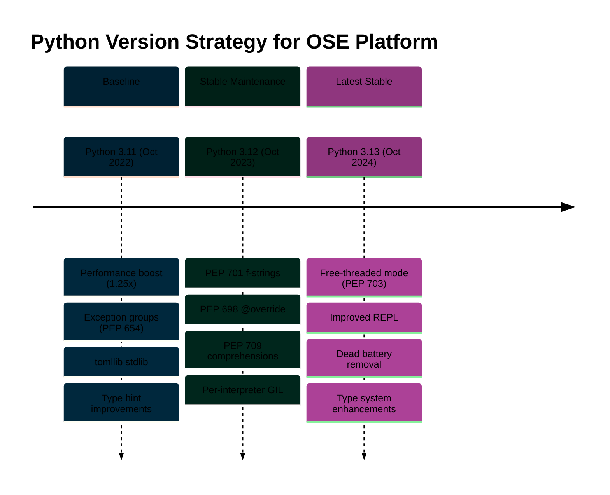

# Python Programming Language Documentation

**Quick Reference**: [Overview](#overview) | [Version Strategy](#python-version-strategy) | [Documentation Structure](#documentation-structure) | [Learning Paths](#learning-paths) | [Code Examples](#code-examples) | [Tools & Ecosystem](#tools-and-ecosystem) | [Resources](#resources-and-references)

## Overview

Python is a high-level, dynamically-typed programming language emphasizing code readability and developer productivity. Within the Open Sharia Enterprise platform, Python serves critical roles in data processing, machine learning, automation, API services, and financial calculations requiring precision and clarity.

### Why Python for OSE Platform

Python excels in domains essential to the platform:

- **Financial Calculations**: Decimal precision for Zakat, Murabaha, and QardHasan computations
- **Data Processing**: Rich ecosystem for analytics and reporting
- **API Services**: FastAPI and Django for high-performance web services
- **Machine Learning**: scikit-learn, TensorFlow, PyTorch for intelligent features
- **Automation**: Scriptable workflows and task automation
- **Type Safety**: Modern type hints with mypy for production reliability

### Python Philosophy

The [Zen of Python (PEP 20)](https://peps.python.org/pep-0020/) guides Python development:

- **Beautiful is better than ugly** - Write elegant, readable code
- **Explicit is better than implicit** - Clear intentions over magic
- **Simple is better than complex** - Minimize unnecessary abstraction
- **Complex is better than complicated** - Accept necessary complexity, avoid needless complication
- **Readability counts** - Code is read more than written
- **There should be one obvious way to do it** - Pythonic idioms over multiple approaches

## Software Engineering Principles

Python documentation in the OSE platform aligns with five core principles:

### 1. Documentation First

Python code requires comprehensive documentation:

- **Docstrings**: All public modules, classes, and functions have docstrings
- **Type Hints**: All function signatures include type annotations
- **README Files**: Each package includes purpose and usage documentation
- **API Documentation**: Automatic generation from docstrings via Sphinx/MkDocs

### 2. Accessibility First

Python documentation meets WCAG AA standards:

- **Color-Blind Friendly Diagrams**: Mermaid diagrams use accessible palette (#0173B2, #DE8F05, #029E73, #CC78BC)
- **Screen Reader Compatible**: Proper semantic markup and alt text
- **Clear Examples**: Code examples with explanatory comments
- **Progressive Disclosure**: Beginner to advanced learning paths

### 3. Simplicity Over Complexity

Python embraces simplicity:

- **Minimal Abstraction**: Build only what you need
- **Standard Library First**: Use built-in modules before external dependencies
- **Clear Over Clever**: Readable code beats concise tricks
- **Composition Over Inheritance**: Favor composition for flexibility

### 4. Explicit Over Implicit

Python values explicitness:

- **Type Hints**: Explicit type annotations with mypy validation
- **Configuration**: Explicit settings over environment magic
- **Error Handling**: Explicit exception handling over silent failures
- **Dependencies**: Explicit import statements and dependency declarations

### 5. Automation Over Manual

Python excels at automation:

- **Testing**: pytest for automated test suites
- **Linting**: Ruff and Black for automated code quality
- **Type Checking**: mypy for automated type validation
- **CI/CD**: Automated pipelines for build, test, deploy

## Python Version Strategy

The platform targets modern Python versions for optimal performance and features:

### Version Timeline



### Supported Versions

- **Python 3.11+** (Baseline): Minimum supported version with performance improvements
- **Python 3.12+** (Stable Maintenance): Recommended for production deployments
- **Python 3.13.x** (Latest Stable): Current stable release with experimental no-GIL mode

### Version Selection Guidelines

**Use Python 3.11** when:

- Maintaining legacy codebases requiring baseline compatibility
- Deploying to environments with conservative update policies
- Requiring stable, proven performance improvements

**Use Python 3.12** when:

- Building new production services requiring latest stable features
- Leveraging improved f-strings for complex formatting
- Using @override decorator for explicit method overriding
- Needing per-interpreter GIL for subinterpreter isolation

**Use Python 3.13** when:

- Experimenting with free-threaded mode (no-GIL) for CPU-bound parallelism
- Benefiting from improved REPL for interactive development
- Adopting latest type system improvements (TypedDict read-only, TypeIs)
- Building greenfield projects embracing cutting-edge features

## Documentation Structure

This documentation comprises 35 files organized into core topics and reusable templates:

### Core Documentation (23 Files)

**Foundation** (5 files):

- `README.md` (this file) - Overview and learning paths
- `ex-so-stla-py__best-practices.md` - PEP 8, PEP 20, modern patterns
- `ex-so-stla-py__idioms.md` - Pythonic patterns and EAFP
- `ex-so-stla-py__type-safety.md` - Type hints, mypy, Pydantic
- `ex-so-stla-py__error-handling.md` - Exceptions and context managers

**Core Patterns** (6 files):

- `ex-so-stla-py__functional-programming.md` - Pure functions, itertools, functools
- `ex-so-stla-py__classes-and-protocols.md` - Classes, protocols, dataclasses, Pydantic
- `ex-so-stla-py__domain-driven-design.md` - DDD with Python patterns
- `ex-so-stla-py__concurrency-and-parallelism.md` - asyncio, threading, multiprocessing, GIL
- `ex-so-stla-py__modules-and-dependencies.md` - pip, Poetry, pyproject.toml
- `ex-so-stla-py__anti-patterns.md` - Common mistakes to avoid

**Development Practices** (6 files):

- `ex-so-stla-py__test-driven-development.md` - pytest, unittest, hypothesis
- `ex-so-stla-py__behaviour-driven-development.md` - behave, pytest-bdd, Gherkin
- `ex-so-stla-py__linting-and-formatting.md` - Ruff, Black, mypy, pylint
- `ex-so-stla-py__security.md` - Injection prevention, auth, secrets management
- `ex-so-stla-py__performance.md` - Profiling, optimization, Cython, PyPy
- `ex-so-stla-py__memory-management.md` - Reference counting, garbage collection

**Advanced Topics** (3 files):

- `ex-so-stla-py__web-services.md` - FastAPI, Django, Flask, httpx
- `ex-so-stla-py__finite-state-machine.md` - FSM patterns with transitions library
- `ex-so-stla-py__release-3.13.md` - Latest Python 3.13 features

**Version Documentation** (2 files):

- `ex-so-stla-py__release-3.11.md` - Baseline Python 3.11 features
- `ex-so-stla-py__release-3.12.md` - Stable Python 3.12 features

**Templates Directory** (1 file):

- `templates/README.md` - Templates overview and usage guide

### Templates (12 Files)

**Domain-Driven Design** (6 templates):

- `templates/entity-template.md` - Entity pattern with Pydantic
- `templates/value-object-template.md` - Immutable value objects
- `templates/aggregate-template.md` - Aggregate root pattern
- `templates/domain-event-template.md` - Domain event pattern
- `templates/repository-template.md` - Repository pattern with async
- `templates/service-layer-template.md` - Application service pattern

**Testing** (2 templates):

- `templates/unit-test-template.md` - pytest unit test pattern
- `templates/integration-test-template.md` - pytest integration test pattern

**API Development** (2 templates):

- `templates/fastapi-endpoint-template.md` - FastAPI REST endpoint pattern
- `templates/async-worker-template.md` - Celery/Dramatiq async worker pattern

**Build Configuration** (1 template):

- `templates/build-configuration-template.md` - pyproject.toml configuration

## Learning Paths

### Beginner Path

Learn Python fundamentals and platform conventions:

1. **Start Here**: `ex-so-stla-py__best-practices.md` - Python style and conventions
2. **Pythonic Code**: `ex-so-stla-py__idioms.md` - Write idiomatic Python
3. **Type Safety**: `ex-so-stla-py__type-safety.md` - Type hints and validation
4. **Error Handling**: `ex-so-stla-py__error-handling.md` - Robust error management
5. **Testing Basics**: `ex-so-stla-py__test-driven-development.md` - Write testable code

**Estimated Learning**: Begin with best practices and idioms to establish solid foundations. Type safety and error handling are essential for production code. Testing practices ensure code quality from the start.

### Intermediate Path

Master Python patterns and domain modeling:

1. **Functional Patterns**: `ex-so-stla-py__functional-programming.md` - Functional Python
2. **Object-Oriented Design**: `ex-so-stla-py__classes-and-protocols.md` - Classes and protocols
3. **Domain Modeling**: `ex-so-stla-py__domain-driven-design.md` - DDD with Pydantic
4. **Concurrency**: `ex-so-stla-py__concurrency-and-parallelism.md` - Async and parallel patterns
5. **Code Quality**: `ex-so-stla-py__linting-and-formatting.md` - Automated quality tools

**Build Skills**: Combine functional and object-oriented paradigms effectively. Domain-driven design provides structure for complex business logic. Concurrency patterns enable scalable applications. Automated tooling maintains consistent code quality.

### Advanced Path

Build production systems and optimize performance:

1. **Web Services**: `ex-so-stla-py__web-services.md` - FastAPI, Django, Flask patterns
2. **State Machines**: `ex-so-stla-py__finite-state-machine.md` - Complex workflow modeling
3. **Security**: `ex-so-stla-py__security.md` - Secure coding practices
4. **Performance**: `ex-so-stla-py__performance.md` - Profiling and optimization
5. **Memory Management**: `ex-so-stla-py__memory-management.md` - Understanding Python's memory model

**Production Excellence**: Web service patterns enable robust APIs. State machines model complex business processes. Security practices protect sensitive financial data. Performance optimization ensures responsive systems. Memory management prevents resource leaks.

### Version-Specific Learning

Understand Python evolution and feature adoption:

1. **Baseline Features**: `ex-so-stla-py__release-3.11.md` - Python 3.11 improvements
2. **Stable Features**: `ex-so-stla-py__release-3.12.md` - Python 3.12 enhancements
3. **Latest Features**: `ex-so-stla-py__release-3.13.md` - Python 3.13 innovations

**Stay Current**: Version documentation explains when and why to adopt new features. Baseline features (3.11) provide performance improvements. Stable features (3.12) enhance developer experience. Latest features (3.13) unlock new capabilities like free-threaded mode.

## Code Examples

All Python documentation includes financial domain examples demonstrating Sharia-compliant business logic:

### Zakat Calculation

Zakat is Islamic alms-giving (2.5% of qualifying wealth). Python's Decimal type ensures precision:

```python
from decimal import Decimal
from datetime import date
from pydantic import BaseModel, Field, field_validator


class ZakatCalculation(BaseModel):
    """Calculate Zakat obligation for qualifying wealth."""

    wealth_amount: Decimal = Field(description="Total qualifying wealth")
    nisab_threshold: Decimal = Field(description="Minimum wealth requiring Zakat")
    calculation_date: date = Field(default_factory=date.today)
    zakat_rate: Decimal = Field(default=Decimal("0.025"), description="2.5% rate")

    @field_validator("wealth_amount", "nisab_threshold")
    @classmethod
    def validate_positive(cls, v: Decimal) -> Decimal:
        if v < 0:
            raise ValueError("Wealth amounts must be non-negative")
        return v

    def calculate_zakat(self) -> Decimal:
        """Calculate Zakat owed if wealth exceeds nisab."""
        if self.wealth_amount >= self.nisab_threshold:
            return self.wealth_amount * self.zakat_rate
        return Decimal("0")


# Usage
calculation = ZakatCalculation(
    wealth_amount=Decimal("100000.00"),
    nisab_threshold=Decimal("85000.00"),
)
zakat_owed = calculation.calculate_zakat()
print(f"Zakat owed: ${zakat_owed}")  # Output: Zakat owed: $2500.00
```

**Why this matters**: Pydantic provides runtime validation ensuring data integrity. Decimal type prevents floating-point errors in financial calculations. Type hints enable static analysis with mypy.

### QardHasan (Interest-Free Loan)

QardHasan represents benevolent interest-free loans:

```python
from dataclasses import dataclass
from datetime import date
from decimal import Decimal
from typing import Optional


@dataclass(frozen=True)
class QardHasanLoan:
    """Immutable value object for interest-free loan."""

    loan_id: str
    borrower_id: str
    principal_amount: Decimal
    disbursement_date: date
    repayment_date: Optional[date] = None
    repaid_amount: Decimal = Decimal("0")

    def __post_init__(self) -> None:
        if self.principal_amount <= 0:
            raise ValueError("Principal must be positive")
        if self.repaid_amount < 0:
            raise ValueError("Repaid amount cannot be negative")
        if self.repaid_amount > self.principal_amount:
            raise ValueError("Repaid amount exceeds principal")

    @property
    def remaining_balance(self) -> Decimal:
        """Calculate remaining loan balance."""
        return self.principal_amount - self.repaid_amount

    @property
    def is_fully_repaid(self) -> bool:
        """Check if loan is completely repaid."""
        return self.remaining_balance == Decimal("0")


# Usage
loan = QardHasanLoan(
    loan_id="QL-2025-001",
    borrower_id="BORROWER-123",
    principal_amount=Decimal("50000.00"),
    disbursement_date=date(2025, 1, 15),
    repaid_amount=Decimal("20000.00"),
)
print(f"Remaining: ${loan.remaining_balance}")  # Output: Remaining: $30000.00
```

**Why this matters**: Dataclass with `frozen=True` creates immutable value objects. `__post_init__` validates invariants. Properties provide computed attributes without storing redundant state.

### Murabaha (Cost-Plus Financing)

Murabaha is Islamic cost-plus financing where profit margin is disclosed upfront:

```python
from decimal import Decimal
from pydantic import BaseModel, Field, computed_field


class MurabahaContract(BaseModel):
    """Murabaha cost-plus financing contract."""

    contract_id: str
    asset_cost: Decimal = Field(gt=0, description="Original asset acquisition cost")
    profit_margin_rate: Decimal = Field(
        ge=0, le=1, description="Profit margin as decimal (0.15 = 15%)"
    )
    down_payment: Decimal = Field(ge=0, description="Initial down payment")

    @computed_field
    @property
    def profit_amount(self) -> Decimal:
        """Calculate profit based on cost and margin."""
        return self.asset_cost * self.profit_margin_rate

    @computed_field
    @property
    def total_selling_price(self) -> Decimal:
        """Calculate total price including profit."""
        return self.asset_cost + self.profit_amount

    @computed_field
    @property
    def financing_amount(self) -> Decimal:
        """Calculate amount to be financed after down payment."""
        return self.total_selling_price - self.down_payment


# Usage
contract = MurabahaContract(
    contract_id="MB-2025-001",
    asset_cost=Decimal("200000.00"),
    profit_margin_rate=Decimal("0.15"),  # 15% profit
    down_payment=Decimal("50000.00"),
)
print(f"Total price: ${contract.total_selling_price}")  # Output: Total price: $230000.00
print(f"Financing: ${contract.financing_amount}")  # Output: Financing: $180000.00
```

**Why this matters**: Pydantic's `computed_field` provides automatic property calculation. Field constraints (`gt=0`, `ge=0`, `le=1`) enforce business rules at the type level. Explicit profit disclosure aligns with Sharia principles.

## Tools and Ecosystem

### Essential Tools

**Package Management**:

- **pip**: Standard Python package installer
- **Poetry**: Dependency management with lock files
- **uv**: Modern, fast Python package installer (Rust-based)
- **pyproject.toml**: PEP 621 project metadata standard

**Testing**:

- **pytest**: Feature-rich testing framework
- **hypothesis**: Property-based testing
- **unittest**: Standard library testing framework
- **pytest-bdd**: Behavior-driven development with Gherkin

**Code Quality**:

- **Ruff**: Fast linter and formatter (Rust-based)
- **Black**: Opinionated code formatter
- **mypy**: Static type checker
- **pylint**: Comprehensive linting
- **isort**: Import sorting

**Type Checking**:

- **mypy**: Static type analysis
- **Pydantic**: Runtime validation with type hints
- **typing**: Standard library type hints
- **typing_extensions**: Backported and experimental types

### Web Frameworks

**FastAPI**: Async-first, OpenAPI-based, Pydantic-integrated

- High performance ASGI framework
- Automatic API documentation
- Built-in validation with Pydantic
- Native async/await support

**Django**: Batteries-included full-stack framework

- ORM, admin interface, authentication included
- Mature ecosystem and plugins
- Excellent documentation
- Strong security defaults

**Flask**: Minimalist, flexible micro-framework

- Simple, easy to learn
- Extensive extension ecosystem
- Full control over components
- Ideal for small services

### Async Libraries

**asyncio**: Standard library async framework

- Native async/await syntax
- Event loop and coroutines
- Async context managers
- Task scheduling and coordination

**httpx**: Async HTTP client

- Requests-compatible API
- HTTP/1.1 and HTTP/2 support
- Connection pooling
- Async and sync modes

**aiohttp**: Async HTTP client/server

- Client and server implementations
- WebSocket support
- Streaming responses
- Middleware support

### Domain-Driven Design Tools

**Pydantic**: Data validation and settings management

- Runtime validation with type hints
- Automatic JSON serialization
- Settings management
- FastAPI integration

**transitions**: State machine library

- Declarative state transitions
- Callbacks and conditions
- Nested and parallel states
- State diagram generation

**injector**: Dependency injection framework

- Type-safe dependency injection
- Scoped lifetimes
- Module-based configuration
- Testing support

## Resources and References

### Official Python Documentation

- [Python Documentation](https://docs.python.org/3/) - Official comprehensive guide
- [Python Status Versions](https://devguide.python.org/versions/) - Version lifecycle and support status
- [Python Enhancement Proposals (PEPs)](https://peps.python.org/) - Language evolution proposals
- [Python Packaging User Guide](https://packaging.python.org/) - Packaging and distribution

### Key PEPs (Python Enhancement Proposals)

**Style and Philosophy**:

- [PEP 8](https://peps.python.org/pep-0008/) - Style Guide for Python Code
- [PEP 20](https://peps.python.org/pep-0020/) - The Zen of Python

**Type System**:

- [PEP 484](https://peps.python.org/pep-0484/) - Type Hints
- [PEP 544](https://peps.python.org/pep-0544/) - Protocols (Structural Subtyping)
- [PEP 557](https://peps.python.org/pep-0557/) - Data Classes
- [PEP 705](https://peps.python.org/pep-0705/) - TypedDict Read-Only Items (3.13)
- [PEP 742](https://peps.python.org/pep-0742/) - TypeIs (3.13)

**Recent Features**:

- [PEP 654](https://peps.python.org/pep-0654/) - Exception Groups (3.11)
- [PEP 698](https://peps.python.org/pep-0698/) - Override Decorator (3.12)
- [PEP 701](https://peps.python.org/pep-0701/) - F-String Improvements (3.12)
- [PEP 703](https://peps.python.org/pep-0703/) - No-GIL Experiment (3.13)
- [PEP 709](https://peps.python.org/pep-0709/) - Comprehension Inlining (3.12)

**Packaging**:

- [PEP 621](https://peps.python.org/pep-0621/) - pyproject.toml Standard

### Platform Documentation

- [Java Documentation](../java/README.md) - JVM-based patterns
- [Elixir Documentation](../elixir/README.md) - Functional programming on BEAM
- [Golang Documentation](../golang/README.md) - Systems programming patterns

### Governance and Conventions

- [Repository Principles](../../../../../governance/principles/README.md) - Core principles
- [File Naming Convention](../../../../../governance/conventions/meta/file-naming.md) - Documentation standards
- [Content Quality Convention](../../../../../governance/conventions/content/quality.md) - Writing standards
- [Diátaxis Framework](../../../../../governance/conventions/meta/diataxis-framework.md) - Documentation organization
- [Color Accessibility Convention](../../../../../governance/conventions/formatting/color-accessibility.md) - WCAG AA compliance

### Community Resources

**Books**:

- "Fluent Python" by Luciano Ramalho - Advanced Python techniques
- "Effective Python" by Brett Slatkin - Best practices and patterns
- "Python Distilled" by David Beazley - Modern Python essentials
- "Architecture Patterns with Python" by Harry Percival & Bob Gregory - DDD and testing

**Online Learning**:

- [Real Python](https://realpython.com/) - Tutorials and articles
- [Python Morsels](https://www.pythonmorsels.com/) - Python exercises
- [Full Stack Python](https://www.fullstackpython.com/) - Web development guide

**Tools Documentation**:

- [pytest Documentation](https://docs.pytest.org/) - Testing framework
- [Pydantic Documentation](https://docs.pydantic.dev/) - Data validation
- [FastAPI Documentation](https://fastapi.tiangolo.com/) - Web framework
- [Ruff Documentation](https://docs.astral.sh/ruff/) - Fast linter and formatter
- [mypy Documentation](https://mypy.readthedocs.io/) - Static type checker

---

**Last Updated**: 2025-01-23
**Python Versions**: 3.11+ (baseline), 3.12+ (stable maintenance), 3.13.x (latest stable)
**Maintainers**: OSE Platform Documentation Team
