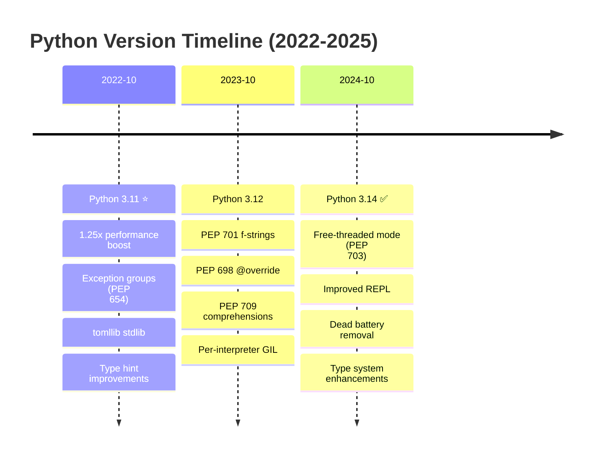

# Python Programming Language Documentation

**Quick Reference**: [Overview](#overview) | [Software Engineering Principles](#software-engineering-principles) | [Version Strategy](#python-version-strategy) | [Python in the Platform](#python-in-the-platform) | [Pythonic Philosophy](#pythonic-philosophy) | [Documentation Structure](#documentation-structure) | [Learning Paths](#learning-paths) | [Code Examples](#code-examples) | [Tools & Ecosystem](#tools-and-ecosystem) | [Resources](#resources-and-references)

## Overview

Python is a high-level, dynamically-typed programming language emphasizing code readability and developer productivity. Within the Open Sharia Enterprise platform, Python serves critical roles in data processing, machine learning, automation, API services, and financial calculations requiring precision and clarity.

### Why Python for OSE Platform

Python excels in domains essential to the platform:

- **Financial Calculations**: Decimal precision for Zakat, Murabaha, and QardHasan computations
- **Data Processing**: Rich ecosystem for analytics and reporting
- **API Services**: FastAPI and Django for high-performance web services
- **Machine Learning**: scikit-learn, TensorFlow, PyTorch for intelligent features
- **Automation**: Scriptable workflows and task automation
- **Type Safety**: Modern type hints with mypy for production reliability

### Python Philosophy

The [Zen of Python (PEP 20)](https://peps.python.org/pep-0020/) guides Python development:

- **Beautiful is better than ugly** - Write elegant, readable code
- **Explicit is better than implicit** - Clear intentions over magic
- **Simple is better than complex** - Minimize unnecessary abstraction
- **Complex is better than complicated** - Accept necessary complexity, avoid needless complication
- **Readability counts** - Code is read more than written
- **There should be one obvious way to do it** - Pythonic idioms over multiple approaches

## Software Engineering Principles

Python development in this platform follows the five software engineering principles from [governance/principles/software-engineering/](../../../../../governance/principles/software-engineering/README.md):

1. **[Automation Over Manual](../../../../../governance/principles/software-engineering/automation-over-manual.md)** - Python automates through pytest testing, black/ruff formatting, mypy type checking, and CI/CD pipelines
2. **[Explicit Over Implicit](../../../../../governance/principles/software-engineering/explicit-over-implicit.md)** - Python enforces through explicit imports, type hints, explicit error handling, clear function signatures
3. **[Immutability Over Mutability](../../../../../governance/principles/software-engineering/immutability.md)** - Python encourages immutable patterns through frozen dataclasses, tuples, functional programming, and immutable defaults
4. **[Pure Functions Over Side Effects](../../../../../governance/principles/software-engineering/pure-functions.md)** - Python supports through first-class functions, functional tools (map/filter/reduce), and functional core architecture
5. **[Reproducibility First](../../../../../governance/principles/software-engineering/reproducibility.md)** - Python enables through pyproject.toml, requirements.txt pinning, virtual environments, and deterministic builds

**See Also**: [Functional Programming](./ex-so-stla-py__functional-programming.md) for pure functions patterns, [Best Practices](./ex-so-stla-py__best-practices.md) for explicit coding standards, [Type Safety](./ex-so-stla-py__type-safety.md) for immutable type patterns.

## Python Version Strategy

The platform targets modern Python versions for optimal performance and features:

### Version Timeline



### Supported Versions

- **Python 3.11+** (Baseline): Minimum supported version with performance improvements
- **Python 3.12+** (Stable Maintenance): Recommended for production deployments
- **Python 3.14.x** (Latest Stable): Current stable release with experimental no-GIL mode

### Version Selection Guidelines

**Use Python 3.11** when:

- Maintaining legacy codebases requiring baseline compatibility
- Deploying to environments with conservative update policies
- Requiring stable, proven performance improvements

**Use Python 3.12** when:

- Building new production services requiring latest stable features
- Leveraging improved f-strings for complex formatting
- Using @override decorator for explicit method overriding
- Needing per-interpreter GIL for subinterpreter isolation

**Use Python 3.14** when:

- Experimenting with free-threaded mode (no-GIL) for CPU-bound parallelism
- Benefiting from improved REPL for interactive development
- Adopting latest type system improvements (TypedDict read-only, TypeIs)
- Building greenfield projects embracing cutting-edge features

## Python in the Platform

### Primary Use Cases

**Data Processing and Analytics**:

- Financial data analysis and reporting
- Zakat calculation pipelines
- Transaction processing and aggregation
- Statistical analysis of Islamic finance metrics
- Batch processing of large datasets

**API Services**:

- FastAPI for high-performance REST APIs
- Django for comprehensive web applications
- Flask for microservices and simple endpoints
- GraphQL APIs with Strawberry or Ariadne

**Machine Learning and AI**:

- Fraud detection in Islamic banking
- Recommendation systems for Halal investments
- Natural language processing for Shariah compliance
- Predictive analytics for Waqf (endowment) management

**Automation and Scripting**:

- Data migration scripts
- Deployment automation
- Report generation
- ETL (Extract, Transform, Load) pipelines
- Administrative task automation

### Framework Stack

**Web Frameworks**:

**FastAPI** (Modern async-first):

```python
from fastapi import FastAPI
from decimal import Decimal
from pydantic import BaseModel

app = FastAPI()

class ZakatRequest(BaseModel):
    wealth: Decimal
    nisab: Decimal

@app.post("/api/zakat/calculate")
async def calculate_zakat(request: ZakatRequest) -> dict:
    if request.wealth >= request.nisab:
        zakat = request.wealth * Decimal("0.025")
        return {"wealth": request.wealth, "zakat": zakat, "eligible": True}
    return {"wealth": request.wealth, "zakat": Decimal("0"), "eligible": False}
```

**Django** (Batteries-included framework):

```python
from django.db import models
from decimal import Decimal

class ZakatCalculation(models.Model):
    user = models.ForeignKey("User", on_delete=models.CASCADE)
    wealth_amount = models.DecimalField(max_digits=19, decimal_places=2)
    nisab_threshold = models.DecimalField(max_digits=19, decimal_places=2)
    zakat_amount = models.DecimalField(max_digits=19, decimal_places=2)
    calculation_date = models.DateTimeField(auto_now_add=True)

    def calculate(self) -> Decimal:
        """Calculate Zakat if wealth exceeds nisab."""
        if self.wealth_amount >= self.nisab_threshold:
            return self.wealth_amount * Decimal("0.025")
        return Decimal("0")
```

**Flask** (Minimalist micro-framework):

```python
from flask import Flask, request, jsonify
from decimal import Decimal

app = Flask(__name__)

@app.route("/api/zakat/calculate", methods=["POST"])
def calculate_zakat():
    data = request.get_json()
    wealth = Decimal(str(data["wealth"]))
    nisab = Decimal(str(data["nisab"]))

    if wealth >= nisab:
        zakat = wealth * Decimal("0.025")
        return jsonify({"wealth": float(wealth), "zakat": float(zakat)})
    return jsonify({"wealth": float(wealth), "zakat": 0})
```

**Testing Frameworks**:

**pytest** (Industry standard):

```python
import pytest
from decimal import Decimal
from zakat import calculate_zakat

def test_zakat_above_nisab():
    """Test Zakat calculation for wealth above nisab threshold."""
    result = calculate_zakat(Decimal("10000"), Decimal("5000"))
    assert result == Decimal("250")

def test_zakat_below_nisab():
    """Test Zakat calculation for wealth below nisab threshold."""
    result = calculate_zakat(Decimal("3000"), Decimal("5000"))
    assert result == Decimal("0")

@pytest.mark.parametrize(
    "wealth,nisab,expected",
    [
        (Decimal("10000"), Decimal("5000"), Decimal("250")),
        (Decimal("5000"), Decimal("5000"), Decimal("125")),
        (Decimal("3000"), Decimal("5000"), Decimal("0")),
    ],
)
def test_zakat_parametrized(wealth, nisab, expected):
    """Parametrized test for various Zakat scenarios."""
    assert calculate_zakat(wealth, nisab) == expected
```

**hypothesis** (Property-based testing):

```python
from hypothesis import given, strategies as st
from decimal import Decimal
from zakat import calculate_zakat

@given(
    wealth=st.decimals(min_value=0, max_value=1000000, places=2),
    nisab=st.decimals(min_value=0, max_value=1000000, places=2),
)
def test_zakat_properties(wealth, nisab):
    """Property-based test ensuring Zakat calculation invariants."""
    result = calculate_zakat(wealth, nisab)

    # Property 1: Result is always non-negative
    assert result >= 0

    # Property 2: Result is 0 if wealth < nisab
    if wealth < nisab:
        assert result == 0

    # Property 3: Result is 2.5% if wealth >= nisab
    if wealth >= nisab:
        assert result == wealth * Decimal("0.025")
```

### Architectural Patterns

**Hexagonal Architecture** (Ports and Adapters):

```python
from abc import ABC, abstractmethod
from decimal import Decimal
from typing import Protocol

# Domain core - pure Python, no frameworks
class ZakatPort(ABC):
    """Port for Zakat calculation domain logic."""

    @abstractmethod
    def calculate(self, wealth: Decimal) -> Decimal:
        """Calculate Zakat owed."""
        pass

class ZakatCalculator(ZakatPort):
    """Core Zakat calculation logic."""

    def __init__(self, nisab: Decimal, rate: Decimal = Decimal("0.025")):
        self.nisab = nisab
        self.rate = rate

    def calculate(self, wealth: Decimal) -> Decimal:
        if wealth >= self.nisab:
            return wealth * self.rate
        return Decimal("0")

# Infrastructure adapter - HTTP
from fastapi import FastAPI, HTTPException
from pydantic import BaseModel

app = FastAPI()

class ZakatRequest(BaseModel):
    wealth: Decimal
    nisab: Decimal

@app.post("/api/zakat")
async def calculate_zakat_endpoint(request: ZakatRequest):
    """HTTP adapter for Zakat calculation."""
    calculator = ZakatCalculator(nisab=request.nisab)
    zakat = calculator.calculate(request.wealth)
    return {"wealth": request.wealth, "zakat": zakat}
```

**Functional Core, Imperative Shell**:

```python
from decimal import Decimal
from typing import NamedTuple

# Functional core - pure functions, no side effects
class ZakatResult(NamedTuple):
    """Immutable result of Zakat calculation."""
    wealth: Decimal
    nisab: Decimal
    zakat_owed: Decimal
    eligible: bool

def calculate_zakat(wealth: Decimal, nisab: Decimal) -> ZakatResult:
    """Pure function - deterministic Zakat calculation."""
    eligible = wealth >= nisab
    zakat_owed = wealth * Decimal("0.025") if eligible else Decimal("0")

    return ZakatResult(
        wealth=wealth,
        nisab=nisab,
        zakat_owed=zakat_owed,
        eligible=eligible,
    )

def validate_zakat_input(wealth: Decimal, nisab: Decimal) -> tuple[bool, str]:
    """Pure validation function."""
    if wealth < 0:
        return False, "Wealth cannot be negative"
    if nisab < 0:
        return False, "Nisab cannot be negative"
    return True, ""

# Imperative shell - side effects at boundaries
import asyncio
from datetime import datetime

async def process_zakat_request(
    user_id: str,
    wealth: Decimal,
    nisab: Decimal,
    db_session,
) -> ZakatResult:
    """Imperative shell handling I/O and side effects."""
    # Validation (pure)
    is_valid, error_msg = validate_zakat_input(wealth, nisab)
    if not is_valid:
        raise ValueError(error_msg)

    # Calculation (pure)
    result = calculate_zakat(wealth, nisab)

    # Side effects at boundary
    await db_session.execute(
        """
        INSERT INTO zakat_calculations (user_id, wealth, nisab, zakat_owed, calculated_at)
        VALUES ($1, $2, $3, $4, $5)
        """,
        user_id,
        result.wealth,
        result.nisab,
        result.zakat_owed,
        datetime.utcnow(),
    )

    return result
```

**Event-Driven Architecture**:

```python
from dataclasses import dataclass
from datetime import datetime
from decimal import Decimal
from typing import Protocol
from uuid import UUID, uuid4

# Domain events
@dataclass(frozen=True)
class DomainEvent:
    """Base class for domain events."""
    event_id: UUID
    occurred_at: datetime
    event_type: str

@dataclass(frozen=True)
class ZakatCalculatedEvent(DomainEvent):
    """Event emitted when Zakat is calculated."""
    donor_id: str
    wealth: Decimal
    zakat_amount: Decimal

    def __post_init__(self):
        object.__setattr__(self, "event_type", "ZakatCalculated")

# Event bus
class EventHandler(Protocol):
    """Protocol for event handlers."""
    def handle(self, event: DomainEvent) -> None:
        ...

class EventBus:
    """Simple event bus for domain events."""

    def __init__(self):
        self._handlers: dict[str, list[EventHandler]] = {}

    def subscribe(self, event_type: str, handler: EventHandler) -> None:
        """Subscribe handler to event type."""
        if event_type not in self._handlers:
            self._handlers[event_type] = []
        self._handlers[event_type].append(handler)

    def publish(self, event: DomainEvent) -> None:
        """Publish event to all subscribers."""
        handlers = self._handlers.get(event.event_type, [])
        for handler in handlers:
            handler.handle(event)

# Usage
class ZakatNotificationHandler:
    """Handler for Zakat calculation notifications."""

    def handle(self, event: DomainEvent) -> None:
        if isinstance(event, ZakatCalculatedEvent):
            print(f"Zakat calculated for donor {event.donor_id}: {event.zakat_amount}")
            # Send notification, update analytics, etc.

event_bus = EventBus()
event_bus.subscribe("ZakatCalculated", ZakatNotificationHandler())

# Emit event
event = ZakatCalculatedEvent(
    event_id=uuid4(),
    occurred_at=datetime.utcnow(),
    event_type="ZakatCalculated",
    donor_id="donor-123",
    wealth=Decimal("10000"),
    zakat_amount=Decimal("250"),
)
event_bus.publish(event)
```

### Real-World OSE Platform Examples

**Example 1: Murabaha Contract Validation**:

```python
from decimal import Decimal
from dataclasses import dataclass
from typing import Optional

@dataclass(frozen=True)
class MurabahaContract:
    """Immutable Murabaha contract value object."""
    contract_id: str
    asset_cost: Decimal
    profit_margin_rate: Decimal
    down_payment: Decimal

    def __post_init__(self):
        """Validate contract invariants."""
        if self.asset_cost <= 0:
            raise ValueError("Asset cost must be positive")
        if not (0 <= self.profit_margin_rate <= 1):
            raise ValueError("Profit margin rate must be between 0 and 1")
        if self.down_payment < 0:
            raise ValueError("Down payment cannot be negative")
        if self.down_payment > self.total_selling_price:
            raise ValueError("Down payment exceeds total price")

    @property
    def profit_amount(self) -> Decimal:
        """Calculate profit based on cost and margin."""
        return self.asset_cost * self.profit_margin_rate

    @property
    def total_selling_price(self) -> Decimal:
        """Calculate total price including profit."""
        return self.asset_cost + self.profit_amount

    @property
    def financing_amount(self) -> Decimal:
        """Calculate amount to be financed after down payment."""
        return self.total_selling_price - self.down_payment

# Usage with validation
contract = MurabahaContract(
    contract_id="MB-2026-001",
    asset_cost=Decimal("200000.00"),
    profit_margin_rate=Decimal("0.15"),  # 15% profit
    down_payment=Decimal("50000.00"),
)

print(f"Profit: {contract.profit_amount}")  # 30000.00
print(f"Total: {contract.total_selling_price}")  # 230000.00
print(f"Financing: {contract.financing_amount}")  # 180000.00
```

**Example 2: Waqf (Endowment) Portfolio Management**:

```python
from decimal import Decimal
from typing import List, Protocol
from dataclasses import dataclass, field

class Investment(Protocol):
    """Protocol for Shariah-compliant investments."""
    def calculate_return(self) -> Decimal:
        ...

    def is_shariah_compliant(self) -> bool:
        ...

@dataclass(frozen=True)
class PropertyInvestment:
    """Real estate investment for Waqf."""
    property_id: str
    purchase_price: Decimal
    monthly_rental_income: Decimal
    months_held: int

    def calculate_return(self) -> Decimal:
        """Calculate total rental income."""
        return self.monthly_rental_income * self.months_held

    def is_shariah_compliant(self) -> bool:
        """Property investments are Shariah-compliant."""
        return True

@dataclass(frozen=True)
class WaqfPortfolio:
    """Immutable Waqf portfolio with multiple investments."""
    waqf_id: str
    investments: tuple[Investment, ...] = field(default_factory=tuple)

    @property
    def total_returns(self) -> Decimal:
        """Calculate total returns from all investments."""
        return sum(
            inv.calculate_return() for inv in self.investments
        )

    @property
    def all_shariah_compliant(self) -> bool:
        """Verify all investments are Shariah-compliant."""
        return all(inv.is_shariah_compliant() for inv in self.investments)

# Usage
property1 = PropertyInvestment(
    property_id="PROP-001",
    purchase_price=Decimal("500000"),
    monthly_rental_income=Decimal("5000"),
    months_held=12,
)

property2 = PropertyInvestment(
    property_id="PROP-002",
    purchase_price=Decimal("300000"),
    monthly_rental_income=Decimal("3000"),
    months_held=12,
)

portfolio = WaqfPortfolio(
    waqf_id="WAQF-001",
    investments=(property1, property2),
)

print(f"Total returns: {portfolio.total_returns}")  # 96000
print(f"Shariah compliant: {portfolio.all_shariah_compliant}")  # True
```

## Pythonic Philosophy

The Zen of Python provides philosophical guidance that aligns remarkably well with Islamic values and the needs of Shariah-compliant enterprise development.

### Beautiful is better than ugly

**Python Principle**: Code should be aesthetically pleasing and well-structured.

**OSE Platform Interpretation**: Financial code represents Amanah (trustworthiness). Beautiful, well-organized code demonstrates respect for responsibility and professionalism expected in Islamic business.

**Example**:

```python
# PASS: Beautiful - clear structure, readable
@dataclass(frozen=True)
class ZakatCalculation:
    wealth: Decimal
    nisab: Decimal

    @property
    def zakat_owed(self) -> Decimal:
        return self.wealth * Decimal("0.025") if self.wealth >= self.nisab else Decimal("0")

# FAIL: Ugly - cryptic, hard to verify
def z(w, n):
    return w * 0.025 if w >= n else 0  # What is w? What is n?
```

### Explicit is better than implicit

**Python Principle**: Make behavior clear and obvious, avoid hidden magic.

**OSE Platform Interpretation**: Transparency is fundamental to Shariah compliance. Explicit code enables scholars and auditors to verify Islamic finance logic without guessing hidden assumptions.

**Example**:

```python
# PASS: Explicit - all parameters visible
def calculate_murabaha_total(
    cost: Decimal,
    markup_rate: Decimal,
    tax_rate: Decimal,
) -> Decimal:
    markup = cost * markup_rate
    subtotal = cost + markup
    tax = subtotal * tax_rate
    return subtotal + tax

# FAIL: Implicit - hidden global dependencies
DEFAULT_TAX_RATE = Decimal("0.05")  # Hidden

def calculate_murabaha_total(cost: Decimal, markup_rate: Decimal) -> Decimal:
    return cost * (1 + markup_rate) * (1 + DEFAULT_TAX_RATE)  # Where does tax come from?
```

### Simple is better than complex

**Python Principle**: Favor simplicity over unnecessary complexity.

**OSE Platform Interpretation**: Simple code is easier to audit for Shariah compliance. Complex abstractions make it harder for Islamic scholars to verify calculations follow Islamic law.

**Example**:

```python
# PASS: Simple - straightforward calculation
def is_eligible_for_zakat(wealth: Decimal, nisab: Decimal) -> bool:
    return wealth >= nisab

# FAIL: Overly complex - unnecessary abstraction
class ZakatEligibilityChecker:
    def __init__(self, strategy: EligibilityStrategy):
        self.strategy = strategy

    def check(self, wealth: Decimal) -> bool:
        return self.strategy.evaluate(wealth)
```

### Readability counts

**Python Principle**: Code is read far more often than written.

**OSE Platform Interpretation**: Readable code serves as documentation for Shariah compliance. Future auditors, scholars, and developers must understand Islamic finance logic years after it was written.

**Example**:

```python
# PASS: Readable - self-documenting with descriptive names
def distribute_mudharabah_profit(
    total_profit: Decimal,
    investor_share_ratio: Decimal,
) -> tuple[Decimal, Decimal]:
    """
    Distribute profit in Mudharabah partnership.

    Args:
        total_profit: Total profit to be distributed
        investor_share_ratio: Investor's share (e.g., 0.7 for 70%)

    Returns:
        Tuple of (investor_share, manager_share)
    """
    investor_share = total_profit * investor_share_ratio
    manager_share = total_profit - investor_share
    return investor_share, manager_share

# FAIL: Cryptic - requires comments to understand
def dp(p, r):  # distribute profit
    i = p * r  # investor
    m = p - i  # manager
    return i, m
```

### There should be one obvious way to do it

**Python Principle**: Prefer a single, obvious approach over multiple ways.

**OSE Platform Interpretation**: Consistency in implementing Islamic finance rules prevents confusion. When calculating Zakat, there should be one standard, verified approach everyone uses.

**Example**:

```python
# PASS: One obvious way - standard library Decimal
from decimal import Decimal

def calculate_zakat(wealth: Decimal, nisab: Decimal) -> Decimal:
    """Standard approach using Decimal for precision."""
    return wealth * Decimal("0.025") if wealth >= nisab else Decimal("0")

# FAIL: Multiple inconsistent ways
def calculate_zakat_v1(wealth: float, nisab: float) -> float:
    return wealth * 0.025 if wealth >= nisab else 0  # Float precision issues

def calculate_zakat_v2(wealth: int, nisab: int) -> int:
    return wealth * 25 // 1000 if wealth >= nisab else 0  # Integer division

# Which one is correct? Creates confusion and potential errors.
```

### Zen Principles Alignment Summary

| Zen Principle                    | Islamic Value           | OSE Platform Benefit                      |
| -------------------------------- | ----------------------- | ----------------------------------------- |
| Beautiful is better than ugly    | Ihsan (excellence)      | Professional code reflects Islamic values |
| Explicit is better than implicit | Transparency (Amanah)   | Auditable Shariah compliance              |
| Simple is better than complex    | Wisdom (Hikmah)         | Accessible to scholars and developers     |
| Readability counts               | Knowledge sharing (Ilm) | Long-term maintainability                 |
| One obvious way                  | Consistency (Istiqamah) | Standard Islamic finance implementations  |

## Documentation Structure

This documentation comprises 35 files organized into core topics and reusable templates:

### Core Documentation (23 Files)

**Foundation** (5 files):

- `README.md` (this file) - Overview and learning paths
- `ex-so-stla-py__best-practices.md` - PEP 8, PEP 20, modern patterns
- `ex-so-stla-py__idioms.md` - Pythonic patterns and EAFP
- `ex-so-stla-py__type-safety.md` - Type hints, mypy, Pydantic
- `ex-so-stla-py__error-handling.md` - Exceptions and context managers

**Core Patterns** (6 files):

- `ex-so-stla-py__functional-programming.md` - Pure functions, itertools, functools
- `ex-so-stla-py__classes-and-protocols.md` - Classes, protocols, dataclasses, Pydantic
- `ex-so-stla-py__domain-driven-design.md` - DDD with Python patterns
- `ex-so-stla-py__concurrency-and-parallelism.md` - asyncio, threading, multiprocessing, GIL
- `ex-so-stla-py__modules-and-dependencies.md` - pip, Poetry, pyproject.toml
- `ex-so-stla-py__anti-patterns.md` - Common mistakes to avoid

**Development Practices** (6 files):

- `ex-so-stla-py__test-driven-development.md` - pytest, unittest, hypothesis
- `ex-so-stla-py__behaviour-driven-development.md` - behave, pytest-bdd, Gherkin
- `ex-so-stla-py__linting-and-formatting.md` - Ruff, Black, mypy, pylint
- `ex-so-stla-py__security.md` - Injection prevention, auth, secrets management
- `ex-so-stla-py__performance.md` - Profiling, optimization, Cython, PyPy
- `ex-so-stla-py__memory-management.md` - Reference counting, garbage collection

**Advanced Topics** (3 files):

- `ex-so-stla-py__web-services.md` - FastAPI, Django, Flask, httpx
- `ex-so-stla-py__finite-state-machine.md` - FSM patterns with transitions library
- `ex-so-stla-py__release-3.14.md` - Latest Python 3.14 features

**Version Documentation** (2 files):

- `ex-so-stla-py__release-3.11.md` - Baseline Python 3.11 features
- `ex-so-stla-py__release-3.12.md` - Stable Python 3.12 features

**Templates Directory** (1 file):

- `templates/README.md` - Templates overview and usage guide

### Templates (12 Files)

**Domain-Driven Design** (6 templates):

- `templates/entity-template.md` - Entity pattern with Pydantic
- `templates/value-object-template.md` - Immutable value objects
- `templates/aggregate-template.md` - Aggregate root pattern
- `templates/domain-event-template.md` - Domain event pattern
- `templates/repository-template.md` - Repository pattern with async
- `templates/service-layer-template.md` - Application service pattern

**Testing** (2 templates):

- `templates/unit-test-template.md` - pytest unit test pattern
- `templates/integration-test-template.md` - pytest integration test pattern

**API Development** (2 templates):

- `templates/fastapi-endpoint-template.md` - FastAPI REST endpoint pattern
- `templates/async-worker-template.md` - Celery/Dramatiq async worker pattern

**Build Configuration** (1 template):

- `templates/build-configuration-template.md` - pyproject.toml configuration

## Learning Paths

### Beginner Path

Learn Python fundamentals and platform conventions:

1. **Start Here**: `ex-so-stla-py__best-practices.md` - Python style and conventions
2. **Pythonic Code**: `ex-so-stla-py__idioms.md` - Write idiomatic Python
3. **Type Safety**: `ex-so-stla-py__type-safety.md` - Type hints and validation
4. **Error Handling**: `ex-so-stla-py__error-handling.md` - Robust error management
5. **Testing Basics**: `ex-so-stla-py__test-driven-development.md` - Write testable code

**Estimated Learning**: Begin with best practices and idioms to establish solid foundations. Type safety and error handling are essential for production code. Testing practices ensure code quality from the start.

### Intermediate Path

Master Python patterns and domain modeling:

1. **Functional Patterns**: `ex-so-stla-py__functional-programming.md` - Functional Python
2. **Object-Oriented Design**: `ex-so-stla-py__classes-and-protocols.md` - Classes and protocols
3. **Domain Modeling**: `ex-so-stla-py__domain-driven-design.md` - DDD with Pydantic
4. **Concurrency**: `ex-so-stla-py__concurrency-and-parallelism.md` - Async and parallel patterns
5. **Code Quality**: `ex-so-stla-py__linting-and-formatting.md` - Automated quality tools

**Build Skills**: Combine functional and object-oriented paradigms effectively. Domain-driven design provides structure for complex business logic. Concurrency patterns enable scalable applications. Automated tooling maintains consistent code quality.

### Advanced Path

Build production systems and optimize performance:

1. **Web Services**: `ex-so-stla-py__web-services.md` - FastAPI, Django, Flask patterns
2. **State Machines**: `ex-so-stla-py__finite-state-machine.md` - Complex workflow modeling
3. **Security**: `ex-so-stla-py__security.md` - Secure coding practices
4. **Performance**: `ex-so-stla-py__performance.md` - Profiling and optimization
5. **Memory Management**: `ex-so-stla-py__memory-management.md` - Understanding Python's memory model

**Production Excellence**: Web service patterns enable robust APIs. State machines model complex business processes. Security practices protect sensitive financial data. Performance optimization ensures responsive systems. Memory management prevents resource leaks.

### Version-Specific Learning

Understand Python evolution and feature adoption:

1. **Baseline Features**: `ex-so-stla-py__release-3.11.md` - Python 3.11 improvements
2. **Stable Features**: `ex-so-stla-py__release-3.12.md` - Python 3.12 enhancements
3. **Latest Features**: `ex-so-stla-py__release-3.14.md` - Python 3.14 innovations

**Stay Current**: Version documentation explains when and why to adopt new features. Baseline features (3.11) provide performance improvements. Stable features (3.12) enhance developer experience. Latest features (3.14) unlock new capabilities like free-threaded mode.

## Code Examples

All Python documentation includes financial domain examples demonstrating Sharia-compliant business logic:

### Zakat Calculation

Zakat is Islamic alms-giving (2.5% of qualifying wealth). Python's Decimal type ensures precision:

```python
from decimal import Decimal
from datetime import date
from pydantic import BaseModel, Field, field_validator


class ZakatCalculation(BaseModel):
    """Calculate Zakat obligation for qualifying wealth."""

    wealth_amount: Decimal = Field(description="Total qualifying wealth")
    nisab_threshold: Decimal = Field(description="Minimum wealth requiring Zakat")
    calculation_date: date = Field(default_factory=date.today)
    zakat_rate: Decimal = Field(default=Decimal("0.025"), description="2.5% rate")

    @field_validator("wealth_amount", "nisab_threshold")
    @classmethod
    def validate_positive(cls, v: Decimal) -> Decimal:
        if v < 0:
            raise ValueError("Wealth amounts must be non-negative")
        return v

    def calculate_zakat(self) -> Decimal:
        """Calculate Zakat owed if wealth exceeds nisab."""
        if self.wealth_amount >= self.nisab_threshold:
            return self.wealth_amount * self.zakat_rate
        return Decimal("0")


# Usage
calculation = ZakatCalculation(
    wealth_amount=Decimal("100000.00"),
    nisab_threshold=Decimal("85000.00"),
)
zakat_owed = calculation.calculate_zakat()
print(f"Zakat owed: ${zakat_owed}")  # Output: Zakat owed: $2500.00
```

**Why this matters**: Pydantic provides runtime validation ensuring data integrity. Decimal type prevents floating-point errors in financial calculations. Type hints enable static analysis with mypy.

### QardHasan (Interest-Free Loan)

QardHasan represents benevolent interest-free loans:

```python
from dataclasses import dataclass
from datetime import date
from decimal import Decimal
from typing import Optional


@dataclass(frozen=True)
class QardHasanLoan:
    """Immutable value object for interest-free loan."""

    loan_id: str
    borrower_id: str
    principal_amount: Decimal
    disbursement_date: date
    repayment_date: Optional[date] = None
    repaid_amount: Decimal = Decimal("0")

    def __post_init__(self) -> None:
        if self.principal_amount <= 0:
            raise ValueError("Principal must be positive")
        if self.repaid_amount < 0:
            raise ValueError("Repaid amount cannot be negative")
        if self.repaid_amount > self.principal_amount:
            raise ValueError("Repaid amount exceeds principal")

    @property
    def remaining_balance(self) -> Decimal:
        """Calculate remaining loan balance."""
        return self.principal_amount - self.repaid_amount

    @property
    def is_fully_repaid(self) -> bool:
        """Check if loan is completely repaid."""
        return self.remaining_balance == Decimal("0")


# Usage
loan = QardHasanLoan(
    loan_id="QL-2025-001",
    borrower_id="BORROWER-123",
    principal_amount=Decimal("50000.00"),
    disbursement_date=date(2025, 1, 15),
    repaid_amount=Decimal("20000.00"),
)
print(f"Remaining: ${loan.remaining_balance}")  # Output: Remaining: $30000.00
```

**Why this matters**: Dataclass with `frozen=True` creates immutable value objects. `__post_init__` validates invariants. Properties provide computed attributes without storing redundant state.

### Murabaha (Cost-Plus Financing)

Murabaha is Islamic cost-plus financing where profit margin is disclosed upfront:

```python
from decimal import Decimal
from pydantic import BaseModel, Field, computed_field


class MurabahaContract(BaseModel):
    """Murabaha cost-plus financing contract."""

    contract_id: str
    asset_cost: Decimal = Field(gt=0, description="Original asset acquisition cost")
    profit_margin_rate: Decimal = Field(
        ge=0, le=1, description="Profit margin as decimal (0.15 = 15%)"
    )
    down_payment: Decimal = Field(ge=0, description="Initial down payment")

    @computed_field
    @property
    def profit_amount(self) -> Decimal:
        """Calculate profit based on cost and margin."""
        return self.asset_cost * self.profit_margin_rate

    @computed_field
    @property
    def total_selling_price(self) -> Decimal:
        """Calculate total price including profit."""
        return self.asset_cost + self.profit_amount

    @computed_field
    @property
    def financing_amount(self) -> Decimal:
        """Calculate amount to be financed after down payment."""
        return self.total_selling_price - self.down_payment


# Usage
contract = MurabahaContract(
    contract_id="MB-2025-001",
    asset_cost=Decimal("200000.00"),
    profit_margin_rate=Decimal("0.15"),  # 15% profit
    down_payment=Decimal("50000.00"),
)
print(f"Total price: ${contract.total_selling_price}")  # Output: Total price: $230000.00
print(f"Financing: ${contract.financing_amount}")  # Output: Financing: $180000.00
```

**Why this matters**: Pydantic's `computed_field` provides automatic property calculation. Field constraints (`gt=0`, `ge=0`, `le=1`) enforce business rules at the type level. Explicit profit disclosure aligns with Sharia principles.

## Tools and Ecosystem

### Essential Tools

**Package Management**:

- **pip**: Standard Python package installer
- **uv**: Modern, ultra-fast Python package installer (Rust-based, 10-100x faster than pip)
- **Poetry**: Dependency management with lock files and virtual environment management
- **Rye**: Fast Python package management and project tool (from Armin Ronacher, creator of Flask)
- **pyproject.toml**: PEP 621 project metadata standard (modern replacement for setup.py)

**Modern Package Managers Comparison**:

| Tool   | Speed    | Key Features                        | Use Case                      |
| ------ | -------- | ----------------------------------- | ----------------------------- |
| pip    | Baseline | Standard, universal                 | Legacy projects, simple needs |
| uv     | 10-100x  | Rust-based, drop-in pip replacement | Speed-critical, CI/CD         |
| Poetry | 2-3x     | Dependency resolution, virtual envs | Complete project management   |
| Rye    | 5-10x    | Toolchain management, workspaces    | Modern monorepo projects      |

**Testing**:

- **pytest**: Feature-rich testing framework (industry standard)
- **hypothesis**: Property-based testing for robust test coverage
- **unittest**: Standard library testing framework (legacy)
- **pytest-bdd**: Behavior-driven development with Gherkin scenarios
- **pytest-cov**: Code coverage reporting integration
- **tox**: Testing across multiple Python versions

**Code Quality**:

- **Ruff**: Extremely fast linter and formatter (Rust-based, 10-100x faster than alternatives, replaces Flake8, isort, and more)
- **Black**: Opinionated code formatter (zero-configuration)
- **mypy**: Static type checker for type hints
- **pylint**: Comprehensive linting (slower but thorough)
- **isort**: Import sorting (if not using Ruff)
- **pre-commit**: Git hook framework for automated quality checks

**Ruff vs Traditional Tools**:

```bash
# Traditional approach (multiple tools)
flake8 .           # Linting
isort .            # Import sorting
black .            # Formatting
pyupgrade .        # Syntax modernization

# Modern approach (single tool, 10-100x faster)
ruff check .       # Linting + pyupgrade + isort
ruff format .      # Formatting (Black-compatible)
```

**Type Checking**:

- **mypy**: Most popular static type checker
- **pyright**: Fast type checker from Microsoft (used in VS Code Pylance)
- **pyre**: Facebook's type checker (performance-focused)
- **Pydantic**: Runtime validation with type hints
- **typing**: Standard library type hints
- **typing_extensions**: Backported and experimental types

### Web Frameworks

**FastAPI**: Async-first, OpenAPI-based, Pydantic-integrated

- High performance ASGI framework (comparable to Node.js/Go)
- Automatic API documentation (Swagger UI, ReDoc)
- Built-in validation with Pydantic
- Native async/await support
- Dependency injection system
- WebSocket support

**Django**: Batteries-included full-stack framework

- ORM with migrations
- Admin interface out-of-the-box
- Authentication and authorization
- Form handling and validation
- Template engine
- Excellent documentation
- Strong security defaults
- Mature ecosystem (Django REST Framework, Celery, Channels)

**Flask**: Minimalist, flexible micro-framework

- Simple, easy to learn
- Extensive extension ecosystem
- Full control over components
- Ideal for small services and APIs
- Blueprints for modular applications
- Jinja2 template engine

**Framework Comparison for OSE Platform**:

| Framework | Best For                               | Performance | Learning Curve |
| --------- | -------------------------------------- | ----------- | -------------- |
| FastAPI   | Modern APIs, high-performance services | Excellent   | Moderate       |
| Django    | Full-stack apps, admin interfaces      | Good        | Steep          |
| Flask     | Small services, prototypes             | Good        | Easy           |

### Async Libraries

**asyncio**: Standard library async framework

- Native async/await syntax
- Event loop and coroutines
- Async context managers
- Task scheduling and coordination
- Timeout and cancellation support

**httpx**: Async HTTP client

- Requests-compatible API
- HTTP/1.1 and HTTP/2 support
- Connection pooling
- Async and sync modes
- Excellent for testing async web services

**aiohttp**: Async HTTP client/server

- Client and server implementations
- WebSocket support
- Streaming responses
- Middleware support
- Session management

### Domain-Driven Design Tools

**Pydantic**: Data validation and settings management

- Runtime validation with type hints
- Automatic JSON serialization
- Settings management from environment
- FastAPI integration
- V2 offers 5-50x performance improvement

**transitions**: State machine library

- Declarative state transitions
- Callbacks and conditions
- Nested and parallel states
- State diagram generation (Graphviz)
- Ideal for workflow management (Murabaha contracts, Waqf administration)

**injector**: Dependency injection framework

- Type-safe dependency injection
- Scoped lifetimes (singleton, request, etc.)
- Module-based configuration
- Testing support with mock injection

### Data Processing

**pandas**: Data analysis library

- DataFrame and Series data structures
- CSV/Excel/SQL/JSON data I/O
- Data cleaning and transformation
- Statistical analysis
- Time series analysis

**polars**: Fast DataFrame library (Rust-based)

- 5-10x faster than pandas
- Lazy evaluation for optimization
- Expression-based API
- Better memory efficiency
- Growing adoption for large-scale data

**NumPy**: Numerical computing

- N-dimensional arrays
- Mathematical functions
- Linear algebra
- Random number generation
- Foundation for pandas, SciPy, scikit-learn

### Version Management

**pyenv**: Python version management

- Install and switch between multiple Python versions
- Project-specific Python version pinning
- Works on macOS and Linux

**asdf**: Multi-language version manager

- Single tool for Python, Node.js, Ruby, etc.
- Plugin-based architecture
- `.tool-versions` file for reproducibility

**uv**: Built-in Python version management (modern approach)

- Manages Python versions and packages in one tool
- Extremely fast (Rust-based)
- Drop-in replacement for pyenv + pip

### Reproducible Python Development

**Version Management with pyenv (Recommended)**:

```bash
# Install pyenv
curl https://pyenv.run | bash

# Install Python 3.14.1
pyenv install 3.14.1

# Set local Python version for project
pyenv local 3.14.1

# Verify
python --version  # Python 3.14.1
```

**Virtual Environments**:

```bash
# Create virtual environment
python -m venv .venv

# Activate (Linux/macOS)
source .venv/bin/activate

# Activate (Windows)
.venv\Scripts\activate

# Install dependencies
pip install -r requirements.txt
```

**Modern Dependency Management with uv**:

```bash
# Install uv
curl -LsSf https://astral.sh/uv/install.sh | sh

# Create project with uv (includes virtual env)
uv venv

# Install dependencies (10-100x faster than pip)
uv pip install -r requirements.txt

# Add dependency
uv pip install fastapi

# Generate lockfile
uv pip freeze > requirements.txt
```

**pyproject.toml (Modern Standard)**:

```toml
[project]
name = "ose-zakat-service"
version = "1.0.0"
description = "Zakat calculation service for OSE Platform"
requires-python = ">=3.11"
dependencies = [
    "fastapi>=0.115.0",
    "pydantic>=2.10.0",
    "uvicorn[standard]>=0.34.0",
]

[project.optional-dependencies]
dev = [
    "pytest>=8.3.0",
    "ruff>=0.8.0",
    "mypy>=1.13.0",
]

[tool.ruff]
line-length = 100
target-version = "py311"

[tool.mypy]
python_version = "3.11"
strict = true
```

**See**: [Reproducibility First principle](../../../../../governance/principles/software-engineering/reproducibility.md)

## Resources and References

### Official Python Documentation

- [Python Documentation](https://docs.python.org/3/) - Official comprehensive guide
- [Python Status Versions](https://devguide.python.org/versions/) - Version lifecycle and support status
- [Python Enhancement Proposals (PEPs)](https://peps.python.org/) - Language evolution proposals
- [Python Packaging User Guide](https://packaging.python.org/) - Packaging and distribution

### Key PEPs (Python Enhancement Proposals)

**Style and Philosophy**:

- [PEP 8](https://peps.python.org/pep-0008/) - Style Guide for Python Code
- [PEP 20](https://peps.python.org/pep-0020/) - The Zen of Python

**Type System**:

- [PEP 484](https://peps.python.org/pep-0484/) - Type Hints
- [PEP 544](https://peps.python.org/pep-0544/) - Protocols (Structural Subtyping)
- [PEP 557](https://peps.python.org/pep-0557/) - Data Classes
- [PEP 705](https://peps.python.org/pep-0705/) - TypedDict Read-Only Items (3.14)
- [PEP 742](https://peps.python.org/pep-0742/) - TypeIs (3.14)

**Recent Features**:

- [PEP 654](https://peps.python.org/pep-0654/) - Exception Groups (3.11)
- [PEP 698](https://peps.python.org/pep-0698/) - Override Decorator (3.12)
- [PEP 701](https://peps.python.org/pep-0701/) - F-String Improvements (3.12)
- [PEP 703](https://peps.python.org/pep-0703/) - No-GIL Experiment (3.14)
- [PEP 709](https://peps.python.org/pep-0709/) - Comprehension Inlining (3.12)

**Packaging**:

- [PEP 621](https://peps.python.org/pep-0621/) - pyproject.toml Standard

### Platform Documentation

- [Java Documentation](../java/README.md) - JVM-based patterns
- [Elixir Documentation](../elixir/README.md) - Functional programming on BEAM
- [Golang Documentation](../golang/README.md) - Systems programming patterns
- [TypeScript Documentation](../typescript/README.md) - Type-safe JavaScript patterns

### Governance and Conventions

- [Repository Principles](../../../../../governance/principles/README.md) - Core principles
- [File Naming Convention](../../../../../governance/conventions/meta/file-naming.md) - Documentation standards
- [Content Quality Convention](../../../../../governance/conventions/content/quality.md) - Writing standards
- [Diátaxis Framework](../../../../../governance/conventions/meta/diataxis-framework.md) - Documentation organization
- [Color Accessibility Convention](../../../../../governance/conventions/formatting/color-accessibility.md) - WCAG AA compliance

### Community Resources

**Books**:

- "Fluent Python" by Luciano Ramalho - Advanced Python techniques
- "Effective Python" by Brett Slatkin - Best practices and patterns
- "Python Distilled" by David Beazley - Modern Python essentials
- "Architecture Patterns with Python" by Harry Percival & Bob Gregory - DDD and testing

**Online Learning**:

- [Real Python](https://realpython.com/) - Tutorials and articles
- [Python Morsels](https://www.pythonmorsels.com/) - Python exercises
- [Full Stack Python](https://www.fullstackpython.com/) - Web development guide

**Tools Documentation**:

- [pytest Documentation](https://docs.pytest.org/) - Testing framework
- [Pydantic Documentation](https://docs.pydantic.dev/) - Data validation
- [FastAPI Documentation](https://fastapi.tiangolo.com/) - Web framework
- [Ruff Documentation](https://docs.astral.sh/ruff/) - Fast linter and formatter
- [mypy Documentation](https://mypy.readthedocs.io/) - Static type checker
- [uv Documentation](https://docs.astral.sh/uv/) - Modern package installer

---

**Last Updated**: 2026-01-24
**Python Versions**: 3.11+ (baseline), 3.12+ (stable maintenance), 3.14.x (latest stable)
**Total Documentation Files**: 23 core files + 3 version files + 1 templates index + 12 templates = 39 files
**Maintainers**: OSE Platform Documentation Team
