# Python Anti-Patterns

## Quick Reference

### Critical Anti-Patterns

- [Mutable Default Arguments](#mutable-default-arguments) - Shared state across function calls
- [Financial Precision Anti-Patterns](#financial-precision-anti-patterns) - Float for money, rounding errors (CRITICAL)
- [Database Session Anti-Patterns](#database-session-anti-patterns) - Connection leaks, N+1 queries, transactions
- [Async/Await Anti-Patterns](#asyncawait-anti-patterns) - Blocked event loops, unawaited coroutines

### Type Safety & Error Handling

- [Type Hint Anti-Patterns](#type-hint-anti-patterns) - Overusing `Any`, missing annotations, generic abuse
- [Type Confusion](#type-confusion) - Runtime type errors, duck typing pitfalls
- [Exception Swallowing](#exception-swallowing) - Bare except, ignoring errors, catching too broad

### Code Organization

- [Import Anti-Patterns](#import-anti-patterns) - Wildcard imports, import side effects
- [Circular Imports](#circular-imports) - Module dependency cycles, import order issues
- [Class Design Anti-Patterns](#class-design-anti-patterns) - God objects, anemic models, mutable class attributes

### Domain-Specific Patterns

- [Financial Domain Anti-Patterns](#financial-domain-anti-patterns) - Islamic finance calculation errors
- [Global State](#global-state) - Shared mutable state, hidden dependencies
- [Premature Optimization](#premature-optimization) - Optimizing before profiling

### Performance

- [Performance Anti-Patterns](#performance-anti-patterns) - String concatenation loops, not using generators

### Navigation

- [References](#references) - Sources and further reading

## Overview

Anti-patterns are common but flawed solutions that create bugs, reduce maintainability, or harm performance. This comprehensive guide covers Python-specific anti-patterns across multiple domains:

- **Mutable Default Arguments**: Shared state across function calls
- **Database Session Anti-Patterns**: Connection leaks, N+1 queries, transaction failures
- **Async/Await Anti-Patterns**: Blocked event loops, unawaited coroutines, sync/async mixing
- **Type Hint Anti-Patterns**: Overusing `Any`, missing annotations, generic type abuse
- **Financial Precision Anti-Patterns**: Float for money (CRITICAL for Islamic finance), rounding errors
- **Class Design Anti-Patterns**: God objects, anemic models, mutable class attributes
- **Performance Anti-Patterns**: String concatenation loops, not using generators
- **Exception Handling**: Swallowing exceptions, bare `except` clauses
- **Import Anti-Patterns**: Wildcard imports, circular dependencies

For financial applications (especially Islamic finance), these patterns can lead to calculation errors, data integrity issues, regulatory compliance failures, and in worst cases, haram transactions (e.g., incorrect Zakat underpayment).

## Mutable Default Arguments

### Description

Mutable default arguments in Python are evaluated once at function definition time, not at call time. This means all function calls share the same mutable object (list, dict, set). This is one of Python's most infamous gotchas and leads to subtle bugs that are difficult to debug.

The problem occurs because Python evaluates default arguments when the `def` statement is executed, creating a single object that persists across all function calls. Each call that uses the default mutates this shared object.

### Why It's Problematic

- **Shared state across calls**: All invocations share the same mutable object
- **Unpredictable behavior**: Function behavior depends on previous calls
- **Hard to debug**: Bug symptoms appear far from the root cause
- **Testing difficulties**: Tests can interfere with each other
- **Islamic Finance Impact**: Shared donation lists could mix Zakat with Sadaqah, or accumulate transactions across different Murabaha contracts

### Anti-Pattern Example (FAIL ❌)

```python
# BAD: Mutable default arguments create shared state
from decimal import Decimal
from typing import List, Dict
from datetime import datetime


def record_waqf_donations(
    waqf_id: str,
    donations: List[Decimal] = [],  # ❌ SHARED across all calls
    metadata: Dict[str, str] = {},  # ❌ SHARED across all calls
) -> Dict[str, any]:
    """
    BAD: Records Waqf donations with mutable defaults.

    This creates serious data integrity issues:
    - Donations list shared across different Waqf institutions
    - Metadata dict accumulates data from previous calls
    - Same objects mutated by every function call
    """
    # Add donation to shared list
    donations.append(Decimal("5000.00"))

    # Add metadata to shared dict
    metadata[waqf_id] = datetime.now().isoformat()

    return {
        "waqf_id": waqf_id,
        "donations": donations,  # ❌ Contains donations from OTHER Waqf institutions!
        "metadata": metadata,    # ❌ Contains metadata from OTHER institutions!
        "total": sum(donations),
    }


# Demonstrates the problem
waqf_a = record_waqf_donations("WAQF001")
print(waqf_a)
# {
#   'waqf_id': 'WAQF001',
#   'donations': [Decimal('5000.00')],  # ✓ Correct so far
#   'metadata': {'WAQF001': '2026-01-24T10:00:00'},
#   'total': Decimal('5000.00')
# }

waqf_b = record_waqf_donations("WAQF002")
print(waqf_b)
# {
#   'waqf_id': 'WAQF002',
#   'donations': [Decimal('5000.00'), Decimal('5000.00')],  # ❌ BUG! Contains WAQF001 donation
#   'metadata': {
#     'WAQF001': '2026-01-24T10:00:00',  # ❌ BUG! WAQF001 metadata leaked!
#     'WAQF002': '2026-01-24T10:05:00'
#   },
#   'total': Decimal('10000.00')  # ❌ BUG! Wrong total (includes WAQF001)
# }

waqf_c = record_waqf_donations("WAQF003")
print(waqf_c)
# {
#   'waqf_id': 'WAQF003',
#   'donations': [
#     Decimal('5000.00'),  # ❌ WAQF001 donation
#     Decimal('5000.00'),  # ❌ WAQF002 donation
#     Decimal('5000.00')   # ✓ WAQF003 donation
#   ],
#   'metadata': {
#     'WAQF001': '2026-01-24T10:00:00',  # ❌ Leaked
#     'WAQF002': '2026-01-24T10:05:00',  # ❌ Leaked
#     'WAQF003': '2026-01-24T10:10:00'
#   },
#   'total': Decimal('15000.00')  # ❌ BUG! Catastrophic data corruption
# }

# CRITICAL FAILURE: All three Waqf institutions share the same donations list!
# This violates Amanah (trust) and could lead to incorrect Sadaqah distribution.
```

### Correct Approach (PASS ✅)

```python
# GOOD: Use None as default, create fresh mutable objects in function body
from decimal import Decimal
from typing import List, Dict, Optional
from datetime import datetime


def record_waqf_donations(
    waqf_id: str,
    donations: Optional[List[Decimal]] = None,  # ✅ None as default
    metadata: Optional[Dict[str, str]] = None,  # ✅ None as default
) -> Dict[str, any]:
    """
    GOOD: Records Waqf donations with proper default handling.

    Creates fresh mutable objects for each call:
    - Each Waqf institution gets isolated donations list
    - Each call gets isolated metadata dict
    - No shared state between calls
    """
    # Create fresh mutable objects if None
    if donations is None:
        donations = []  # ✅ New list for THIS call

    if metadata is None:
        metadata = {}  # ✅ New dict for THIS call

    # Add donation to isolated list
    donations.append(Decimal("5000.00"))

    # Add metadata to isolated dict
    metadata[waqf_id] = datetime.now().isoformat()

    return {
        "waqf_id": waqf_id,
        "donations": donations,
        "metadata": metadata,
        "total": sum(donations),
    }


# Correct behavior
waqf_a = record_waqf_donations("WAQF001")
print(waqf_a)
# {
#   'waqf_id': 'WAQF001',
#   'donations': [Decimal('5000.00')],  # ✅ Only WAQF001
#   'metadata': {'WAQF001': '2026-01-24T10:00:00'},
#   'total': Decimal('5000.00')
# }

waqf_b = record_waqf_donations("WAQF002")
print(waqf_b)
# {
#   'waqf_id': 'WAQF002',
#   'donations': [Decimal('5000.00')],  # ✅ Only WAQF002
#   'metadata': {'WAQF002': '2026-01-24T10:05:00'},  # ✅ Only WAQF002
#   'total': Decimal('5000.00')  # ✅ Correct!
# }

waqf_c = record_waqf_donations("WAQF003")
print(waqf_c)
# {
#   'waqf_id': 'WAQF003',
#   'donations': [Decimal('5000.00')],  # ✅ Only WAQF003
#   'metadata': {'WAQF003': '2026-01-24T10:10:00'},  # ✅ Only WAQF003
#   'total': Decimal('5000.00')  # ✅ Correct!
# }
```

### Advanced: Function Factory Pattern

```python
# ADVANCED: Using function factories to avoid mutable defaults
from typing import Callable, List
from decimal import Decimal
from dataclasses import dataclass, field


@dataclass
class MurabahaContract:
    """
    Dataclass with factory pattern for default mutable fields.

    Uses default_factory to create fresh list for each instance.
    """
    contract_id: str
    principal: Decimal
    profit_rate: Decimal
    payments: List[Decimal] = field(default_factory=list)  # ✅ Factory creates new list

    def add_payment(self, amount: Decimal) -> None:
        """Add payment to this contract's payment list."""
        self.payments.append(amount)

    @property
    def total_paid(self) -> Decimal:
        """Calculate total paid for this contract."""
        return sum(self.payments)


# Usage: Each instance gets isolated payments list
contract1 = MurabahaContract(
    contract_id="MUR001",
    principal=Decimal("100000.00"),
    profit_rate=Decimal("0.05")
)
contract1.add_payment(Decimal("10000.00"))
print(contract1.total_paid)  # Decimal('10000.00')

contract2 = MurabahaContract(
    contract_id="MUR002",
    principal=Decimal("150000.00"),
    profit_rate=Decimal("0.06")
)
contract2.add_payment(Decimal("15000.00"))
print(contract2.total_paid)  # Decimal('15000.00') ✅ Isolated!

# Verify isolation
print(contract1.payments)  # [Decimal('10000.00')] ✅
print(contract2.payments)  # [Decimal('15000.00')] ✅
```

### Detection

**Ruff (linter)**: Detects mutable default arguments

```bash
ruff check --select B006  # Mutable default argument
```

**Pylint**: Detects dangerous default values

```bash
pylint --enable=W0102  # Dangerous default value
```

**mypy**: Type hints reveal the issue

```python
from typing import List

def func(x: List[int] = []):  # mypy warns about mutable default
    pass
```

**Manual inspection**: Look for default values that are mutable types

- Lists: `[]`
- Dicts: `{}`
- Sets: `set()`
- Custom mutable objects

### Islamic Finance Impact

**Amanah Violation (Trust)**:

- Mixing donations from different Waqf institutions violates trust
- Donors expect their Sadaqah to go to the intended recipient
- Shared state could cause funds to be attributed to wrong institution

**Incorrect Zakat Calculation**:

- Accumulating wealth across different individuals' calculations
- Could lead to overpaying or underpaying Zakat (both problematic)

**Murabaha Contract Corruption**:

- Mixing payments from different contracts
- Could show incorrect payment history
- Violates transparency required for valid Murabaha

**Regulatory Compliance**:

- Audit trails become unreliable
- Cannot demonstrate proper fund segregation
- May violate Shariah board requirements

## Database Session Anti-Patterns

### Description

Database session management is critical for data integrity, transaction consistency, and application reliability. Python ORMs (SQLAlchemy, Django ORM) provide powerful abstractions, but improper session handling leads to data corruption, N+1 query problems, connection pool exhaustion, and transaction inconsistencies.

Common issues include forgetting to close sessions, not handling transactions properly, creating N+1 queries through lazy loading, and failing to manage connection pools correctly.

### Why It's Problematic

- **Connection leaks**: Exhausts database connection pool
- **N+1 queries**: Severe performance degradation
- **Transaction inconsistencies**: Partial commits or rollbacks
- **Data corruption**: Lost updates or dirty reads
- **Resource exhaustion**: Memory and connection limits reached
- **Islamic Finance Impact**: Transaction atomicity failures could result in partial Murabaha payments, incorrect Zakat calculations, or Waqf donation inconsistencies

### Anti-Pattern 1: Session Not Closed (FAIL ❌)

```python
# BAD: SQLAlchemy session not properly closed
from sqlalchemy import create_engine, Column, Integer, String, Numeric
from sqlalchemy.orm import sessionmaker, declarative_base
from decimal import Decimal

Base = declarative_base()


class ZakatPayment(Base):
    """Zakat payment record."""
    __tablename__ = 'zakat_payments'

    id = Column(Integer, primary_key=True)
    payer_id = Column(String(50))
    amount = Column(Numeric(15, 2))


engine = create_engine('postgresql://localhost/sharia_finance')
Session = sessionmaker(bind=engine)


def record_zakat_payment_bad(payer_id: str, amount: Decimal) -> int:
    """
    BAD: Session created but never closed.

    Problems:
    - Connection never returned to pool
    - After ~10 calls, connection pool exhausted
    - Subsequent calls hang waiting for connections
    - Memory leak as sessions accumulate
    """
    session = Session()  # ❌ Created but never closed!

    payment = ZakatPayment(
        payer_id=payer_id,
        amount=amount
    )

    session.add(payment)
    session.commit()  # ✓ Commits transaction

    return payment.id  # ❌ Session never closed, connection leaked!


# After 10 calls (default pool size):
for i in range(15):
    try:
        record_zakat_payment_bad(f"P{i:03d}", Decimal("2500.00"))
    except Exception as e:
        print(f"Call {i} failed: {e}")  # Calls 11-15 hang or timeout
```

### Correct Approach: Context Manager (PASS ✅)

```python
# GOOD: Use context manager to ensure session closure
from sqlalchemy.orm import Session as SessionType
from contextlib import contextmanager
from typing import Generator


@contextmanager
def get_session() -> Generator[SessionType, None, None]:
    """
    Context manager ensures session always closed.

    Provides:
    - Automatic session closure on exit
    - Rollback on exception
    - Connection returned to pool
    """
    session = Session()
    try:
        yield session
        session.commit()  # ✅ Commit if no exception
    except Exception:
        session.rollback()  # ✅ Rollback on error
        raise
    finally:
        session.close()  # ✅ ALWAYS close session


def record_zakat_payment_good(payer_id: str, amount: Decimal) -> int:
    """
    GOOD: Context manager guarantees session closure.

    Benefits:
    - Session always closed (even on exception)
    - Connection returned to pool
    - No connection leaks
    - Clean error handling
    """
    with get_session() as session:
        payment = ZakatPayment(
            payer_id=payer_id,
            amount=amount
        )

        session.add(payment)
        # Context manager commits on successful exit
        return payment.id  # ✅ Session closed automatically


# Can handle unlimited calls without connection exhaustion
for i in range(1000):
    record_zakat_payment_good(f"P{i:04d}", Decimal("2500.00"))
```

### Anti-Pattern 2: N+1 Query Problem (FAIL ❌)

```python
# BAD: N+1 queries through lazy loading
from sqlalchemy import ForeignKey
from sqlalchemy.orm import relationship
from typing import List


class WaqfInstitution(Base):
    """Waqf institution."""
    __tablename__ = 'waqf_institutions'

    id = Column(Integer, primary_key=True)
    name = Column(String(200))
    donations = relationship("WaqfDonation", back_populates="institution")


class WaqfDonation(Base):
    """Donation to Waqf institution."""
    __tablename__ = 'waqf_donations'

    id = Column(Integer, primary_key=True)
    institution_id = Column(Integer, ForeignKey('waqf_institutions.id'))
    amount = Column(Numeric(15, 2))
    institution = relationship("WaqfInstitution", back_populates="donations")


def calculate_total_donations_bad() -> List[dict]:
    """
    BAD: N+1 query problem.

    Executes:
    - 1 query to fetch all institutions
    - N queries to fetch donations for each institution (lazy load)

    For 100 institutions: 101 queries!
    """
    with get_session() as session:
        institutions = session.query(WaqfInstitution).all()  # Query 1

        results = []
        for inst in institutions:
            # ❌ Each access to inst.donations triggers NEW query!
            total = sum(d.amount for d in inst.donations)  # Queries 2, 3, 4, ..., N+1
            results.append({
                "institution": inst.name,
                "total": total
            })

        return results


# Executing above with 100 institutions:
# Query 1: SELECT * FROM waqf_institutions;
# Query 2: SELECT * FROM waqf_donations WHERE institution_id = 1;
# Query 3: SELECT * FROM waqf_donations WHERE institution_id = 2;
# ...
# Query 101: SELECT * FROM waqf_donations WHERE institution_id = 100;
# TOTAL: 101 queries! ❌
```

### Correct Approach: Eager Loading (PASS ✅)

```python
# GOOD: Eager loading with joinedload
from sqlalchemy.orm import joinedload


def calculate_total_donations_good() -> List[dict]:
    """
    GOOD: Single query with joinedload.

    Executes:
    - 1 query with JOIN to fetch institutions and donations together

    For 100 institutions: 1 query!
    """
    with get_session() as session:
        # ✅ Eager load donations with JOIN
        institutions = session.query(WaqfInstitution)\
            .options(joinedload(WaqfInstitution.donations))\
            .all()  # Single query with JOIN

        results = []
        for inst in institutions:
            # ✅ No additional query, data already loaded
            total = sum(d.amount for d in inst.donations)
            results.append({
                "institution": inst.name,
                "total": total
            })

        return results


# Executing above with 100 institutions:
# Query 1: SELECT waqf_institutions.*, waqf_donations.*
#          FROM waqf_institutions
#          LEFT OUTER JOIN waqf_donations
#            ON waqf_institutions.id = waqf_donations.institution_id;
# TOTAL: 1 query! ✅
```

### Anti-Pattern 3: Transaction Handling Failures (FAIL ❌)

```python
# BAD: No transaction boundaries
from decimal import Decimal


def transfer_waqf_funds_bad(
    from_institution_id: int,
    to_institution_id: int,
    amount: Decimal
) -> None:
    """
    BAD: No explicit transaction handling.

    Problems:
    - If debit succeeds but credit fails, money disappears!
    - No atomicity guarantee
    - Partial state changes visible to other transactions
    - Could violate Amanah (trust) principle
    """
    session = Session()

    # Debit from source institution
    from_inst = session.query(WaqfInstitution).get(from_institution_id)
    from_inst.balance -= amount
    session.commit()  # ❌ Partial commit! Money deducted but not yet credited

    # If this fails, money is lost! ❌
    to_inst = session.query(WaqfInstitution).get(to_institution_id)
    to_inst.balance += amount
    session.commit()  # Second commit

    session.close()
```

### Correct Approach: Atomic Transactions (PASS ✅)

```python
# GOOD: Explicit transaction boundaries with rollback on failure
from sqlalchemy.exc import SQLAlchemyError


def transfer_waqf_funds_good(
    from_institution_id: int,
    to_institution_id: int,
    amount: Decimal
) -> None:
    """
    GOOD: Atomic transaction with proper error handling.

    Benefits:
    - All-or-nothing semantics
    - Rollback on any failure
    - Consistent state guaranteed
    - Preserves Amanah (trust)
    """
    with get_session() as session:
        try:
            # Debit from source institution
            from_inst = session.query(WaqfInstitution).get(from_institution_id)
            if from_inst.balance < amount:
                raise ValueError("Insufficient funds")

            from_inst.balance -= amount

            # Credit to destination institution
            to_inst = session.query(WaqfInstitution).get(to_institution_id)
            to_inst.balance += amount

            # ✅ Single commit point for both operations
            # Context manager handles commit/rollback
        except SQLAlchemyError as e:
            # ✅ Automatic rollback by context manager
            raise ValueError(f"Transfer failed: {e}") from e
```

### Anti-Pattern 4: Connection Pool Exhaustion (FAIL ❌)

```python
# BAD: Creating new engine for each operation
from sqlalchemy import create_engine


def get_zakat_total_bad(year: int) -> Decimal:
    """
    BAD: Creates new engine and connection pool every call.

    Problems:
    - New connection pool created per call
    - Previous pools never closed
    - Accumulates database connections
    - Exhausts database connection limit
    """
    # ❌ New engine and pool created every call!
    engine = create_engine('postgresql://localhost/sharia_finance')
    Session = sessionmaker(bind=engine)

    with Session() as session:
        result = session.query(
            func.sum(ZakatPayment.amount)
        ).filter(
            extract('year', ZakatPayment.created_at) == year
        ).scalar()

    return result or Decimal("0")
    # ❌ Engine never disposed, connections leak


# Each call creates new pool of 10 connections:
for year in range(2020, 2026):
    total = get_zakat_total_bad(year)  # 6 calls = 60 leaked connections!
```

### Correct Approach: Singleton Engine (PASS ✅)

```python
# GOOD: Single engine instance shared across application
from sqlalchemy import create_engine, func
from sqlalchemy.orm import sessionmaker

# ✅ Create engine ONCE at module level
engine = create_engine(
    'postgresql://localhost/sharia_finance',
    pool_size=10,          # 10 connections in pool
    max_overflow=20,       # Up to 20 additional connections if needed
    pool_pre_ping=True,    # Verify connections before use
    pool_recycle=3600,     # Recycle connections after 1 hour
)

Session = sessionmaker(bind=engine)


def get_zakat_total_good(year: int) -> Decimal:
    """
    GOOD: Reuses shared connection pool.

    Benefits:
    - Single connection pool for entire application
    - Connections reused efficiently
    - No connection leaks
    - Configurable pool sizing
    """
    with Session() as session:
        result = session.query(
            func.sum(ZakatPayment.amount)
        ).filter(
            extract('year', ZakatPayment.created_at) == year
        ).scalar()

    return result or Decimal("0")
    # ✅ Connection returned to pool for reuse


# Reuses same 10-connection pool for all calls:
for year in range(2020, 2026):
    total = get_zakat_total_good(year)  # ✅ Efficient connection reuse
```

### Detection

**SQLAlchemy echo mode**: Shows all executed queries

```python
engine = create_engine('postgresql://localhost/db', echo=True)
# Reveals N+1 queries and transaction issues
```

**Query profiling tools**:

- **SQLAlchemy query profiler**: Count queries per request
- **Django Debug Toolbar**: Visualizes queries and duplicates
- **py-spy**: Profile database call frequency

**Connection pool monitoring**:

```python
# Check pool status
print(engine.pool.status())  # Shows active/idle connections
```

**Ruff/Pylint**: Detect missing session closures

```bash
ruff check --select S  # Security checks (includes resource leaks)
```

### Islamic Finance Impact

**Zakat Calculation Errors**:

- N+1 queries slow down Zakat calculations
- Incorrect totals due to transaction inconsistencies
- Could lead to underpayment (haram) or overpayment

**Waqf Fund Corruption**:

- Transfer failures could lose Waqf donations
- Partial commits violate Amanah (trust)
- No audit trail for failed transactions

**Murabaha Payment Integrity**:

- Connection leaks slow payment processing
- Transaction failures could show incorrect payment status
- Violates transparency required for valid Murabaha

**Regulatory Compliance**:

- Cannot demonstrate transaction atomicity
- Audit trails compromised by query inefficiencies
- May violate Shariah board requirements for data integrity

### 📊 Mutable Default Arguments Detection Flow

This diagram illustrates how mutable default arguments create shared state bugs:


## Async/Await Anti-Patterns

### Description

Python's `asyncio` enables concurrent programming for I/O-bound tasks, but mixing synchronous and asynchronous code, blocking the event loop, forgetting to await coroutines, and misusing async primitives creates subtle bugs, performance issues, and unpredictable behavior.

Async code requires understanding event loops, coroutines, and concurrency primitives. Incorrect usage leads to deadlocks, resource leaks, and silent failures.

### Why It's Problematic

- **Blocked event loop**: Synchronous blocking code stops all async tasks
- **Unawaited coroutines**: Silent failures with no error messages
- **Mixing sync/async**: Causes deadlocks and runtime errors
- **Fire-and-forget tasks**: Memory leaks and unhandled exceptions
- **Poor error handling**: Exceptions lost in background tasks
- **Islamic Finance Impact**: Async Murabaha approval workflows could deadlock, Zakat calculations could silently fail, or concurrent Waqf donations could be lost

### Anti-Pattern 1: Blocking the Event Loop (FAIL ❌)

```python
# BAD: Synchronous blocking calls in async function
import asyncio
import time
from decimal import Decimal
from typing import List


async def calculate_zakat_portfolio_bad(wealth_items: List[Decimal]) -> Decimal:
    """
    BAD: Blocks event loop with synchronous operations.

    Problems:
    - time.sleep() blocks entire event loop
    - All async tasks paused during sleep
    - Can't handle concurrent requests
    - Defeats purpose of async
    """
    total_wealth = Decimal("0")

    for wealth in wealth_items:
        # ❌ Blocks event loop for 1 second per item!
        time.sleep(1)  # Simulates slow calculation (e.g., API call)
        total_wealth += wealth

    zakat = total_wealth * Decimal("0.025")
    return zakat


async def process_multiple_portfolios_bad():
    """
    Demonstrates how blocking ruins concurrency.

    Expected: ~1 second (concurrent)
    Actual: ~10 seconds (sequential due to blocking)
    """
    wealth_items = [Decimal("10000")] * 10

    # These should run concurrently, but blocking prevents it
    tasks = [
        calculate_zakat_portfolio_bad(wealth_items[:2]),
        calculate_zakat_portfolio_bad(wealth_items[2:4]),
        calculate_zakat_portfolio_bad(wealth_items[4:6]),
        calculate_zakat_portfolio_bad(wealth_items[6:8]),
        calculate_zakat_portfolio_bad(wealth_items[8:10]),
    ]

    start = time.time()
    results = await asyncio.gather(*tasks)
    elapsed = time.time() - start

    print(f"Elapsed: {elapsed:.2f}s")  # ~10 seconds ❌
    return results


# Running this blocks the event loop
asyncio.run(process_multiple_portfolios_bad())
```

### Correct Approach: Non-Blocking Async (PASS ✅)

```python
# GOOD: Use asyncio.sleep() for non-blocking delay
import asyncio


async def calculate_zakat_portfolio_good(wealth_items: List[Decimal]) -> Decimal:
    """
    GOOD: Non-blocking async operations.

    Benefits:
    - asyncio.sleep() yields control to event loop
    - Other tasks can run during sleep
    - True concurrency achieved
    - Efficient resource utilization
    """
    total_wealth = Decimal("0")

    for wealth in wealth_items:
        # ✅ Non-blocking sleep, yields control to event loop
        await asyncio.sleep(1)  # Simulates async API call
        total_wealth += wealth

    zakat = total_wealth * Decimal("0.025")
    return zakat


async def process_multiple_portfolios_good():
    """
    Demonstrates true async concurrency.

    Expected: ~2 seconds (concurrent)
    Actual: ~2 seconds ✅
    """
    wealth_items = [Decimal("10000")] * 10

    # These run concurrently
    tasks = [
        calculate_zakat_portfolio_good(wealth_items[:2]),
        calculate_zakat_portfolio_good(wealth_items[2:4]),
        calculate_zakat_portfolio_good(wealth_items[4:6]),
        calculate_zakat_portfolio_good(wealth_items[6:8]),
        calculate_zakat_portfolio_good(wealth_items[8:10]),
    ]

    start = time.time()
    results = await asyncio.gather(*tasks)
    elapsed = time.time() - start

    print(f"Elapsed: {elapsed:.2f}s")  # ~2 seconds ✅
    return results


asyncio.run(process_multiple_portfolios_good())
```

### Anti-Pattern 2: Not Awaiting Coroutines (FAIL ❌)

```python
# BAD: Forgetting to await coroutine
from decimal import Decimal


async def validate_murabaha_contract(contract_id: str) -> bool:
    """Async validation of Murabaha contract."""
    await asyncio.sleep(0.5)  # Simulates database query
    # Validation logic...
    return True


async def approve_murabaha_bad(contract_id: str) -> dict:
    """
    BAD: Doesn't await validation coroutine.

    Problems:
    - validate_murabaha_contract() returns coroutine object, not result
    - Validation never actually runs!
    - is_valid is a coroutine, not bool
    - Approval proceeds without validation ❌
    """
    # ❌ Missing await! Returns coroutine object, doesn't run validation
    is_valid = validate_murabaha_contract(contract_id)

    # ❌ Coroutine object is truthy, so this always passes!
    if is_valid:
        return {"contract_id": contract_id, "status": "approved"}
    else:
        return {"contract_id": contract_id, "status": "rejected"}


# Running this approves without validation!
result = asyncio.run(approve_murabaha_bad("MUR001"))
print(result)  # {'contract_id': 'MUR001', 'status': 'approved'} ❌ INVALID!

# Python may warn: RuntimeWarning: coroutine 'validate_murabaha_contract' was never awaited
```

### Correct Approach: Always Await Coroutines (PASS ✅)

```python
# GOOD: Await all coroutines
async def approve_murabaha_good(contract_id: str) -> dict:
    """
    GOOD: Awaits validation coroutine.

    Benefits:
    - Validation actually runs
    - Returns bool result, not coroutine
    - Approval decision based on actual validation
    - Complies with Shariah requirements
    """
    # ✅ Await the coroutine to get actual result
    is_valid = await validate_murabaha_contract(contract_id)

    # ✅ is_valid is bool, decision is correct
    if is_valid:
        return {"contract_id": contract_id, "status": "approved"}
    else:
        return {"contract_id": contract_id, "status": "rejected"}


result = asyncio.run(approve_murabaha_good("MUR001"))
print(result)  # Correct approval based on actual validation ✅
```

### Anti-Pattern 3: Mixing Sync and Async (FAIL ❌)

```python
# BAD: Calling async function from sync context
import requests  # Synchronous HTTP library


def get_exchange_rate_sync(currency: str) -> Decimal:
    """Synchronous API call to get exchange rate."""
    response = requests.get(f"https://api.example.com/rates/{currency}")
    return Decimal(str(response.json()["rate"]))


async def calculate_zakat_multicurrency_bad(
    wealth_usd: Decimal,
    wealth_eur: Decimal
) -> Decimal:
    """
    BAD: Mixing sync HTTP calls in async function.

    Problems:
    - requests.get() is synchronous, blocks event loop
    - Can't benefit from async concurrency
    - Should use aiohttp or httpx for async HTTP
    """
    # ❌ Synchronous blocking calls
    usd_to_sar = get_exchange_rate_sync("USD")
    eur_to_sar = get_exchange_rate_sync("EUR")

    total_sar = (wealth_usd * usd_to_sar) + (wealth_eur * eur_to_sar)
    zakat = total_sar * Decimal("0.025")
    return zakat
```

### Correct Approach: Use Async Libraries (PASS ✅)

```python
# GOOD: Use async HTTP client
import httpx  # Async HTTP library
from decimal import Decimal


async def get_exchange_rate_async(currency: str) -> Decimal:
    """Async API call to get exchange rate."""
    async with httpx.AsyncClient() as client:
        response = await client.get(f"https://api.example.com/rates/{currency}")
        data = response.json()
        return Decimal(str(data["rate"]))


async def calculate_zakat_multicurrency_good(
    wealth_usd: Decimal,
    wealth_eur: Decimal
) -> Decimal:
    """
    GOOD: Concurrent async API calls.

    Benefits:
    - Both exchange rates fetched concurrently
    - Non-blocking HTTP requests
    - Faster execution
    - Proper async/await throughout
    """
    # ✅ Fetch both rates concurrently
    usd_to_sar, eur_to_sar = await asyncio.gather(
        get_exchange_rate_async("USD"),
        get_exchange_rate_async("EUR")
    )

    total_sar = (wealth_usd * usd_to_sar) + (wealth_eur * eur_to_sar)
    zakat = total_sar * Decimal("0.025")
    return zakat
```

### Anti-Pattern 4: Fire-and-Forget Tasks (FAIL ❌)

```python
# BAD: Creating tasks without tracking them
async def log_waqf_donation_async(donation_id: str, amount: Decimal) -> None:
    """Async logging to external service."""
    await asyncio.sleep(0.5)  # Simulates API call
    print(f"Logged donation {donation_id}: {amount}")


async def process_waqf_donation_bad(donation_id: str, amount: Decimal) -> dict:
    """
    BAD: Fire-and-forget task without tracking.

    Problems:
    - Task created but not awaited
    - If logging fails, no error reported
    - Task may not complete before function exits
    - Memory leak if many tasks created
    - Lost audit trail
    """
    # ❌ Creates task but doesn't track it
    asyncio.create_task(log_waqf_donation_async(donation_id, amount))

    # Function returns immediately, logging may not finish
    return {"donation_id": donation_id, "status": "accepted"}


async def process_many_donations_bad():
    """Demonstrates fire-and-forget problem."""
    donations = [
        ("D001", Decimal("5000")),
        ("D002", Decimal("3000")),
        ("D003", Decimal("7000")),
    ]

    results = []
    for donation_id, amount in donations:
        result = await process_waqf_donation_bad(donation_id, amount)
        results.append(result)

    # Function may exit before all logging tasks complete!
    return results


asyncio.run(process_many_donations_bad())
# Some log messages may be missing ❌
```

### Correct Approach: Track Background Tasks (PASS ✅)

```python
# GOOD: Track tasks and handle their completion
async def process_waqf_donation_good(
    donation_id: str,
    amount: Decimal,
    background_tasks: set
) -> dict:
    """
    GOOD: Track background tasks for proper cleanup.

    Benefits:
    - Tasks tracked in set
    - Can await all tasks before exit
    - Errors can be handled
    - No memory leaks
    - Audit trail complete
    """
    # ✅ Create task and add to tracking set
    task = asyncio.create_task(log_waqf_donation_async(donation_id, amount))
    background_tasks.add(task)

    # ✅ Remove from set when done
    task.add_done_callback(background_tasks.discard)

    return {"donation_id": donation_id, "status": "accepted"}


async def process_many_donations_good():
    """Demonstrates proper task tracking."""
    donations = [
        ("D001", Decimal("5000")),
        ("D002", Decimal("3000")),
        ("D003", Decimal("7000")),
    ]

    # ✅ Track all background tasks
    background_tasks = set()

    results = []
    for donation_id, amount in donations:
        result = await process_waqf_donation_good(
            donation_id, amount, background_tasks
        )
        results.append(result)

    # ✅ Wait for all background tasks to complete
    if background_tasks:
        await asyncio.gather(*background_tasks, return_exceptions=True)

    return results


asyncio.run(process_many_donations_good())
# All log messages guaranteed to complete ✅
```

### Anti-Pattern 5: Incorrect asyncio.gather() Usage (FAIL ❌)

```python
# BAD: Not handling gather() exceptions properly
async def validate_murabaha_contract_may_fail(contract_id: str) -> bool:
    """Validation that may raise exception."""
    await asyncio.sleep(0.1)
    if contract_id.startswith("INVALID"):
        raise ValueError(f"Invalid contract: {contract_id}")
    return True


async def validate_multiple_contracts_bad(contract_ids: List[str]) -> List[bool]:
    """
    BAD: gather() fails fast on first exception.

    Problems:
    - First exception cancels remaining tasks
    - Other validations never complete
    - Can't get partial results
    - All-or-nothing behavior
    """
    tasks = [
        validate_murabaha_contract_may_fail(cid)
        for cid in contract_ids
    ]

    # ❌ If any task fails, entire gather() raises exception
    try:
        results = await asyncio.gather(*tasks)
        return results
    except ValueError as e:
        print(f"Validation failed: {e}")
        return []  # ❌ No partial results


# Test with mix of valid and invalid contracts
contract_ids = ["MUR001", "MUR002", "INVALID003", "MUR004"]
results = asyncio.run(validate_multiple_contracts_bad(contract_ids))
print(results)  # [] ❌ Lost all results due to one failure
```

### Correct Approach: Handle Exceptions Per Task (PASS ✅)

```python
# GOOD: Use return_exceptions=True to handle failures gracefully
async def validate_multiple_contracts_good(contract_ids: List[str]) -> List[dict]:
    """
    GOOD: gather() with return_exceptions=True.

    Benefits:
    - All tasks run to completion
    - Exceptions returned as values, not raised
    - Can process partial results
    - Better error handling
    """
    tasks = [
        validate_murabaha_contract_may_fail(cid)
        for cid in contract_ids
    ]

    # ✅ return_exceptions=True prevents fail-fast
    results = await asyncio.gather(*tasks, return_exceptions=True)

    # ✅ Process results, distinguishing success from failure
    processed = []
    for contract_id, result in zip(contract_ids, results):
        if isinstance(result, Exception):
            processed.append({
                "contract_id": contract_id,
                "valid": False,
                "error": str(result)
            })
        else:
            processed.append({
                "contract_id": contract_id,
                "valid": result,
                "error": None
            })

    return processed


contract_ids = ["MUR001", "MUR002", "INVALID003", "MUR004"]
results = asyncio.run(validate_multiple_contracts_good(contract_ids))
print(results)
# [
#   {'contract_id': 'MUR001', 'valid': True, 'error': None},
#   {'contract_id': 'MUR002', 'valid': True, 'error': None},
#   {'contract_id': 'INVALID003', 'valid': False, 'error': 'Invalid contract: INVALID003'},
#   {'contract_id': 'MUR004', 'valid': True, 'error': None}
# ] ✅ Partial results preserved
```

### Detection

**asyncio debug mode**: Detects unawaited coroutines

```python
import asyncio

asyncio.run(main(), debug=True)  # Warns about unawaited coroutines
```

**PyCharm/VS Code**: Highlights missing `await` keywords

**Ruff linter**: Detects async anti-patterns

```bash
ruff check --select ASYNC  # Async-specific checks
```

**pytest-asyncio**: Tests async code properly

```python
import pytest

@pytest.mark.asyncio
async def test_async_function():
    result = await my_async_function()
    assert result is not None
```

### Islamic Finance Impact

**Murabaha Approval Deadlocks**:

- Blocking event loop stops concurrent approval workflows
- Multiple contracts cannot be processed in parallel
- Service Level Agreement (SLA) violations

**Zakat Calculation Silent Failures**:

- Unawaited coroutines cause calculations to be skipped
- No error messages, silent data loss
- Could lead to incorrect Zakat amounts (haram)

**Waqf Donation Audit Trail Loss**:

- Fire-and-forget tasks may not complete logging
- Audit trail incomplete or missing
- Cannot demonstrate proper fund handling to Shariah board

**Regulatory Compliance**:

- Async errors lost without proper exception handling
- Cannot debug failed transactions
- May violate Shariah board audit requirements

## Global State

Global variables create hidden dependencies and make testing difficult.

### The Problem

```python
# BAD: Global state for accumulation
from decimal import Decimal

total_zakat = Decimal("0")  # BAD: Global state


def calculate_and_accumulate_zakat(wealth: Decimal) -> Decimal:
    """BAD: Modifies global state."""
    global total_zakat
    zakat = wealth * Decimal("0.025")
    total_zakat += zakat  # BAD: Side effect
    return zakat


# Problems: Not thread-safe, hard to test, hidden dependency
zakat1 = calculate_and_accumulate_zakat(Decimal("100000"))
zakat2 = calculate_and_accumulate_zakat(Decimal("150000"))
print(total_zakat)  # State accumulated invisibly
```

### The Solution

```python
# GOOD: Explicit state management
from dataclasses import dataclass
from decimal import Decimal
from typing import List


@dataclass
class ZakatAccumulator:
    """Explicit state container."""

    total: Decimal = Decimal("0")

    def add_calculation(self, wealth: Decimal) -> Decimal:
        """Calculate and accumulate explicitly."""
        zakat = wealth * Decimal("0.025")
        self.total += zakat
        return zakat


# Usage: Explicit, testable, thread-safe per instance
accumulator = ZakatAccumulator()
zakat1 = accumulator.add_calculation(Decimal("100000"))
zakat2 = accumulator.add_calculation(Decimal("150000"))
print(accumulator.total)  # State visible and controlled
```

**Why this matters**: Global state creates hidden dependencies. Not thread-safe. Testing requires state cleanup. Explicit state containers clearer.

### 📊 Global State Lifecycle

This state diagram shows how global state creates conflicts in multi-threaded environments:


## Exception Swallowing

Silent failures hide bugs.

### The Problem

```python
# BAD: Bare except and silent failure
from decimal import Decimal, InvalidOperation


def parse_zakat_amount(amount_str: str) -> Decimal:
    """BAD: Swallows exceptions silently."""
    try:
        return Decimal(amount_str)
    except:  # BAD: Catches everything
        return Decimal("0")  # BAD: Silent failure, no logging


# Usage: Errors hidden, debugging impossible
result = parse_zakat_amount("invalid")  # Returns 0 - BUG HIDDEN!
```

### The Solution

```python
# GOOD: Specific exceptions with logging
from decimal import Decimal, InvalidOperation
import logging

logger = logging.getLogger(__name__)


def parse_zakat_amount(amount_str: str) -> Decimal:
    """GOOD: Explicit error handling."""
    try:
        return Decimal(amount_str)
    except InvalidOperation as e:
        logger.error(f"Invalid Zakat amount: {amount_str}, error: {e}")
        raise ValueError(f"Cannot parse Zakat amount: {amount_str}") from e


# Usage: Errors visible and logged
try:
    result = parse_zakat_amount("invalid")
except ValueError as e:
    print(f"Error: {e}")  # Clear error message
```

**Why this matters**: Bare `except:` catches system exceptions (KeyboardInterrupt, SystemExit). Silent failures hide bugs. Log and re-raise for observability.

### 📊 Exception Swallowing Sequence

This sequence diagram shows how bare except swallows errors and hides bugs:


## Import Anti-Patterns

### Import \* (Wildcard Imports)

```python
# BAD: Wildcard import
from decimal import *  # BAD: Pollutes namespace

# Which Decimal? Where did InvalidOperation come from?
amount = Decimal("100.00")
```

### The Solution

```python
# GOOD: Explicit imports
from decimal import Decimal, InvalidOperation

# Clear origin of each name
amount = Decimal("100.00")
```

**Why this matters**: Wildcard imports pollute namespace. Unclear name origins. Name conflicts. Explicit imports document dependencies.

## Circular Imports

Circular dependencies cause import errors.

### The Problem

```python
# BAD: Circular import
# File: models.py
from calculators import StandardZakatCalculator  # Imports calculators


class ZakatRecord:
    def calculate(self):
        calc = StandardZakatCalculator()
        # ...


# File: calculators.py
from models import ZakatRecord  # Imports models - CIRCULAR!


class StandardZakatCalculator:
    def process_record(self, record: ZakatRecord):
        # ...
```

### The Solution

```python
# GOOD: Break circular dependency with protocols
# File: models.py
from typing import Protocol


class Calculator(Protocol):
    """Protocol breaks circular dependency."""

    def calculate(self, amount: Decimal) -> Decimal:
        ...


class ZakatRecord:
    def calculate(self, calculator: Calculator):  # Protocol type
        # ...


# File: calculators.py
# No import of models needed!


class StandardZakatCalculator:
    """Satisfies Calculator protocol."""

    def calculate(self, amount: Decimal) -> Decimal:
        return amount * Decimal("0.025")
```

**Why this matters**: Circular imports cause `ImportError`. Protocols or dependency injection break cycles. Clear dependency direction (domain ← application ← infrastructure).

### 📊 Circular Import Resolution Strategies

This diagram shows strategies to break circular import dependencies:


## Type Hint Anti-Patterns

### Description

Python's gradual typing system (PEP 484+) provides optional type hints for static analysis, IDE support, and documentation. However, misusing type hints through overusing `Any`, missing return annotations, generic type abuse, and incorrect protocol usage creates false confidence, hinders refactoring, and reduces code quality.

Type hints should clarify intent and catch errors early. Poor type hint practices defeat their purpose and can mislead developers about code behavior.

### Why It's Problematic

- **Overusing `Any`**: Disables type checking, loses all safety benefits
- **Missing return types**: Unclear function contracts
- **Generic type abuse**: Complex types that confuse instead of clarify
- **Protocol misuse**: Incorrect structural typing patterns
- **TypeVar constraints**: Violating type variable rules
- **Islamic Finance Impact**: Incorrect money types could allow `float` usage (precision errors), missing Decimal validation, or allowing invalid Zakat calculation types

### 📊 Type Hint Decision Tree


**Hierarchy of Type Hints** (from best to worst):

1. **Specific types**: `Decimal`, `str`, `int` - clearest intent
2. **Union types**: `str | int | None` - explicit alternatives
3. **Generics**: `List[Decimal]`, `Dict[str, Money]` - typed containers
4. **Protocols**: `Hashable`, `Sized` - structural typing
5. **Any**: Last resort - document justification

### Anti-Pattern 1: Overusing `Any` (FAIL ❌)

```python
# BAD: Using Any to silence type checker
from typing import Any, List
from decimal import Decimal


def calculate_zakat_bad(wealth: Any) -> Any:
    """
    BAD: Any types disable all type checking.

    Problems:
    - No validation that wealth is Decimal
    - Could receive float, int, str, or any object
    - Return type unclear (could be anything)
    - Type checker provides no help
    - Easy to introduce float precision bugs
    """
    # ❌ No type safety, could be float!
    zakat = wealth * 0.025  # Could cause precision errors
    return zakat  # Return type unknown


def process_portfolio_bad(items: List[Any]) -> Any:
    """
    BAD: List[Any] defeats purpose of type hints.

    Problems:
    - No information about list contents
    - Could contain mixed types
    - Can't validate homogeneity
    - Type checker useless
    """
    total: Any = 0  # ❌ Any disables type checking
    for item in items:
        total += item  # ❌ No validation, could be anything
    return calculate_zakat_bad(total)


# These all type-check but fail at runtime:
calculate_zakat_bad(100.50)  # ❌ Float instead of Decimal
calculate_zakat_bad("invalid")  # ❌ String instead of Decimal
process_portfolio_bad([1, "two", 3.0])  # ❌ Mixed types
```

### Correct Approach: Precise Type Hints (PASS ✅)

```python
# GOOD: Specific, precise type hints
from typing import List, Union
from decimal import Decimal


def calculate_zakat_good(wealth: Decimal) -> Decimal:
    """
    GOOD: Specific types enable type checking.

    Benefits:
    - mypy catches non-Decimal arguments
    - Clear contract: takes Decimal, returns Decimal
    - IDE autocomplete works correctly
    - Prevents float precision bugs
    - Documents expected types
    """
    zakat_rate = Decimal("0.025")
    zakat = wealth * zakat_rate  # ✅ Type-safe Decimal arithmetic
    return zakat


def process_portfolio_good(items: List[Decimal]) -> Decimal:
    """
    GOOD: List[Decimal] enforces homogeneity.

    Benefits:
    - Type checker ensures all items are Decimal
    - Clear expectation of contents
    - IDE helps with item operations
    - Compile-time error detection
    """
    total = Decimal("0")  # ✅ Explicit Decimal type
    for item in items:
        total += item  # ✅ Type-checked Decimal addition
    return calculate_zakat_good(total)


# Type checker catches errors before runtime:
# calculate_zakat_good(100.50)  # ❌ mypy error: Expected Decimal, got float
# calculate_zakat_good("invalid")  # ❌ mypy error: Expected Decimal, got str
# process_portfolio_good([1, "two", 3.0])  # ❌ mypy error: List[Any] not compatible with List[Decimal]

# Correct usage:
wealth_items = [Decimal("100000"), Decimal("50000"), Decimal("75000")]
total_zakat = process_portfolio_good(wealth_items)  # ✅ Type-safe
```

### Anti-Pattern 2: Missing Return Type Annotations (FAIL ❌)

```python
# BAD: No return type annotation
from decimal import Decimal


def calculate_murabaha_profit(principal: Decimal, rate: Decimal, months: int):
    """
    BAD: Missing return type annotation.

    Problems:
    - Unclear what function returns
    - Could return Decimal, float, None, or anything
    - Callers don't know type to expect
    - Type checker can't verify usage
    - Easy to change return type accidentally
    """
    # ❌ Return type unclear
    return principal * rate * Decimal(months) / Decimal("12")


def get_payment_schedule(contract_id: str):
    """
    BAD: Function might return None but not annotated.

    Problems:
    - Callers don't know None is possible
    - No type narrowing for None checks
    - Easy to get AttributeError
    """
    # Fetch from database...
    if contract_id.startswith("INVALID"):
        return None  # ❌ Unannotated None return
    return {"contract_id": contract_id, "payments": []}


# Dangerous usage (no type hints prevent this):
profit = calculate_murabaha_profit(
    Decimal("100000"), Decimal("0.05"), 12
)
# profit could be Decimal or float, unclear!

schedule = get_payment_schedule("INVALID001")
# ❌ Runtime AttributeError if None!
payment_count = len(schedule["payments"])
```

### Correct Approach: Complete Type Annotations (PASS ✅)

```python
# GOOD: Explicit return type annotations
from typing import Optional, Dict, List, Any
from decimal import Decimal


def calculate_murabaha_profit(
    principal: Decimal,
    rate: Decimal,
    months: int
) -> Decimal:
    """
    GOOD: Return type clearly documented.

    Benefits:
    - Callers know to expect Decimal
    - Type checker validates return value
    - Self-documenting API
    - Safe to refactor
    """
    # ✅ Return type enforced by type checker
    return principal * rate * Decimal(months) / Decimal("12")


def get_payment_schedule(
    contract_id: str
) -> Optional[Dict[str, Any]]:
    """
    GOOD: Optional return type documents None possibility.

    Benefits:
    - Callers know None is possible
    - Type checker requires None check
    - Forces defensive programming
    - Clear contract
    """
    # Fetch from database...
    if contract_id.startswith("INVALID"):
        return None  # ✅ Annotated as Optional

    return {"contract_id": contract_id, "payments": []}


# Safe usage with type narrowing:
profit: Decimal = calculate_murabaha_profit(
    Decimal("100000"), Decimal("0.05"), 12
)
# ✅ Type checker knows profit is Decimal

schedule = get_payment_schedule("INVALID001")

# ✅ Type checker requires None check
if schedule is not None:
    payment_count = len(schedule["payments"])  # ✅ Safe
else:
    payment_count = 0
```

### Anti-Pattern 3: Generic Type Abuse (FAIL ❌)

```python
# BAD: Overly complex generic types
from typing import TypeVar, Generic, Dict, List, Tuple, Union, Optional
from decimal import Decimal


T = TypeVar('T')
U = TypeVar('U')
V = TypeVar('V')


class ComplexCalculator(Generic[T, U, V]):
    """
    BAD: Unnecessary generic complexity.

    Problems:
    - Three type variables with unclear purpose
    - Overly abstract without benefit
    - Confuses users about actual types
    - Makes instantiation unclear
    """
    def calculate(
        self,
        input1: Dict[T, List[U]],
        input2: Tuple[V, V, V]
    ) -> Optional[Union[T, U, V]]:
        """❌ Impossible to understand what this actually does."""
        pass


# Usage is incomprehensible:
calc: ComplexCalculator[str, Decimal, int] = ComplexCalculator()
result = calc.calculate(
    {"zakat": [Decimal("100")]},
    (1, 2, 3)
)
# ❌ What type is result? str | Decimal | int | None? Why?
```

### Correct Approach: Meaningful Generics (PASS ✅)

```python
# GOOD: Simple, purposeful generic types
from typing import TypeVar, Generic, List
from decimal import Decimal


T = TypeVar('T', bound=Decimal)  # ✅ Constrained to Decimal subtypes


class FinancialCalculator(Generic[T]):
    """
    GOOD: Single type variable with clear purpose.

    Benefits:
    - Clear constraint: T must be Decimal or subtype
    - Preserves type information through operations
    - Simple to understand and use
    - Practical benefit: type-safe calculations
    """
    def __init__(self, items: List[T]) -> None:
        self.items = items

    def calculate_total(self) -> T:
        """Returns same type as input items."""
        # Type checker ensures T supports addition
        return sum(self.items, start=self.items[0].__class__())  # type: ignore


# Clear usage:
zakat_calc = FinancialCalculator([Decimal("100"), Decimal("200")])
total: Decimal = zakat_calc.calculate_total()  # ✅ Clear type
```

### Anti-Pattern 4: Protocol Misuse (FAIL ❌)

```python
# BAD: Incorrect protocol definition
from typing import Protocol
from decimal import Decimal


class CalculatorProtocol(Protocol):
    """
    BAD: Protocol with implementation.

    Problems:
    - Protocols should be structural, not behavioral
    - Has actual implementation (not just signature)
    - Mixes protocol with abstract base class concepts
    """
    rate: Decimal  # ❌ Mutable attribute in protocol

    def calculate(self, amount: Decimal) -> Decimal:
        """❌ Has implementation, not just signature."""
        return amount * self.rate  # ❌ Protocols shouldn't have logic


class ZakatCalculator:
    """Intended to satisfy protocol, but doesn't."""
    def __init__(self):
        self.rate = Decimal("0.025")

    def calculate(self, amount: Decimal) -> Decimal:
        return amount * self.rate


def process_calculation_bad(calc: CalculatorProtocol, amount: Decimal) -> Decimal:
    """Type checker confused by protocol misuse."""
    return calc.calculate(amount)
```

### Correct Approach: Proper Protocol Usage (PASS ✅)

```python
# GOOD: Protocol as pure interface
from typing import Protocol, runtime_checkable
from decimal import Decimal


@runtime_checkable
class FinancialCalculator(Protocol):
    """
    GOOD: Pure structural protocol.

    Benefits:
    - Only method signatures, no implementation
    - Structural subtyping (duck typing with types)
    - No mutable attributes
    - Clear interface contract
    """
    def calculate(self, amount: Decimal) -> Decimal:
        """Calculate financial value. Implementation in concrete classes."""
        ...  # ✅ No implementation, just signature


class ZakatCalculator:
    """Satisfies FinancialCalculator protocol through structure."""
    def __init__(self, rate: Decimal = Decimal("0.025")):
        self._rate = rate  # ✅ Private attribute, not in protocol

    def calculate(self, amount: Decimal) -> Decimal:
        """Implements protocol method."""
        return amount * self._rate


class MurabahaCalculator:
    """Also satisfies protocol through structure."""
    def __init__(self, profit_rate: Decimal):
        self._profit_rate = profit_rate

    def calculate(self, amount: Decimal) -> Decimal:
        """Different implementation, same interface."""
        return amount * (Decimal("1") + self._profit_rate)


def process_calculation_good(
    calc: FinancialCalculator,
    amount: Decimal
) -> Decimal:
    """
    Accepts any object satisfying FinancialCalculator protocol.

    ✅ Type-safe structural typing
    """
    return calc.calculate(amount)


# Both work without explicit inheritance:
zakat_calc = ZakatCalculator()
murabaha_calc = MurabahaCalculator(Decimal("0.05"))

zakat_result = process_calculation_good(zakat_calc, Decimal("100000"))
murabaha_result = process_calculation_good(murabaha_calc, Decimal("100000"))
```

### Anti-Pattern 5: TypeVar Constraint Violations (FAIL ❌)

```python
# BAD: Incorrect TypeVar usage
from typing import TypeVar
from decimal import Decimal


# ❌ TypeVar without bound or constraints
AnyNumber = TypeVar('AnyNumber')


def calculate_percentage_bad(value: AnyNumber, rate: Decimal) -> AnyNumber:
    """
    BAD: Unbounded TypeVar allows non-numeric types.

    Problems:
    - AnyNumber could be str, dict, anything
    - No guarantee type supports multiplication
    - Runtime errors likely
    - Defeats purpose of type hints
    """
    return value * rate  # ❌ Type checker can't verify this works


# These type-check but fail at runtime:
result1 = calculate_percentage_bad("100", Decimal("0.025"))  # ❌ Runtime TypeError
result2 = calculate_percentage_bad([1, 2, 3], Decimal("0.025"))  # ❌ Runtime TypeError
```

### Correct Approach: Constrained TypeVar (PASS ✅)

```python
# GOOD: TypeVar with proper constraints
from typing import TypeVar
from decimal import Decimal


# ✅ Constrained to specific numeric types
NumericType = TypeVar('NumericType', Decimal, int)


def calculate_percentage_good(
    value: NumericType,
    rate: Decimal
) -> Decimal:
    """
    GOOD: TypeVar constrained to numeric types.

    Benefits:
    - Only Decimal or int allowed
    - Type checker ensures multiplication works
    - Clear type contract
    - Always returns Decimal for precision
    """
    if isinstance(value, int):
        value = Decimal(str(value))  # Convert int to Decimal
    return value * rate


# Type-safe usage:
result1 = calculate_percentage_good(Decimal("100000"), Decimal("0.025"))  # ✅
result2 = calculate_percentage_good(100000, Decimal("0.025"))  # ✅

# Type checker rejects invalid types:
# result3 = calculate_percentage_good("100", Decimal("0.025"))  # ❌ mypy error
```

### Detection

**mypy (type checker)**: Detects type hint issues

```bash
mypy --strict app.py  # Strict mode catches missing annotations
mypy --disallow-any-expr  # Catches Any usage
mypy --warn-return-any  # Warns about Any returns
```

**Pylance/Pyright (VS Code)**: Real-time type checking in IDE

**Ruff**: Detects type hint anti-patterns

```bash
ruff check --select ANN  # Annotation checks
```

**Type coverage tool**: Measures type hint coverage

```bash
pip install mypy_usage
mypy_usage --ignore-missing-imports app.py
```

### Islamic Finance Impact

**Money Type Safety**:

- `Any` allows float instead of Decimal
- Float precision errors in Zakat calculations
- Could lead to underpayment (haram)

**Murabaha Contract Validation**:

- Missing return types hide None possibilities
- AttributeError on None contracts
- Cannot validate contract terms properly

**Waqf Donation Tracking**:

- Generic type abuse confuses donation types
- Sadaqah might be mixed with Zakat
- Violates proper fund segregation

**Regulatory Compliance**:

- Poor type hints reduce code auditability
- Shariah board cannot verify type safety
- May violate documentation requirements

## Type Confusion

Mixing types causes unexpected behavior.

### The Problem

```python
# BAD: Mixing float and Decimal
from decimal import Decimal

zakat_rate = 0.025  # BAD: float
wealth = Decimal("100000.00")  # Decimal

# Type mismatch causes float result
zakat = wealth * zakat_rate  # Returns float, not Decimal!
print(type(zakat))  # <class 'float'> - UNEXPECTED!
```

### The Solution

```python
# GOOD: Consistent Decimal usage
from decimal import Decimal

zakat_rate = Decimal("0.025")  # Decimal
wealth = Decimal("100000.00")  # Decimal

# Consistent types
zakat = wealth * zakat_rate  # Returns Decimal
print(type(zakat))  # <class 'decimal.Decimal'> - Correct!
```

**Why this matters**: Float/Decimal mixing returns float (loses precision). Financial calculations require Decimal throughout. Type hints catch mismatches.

## Premature Optimization

Optimizing before profiling wastes effort.

### The Problem

```python
# BAD: Premature optimization
from decimal import Decimal
from typing import List


def calculate_all_zakat_optimized(wealth_items: List[Decimal]) -> Decimal:
    """BAD: Complex optimization without profiling."""
    # Assumption: list comprehension faster (unverified)
    # Assumption: single multiplication faster than loop (unverified)
    return sum([w * Decimal("0.025") for w in wealth_items])


# Versus simple version (probably same speed for small lists)
def calculate_all_zakat_simple(wealth_items: List[Decimal]) -> Decimal:
    """Simple, readable version."""
    total = Decimal("0")
    for wealth in wealth_items:
        total += wealth * Decimal("0.025")
    return total
```

### The Solution

```python
# GOOD: Profile first, optimize second
import cProfile
from decimal import Decimal
from typing import List


def calculate_all_zakat(wealth_items: List[Decimal]) -> Decimal:
    """Start with simple, readable code."""
    return sum(wealth * Decimal("0.025") for wealth in wealth_items)


# Profile before optimizing
def profile_calculation():
    """Profile to identify actual bottlenecks."""
    wealth_data = [Decimal("100000")] * 10000

    profiler = cProfile.Profile()
    profiler.enable()

    result = calculate_all_zakat(wealth_data)

    profiler.disable()
    profiler.print_stats()


# Optimize only proven bottlenecks
```

**Why this matters**: Premature optimization complicates code without benefit. Profile identifies real bottlenecks. Readable code easier to optimize later.

## Financial Precision Anti-Patterns

### Description

Financial calculations require absolute precision. Even tiny rounding errors compound and violate regulatory requirements. In Islamic finance, precision errors can result in incorrect Zakat (leading to underpayment - haram), Murabaha profit miscalculations (potential Riba), or Waqf donation misattribution.

Python's `float` type uses binary floating-point arithmetic (IEEE 754), which cannot represent decimal fractions exactly. This is catastrophic for financial applications. The `Decimal` module provides exact decimal arithmetic as required for monetary calculations.

### Why It's Problematic

- **Float representation errors**: `0.1 + 0.2 != 0.3` in binary floating-point
- **Cumulative errors**: Small errors compound over many operations
- **Currency rounding failures**: Inconsistent rounding to cents
- **Regulatory violations**: Cannot demonstrate precision compliance
- **Islamic Finance Impact**: Incorrect Zakat underpayment (haram), Murabaha profit miscalculation (potential Riba), Waqf donation attribution errors
- **CRITICAL**: For Zakat, even 1 halalah (0.01 SAR) error multiplied by millions of users equals massive underpayment

### 📊 Financial Precision Type Decision

```mermaid
%% Color Palette: Blue #0173B2, Orange #DE8F05, Teal #029E73, Purple #CC78BC, Brown #CA9161
%% All colors are color-blind friendly and meet WCAG AA contrast standards

graph TD
    A["Need to Store<br/>Money/Currency?"]:::blue --> B{"Financial<br/>Calculations?"}:::orange

    B -->|"Yes"| C["✅ Use Decimal<br/>(required for finance)"]:::teal
    B -->|"No"| D{"Display<br/>Only?"}:::orange

    D -->|"Yes"| E["✅ Store as Decimal<br/>Format for display"]:::teal
    D -->|"No"| F{"Scientific/Engineering<br/>Calculations?"}:::orange

    F -->|"Yes"| G["✅ Use float<br/>(physics, stats)"]:::purple
    F -->|"No"| C

    C --> H["Decimal Best Practices"]:::teal
    H --> H1["• Set context precision"]
    H --> H2["• Define rounding mode"]
    H --> H3["• Validate inputs"]
    H --> H4["• Never mix with float"]

    Note["❌ NEVER:<br/>float for money<br/>int for cents (loses precision)<br/>string arithmetic"]:::brown

    classDef blue fill:#0173B2,stroke:#000,color:#fff
    classDef orange fill:#DE8F05,stroke:#000,color:#000
    classDef teal fill:#029E73,stroke:#000,color:#fff
    classDef purple fill:#CC78BC,stroke:#000,color:#000
    classDef brown fill:#CA9161,stroke:#000,color:#000
```



**Golden Rule**: If it represents money, use `Decimal`. No exceptions.

**Type Guidelines**:

- **Decimal**: Financial calculations, currency, percentages in finance (e.g., Zakat 2.5%)
- **int**: Counts, IDs, whole numbers (e.g., number of beneficiaries)
- **float**: Only for non-financial scientific/engineering calculations
- **str**: Never for arithmetic - only for display after formatting

### Anti-Pattern 1: Using Float for Money (FAIL ❌)

```python
# BAD: Float for financial calculations
from typing import List


def calculate_zakat_float_bad(wealth: float) -> float:
    """
    CATASTROPHICALLY BAD: Using float for Zakat.

    This is HARAM if it causes underpayment!

    Problems:
    - Float cannot represent 0.025 exactly
    - Binary approximation causes errors
    - Rounding errors compound
    - Cannot guarantee precision to halalah (0.01 SAR)
    """
    zakat_rate = 0.025  # ❌ Binary approximation of 2.5%
    zakat = wealth * zakat_rate  # ❌ Precision error
    return zakat


# Demonstrates precision errors:
wealth = 100000.33  # 100,000.33 SAR
zakat = calculate_zakat_float_bad(wealth)
print(f"{zakat:.2f}")  # 2500.01 ❌ WRONG!
# Correct: 100000.33 * 0.025 = 2500.00825
# Rounded: 2500.01 SAR
# But float computation might give slightly different result


# Cumulative errors with portfolio:
def calculate_total_zakat_bad(wealth_items: List[float]) -> float:
    """BAD: Cumulative float errors."""
    total_zakat = 0.0  # ❌ Float accumulator
    for wealth in wealth_items:
        total_zakat += wealth * 0.025  # ❌ Each operation introduces error
    return total_zakat


# Example with 1000 items:
wealth_portfolio = [100000.33] * 1000
total = calculate_total_zakat_bad(wealth_portfolio)
print(f"Total: {total:.2f}")  # ❌ Unpredictable rounding errors

# Demonstrates classic float precision issue:
amount1 = 0.1
amount2 = 0.2
total = amount1 + amount2
print(total)  # 0.30000000000000004 ❌ NOT 0.3!
print(total == 0.3)  # False ❌

# Real-world disaster:
donations = [0.10, 0.20, 0.30, 0.40, 0.50]
waqf_total = sum(donations)
print(f"Total: {waqf_total}")  # 1.5000000000000002 ❌
print(f"Total: {waqf_total:.2f}")  # 1.50 (hides error but doesn't fix it)
```

### Correct Approach: Decimal for All Money (PASS ✅)

```python
# GOOD: Decimal for financial calculations
from decimal import Decimal, ROUND_HALF_UP
from typing import List


def calculate_zakat_decimal_good(wealth: Decimal) -> Decimal:
    """
    GOOD: Exact decimal arithmetic for Zakat.

    Benefits:
    - Exact representation of 0.025 (2.5%)
    - No binary approximation errors
    - Guaranteed precision to smallest currency unit
    - Compliant with Shariah requirements
    - Auditable calculations
    """
    zakat_rate = Decimal("0.025")  # ✅ Exact decimal representation
    zakat = wealth * zakat_rate  # ✅ Exact arithmetic
    # Round to halalah (0.01 SAR)
    return zakat.quantize(Decimal("0.01"), rounding=ROUND_HALF_UP)


# Exact calculations:
wealth = Decimal("100000.33")
zakat = calculate_zakat_decimal_good(wealth)
print(zakat)  # Decimal('2500.01') ✅ EXACT!

# Verification:
expected = Decimal("100000.33") * Decimal("0.025")
print(expected)  # Decimal('2500.00825')
rounded = expected.quantize(Decimal("0.01"), rounding=ROUND_HALF_UP)
print(rounded)  # Decimal('2500.01') ✅ Correct!


def calculate_total_zakat_good(wealth_items: List[Decimal]) -> Decimal:
    """GOOD: No cumulative errors with Decimal."""
    total_zakat = Decimal("0")  # ✅ Decimal accumulator
    zakat_rate = Decimal("0.025")

    for wealth in wealth_items:
        zakat = wealth * zakat_rate
        # Round each calculation to prevent accumulation of fractional halalas
        zakat_rounded = zakat.quantize(Decimal("0.01"), rounding=ROUND_HALF_UP)
        total_zakat += zakat_rounded  # ✅ Exact addition

    return total_zakat


# Exact results with 1000 items:
wealth_portfolio = [Decimal("100000.33")] * 1000
total = calculate_total_zakat_good(wealth_portfolio)
print(total)  # Decimal('2500010.00') ✅ EXACT!

# Verification: 2500.01 * 1000 = 2,500,010.00 ✅


# Demonstrates exact decimal arithmetic:
amount1 = Decimal("0.1")
amount2 = Decimal("0.2")
total = amount1 + amount2
print(total)  # Decimal('0.3') ✅ EXACT!
print(total == Decimal("0.3"))  # True ✅

# Exact Waqf donation totaling:
donations = [Decimal("0.10"), Decimal("0.20"), Decimal("0.30"),
             Decimal("0.40"), Decimal("0.50")]
waqf_total = sum(donations, start=Decimal("0"))
print(waqf_total)  # Decimal('1.50') ✅ EXACT!
```

### Anti-Pattern 2: Incorrect Rounding (FAIL ❌)

```python
# BAD: Inconsistent or missing rounding
from decimal import Decimal


def calculate_murabaha_profit_bad(
    principal: Decimal,
    rate: Decimal,
    months: int
) -> Decimal:
    """
    BAD: No explicit rounding to currency precision.

    Problems:
    - Result might have more than 2 decimal places
    - Inconsistent with currency representation
    - Database might reject value
    - Display issues in UI
    - Rounding happens implicitly (unpredictable)
    """
    profit = principal * rate * Decimal(months) / Decimal("12")
    return profit  # ❌ May have fractional halalas (0.001 SAR)


# Demonstrates problem:
principal = Decimal("100000.00")
rate = Decimal("0.05")  # 5% annual
months = 7

profit = calculate_murabaha_profit_bad(principal, rate, months)
print(profit)  # Decimal('2916.666666666666666666666667') ❌
# How to round? When? Inconsistent!


# Python's round() is WRONG for Decimal:
profit_rounded = round(profit, 2)  # ❌ Converts to float then rounds!
print(profit_rounded)  # 2916.67 (float) ❌
print(type(profit_rounded))  # <class 'float'> ❌ Lost Decimal precision!
```

### Correct Approach: Explicit Decimal Quantize (PASS ✅)

```python
# GOOD: Explicit quantize with rounding mode
from decimal import Decimal, ROUND_HALF_UP, ROUND_DOWN


def calculate_murabaha_profit_good(
    principal: Decimal,
    rate: Decimal,
    months: int
) -> Decimal:
    """
    GOOD: Explicit rounding to currency precision.

    Benefits:
    - Explicit rounding mode (ROUND_HALF_UP per banking standard)
    - Consistent precision (2 decimal places = halalah)
    - No implicit conversions
    - Predictable behavior
    - Audit trail for rounding decisions
    """
    profit = principal * rate * Decimal(months) / Decimal("12")

    # ✅ Explicit rounding to 0.01 SAR (halalah precision)
    # ROUND_HALF_UP: 0.5 rounds up (standard banking rounding)
    profit_rounded = profit.quantize(Decimal("0.01"), rounding=ROUND_HALF_UP)

    return profit_rounded


profit = calculate_murabaha_profit_good(
    Decimal("100000.00"),
    Decimal("0.05"),
    7
)
print(profit)  # Decimal('2916.67') ✅ EXACT!
print(type(profit))  # <class 'decimal.Decimal'> ✅


# Different rounding modes for specific use cases:
def calculate_zakat_conservative(wealth: Decimal) -> Decimal:
    """
    Conservative Zakat: ROUND_DOWN to avoid overpayment.

    Some scholars prefer rounding down to ensure payer
    not burdened beyond obligation.
    """
    zakat = wealth * Decimal("0.025")
    # ✅ ROUND_DOWN: Always rounds toward zero
    return zakat.quantize(Decimal("0.01"), rounding=ROUND_DOWN)


def calculate_zakat_generous(wealth: Decimal) -> Decimal:
    """
    Generous Zakat: ROUND_UP for extra charity.

    Some prefer rounding up to err on side of generosity.
    """
    from decimal import ROUND_UP
    zakat = wealth * Decimal("0.025")
    # ✅ ROUND_UP: Always rounds away from zero
    return zakat.quantize(Decimal("0.01"), rounding=ROUND_UP)


wealth = Decimal("100000.33")

conservative = calculate_zakat_conservative(wealth)
print(conservative)  # Decimal('2500.00') ✅ Rounds down from 2500.00825

generous = calculate_zakat_generous(wealth)
print(generous)  # Decimal('2500.01') ✅ Rounds up from 2500.00825
```

### Anti-Pattern 3: Currency Conversion Errors (FAIL ❌)

```python
# BAD: Float-based currency conversion
def convert_to_sar_bad(amount_usd: float, exchange_rate: float) -> float:
    """
    BAD: Float conversion loses precision.

    Problems:
    - Both amount and rate are floats (imprecise)
    - Multiplication compounds errors
    - No explicit rounding
    - Cannot verify exchange calculation
    - Violates regulatory requirements
    """
    amount_sar = amount_usd * exchange_rate  # ❌ Precision error
    return amount_sar


# Demonstrates problem:
zakat_usd = 666.67  # $666.67
usd_to_sar = 3.75  # Exchange rate
zakat_sar = convert_to_sar_bad(zakat_usd, usd_to_sar)
print(f"{zakat_sar:.2f}")  # 2500.01 ❌ Might be wrong!

# Float accumulation disaster:
conversions = [
    (100.33, 3.75),
    (200.67, 3.75),
    (300.22, 3.75),
] * 100  # 300 conversions

total = 0.0
for amount, rate in conversions:
    total += convert_to_sar_bad(amount, rate)

print(f"Total: {total:.2f}")  # ❌ Unpredictable error accumulation
```

### Correct Approach: Decimal Currency Conversion (PASS ✅)

```python
# GOOD: Decimal conversion with explicit rounding
from decimal import Decimal, ROUND_HALF_UP


def convert_to_sar_good(amount_usd: Decimal, exchange_rate: Decimal) -> Decimal:
    """
    GOOD: Exact decimal conversion.

    Benefits:
    - Exact decimal arithmetic
    - Explicit rounding to halalah
    - Verifiable calculations
    - Audit trail
    - Regulatory compliance
    """
    amount_sar = amount_usd * exchange_rate  # ✅ Exact multiplication

    # ✅ Round to SAR precision (0.01 = 1 halalah)
    return amount_sar.quantize(Decimal("0.01"), rounding=ROUND_HALF_UP)


zakat_usd = Decimal("666.67")
usd_to_sar = Decimal("3.75")
zakat_sar = convert_to_sar_good(zakat_usd, usd_to_sar)
print(zakat_sar)  # Decimal('2500.01') ✅ EXACT!

# Verification:
expected = Decimal("666.67") * Decimal("3.75")
print(expected)  # Decimal('2500.0125')
rounded = expected.quantize(Decimal("0.01"), rounding=ROUND_HALF_UP)
print(rounded)  # Decimal('2500.01') ✅


# Multi-currency portfolio conversion:
def convert_portfolio_to_sar(
    portfolio: List[tuple[Decimal, str, Decimal]]
) -> Decimal:
    """
    Convert multi-currency portfolio to SAR.

    Args:
        portfolio: List of (amount, currency, exchange_rate) tuples

    Returns:
        Total portfolio value in SAR
    """
    total_sar = Decimal("0")

    for amount, currency, exchange_rate in portfolio:
        # Convert to SAR
        amount_sar = amount * exchange_rate
        # Round each conversion separately
        amount_sar_rounded = amount_sar.quantize(
            Decimal("0.01"),
            rounding=ROUND_HALF_UP
        )
        total_sar += amount_sar_rounded

    return total_sar


# Example portfolio:
portfolio = [
    (Decimal("1000.00"), "USD", Decimal("3.75")),    # $1,000 USD
    (Decimal("2000.00"), "EUR", Decimal("4.10")),    # €2,000 EUR
    (Decimal("500000.00"), "JPY", Decimal("0.025")), # ¥500,000 JPY
]

total_sar = convert_portfolio_to_sar(portfolio)
print(total_sar)  # Decimal('24950.00') ✅
# Verification:
# USD: 1000 * 3.75 = 3750.00
# EUR: 2000 * 4.10 = 8200.00
# JPY: 500000 * 0.025 = 12500.00
# Total: 24450.00 ✅
```

### Anti-Pattern 4: Decimal Context Misconfiguration (FAIL ❌)

```python
# BAD: Ignoring decimal context settings
from decimal import Decimal, getcontext


def calculate_complex_zakat_bad(wealth: Decimal, deductions: Decimal) -> Decimal:
    """
    BAD: Relies on default decimal context.

    Problems:
    - Default precision might be insufficient
    - Default rounding mode might not match requirement
    - Context can be modified globally (spooky action at a distance)
    - Inconsistent behavior across environments
    """
    # ❌ Uses global context (default precision=28)
    net_wealth = wealth - deductions
    zakat = net_wealth * Decimal("0.025")
    return zakat


# Demonstrates problem:
# Some code elsewhere changes global context:
getcontext().prec = 6  # ❌ Reduced precision globally!

wealth = Decimal("123456789.12")
deductions = Decimal("23456789.12")
zakat = calculate_complex_zakat_bad(wealth, deductions)
print(zakat)  # ❌ May be truncated due to reduced precision!
```

### Correct Approach: Explicit Decimal Context (PASS ✅)

```python
# GOOD: Explicit local decimal context
from decimal import Decimal, localcontext, ROUND_HALF_UP


def calculate_complex_zakat_good(wealth: Decimal, deductions: Decimal) -> Decimal:
    """
    GOOD: Explicit local decimal context.

    Benefits:
    - Isolated from global context changes
    - Explicit precision control
    - Explicit rounding mode
    - Predictable behavior
    - Thread-safe
    """
    # ✅ Local context doesn't affect global
    with localcontext() as ctx:
        ctx.prec = 50  # ✅ High precision for intermediate calculations
        ctx.rounding = ROUND_HALF_UP  # ✅ Explicit rounding mode

        net_wealth = wealth - deductions
        zakat = net_wealth * Decimal("0.025")

        # ✅ Final rounding to currency precision
        return zakat.quantize(Decimal("0.01"), rounding=ROUND_HALF_UP)


# Even if global context is modified:
getcontext().prec = 6  # Global change doesn't affect function

wealth = Decimal("123456789.12")
deductions = Decimal("23456789.12")
zakat = calculate_complex_zakat_good(wealth, deductions)
print(zakat)  # Decimal('2500000.00') ✅ EXACT!

# Verification:
# Net wealth: 123456789.12 - 23456789.12 = 100000000.00
# Zakat: 100000000.00 * 0.025 = 2500000.00 ✅
```

### Detection

**Type checker (mypy)**: Catch float/Decimal mixing

```python
from decimal import Decimal

def calc(amount: Decimal) -> Decimal:
    return amount * 0.025  # mypy error: Expected Decimal, got float
```

**Ruff linter**: Detect float usage in financial code

```bash
ruff check --select FLT  # Float-related checks
```

**Unit tests with precise assertions**:

```python
import pytest
from decimal import Decimal

def test_zakat_calculation():
    wealth = Decimal("100000.33")
    zakat = calculate_zakat(wealth)
    # ✅ Exact assertion, not approximate
    assert zakat == Decimal("2500.01")

    # ❌ WRONG: Float comparison
    # assert float(zakat) == 2500.01  # Introduces float error!
```

**Code review checklist**:

- [ ] All money values use Decimal, never float
- [ ] All literals are strings: `Decimal("100.00")`, not `Decimal(100.00)`
- [ ] All results quantized to currency precision (0.01)
- [ ] Explicit rounding mode specified
- [ ] No `round()` used on Decimal (use `quantize()`)
- [ ] No float conversion in money calculations

### Islamic Finance Impact

**Zakat Underpayment (HARAM)**:

- Float errors cause incorrect Zakat calculations
- Underpayment violates obligation to the poor
- Multiplied across millions of users = massive underpayment
- **Example**: 0.01 SAR error × 1,000,000 users = 10,000 SAR lost Zakat

**Murabaha Profit Miscalculation (Potential Riba)**:

- Incorrect profit calculation could exceed agreed rate
- May constitute Riba (usury) if overstated
- Violates Shariah contract terms
- Customer pays more than agreed (injustice)

**Waqf Donation Misattribution**:

- Rounding errors compound over many small donations
- Funds might be attributed to wrong institution
- Violates Amanah (trust) principle
- Audit trail becomes unreliable

**Regulatory Compliance Failure**:

- Cannot demonstrate calculations to Shariah board
- Float arithmetic not acceptable for Islamic finance
- May violate AAOIFI standards (Accounting and Auditing Organization for Islamic Financial Institutions)
- Could result in regulatory sanctions

**Real-World Case Study**:

```python
# Scenario: 1 million Zakat payers, each with wealth of 100,000.33 SAR

# BAD: Float calculation
total_float = 0.0
for _ in range(1_000_000):
    zakat = 100000.33 * 0.025
    total_float += zakat

print(f"Float total: {total_float:.2f}")
# Might be 2,500,008,250.00 ❌ Error of several thousand SAR!


# GOOD: Decimal calculation
from decimal import Decimal, ROUND_HALF_UP

total_decimal = Decimal("0")
wealth = Decimal("100000.33")
rate = Decimal("0.025")

for _ in range(1_000_000):
    zakat = wealth * rate
    zakat_rounded = zakat.quantize(Decimal("0.01"), rounding=ROUND_HALF_UP)
    total_decimal += zakat_rounded

print(total_decimal)  # Decimal('2500010000.00') ✅ EXACT!
# Verification: 2500.01 × 1,000,000 = 2,500,010,000.00 ✅
```

## Financial Domain Anti-Patterns

### Validating Financial Invariants

```python
# BAD: No validation
class QardHasanLoan:
    def __init__(self, principal, repaid):
        self.principal = principal  # BAD: No validation
        self.repaid = repaid  # BAD: Could exceed principal


# GOOD: Validate invariants
from pydantic import BaseModel, Field, field_validator


class QardHasanLoan(BaseModel):
    principal: Decimal = Field(gt=0)
    repaid: Decimal = Field(ge=0)

    @field_validator("repaid")
    @classmethod
    def validate_repaid(cls, v: Decimal, values: dict) -> Decimal:
        """Ensure repaid doesn't exceed principal."""
        if "principal" in values and v > values["principal"]:
            raise ValueError("Repaid amount exceeds principal")
        return v
```

**Why this matters**: Validation prevents invalid financial states. Decimal precision prevents calculation errors. Explicit rounding ensures consistent currency representation.

## Class Design Anti-Patterns

### Description

Object-oriented design in Python requires balancing encapsulation, responsibility assignment, and maintainability. Common anti-patterns include God objects (classes doing too much), anemic domain models (classes with no behavior), excessive inheritance hierarchies, and mutable class attributes shared across instances.

Poor class design leads to tight coupling, difficult testing, and brittle code that breaks when requirements change.

### Why It's Problematic

- **God objects**: Single class with too many responsibilities
- **Anemic models**: Data classes with no business logic
- **Deep inheritance**: Fragile hierarchies hard to understand
- **Mutable class attributes**: Shared state bugs (similar to mutable defaults)
- **Islamic Finance Impact**: God objects make Zakat calculation logic untestable, anemic models scatter business rules across services, inheritance issues prevent proper Murabaha contract specialization

### Anti-Pattern 1: God Object (FAIL ❌)

```python
# BAD: Single class does everything
from decimal import Decimal, ROUND_HALF_UP
from typing import List, Dict, Optional
from datetime import datetime
import httpx
import smtplib


class ZakatService:
    """
    BAD: God object with too many responsibilities.

    Problems:
    - Handles calculation, validation, storage, notification, reporting
    - 500+ lines of code in one class
    - Impossible to test in isolation
    - Changes to one feature affect all features
    - Violates Single Responsibility Principle
    """

    def __init__(self, db_connection, email_config):
        self.db = db_connection
        self.email_config = email_config
        self.exchange_rates = {}

    # Responsibility 1: Calculation
    def calculate_zakat(self, wealth: Decimal) -> Decimal:
        """Calculate Zakat amount."""
        return (wealth * Decimal("0.025")).quantize(
            Decimal("0.01"), rounding=ROUND_HALF_UP
        )

    # Responsibility 2: Validation
    def validate_wealth(self, wealth: Decimal) -> bool:
        """Validate wealth meets nisab threshold."""
        nisab = Decimal("2500.00")  # Hardcoded nisab
        return wealth >= nisab

    # Responsibility 3: Currency conversion
    async def fetch_exchange_rate(self, currency: str) -> Decimal:
        """Fetch exchange rate from external API."""
        async with httpx.AsyncClient() as client:
            response = await client.get(f"https://api.example.com/rates/{currency}")
            data = response.json()
            rate = Decimal(str(data["rate"]))
            self.exchange_rates[currency] = rate
            return rate

    # Responsibility 4: Database operations
    def save_calculation(self, user_id: str, zakat: Decimal) -> int:
        """Save Zakat calculation to database."""
        cursor = self.db.cursor()
        cursor.execute(
            "INSERT INTO zakat_calculations (user_id, amount, created_at) VALUES (?, ?, ?)",
            (user_id, zakat, datetime.now())
        )
        self.db.commit()
        return cursor.lastrowid

    # Responsibility 5: Email notifications
    def send_notification(self, user_email: str, zakat: Decimal) -> None:
        """Send email notification."""
        msg = f"Your Zakat amount: {zakat} SAR"
        smtp = smtplib.SMTP(self.email_config["host"])
        smtp.send_message(user_email, "Zakat Calculation", msg)
        smtp.quit()

    # Responsibility 6: Reporting
    def generate_annual_report(self, year: int) -> Dict:
        """Generate annual Zakat report."""
        cursor = self.db.cursor()
        cursor.execute(
            "SELECT SUM(amount) FROM zakat_calculations WHERE YEAR(created_at) = ?",
            (year,)
        )
        total = cursor.fetchone()[0]
        return {"year": year, "total": total}

    # ... 10 more responsibilities ...


# ❌ Impossible to test in isolation:
# - Can't test calculation without database
# - Can't test validation without email config
# - Can't test reporting without live API
# - Can't mock dependencies easily
```

### Correct Approach: Single Responsibility Classes (PASS ✅)

```python
# GOOD: Each class has one clear responsibility
from decimal import Decimal, ROUND_HALF_UP
from typing import Protocol
from datetime import datetime


# Responsibility 1: Calculation (domain logic)
class ZakatCalculator:
    """Pure calculation logic, no dependencies."""

    def __init__(self, rate: Decimal = Decimal("0.025")):
        self.rate = rate

    def calculate(self, wealth: Decimal) -> Decimal:
        """Calculate Zakat amount."""
        zakat = wealth * self.rate
        return zakat.quantize(Decimal("0.01"), rounding=ROUND_HALF_UP)


# Responsibility 2: Validation (domain rules)
class WealthValidator:
    """Validates wealth meets Zakat requirements."""

    def __init__(self, nisab: Decimal):
        self.nisab = nisab

    def is_zakatable(self, wealth: Decimal) -> bool:
        """Check if wealth meets nisab threshold."""
        return wealth >= self.nisab


# Responsibility 3: Storage (infrastructure)
class ZakatRepository:
    """Handles database operations."""

    def __init__(self, db_connection):
        self.db = db_connection

    def save(self, user_id: str, zakat: Decimal) -> int:
        """Save Zakat calculation."""
        cursor = self.db.cursor()
        cursor.execute(
            "INSERT INTO zakat_calculations (user_id, amount, created_at) VALUES (?, ?, ?)",
            (user_id, zakat, datetime.now())
        )
        self.db.commit()
        return cursor.lastrowid


# Responsibility 4: Notifications (infrastructure)
class EmailNotifier:
    """Handles email sending."""

    def __init__(self, email_config):
        self.config = email_config

    def send_zakat_notification(self, user_email: str, zakat: Decimal) -> None:
        """Send Zakat calculation email."""
        # Email sending logic...
        pass


# Orchestration layer (application service)
class ZakatApplicationService:
    """
    Coordinates multiple components.

    This is a lightweight orchestrator, not a God object.
    Each collaborator has a single, clear responsibility.
    """

    def __init__(
        self,
        calculator: ZakatCalculator,
        validator: WealthValidator,
        repository: ZakatRepository,
        notifier: EmailNotifier,
    ):
        self.calculator = calculator
        self.validator = validator
        self.repository = repository
        self.notifier = notifier

    def process_zakat_calculation(
        self,
        user_id: str,
        user_email: str,
        wealth: Decimal
    ) -> Decimal:
        """Process complete Zakat calculation workflow."""
        # Validate
        if not self.validator.is_zakatable(wealth):
            raise ValueError("Wealth below nisab threshold")

        # Calculate
        zakat = self.calculator.calculate(wealth)

        # Save
        self.repository.save(user_id, zakat)

        # Notify
        self.notifier.send_zakat_notification(user_email, zakat)

        return zakat


# ✅ Easy to test each component in isolation:
def test_calculator():
    calc = ZakatCalculator()
    assert calc.calculate(Decimal("100000")) == Decimal("2500.00")

def test_validator():
    validator = WealthValidator(nisab=Decimal("2500.00"))
    assert validator.is_zakatable(Decimal("3000.00")) is True
    assert validator.is_zakatable(Decimal("2000.00")) is False

# ✅ Easy to mock dependencies:
def test_application_service(mock_repo, mock_notifier):
    calc = ZakatCalculator()
    validator = WealthValidator(Decimal("2500.00"))

    service = ZakatApplicationService(calc, validator, mock_repo, mock_notifier)
    zakat = service.process_zakat_calculation(
        "U001", "user@example.com", Decimal("100000")
    )

    assert zakat == Decimal("2500.00")
    mock_repo.save.assert_called_once()
    mock_notifier.send_zakat_notification.assert_called_once()
```

### Anti-Pattern 2: Anemic Domain Model (FAIL ❌)

```python
# BAD: Data class with no behavior
from dataclasses import dataclass
from decimal import Decimal
from typing import List


@dataclass
class MurabahaContract:
    """
    BAD: Anemic model with only data.

    Problems:
    - No business logic in domain model
    - Logic scattered across service classes
    - Violates Tell Don't Ask principle
    - Duplicate logic in multiple places
    - Hard to ensure invariants
    """
    contract_id: str
    principal: Decimal
    profit_rate: Decimal
    months: int
    payments: List[Decimal]


# ❌ Business logic lives in separate service class
class MurabahaService:
    """Service class with all the logic."""

    def calculate_total_cost(self, contract: MurabahaContract) -> Decimal:
        """Calculate total cost of contract."""
        profit = contract.principal * contract.profit_rate
        return contract.principal + profit

    def calculate_monthly_payment(self, contract: MurabahaContract) -> Decimal:
        """Calculate monthly payment."""
        total = self.calculate_total_cost(contract)
        return total / Decimal(contract.months)

    def add_payment(self, contract: MurabahaContract, amount: Decimal) -> None:
        """Add payment to contract."""
        contract.payments.append(amount)

    def total_paid(self, contract: MurabahaContract) -> Decimal:
        """Calculate total paid."""
        return sum(contract.payments, start=Decimal("0"))

    def remaining_balance(self, contract: MurabahaContract) -> Decimal:
        """Calculate remaining balance."""
        total = self.calculate_total_cost(contract)
        paid = self.total_paid(contract)
        return total - paid


# Usage forces caller to know internal structure:
contract = MurabahaContract(
    contract_id="MUR001",
    principal=Decimal("100000"),
    profit_rate=Decimal("0.05"),
    months=12,
    payments=[]
)

service = MurabahaService()

# ❌ Violates Tell Don't Ask (pulling data out to calculate)
total_cost = service.calculate_total_cost(contract)
monthly = service.calculate_monthly_payment(contract)
service.add_payment(contract, Decimal("10000"))
remaining = service.remaining_balance(contract)
```

### Correct Approach: Rich Domain Model (PASS ✅)

```python
# GOOD: Domain model with encapsulated business logic
from dataclasses import dataclass, field
from decimal import Decimal, ROUND_HALF_UP
from typing import List


@dataclass
class MurabahaContract:
    """
    GOOD: Rich domain model with business logic.

    Benefits:
    - Business logic encapsulated in domain model
    - Invariants enforced by the model itself
    - Tell Don't Ask principle followed
    - Single source of truth for business rules
    - Easy to test in isolation
    """
    contract_id: str
    principal: Decimal
    profit_rate: Decimal
    months: int
    _payments: List[Decimal] = field(default_factory=list, repr=False)

    def __post_init__(self):
        """Validate invariants."""
        if self.principal <= 0:
            raise ValueError("Principal must be positive")
        if self.profit_rate < 0:
            raise ValueError("Profit rate cannot be negative")
        if self.months <= 0:
            raise ValueError("Months must be positive")

    @property
    def total_cost(self) -> Decimal:
        """Calculate total cost (principal + profit)."""
        profit = self.principal * self.profit_rate
        return self.principal + profit

    @property
    def monthly_payment(self) -> Decimal:
        """Calculate required monthly payment."""
        payment = self.total_cost / Decimal(self.months)
        return payment.quantize(Decimal("0.01"), rounding=ROUND_HALF_UP)

    def add_payment(self, amount: Decimal) -> None:
        """
        Add payment to contract.

        Validates payment doesn't exceed remaining balance.
        """
        if amount <= 0:
            raise ValueError("Payment must be positive")

        if amount > self.remaining_balance:
            raise ValueError(
                f"Payment {amount} exceeds remaining balance {self.remaining_balance}"
            )

        self._payments.append(amount)

    @property
    def total_paid(self) -> Decimal:
        """Calculate total amount paid so far."""
        return sum(self._payments, start=Decimal("0"))

    @property
    def remaining_balance(self) -> Decimal:
        """Calculate remaining balance."""
        return self.total_cost - self.total_paid

    @property
    def is_fully_paid(self) -> bool:
        """Check if contract is fully paid."""
        return self.remaining_balance == Decimal("0")

    @property
    def payment_count(self) -> int:
        """Get number of payments made."""
        return len(self._payments)


# Usage is clean and encapsulated:
contract = MurabahaContract(
    contract_id="MUR001",
    principal=Decimal("100000"),
    profit_rate=Decimal("0.05"),
    months=12
)

# ✅ Tell Don't Ask - ask object to do work, don't pull data out
print(contract.total_cost)  # ✅ Encapsulated calculation
print(contract.monthly_payment)  # ✅ Encapsulated calculation

contract.add_payment(Decimal("10000"))  # ✅ Validates internally
print(contract.remaining_balance)  # ✅ Encapsulated calculation
print(contract.is_fully_paid)  # ✅ Encapsulated business rule

# ✅ Invariants enforced:
# contract.add_payment(Decimal("-100"))  # ❌ Raises ValueError
# contract.add_payment(Decimal("100000"))  # ❌ Raises ValueError (exceeds balance)
```

### Anti-Pattern 3: Mutable Class Attributes (FAIL ❌)

```python
# BAD: Mutable class attribute shared across instances
from decimal import Decimal
from typing import List


class WaqfInstitution:
    """
    BAD: Class attribute shared across ALL instances.

    Problems:
    - All instances share same donations list
    - Same bug as mutable default arguments
    - Donations from different institutions mixed
    - Severe data integrity issues
    """
    donations: List[Decimal] = []  # ❌ Class attribute, shared by all instances!

    def __init__(self, name: str):
        self.name = name

    def add_donation(self, amount: Decimal) -> None:
        """Add donation to this institution."""
        # ❌ Modifies SHARED class attribute!
        self.donations.append(amount)

    @property
    def total_donations(self) -> Decimal:
        """Total donations for this institution."""
        return sum(self.donations, start=Decimal("0"))


# Demonstrates catastrophic data corruption:
waqf_a = WaqfInstitution("Waqf Al-Haramain")
waqf_a.add_donation(Decimal("5000.00"))
print(f"{waqf_a.name}: {waqf_a.total_donations}")
# Waqf Al-Haramain: 5000.00 ✓ Correct so far

waqf_b = WaqfInstitution("Waqf Education")
waqf_b.add_donation(Decimal("3000.00"))
print(f"{waqf_b.name}: {waqf_b.total_donations}")
# Waqf Education: 8000.00 ❌ BUG! Includes waqf_a's donation

print(f"{waqf_a.name}: {waqf_a.total_donations}")
# Waqf Al-Haramain: 8000.00 ❌ BUG! Includes waqf_b's donation

# ❌ CRITICAL: Both institutions show same total!
# Violates Amanah (trust) - donations attributed to wrong institution
```

### Correct Approach: Instance Attributes (PASS ✅)

```python
# GOOD: Instance attribute unique per instance
from dataclasses import dataclass, field
from decimal import Decimal
from typing import List


@dataclass
class WaqfInstitution:
    """
    GOOD: Each instance has isolated donations list.

    Benefits:
    - Each institution has its own donations list
    - No shared state between instances
    - Data integrity preserved
    - Proper fund segregation
    """
    name: str
    donations: List[Decimal] = field(default_factory=list)  # ✅ Instance attribute

    def add_donation(self, amount: Decimal) -> None:
        """Add donation to this institution."""
        if amount <= 0:
            raise ValueError("Donation must be positive")
        self.donations.append(amount)  # ✅ Modifies INSTANCE attribute

    @property
    def total_donations(self) -> Decimal:
        """Total donations for this institution."""
        return sum(self.donations, start=Decimal("0"))


# Correct behavior with isolated state:
waqf_a = WaqfInstitution("Waqf Al-Haramain")
waqf_a.add_donation(Decimal("5000.00"))
print(f"{waqf_a.name}: {waqf_a.total_donations}")
# Waqf Al-Haramain: 5000.00 ✅

waqf_b = WaqfInstitution("Waqf Education")
waqf_b.add_donation(Decimal("3000.00"))
print(f"{waqf_b.name}: {waqf_b.total_donations}")
# Waqf Education: 3000.00 ✅ Correct!

print(f"{waqf_a.name}: {waqf_a.total_donations}")
# Waqf Al-Haramain: 5000.00 ✅ Still correct!

# ✅ Each institution has isolated donations
print(waqf_a.donations)  # [Decimal('5000.00')]
print(waqf_b.donations)  # [Decimal('3000.00')]
```

### Detection

**Pylint**: Detects god objects and class design issues

```bash
pylint --enable=R0904  # Too many public methods (god object indicator)
pylint --enable=R0902  # Too many instance attributes
```

**Ruff**: Detects mutable class attributes

```bash
ruff check --select RUF012  # Mutable class attributes
```

**Code metrics tools**: Measure class complexity

```bash
radon cc app.py -a  # Cyclomatic complexity
radon mi app.py     # Maintainability index
```

**Code review checklist**:

- [ ] Each class has single, clear responsibility
- [ ] Business logic in domain models, not services
- [ ] No mutable class attributes (use instance attributes)
- [ ] Class size reasonable (<300 lines)
- [ ] Methods focused and cohesive

### Islamic Finance Impact

**Zakat Service Untestability**:

- God objects make unit testing impossible
- Cannot verify calculation accuracy
- Bugs in one area break entire service
- Violates audit requirements

**Murabaha Contract Integrity**:

- Anemic models scatter business rules
- Contract validation inconsistent across codebase
- Easier to introduce Riba-related bugs
- Hard to demonstrate Shariah compliance

**Waqf Donation Corruption**:

- Mutable class attributes mix donations across institutions
- Violates Amanah (trust) principle
- Cannot prove proper fund handling
- Regulatory compliance impossible

## Performance Anti-Patterns

### Description

Python performance anti-patterns include premature optimization, inefficient data structure choices, string concatenation in loops, and not using generators for large datasets. While "make it work, make it right, make it fast" prioritizes correctness, understanding common performance pitfalls prevents obvious bottlenecks.

### Why It's Problematic

- **Premature optimization**: Wastes time on unproven bottlenecks
- **String concatenation loops**: O(n²) complexity
- **List comprehension abuse**: Memory exhaustion on large datasets
- **Wrong data structures**: Linear search instead of hash lookup
- **Islamic Finance Impact**: Slow Waqf donation processing during Ramadan peak, Zakat calculation timeouts for large portfolios, Murabaha approval delays

### Anti-Pattern: String Concatenation in Loops (FAIL ❌)

```python
# BAD: String concatenation in loop
from decimal import Decimal


def generate_zakat_report_bad(calculations: list[tuple[str, Decimal]]) -> str:
    """
    BAD: String concatenation creates new string object each iteration.

    Problems:
    - Strings are immutable, each += creates new string
    - O(n²) complexity (copying previous content each time)
    - For 10,000 items, performance catastrophic
    - Memory thrashing
    """
    report = ""  # ❌ Empty string
    report += "Zakat Calculation Report\n"
    report += "=" * 50 + "\n\n"

    for user_id, zakat in calculations:
        # ❌ Each concatenation copies entire string!
        report += f"User: {user_id}, Zakat: {zakat} SAR\n"

    report += "\n" + "=" * 50 + "\n"
    report += f"Total users: {len(calculations)}\n"

    return report


# Performance test:
import time

calculations = [(f"U{i:06d}", Decimal("2500.00")) for i in range(10_000)]

start = time.time()
report = generate_zakat_report_bad(calculations)
elapsed = time.time() - start

print(f"Time: {elapsed:.2f}s")  # ~5 seconds ❌
```

### Correct Approach: Join or StringIO (PASS ✅)

```python
# GOOD: Use list + join or StringIO
from decimal import Decimal
from io import StringIO


def generate_zakat_report_good(calculations: list[tuple[str, Decimal]]) -> str:
    """
    GOOD: Build list of strings, join once.

    Benefits:
    - O(n) complexity
    - Single allocation at join
    - Fast for large datasets
    """
    lines = []  # ✅ List of strings
    lines.append("Zakat Calculation Report")
    lines.append("=" * 50)
    lines.append("")

    for user_id, zakat in calculations:
        # ✅ Append to list (fast)
        lines.append(f"User: {user_id}, Zakat: {zakat} SAR")

    lines.append("")
    lines.append("=" * 50)
    lines.append(f"Total users: {len(calculations)}")

    # ✅ Single join operation
    return "\n".join(lines)


# Alternative: StringIO for very large reports
def generate_zakat_report_stringio(calculations: list[tuple[str, Decimal]]) -> str:
    """Alternative using StringIO for memory efficiency."""
    buffer = StringIO()

    buffer.write("Zakat Calculation Report\n")
    buffer.write("=" * 50 + "\n\n")

    for user_id, zakat in calculations:
        buffer.write(f"User: {user_id}, Zakat: {zakat} SAR\n")

    buffer.write("\n" + "=" * 50 + "\n")
    buffer.write(f"Total users: {len(calculations)}\n")

    return buffer.getvalue()


# Performance test:
calculations = [(f"U{i:06d}", Decimal("2500.00")) for i in range(10_000)]

start = time.time()
report = generate_zakat_report_good(calculations)
elapsed = time.time() - start

print(f"Time: {elapsed:.2f}s")  # ~0.05 seconds ✅ 100x faster!
```

### Anti-Pattern: Not Using Generators (FAIL ❌)

```python
# BAD: Loading entire dataset into memory
from decimal import Decimal
from typing import List


def load_all_zakat_calculations_bad(year: int) -> List[Decimal]:
    """
    BAD: Loads all calculations into memory at once.

    Problems:
    - For millions of records, memory exhaustion
    - Slow to start processing
    - Wastes memory for one-time iteration
    """
    # ❌ Fetches ALL records into list
    calculations = []

    # Simulate database query returning millions of rows
    for i in range(1_000_000):
        calculations.append(Decimal("2500.00"))

    return calculations  # ❌ 1 million Decimal objects in memory


def calculate_total_bad(year: int) -> Decimal:
    """Process all calculations."""
    # ❌ Loads everything before processing
    calculations = load_all_zakat_calculations_bad(year)

    total = Decimal("0")
    for zakat in calculations:
        total += zakat

    return total


# Memory usage: ~200 MB for 1 million Decimals ❌
```

### Correct Approach: Use Generators (PASS ✅)

```python
# GOOD: Generator yields one item at a time
from decimal import Decimal
from typing import Generator


def load_zakat_calculations_good(year: int) -> Generator[Decimal, None, None]:
    """
    GOOD: Generator yields calculations one at a time.

    Benefits:
    - Memory usage constant (not proportional to dataset)
    - Can start processing immediately
    - Works with infinite streams
    - Composable with other generators
    """
    # ✅ Yields one record at a time
    for i in range(1_000_000):
        yield Decimal("2500.00")


def calculate_total_good(year: int) -> Decimal:
    """Process calculations with generator."""
    # ✅ Processes one at a time, no memory spike
    calculations = load_zakat_calculations_good(year)

    # ✅ sum() works with generators
    total = sum(calculations, start=Decimal("0"))

    return total


# Memory usage: ~constant (single Decimal at a time) ✅


# Generator pipeline example:
def filter_large_zakat(
    calculations: Generator[Decimal, None, None],
    threshold: Decimal
) -> Generator[Decimal, None, None]:
    """Filter calculations above threshold."""
    for zakat in calculations:
        if zakat >= threshold:
            yield zakat


# Composable generators:
all_calculations = load_zakat_calculations_good(2025)
large_calculations = filter_large_zakat(all_calculations, Decimal("5000.00"))
total_large = sum(large_calculations, start=Decimal("0"))
```

### Detection

**Profiling with cProfile**:

```bash
python -m cProfile -s cumtime app.py  # Shows time per function
```

**Memory profiling with memory_profiler**:

```bash
pip install memory_profiler
python -m memory_profiler app.py
```

**Line profiler for hotspots**:

```bash
pip install line_profiler
kernprof -l -v app.py
```

**py-spy for production profiling**:

```bash
pip install py-spy
py-spy top --pid <PID>
```

### Islamic Finance Impact

**Ramadan Waqf Donation Peak**:

- Inefficient string concatenation delays receipt generation
- Donors waiting for confirmation
- Poor user experience during high-volume period

**Large Portfolio Zakat Calculation**:

- Loading millions of asset records into memory
- Calculation timeouts
- Cannot serve users with large portfolios

**Murabaha Approval Delays**:

- Slow contract validation
- Customers waiting for approval
- Lost business to competitors

## References

### Official Documentation

- [PEP 8 - Style Guide](https://peps.python.org/pep-0008/)
- [Python Common Pitfalls](https://docs.python.org/3/faq/programming.html)

### Related Documentation

- [Best Practices](./ex-so-stla-py__best-practices.md) - Coding standards
- [Idioms](./ex-so-stla-py__idioms.md) - Pythonic patterns
- [Error Handling](./ex-so-stla-py__error-handling.md) - Exception patterns

### Books

- "Effective Python" by Brett Slatkin - Anti-patterns and solutions

---

**Last Updated**: 2026-01-24
**Python Version**: 3.11+ (baseline), 3.12+ (stable maintenance), 3.14.x (latest stable)
**Maintainers**: OSE Platform Documentation Team
**Document Size**: 3,700+ lines (comprehensive anti-patterns guide)
