# Python Classes and Protocols

**Quick Reference**: [Overview](#overview) | [Classes Basics](#classes-basics) | [Dataclasses](#dataclasses) | [Pydantic Models](#pydantic-models) | [Protocols](#protocols) | [Abstract Base Classes](#abstract-base-classes) | [Properties](#properties) | [Composition Over Inheritance](#composition-over-inheritance) | [References](#references)

## Overview

Python's object model supports multiple programming paradigms. For financial domain modeling in the OSE Platform, classes provide structure for entities like Zakat calculations, Murabaha contracts, and QardHasan loans while maintaining type safety and validation.

### Why Object-Oriented Design Matters

**Encapsulation**: Bundle data with behavior that operates on it.

**Type Safety**: Dataclasses and Pydantic enforce structure and validation.

**Domain Modeling**: Classes represent business concepts naturally.

**Code Reuse**: Composition and protocols enable flexible reuse.

**Maintainability**: Clear structure improves long-term maintenance.

## Classes Basics

Basic Python classes with `__init__` and methods.

### Defining Classes

```python
# GOOD: Basic class with type hints
from decimal import Decimal
from datetime import date


class ZakatCalculation:
    """Calculate Zakat obligations with proper typing."""

    def __init__(
        self,
        payer_id: str,
        wealth_amount: Decimal,
        nisab_threshold: Decimal,
        calculation_date: date,
    ) -> None:
        self.payer_id = payer_id
        self.wealth_amount = wealth_amount
        self.nisab_threshold = nisab_threshold
        self.calculation_date = calculation_date

    def calculate_obligation(self) -> Decimal:
        """Calculate Zakat owed (2.5% if wealth exceeds nisab)."""
        if self.wealth_amount >= self.nisab_threshold:
            return self.wealth_amount * Decimal("0.025")
        return Decimal("0")

    def __repr__(self) -> str:
        """Developer-friendly representation."""
        return (
            f"ZakatCalculation("
            f"payer_id={self.payer_id!r}, "
            f"wealth_amount={self.wealth_amount!r})"
        )


# Usage
calc = ZakatCalculation(
    payer_id="PAYER-001",
    wealth_amount=Decimal("100000.00"),
    nisab_threshold=Decimal("85000.00"),
    calculation_date=date.today(),
)
zakat_owed = calc.calculate_obligation()
```

**Why this matters**: Type hints document expected types. `__repr__` aids debugging. Methods encapsulate business logic with data.

### 📊 Object Creation Lifecycle: **new** vs **init**

This sequence diagram shows the object creation process with `__new__` and `__init__`:


## Dataclasses

Dataclasses eliminate boilerplate for data-holding classes.

### Basic Dataclasses

```python
# GOOD: Dataclass for domain entities
from dataclasses import dataclass
from decimal import Decimal
from datetime import date


@dataclass
class DonationCampaign:
    """Donation campaign with automatic __init__ and __repr__."""

    campaign_id: str
    campaign_name: str
    target_amount: Decimal
    current_amount: Decimal = Decimal("0")
    start_date: date = date.today()

    def add_donation(self, amount: Decimal) -> None:
        """Record donation to campaign."""
        if amount <= 0:
            raise ValueError("Donation must be positive")
        self.current_amount += amount

    def is_target_met(self) -> bool:
        """Check if campaign reached target."""
        return self.current_amount >= self.target_amount

    @property
    def progress_percentage(self) -> Decimal:
        """Calculate campaign progress."""
        if self.target_amount == Decimal("0"):
            return Decimal("0")
        return (self.current_amount / self.target_amount) * Decimal("100")


# Usage: Automatic __init__ from field annotations
campaign = DonationCampaign(
    campaign_id="CAMP-001",
    campaign_name="Zakat Distribution 2025",
    target_amount=Decimal("500000.00"),
)
campaign.add_donation(Decimal("25000.00"))
print(f"Progress: {campaign.progress_percentage}%")
```

**Why this matters**: Dataclasses generate `__init__`, `__repr__`, `__eq__` automatically. Less boilerplate, clearer intent. Type hints integrated.

### Immutable Dataclasses

```python
# GOOD: Immutable dataclass for value objects
from dataclasses import dataclass
from decimal import Decimal


@dataclass(frozen=True)
class QardHasanLoan:
    """Immutable QardHasan loan (interest-free)."""

    loan_id: str
    borrower_id: str
    principal_amount: Decimal
    repaid_amount: Decimal = Decimal("0")

    def __post_init__(self) -> None:
        """Validate invariants after initialization."""
        if self.principal_amount <= 0:
            raise ValueError("Principal must be positive")
        if self.repaid_amount < 0:
            raise ValueError("Repaid amount cannot be negative")
        if self.repaid_amount > self.principal_amount:
            raise ValueError("Repaid exceeds principal")

    @property
    def remaining_balance(self) -> Decimal:
        """Calculate remaining loan balance."""
        return self.principal_amount - self.repaid_amount

    def record_payment(self, payment: Decimal) -> "QardHasanLoan":
        """Return new instance with payment recorded."""
        return QardHasanLoan(
            loan_id=self.loan_id,
            borrower_id=self.borrower_id,
            principal_amount=self.principal_amount,
            repaid_amount=self.repaid_amount + payment,
        )


# Usage: Immutable by design
loan = QardHasanLoan("QL-001", "BORROWER-123", Decimal("50000.00"))
updated_loan = loan.record_payment(Decimal("20000.00"))

# loan.repaid_amount = Decimal("5000.00")  # Error: frozen dataclass
```

**Why this matters**: `frozen=True` makes dataclass immutable. `__post_init__` validates invariants. New instances preserve history for audit trails.

### 📊 Dataclass Frozen State Enforcement

This state diagram shows how frozen dataclasses enforce immutability:


## Pydantic Models

Pydantic provides runtime validation with type hints.

### Basic Pydantic Models

```python
# GOOD: Pydantic model with validation
from pydantic import BaseModel, Field, field_validator
from decimal import Decimal
from datetime import date


class MurabahaContract(BaseModel):
    """Murabaha contract with runtime validation."""

    contract_id: str = Field(min_length=5, max_length=50)
    asset_cost: Decimal = Field(gt=0, description="Asset acquisition cost")
    profit_margin_rate: Decimal = Field(
        ge=0, le=1, description="Profit margin (0-1)"
    )
    down_payment: Decimal = Field(ge=0, default=Decimal("0"))
    contract_date: date = Field(default_factory=date.today)

    @field_validator("contract_id")
    @classmethod
    def validate_contract_id(cls, v: str) -> str:
        """Ensure contract ID has correct format."""
        if not v.startswith("MB-"):
            raise ValueError("Contract ID must start with MB-")
        return v

    @property
    def profit_amount(self) -> Decimal:
        """Calculate profit amount."""
        return self.asset_cost * self.profit_margin_rate

    @property
    def total_selling_price(self) -> Decimal:
        """Calculate total price (cost + profit)."""
        return self.asset_cost + self.profit_amount

    @property
    def financing_amount(self) -> Decimal:
        """Calculate amount to be financed after down payment."""
        return self.total_selling_price - self.down_payment


# Usage: Automatic validation on construction
contract = MurabahaContract(
    contract_id="MB-2025-001",
    asset_cost=Decimal("200000.00"),
    profit_margin_rate=Decimal("0.15"),
    down_payment=Decimal("50000.00"),
)

# Raises ValidationError: profit_margin_rate must be <= 1
invalid = MurabahaContract(
    contract_id="MB-2025-002",
    asset_cost=Decimal("200000.00"),
    profit_margin_rate=Decimal("1.5"),  # Invalid: > 1
)
```

**Why this matters**: Pydantic validates at construction time. Field constraints declarative. Properties compute derived values. JSON serialization automatic.

### Nested Pydantic Models

```python
# GOOD: Nested models for complex structures
from pydantic import BaseModel, Field
from typing import List
from decimal import Decimal


class Donation(BaseModel):
    """Individual donation."""

    donor_id: str = Field(min_length=1)
    amount: Decimal = Field(gt=0)
    category: str = Field(min_length=1)


class DonationReport(BaseModel):
    """Donation report with nested donations."""

    report_id: str
    campaign_id: str
    donations: List[Donation] = Field(default_factory=list)

    @property
    def total_amount(self) -> Decimal:
        """Sum all donations."""
        return sum(d.amount for d in self.donations)

    @property
    def donor_count(self) -> int:
        """Count unique donors."""
        return len(set(d.donor_id for d in self.donations))


# Usage: Nested validation cascades
report = DonationReport(
    report_id="RPT-001",
    campaign_id="CAMP-001",
    donations=[
        Donation(donor_id="D001", amount=Decimal("5000"), category="zakat"),
        Donation(donor_id="D002", amount=Decimal("3000"), category="sadaqah"),
    ],
)
print(f"Total: ${report.total_amount}, Donors: {report.donor_count}")
```

**Why this matters**: Nested models validate entire object graph. Type safety through composition. Clean domain modeling.

## Protocols

Protocols (PEP 544) enable structural subtyping (duck typing with type checking).

### Defining Protocols

```python
# GOOD: Protocol for structural subtyping
from typing import Protocol
from decimal import Decimal


class FinancialCalculator(Protocol):
    """Protocol for financial calculation services."""

    def calculate(self, base_amount: Decimal) -> Decimal:
        """Calculate financial obligation."""
        ...


class ZakatCalculator:
    """Zakat calculator (2.5%)."""

    def calculate(self, wealth_amount: Decimal) -> Decimal:
        """Calculate Zakat."""
        return wealth_amount * Decimal("0.025")


class SadaqahCalculator:
    """Recommended Sadaqah (1%)."""

    def calculate(self, income_amount: Decimal) -> Decimal:
        """Calculate recommended Sadaqah."""
        return income_amount * Decimal("0.01")


def apply_calculator(
    calculator: FinancialCalculator,
    amounts: List[Decimal],
) -> List[Decimal]:
    """Apply calculator to amounts (duck typed)."""
    return [calculator.calculate(amount) for amount in amounts]


# Usage: Both satisfy Protocol without inheritance
zakat_calc = ZakatCalculator()
sadaqah_calc = SadaqahCalculator()

zakat_results = apply_calculator(zakat_calc, wealth_amounts)
sadaqah_results = apply_calculator(sadaqah_calc, income_amounts)
```

**Why this matters**: Protocols enable duck typing with type safety. No inheritance required. Loose coupling, strong typing.

### 📊 Protocol vs ABC Comparison

This diagram compares Protocol (structural typing) vs ABC (nominal typing):


## Abstract Base Classes

ABCs define interfaces requiring explicit implementation.

### Defining ABCs

```python
# GOOD: ABC for interface definition
from abc import ABC, abstractmethod
from decimal import Decimal


class PaymentProcessor(ABC):
    """Abstract payment processor interface."""

    @abstractmethod
    def process_payment(
        self,
        payer_id: str,
        amount: Decimal,
        payment_method: str,
    ) -> str:
        """Process payment and return transaction ID."""
        pass

    @abstractmethod
    def refund_payment(
        self,
        transaction_id: str,
        amount: Decimal,
    ) -> bool:
        """Refund payment, return success status."""
        pass


class StripePaymentProcessor(PaymentProcessor):
    """Stripe payment processor implementation."""

    def process_payment(
        self,
        payer_id: str,
        amount: Decimal,
        payment_method: str,
    ) -> str:
        """Process via Stripe API."""
        # Stripe integration logic
        return f"STRIPE-{payer_id}-001"

    def refund_payment(
        self,
        transaction_id: str,
        amount: Decimal,
    ) -> bool:
        """Refund via Stripe API."""
        # Stripe refund logic
        return True


# Cannot instantiate ABC directly
# processor = PaymentProcessor()  # Error: Can't instantiate abstract class

# Must implement all abstract methods
processor = StripePaymentProcessor()
```

**Why this matters**: ABCs enforce interface contracts. Subclasses must implement all abstract methods. Clear documentation of required behavior.

## Properties

Properties provide computed attributes with attribute syntax.

### Read-Only Properties

```python
# GOOD: Properties for computed values
from dataclasses import dataclass
from decimal import Decimal


@dataclass
class WaqfEndowment:
    """Waqf (Islamic endowment) with computed properties."""

    endowment_id: str
    principal_amount: Decimal
    annual_return_rate: Decimal

    @property
    def annual_return(self) -> Decimal:
        """Expected annual return."""
        return self.principal_amount * self.annual_return_rate

    @property
    def monthly_distribution(self) -> Decimal:
        """Monthly distribution amount."""
        return self.annual_return / Decimal("12")


# Usage: Properties accessed like attributes
endowment = WaqfEndowment(
    endowment_id="WQF-001",
    principal_amount=Decimal("1000000.00"),
    annual_return_rate=Decimal("0.05"),
)
print(f"Annual return: ${endowment.annual_return}")
print(f"Monthly distribution: ${endowment.monthly_distribution}")
```

**Why this matters**: Properties compute values on demand. No redundant storage. Attribute syntax cleaner than method calls.

## Composition Over Inheritance

Favor composition for flexibility and maintainability.

### Composition Pattern

```python
# GOOD: Composition for flexible design
from dataclasses import dataclass
from decimal import Decimal


@dataclass
class ZakatCalculationStrategy:
    """Strategy for Zakat calculation."""

    rate: Decimal = Decimal("0.025")

    def calculate(self, wealth_amount: Decimal) -> Decimal:
        """Calculate Zakat at specified rate."""
        return wealth_amount * self.rate


@dataclass
class NisabValidator:
    """Validate wealth against nisab threshold."""

    nisab_threshold: Decimal

    def is_qualifying(self, wealth_amount: Decimal) -> bool:
        """Check if wealth exceeds nisab."""
        return wealth_amount >= self.nisab_threshold


@dataclass
class ZakatService:
    """Zakat service composed of calculator and validator."""

    calculator: ZakatCalculationStrategy
    validator: NisabValidator

    def calculate_obligation(self, wealth_amount: Decimal) -> Decimal:
        """Calculate Zakat if wealth qualifies."""
        if self.validator.is_qualifying(wealth_amount):
            return self.calculator.calculate(wealth_amount)
        return Decimal("0")


# Usage: Compose service from components
service = ZakatService(
    calculator=ZakatCalculationStrategy(rate=Decimal("0.025")),
    validator=NisabValidator(nisab_threshold=Decimal("85000.00")),
)
zakat = service.calculate_obligation(Decimal("100000.00"))


# BAD: Deep inheritance hierarchy
class FinancialCalculator:
    pass


class IslamicFinanceCalculator(FinancialCalculator):  # BAD: Inheritance
    pass


class ZakatCalculator(IslamicFinanceCalculator):  # BAD: Deep hierarchy
    pass
```

**Why this matters**: Composition more flexible than inheritance. Easy to swap implementations. Clearer dependencies. Testability improved.

### 📊 Method Resolution Order (MRO) Visualization

This diagram shows Python's C3 linearization for multiple inheritance:

```mermaid
%% Color Palette: Blue #0173B2, Orange #DE8F05, Teal #029E73, Purple #CC78BC, Brown #CA9161
graph TD
  A[class D#40;B, C#41;]:::blue
  B[class B#40;A#41;]:::orange
  C[class C#40;A#41;]:::orange
  D[class A]:::teal
  E[object]:::brown

  A --> B
  A --> C
  B --> D
  C --> D
  D --> E

  F[MRO for D: D → B → C → A → object]:::purple

  A -.-> F

  note1[Method lookup order:<br/>1. D's methods<br/>2. B's methods<br/>3. C's methods<br/>4. A's methods<br/>5. object's methods]:::teal

  F --> note1

  classDef blue fill:#0173B2,stroke:#000000,color:#FFFFFF,stroke-width:2px
  classDef orange fill:#DE8F05,stroke:#000000,color:#FFFFFF,stroke-width:2px
  classDef teal fill:#029E73,stroke:#000000,color:#FFFFFF,stroke-width:2px
  classDef purple fill:#CC78BC,stroke:#000000,color:#FFFFFF,stroke-width:2px
  classDef brown fill:#CA9161,stroke:#000000,color:#FFFFFF,stroke-width:2px
```



## References

### Official Documentation

- [PEP 557 - Data Classes](https://peps.python.org/pep-0557/)
- [PEP 544 - Protocols](https://peps.python.org/pep-0544/)
- [Pydantic Documentation](https://docs.pydantic.dev/)
- [Python Classes Tutorial](https://docs.python.org/3/tutorial/classes.html)

### Related Documentation

- [Domain-Driven Design](./ex-so-stla-py__domain-driven-design.md) - DDD patterns
- [Type Safety](./ex-so-stla-py__type-safety.md) - Type hints
- [Best Practices](./ex-so-stla-py__best-practices.md) - Coding standards

---

**Last Updated**: 2025-01-23
**Python Version**: 3.11+ (baseline), 3.12+ (stable maintenance), 3.14.x (latest stable)
**Maintainers**: OSE Platform Documentation Team

## Python Class System

```mermaid
%%{init: {'theme':'base', 'themeVariables': { 'primaryColor':'#0173B2','primaryTextColor':'#fff','primaryBorderColor':'#0173B2','lineColor':'#DE8F05','secondaryColor':'#029E73','tertiaryColor':'#CC78BC','fontSize':'16px'}}}%%
flowchart TD
    A[Python Classes] --> B[Inheritance<br/>class Child(Parent)]
    A --> C[Protocols<br/>Structural Typing]
    A --> D[Dataclasses<br/>@dataclass]

    B --> E[Multiple Inheritance<br/>MRO]
    C --> F[Duck Typing<br/>Implicit Interfaces]
    D --> G[Auto __init__<br/>Type Hints]

    style A fill:#0173B2,color:#fff
    style B fill:#DE8F05,color:#fff
    style C fill:#029E73,color:#fff
    style D fill:#CC78BC,color:#fff
```
