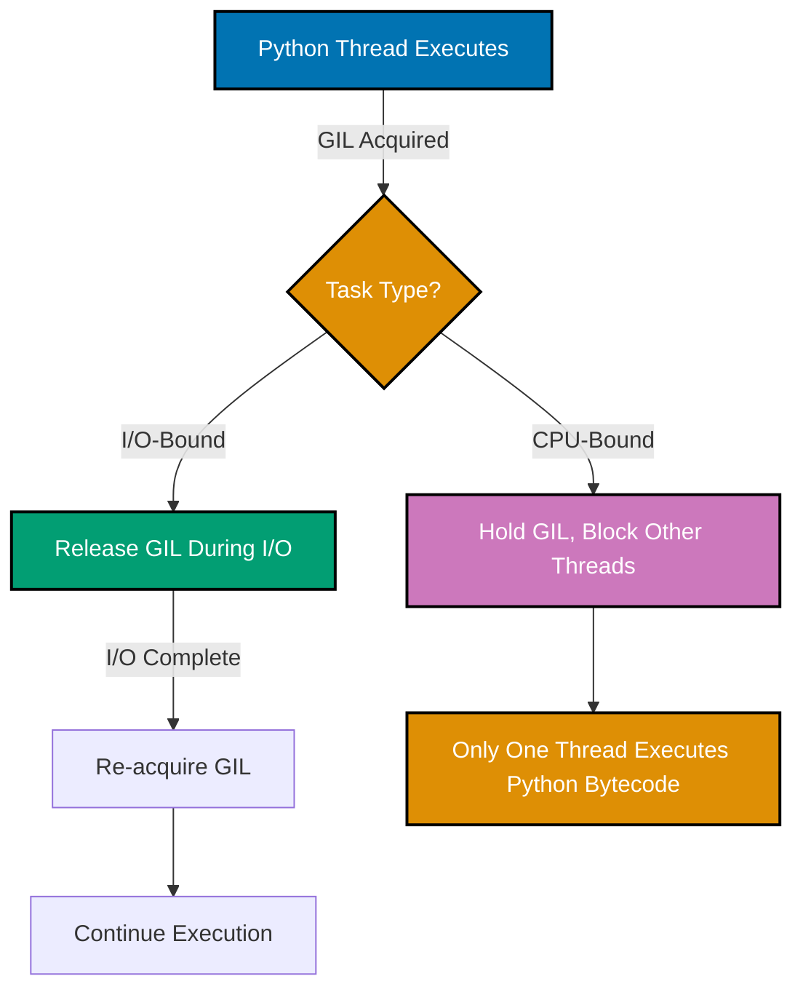
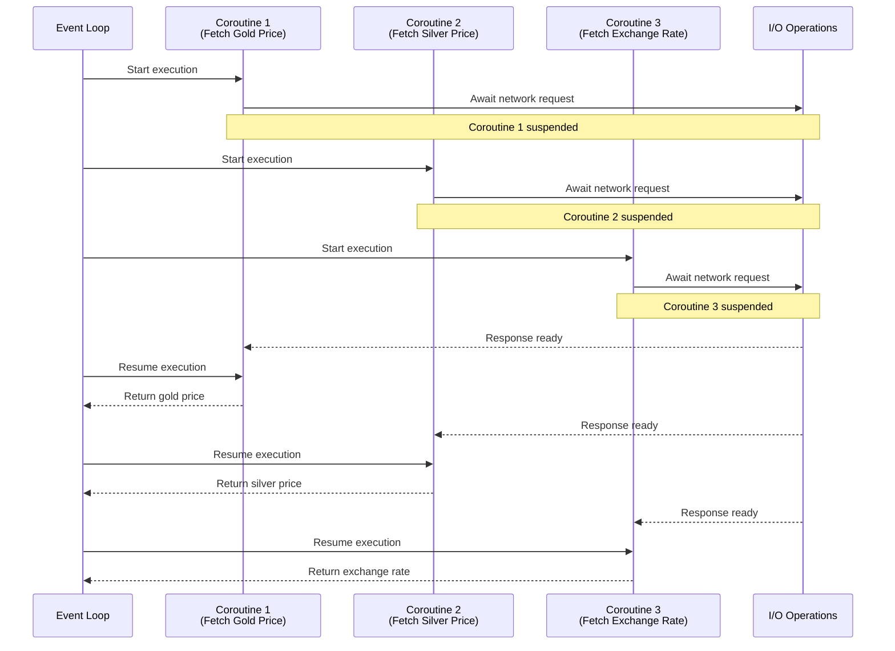
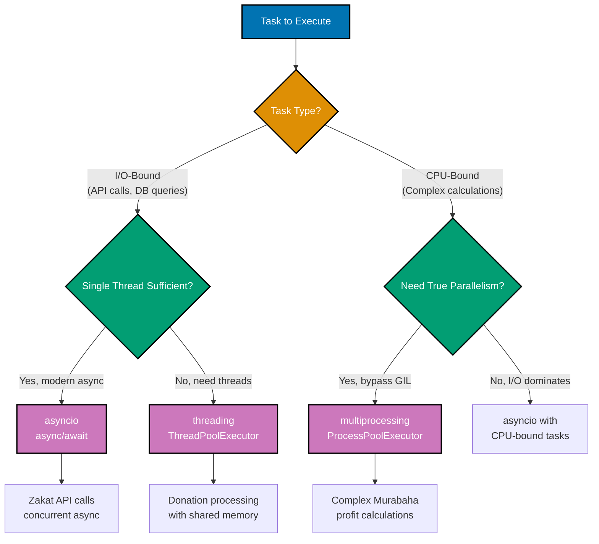

# Python Concurrency and Parallelism

**Quick Reference**: [Overview](#overview) | [asyncio](#asyncio-async-await) | [threading](#threading-module) | [multiprocessing](#multiprocessing-module) | [GIL](#gil-global-interpreter-lock) | [concurrent.futures](#concurrentfutures) | [Async Context Managers](#async-context-managers) | [Error Handling](#error-handling-in-async) | [References](#references)

## Overview

Concurrency and parallelism enable Python applications to handle multiple operations simultaneously. For the OSE Platform processing Zakat calculations, API requests, and financial transactions, understanding async patterns and GIL implications is critical for performance.

### Concurrency vs Parallelism

**Concurrency**: Multiple tasks making progress (interleaved execution).

**Parallelism**: Multiple tasks executing simultaneously (true parallel execution).

### Python Concurrency Models

**asyncio**: Single-threaded cooperative multitasking (I/O-bound).

**threading**: Multi-threaded execution (I/O-bound, GIL-limited).

**multiprocessing**: Multi-process execution (CPU-bound, no GIL).

## asyncio (async/await)

asyncio provides asynchronous I/O using async/await syntax.

### GIL Behavior and Concurrency Models



**Why this matters**: The GIL #40;Global Interpreter Lock#41; allows only one thread to execute Python bytecode at a time. Threading benefits I/O-bound tasks #40;GIL released during I/O#41; but not CPU-bound tasks.

### Basic async/await

```python
# GOOD: Async function with await
import asyncio
from decimal import Decimal
from typing import List


async def fetch_gold_price_async() -> Decimal:
    """Fetch gold price asynchronously."""
    await asyncio.sleep(0.1)  # Simulate API call
    return Decimal("60.00")


async def calculate_nisab_async() -> Decimal:
    """Calculate nisab threshold async."""
    gold_price = await fetch_gold_price_async()
    GOLD_NISAB_GRAMS = 85
    return gold_price * GOLD_NISAB_GRAMS


# Usage: Run async function
nisab = asyncio.run(calculate_nisab_async())
print(f"Nisab: ${nisab}")
```

**Why this matters**: `async`/`await` enables non-blocking I/O. Single thread handles many concurrent operations. Ideal for I/O-bound tasks.

### Concurrent async operations

```python
# GOOD: Run multiple async operations concurrently
import asyncio
from decimal import Decimal


async def fetch_gold_price() -> Decimal:
    """Fetch gold price (simulated)."""
    await asyncio.sleep(0.2)
    return Decimal("60.00")


async def fetch_silver_price() -> Decimal:
    """Fetch silver price (simulated)."""
    await asyncio.sleep(0.2)
    return Decimal("0.75")


async def fetch_exchange_rate(currency: str) -> Decimal:
    """Fetch exchange rate (simulated)."""
    await asyncio.sleep(0.1)
    return Decimal("1.0") if currency == "USD" else Decimal("0.85")


async def calculate_all_nisab_values() -> dict:
    """Calculate all nisab values concurrently."""
    # Gather runs tasks concurrently
    gold_price, silver_price, exchange_rate = await asyncio.gather(
        fetch_gold_price(),
        fetch_silver_price(),
        fetch_exchange_rate("USD"),
    )

    return {
        "gold_nisab": gold_price * 85,
        "silver_nisab": silver_price * 595,
        "exchange_rate": exchange_rate,
    }


# Usage
result = asyncio.run(calculate_all_nisab_values())
print(result)
```

**Why this matters**: `asyncio.gather()` runs multiple coroutines concurrently. Single thread, non-blocking. Dramatically faster than sequential execution for I/O.

### asyncio Event Loop Execution



**Why this matters**: asyncio event loop switches between coroutines during I/O wait. Single-threaded cooperative multitasking. All three API calls execute concurrently without threads.

## threading Module

Threading enables concurrent execution with shared memory (GIL-limited).

### Basic Threading

```python
# GOOD: Threading for I/O-bound tasks
import threading
from decimal import Decimal
from typing import List
import time


def calculate_zakat_batch(
    wealth_items: List[Decimal],
    results: List[Decimal],
    index: int,
) -> None:
    """Calculate Zakat for batch (thread worker)."""
    time.sleep(0.1)  # Simulate I/O
    zakat_total = sum(item * Decimal("0.025") for item in wealth_items)
    results[index] = zakat_total


# Usage: Process batches in parallel threads
wealth_data = [
    [Decimal("100000"), Decimal("150000")],
    [Decimal("200000"), Decimal("250000")],
    [Decimal("300000"), Decimal("350000")],
]

results = [Decimal("0")] * len(wealth_data)
threads = []

for i, batch in enumerate(wealth_data):
    thread = threading.Thread(
        target=calculate_zakat_batch,
        args=(batch, results, i),
    )
    threads.append(thread)
    thread.start()

# Wait for all threads
for thread in threads:
    thread.join()

print(f"Total Zakat: ${sum(results)}")
```

**Why this matters**: Threading useful for I/O-bound tasks despite GIL. Shared memory simplifies data sharing. Lighter weight than multiprocessing.

## multiprocessing Module

Multiprocessing bypasses GIL with separate processes.

### Basic Multiprocessing

```python
# GOOD: Multiprocessing for CPU-bound tasks
from multiprocessing import Pool
from decimal import Decimal
from typing import List


def calculate_complex_zakat(wealth_amount: Decimal) -> Decimal:
    """CPU-intensive Zakat calculation."""
    # Simulate complex calculation
    result = wealth_amount
    for _ in range(1000000):
        result = result * Decimal("1.0000001")
    return result * Decimal("0.025")


# Usage: Process in parallel (CPU cores)
wealth_amounts = [Decimal("100000")] * 8

with Pool(processes=4) as pool:
    results = pool.map(calculate_complex_zakat, wealth_amounts)

print(f"Results: {results}")
```

**Why this matters**: Multiprocessing achieves true parallelism. No GIL limitations. Ideal for CPU-bound calculations.

## GIL (Global Interpreter Lock)

The GIL prevents multiple threads from executing Python bytecode simultaneously.

### GIL Implications

```python
# GIL-limited: CPU-bound threading (slow)
import threading
from decimal import Decimal


def cpu_intensive_zakat(wealth: Decimal) -> Decimal:
    """CPU-intensive calculation (GIL-limited)."""
    result = wealth
    for _ in range(10000000):
        result = result * Decimal("1.0000001")
    return result * Decimal("0.025")


# Threading provides no speedup for CPU-bound
# (GIL prevents parallel CPU execution)


# GIL-bypassed: I/O-bound threading (fast)
import time


def io_intensive_zakat(wealth: Decimal) -> Decimal:
    """I/O-intensive calculation (GIL-released during I/O)."""
    time.sleep(1)  # GIL released during sleep
    return wealth * Decimal("0.025")


# Threading speeds up I/O-bound tasks
# (threads wait concurrently, not sequentially)
```

**Python 3.13+ Free-Threaded Mode**: Experimental no-GIL mode via `--disable-gil` flag (PEP 703). Enables true parallel threading for CPU-bound tasks.

### Concurrency Model Decision Tree



**Decision guide**:

- **asyncio**: I/O-bound tasks, modern async APIs, highest concurrency
- **threading**: I/O-bound tasks needing shared memory, compatibility with sync libraries
- **multiprocessing**: CPU-bound tasks requiring true parallelism, bypasses GIL

## concurrent.futures

High-level interface for threading and multiprocessing.

### ThreadPoolExecutor

```python
# GOOD: ThreadPoolExecutor for I/O-bound
from concurrent.futures import ThreadPoolExecutor
from decimal import Decimal
import time


def fetch_campaign_data(campaign_id: str) -> dict:
    """Fetch campaign data (I/O-bound)."""
    time.sleep(0.1)  # Simulate network I/O
    return {
        "id": campaign_id,
        "total": Decimal("50000"),
    }


# Usage: Concurrent I/O with thread pool
campaign_ids = [f"CAMP-{i:03d}" for i in range(10)]

with ThreadPoolExecutor(max_workers=5) as executor:
    results = list(executor.map(fetch_campaign_data, campaign_ids))

print(f"Fetched {len(results)} campaigns")
```

**Why this matters**: ThreadPoolExecutor simplifies concurrent I/O. Automatic thread management. Context manager ensures cleanup.

### ProcessPoolExecutor

```python
# GOOD: ProcessPoolExecutor for CPU-bound
from concurrent.futures import ProcessPoolExecutor
from decimal import Decimal


def complex_calculation(wealth: Decimal) -> Decimal:
    """CPU-intensive calculation."""
    result = wealth
    for _ in range(5000000):
        result = result * Decimal("1.0000001")
    return result


# Usage: Parallel CPU processing
wealth_data = [Decimal("100000")] * 8

with ProcessPoolExecutor(max_workers=4) as executor:
    results = list(executor.map(complex_calculation, wealth_data))

print(f"Processed {len(results)} items")
```

**Why this matters**: ProcessPoolExecutor bypasses GIL. True parallel CPU execution. Simple API matches ThreadPoolExecutor.

## Async Context Managers

Async context managers support async setup/teardown.

### Defining Async Context Managers

```python
# GOOD: Async context manager for database
from contextlib import asynccontextmanager
from typing import AsyncIterator


class AsyncDatabase:
    """Async database connection."""

    async def connect(self) -> None:
        """Establish connection."""
        print("Connecting to database...")
        await asyncio.sleep(0.1)

    async def disconnect(self) -> None:
        """Close connection."""
        print("Disconnecting from database...")
        await asyncio.sleep(0.1)

    async def execute(self, query: str) -> List[dict]:
        """Execute query."""
        await asyncio.sleep(0.05)
        return [{"result": "data"}]


@asynccontextmanager
async def get_db_connection() -> AsyncIterator[AsyncDatabase]:
    """Async context manager for database."""
    db = AsyncDatabase()
    await db.connect()
    try:
        yield db
    finally:
        await db.disconnect()


# Usage
async def fetch_zakat_records():
    """Fetch records with async context manager."""
    async with get_db_connection() as db:
        records = await db.execute("SELECT * FROM zakat_records")
        return records


records = asyncio.run(fetch_zakat_records())
```

**Why this matters**: Async context managers ensure cleanup in async code. `async with` for async resources. Prevent resource leaks.

## Error Handling in Async

Handle exceptions in async code properly.

### Async Exception Handling

```python
# GOOD: Handle exceptions in async tasks
import asyncio
from decimal import Decimal


async def risky_calculation(wealth: Decimal) -> Decimal:
    """Calculation that might fail."""
    await asyncio.sleep(0.1)
    if wealth < 0:
        raise ValueError("Wealth cannot be negative")
    return wealth * Decimal("0.025")


async def process_with_error_handling():
    """Process multiple calculations with error handling."""
    wealth_values = [Decimal("100000"), Decimal("-5000"), Decimal("200000")]

    tasks = [risky_calculation(w) for w in wealth_values]
    results = await asyncio.gather(*tasks, return_exceptions=True)

    for i, result in enumerate(results):
        if isinstance(result, Exception):
            print(f"Error calculating wealth[{i}]: {result}")
        else:
            print(f"Zakat for wealth[{i}]: ${result}")


asyncio.run(process_with_error_handling())
```

**Why this matters**: `return_exceptions=True` prevents one failure from stopping all tasks. Individual error handling per task. Resilient concurrent processing.

## References

### Official Documentation

- [asyncio Documentation](https://docs.python.org/3/library/asyncio.html)
- [threading Module](https://docs.python.org/3/library/threading.html)
- [multiprocessing Module](https://docs.python.org/3/library/multiprocessing.html)
- [concurrent.futures](https://docs.python.org/3/library/concurrent.futures.html)
- [PEP 703 - No-GIL Mode](https://peps.python.org/pep-0703/)

### Related Documentation

- [Web Services](./ex-so-stla-py__web-services.md) - FastAPI async patterns
- [Performance](./ex-so-stla-py__performance.md) - Optimization strategies
- [Error Handling](./ex-so-stla-py__error-handling.md) - Exception patterns

---

**Last Updated**: 2025-01-23
**Python Version**: 3.11+ (baseline), 3.12+ (stable maintenance), 3.13.x (latest stable with free-threaded mode)
**Maintainers**: OSE Platform Documentation Team
