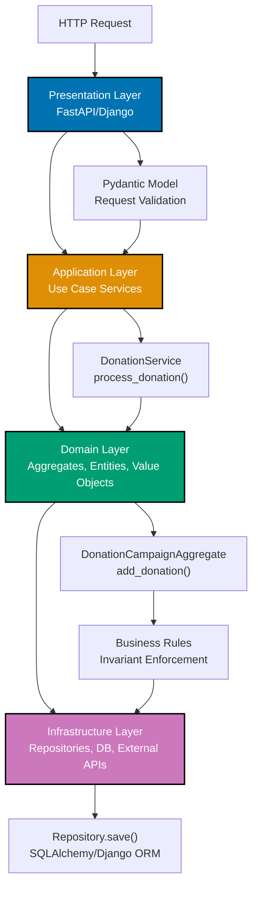
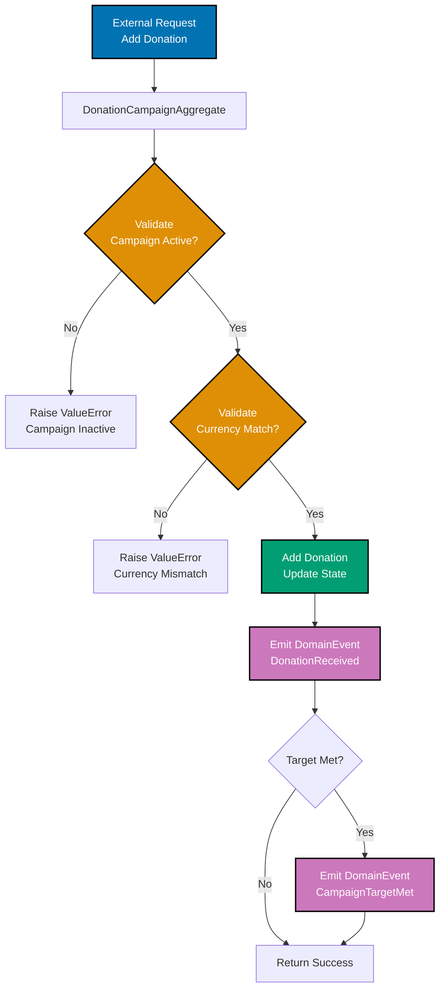
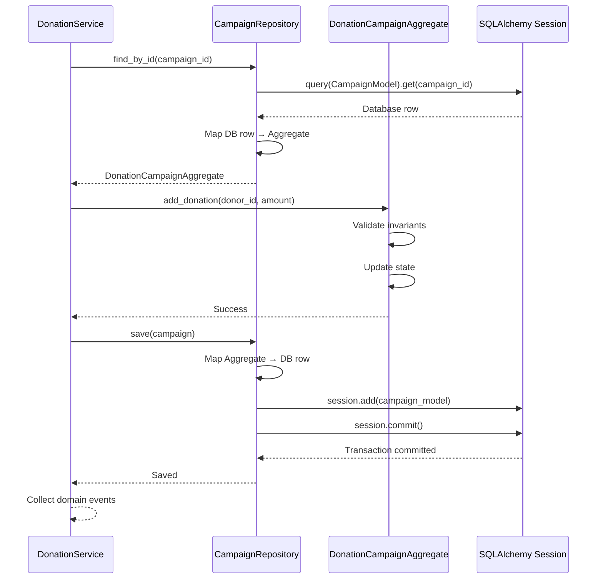
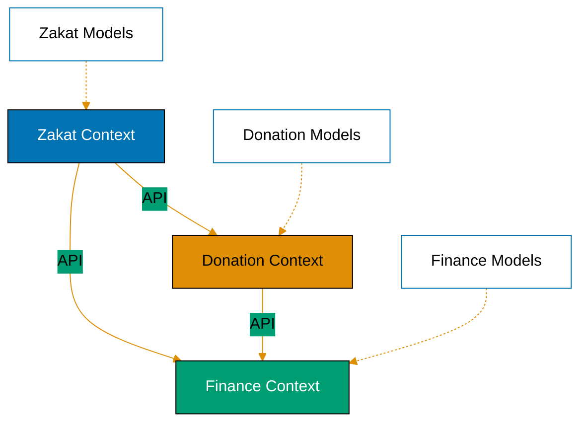

# Domain-Driven Design in Python

**Quick Reference**: [Overview](#overview) | [Value Objects](#value-objects) | [Entities](#entities) | [Aggregates](#aggregates) | [Domain Events](#domain-events) | [Repositories](#repositories) | [Service Layer](#service-layer) | [Bounded Contexts](#bounded-contexts) | [References](#references)

## Overview

Domain-Driven Design (DDD) structures software around business domain concepts. For Islamic finance in the OSE Platform, DDD models Zakat obligations, Murabaha contracts, and QardHasan loans as first-class domain objects with clear boundaries and invariants.

### Why DDD for Financial Domain

**Business Alignment**: Code reflects business concepts directly.

**Invariant Protection**: Aggregates enforce business rules.

**Clear Boundaries**: Bounded contexts prevent tangled dependencies.

**Ubiquitous Language**: Shared vocabulary between developers and domain experts.

**Evolution**: Domain model adapts as business understanding deepens.

## Value Objects

Value objects are immutable, equality-based on attributes, no identity.

### Defining Value Objects

```python
# GOOD: Value object with Pydantic
from pydantic import BaseModel, Field
from decimal import Decimal


class Money(BaseModel):
    """Immutable money value object."""

    amount: Decimal = Field(ge=0)
    currency: str = Field(min_length=3, max_length=3)

    class Config:
        frozen = True  # Immutable

    def add(self, other: "Money") -> "Money":
        """Add money amounts (same currency only)."""
        if self.currency != other.currency:
            raise ValueError(f"Cannot add {self.currency} and {other.currency}")
        return Money(amount=self.amount + other.amount, currency=self.currency)

    def multiply(self, factor: Decimal) -> "Money":
        """Multiply money by factor."""
        return Money(amount=self.amount * factor, currency=self.currency)


# Usage
zakat_amount = Money(amount=Decimal("2500.00"), currency="USD")
doubled = zakat_amount.multiply(Decimal("2"))

# Value equality (not identity)
amount1 = Money(amount=Decimal("100.00"), currency="USD")
amount2 = Money(amount=Decimal("100.00"), currency="USD")
assert amount1 == amount2  # True (value equality)
assert amount1 is not amount2  # True (different objects)
```

**Why this matters**: Value objects prevent primitive obsession. Business rules encoded in type. Immutability ensures consistency.

## Entities

Entities have identity that persists beyond attribute changes.

### Defining Entities

```python
# GOOD: Entity with identity
from pydantic import BaseModel, Field
from decimal import Decimal
from datetime import date
from typing import Optional
import uuid


class DonationCampaign(BaseModel):
    """Donation campaign entity with persistent identity."""

    id: str = Field(default_factory=lambda: f"CAMP-{uuid.uuid4().hex[:8]}")
    name: str = Field(min_length=1, max_length=200)
    target_amount: Money
    current_amount: Money
    start_date: date
    end_date: Optional[date] = None

    def __eq__(self, other: object) -> bool:
        """Entities equal by ID, not attributes."""
        if not isinstance(other, DonationCampaign):
            return NotImplemented
        return self.id == other.id

    def __hash__(self) -> int:
        """Hash by ID for set/dict usage."""
        return hash(self.id)

    def record_donation(self, donation_amount: Money) -> None:
        """Record donation (business logic)."""
        self.current_amount = self.current_amount.add(donation_amount)

    def is_target_met(self) -> bool:
        """Check if campaign reached target."""
        return self.current_amount.amount >= self.target_amount.amount


# Usage: Identity-based equality
campaign1 = DonationCampaign(
    name="Zakat Distribution",
    target_amount=Money(amount=Decimal("500000"), currency="USD"),
    current_amount=Money(amount=Decimal("0"), currency="USD"),
    start_date=date(2025, 1, 1),
)

campaign2 = campaign1  # Same identity
campaign2.record_donation(Money(amount=Decimal("10000"), currency="USD"))

assert campaign1 == campaign2  # True (same ID)
assert campaign1.current_amount == campaign2.current_amount  # True (shared state)
```

**Why this matters**: Entities have lifecycle and identity. Equality by ID, not attributes. Mutable state encapsulated with business logic.

## Aggregates

Aggregates are clusters of entities/value objects with consistency boundaries.

### Defining Aggregates

```python
# GOOD: Aggregate root with invariants
from pydantic import BaseModel, Field, field_validator
from typing import List
from decimal import Decimal
from datetime import date


class Donation(BaseModel):
    """Donation within campaign aggregate."""

    donor_id: str
    amount: Money
    donation_date: date


class DonationCampaignAggregate(BaseModel):
    """Campaign aggregate root enforcing invariants."""

    id: str = Field(default_factory=lambda: f"CAMP-{uuid.uuid4().hex[:8]}")
    name: str
    target_amount: Money
    start_date: date
    end_date: Optional[date] = None
    donations: List[Donation] = Field(default_factory=list)
    is_active: bool = True

    @field_validator("end_date")
    @classmethod
    def validate_end_date(cls, v: Optional[date], values: dict) -> Optional[date]:
        """Ensure end_date after start_date."""
        if v is not None and "start_date" in values:
            if v <= values["start_date"]:
                raise ValueError("end_date must be after start_date")
        return v

    @property
    def total_donated(self) -> Money:
        """Calculate total donations."""
        if not self.donations:
            return Money(amount=Decimal("0"), currency=self.target_amount.currency)

        total = Decimal("0")
        for donation in self.donations:
            total += donation.amount.amount

        return Money(amount=total, currency=self.target_amount.currency)

    def add_donation(self, donor_id: str, amount: Money) -> None:
        """Add donation (enforces invariants)."""
        if not self.is_active:
            raise ValueError("Cannot donate to inactive campaign")

        if self.end_date and date.today() > self.end_date:
            raise ValueError("Campaign has ended")

        if amount.currency != self.target_amount.currency:
            raise ValueError(f"Currency mismatch: expected {self.target_amount.currency}")

        donation = Donation(
            donor_id=donor_id,
            amount=amount,
            donation_date=date.today(),
        )
        self.donations.append(donation)

    def close_campaign(self) -> None:
        """Close campaign (business rule)."""
        self.is_active = False
        self.end_date = date.today()


# Usage: Aggregate enforces consistency
campaign = DonationCampaignAggregate(
    name="Zakat Distribution 2025",
    target_amount=Money(amount=Decimal("500000"), currency="USD"),
    start_date=date(2025, 1, 1),
)

# Valid donation
campaign.add_donation("DONOR-001", Money(amount=Decimal("5000"), currency="USD"))

# Invalid: campaign closed
campaign.close_campaign()
# campaign.add_donation("DONOR-002", Money(amount=Decimal("1000"), currency="USD"))  # Raises error
```

**Why this matters**: Aggregates enforce invariants. Single entry point (root) controls modifications. Consistency boundary clear. Transactional unit defined.

### DDD Layers with Python Frameworks



**Layer responsibilities**:

- **Presentation**: HTTP endpoints, request/response models #40;FastAPI/Django#41;
- **Application**: Use case orchestration #40;services#41;
- **Domain**: Business logic and rules #40;aggregates, entities#41;
- **Infrastructure**: Persistence and external systems #40;repositories, APIs#41;

## Domain Events

Domain events represent significant occurrences in the domain.

### Defining Domain Events

```python
# GOOD: Domain events for business occurrences
from pydantic import BaseModel
from datetime import datetime
from typing import List
import uuid


class DomainEvent(BaseModel):
    """Base domain event."""

    event_id: str = Field(default_factory=lambda: str(uuid.uuid4()))
    occurred_at: datetime = Field(default_factory=datetime.utcnow)


class ZakatObligationCalculated(DomainEvent):
    """Event: Zakat obligation calculated."""

    payer_id: str
    wealth_amount: Money
    zakat_amount: Money


class DonationReceived(DomainEvent):
    """Event: Donation received for campaign."""

    campaign_id: str
    donor_id: str
    donation_amount: Money


class CampaignTargetMet(DomainEvent):
    """Event: Campaign reached target."""

    campaign_id: str
    target_amount: Money
    total_donated: Money


# Aggregate emits events
class DonationCampaignWithEvents(DonationCampaignAggregate):
    """Campaign aggregate emitting domain events."""

    _events: List[DomainEvent] = []

    def add_donation(self, donor_id: str, amount: Money) -> None:
        """Add donation and emit event."""
        super().add_donation(donor_id, amount)

        # Emit DonationReceived event
        self._events.append(DonationReceived(
            campaign_id=self.id,
            donor_id=donor_id,
            donation_amount=amount,
        ))

        # Check if target met
        if self.total_donated.amount >= self.target_amount.amount:
            self._events.append(CampaignTargetMet(
                campaign_id=self.id,
                target_amount=self.target_amount,
                total_donated=self.total_donated,
            ))

    def collect_events(self) -> List[DomainEvent]:
        """Collect and clear events."""
        events = self._events.copy()
        self._events.clear()
        return events
```

**Why this matters**: Events represent domain facts. Decouple aggregates from side effects. Enable event sourcing and CQRS patterns.

### Aggregate with Validation and Domain Events



**Aggregate responsibilities**:

1. **Validate invariants** before state changes
2. **Update state** atomically
3. **Emit domain events** for significant occurrences
4. **Enforce business rules** within consistency boundary

## Repositories

Repositories abstract persistence for aggregates.

### Defining Repositories

```python
# GOOD: Repository for aggregate persistence
from typing import Protocol, Optional, List


class DonationCampaignRepository(Protocol):
    """Repository protocol for campaign persistence."""

    def save(self, campaign: DonationCampaignAggregate) -> None:
        """Save campaign aggregate."""
        ...

    def find_by_id(self, campaign_id: str) -> Optional[DonationCampaignAggregate]:
        """Find campaign by ID."""
        ...

    def find_active_campaigns(self) -> List[DonationCampaignAggregate]:
        """Find all active campaigns."""
        ...


class InMemoryCampaignRepository:
    """In-memory repository implementation."""

    def __init__(self) -> None:
        self._campaigns: dict[str, DonationCampaignAggregate] = {}

    def save(self, campaign: DonationCampaignAggregate) -> None:
        """Save campaign to memory."""
        self._campaigns[campaign.id] = campaign

    def find_by_id(self, campaign_id: str) -> Optional[DonationCampaignAggregate]:
        """Find by ID."""
        return self._campaigns.get(campaign_id)

    def find_active_campaigns(self) -> List[DonationCampaignAggregate]:
        """Find active campaigns."""
        return [c for c in self._campaigns.values() if c.is_active]


# Usage: Repository abstracts persistence
repo = InMemoryCampaignRepository()

campaign = DonationCampaignAggregate(
    name="Education Fund",
    target_amount=Money(amount=Decimal("100000"), currency="USD"),
    start_date=date(2025, 1, 1),
)
repo.save(campaign)

# Retrieve and modify
found = repo.find_by_id(campaign.id)
if found:
    found.add_donation("DONOR-001", Money(amount=Decimal("5000"), currency="USD"))
    repo.save(found)
```

**Why this matters**: Repositories abstract storage mechanism. Aggregates persist as units. Testing easier with in-memory implementations.

## Service Layer

Application services orchestrate domain objects and repositories.

### Defining Services

```python
# GOOD: Application service coordinating use cases
from dataclasses import dataclass


@dataclass
class DonationService:
    """Application service for donation use cases."""

    campaign_repository: DonationCampaignRepository

    def process_donation(
        self,
        campaign_id: str,
        donor_id: str,
        amount: Money,
    ) -> List[DomainEvent]:
        """Process donation (use case)."""
        # Load aggregate
        campaign = self.campaign_repository.find_by_id(campaign_id)
        if not campaign:
            raise ValueError(f"Campaign not found: {campaign_id}")

        # Execute domain logic
        campaign.add_donation(donor_id, amount)

        # Save aggregate
        self.campaign_repository.save(campaign)

        # Collect and return events
        if isinstance(campaign, DonationCampaignWithEvents):
            return campaign.collect_events()
        return []


# Usage: Service coordinates workflow
repo = InMemoryCampaignRepository()
service = DonationService(campaign_repository=repo)

# Create campaign
campaign = DonationCampaignWithEvents(
    name="Zakat Fund",
    target_amount=Money(amount=Decimal("50000"), currency="USD"),
    start_date=date(2025, 1, 1),
)
repo.save(campaign)

# Process donation through service
events = service.process_donation(
    campaign_id=campaign.id,
    donor_id="DONOR-001",
    amount=Money(amount=Decimal("10000"), currency="USD"),
)

for event in events:
    print(f"Event: {type(event).__name__}")
```

**Why this matters**: Services orchestrate use cases. Domain logic stays in aggregates. Thin application layer coordinates components.

### Repository Pattern with SQLAlchemy



**Repository pattern benefits**:

- **Abstraction**: Domain layer independent of persistence technology
- **Testability**: Mock repositories for unit tests
- **Consistency**: Aggregates persist as atomic units
- **Mapping**: Translate between domain models and database schemas

## Bounded Contexts

Bounded contexts define clear boundaries between domain models.

### Context Boundaries



**Zakat Context**: Zakat calculations, nisab thresholds, payer obligations

**Donation Context**: Campaigns, donors, contributions

**Finance Context**: Transactions, accounting, reporting

**Integration**: Bounded contexts communicate via well-defined APIs, not shared models.

## References

### Official Documentation

- [Domain-Driven Design (Book)](https://www.domainlanguage.com/ddd/) - Eric Evans
- [Implementing DDD (Book)](https://vaughnvernon.com/) - Vaughn Vernon
- [Pydantic Documentation](https://docs.pydantic.dev/)

### Related Documentation

- [Classes and Protocols](./ex-so-stla-py__classes-and-protocols.md) - OOP patterns
- [Type Safety](./ex-so-stla-py__type-safety.md) - Pydantic validation
- [Templates](./templates/) - DDD code templates

---

**Last Updated**: 2025-01-23
**Python Version**: 3.11+ (baseline), 3.12+ (stable maintenance), 3.14.x (latest stable)
**Maintainers**: OSE Platform Documentation Team
