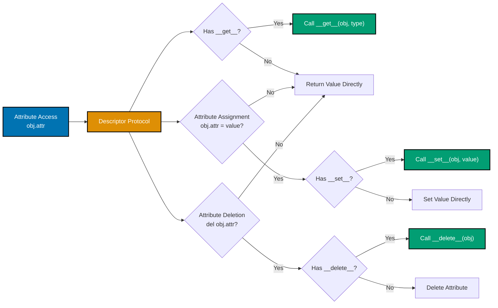
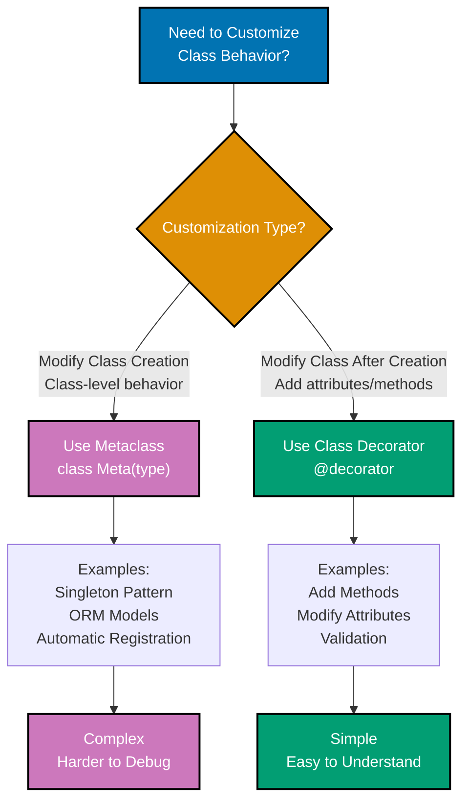

# Python Idioms

**Quick Reference**: [Overview](#overview) | [Comprehensions](#comprehensions) | [EAFP vs LBYL](#eafp-vs-lbyl) | [Context Managers](#context-managers) | [Decorators](#decorators) | [Generators](#generators-and-iterators) | [Duck Typing](#duck-typing) | [Properties](#property-decorators) | [Special Methods](#special-methods) | [References](#references)

## Overview

Python idioms are expressive patterns that leverage Python's unique features to write clear, concise, and maintainable code. "Pythonic" code follows established community conventions, making code instantly recognizable to experienced Python developers.

### Why Pythonic Patterns Matter

**Readability**: Idiomatic code communicates intent clearly through familiar patterns.

**Performance**: Many Python idioms compile to optimized C code, improving execution speed.

**Maintainability**: Community-standard patterns enable easier collaboration and code review.

**Expressiveness**: Pythonic code accomplishes more with fewer lines while remaining readable.

**Platform Consistency**: Adopting Python idioms ensures consistency across Open Sharia Enterprise codebases.

### The Pythonic Philosophy

From PEP 20 (The Zen of Python):

- **Beautiful is better than ugly** - Elegant syntax over verbose constructs
- **Simple is better than complex** - Direct expression over indirection
- **Readability counts** - Clarity trumps cleverness
- **There should be one obvious way to do it** - Pythonic idioms provide that way

## Comprehensions

Comprehensions provide concise syntax for creating collections from iterables.

### List Comprehensions

```python
# GOOD: List comprehension for filtering and transformation
from decimal import Decimal
from typing import List


def calculate_qualifying_zakat(
    wealth_items: List[Decimal],
    nisab_threshold: Decimal,
) -> List[Decimal]:
    """Calculate Zakat for wealth items exceeding nisab."""
    zakat_obligations = [
        amount * Decimal("0.025")
        for amount in wealth_items
        if amount >= nisab_threshold
    ]
    return zakat_obligations


# BAD: Verbose loop-based approach
def calculate_qualifying_zakat(wealth_items, nisab_threshold):
    zakat_obligations = []  # BAD: Manual list construction
    for amount in wealth_items:
        if amount >= nisab_threshold:
            zakat_obligations.append(amount * Decimal("0.025"))
    return zakat_obligations
```

**Why this matters**: List comprehensions are faster (optimized C code) and more expressive. Single expression communicates filter-and-transform pattern clearly.

### Dictionary Comprehensions

```python
# GOOD: Dictionary comprehension for mapping
from typing import Dict


def create_donor_totals(donations: List[tuple[str, Decimal]]) -> Dict[str, Decimal]:
    """Aggregate donations by donor ID.

    Args:
        donations: List of (donor_id, amount) tuples

    Returns:
        Dictionary mapping donor_id to total donated
    """
    # Group donations by donor_id
    donor_totals = {}
    for donor_id, amount in donations:
        donor_totals[donor_id] = donor_totals.get(donor_id, Decimal("0")) + amount

    return donor_totals


def format_donor_summary(donor_totals: Dict[str, Decimal]) -> Dict[str, str]:
    """Format donation totals for display."""
    return {
        donor_id: f"${total:,.2f}"
        for donor_id, total in donor_totals.items()
        if total > Decimal("0")
    }


# BAD: Manual dictionary construction
def format_donor_summary(donor_totals):
    summary = {}
    for donor_id in donor_totals:
        total = donor_totals[donor_id]
        if total > 0:
            summary[donor_id] = f"${total:,.2f}"
    return summary
```

**Why this matters**: Dictionary comprehensions transform dictionaries concisely. Filtering during comprehension eliminates need for separate loops.

### Set Comprehensions

```python
# GOOD: Set comprehension for unique values
from typing import Set


def extract_unique_payer_ids(zakat_records: List[dict]) -> Set[str]:
    """Extract unique payer IDs from Zakat records."""
    return {
        record["payer_id"]
        for record in zakat_records
        if record.get("status") == "paid"
    }


# BAD: Manual set construction
def extract_unique_payer_ids(zakat_records):
    unique_ids = set()
    for record in zakat_records:
        if record.get("status") == "paid":
            unique_ids.add(record["payer_id"])
    return unique_ids
```

**Why this matters**: Set comprehensions eliminate duplicates automatically. Single expression clearly communicates unique-values extraction.

### Generator Expressions

```python
# GOOD: Generator expression for memory efficiency
from typing import Iterator


def calculate_monthly_zakat_stream(
    annual_wealth: Decimal,
) -> Iterator[Decimal]:
    """Generate monthly Zakat estimates from annual wealth.

    Yields:
        Monthly Zakat amount for 12 months
    """
    monthly_amount = annual_wealth / 12
    return (
        monthly_amount * Decimal("0.025")
        for _ in range(12)
    )


# Usage: Process without storing all values in memory
for month_zakat in calculate_monthly_zakat_stream(Decimal("120000.00")):
    process_monthly_obligation(month_zakat)


# BAD: List comprehension loads all values into memory
def calculate_monthly_zakat_stream(annual_wealth):
    monthly_amount = annual_wealth / 12
    return [monthly_amount * Decimal("0.025") for _ in range(12)]  # BAD: Materializes list
```

**Why this matters**: Generator expressions compute values lazily. Memory-efficient for large datasets. Identical syntax to list comprehensions (parentheses instead of brackets).

## EAFP vs LBYL

EAFP (Easier to Ask for Forgiveness than Permission) and LBYL (Look Before You Leap) represent different error-handling philosophies.

### EAFP: Pythonic Exception Handling

```python
# GOOD: EAFP - Try the operation, handle exceptions
from decimal import Decimal, InvalidOperation


def parse_donation_amount(amount_str: str) -> Decimal:
    """Parse donation amount using EAFP approach."""
    try:
        return Decimal(amount_str)
    except InvalidOperation:
        raise ValueError(f"Invalid donation amount: {amount_str}")


def get_campaign_target(campaigns: dict, campaign_id: str) -> Decimal:
    """Retrieve campaign target using EAFP."""
    try:
        return campaigns[campaign_id]["target"]
    except KeyError:
        raise ValueError(f"Campaign not found: {campaign_id}")


# BAD: LBYL - Check before operating
def parse_donation_amount(amount_str: str) -> Decimal:
    if not amount_str:  # BAD: Defensive checks
        raise ValueError("Empty amount")
    if not amount_str.replace(".", "").isdigit():  # BAD: Complex validation
        raise ValueError("Invalid amount")
    return Decimal(amount_str)


def get_campaign_target(campaigns: dict, campaign_id: str) -> Decimal:
    if campaign_id not in campaigns:  # BAD: Check-then-use race condition
        raise ValueError(f"Campaign not found: {campaign_id}")
    if "target" not in campaigns[campaign_id]:  # BAD: Multiple checks
        raise ValueError("Target not set")
    return campaigns[campaign_id]["target"]
```

**Why this matters**: EAFP is more Pythonic and often faster (no duplicate checks). Exception handling is atomic (no race conditions). Simpler code with fewer conditional branches.

### When to Use LBYL

```python
# GOOD: LBYL appropriate for permission checks
import os


def read_zakat_records_file(filepath: str) -> List[dict]:
    """Read Zakat records with permission check."""
    if not os.path.exists(filepath):
        raise FileNotFoundError(f"Zakat records file not found: {filepath}")

    if not os.access(filepath, os.R_OK):
        raise PermissionError(f"Cannot read Zakat records file: {filepath}")

    with open(filepath, "r") as f:
        return json.load(f)
```

**Why this matters**: LBYL appropriate for checking permissions (file access, user authorization) where exception messages would be cryptic. Explicit checks provide better error messages.

## Context Managers

Context managers (the `with` statement) ensure resource cleanup even when exceptions occur.

### File Handling

```python
# GOOD: Context manager ensures file closure
import json
from pathlib import Path


def save_zakat_calculation(calculation: dict, filepath: Path) -> None:
    """Save Zakat calculation to file with automatic cleanup."""
    with filepath.open("w") as f:
        json.dump(calculation, f, indent=2)
    # File automatically closed even if exception occurs


# BAD: Manual file handling
def save_zakat_calculation(calculation: dict, filepath: Path) -> None:
    f = filepath.open("w")  # BAD: No automatic cleanup
    try:
        json.dump(calculation, f, indent=2)
    finally:
        f.close()  # BAD: Manual cleanup required
```

**Why this matters**: `with` statement guarantees resource cleanup. Reduces boilerplate `try/finally` blocks. Prevents resource leaks.

### Common Python Patterns and Idioms

```mermaid
%% Color Palette: Blue #0173B2, Orange #DE8F05, Teal #029E73, Purple #CC78BC
graph TD
  A[Python Idioms] --> B[Context Managers<br/>with statement]
  A --> C[Decorators<br/>@decorator syntax]
  A --> D[Generators<br/>yield keyword]
  A --> E[Comprehensions<br/>List/Dict/Set]

  B --> F[Resource Management<br/>Files, DB, Locks]
  C --> G[Cross-Cutting Concerns<br/>Logging, Caching, Validation]
  D --> H[Lazy Iteration<br/>Memory Efficiency]
  E --> I[Data Transformation<br/>Concise Syntax]

  style A fill:#0173B2,stroke:#000,color:#fff,stroke-width:2px
  style B fill:#DE8F05,stroke:#000,color:#fff,stroke-width:2px
  style C fill:#029E73,stroke:#000,color:#fff,stroke-width:2px
  style D fill:#CC78BC,stroke:#000,color:#fff,stroke-width:2px
  style E fill:#029E73,stroke:#000,color:#fff,stroke-width:2px
```

**Pythonic patterns**:

- **Context managers**: Guarantee cleanup #40;files, locks, transactions#41;
- **Decorators**: Modify function behavior #40;caching, logging, validation#41;
- **Generators**: Lazy iteration for memory efficiency
- **Comprehensions**: Concise data transformations

### Database Transactions

```python
# GOOD: Context manager for database transactions
from contextlib import contextmanager
from typing import Iterator


class DatabaseConnection:
    """Database connection with transaction support."""

    @contextmanager
    def transaction(self) -> Iterator[None]:
        """Context manager for atomic database transactions."""
        try:
            yield  # Execute code block
            self.commit()  # Commit if no exception
        except Exception:
            self.rollback()  # Rollback on exception
            raise


# Usage
db = DatabaseConnection()


def record_zakat_payment(payer_id: str, amount: Decimal) -> None:
    """Record Zakat payment atomically."""
    with db.transaction():
        db.insert_payment(payer_id, amount)
        db.update_payer_balance(payer_id, amount)
    # Automatically commits or rolls back


# BAD: Manual transaction handling
def record_zakat_payment(payer_id: str, amount: Decimal) -> None:
    try:
        db.insert_payment(payer_id, amount)
        db.update_payer_balance(payer_id, amount)
        db.commit()  # BAD: Manual commit
    except Exception:
        db.rollback()  # BAD: Manual rollback
        raise
```

**Why this matters**: Context managers make transactional code atomic. Automatic rollback on exceptions prevents partial state changes. Cleaner code with guaranteed cleanup.

### Custom Context Managers

```python
# GOOD: Custom context manager for timing operations
from contextlib import contextmanager
from time import perf_counter
from typing import Iterator


@contextmanager
def timing_context(operation_name: str) -> Iterator[None]:
    """Context manager for timing expensive operations."""
    start_time = perf_counter()
    try:
        yield
    finally:
        elapsed = perf_counter() - start_time
        print(f"{operation_name} completed in {elapsed:.3f} seconds")


# Usage
with timing_context("Zakat calculation"):
    results = calculate_all_zakat_obligations(wealth_records)
# Automatically prints timing on exit
```

**Why this matters**: Custom context managers encapsulate setup/teardown logic. Reusable across codebase. Guarantee cleanup code execution.

## Decorators

Decorators modify or enhance functions and methods without changing their implementation.

### Function Decorators

```python
# GOOD: Decorator for caching expensive calculations
from functools import lru_cache
from decimal import Decimal


@lru_cache(maxsize=128)
def calculate_nisab_value(
    gold_price_per_gram: Decimal,
    gold_nisab_grams: int = 85,
) -> Decimal:
    """Calculate nisab threshold value (cached for performance)."""
    return gold_price_per_gram * gold_nisab_grams


# Usage: Repeated calls return cached result
nisab_1 = calculate_nisab_value(Decimal("60.00"))  # Calculates
nisab_2 = calculate_nisab_value(Decimal("60.00"))  # Returns cached value
```

**Why this matters**: `@lru_cache` decorator adds memoization without modifying function logic. Improves performance for expensive, pure functions. Decorator syntax clearly documents caching behavior.

### Custom Decorators

```python
# GOOD: Custom decorator for validation
from functools import wraps
from typing import Callable, TypeVar


T = TypeVar("T")


def validate_positive_amount(func: Callable[..., T]) -> Callable[..., T]:
    """Decorator ensuring Decimal amount parameter is positive."""

    @wraps(func)
    def wrapper(amount: Decimal, *args, **kwargs) -> T:
        if amount <= 0:
            raise ValueError(f"Amount must be positive, got {amount}")
        return func(amount, *args, **kwargs)

    return wrapper


@validate_positive_amount
def calculate_murabaha_profit(
    asset_cost: Decimal,
    profit_margin_rate: Decimal,
) -> Decimal:
    """Calculate Murabaha profit (validated for positive asset cost)."""
    return asset_cost * profit_margin_rate


# Usage
profit = calculate_murabaha_profit(Decimal("200000"), Decimal("0.15"))  # OK
profit = calculate_murabaha_profit(Decimal("-1000"), Decimal("0.15"))  # Raises ValueError
```

**Why this matters**: Decorators separate cross-cutting concerns (validation, logging, caching) from business logic. Reusable across multiple functions. Self-documenting intent.

### Method Decorators

```python
# GOOD: Property decorator for computed attributes
from dataclasses import dataclass
from decimal import Decimal


@dataclass
class MurabahaContract:
    """Murabaha contract with computed properties."""

    asset_cost: Decimal
    profit_margin_rate: Decimal
    down_payment: Decimal = Decimal("0")

    @property
    def profit_amount(self) -> Decimal:
        """Computed profit based on cost and margin."""
        return self.asset_cost * self.profit_margin_rate

    @property
    def total_selling_price(self) -> Decimal:
        """Computed total price including profit."""
        return self.asset_cost + self.profit_amount

    @property
    def financing_amount(self) -> Decimal:
        """Computed financing amount after down payment."""
        return self.total_selling_price - self.down_payment


# Usage: Properties accessed like attributes
contract = MurabahaContract(
    asset_cost=Decimal("200000"),
    profit_margin_rate=Decimal("0.15"),
    down_payment=Decimal("50000"),
)
print(contract.total_selling_price)  # Computed on access: Decimal('230000')
```

**Why this matters**: `@property` decorator creates computed attributes with attribute syntax. No redundant stored state. Lazy computation only when accessed.

## Generators and Iterators

Generators provide memory-efficient iteration over sequences.

### Generator Functions

```python
# GOOD: Generator for streaming large datasets
from typing import Iterator
import csv


def read_zakat_records_stream(filepath: str) -> Iterator[dict]:
    """Stream Zakat records without loading entire file into memory."""
    with open(filepath, "r") as f:
        reader = csv.DictReader(f)
        for row in reader:
            yield {
                "payer_id": row["payer_id"],
                "wealth_amount": Decimal(row["wealth_amount"]),
                "zakat_amount": Decimal(row["zakat_amount"]),
            }


# Usage: Process records one at a time
total_zakat = Decimal("0")
for record in read_zakat_records_stream("zakat_records.csv"):
    total_zakat += record["zakat_amount"]
# Memory usage constant regardless of file size


# BAD: Load entire file into memory
def read_zakat_records_list(filepath: str) -> List[dict]:
    records = []  # BAD: Stores all records in memory
    with open(filepath, "r") as f:
        reader = csv.DictReader(f)
        for row in reader:
            records.append({
                "payer_id": row["payer_id"],
                "wealth_amount": Decimal(row["wealth_amount"]),
                "zakat_amount": Decimal(row["zakat_amount"]),
            })
    return records  # BAD: Returns entire list
```

**Why this matters**: Generators compute values lazily (on demand). Constant memory usage regardless of dataset size. Ideal for streaming data processing.

### Generator Pipelines

```python
# GOOD: Composable generator pipeline
from typing import Iterator


def read_donations(filepath: str) -> Iterator[dict]:
    """Read donation records from file."""
    with open(filepath, "r") as f:
        reader = csv.DictReader(f)
        for row in reader:
            yield row


def filter_valid_donations(donations: Iterator[dict]) -> Iterator[dict]:
    """Filter donations with valid amounts."""
    for donation in donations:
        try:
            amount = Decimal(donation["amount"])
            if amount > 0:
                yield {**donation, "amount": amount}
        except (KeyError, ValueError):
            continue  # Skip invalid donations


def aggregate_by_campaign(donations: Iterator[dict]) -> dict[str, Decimal]:
    """Aggregate donation amounts by campaign."""
    campaign_totals = {}
    for donation in donations:
        campaign_id = donation["campaign_id"]
        amount = donation["amount"]
        campaign_totals[campaign_id] = (
            campaign_totals.get(campaign_id, Decimal("0")) + amount
        )
    return campaign_totals


# Usage: Composable pipeline with constant memory
donations = read_donations("donations.csv")
valid_donations = filter_valid_donations(donations)
campaign_totals = aggregate_by_campaign(valid_donations)
```

**Why this matters**: Generator pipelines compose naturally. Each stage processes items lazily. Memory-efficient for large datasets.

### Descriptor Protocol for Properties



**Descriptor methods**:

- **`__get__(self, obj, type)`**: Called on attribute access
- **`__set__(self, obj, value)`**: Called on attribute assignment
- **`__delete__(self, obj)`**: Called on attribute deletion

**Why this matters**: Descriptors power Python's `@property` decorator. Understanding descriptors enables custom attribute behavior.

## Duck Typing

Python uses duck typing: "If it walks like a duck and quacks like a duck, it's a duck."

### Protocol-Based Duck Typing

```python
# GOOD: Duck typing with Protocol for type safety
from typing import Protocol
from decimal import Decimal


class FinancialCalculator(Protocol):
    """Protocol for financial calculation services."""

    def calculate(self, base_amount: Decimal) -> Decimal:
        """Calculate financial obligation from base amount."""
        ...


class ZakatCalculator:
    """Calculate Zakat (2.5% of wealth)."""

    def calculate(self, wealth_amount: Decimal) -> Decimal:
        return wealth_amount * Decimal("0.025")


class DonationCalculator:
    """Calculate recommended donation (1% of income)."""

    def calculate(self, income_amount: Decimal) -> Decimal:
        return income_amount * Decimal("0.01")


def apply_calculator(
    calculator: FinancialCalculator,
    amounts: List[Decimal],
) -> List[Decimal]:
    """Apply calculator to all amounts (duck typed)."""
    return [calculator.calculate(amount) for amount in amounts]


# Usage: Both calculators work without shared base class
zakat_calc = ZakatCalculator()
donation_calc = DonationCalculator()

zakat_results = apply_calculator(zakat_calc, wealth_amounts)
donation_results = apply_calculator(donation_calc, income_amounts)
```

**Why this matters**: Protocols enable type-safe duck typing. No explicit inheritance required. Looser coupling between components.

## Property Decorators

Properties provide computed attributes with attribute syntax.

### Read-Only Properties

```python
# GOOD: Read-only property for computed values
from dataclasses import dataclass
from datetime import date
from decimal import Decimal


@dataclass(frozen=True)
class QardHasanLoan:
    """Interest-free loan with computed properties."""

    loan_id: str
    principal_amount: Decimal
    disbursement_date: date
    repaid_amount: Decimal = Decimal("0")

    @property
    def remaining_balance(self) -> Decimal:
        """Remaining loan balance (computed)."""
        return self.principal_amount - self.repaid_amount

    @property
    def is_fully_repaid(self) -> bool:
        """Check if loan is fully repaid (computed)."""
        return self.remaining_balance == Decimal("0")

    @property
    def repayment_percentage(self) -> Decimal:
        """Percentage of loan repaid (computed)."""
        if self.principal_amount == Decimal("0"):
            return Decimal("0")
        return (self.repaid_amount / self.principal_amount) * Decimal("100")


# Usage: Properties accessed like attributes
loan = QardHasanLoan(
    loan_id="QL-001",
    principal_amount=Decimal("50000"),
    disbursement_date=date(2025, 1, 1),
    repaid_amount=Decimal("20000"),
)
print(loan.remaining_balance)  # Decimal('30000')
print(loan.repayment_percentage)  # Decimal('40')
```

**Why this matters**: Properties compute values on demand without storing redundant state. Attribute syntax simpler than method calls. Immutable dataclass with `frozen=True` prevents accidental modification.

### Properties with Setters

```python
# GOOD: Property with setter for validation
from decimal import Decimal


class DonationCampaign:
    """Donation campaign with validated target."""

    def __init__(self, campaign_id: str, target_amount: Decimal):
        self.campaign_id = campaign_id
        self._target_amount = Decimal("0")
        self.target_amount = target_amount  # Use setter for validation

    @property
    def target_amount(self) -> Decimal:
        """Campaign target amount."""
        return self._target_amount

    @target_amount.setter
    def target_amount(self, value: Decimal) -> None:
        """Set target amount with validation."""
        if value <= 0:
            raise ValueError("Target amount must be positive")
        self._target_amount = value


# Usage
campaign = DonationCampaign("CAMP-001", Decimal("100000"))
campaign.target_amount = Decimal("150000")  # OK
campaign.target_amount = Decimal("-1000")  # Raises ValueError
```

**Why this matters**: Property setters enable validation during assignment. Attribute syntax feels natural. Encapsulates validation logic.

## Special Methods

Special methods (dunder methods: `__method__`) customize object behavior.

### String Representation

```python
# GOOD: __str__ and __repr__ for meaningful representations
from dataclasses import dataclass
from decimal import Decimal


@dataclass
class ZakatObligation:
    """Zakat obligation with custom representations."""

    payer_id: str
    wealth_amount: Decimal
    zakat_amount: Decimal

    def __str__(self) -> str:
        """Human-readable string representation."""
        return (
            f"Zakat Obligation: {self.payer_id} "
            f"owes ${self.zakat_amount:,.2f} on ${self.wealth_amount:,.2f}"
        )

    def __repr__(self) -> str:
        """Unambiguous representation for debugging."""
        return (
            f"ZakatObligation("
            f"payer_id={self.payer_id!r}, "
            f"wealth_amount={self.wealth_amount!r}, "
            f"zakat_amount={self.zakat_amount!r})"
        )


# Usage
obligation = ZakatObligation("PAYER-001", Decimal("100000"), Decimal("2500"))
print(str(obligation))  # Zakat Obligation: PAYER-001 owes $2,500.00 on $100,000.00
print(repr(obligation))  # ZakatObligation(payer_id='PAYER-001', ...)
```

**Why this matters**: `__str__` provides user-friendly output. `__repr__` provides unambiguous debugging output. Facilitates logging and debugging.

### Comparison Operators

```python
# GOOD: Comparison operators for ordering
from functools import total_ordering
from dataclasses import dataclass
from decimal import Decimal


@total_ordering
@dataclass(frozen=True)
class Donation:
    """Donation with comparison support."""

    donor_id: str
    amount: Decimal
    timestamp: datetime

    def __eq__(self, other: object) -> bool:
        """Donations equal if amounts match."""
        if not isinstance(other, Donation):
            return NotImplemented
        return self.amount == other.amount

    def __lt__(self, other: object) -> bool:
        """Compare donations by amount."""
        if not isinstance(other, Donation):
            return NotImplemented
        return self.amount < other.amount


# Usage: @total_ordering generates other comparison operators
donations = [
    Donation("D1", Decimal("100"), datetime.now()),
    Donation("D2", Decimal("500"), datetime.now()),
    Donation("D3", Decimal("250"), datetime.now()),
]
sorted_donations = sorted(donations)  # Sorted by amount
```

**Why this matters**: `@total_ordering` generates all comparison operators from `__eq__` and `__lt__`. Enables sorting and comparison. Reduces boilerplate code.

### Metaclass vs Decorator Decision



**Decision criteria**:

- **Metaclass**: Class creation customization, complex scenarios #40;ORM, singleton#41;
- **Decorator**: Class modification after creation, simpler and more Pythonic

**General rule**: Prefer class decorators unless you specifically need metaclass behavior.

## References

### Official Documentation

- [Python Idioms and Anti-Patterns](https://docs.python.org/3/howto/index.html)
- [PEP 8 - Style Guide](https://peps.python.org/pep-0008/)
- [PEP 20 - Zen of Python](https://peps.python.org/pep-0020/)
- [Functional Programming HOWTO](https://docs.python.org/3/howto/functional.html)

### Related Documentation

- [Best Practices](./ex-so-stla-py__best-practices.md) - Python coding standards
- [Functional Programming](./ex-so-stla-py__functional-programming.md) - Functional patterns
- [Classes and Protocols](./ex-so-stla-py__classes-and-protocols.md) - Object-oriented design
- [Error Handling](./ex-so-stla-py__error-handling.md) - Exception patterns

### Books

- "Fluent Python" by Luciano Ramalho - Comprehensive guide to Pythonic code
- "Effective Python" by Brett Slatkin - 90 specific ways to write better Python
- "Python Tricks" by Dan Bader - Collection of Python idioms

---

**Last Updated**: 2025-01-23
**Python Version**: 3.11+ (baseline), 3.12+ (stable maintenance), 3.13.x (latest stable)
**Maintainers**: OSE Platform Documentation Team
