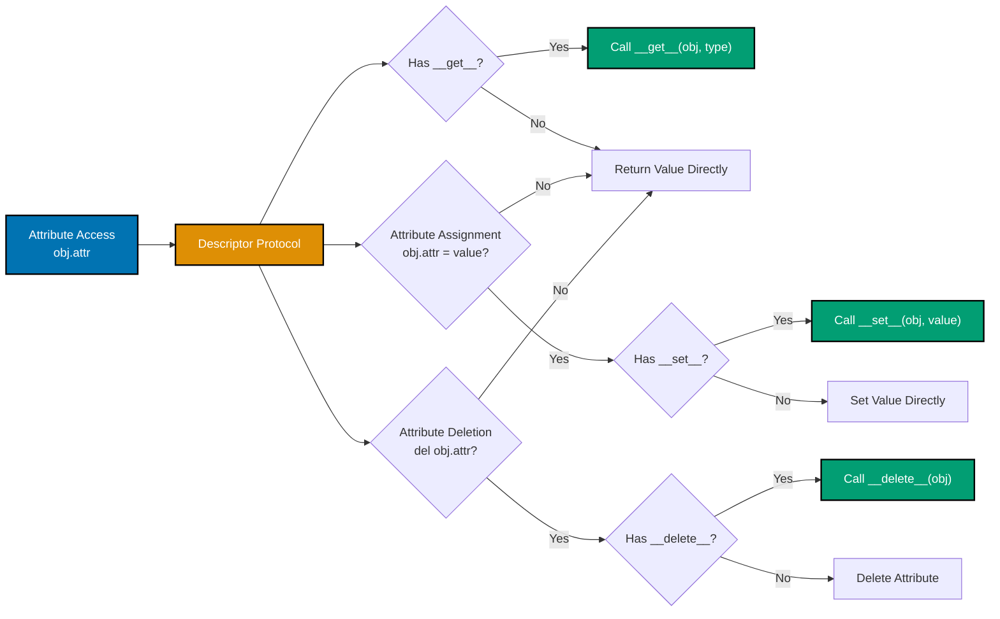
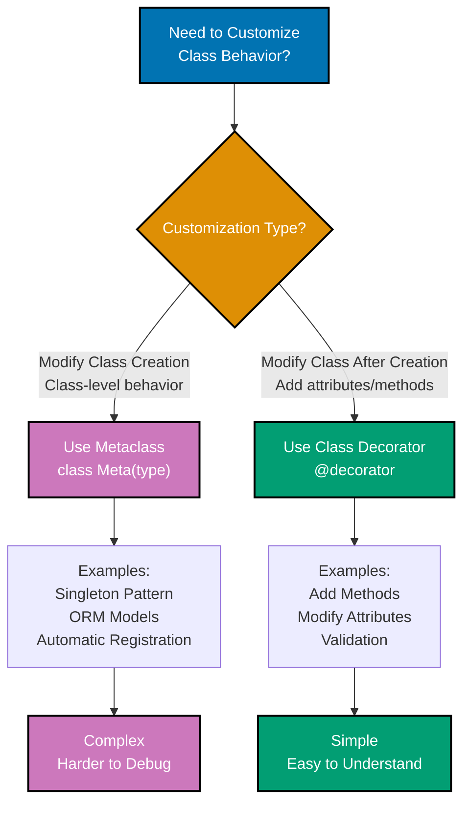

# Python Idioms

## Quick Reference

### Core Idioms by Category

**Data Transformation**:

- [List Comprehensions](#list-comprehensions) - Concise filtering and transformation
- [Dict Comprehensions](#dictionary-comprehensions) - Mapping transformations
- [Set Comprehensions](#set-comprehensions) - Unique value extraction
- [Generator Expressions](#generator-expressions) - Memory-efficient iteration

**Error Handling**:

- [EAFP](#eafp-pythonic-exception-handling) - Exception-based flow
- [LBYL](#when-to-use-lbyl) - Permission-based checks
- [Context Managers](#context-managers) - Guaranteed cleanup

**Function Enhancement**:

- [Decorators](#decorators) - Cross-cutting concerns
- [Properties](#property-decorators) - Computed attributes
- [Special Methods](#special-methods) - Custom behavior

**Iteration**:

- [Generators](#generators-and-iterators) - Lazy evaluation
- [Itertools](#itertools-patterns) - Advanced iteration
- [Functools](#functools-patterns) - Higher-order functions

**Data Modeling**:

- [Dataclasses](#dataclass-patterns) - Declarative classes
- [Enums](#enum-for-constants) - Type-safe constants
- [Protocols](#protocols-for-duck-typing) - Structural typing

**Modern Features** (Python 3.10+):

- [Match Statements](#match-statements-python-310) - Pattern matching
- [Type Hints](#type-hints-and-protocols) - Static typing
- [Pathlib](#pathlib-for-file-operations) - Modern file operations

### Quick Patterns

**Comprehensions**:

```python
[x * 2 for x in items if x > 0]  # List
{k: v for k, v in pairs if v}    # Dict
{item for item in items}          # Set
(x for x in large_data)           # Generator
```

**Context Managers**:

```python
with open(file) as f:           # Files
with db.transaction():          # Transactions
with timing_context("op"):     # Custom
```

**Decorators**:

```python
@lru_cache(maxsize=128)        # Caching
@property                       # Computed
@dataclass(frozen=True)        # Immutable
```

### Pythonic Philosophy

- **Beautiful is better than ugly** - Elegant syntax
- **Simple is better than complex** - Direct expression
- **Readability counts** - Clarity over cleverness
- **One obvious way** - Pythonic idioms provide it

### Related Documentation

- [Best Practices](./ex-so-stla-py__best-practices.md)
- [Functional Programming](./ex-so-stla-py__functional-programming.md)
- [Classes and Protocols](./ex-so-stla-py__classes-and-protocols.md)
- [Error Handling](./ex-so-stla-py__error-handling.md)

## Overview

Python idioms are expressive patterns that leverage Python's unique features to write clear, concise, and maintainable code. "Pythonic" code follows established community conventions, making code instantly recognizable to experienced Python developers.

### Why Pythonic Patterns Matter

**Readability**: Idiomatic code communicates intent clearly through familiar patterns.

**Performance**: Many Python idioms compile to optimized C code, improving execution speed.

**Maintainability**: Community-standard patterns enable easier collaboration and code review.

**Expressiveness**: Pythonic code accomplishes more with fewer lines while remaining readable.

**Platform Consistency**: Adopting Python idioms ensures consistency across Open Sharia Enterprise codebases.

### The Pythonic Philosophy

From PEP 20 (The Zen of Python):

- **Beautiful is better than ugly** - Elegant syntax over verbose constructs
- **Simple is better than complex** - Direct expression over indirection
- **Readability counts** - Clarity trumps cleverness
- **There should be one obvious way to do it** - Pythonic idioms provide that way

## Comprehensions

Comprehensions provide concise syntax for creating collections from iterables.

### List Comprehensions

```python
# GOOD: List comprehension for filtering and transformation
from decimal import Decimal
from typing import List


def calculate_qualifying_zakat(
    wealth_items: List[Decimal],
    nisab_threshold: Decimal,
) -> List[Decimal]:
    """Calculate Zakat for wealth items exceeding nisab."""
    zakat_obligations = [
        amount * Decimal("0.025")
        for amount in wealth_items
        if amount >= nisab_threshold
    ]
    return zakat_obligations


# BAD: Verbose loop-based approach
def calculate_qualifying_zakat(wealth_items, nisab_threshold):
    zakat_obligations = []  # BAD: Manual list construction
    for amount in wealth_items:
        if amount >= nisab_threshold:
            zakat_obligations.append(amount * Decimal("0.025"))
    return zakat_obligations
```

**Why this matters**: List comprehensions are faster (optimized C code) and more expressive. Single expression communicates filter-and-transform pattern clearly.

### Dictionary Comprehensions

```python
# GOOD: Dictionary comprehension for mapping
from typing import Dict


def create_donor_totals(donations: List[tuple[str, Decimal]]) -> Dict[str, Decimal]:
    """Aggregate donations by donor ID.

    Args:
        donations: List of (donor_id, amount) tuples

    Returns:
        Dictionary mapping donor_id to total donated
    """
    # Group donations by donor_id
    donor_totals = {}
    for donor_id, amount in donations:
        donor_totals[donor_id] = donor_totals.get(donor_id, Decimal("0")) + amount

    return donor_totals


def format_donor_summary(donor_totals: Dict[str, Decimal]) -> Dict[str, str]:
    """Format donation totals for display."""
    return {
        donor_id: f"${total:,.2f}"
        for donor_id, total in donor_totals.items()
        if total > Decimal("0")
    }


# BAD: Manual dictionary construction
def format_donor_summary(donor_totals):
    summary = {}
    for donor_id in donor_totals:
        total = donor_totals[donor_id]
        if total > 0:
            summary[donor_id] = f"${total:,.2f}"
    return summary
```

**Why this matters**: Dictionary comprehensions transform dictionaries concisely. Filtering during comprehension eliminates need for separate loops.

### Set Comprehensions

```python
# GOOD: Set comprehension for unique values
from typing import Set


def extract_unique_payer_ids(zakat_records: List[dict]) -> Set[str]:
    """Extract unique payer IDs from Zakat records."""
    return {
        record["payer_id"]
        for record in zakat_records
        if record.get("status") == "paid"
    }


# BAD: Manual set construction
def extract_unique_payer_ids(zakat_records):
    unique_ids = set()
    for record in zakat_records:
        if record.get("status") == "paid":
            unique_ids.add(record["payer_id"])
    return unique_ids
```

**Why this matters**: Set comprehensions eliminate duplicates automatically. Single expression clearly communicates unique-values extraction.

### Generator Expressions

```python
# GOOD: Generator expression for memory efficiency
from typing import Iterator


def calculate_monthly_zakat_stream(
    annual_wealth: Decimal,
) -> Iterator[Decimal]:
    """Generate monthly Zakat estimates from annual wealth.

    Yields:
        Monthly Zakat amount for 12 months
    """
    monthly_amount = annual_wealth / 12
    return (
        monthly_amount * Decimal("0.025")
        for _ in range(12)
    )


# Usage: Process without storing all values in memory
for month_zakat in calculate_monthly_zakat_stream(Decimal("120000.00")):
    process_monthly_obligation(month_zakat)


# BAD: List comprehension loads all values into memory
def calculate_monthly_zakat_stream(annual_wealth):
    monthly_amount = annual_wealth / 12
    return [monthly_amount * Decimal("0.025") for _ in range(12)]  # BAD: Materializes list
```

**Why this matters**: Generator expressions compute values lazily. Memory-efficient for large datasets. Identical syntax to list comprehensions (parentheses instead of brackets).

## EAFP vs LBYL

EAFP (Easier to Ask for Forgiveness than Permission) and LBYL (Look Before You Leap) represent different error-handling philosophies.

### EAFP: Pythonic Exception Handling

```python
# GOOD: EAFP - Try the operation, handle exceptions
from decimal import Decimal, InvalidOperation


def parse_donation_amount(amount_str: str) -> Decimal:
    """Parse donation amount using EAFP approach."""
    try:
        return Decimal(amount_str)
    except InvalidOperation:
        raise ValueError(f"Invalid donation amount: {amount_str}")


def get_campaign_target(campaigns: dict, campaign_id: str) -> Decimal:
    """Retrieve campaign target using EAFP."""
    try:
        return campaigns[campaign_id]["target"]
    except KeyError:
        raise ValueError(f"Campaign not found: {campaign_id}")


# BAD: LBYL - Check before operating
def parse_donation_amount(amount_str: str) -> Decimal:
    if not amount_str:  # BAD: Defensive checks
        raise ValueError("Empty amount")
    if not amount_str.replace(".", "").isdigit():  # BAD: Complex validation
        raise ValueError("Invalid amount")
    return Decimal(amount_str)


def get_campaign_target(campaigns: dict, campaign_id: str) -> Decimal:
    if campaign_id not in campaigns:  # BAD: Check-then-use race condition
        raise ValueError(f"Campaign not found: {campaign_id}")
    if "target" not in campaigns[campaign_id]:  # BAD: Multiple checks
        raise ValueError("Target not set")
    return campaigns[campaign_id]["target"]
```

**Why this matters**: EAFP is more Pythonic and often faster (no duplicate checks). Exception handling is atomic (no race conditions). Simpler code with fewer conditional branches.

### When to Use LBYL

```python
# GOOD: LBYL appropriate for permission checks
import os


def read_zakat_records_file(filepath: str) -> List[dict]:
    """Read Zakat records with permission check."""
    if not os.path.exists(filepath):
        raise FileNotFoundError(f"Zakat records file not found: {filepath}")

    if not os.access(filepath, os.R_OK):
        raise PermissionError(f"Cannot read Zakat records file: {filepath}")

    with open(filepath, "r") as f:
        return json.load(f)
```

**Why this matters**: LBYL appropriate for checking permissions (file access, user authorization) where exception messages would be cryptic. Explicit checks provide better error messages.

## Context Managers

Context managers (the `with` statement) ensure resource cleanup even when exceptions occur.

### File Handling

```python
# GOOD: Context manager ensures file closure
import json
from pathlib import Path


def save_zakat_calculation(calculation: dict, filepath: Path) -> None:
    """Save Zakat calculation to file with automatic cleanup."""
    with filepath.open("w") as f:
        json.dump(calculation, f, indent=2)
    # File automatically closed even if exception occurs


# BAD: Manual file handling
def save_zakat_calculation(calculation: dict, filepath: Path) -> None:
    f = filepath.open("w")  # BAD: No automatic cleanup
    try:
        json.dump(calculation, f, indent=2)
    finally:
        f.close()  # BAD: Manual cleanup required
```

**Why this matters**: `with` statement guarantees resource cleanup. Reduces boilerplate `try/finally` blocks. Prevents resource leaks.

### Common Python Patterns and Idioms

```mermaid
%% Color Palette: Blue #0173B2, Orange #DE8F05, Teal #029E73, Purple #CC78BC
graph TD
  A[Python Idioms] --> B[Context Managers<br/>with statement]
  A --> C[Decorators<br/>@decorator syntax]
  A --> D[Generators<br/>yield keyword]
  A --> E[Comprehensions<br/>List/Dict/Set]

  B --> F[Resource Management<br/>Files, DB, Locks]
  C --> G[Cross-Cutting Concerns<br/>Logging, Caching, Validation]
  D --> H[Lazy Iteration<br/>Memory Efficiency]
  E --> I[Data Transformation<br/>Concise Syntax]

  style A fill:#0173B2,stroke:#000,color:#fff,stroke-width:2px
  style B fill:#DE8F05,stroke:#000,color:#fff,stroke-width:2px
  style C fill:#029E73,stroke:#000,color:#fff,stroke-width:2px
  style D fill:#CC78BC,stroke:#000,color:#fff,stroke-width:2px
  style E fill:#029E73,stroke:#000,color:#fff,stroke-width:2px
```

**Pythonic patterns**:

- **Context managers**: Guarantee cleanup #40;files, locks, transactions#41;
- **Decorators**: Modify function behavior #40;caching, logging, validation#41;
- **Generators**: Lazy iteration for memory efficiency
- **Comprehensions**: Concise data transformations

### Database Transactions

```python
# GOOD: Context manager for database transactions
from contextlib import contextmanager
from typing import Iterator


class DatabaseConnection:
    """Database connection with transaction support."""

    @contextmanager
    def transaction(self) -> Iterator[None]:
        """Context manager for atomic database transactions."""
        try:
            yield  # Execute code block
            self.commit()  # Commit if no exception
        except Exception:
            self.rollback()  # Rollback on exception
            raise


# Usage
db = DatabaseConnection()


def record_zakat_payment(payer_id: str, amount: Decimal) -> None:
    """Record Zakat payment atomically."""
    with db.transaction():
        db.insert_payment(payer_id, amount)
        db.update_payer_balance(payer_id, amount)
    # Automatically commits or rolls back


# BAD: Manual transaction handling
def record_zakat_payment(payer_id: str, amount: Decimal) -> None:
    try:
        db.insert_payment(payer_id, amount)
        db.update_payer_balance(payer_id, amount)
        db.commit()  # BAD: Manual commit
    except Exception:
        db.rollback()  # BAD: Manual rollback
        raise
```

**Why this matters**: Context managers make transactional code atomic. Automatic rollback on exceptions prevents partial state changes. Cleaner code with guaranteed cleanup.

### Custom Context Managers

```python
# GOOD: Custom context manager for timing operations
from contextlib import contextmanager
from time import perf_counter
from typing import Iterator


@contextmanager
def timing_context(operation_name: str) -> Iterator[None]:
    """Context manager for timing expensive operations."""
    start_time = perf_counter()
    try:
        yield
    finally:
        elapsed = perf_counter() - start_time
        print(f"{operation_name} completed in {elapsed:.3f} seconds")


# Usage
with timing_context("Zakat calculation"):
    results = calculate_all_zakat_obligations(wealth_records)
# Automatically prints timing on exit
```

**Why this matters**: Custom context managers encapsulate setup/teardown logic. Reusable across codebase. Guarantee cleanup code execution.

## Decorators

Decorators modify or enhance functions and methods without changing their implementation.

### Function Decorators

```python
# GOOD: Decorator for caching expensive calculations
from functools import lru_cache
from decimal import Decimal


@lru_cache(maxsize=128)
def calculate_nisab_value(
    gold_price_per_gram: Decimal,
    gold_nisab_grams: int = 85,
) -> Decimal:
    """Calculate nisab threshold value (cached for performance)."""
    return gold_price_per_gram * gold_nisab_grams


# Usage: Repeated calls return cached result
nisab_1 = calculate_nisab_value(Decimal("60.00"))  # Calculates
nisab_2 = calculate_nisab_value(Decimal("60.00"))  # Returns cached value
```

**Why this matters**: `@lru_cache` decorator adds memoization without modifying function logic. Improves performance for expensive, pure functions. Decorator syntax clearly documents caching behavior.

### Custom Decorators

```python
# GOOD: Custom decorator for validation
from functools import wraps
from typing import Callable, TypeVar


T = TypeVar("T")


def validate_positive_amount(func: Callable[..., T]) -> Callable[..., T]:
    """Decorator ensuring Decimal amount parameter is positive."""

    @wraps(func)
    def wrapper(amount: Decimal, *args, **kwargs) -> T:
        if amount <= 0:
            raise ValueError(f"Amount must be positive, got {amount}")
        return func(amount, *args, **kwargs)

    return wrapper


@validate_positive_amount
def calculate_murabaha_profit(
    asset_cost: Decimal,
    profit_margin_rate: Decimal,
) -> Decimal:
    """Calculate Murabaha profit (validated for positive asset cost)."""
    return asset_cost * profit_margin_rate


# Usage
profit = calculate_murabaha_profit(Decimal("200000"), Decimal("0.15"))  # OK
profit = calculate_murabaha_profit(Decimal("-1000"), Decimal("0.15"))  # Raises ValueError
```

**Why this matters**: Decorators separate cross-cutting concerns (validation, logging, caching) from business logic. Reusable across multiple functions. Self-documenting intent.

### Method Decorators

```python
# GOOD: Property decorator for computed attributes
from dataclasses import dataclass
from decimal import Decimal


@dataclass
class MurabahaContract:
    """Murabaha contract with computed properties."""

    asset_cost: Decimal
    profit_margin_rate: Decimal
    down_payment: Decimal = Decimal("0")

    @property
    def profit_amount(self) -> Decimal:
        """Computed profit based on cost and margin."""
        return self.asset_cost * self.profit_margin_rate

    @property
    def total_selling_price(self) -> Decimal:
        """Computed total price including profit."""
        return self.asset_cost + self.profit_amount

    @property
    def financing_amount(self) -> Decimal:
        """Computed financing amount after down payment."""
        return self.total_selling_price - self.down_payment


# Usage: Properties accessed like attributes
contract = MurabahaContract(
    asset_cost=Decimal("200000"),
    profit_margin_rate=Decimal("0.15"),
    down_payment=Decimal("50000"),
)
print(contract.total_selling_price)  # Computed on access: Decimal('230000')
```

**Why this matters**: `@property` decorator creates computed attributes with attribute syntax. No redundant stored state. Lazy computation only when accessed.

## Generators and Iterators

Generators provide memory-efficient iteration over sequences.

### Generator Functions

```python
# GOOD: Generator for streaming large datasets
from typing import Iterator
import csv


def read_zakat_records_stream(filepath: str) -> Iterator[dict]:
    """Stream Zakat records without loading entire file into memory."""
    with open(filepath, "r") as f:
        reader = csv.DictReader(f)
        for row in reader:
            yield {
                "payer_id": row["payer_id"],
                "wealth_amount": Decimal(row["wealth_amount"]),
                "zakat_amount": Decimal(row["zakat_amount"]),
            }


# Usage: Process records one at a time
total_zakat = Decimal("0")
for record in read_zakat_records_stream("zakat_records.csv"):
    total_zakat += record["zakat_amount"]
# Memory usage constant regardless of file size


# BAD: Load entire file into memory
def read_zakat_records_list(filepath: str) -> List[dict]:
    records = []  # BAD: Stores all records in memory
    with open(filepath, "r") as f:
        reader = csv.DictReader(f)
        for row in reader:
            records.append({
                "payer_id": row["payer_id"],
                "wealth_amount": Decimal(row["wealth_amount"]),
                "zakat_amount": Decimal(row["zakat_amount"]),
            })
    return records  # BAD: Returns entire list
```

**Why this matters**: Generators compute values lazily (on demand). Constant memory usage regardless of dataset size. Ideal for streaming data processing.

### Generator Pipelines

```python
# GOOD: Composable generator pipeline
from typing import Iterator


def read_donations(filepath: str) -> Iterator[dict]:
    """Read donation records from file."""
    with open(filepath, "r") as f:
        reader = csv.DictReader(f)
        for row in reader:
            yield row


def filter_valid_donations(donations: Iterator[dict]) -> Iterator[dict]:
    """Filter donations with valid amounts."""
    for donation in donations:
        try:
            amount = Decimal(donation["amount"])
            if amount > 0:
                yield {**donation, "amount": amount}
        except (KeyError, ValueError):
            continue  # Skip invalid donations


def aggregate_by_campaign(donations: Iterator[dict]) -> dict[str, Decimal]:
    """Aggregate donation amounts by campaign."""
    campaign_totals = {}
    for donation in donations:
        campaign_id = donation["campaign_id"]
        amount = donation["amount"]
        campaign_totals[campaign_id] = (
            campaign_totals.get(campaign_id, Decimal("0")) + amount
        )
    return campaign_totals


# Usage: Composable pipeline with constant memory
donations = read_donations("donations.csv")
valid_donations = filter_valid_donations(donations)
campaign_totals = aggregate_by_campaign(valid_donations)
```

**Why this matters**: Generator pipelines compose naturally. Each stage processes items lazily. Memory-efficient for large datasets.

### Advanced Comprehensions

Comprehensions can handle complex transformations beyond basic filtering.

#### Nested Comprehensions

```python
# GOOD: Nested comprehension for hierarchical data
from typing import List, Dict


def extract_all_beneficiary_amounts(
    waqf_distributions: List[Dict[str, List[Dict[str, Decimal]]]],
) -> List[Decimal]:
    """Extract all beneficiary amounts from nested Waqf distribution structure.

    Args:
        waqf_distributions: List of Waqf records, each containing beneficiaries list

    Returns:
        Flat list of all beneficiary amounts
    """
    return [
        beneficiary["amount"]
        for waqf in waqf_distributions
        for beneficiary in waqf["beneficiaries"]
        if beneficiary["amount"] > Decimal("0")
    ]


# Usage
waqf_data = [
    {
        "waqf_id": "W001",
        "beneficiaries": [
            {"name": "Orphanage A", "amount": Decimal("5000")},
            {"name": "School B", "amount": Decimal("3000")},
        ],
    },
    {
        "waqf_id": "W002",
        "beneficiaries": [
            {"name": "Hospital C", "amount": Decimal("8000")},
            {"name": "Mosque D", "amount": Decimal("2000")},
        ],
    },
]

all_amounts = extract_all_beneficiary_amounts(waqf_data)
# Result: [Decimal('5000'), Decimal('3000'), Decimal('8000'), Decimal('2000')]


# BAD: Manual nested loops
def extract_all_beneficiary_amounts(waqf_distributions):
    amounts = []
    for waqf in waqf_distributions:
        for beneficiary in waqf["beneficiaries"]:
            if beneficiary["amount"] > Decimal("0"):
                amounts.append(beneficiary["amount"])
    return amounts
```

**Why this matters**: Nested comprehensions flatten hierarchical data concisely. Maintains readability when limited to 2-3 nesting levels. Faster than manual loops.

**When to avoid**: Deeply nested comprehensions (3+ levels) become hard to read. Use explicit loops or generator functions instead.

#### Conditional Expressions in Comprehensions

```python
# GOOD: Conditional transformation in comprehension
def categorize_zakat_assets(
    assets: List[Dict[str, Decimal]],
    gold_nisab: Decimal,
) -> Dict[str, List[str]]:
    """Categorize assets as Zakat-eligible or exempt.

    Args:
        assets: List of asset records with type and value
        gold_nisab: Nisab threshold for Zakat eligibility

    Returns:
        Dictionary with 'eligible' and 'exempt' asset IDs
    """
    return {
        "eligible": [
            asset["id"]
            for asset in assets
            if asset["value"] >= gold_nisab
        ],
        "exempt": [
            asset["id"]
            for asset in assets
            if asset["value"] < gold_nisab
        ],
    }


# BETTER: Single-pass categorization with conditional expression
def categorize_zakat_assets_efficient(
    assets: List[Dict[str, Decimal]],
    gold_nisab: Decimal,
) -> Dict[str, List[str]]:
    """Categorize assets in single pass."""
    categories: Dict[str, List[str]] = {"eligible": [], "exempt": []}
    for asset in assets:
        category = "eligible" if asset["value"] >= gold_nisab else "exempt"
        categories[category].append(asset["id"])
    return categories


# ADVANCED: Using comprehension with ternary for transformation
def classify_murabaha_contracts(
    contracts: List[Dict[str, Decimal]],
    threshold: Decimal,
) -> List[str]:
    """Classify Murabaha contracts as high-value or standard."""
    return [
        f"{contract['id']}:HIGH" if contract["amount"] >= threshold else f"{contract['id']}:STD"
        for contract in contracts
    ]


# Usage
contracts = [
    {"id": "M001", "amount": Decimal("500000")},
    {"id": "M002", "amount": Decimal("150000")},
    {"id": "M003", "amount": Decimal("800000")},
]

classifications = classify_murabaha_contracts(contracts, Decimal("400000"))
# Result: ['M001:HIGH', 'M002:STD', 'M003:HIGH']
```

**Why this matters**: Conditional expressions enable transformation logic within comprehensions. Single-pass operations more efficient than multiple iterations.

**When to use**: Simple binary transformations where both branches return same type.

**When to avoid**: Complex multi-branch logic better expressed with explicit loops.

## Dataclass Patterns

Python's `@dataclass` decorator provides a declarative way to define data-holding classes.

### Immutable Value Objects

```python
# GOOD: Immutable dataclass for value objects
from dataclasses import dataclass, field
from decimal import Decimal
from typing import ClassVar


@dataclass(frozen=True)
class Money:
    """Immutable monetary value with currency."""

    amount: Decimal
    currency: str = "SAR"

    # Class variable for supported currencies
    SUPPORTED_CURRENCIES: ClassVar[set[str]] = {"SAR", "USD", "EUR", "GBP"}

    def __post_init__(self) -> None:
        """Validate currency and amount after initialization."""
        if self.currency not in self.SUPPORTED_CURRENCIES:
            raise ValueError(f"Unsupported currency: {self.currency}")
        if self.amount < 0:
            raise ValueError(f"Amount cannot be negative: {self.amount}")

    def __add__(self, other: "Money") -> "Money":
        """Add two Money objects (same currency only)."""
        if not isinstance(other, Money):
            return NotImplemented
        if self.currency != other.currency:
            raise ValueError(f"Cannot add {self.currency} and {other.currency}")
        return Money(self.amount + other.amount, self.currency)

    def __mul__(self, factor: Decimal) -> "Money":
        """Multiply money by decimal factor."""
        return Money(self.amount * factor, self.currency)


# Usage: Immutable value object
zakat_base = Money(Decimal("100000"), "SAR")
zakat_amount = zakat_base * Decimal("0.025")  # Money(Decimal('2500'), 'SAR')

# zakat_base.amount = Decimal("200000")  # Error: frozen dataclass


# BAD: Mutable class with manual __init__
class Money:
    def __init__(self, amount: Decimal, currency: str = "SAR"):
        self.amount = amount  # BAD: Mutable
        self.currency = currency

    # Manual comparison methods needed
    def __eq__(self, other):
        # ...
```

**Why this matters**: `frozen=True` creates immutable objects (thread-safe, hashable). Auto-generated `__init__`, `__repr__`, `__eq__` reduce boilerplate. `__post_init__` enables validation.

### Default Factories

```python
# GOOD: field(default_factory) for mutable defaults
from dataclasses import dataclass, field
from datetime import datetime
from typing import List
from uuid import uuid4


@dataclass
class ZakatTransaction:
    """Zakat transaction record with auto-generated ID and timestamp."""

    payer_id: str
    wealth_amount: Decimal
    zakat_amount: Decimal

    # Auto-generated fields using default_factory
    transaction_id: str = field(default_factory=lambda: f"ZT-{uuid4().hex[:8]}")
    timestamp: datetime = field(default_factory=datetime.now)
    metadata: dict = field(default_factory=dict)  # New dict for each instance

    # Exclude timestamp from comparison
    timestamp: datetime = field(default_factory=datetime.now, compare=False)


# Usage: Each instance gets unique ID and timestamp
txn1 = ZakatTransaction("P001", Decimal("100000"), Decimal("2500"))
txn2 = ZakatTransaction("P002", Decimal("150000"), Decimal("3750"))

print(txn1.transaction_id)  # "ZT-a3f8b2c1"
print(txn2.transaction_id)  # "ZT-9d4e7a2b" (different)


# BAD: Mutable default (shared across instances!)
@dataclass
class ZakatTransaction:
    payer_id: str
    metadata: dict = {}  # BAD: Shared mutable default!


# Dangerous: Both instances share same dict
txn1 = ZakatTransaction("P001")
txn2 = ZakatTransaction("P002")
txn1.metadata["key"] = "value"
print(txn2.metadata)  # {'key': 'value'} - Unexpected!
```

**Why this matters**: `field(default_factory)` creates new mutable objects for each instance. Prevents shared mutable default bug. Lambda factories enable dynamic defaults (UUIDs, timestamps).

### Ordering and Comparison

```python
# GOOD: Automatic ordering for sortable dataclasses
from dataclasses import dataclass, field
from datetime import date
from decimal import Decimal


@dataclass(order=True)
class WaqfDistribution:
    """Waqf distribution record with automatic sorting by amount."""

    # Primary sort key: amount (descending)
    amount: Decimal = field(compare=True)

    # Secondary fields (not used for comparison/ordering)
    beneficiary_id: str = field(compare=False)
    distribution_date: date = field(compare=False)
    waqf_id: str = field(compare=False)

    def __post_init__(self) -> None:
        """Negate amount for descending sort."""
        # Store negative for descending order
        object.__setattr__(self, "amount", -abs(self.amount))


# Usage: Automatic sorting by amount (descending)
distributions = [
    WaqfDistribution(Decimal("5000"), "B001", date(2025, 1, 15), "W001"),
    WaqfDistribution(Decimal("8000"), "B002", date(2025, 1, 20), "W001"),
    WaqfDistribution(Decimal("3000"), "B003", date(2025, 1, 10), "W002"),
]

sorted_distributions = sorted(distributions)
# Sorted by amount descending: 8000, 5000, 3000


# ALTERNATIVE: Custom sort key without modifying data
@dataclass
class WaqfDistribution:
    amount: Decimal
    beneficiary_id: str
    distribution_date: date
    waqf_id: str


# Sort without modifying class
sorted_distributions = sorted(distributions, key=lambda d: d.amount, reverse=True)
```

**Why this matters**: `order=True` auto-generates `__lt__`, `__le__`, `__gt__`, `__ge__`. `compare=False` excludes fields from comparison. Enables natural sorting without custom comparison logic.

**When to use `order=True`**: When objects have natural ordering. For complex sort logic, use explicit `key` parameter instead.

### Post-Init Processing

```python
# GOOD: __post_init__ for computed fields and validation
from dataclasses import dataclass, field
from decimal import Decimal
from typing import Optional


@dataclass
class MurabahaContract:
    """Murabaha contract with computed profit and validation."""

    contract_id: str
    asset_cost: Decimal
    profit_margin_rate: Decimal
    down_payment: Decimal = Decimal("0")

    # Computed fields (not in __init__ signature)
    profit_amount: Decimal = field(init=False)
    total_price: Decimal = field(init=False)
    financed_amount: Decimal = field(init=False)

    def __post_init__(self) -> None:
        """Compute derived fields and validate."""
        # Validation
        if self.asset_cost <= 0:
            raise ValueError(f"Asset cost must be positive: {self.asset_cost}")
        if not (Decimal("0") < self.profit_margin_rate < Decimal("1")):
            raise ValueError(f"Profit margin must be 0-100%: {self.profit_margin_rate}")
        if self.down_payment < 0:
            raise ValueError(f"Down payment cannot be negative: {self.down_payment}")
        if self.down_payment > self.asset_cost:
            raise ValueError(f"Down payment exceeds asset cost")

        # Compute derived fields
        self.profit_amount = self.asset_cost * self.profit_margin_rate
        self.total_price = self.asset_cost + self.profit_amount
        self.financed_amount = self.total_price - self.down_payment


# Usage: Derived fields computed automatically
contract = MurabahaContract(
    contract_id="MC-001",
    asset_cost=Decimal("500000"),
    profit_margin_rate=Decimal("0.15"),
    down_payment=Decimal("100000"),
)

print(contract.profit_amount)  # Decimal('75000')
print(contract.total_price)  # Decimal('575000')
print(contract.financed_amount)  # Decimal('475000')


# BAD: Manual computation in properties (computed on every access)
class MurabahaContract:
    @property
    def profit_amount(self) -> Decimal:
        return self.asset_cost * self.profit_margin_rate  # Recomputed each time
```

**Why this matters**: `__post_init__` computes derived fields once during initialization. `field(init=False)` excludes computed fields from `__init__` signature. Centralized validation logic.

**When to use**: Computed fields that depend only on initialization parameters and don't change.

## Itertools Patterns

The `itertools` module provides powerful iteration utilities.

### Chain for Flattening

```python
# GOOD: itertools.chain for flattening iterables
from itertools import chain
from typing import List, Iterator


def aggregate_all_zakat_records(
    individual_records: List[dict],
    corporate_records: List[dict],
    waqf_records: List[dict],
) -> Iterator[dict]:
    """Combine multiple Zakat record sources into single stream."""
    return chain(individual_records, corporate_records, waqf_records)


# Usage: Process all records uniformly
for record in aggregate_all_zakat_records(individuals, corporates, waqfs):
    process_zakat_record(record)


# ADVANCED: chain.from_iterable for nested sequences
def flatten_beneficiary_lists(
    waqf_distributions: List[List[dict]],
) -> Iterator[dict]:
    """Flatten nested beneficiary lists from multiple Waqf distributions."""
    return chain.from_iterable(waqf_distributions)


# Usage
waqf_beneficiaries = [
    [{"name": "Orphanage A", "amount": Decimal("5000")}],
    [{"name": "School B", "amount": Decimal("3000")}, {"name": "Mosque C", "amount": Decimal("2000")}],
]

for beneficiary in flatten_beneficiary_lists(waqf_beneficiaries):
    process_beneficiary(beneficiary)


# BAD: Manual concatenation
def aggregate_all_zakat_records(individual_records, corporate_records, waqf_records):
    all_records = []
    all_records.extend(individual_records)  # BAD: Multiple operations
    all_records.extend(corporate_records)
    all_records.extend(waqf_records)
    return all_records  # BAD: Materializes entire list
```

**Why this matters**: `chain()` concatenates iterables lazily without materializing. `chain.from_iterable()` flattens nested sequences. Memory-efficient for large datasets.

### GroupBy for Grouping

```python
# GOOD: itertools.groupby for grouping consecutive elements
from itertools import groupby
from typing import Dict, List
from operator import itemgetter


def group_donations_by_campaign(
    donations: List[Dict[str, str | Decimal]],
) -> Dict[str, List[Dict[str, str | Decimal]]]:
    """Group donations by campaign ID (assumes pre-sorted by campaign_id)."""
    # Must sort by grouping key first
    sorted_donations = sorted(donations, key=itemgetter("campaign_id"))

    grouped = {}
    for campaign_id, group in groupby(sorted_donations, key=itemgetter("campaign_id")):
        grouped[campaign_id] = list(group)

    return grouped


# Usage
donations = [
    {"campaign_id": "C001", "amount": Decimal("500"), "donor": "D1"},
    {"campaign_id": "C002", "amount": Decimal("1000"), "donor": "D2"},
    {"campaign_id": "C001", "amount": Decimal("750"), "donor": "D3"},
]

grouped_donations = group_donations_by_campaign(donations)
# {
#   'C001': [{'campaign_id': 'C001', ...}, {'campaign_id': 'C001', ...}],
#   'C002': [{'campaign_id': 'C002', ...}]
# }


# IMPORTANT: groupby requires sorted input
# BAD: Ungrouped input leads to incorrect results
unsorted_donations = [
    {"campaign_id": "C001", "amount": Decimal("500")},
    {"campaign_id": "C002", "amount": Decimal("1000")},
    {"campaign_id": "C001", "amount": Decimal("750")},  # C001 appears again
]

# Wrong: Creates two separate C001 groups
for campaign_id, group in groupby(unsorted_donations, key=itemgetter("campaign_id")):
    print(campaign_id, list(group))
# C001 [{'campaign_id': 'C001', ...}]
# C002 [{'campaign_id': 'C002', ...}]
# C001 [{'campaign_id': 'C001', ...}]  # Second C001 group!
```

**Why this matters**: `groupby()` efficiently groups consecutive elements by key. Lazy iteration (doesn't materialize groups). **Critical**: Requires sorted input for correct results.

**When to use**: Grouping sorted data where memory efficiency matters.

**When to avoid**: Unsorted data (use `collections.defaultdict` or dict comprehension instead).

### Islice for Pagination

```python
# GOOD: itertools.islice for pagination
from itertools import islice
from typing import Iterator, List


def paginate_zakat_records(
    all_records: Iterator[dict],
    page_number: int,
    page_size: int = 100,
) -> List[dict]:
    """Paginate Zakat records from infinite stream.

    Args:
        all_records: Iterator of Zakat records
        page_number: Page number (1-indexed)
        page_size: Records per page

    Returns:
        List of records for specified page
    """
    start_index = (page_number - 1) * page_size
    return list(islice(all_records, start_index, start_index + page_size))


# Usage: Fetch page 3 (records 200-299)
page_3_records = paginate_zakat_records(record_stream, page_number=3, page_size=100)


# ADVANCED: Windowing with islice
def create_sliding_window(
    amounts: Iterator[Decimal],
    window_size: int,
) -> Iterator[tuple[Decimal, ...]]:
    """Create sliding windows of Zakat amounts for moving average."""
    window = list(islice(amounts, window_size))
    if len(window) < window_size:
        return

    yield tuple(window)

    for amount in amounts:
        window = window[1:] + [amount]  # Slide window
        yield tuple(window)


# Usage: 7-day moving window of Zakat collections
for window in create_sliding_window(daily_collections, window_size=7):
    moving_avg = sum(window) / len(window)
    print(f"7-day average: {moving_avg}")
```

**Why this matters**: `islice()` extracts slices from iterators without materializing entire sequence. Enables pagination over large datasets. Memory-efficient windowing.

### Combinations for Scenarios

```python
# GOOD: itertools.combinations for scenario analysis
from itertools import combinations
from typing import List, Iterator


def analyze_waqf_beneficiary_pairs(
    beneficiaries: List[str],
) -> Iterator[tuple[str, str]]:
    """Generate all possible beneficiary pairs for conflict-of-interest checks.

    Args:
        beneficiaries: List of beneficiary IDs

    Yields:
        All unique pairs of beneficiaries
    """
    return combinations(beneficiaries, 2)


# Usage: Check all pairs for conflicts
beneficiaries = ["B001", "B002", "B003", "B004"]

for beneficiary_a, beneficiary_b in analyze_waqf_beneficiary_pairs(beneficiaries):
    if has_conflict_of_interest(beneficiary_a, beneficiary_b):
        log_conflict(beneficiary_a, beneficiary_b)


# ADVANCED: Multi-asset portfolio combinations
def generate_zakat_portfolio_scenarios(
    assets: List[str],
    portfolio_size: int,
) -> Iterator[tuple[str, ...]]:
    """Generate all possible asset portfolios of specified size."""
    return combinations(assets, portfolio_size)


# Usage: Analyze all 3-asset portfolios
assets = ["Gold", "Silver", "Cash", "Property", "Stocks"]

for portfolio in generate_zakat_portfolio_scenarios(assets, portfolio_size=3):
    diversification_score = calculate_diversification(portfolio)
    print(f"Portfolio {portfolio}: Diversification = {diversification_score}")
```

**Why this matters**: `combinations()` generates all unique combinations efficiently. Lazy iteration (doesn't materialize all combinations). Useful for scenario analysis, conflict detection, portfolio optimization.

**Performance note**: Number of combinations grows exponentially. For large sets, consider sampling or filtering.

### Descriptor Protocol for Properties



**Descriptor methods**:

- **`__get__(self, obj, type)`**: Called on attribute access
- **`__set__(self, obj, value)`**: Called on attribute assignment
- **`__delete__(self, obj)`**: Called on attribute deletion

**Why this matters**: Descriptors power Python's `@property` decorator. Understanding descriptors enables custom attribute behavior.

## Duck Typing

Python uses duck typing: "If it walks like a duck and quacks like a duck, it's a duck."

### Protocol-Based Duck Typing

```python
# GOOD: Duck typing with Protocol for type safety
from typing import Protocol
from decimal import Decimal


class FinancialCalculator(Protocol):
    """Protocol for financial calculation services."""

    def calculate(self, base_amount: Decimal) -> Decimal:
        """Calculate financial obligation from base amount."""
        ...


class ZakatCalculator:
    """Calculate Zakat (2.5% of wealth)."""

    def calculate(self, wealth_amount: Decimal) -> Decimal:
        return wealth_amount * Decimal("0.025")


class DonationCalculator:
    """Calculate recommended donation (1% of income)."""

    def calculate(self, income_amount: Decimal) -> Decimal:
        return income_amount * Decimal("0.01")


def apply_calculator(
    calculator: FinancialCalculator,
    amounts: List[Decimal],
) -> List[Decimal]:
    """Apply calculator to all amounts (duck typed)."""
    return [calculator.calculate(amount) for amount in amounts]


# Usage: Both calculators work without shared base class
zakat_calc = ZakatCalculator()
donation_calc = DonationCalculator()

zakat_results = apply_calculator(zakat_calc, wealth_amounts)
donation_results = apply_calculator(donation_calc, income_amounts)
```

**Why this matters**: Protocols enable type-safe duck typing. No explicit inheritance required. Looser coupling between components.

## Property Decorators

Properties provide computed attributes with attribute syntax.

### Read-Only Properties

```python
# GOOD: Read-only property for computed values
from dataclasses import dataclass
from datetime import date
from decimal import Decimal


@dataclass(frozen=True)
class QardHasanLoan:
    """Interest-free loan with computed properties."""

    loan_id: str
    principal_amount: Decimal
    disbursement_date: date
    repaid_amount: Decimal = Decimal("0")

    @property
    def remaining_balance(self) -> Decimal:
        """Remaining loan balance (computed)."""
        return self.principal_amount - self.repaid_amount

    @property
    def is_fully_repaid(self) -> bool:
        """Check if loan is fully repaid (computed)."""
        return self.remaining_balance == Decimal("0")

    @property
    def repayment_percentage(self) -> Decimal:
        """Percentage of loan repaid (computed)."""
        if self.principal_amount == Decimal("0"):
            return Decimal("0")
        return (self.repaid_amount / self.principal_amount) * Decimal("100")


# Usage: Properties accessed like attributes
loan = QardHasanLoan(
    loan_id="QL-001",
    principal_amount=Decimal("50000"),
    disbursement_date=date(2025, 1, 1),
    repaid_amount=Decimal("20000"),
)
print(loan.remaining_balance)  # Decimal('30000')
print(loan.repayment_percentage)  # Decimal('40')
```

**Why this matters**: Properties compute values on demand without storing redundant state. Attribute syntax simpler than method calls. Immutable dataclass with `frozen=True` prevents accidental modification.

### Properties with Setters

```python
# GOOD: Property with setter for validation
from decimal import Decimal


class DonationCampaign:
    """Donation campaign with validated target."""

    def __init__(self, campaign_id: str, target_amount: Decimal):
        self.campaign_id = campaign_id
        self._target_amount = Decimal("0")
        self.target_amount = target_amount  # Use setter for validation

    @property
    def target_amount(self) -> Decimal:
        """Campaign target amount."""
        return self._target_amount

    @target_amount.setter
    def target_amount(self, value: Decimal) -> None:
        """Set target amount with validation."""
        if value <= 0:
            raise ValueError("Target amount must be positive")
        self._target_amount = value


# Usage
campaign = DonationCampaign("CAMP-001", Decimal("100000"))
campaign.target_amount = Decimal("150000")  # OK
campaign.target_amount = Decimal("-1000")  # Raises ValueError
```

**Why this matters**: Property setters enable validation during assignment. Attribute syntax feels natural. Encapsulates validation logic.

## Special Methods

Special methods (dunder methods: `__method__`) customize object behavior.

### String Representation

```python
# GOOD: __str__ and __repr__ for meaningful representations
from dataclasses import dataclass
from decimal import Decimal


@dataclass
class ZakatObligation:
    """Zakat obligation with custom representations."""

    payer_id: str
    wealth_amount: Decimal
    zakat_amount: Decimal

    def __str__(self) -> str:
        """Human-readable string representation."""
        return (
            f"Zakat Obligation: {self.payer_id} "
            f"owes ${self.zakat_amount:,.2f} on ${self.wealth_amount:,.2f}"
        )

    def __repr__(self) -> str:
        """Unambiguous representation for debugging."""
        return (
            f"ZakatObligation("
            f"payer_id={self.payer_id!r}, "
            f"wealth_amount={self.wealth_amount!r}, "
            f"zakat_amount={self.zakat_amount!r})"
        )


# Usage
obligation = ZakatObligation("PAYER-001", Decimal("100000"), Decimal("2500"))
print(str(obligation))  # Zakat Obligation: PAYER-001 owes $2,500.00 on $100,000.00
print(repr(obligation))  # ZakatObligation(payer_id='PAYER-001', ...)
```

**Why this matters**: `__str__` provides user-friendly output. `__repr__` provides unambiguous debugging output. Facilitates logging and debugging.

### Comparison Operators

```python
# GOOD: Comparison operators for ordering
from functools import total_ordering
from dataclasses import dataclass
from decimal import Decimal


@total_ordering
@dataclass(frozen=True)
class Donation:
    """Donation with comparison support."""

    donor_id: str
    amount: Decimal
    timestamp: datetime

    def __eq__(self, other: object) -> bool:
        """Donations equal if amounts match."""
        if not isinstance(other, Donation):
            return NotImplemented
        return self.amount == other.amount

    def __lt__(self, other: object) -> bool:
        """Compare donations by amount."""
        if not isinstance(other, Donation):
            return NotImplemented
        return self.amount < other.amount


# Usage: @total_ordering generates other comparison operators
donations = [
    Donation("D1", Decimal("100"), datetime.now()),
    Donation("D2", Decimal("500"), datetime.now()),
    Donation("D3", Decimal("250"), datetime.now()),
]
sorted_donations = sorted(donations)  # Sorted by amount
```

**Why this matters**: `@total_ordering` generates all comparison operators from `__eq__` and `__lt__`. Enables sorting and comparison. Reduces boilerplate code.

### Metaclass vs Decorator Decision



**Decision criteria**:

- **Metaclass**: Class creation customization, complex scenarios #40;ORM, singleton#41;
- **Decorator**: Class modification after creation, simpler and more Pythonic

**General rule**: Prefer class decorators unless you specifically need metaclass behavior.

## Functools Patterns

The `functools` module provides higher-order functions and decorators.

### LRU Cache for Memoization

```python
# GOOD: @lru_cache for expensive pure functions
from functools import lru_cache
from decimal import Decimal


@lru_cache(maxsize=256)
def calculate_nisab_threshold(
    gold_price_per_gram: Decimal,
    silver_price_per_gram: Decimal,
) -> Decimal:
    """Calculate Zakat nisab threshold (cached for performance).

    Nisab is the lower of:
    - 85 grams of gold
    - 595 grams of silver

    Args:
        gold_price_per_gram: Current gold price per gram
        silver_price_per_gram: Current silver price per gram

    Returns:
        Nisab threshold amount
    """
    gold_nisab = gold_price_per_gram * Decimal("85")
    silver_nisab = silver_price_per_gram * Decimal("595")
    return min(gold_nisab, silver_nisab)


# Usage: Repeated calls with same arguments return cached result
gold_price = Decimal("60.00")
silver_price = Decimal("0.70")

nisab_1 = calculate_nisab_threshold(gold_price, silver_price)  # Calculates
nisab_2 = calculate_nisab_threshold(gold_price, silver_price)  # Returns cached
nisab_3 = calculate_nisab_threshold(gold_price, silver_price)  # Returns cached

# Check cache statistics
print(calculate_nisab_threshold.cache_info())
# CacheInfo(hits=2, misses=1, maxsize=256, currsize=1)

# Clear cache when prices update
calculate_nisab_threshold.cache_clear()


# ADVANCED: Cache with custom key function
from functools import lru_cache, wraps


def cache_by_date(func):
    """Cache function results by date only (ignore time)."""

    @lru_cache(maxsize=128)
    def cached_wrapper(date_key: str, *args, **kwargs):
        return func(*args, **kwargs)

    @wraps(func)
    def wrapper(*args, **kwargs):
        # Extract date from first datetime argument
        date_key = args[0].date().isoformat() if args else None
        return cached_wrapper(date_key, *args, **kwargs)

    return wrapper


@cache_by_date
def fetch_daily_exchange_rate(timestamp: datetime, currency: str) -> Decimal:
    """Fetch exchange rate (cached by date, ignoring time)."""
    # Expensive API call
    return api.get_exchange_rate(timestamp.date(), currency)


# Usage: Multiple calls on same date return cached result
rate_1 = fetch_daily_exchange_rate(datetime(2025, 1, 24, 9, 0), "USD")
rate_2 = fetch_daily_exchange_rate(datetime(2025, 1, 24, 15, 30), "USD")  # Cached!
```

**Why this matters**: `@lru_cache` automatically memoizes function results. Significant performance improvement for expensive pure functions. Built-in cache statistics and clearing.

**When to use**: Pure functions (same inputs always produce same outputs), expensive computations, API calls with rate limits.

**When to avoid**: Functions with side effects, unbounded cache growth (use limited `maxsize`).

### Partial for Function Currying

```python
# GOOD: functools.partial for partial application
from functools import partial
from decimal import Decimal


def calculate_zakat_general(
    wealth_amount: Decimal,
    nisab_threshold: Decimal,
    zakat_rate: Decimal,
) -> Decimal:
    """Calculate Zakat with customizable rate and threshold."""
    if wealth_amount < nisab_threshold:
        return Decimal("0")
    return wealth_amount * zakat_rate


# Create specialized functions with partial application
calculate_standard_zakat = partial(
    calculate_zakat_general,
    nisab_threshold=Decimal("85") * Decimal("60.00"),  # 85g gold @ $60/g
    zakat_rate=Decimal("0.025"),  # 2.5%
)

calculate_agricultural_zakat = partial(
    calculate_zakat_general,
    nisab_threshold=Decimal("653") * Decimal("3.00"),  # 653kg @ $3/kg
    zakat_rate=Decimal("0.10"),  # 10% for irrigated crops
)


# Usage: Simplified function calls
wealth = Decimal("100000")
standard_zakat = calculate_standard_zakat(wealth)  # Only wealth argument needed
agricultural_zakat = calculate_agricultural_zakat(Decimal("50000"))


# ADVANCED: Partial with keyword arguments
def create_murabaha_calculator(
    profit_margin_rate: Decimal,
    min_down_payment_pct: Decimal,
) -> callable:
    """Factory for Murabaha calculators with specific parameters."""

    def calculate_murabaha(
        asset_cost: Decimal,
        down_payment: Decimal,
        term_months: int,
    ) -> Dict[str, Decimal]:
        """Calculate Murabaha contract terms."""
        if down_payment < asset_cost * min_down_payment_pct:
            raise ValueError(f"Down payment below minimum {min_down_payment_pct * 100}%")

        profit = asset_cost * profit_margin_rate
        total_price = asset_cost + profit
        financed_amount = total_price - down_payment
        monthly_payment = financed_amount / term_months

        return {
            "profit": profit,
            "total_price": total_price,
            "financed_amount": financed_amount,
            "monthly_payment": monthly_payment,
        }

    return calculate_murabaha


# Create specialized calculators
home_murabaha_calc = create_murabaha_calculator(
    profit_margin_rate=Decimal("0.12"),
    min_down_payment_pct=Decimal("0.20"),
)

auto_murabaha_calc = create_murabaha_calculator(
    profit_margin_rate=Decimal("0.08"),
    min_down_payment_pct=Decimal("0.15"),
)

# Usage
home_terms = home_murabaha_calc(
    asset_cost=Decimal("500000"),
    down_payment=Decimal("100000"),
    term_months=120,
)
```

**Why this matters**: `partial()` creates specialized functions by fixing some arguments. Reduces repetition and improves code clarity. Enables function factories for configuration-specific behavior.

### Reduce for Aggregation

```python
# GOOD: functools.reduce for complex aggregation
from functools import reduce
from decimal import Decimal
from typing import List, Dict


def aggregate_zakat_by_category(
    transactions: List[Dict[str, str | Decimal]],
) -> Dict[str, Decimal]:
    """Aggregate Zakat amounts by asset category using reduce."""

    def accumulate_categories(
        acc: Dict[str, Decimal],
        transaction: Dict[str, str | Decimal],
    ) -> Dict[str, Decimal]:
        """Accumulator function for reduce."""
        category = transaction["category"]
        amount = transaction["zakat_amount"]
        acc[category] = acc.get(category, Decimal("0")) + amount
        return acc

    return reduce(accumulate_categories, transactions, {})


# Usage
transactions = [
    {"category": "Gold", "zakat_amount": Decimal("2500")},
    {"category": "Cash", "zakat_amount": Decimal("1500")},
    {"category": "Gold", "zakat_amount": Decimal("3000")},
    {"category": "Stocks", "zakat_amount": Decimal("5000")},
]

category_totals = aggregate_zakat_by_category(transactions)
# {'Gold': Decimal('5500'), 'Cash': Decimal('1500'), 'Stocks': Decimal('5000')}


# ADVANCED: Reduce for nested aggregation
def calculate_total_waqf_impact(
    waqf_distributions: List[Dict[str, List[Dict[str, Decimal]]]],
) -> Decimal:
    """Calculate total Waqf impact across all distributions and beneficiaries."""

    def sum_beneficiaries(total: Decimal, waqf: Dict) -> Decimal:
        """Sum all beneficiary amounts in a Waqf distribution."""
        beneficiary_sum = reduce(
            lambda acc, b: acc + b["amount"],
            waqf["beneficiaries"],
            Decimal("0"),
        )
        return total + beneficiary_sum

    return reduce(sum_beneficiaries, waqf_distributions, Decimal("0"))


# Usage
waqf_data = [
    {
        "waqf_id": "W001",
        "beneficiaries": [
            {"amount": Decimal("5000")},
            {"amount": Decimal("3000")},
        ],
    },
    {
        "waqf_id": "W002",
        "beneficiaries": [
            {"amount": Decimal("8000")},
        ],
    },
]

total_impact = calculate_total_waqf_impact(waqf_data)  # Decimal('16000')


# NOTE: For simple summation, prefer sum() builtin
# BETTER for simple cases:
def calculate_total_waqf_impact_simple(waqf_distributions):
    return sum(
        beneficiary["amount"]
        for waqf in waqf_distributions
        for beneficiary in waqf["beneficiaries"]
    )
```

**Why this matters**: `reduce()` enables complex multi-step aggregations. Useful for nested data structures and stateful accumulation.

**When to use**: Complex aggregations where state accumulates across iterations.

**When to avoid**: Simple summation (use `sum()`), simple filtering (use comprehensions). `reduce()` can be less readable than explicit loops.

### Wraps for Decorator Preservation

```python
# GOOD: @wraps preserves function metadata
from functools import wraps
from typing import Callable, TypeVar
from time import perf_counter


T = TypeVar("T")


def timing_decorator(func: Callable[..., T]) -> Callable[..., T]:
    """Decorator that times function execution."""

    @wraps(func)  # Preserves func's metadata
    def wrapper(*args, **kwargs) -> T:
        start = perf_counter()
        result = func(*args, **kwargs)
        elapsed = perf_counter() - start
        print(f"{func.__name__} took {elapsed:.3f}s")
        return result

    return wrapper


@timing_decorator
def calculate_complex_zakat(wealth_records: List[dict]) -> Decimal:
    """Calculate Zakat across multiple asset types.

    This is a complex calculation involving...
    """
    # Implementation
    ...


# With @wraps: Function metadata preserved
print(calculate_complex_zakat.__name__)  # 'calculate_complex_zakat'
print(calculate_complex_zakat.__doc__)  # Original docstring preserved


# BAD: Without @wraps
def timing_decorator_bad(func):
    def wrapper(*args, **kwargs):
        # ... timing logic
        return func(*args, **kwargs)

    return wrapper  # Missing @wraps!


@timing_decorator_bad
def calculate_complex_zakat(wealth_records):
    """Calculate Zakat across multiple asset types."""
    ...


# Without @wraps: Metadata lost
print(calculate_complex_zakat.__name__)  # 'wrapper' - Wrong!
print(calculate_complex_zakat.__doc__)  # None - Docstring lost!
```

**Why this matters**: `@wraps` copies metadata (`__name__`, `__doc__`, `__annotations__`) from wrapped function. Preserves function identity for introspection and debugging. Essential for decorator correctness.

**Always use**: In every decorator that wraps a function.

## Pathlib for File Operations

Modern Python uses `pathlib.Path` instead of `os.path` for file operations.

### Path Construction and Manipulation

```python
# GOOD: pathlib.Path for file operations
from pathlib import Path
from decimal import Decimal
import json


def save_zakat_report(
    report_data: dict,
    output_dir: Path,
    payer_id: str,
) -> Path:
    """Save Zakat report using pathlib for path operations.

    Args:
        report_data: Zakat calculation results
        output_dir: Directory for report files
        payer_id: Unique payer identifier

    Returns:
        Path to saved report file
    """
    # Path construction with / operator
    reports_dir = output_dir / "zakat_reports" / "2025"

    # Create directories if they don't exist
    reports_dir.mkdir(parents=True, exist_ok=True)

    # Construct filename
    report_file = reports_dir / f"{payer_id}_zakat_report.json"

    # Write file using Path methods
    report_file.write_text(json.dumps(report_data, indent=2))

    return report_file


# Usage: Clean path operations
output_path = Path("/var/ose/output")
report_path = save_zakat_report(
    report_data={"payer_id": "P001", "zakat": Decimal("2500")},
    output_dir=output_path,
    payer_id="P001",
)

print(report_path)  # PosixPath('/var/ose/output/zakat_reports/2025/P001_zakat_report.json')


# BAD: os.path string manipulation
import os


def save_zakat_report_old(report_data, output_dir, payer_id):
    reports_dir = os.path.join(output_dir, "zakat_reports", "2025")  # Verbose

    if not os.path.exists(reports_dir):  # Manual existence check
        os.makedirs(reports_dir)

    report_file = os.path.join(reports_dir, f"{payer_id}_zakat_report.json")

    with open(report_file, "w") as f:  # Manual file handling
        json.dump(report_data, f, indent=2)

    return report_file
```

**Why this matters**: `Path` objects use `/` operator for natural path construction. Built-in methods for common operations (`mkdir`, `write_text`, `read_text`). Object-oriented API more intuitive than string-based `os.path`.

### Path Traversal and Filtering

```python
# GOOD: Path.glob() for file discovery
from pathlib import Path
from typing import Iterator


def find_murabaha_contracts(
    contracts_dir: Path,
    year: int,
) -> Iterator[Path]:
    """Find all Murabaha contract files for a specific year.

    Args:
        contracts_dir: Root directory containing contracts
        year: Year to filter contracts

    Yields:
        Paths to matching contract files
    """
    # Recursive glob pattern
    pattern = f"**/murabaha_{year}_*.json"

    for contract_file in contracts_dir.glob(pattern):
        if contract_file.is_file():
            yield contract_file


# Usage: Iterate over matching files
contracts_root = Path("/var/ose/contracts")

for contract_path in find_murabaha_contracts(contracts_root, year=2025):
    process_contract(contract_path)


# ADVANCED: Filter files by size and date
from datetime import datetime, timedelta


def find_large_recent_reports(
    reports_dir: Path,
    min_size_mb: float = 1.0,
    days_recent: int = 7,
) -> Iterator[Path]:
    """Find large recent Zakat reports."""
    min_size_bytes = min_size_mb * 1024 * 1024
    cutoff_time = datetime.now().timestamp() - (days_recent * 86400)

    for report_file in reports_dir.rglob("*.json"):
        if not report_file.is_file():
            continue

        stat = report_file.stat()

        # Filter by size and modification time
        if stat.st_size >= min_size_bytes and stat.st_mtime >= cutoff_time:
            yield report_file


# Usage
reports_root = Path("/var/ose/reports")

for report_path in find_large_recent_reports(reports_root, min_size_mb=2.0, days_recent=30):
    print(f"Large recent report: {report_path.name} ({report_path.stat().st_size / 1024 / 1024:.2f} MB)")
```

**Why this matters**: `glob()` and `rglob()` provide powerful pattern matching. `stat()` accesses file metadata. Object methods (`is_file()`, `is_dir()`) cleaner than `os.path.isfile()`.

### Safe File Reading with Context

```python
# GOOD: Pathlib with context managers
from pathlib import Path
import json
from decimal import Decimal


def load_zakat_calculation(filepath: Path) -> dict:
    """Load Zakat calculation from JSON file safely.

    Args:
        filepath: Path to JSON file

    Returns:
        Zakat calculation data

    Raises:
        FileNotFoundError: If file doesn't exist
        json.JSONDecodeError: If file is not valid JSON
    """
    # Check file exists before reading
    if not filepath.exists():
        raise FileNotFoundError(f"Zakat calculation not found: {filepath}")

    # Read and parse in one operation
    data = json.loads(filepath.read_text())

    # Convert string decimals back to Decimal
    if "zakat_amount" in data:
        data["zakat_amount"] = Decimal(data["zakat_amount"])

    return data


# Usage: Safe file loading
calculation_path = Path("/var/ose/calculations/P001_zakat.json")

try:
    calculation = load_zakat_calculation(calculation_path)
    print(f"Zakat amount: {calculation['zakat_amount']}")
except FileNotFoundError as e:
    logger.error(f"Calculation file not found: {e}")
except json.JSONDecodeError as e:
    logger.error(f"Invalid JSON in calculation file: {e}")
```

**Why this matters**: `Path.read_text()` and `Path.write_text()` handle file context automatically. `Path.exists()` provides clean existence checking. Exception handling with specific Path errors improves debugging.

## Enum for Constants

Enumerations provide type-safe constants with semantic meaning.

### Basic Enums

```python
# GOOD: Enum for type-safe constants
from enum import Enum, auto
from decimal import Decimal


class ZakatAssetCategory(Enum):
    """Categories of Zakat-eligible assets."""

    GOLD = auto()
    SILVER = auto()
    CASH = auto()
    STOCKS = auto()
    TRADE_GOODS = auto()
    AGRICULTURAL = auto()
    LIVESTOCK = auto()


class TransactionStatus(Enum):
    """Zakat transaction status."""

    PENDING = "pending"
    CONFIRMED = "confirmed"
    PAID = "paid"
    CANCELLED = "cancelled"


# Usage: Type-safe enum members
def calculate_zakat_by_category(
    category: ZakatAssetCategory,
    asset_value: Decimal,
) -> Decimal:
    """Calculate Zakat based on asset category."""
    if category == ZakatAssetCategory.GOLD:
        return asset_value * Decimal("0.025")
    elif category == ZakatAssetCategory.AGRICULTURAL:
        return asset_value * Decimal("0.10")  # 10% for irrigated
    # ... other categories


# Type safety: Only valid enum members accepted
zakat = calculate_zakat_by_category(
    ZakatAssetCategory.GOLD,
    Decimal("100000"),
)

# zakat = calculate_zakat_by_category("gold", Decimal("100000"))  # Type error!


# Iteration over enum members
for category in ZakatAssetCategory:
    print(f"{category.name}: {category.value}")
# GOLD: 1
# SILVER: 2
# ...
```

**Why this matters**: Enums prevent typos and invalid values. Type checkers enforce enum usage. Self-documenting code (enum names convey meaning). `auto()` generates unique values automatically.

### IntEnum for Numeric Constants

```python
# GOOD: IntEnum for ordered numeric constants
from enum import IntEnum


class WaqfPriority(IntEnum):
    """Waqf beneficiary priority levels (higher = more urgent)."""

    LOW = 1
    MEDIUM = 2
    HIGH = 3
    CRITICAL = 4


# Usage: Natural comparison and sorting
def should_prioritize_beneficiary(
    beneficiary_priority: WaqfPriority,
    threshold: WaqfPriority,
) -> bool:
    """Check if beneficiary should be prioritized."""
    return beneficiary_priority >= threshold


# Comparison works naturally
if WaqfPriority.CRITICAL > WaqfPriority.MEDIUM:
    print("Critical priority is higher")

# Sorting works automatically
priorities = [WaqfPriority.LOW, WaqfPriority.CRITICAL, WaqfPriority.MEDIUM]
sorted_priorities = sorted(priorities)  # [LOW, MEDIUM, CRITICAL]
```

**Why this matters**: `IntEnum` members are integers (support comparison, arithmetic). Enables natural sorting and threshold checks. Use when enum values have inherent ordering.

### Flag for Bitmask Operations

```python
# GOOD: Flag enum for bitmask combinations
from enum import Flag, auto


class MurabahaFeatures(Flag):
    """Murabaha contract features (can be combined)."""

    EARLY_PAYMENT = auto()  # Early payment discount
    DEFERRED_PAYMENT = auto()  # Deferred payment schedule
    GRACE_PERIOD = auto()  # Grace period for payments
    COLLATERAL = auto()  # Requires collateral


# Usage: Combine multiple features with | operator
contract_features = (
    MurabahaFeatures.EARLY_PAYMENT
    | MurabahaFeatures.GRACE_PERIOD
    | MurabahaFeatures.COLLATERAL
)

# Check if specific feature included
if MurabahaFeatures.EARLY_PAYMENT in contract_features:
    apply_early_payment_discount()

# Check multiple features
if contract_features & (MurabahaFeatures.COLLATERAL | MurabahaFeatures.GRACE_PERIOD):
    print("Contract has collateral or grace period")

# Remove feature
modified_features = contract_features & ~MurabahaFeatures.GRACE_PERIOD
```

**Why this matters**: `Flag` enables combining enum members with bitwise operators. Efficient storage of multiple boolean flags. Type-safe feature combinations.

**When to use**: When objects can have multiple independent attributes/features simultaneously.

## Match Statements (Python 3.10+)

Structural pattern matching provides expressive conditional logic.

### Basic Pattern Matching

```python
# GOOD: Match statement for multi-way branching (Python 3.10+)
from decimal import Decimal
from enum import Enum


class AssetType(Enum):
    GOLD = "gold"
    SILVER = "silver"
    CASH = "cash"
    STOCKS = "stocks"


def calculate_zakat_by_type(asset_type: AssetType, value: Decimal) -> Decimal:
    """Calculate Zakat using pattern matching."""
    match asset_type:
        case AssetType.GOLD | AssetType.SILVER:
            # Precious metals: 2.5%
            return value * Decimal("0.025")

        case AssetType.CASH:
            # Cash and equivalents: 2.5%
            return value * Decimal("0.025")

        case AssetType.STOCKS:
            # Stocks: 2.5% of current market value
            return value * Decimal("0.025")

        case _:
            # Unknown asset type
            raise ValueError(f"Unsupported asset type: {asset_type}")


# ADVANCED: Pattern matching with guards
def categorize_murabaha_risk(
    contract_amount: Decimal,
    down_payment_pct: Decimal,
    credit_score: int,
) -> str:
    """Categorize Murabaha contract risk using pattern matching with guards."""
    match (contract_amount, down_payment_pct, credit_score):
        case (amount, down_pct, score) if amount > Decimal("1000000") and score < 600:
            return "HIGH_RISK"

        case (amount, down_pct, score) if down_pct >= Decimal("0.30") and score >= 700:
            return "LOW_RISK"

        case (amount, down_pct, score) if down_pct >= Decimal("0.20") and score >= 650:
            return "MEDIUM_RISK"

        case _:
            return "STANDARD_RISK"


# Usage
risk = categorize_murabaha_risk(
    Decimal("500000"),
    Decimal("0.25"),
    credit_score=680,
)
# Returns: "MEDIUM_RISK"
```

**Why this matters**: Match statements more readable than long `if/elif` chains. Guard clauses enable complex conditions. Pattern matching on structure (tuples, dicts) simplifies destructuring.

**When to use**: Multi-way branching with complex conditions, data structure destructuring.

**When to avoid**: Simple binary conditions (use `if/else`), dictionary dispatch more appropriate.

### Structural Pattern Matching

```python
# GOOD: Match with structural unpacking
from typing import Dict, Any


def process_zakat_transaction(transaction: Dict[str, Any]) -> str:
    """Process Zakat transaction based on structure."""
    match transaction:
        case {"type": "payment", "amount": amount, "payer_id": payer_id}:
            # Payment transaction
            record_zakat_payment(payer_id, amount)
            return f"Payment recorded: {amount} from {payer_id}"

        case {"type": "refund", "amount": amount, "payer_id": payer_id, "reason": reason}:
            # Refund with reason
            process_refund(payer_id, amount, reason)
            return f"Refund processed: {amount} to {payer_id} ({reason})"

        case {"type": "adjustment", **details}:
            # Adjustment with arbitrary additional fields
            process_adjustment(details)
            return f"Adjustment processed: {details}"

        case _:
            raise ValueError(f"Unknown transaction type: {transaction}")


# Usage
payment_txn = {
    "type": "payment",
    "amount": Decimal("2500"),
    "payer_id": "P001",
}

result = process_zakat_transaction(payment_txn)
# "Payment recorded: 2500 from P001"
```

**Why this matters**: Structural patterns destructure complex data inline. More concise than manual key access and validation. Type-safe with static analysis tools.

## Type Hints and Protocols

Modern Python uses type hints for static type checking.

### Type Aliases for Complex Types

```python
# GOOD: Type aliases for readability
from typing import TypeAlias, Dict, List
from decimal import Decimal

# Type aliases for complex signatures
ZakatRecord: TypeAlias = Dict[str, str | Decimal]
BeneficiaryList: TypeAlias = List[Dict[str, str | Decimal]]
PortfolioWeights: TypeAlias = Dict[str, Decimal]


def aggregate_zakat_records(
    records: List[ZakatRecord],
) -> Dict[str, Decimal]:
    """Aggregate Zakat records by payer (with readable type alias)."""
    ...


def allocate_waqf_distribution(
    total_amount: Decimal,
    beneficiaries: BeneficiaryList,
    weights: PortfolioWeights,
) -> BeneficiaryList:
    """Allocate Waqf funds using portfolio weights."""
    ...


# ADVANCED: Generic type aliases
from typing import TypeVar, Callable

T = TypeVar("T")
ProcessorFunc: TypeAlias = Callable[[T], T]
ValidatorFunc: TypeAlias = Callable[[T], bool]


def apply_with_validation(
    value: T,
    validator: ValidatorFunc[T],
    processor: ProcessorFunc[T],
) -> T:
    """Apply processor to value after validation."""
    if not validator(value):
        raise ValueError(f"Validation failed for {value}")
    return processor(value)
```

**Why this matters**: Type aliases improve readability of complex signatures. Self-documenting code (alias names convey domain meaning). Centralized type definitions reduce duplication.

### Protocols for Duck Typing

```python
# GOOD: Protocol for structural subtyping
from typing import Protocol
from decimal import Decimal


class ZakatCalculatable(Protocol):
    """Protocol for objects that can calculate Zakat."""

    def calculate_zakat(self) -> Decimal:
        """Calculate Zakat amount for this object."""
        ...


class GoldHolding:
    """Gold holding with Zakat calculation."""

    def __init__(self, grams: Decimal, price_per_gram: Decimal):
        self.grams = grams
        self.price_per_gram = price_per_gram

    def calculate_zakat(self) -> Decimal:
        """Calculate 2.5% Zakat on gold value."""
        value = self.grams * self.price_per_gram
        return value * Decimal("0.025")


class CashAccount:
    """Cash account with Zakat calculation."""

    def __init__(self, balance: Decimal):
        self.balance = balance

    def calculate_zakat(self) -> Decimal:
        """Calculate 2.5% Zakat on cash balance."""
        return self.balance * Decimal("0.025")


def calculate_total_zakat(assets: List[ZakatCalculatable]) -> Decimal:
    """Calculate total Zakat across all assets (duck typed via Protocol)."""
    return sum(asset.calculate_zakat() for asset in assets)


# Usage: Both types work without shared base class
assets = [
    GoldHolding(Decimal("100"), Decimal("60")),
    CashAccount(Decimal("50000")),
]

total_zakat = calculate_total_zakat(assets)  # Type-safe duck typing
```

**Why this matters**: Protocols enable type-safe duck typing. No explicit inheritance required. Static type checkers verify protocol compliance. More flexible than abstract base classes.

**When to use**: Defining interfaces without forcing inheritance, third-party integration, testing (mock objects).

## References

### Official Documentation

- [Python Idioms and Anti-Patterns](https://docs.python.org/3/howto/index.html)
- [PEP 8 - Style Guide](https://peps.python.org/pep-0008/)
- [PEP 20 - Zen of Python](https://peps.python.org/pep-0020/)
- [Functional Programming HOWTO](https://docs.python.org/3/howto/functional.html)

### Related Documentation

- [Best Practices](./ex-so-stla-py__best-practices.md) - Python coding standards
- [Functional Programming](./ex-so-stla-py__functional-programming.md) - Functional patterns
- [Classes and Protocols](./ex-so-stla-py__classes-and-protocols.md) - Object-oriented design
- [Error Handling](./ex-so-stla-py__error-handling.md) - Exception patterns

### Books

- "Fluent Python" by Luciano Ramalho - Comprehensive guide to Pythonic code
- "Effective Python" by Brett Slatkin - 90 specific ways to write better Python
- "Python Tricks" by Dan Bader - Collection of Python idioms

---

**Last Updated**: 2025-01-24
**Python Version**: 3.11+ (baseline), 3.12+ (stable maintenance), 3.14.x (latest stable)
**Maintainers**: OSE Platform Documentation Team
