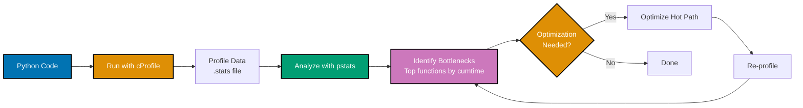
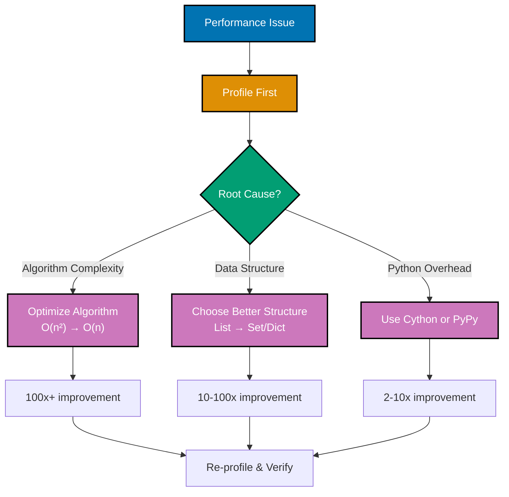
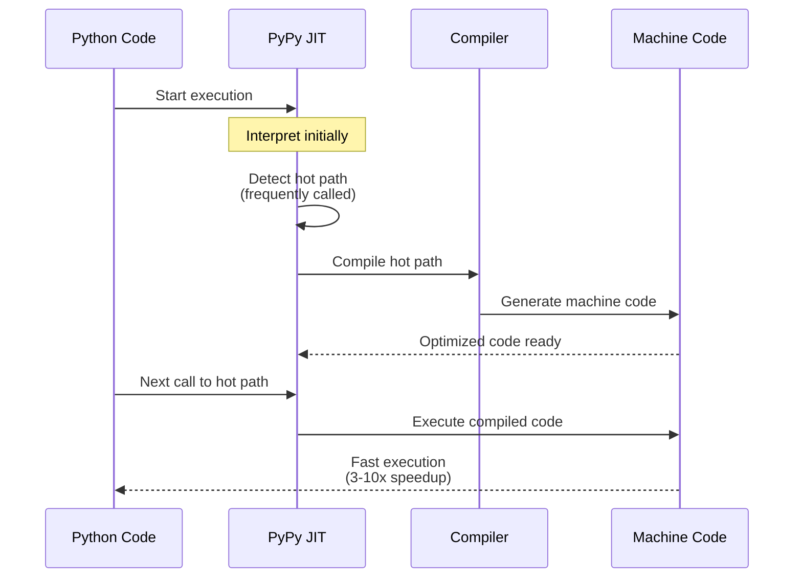
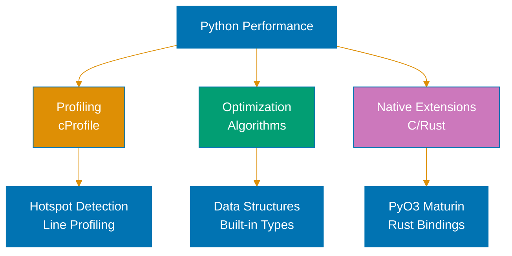

# Python Performance

**Quick Reference**: [Overview](#overview) | [Profiling](#profiling-with-cprofile) | [Benchmarking](#benchmarking) | [Algorithm Optimization](#algorithm-optimization) | [Data Structures](#data-structure-selection) | [Cython](#cython-c-extensions) | [PyPy](#pypy-jit-compiler) | [Financial Performance](#financial-calculation-performance) | [References](#references)

## Overview

Performance optimization improves application speed and resource usage. For OSE Platform processing thousands of Zakat calculations, optimizing hot paths significantly reduces processing time.

### Performance Principles

**Measure First**: Profile before optimizing.

**Optimize Algorithms**: Better algorithms beat micro-optimizations.

**Choose Right Data Structures**: Lists vs sets vs dicts matter.

**Minimize Allocations**: Reuse objects when possible.

**Parallel Execution**: Use async/multiprocessing for scalability.

## Profiling with cProfile

Profile to identify bottlenecks.

### Basic Profiling

```python
# profile_zakat.py
import cProfile
import pstats
from decimal import Decimal
from typing import List


def calculate_all_zakat(wealth_items: List[Decimal]) -> Decimal:
    """Calculate total Zakat for all items."""
    total = Decimal("0")
    for wealth in wealth_items:
        if wealth >= Decimal("85000"):
            total += wealth * Decimal("0.025")
    return total


# Profile execution
wealth_data = [Decimal("100000")] * 10000

profiler = cProfile.Profile()
profiler.enable()

result = calculate_all_zakat(wealth_data)

profiler.disable()

# Print stats
stats = pstats.Stats(profiler)
stats.sort_stats('cumtime')
stats.print_stats(10)  # Top 10 functions
```

### Running cProfile

```bash
# Profile script
python -m cProfile -s cumtime profile_zakat.py

# Save profile data
python -m cProfile -o profile.stats profile_zakat.py

# Analyze saved profile
python -m pstats profile.stats
```

**Why this matters**: cProfile identifies actual bottlenecks. Cumulative time shows where program spends time. Avoid premature optimization.

### Profiling Workflow with cProfile



**Profiling workflow**:

1. **Profile**: Run code with cProfile
2. **Analyze**: Sort by cumulative time #40;cumtime#41;
3. **Optimize**: Focus on top 10 functions
4. **Verify**: Re-profile to confirm improvement

## Benchmarking

Measure performance with timeit.

### Using timeit

```python
import timeit
from decimal import Decimal


def calculate_zakat_loop(wealth: Decimal) -> Decimal:
    """Calculate using loop."""
    result = Decimal("0")
    for _ in range(1000):
        result = wealth * Decimal("0.025")
    return result


def calculate_zakat_direct(wealth: Decimal) -> Decimal:
    """Calculate directly."""
    return wealth * Decimal("0.025")


# Benchmark both approaches
wealth = Decimal("100000")

loop_time = timeit.timeit(
    lambda: calculate_zakat_loop(wealth),
    number=1000
)

direct_time = timeit.timeit(
    lambda: calculate_zakat_direct(wealth),
    number=1000
)

print(f"Loop: {loop_time:.4f}s")
print(f"Direct: {direct_time:.4f}s")
print(f"Speedup: {loop_time / direct_time:.2f}x")
```

**Why this matters**: timeit provides accurate measurements. Multiple iterations reduce noise. Compare implementation alternatives objectively.

## Algorithm Optimization

Better algorithms beat micro-optimizations.

### Example: Optimize Filtering

```python
from decimal import Decimal
from typing import List


# SLOW: O(n²) - checking each item against all others
def find_duplicates_slow(wealth_items: List[Decimal]) -> List[Decimal]:
    """O(n²) duplicate detection."""
    duplicates = []
    for i, item in enumerate(wealth_items):
        for j, other in enumerate(wealth_items):
            if i != j and item == other and item not in duplicates:
                duplicates.append(item)
    return duplicates


# FAST: O(n) - using set for constant-time lookup
def find_duplicates_fast(wealth_items: List[Decimal]) -> List[Decimal]:
    """O(n) duplicate detection."""
    seen = set()
    duplicates = set()
    for item in wealth_items:
        if item in seen:
            duplicates.add(item)
        seen.add(item)
    return list(duplicates)


# Benchmark: Fast version 100x+ faster for large lists
```

**Why this matters**: Algorithm complexity dominates. O(n) vs O(n²) creates massive differences. Choose efficient algorithms first.

### Performance Optimization Strategy



**Optimization priority**:

1. **Algorithm**: Biggest impact #40;O#40;n²#41; → O#40;n#41; = 100x+#41;
2. **Data structure**: Significant impact #40;list → set = 10-100x#41;
3. **Implementation**: Moderate impact #40;Cython/PyPy = 2-10x#41;

## Data Structure Selection

Choose optimal data structures.

### Lists vs Sets vs Dicts

```python
from decimal import Decimal
from typing import List, Set, Dict
import timeit


# Membership testing
wealth_list: List[Decimal] = [Decimal(str(i)) for i in range(10000)]
wealth_set: Set[Decimal] = set(wealth_list)

# List lookup: O(n)
list_time = timeit.timeit(
    lambda: Decimal("5000") in wealth_list,
    number=1000
)

# Set lookup: O(1)
set_time = timeit.timeit(
    lambda: Decimal("5000") in wealth_set,
    number=1000
)

print(f"List lookup: {list_time:.4f}s")
print(f"Set lookup: {set_time:.4f}s")
print(f"Speedup: {list_time / set_time:.0f}x")


# Key-value storage
payer_zakat: Dict[str, Decimal] = {
    f"PAYER-{i}": Decimal(str(i * 2500))
    for i in range(10000)
}

# Dict lookup: O(1)
dict_time = timeit.timeit(
    lambda: payer_zakat.get("PAYER-5000"),
    number=1000
)
```

**Why this matters**: Data structure choice impacts performance dramatically. Sets for membership testing. Dicts for key-value lookup. Lists for ordered iteration.

## Cython (C Extensions)

Cython compiles Python to C for speed.

### Cython Example

```cython
# zakat_calculator.pyx (Cython file)
from decimal import Decimal as PyDecimal


cpdef calculate_zakat_cython(object wealth, object nisab):
    """Cython-optimized Zakat calculation."""
    cdef object zakat_rate = PyDecimal("0.025")

    if wealth >= nisab:
        return wealth * zakat_rate
    return PyDecimal("0")


# Compile with setup.py
# from setuptools import setup
# from Cython.Build import cythonize
# setup(ext_modules=cythonize("zakat_calculator.pyx"))

# Build: python setup.py build_ext --inplace
```

**Why this matters**: Cython 2-50x faster for numeric code. Compatible with Python code. Gradual optimization (add types incrementally).

## PyPy (JIT Compiler)

PyPy provides Just-In-Time compilation.

### Using PyPy

```bash
# Install PyPy
# Download from https://www.pypy.org/

# Run with PyPy instead of CPython
pypy3 zakat_calculator.py

# PyPy is faster for long-running processes
# (JIT warmup takes time)
```

**Why this matters**: PyPy 3-10x faster for pure Python code. No code changes required. Best for long-running processes (JIT warmup).

### Just-In-Time Compilation with PyPy



**Why this matters**: PyPy identifies frequently-called code #40;hot paths#41; and compiles to machine code. Warmup period before speedup. Best for long-running processes with repeated computations.

## Financial Calculation Performance

### Optimize Batch Processing

```python
# SLOW: Individual calculations
from decimal import Decimal
from typing import List


def calculate_zakat_individual(wealth_items: List[Decimal]) -> List[Decimal]:
    """Process items individually (slow)."""
    results = []
    for wealth in wealth_items:
        if wealth >= Decimal("85000"):
            zakat = wealth * Decimal("0.025")
            results.append(zakat)
        else:
            results.append(Decimal("0"))
    return results


# FAST: Vectorized calculation
def calculate_zakat_batch(wealth_items: List[Decimal]) -> List[Decimal]:
    """Process items in batch (fast)."""
    nisab = Decimal("85000")
    rate = Decimal("0.025")

    return [
        wealth * rate if wealth >= nisab else Decimal("0")
        for wealth in wealth_items
    ]


# Even faster with generator (lazy evaluation)
def calculate_zakat_generator(wealth_items: List[Decimal]):
    """Generator for memory efficiency."""
    nisab = Decimal("85000")
    rate = Decimal("0.025")

    for wealth in wealth_items:
        yield wealth * rate if wealth >= nisab else Decimal("0")
```

**Why this matters**: Batch processing amortizes overhead. Generators reduce memory usage. List comprehensions faster than loops.

## References

### Official Documentation

- [Python Performance Tips](https://wiki.python.org/moin/PythonSpeed/PerformanceTips)
- [cProfile Documentation](https://docs.python.org/3/library/profile.html)
- [timeit Documentation](https://docs.python.org/3/library/timeit.html)
- [Cython Documentation](https://cython.org/)
- [PyPy Documentation](https://www.pypy.org/)

### Related Documentation

- [Concurrency and Parallelism](./ex-so-stla-py__concurrency-and-parallelism.md) - Parallel execution
- [Memory Management](./ex-so-stla-py__memory-management.md) - Memory optimization

---

**Last Updated**: 2025-01-23
**Python Version**: 3.11+ (baseline), 3.12+ (stable maintenance), 3.14.x (latest stable)
**Maintainers**: OSE Platform Documentation Team

## Python Performance Optimization


