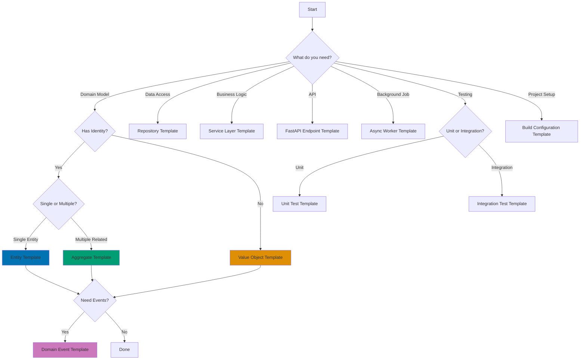

# Python Code Templates

**Quick Reference**: [Overview](#overview) | [Template Structure](#template-structure) | [Domain Templates](#domain-driven-design-templates) | [Test Templates](#testing-templates) | [API Templates](#api-templates) | [Worker Templates](#async-worker-templates) | [Build Templates](#build-configuration-templates) | [Usage Guide](#usage-guide) | [References](#references)

## Overview

This directory contains copy-paste ready Python code templates for common patterns in financial applications. Each template includes complete type hints, validation, examples, and usage documentation optimized for Sharia-compliant financial services.

### Available Templates

**Domain-Driven Design**:

- [Entity Template](./entity-template.md) - Entity with identity and lifecycle
- [Value Object Template](./value-object-template.md) - Immutable value objects
- [Aggregate Template](./aggregate-template.md) - Aggregate root with invariants
- [Domain Event Template](./domain-event-template.md) - Domain event pattern
- [Repository Template](./repository-template.md) - Repository pattern for persistence
- [Service Layer Template](./service-layer-template.md) - Application service layer

**Testing**:

- [Unit Test Template](./unit-test-template.md) - pytest unit test patterns
- [Integration Test Template](./integration-test-template.md) - Integration test patterns

**API Development**:

- [FastAPI Endpoint Template](./fastapi-endpoint-template.md) - FastAPI endpoint patterns

**Async Processing**:

- [Async Worker Template](./async-worker-template.md) - Background task processing

**Build Configuration**:

- [Build Configuration Template](./build-configuration-template.md) - pyproject.toml, CI/CD, Docker

## Template Structure

Each template follows consistent structure:

```markdown
# Template Name

## Overview

Brief description of pattern and when to use it.

## Complete Code Template

Full copy-paste ready code with type hints.

## Usage Example

Real-world example showing how to use the template.

## Customization Guide

Step-by-step guide for adapting template to specific needs.

## Best Practices

Dos and don'ts for this pattern.

## Related Patterns

Links to complementary templates and documentation.
```

## Domain-Driven Design Templates

### Entity Template

Entities have unique identity and lifecycle. Use for objects that must be tracked individually.

**When to use**:

- Object has unique identifier
- Object changes over time (mutable)
- Object lifecycle matters (created, updated, deleted)

**Example**: `ZakatRecord`, `DonationCampaign`, `QardHasanLoan`

**See**: [entity-template.md](./entity-template.md)

### Value Object Template

Value objects are immutable and equality based on values. Use for descriptive objects without identity.

**When to use**:

- Object described by its values (no identity)
- Object immutable (never changes)
- Two objects with same values are interchangeable

**Example**: `Money`, `Address`, `DateRange`

**See**: [value-object-template.md](./value-object-template.md)

### Aggregate Template

Aggregates are clusters of entities/value objects treated as a unit. Root entity enforces invariants.

**When to use**:

- Multiple objects must maintain consistency
- Transaction boundaries needed
- Business rules span multiple entities

**Example**: `DonationCampaign` (with Donations), `QardHasanLoan` (with Payments)

**See**: [aggregate-template.md](./aggregate-template.md)

### Domain Event Template

Domain events capture significant business occurrences. Use for event-driven architectures.

**When to use**:

- Important state change occurred
- Other parts of system need notification
- Event sourcing or audit trail required

**Example**: `ZakatCalculated`, `DonationReceived`, `LoanDisbursed`

**See**: [domain-event-template.md](./domain-event-template.md)

### Repository Template

Repositories abstract persistence layer. Use for data access without exposing database details.

**When to use**:

- Need collection-like interface for entities
- Want to hide persistence implementation
- Testing requires mocking data access

**Example**: `ZakatRecordRepository`, `CampaignRepository`

**See**: [repository-template.md](./repository-template.md)

### Service Layer Template

Service layer coordinates application logic. Use for orchestrating domain operations.

**When to use**:

- Operation involves multiple aggregates
- Need transaction management
- Business process spans multiple domains

**Example**: `ZakatCalculationService`, `DonationProcessingService`

**See**: [service-layer-template.md](./service-layer-template.md)

## Testing Templates

### Unit Test Template

Unit tests verify individual components in isolation.

**When to use**:

- Testing pure functions
- Testing domain logic
- Testing class methods

**Example**: Test Zakat calculation logic, test Money value object

**See**: [unit-test-template.md](./unit-test-template.md)

### Integration Test Template

Integration tests verify components working together.

**When to use**:

- Testing database interactions
- Testing API endpoints
- Testing external service integration

**Example**: Test Zakat record persistence, test donation API

**See**: [integration-test-template.md](./integration-test-template.md)

## API Templates

### FastAPI Endpoint Template

FastAPI endpoints with validation, error handling, and documentation.

**When to use**:

- Building REST API
- Need automatic validation
- Want OpenAPI documentation

**Example**: Zakat calculation API, donation processing API

**See**: [fastapi-endpoint-template.md](./fastapi-endpoint-template.md)

## Async Worker Templates

### Async Worker Template

Background task processing with async/await.

**When to use**:

- Long-running operations
- Email/notification sending
- Batch processing

**Example**: Send Zakat receipts, process donation batches

**See**: [async-worker-template.md](./async-worker-template.md)

## Build Configuration Templates

### Build Configuration Template

Complete project setup with pyproject.toml, Docker, CI/CD.

**When to use**:

- Starting new Python project
- Standardizing build process
- Setting up CI/CD pipeline

**Example**: OSE Platform Python services configuration

**See**: [build-configuration-template.md](./build-configuration-template.md)

## Usage Guide

### Step 1: Choose Template

Select template matching your use case:

- **Need entity with ID?** → Entity Template
- **Need immutable value?** → Value Object Template
- **Need coordinated entities?** → Aggregate Template
- **Need event notification?** → Domain Event Template
- **Need data access?** → Repository Template
- **Need orchestration?** → Service Layer Template
- **Need API endpoint?** → FastAPI Endpoint Template
- **Need background job?** → Async Worker Template
- **Setting up project?** → Build Configuration Template

### Step 2: Copy Template Code

Navigate to chosen template file and copy the complete code template section.

### Step 3: Customize

Follow template's customization guide to adapt code:

1. Replace placeholder names with domain-specific names
2. Add domain-specific fields and methods
3. Adjust validation rules for your use case
4. Add domain-specific business logic

### Step 4: Add Tests

Use test templates to create corresponding tests:

- Unit tests for domain logic
- Integration tests for persistence and APIs

### Step 5: Integrate

Integrate template code into your project:

1. Add type hints
2. Add documentation
3. Follow project conventions
4. Run linters and formatters

## Template Customization Examples

### Customizing Entity Template for Zakat Record

```python
# START: Entity Template (copied from entity-template.md)

# END: Entity Template

# CUSTOMIZATION STEPS:
# 1. Replace "SampleEntity" with "ZakatRecord"
# 2. Add domain-specific fields: payer_id, wealth_amount, zakat_amount
# 3. Add validation: wealth >= 0, zakat >= 0
# 4. Add business logic: calculate_zakat method

# RESULT: Custom ZakatRecord entity
from decimal import Decimal
from dataclasses import dataclass
from datetime import datetime


@dataclass
class ZakatRecord:
    """Zakat calculation record entity."""

    id: str
    payer_id: str
    wealth_amount: Decimal
    nisab_threshold: Decimal
    zakat_amount: Decimal
    calculation_date: datetime
    payment_status: str = "pending"

    def __post_init__(self) -> None:
        """Validate invariants."""
        if self.wealth_amount < 0:
            raise ValueError("Wealth amount cannot be negative")
        if self.zakat_amount < 0:
            raise ValueError("Zakat amount cannot be negative")
        if self.nisab_threshold <= 0:
            raise ValueError("Nisab threshold must be positive")

    @property
    def is_obligated(self) -> bool:
        """Check if Zakat is obligated."""
        return self.wealth_amount >= self.nisab_threshold

    def mark_paid(self) -> None:
        """Mark Zakat payment as completed."""
        if self.payment_status == "completed":
            raise ValueError("Payment already completed")
        self.payment_status = "completed"
```

### Customizing Value Object Template for Money

```python
# START: Value Object Template (copied from value-object-template.md)

# END: Value Object Template

# CUSTOMIZATION STEPS:
# 1. Replace "SampleValueObject" with "Money"
# 2. Add fields: amount (Decimal), currency (str)
# 3. Make immutable with frozen=True
# 4. Add validation: amount precision, valid currency
# 5. Add operations: add, subtract, multiply

# RESULT: Custom Money value object
from decimal import Decimal
from dataclasses import dataclass


@dataclass(frozen=True)
class Money:
    """Immutable money value object."""

    amount: Decimal
    currency: str = "USD"

    def __post_init__(self) -> None:
        """Validate money invariants."""
        # Validate precision (max 2 decimal places)
        if self.amount.as_tuple().exponent < -2:
            raise ValueError("Amount must have max 2 decimal places")

        # Validate currency code
        valid_currencies = ["USD", "SAR", "EUR", "GBP"]
        if self.currency not in valid_currencies:
            raise ValueError(f"Invalid currency: {self.currency}")

    def __add__(self, other: "Money") -> "Money":
        """Add two Money values (same currency)."""
        if self.currency != other.currency:
            raise ValueError("Cannot add different currencies")
        return Money(self.amount + other.amount, self.currency)

    def __mul__(self, multiplier: Decimal) -> "Money":
        """Multiply Money by scalar."""
        return Money(self.amount * multiplier, self.currency)
```

## Best Practices

### Do: Follow Type Hints

```python
# GOOD: Complete type hints
from decimal import Decimal


def calculate_zakat(wealth: Decimal, nisab: Decimal) -> Decimal:
    """Calculate Zakat with complete type hints."""
    if wealth >= nisab:
        return wealth * Decimal("0.025")
    return Decimal("0")
```

### Do: Validate Early

```python
# GOOD: Validate in __post_init__
from decimal import Decimal
from dataclasses import dataclass


@dataclass
class Money:
    """Money with early validation."""

    amount: Decimal
    currency: str = "USD"

    def __post_init__(self) -> None:
        """Validate immediately after initialization."""
        if self.amount < 0:
            raise ValueError("Amount cannot be negative")
```

### Don't: Mix Concerns

```python
# BAD: Entity handling persistence
class ZakatRecord:
    def save_to_database(self):
        """BAD: Entity shouldn't know about database."""
        pass


# GOOD: Use repository for persistence
class ZakatRecordRepository:
    def save(self, record: ZakatRecord) -> None:
        """Repository handles persistence."""
        pass
```

### Do: Use Decimal for Money

```python
# GOOD: Decimal for financial calculations
from decimal import Decimal

wealth = Decimal("100000.00")
zakat = wealth * Decimal("0.025")  # Precise calculation


# BAD: Float for financial calculations
wealth = 100000.00  # float
zakat = wealth * 0.025  # IMPRECISE - rounding errors!
```

## Template Selection Flowchart



## References

### Related Documentation

- [Domain-Driven Design](../ex-so-stla-py__domain-driven-design.md) - DDD concepts and patterns
- [Test-Driven Development](../ex-so-stla-py__test-driven-development.md) - TDD methodology
- [Web Services](../ex-so-stla-py__web-services.md) - FastAPI patterns
- [Type Safety](../ex-so-stla-py__type-safety.md) - Type hints and validation
- [Best Practices](../ex-so-stla-py__best-practices.md) - Python coding standards

### Books

- "Domain-Driven Design" by Eric Evans
- "Implementing Domain-Driven Design" by Vaughn Vernon
- "Architecture Patterns with Python" by Harry Percival and Bob Gregory

---

**Last Updated**: 2025-01-23
**Python Version**: 3.11+ (baseline), 3.12+ (stable maintenance), 3.13.x (latest stable)
**Maintainers**: OSE Platform Documentation Team
