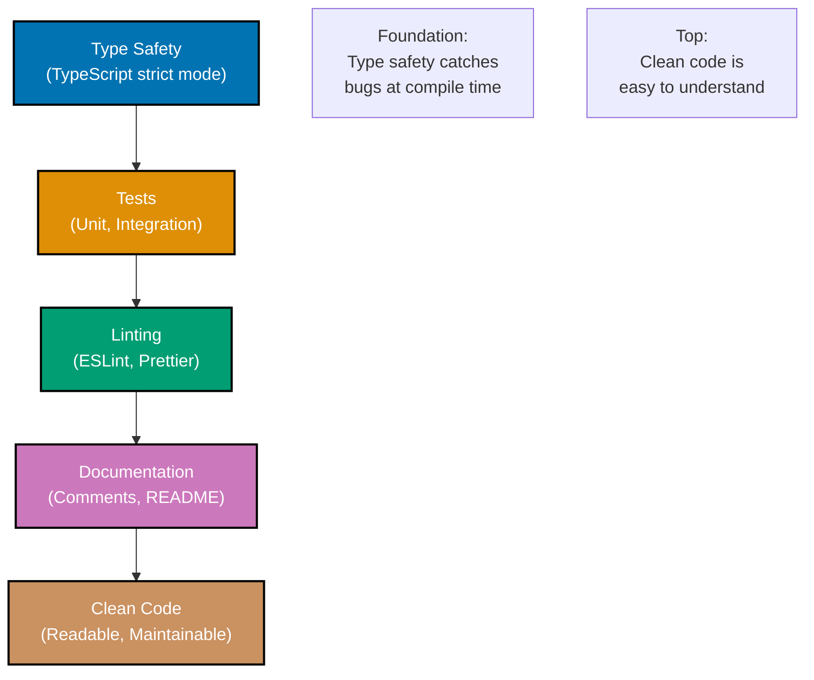
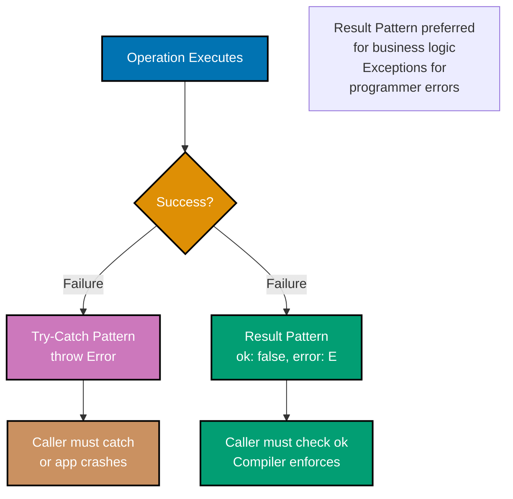
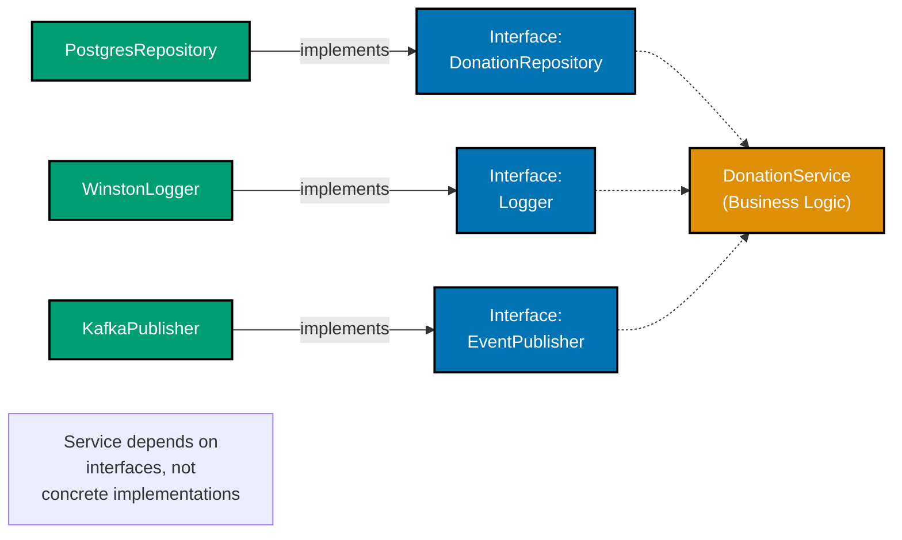

# TypeScript Best Practices

**Quick Reference**: [Overview](#overview) | [Alignment with Principles](#alignment-with-software-engineering-principles) | [Core Principles](#core-principles) | [Automation Over Manual](#automation-over-manual) | [Reproducibility First](#reproducibility-first) | [Prerequisites](#prerequisites) | [Setup](#setup) | [Code Organization](#code-organization) | [Business Finance Code Examples](#business-finance-code-examples) | [Best Practices Checklist](#best-practices-checklist) | [Related Documentation](#related-documentation)

## Overview

This document provides comprehensive best practices for TypeScript development in the enterprise platform. Following these standards ensures our codebase remains maintainable, secure, performant, and aligned with modern TypeScript development principles (TypeScript 5.0+).

## Alignment with Software Engineering Principles

TypeScript development follows the five software engineering principles from `governance/principles/software-engineering/`:

### 1. Automation Over Manual

**Principle**: Automate repetitive tasks with tools, scripts, and CI/CD to reduce human error and increase consistency.

**How TypeScript Implements**:

- ESLint + TypeScript-ESLint for automated code quality checks
- Prettier for consistent code formatting
- tsc (TypeScript compiler) for type checking
- Vitest/Jest for automated testing
- Husky pre-commit hooks for validation
- GitHub Actions CI/CD pipelines

**PASS Example** (Automated Zakat Calculation Validation):

```typescript
// vitest.config.ts - Automated test configuration
import { defineConfig } from "vitest/config";

export default defineConfig({
  test: {
    globals: true,
    environment: "node",
    coverage: {
      provider: "v8",
      reporter: ["text", "json", "html"],
      thresholds: {
        lines: 80,
        functions: 80,
        branches: 80,
        statements: 80,
      },
    },
  },
});

// zakat-calculator.test.ts - Automated Zakat validation
describe("ZakatCalculator", () => {
  it("should calculate 2.5 percent of wealth when above nisab", () => {
    const wealth = createMoney(100000, "USD");
    const nisab = createMoney(5000, "USD");
    const expectedZakat = createMoney(2500, "USD");

    const actualZakat = zakatCalculator.calculate(wealth, nisab);

    expect(actualZakat).toEqual(expectedZakat);
  });

  it("should return zero when wealth is below nisab", () => {
    const wealthBelowNisab = createMoney(1000, "USD");
    const nisab = createMoney(5000, "USD");

    const zakat = zakatCalculator.calculate(wealthBelowNisab, nisab);

    expect(zakat).toEqual(createMoney(0, "USD"));
  });
});

// .husky/pre-commit - Pre-commit automation
#!/bin/bash
npm run type-check
npm run lint
npm run test
```

**FAIL Example** (Manual Testing):

```typescript
// Manual testing - prone to human error, not reproducible
class ZakatCalculator {
  calculate(wealth: Money, nisab: Money): Money {
    // No automated tests
    return wealth.multiply(0.025);
  }
}

// Manual test process:
// 1. Developer manually runs calculations
// 2. Checks results visually
// 3. No regression detection
// 4. Human errors slip through
```

**Islamic Finance Application**: Automated Zakat calculation verification ensures consistent nisab threshold checking across all transactions, preventing manual miscalculations that could lead to underpayment (haram). Every code commit triggers automated tests verifying 2.5% calculation accuracy.

**See Also**: [TypeScript Linting and Formatting](./ex-so-stla-ts__linting-and-formatting.md)

### 2. Explicit Over Implicit

**Principle**: Make behavior, configuration, and dependencies explicit rather than relying on hidden defaults or magic.

**How TypeScript Implements**:

- Explicit type annotations (no `any`)
- Explicit dependency injection
- Strict TypeScript compiler options
- No magic numbers or hidden configuration
- Clear function signatures with return types

**PASS Example** (Explicit Murabaha Terms):

```typescript
// Explicit type definitions
interface MurabahaContract {
  readonly contractId: string;
  readonly customerId: string;
  readonly costPrice: Money;
  readonly profitMargin: Money;
  readonly totalPrice: Money;
  readonly installmentCount: number;
}

// Explicit configuration - no hidden defaults
interface MurabahaConfig {
  readonly minCostPrice: Money;
  readonly maxProfitMarginRate: number;
  readonly minInstallmentCount: number;
  readonly maxInstallmentCount: number;
}

// Explicit function signature with all parameters
function createMurabahaContract(
  customerId: string,
  costPrice: Money,
  profitMargin: Money,
  installmentCount: number,
  config: MurabahaConfig,
): MurabahaContract {
  // All parameters explicitly passed, no hidden defaults
  if (costPrice.isLessThan(config.minCostPrice)) {
    throw new Error(`Cost price must be at least ${config.minCostPrice}`);
  }

  const totalPrice = costPrice.add(profitMargin);

  return {
    contractId: crypto.randomUUID(),
    customerId,
    costPrice,
    profitMargin,
    totalPrice,
    installmentCount,
  };
}
```

**FAIL Example** (Implicit Defaults):

```typescript
// Hidden defaults - not transparent
function createMurabahaContract(
  customerId: string,
  costPrice: Money,
  profitMargin?: Money, // Optional with hidden default
): MurabahaContract {
  // Hidden markup calculation - not transparent
  const margin = profitMargin ?? costPrice.multiply(0.15); // 15% default - WHERE IS THIS DOCUMENTED?

  return {
    contractId: crypto.randomUUID(),
    customerId,
    costPrice,
    profitMargin: margin,
    totalPrice: costPrice.add(margin),
    installmentCount: 12, // Magic number - no explanation
  };
}
```

**Islamic Finance Application**: Explicit Murabaha terms ensure no hidden fees (riba), maintaining transparency required by Shariah law. All profit margins must be disclosed upfront with explicit parameters. When a scholar audits the code, they can verify no implicit interest calculations exist.

**See Also**: [TypeScript Best Practices](./ex-so-stla-ts__best-practices.md)

### 3. Immutability Over Mutability

**Principle**: Prefer immutable data structures to prevent unintended state changes and enable safer concurrent code.

**How TypeScript Implements**:

- `readonly` properties on interfaces/types
- `as const` assertions for literal types
- Immutable value objects
- Functional transformations (map/filter/reduce)
- No mutation of function parameters

**PASS Example** (Immutable Transaction Record):

```typescript
// Immutable transaction record - cannot be modified after creation
interface ZakatTransaction {
  readonly transactionId: string;
  readonly payerId: string;
  readonly wealth: Money;
  readonly zakatAmount: Money;
  readonly paidAt: Date;
  readonly auditHash: string; // SHA-256 of transaction data
}

// Factory function creates new instances
function createZakatTransaction(payerId: string, wealth: Money, zakatAmount: Money): ZakatTransaction {
  const transaction = {
    transactionId: crypto.randomUUID(),
    payerId,
    wealth,
    zakatAmount,
    paidAt: new Date(),
    auditHash: "", // Placeholder
  };

  // Calculate audit hash from immutable data
  const auditHash = calculateHash(transaction);

  // Return frozen object - completely immutable
  return Object.freeze({
    ...transaction,
    auditHash,
  });
}

// Correction creates NEW transaction, doesn't modify old one
function correctZakatTransaction(original: ZakatTransaction, correctedAmount: Money): ZakatTransaction {
  // Original remains unchanged - audit trail preserved
  return createZakatTransaction(original.payerId, original.wealth, correctedAmount);
}
```

**FAIL Example** (Mutable State):

```typescript
// Mutable transaction - can be altered after creation
class ZakatTransaction {
  transactionId: string;
  payerId: string;
  wealth: Money;
  zakatAmount: Money;
  paidAt: Date;

  constructor(payerId: string, wealth: Money, zakatAmount: Money) {
    this.transactionId = crypto.randomUUID();
    this.payerId = payerId;
    this.wealth = wealth;
    this.zakatAmount = zakatAmount;
    this.paidAt = new Date();
  }

  // DANGER: Can modify amount after creation
  updateAmount(newAmount: Money): void {
    this.zakatAmount = newAmount; // Violates audit trail!
    this.paidAt = new Date(); // Falsifies payment timestamp!
  }
}
```

**Islamic Finance Application**: Immutable transaction records provide tamper-proof audit trails required for Shariah compliance verification. Once a Murabaha payment is recorded, it cannot be altered - ensuring transparency and accountability (Amanah). Scholars can verify that no transaction has been retroactively modified.

**See Also**: [TypeScript Functional Programming](./ex-so-stla-ts__functional-programming.md)

### 4. Pure Functions Over Side Effects

**Principle**: Prefer pure functions that are deterministic and side-effect-free for predictable, testable code.

**How TypeScript Implements**:

- Pure business logic functions
- Functional core, imperative shell pattern
- No external dependencies in calculations
- Side effects isolated at boundaries (I/O, database)
- Deterministic outputs for same inputs

**PASS Example** (Pure Zakat Calculation):

```typescript
// Pure function - same inputs always return same output
function calculateZakat(wealth: Money, nisab: Money): Money {
  // No external dependencies
  // No side effects (logging, database, network)
  // Deterministic - verifiable by anyone

  if (wealth.isLessThan(nisab)) {
    return createMoney(0, wealth.currency);
  }

  // 2.5% calculation - simple, pure, auditable
  return wealth.multiply(0.025);
}

// Pure helper functions
function isZakatEligible(wealth: Money, nisab: Money): boolean {
  return wealth.isGreaterThanOrEqualTo(nisab);
}

function calculateNisabFromGoldPrice(goldPricePerGram: Money): Money {
  const nisabGoldGrams = 85;
  return goldPricePerGram.multiply(nisabGoldGrams);
}

// Testing pure functions is trivial
describe("calculateZakat", () => {
  it("returns exact 2.5% for wealth above nisab", () => {
    const wealth = createMoney(100000, "SAR");
    const nisab = createMoney(5000, "SAR");

    const zakat = calculateZakat(wealth, nisab);

    expect(zakat).toEqual(createMoney(2500, "SAR"));
  });
});
```

**FAIL Example** (Impure with Side Effects):

```typescript
// Impure function - behavior unpredictable
class ZakatCalculator {
  private database: Database;
  private logger: Logger;
  private notificationService: NotificationService;

  calculate(wealth: Money, nisab: Money): Money {
    // Side effect: logging
    this.logger.info(`Calculating Zakat for wealth: ${wealth}`);

    // Side effect: database query during calculation
    const historicalRate = this.database.query("SELECT rate FROM zakat_rates WHERE is_current = true");

    // Side effect: external API call
    const goldPrice = this.fetchCurrentGoldPrice();

    // Calculation mixed with I/O - hard to test
    const zakat = wealth.multiply(historicalRate ?? 0.025);

    // Side effect: notification
    this.notificationService.send(`Zakat calculated: ${zakat}`);

    // Side effect: database write
    this.database.insert("zakat_calculations", { wealth, zakat });

    return zakat;
  }

  private fetchCurrentGoldPrice(): number {
    // Network call - non-deterministic
    return fetch("https://api.gold-price.com/current").then((r) => r.json());
  }
}
```

**Islamic Finance Application**: Pure Zakat calculation functions ensure deterministic, verifiable results. Calculate Zakat on 10,000 SAR wealth with 5,000 SAR nisab - always get 250 SAR (2.5%). Scholars and users can independently verify calculations match Shariah requirements. No hidden side effects that could manipulate results.

**See Also**: [Pure Functions Principle](../../../../../governance/principles/software-engineering/pure-functions.md)

### 5. Reproducibility First

**Principle**: Ensure builds, tests, and deployments are reproducible across environments and time.

**How TypeScript Implements**:

- `package.json` + `package-lock.json` for exact dependencies
- Volta for Node.js/npm version pinning
- Lockfile commitment to version control
- Docker containers for environment consistency
- Deterministic builds with exact versions

**PASS Example** (Reproducible Environment):

```json
// package.json - Volta pins exact Node.js and npm versions
{
  "name": "ose-zakat-service",
  "version": "1.0.0",
  "volta": {
    "node": "24.11.1",
    "npm": "11.6.3"
  },
  "dependencies": {
    "typescript": "5.7.3",
    "decimal.js": "10.4.3"
  },
  "devDependencies": {
    "@types/node": "24.11.1",
    "vitest": "4.0.18"
  }
}

// package-lock.json - Exact dependency versions (committed to git)
{
  "name": "ose-zakat-service",
  "lockfileVersion": 3,
  "requires": true,
  "packages": {
    "": {
      "dependencies": {
        "decimal.js": "10.4.3",
        "typescript": "5.7.3"
      }
    },
    "node_modules/decimal.js": {
      "version": "10.4.3",
      "resolved": "https://registry.npmjs.org/decimal.js/-/decimal.js-10.4.3.tgz",
      "integrity": "sha512-VBBaLc1MgL5XpzgIP7ny5Z6Nx3UrRkIViUkPUdtl9aya5amy3De1gsUUSB1g3+3sExYNjCAsAznmukyxCb1GRA=="
    }
  }
}

// Dockerfile - Reproducible build environment
FROM node:24.11.1-alpine

WORKDIR /app

# Install exact versions from lockfile
COPY package.json package-lock.json ./
RUN npm ci

COPY . .
RUN npm run build

CMD ["npm", "start"]
```

**FAIL Example** (Non-Reproducible):

```json
// package.json - Loose version ranges
{
  "name": "ose-zakat-service",
  "dependencies": {
    "typescript": "^5.0.0", // Could install 5.0.2 or 5.7.3 - different builds!
    "decimal.js": "~10.4.0" // Could install 10.4.0 or 10.4.9 - different results!
  }
}

// No package-lock.json committed
// No Volta configuration
// No Docker container

// Result: Different developers get different dependency versions
// CI/CD produces different builds at different times
// Behavior changes unpredictably
```

**Islamic Finance Application**: Reproducible Murabaha markup calculations ensure that profit-sharing ratios remain consistent across all deployment environments. When Islamic scholars audit the system in 2026, they must see the same calculations that ran in 2024 - reproducibility ensures Shariah compliance across time. Every build produces identical binaries with identical behavior.

**See Also**: [Reproducibility Principle](../../../../../governance/principles/software-engineering/reproducibility.md)

---

Best practices are proven approaches that improve code quality, reduce bugs, and enhance team productivity. For the OSE platform, which handles sensitive financial operations like Zakat calculations, Murabaha contracts, and Donation management, adherence to these practices is crucial for building trustworthy, reliable systems.

**Companion Document**: Before reading this document, familiarize yourself with common [TypeScript Anti-Patterns](./ex-so-stla-ts__anti-patterns.md) to understand what practices to avoid.

## Core Principles

### Code Quality Pyramid



### 1. Code Clarity Over Cleverness

Write code that is easily understood and maintained. Clever, overly compact code may save a few lines but costs hours in comprehension and debugging.

**Why it matters**: In financial systems, correctness is paramount. Clear code enables thorough review and reduces the risk of calculation errors in Zakat or profit-sharing computations.

```typescript
// Good: Clear and explicit
function isZakatEligible(wealth: Money, nisab: Money): boolean {
  return wealth.isGreaterThanOrEqualTo(nisab);
}

// Bad: Clever but harder to understand
const isZakatEligible = (w: Money, n: Money): boolean => w.amount >= n.amount;
```

### 2. Single Responsibility Principle

Each function and class should have one clear purpose. This makes code easier to test, modify, and reuse.

**Why it matters**: Separating concerns like Zakat calculation from persistence logic allows independent testing and modification of business rules without affecting data access.

```typescript
// Good: Focused responsibility
class ZakatCalculator {
  calculate(wealth: Money): Money {
    return wealth.multiply(0.025);
  }
}

class ZakatRepository {
  async save(record: ZakatRecord): Promise<void> {
    // Persistence logic
  }
}

// Bad: Mixed responsibilities
class ZakatService {
  async calculateAndSave(wealth: Money): Promise<Money> {
    const zakat = wealth.multiply(0.025);
    // Database code mixed with calculation
    await this.saveToDatabase(zakat);
    return zakat;
  }
}
```

### 3. Fail Fast and Explicitly

Validate inputs early and throw meaningful errors. Don't let invalid data propagate through the system.

**Why it matters**: In finance, invalid inputs (negative amounts, missing party information) must be caught immediately to prevent incorrect Murabaha contract terms or calculations.

```typescript
// Good: Early validation with clear messages
function createMurabahaContract(costPrice: Money, profitMargin: Money, customerId: string): MurabahaContract {
  if (!costPrice || costPrice.isNegative()) {
    throw new Error("Cost price must be a positive amount");
  }
  if (!profitMargin || profitMargin.isNegative()) {
    throw new Error("Profit margin must be a positive amount");
  }
  if (!customerId || customerId.trim() === "") {
    throw new Error("Customer ID is required");
  }

  return new MurabahaContract(costPrice, profitMargin, customerId);
}

// Bad: No validation, silent failures
function createMurabahaContract(costPrice: Money, profitMargin: Money, customerId: string): MurabahaContract {
  return new MurabahaContract(costPrice, profitMargin, customerId);
}
```

### 4. Embrace Immutability

Prefer immutable objects, especially for value objects and domain entities. Use `readonly` properties and return new instances rather than modifying existing ones.

**Why it matters**: Immutable money amounts and Murabaha contract terms prevent accidental modification, ensuring financial data integrity throughout the application lifecycle.

```typescript
// Good: Immutable money value object
interface Money {
  readonly amount: number;
  readonly currency: string;
}

function createMoney(amount: number, currency: string): Money {
  return Object.freeze({ amount, currency });
}

function addMoney(money1: Money, money2: Money): Money {
  if (money1.currency !== money2.currency) {
    throw new Error("Cannot add money with different currencies");
  }
  return createMoney(money1.amount + money2.amount, money1.currency);
}

// Bad: Mutable money object
class Money {
  constructor(
    public amount: number,
    public currency: string,
  ) {}

  setAmount(amount: number): void {
    this.amount = amount; // Dangerous mutation
  }
}
```

### 5. Test-Driven Quality

Write comprehensive tests that document expected behavior. Tests are living documentation and safety nets for refactoring.

**Why it matters**: Zakat calculation rules, Qard Hasan profit computations, and Donation distribution logic must be verifiable through tests that serve as specification documentation.

```typescript
// Good: Descriptive test names and comprehensive coverage
describe("ZakatCalculator", () => {
  it("should calculate Zakat at 2.5 percent", () => {
    const wealth = createMoney(100000, "USD");
    const expectedZakat = createMoney(2500, "USD");

    const actualZakat = zakatCalculator.calculate(wealth);

    expect(actualZakat).toEqual(expectedZakat);
  });

  it("should throw error when wealth is null", () => {
    expect(() => zakatCalculator.calculate(null as any)).toThrow("Wealth cannot be null");
  });

  it("should return zero when wealth is below nisab", () => {
    const wealthBelowNisab = createMoney(1000, "USD");
    const nisab = createMoney(5000, "USD");

    const zakat = zakatCalculator.calculate(wealthBelowNisab, nisab);

    expect(zakat).toEqual(createMoney(0, "USD"));
  });
});
```

### 6. Composition Over Inheritance

Favor composition and delegation over class inheritance. This provides greater flexibility and reduces coupling.

**Why it matters**: Financial products like Qard Hasan, Ijara, and Musharaka share behaviors but have distinct rules. Composition allows mixing behaviors without rigid hierarchies.

### Error Handling Strategies



```typescript
// Good: Composition with strategy pattern
interface ProfitCalculationStrategy {
  calculate(principal: Money, term: Duration): Money;
}

class FinancingProduct {
  constructor(
    private readonly profitStrategy: ProfitCalculationStrategy,
    private readonly scheduleGenerator: PaymentScheduleGenerator,
  ) {}

  calculateProfit(principal: Money, term: Duration): Money {
    return this.profitStrategy.calculate(principal, term);
  }

  generateSchedule(principal: Money, term: Duration): PaymentSchedule {
    return this.scheduleGenerator.generate(principal, term);
  }
}

// Bad: Deep inheritance hierarchy
class FinancingProduct {
  calculateProfit(principal: Money, term: Duration): Money {
    throw new Error("Must be overridden");
  }
}

class MurabahaProduct extends FinancingProduct {
  override calculateProfit(principal: Money, term: Duration): Money {
    // Murabaha-specific logic
    return principal.multiply(0.15);
  }
}
```

### 7. Explicit Configuration Over Magic

Prefer explicit configuration and dependencies over implicit conventions or "magic" behavior.

**Why it matters**: Financial calculations must be transparent and auditable. Explicit configuration makes it clear what rules are being applied.

### Dependency Injection Pattern



```typescript
// Good: Explicit configuration
interface ZakatConfig {
  readonly rate: number;
  readonly nisabThreshold: Money;
  readonly lunarYearDays: number;
}

class ZakatCalculator {
  constructor(private readonly config: ZakatConfig) {}

  calculate(wealth: Money, heldDays: number): Money {
    if (heldDays < this.config.lunarYearDays) {
      return createMoney(0, wealth.currency);
    }
    if (wealth.isLessThan(this.config.nisabThreshold)) {
      return createMoney(0, wealth.currency);
    }
    return wealth.multiply(this.config.rate);
  }
}

// Bad: Magic numbers and implicit rules
class ZakatCalculator {
  calculate(wealth: Money, days: number): Money {
    if (days < 354) return createMoney(0, wealth.currency);
    if (wealth.amount < 5000) return createMoney(0, wealth.currency);
    return wealth.multiply(0.025); // Magic number
  }
}
```

## Automation Over Manual

TypeScript development should leverage automation to reduce manual, error-prone tasks. This aligns with the [Automation Over Manual](../../../../../governance/principles/software-engineering/automation-over-manual.md) principle.

### Build Automation

Automate TypeScript compilation, bundling, and deployment.

```json
{
  "scripts": {
    "build": "tsc && vite build",
    "dev": "vite",
    "test": "vitest",
    "lint": "eslint . --ext .ts,.tsx",
    "format": "prettier --write \"src/**/*.{ts,tsx}\"",
    "type-check": "tsc --noEmit"
  }
}
```

**Tools**:

- **tsc**: TypeScript compiler
- **Vite**: Fast build tool
- **esbuild**: Ultra-fast JavaScript bundler
- **swc**: Rust-based compiler (faster than tsc)

### Type Checking Automation

Automate type checking in development and CI/CD.

```json
{
  "compilerOptions": {
    "strict": true,
    "noImplicitAny": true,
    "strictNullChecks": true,
    "strictFunctionTypes": true,
    "strictBindCallApply": true,
    "strictPropertyInitialization": true,
    "noImplicitThis": true,
    "alwaysStrict": true,
    "noUnusedLocals": true,
    "noUnusedParameters": true,
    "noImplicitReturns": true,
    "noFallthroughCasesInSwitch": true
  }
}
```

**Pre-commit Hook**:

```bash
#!/bin/bash
# .husky/pre-commit
npm run type-check
npm run lint
npm run format
```

### Static Analysis Automation

Automate code quality checks with ESLint and TypeScript-ESLint.

```javascript
// eslint.config.js (ESLint 9+ flat config)
import tseslint from "@typescript-eslint/eslint-plugin";
import parser from "@typescript-eslint/parser";

export default [
  {
    files: ["**/*.ts", "**/*.tsx"],
    languageOptions: {
      parser: parser,
      parserOptions: {
        project: "./tsconfig.json",
      },
    },
    plugins: {
      "@typescript-eslint": tseslint,
    },
    rules: {
      "@typescript-eslint/no-explicit-any": "error",
      "@typescript-eslint/no-unused-vars": "error",
      "@typescript-eslint/explicit-function-return-type": "warn",
      "@typescript-eslint/no-floating-promises": "error",
    },
  },
];
```

### Testing Automation

Automate test execution with Jest or Vitest.

```typescript
// vitest.config.ts
import { defineConfig } from "vitest/config";

export default defineConfig({
  test: {
    globals: true,
    environment: "node",
    coverage: {
      provider: "v8",
      reporter: ["text", "json", "html"],
      thresholds: {
        lines: 80,
        functions: 80,
        branches: 80,
        statements: 80,
      },
    },
  },
});
```

**CI/CD Integration**:

```yaml
# .github/workflows/ci.yml
name: CI
on: [push, pull_request]
jobs:
  test:
    runs-on: ubuntu-latest
    steps:
      - uses: actions/checkout@v4
      - uses: actions/setup-node@v4
        with:
          node-version: "24"
      - run: npm ci
      - run: npm run type-check
      - run: npm run lint
      - run: npm run test
      - run: npm run build
```

## Reproducibility First

TypeScript development should ensure reproducible builds across environments. This aligns with the [Reproducibility First](../../../../../governance/principles/software-engineering/reproducibility.md) principle.

### Version Pinning

Pin Node.js and npm versions using Volta.

```json
{
  "volta": {
    "node": "24.11.1",
    "npm": "11.6.3"
  }
}
```

**Alternative**: Use `.nvmrc` for nvm users:

```
24.11.1
```

### Dependency Version Management

Lock dependencies with `package-lock.json` (npm), `pnpm-lock.yaml` (pnpm), or `bun.lockb` (bun).

```json
{
  "dependencies": {
    "typescript": "5.7.3",
    "express": "5.2.1"
  },
  "devDependencies": {
    "@types/node": "24.11.1",
    "vitest": "4.0.18"
  }
}
```

**Never commit without lockfile**:

```bash
# Good: Install exact versions
npm ci

# Bad: Install latest matching semver
npm install
```

### Documented Setup

Provide clear setup instructions and automated scripts.

```bash
#!/bin/bash
# setup.sh

set -e

echo "Installing dependencies..."
npm ci

echo "Type checking..."
npm run type-check

echo "Building..."
npm run build

echo "Running tests..."
npm test

echo "Setup complete!"
```

## Prerequisites

Before following these best practices, ensure you have:

- Node.js 24.11.1+ (LTS)
- npm 11.6.3+ or pnpm 10.28.1+ or bun 1.3.6+
- TypeScript 5.0+ (5.7.3 recommended)
- ESLint 9.39.2+ (10.0.0 in beta/rc)
- Prettier 3.8.1+
- VS Code with TypeScript extension (or WebStorm/Neovim with tsserver)

## Setup

### 1. Initialize TypeScript Project

```bash
npm init -y
npm install -D typescript @types/node
npx tsc --init
```

### 2. Configure Strict Mode

```json
{
  "compilerOptions": {
    "target": "ES2023",
    "module": "ESNext",
    "moduleResolution": "Bundler",
    "lib": ["ES2023"],
    "outDir": "./dist",
    "rootDir": "./src",
    "strict": true,
    "esModuleInterop": true,
    "skipLibCheck": true,
    "forceConsistentCasingInFileNames": true,
    "resolveJsonModule": true,
    "declaration": true,
    "declarationMap": true,
    "sourceMap": true
  },
  "include": ["src/**/*"],
  "exclude": ["node_modules", "dist"]
}
```

### 3. Install Development Tools

```bash
npm install -D \
  eslint \
  @typescript-eslint/eslint-plugin \
  @typescript-eslint/parser \
  prettier \
  vitest \
  @vitest/coverage-v8
```

### 4. Configure ESLint

```javascript
// eslint.config.js
import tseslint from "@typescript-eslint/eslint-plugin";
import parser from "@typescript-eslint/parser";

export default [
  {
    files: ["**/*.ts"],
    languageOptions: {
      parser: parser,
      parserOptions: {
        project: "./tsconfig.json",
      },
    },
    plugins: {
      "@typescript-eslint": tseslint,
    },
    rules: {
      "@typescript-eslint/no-explicit-any": "error",
      "@typescript-eslint/explicit-function-return-type": "warn",
    },
  },
];
```

### 5. Configure Prettier

```json
{
  "semi": true,
  "singleQuote": false,
  "trailingComma": "es5",
  "printWidth": 100,
  "tabWidth": 2
}
```

## Code Organization

### 1. Keep Functions Small and Focused (10-20 Lines)

Functions should do one thing well. Long functions are hard to understand, test, and maintain.

```typescript
// Good: Small, focused functions
function validateZakatEligibility(wealth: Money, nisab: Money): void {
  if (wealth.isLessThan(nisab)) {
    throw new Error("Wealth is below nisab threshold");
  }
}

function calculateZakat(wealth: Money): Money {
  return wealth.multiply(0.025);
}

function processZakat(wealth: Money, nisab: Money): Money {
  validateZakatEligibility(wealth, nisab);
  return calculateZakat(wealth);
}

// Bad: Long, unfocused function
function processZakat(wealth: Money, nisab: Money): Money {
  if (!wealth) {
    throw new Error("Wealth is required");
  }
  if (!nisab) {
    throw new Error("Nisab is required");
  }
  if (wealth.currency !== nisab.currency) {
    throw new Error("Currency mismatch");
  }
  if (wealth.amount < nisab.amount) {
    throw new Error("Below threshold");
  }
  const rate = 0.025;
  const zakatAmount = wealth.amount * rate;
  return createMoney(zakatAmount, wealth.currency);
}
```

### 2. Use Intention-Revealing Names

Names should clearly communicate purpose. Avoid abbreviations, single letters, and vague terms.

```typescript
// Good: Clear, descriptive names
interface MurabahaContract {
  readonly contractId: string;
  readonly customerId: string;
  readonly costPrice: Money;
  readonly profitMargin: Money;
  readonly totalPrice: Money;
  readonly installmentCount: number;
}

function calculateMonthlyInstallment(totalPrice: Money, installmentCount: number): Money {
  return totalPrice.divide(installmentCount);
}

// Bad: Vague, abbreviated names
interface Contract {
  id: string;
  cid: string;
  cp: Money;
  pm: Money;
  tp: Money;
  ic: number;
}

function calcInst(tp: Money, ic: number): Money {
  return tp.divide(ic);
}
```

### 3. Organize Code by Feature, Not Layer

Group related code by feature/domain rather than technical layer.

```
// Good: Feature-based organization
src/
├── zakat/
│   ├── zakat-calculator.ts
│   ├── zakat-repository.ts
│   ├── zakat-service.ts
│   ├── zakat.types.ts
│   └── zakat.test.ts
├── murabaha/
│   ├── murabaha-contract.ts
│   ├── murabaha-repository.ts
│   ├── murabaha-service.ts
│   ├── murabaha.types.ts
│   └── murabaha.test.ts
└── donation/
    ├── donation-processor.ts
    ├── donation-repository.ts
    └── donation.types.ts

// Bad: Layer-based organization
src/
├── controllers/
│   ├── zakat-controller.ts
│   ├── murabaha-controller.ts
│   └── donation-controller.ts
├── services/
│   ├── zakat-service.ts
│   ├── murabaha-service.ts
│   └── donation-service.ts
└── repositories/
    ├── zakat-repository.ts
    ├── murabaha-repository.ts
    └── donation-repository.ts
```

### 4. Keep Dependencies Current

Regularly update dependencies to get security fixes and performance improvements.

```bash
# Check for outdated dependencies
npm outdated

# Update to latest compatible versions
npm update

# Update to latest major versions (carefully)
npx npm-check-updates -u
npm install
```

### 5. Scan for Vulnerable Dependencies

Use automated tools to detect security vulnerabilities.

```bash
# npm audit
npm audit

# Fix automatically when possible
npm audit fix

# Snyk for advanced scanning
npx snyk test
```

### 6. Use Type Guards for Runtime Type Safety

TypeScript types are erased at runtime. Use type guards for runtime validation.

```typescript
// Good: Runtime type guard
interface Money {
  readonly amount: number;
  readonly currency: string;
}

function isMoney(value: unknown): value is Money {
  return (
    typeof value === "object" &&
    value !== null &&
    "amount" in value &&
    typeof value.amount === "number" &&
    "currency" in value &&
    typeof value.currency === "string"
  );
}

function processMoney(value: unknown): Money {
  if (!isMoney(value)) {
    throw new Error("Invalid money object");
  }
  return value; // TypeScript knows this is Money
}

// Bad: Unsafe type assertion
function processMoney(value: unknown): Money {
  return value as Money; // No runtime validation
}
```

### 7. Handle Errors Meaningfully

Use Result types or custom error classes for better error handling.

```typescript
// Good: Result type for explicit error handling
type Result<T, E = Error> = { ok: true; value: T } | { ok: false; error: E };

function calculateZakat(wealth: Money, nisab: Money): Result<Money> {
  if (wealth.isLessThan(nisab)) {
    return {
      ok: false,
      error: new Error("Wealth is below nisab threshold"),
    };
  }
  return {
    ok: true,
    value: wealth.multiply(0.025),
  };
}

// Usage
const result = calculateZakat(wealth, nisab);
if (result.ok) {
  console.log("Zakat:", result.value);
} else {
  console.error("Error:", result.error.message);
}

// Bad: Throwing exceptions for control flow
function calculateZakat(wealth: Money, nisab: Money): Money {
  if (wealth.isLessThan(nisab)) {
    throw new Error("Wealth is below nisab threshold");
  }
  return wealth.multiply(0.025);
}
```

### 8. Choose Readonly Over Mutable

Use `readonly` for immutability guarantees.

```typescript
// Good: Readonly properties
interface MurabahaContract {
  readonly contractId: string;
  readonly costPrice: Money;
  readonly profitMargin: Money;
}

const contract: MurabahaContract = {
  contractId: "MC-001",
  costPrice: createMoney(100000, "USD"),
  profitMargin: createMoney(15000, "USD"),
};

// contract.costPrice = createMoney(200000, "USD"); // Error: Cannot assign to 'costPrice'

// Bad: Mutable properties
interface MurabahaContract {
  contractId: string;
  costPrice: Money;
  profitMargin: Money;
}
```

### 9. Use Const Assertions for Literal Types

Use `as const` for literal type inference.

```typescript
// Good: Const assertion
const ZakatRates = {
  CASH: 0.025,
  GOLD: 0.025,
  SILVER: 0.025,
  AGRICULTURE: 0.1,
} as const;

type ZakatCategory = keyof typeof ZakatRates;

function getZakatRate(category: ZakatCategory): number {
  return ZakatRates[category];
}

// Bad: Widened types
const ZakatRates = {
  CASH: 0.025, // Type: number
  GOLD: 0.025,
  SILVER: 0.025,
  AGRICULTURE: 0.1,
};
```

### 10. Favor Composition Over Inheritance

Use composition and interfaces for flexibility.

```typescript
// Good: Composition
interface Logger {
  log(message: string): void;
}

interface EventPublisher {
  publish(event: DomainEvent): Promise<void>;
}

class ZakatService {
  constructor(
    private readonly logger: Logger,
    private readonly eventPublisher: EventPublisher,
  ) {}

  async processZakat(wealth: Money): Promise<void> {
    this.logger.log("Processing Zakat");
    // ... logic ...
    await this.eventPublisher.publish({ type: "ZakatProcessed" });
  }
}

// Bad: Inheritance
class BaseService {
  log(message: string): void {
    console.log(message);
  }
}

class ZakatService extends BaseService {
  processZakat(wealth: Money): void {
    this.log("Processing Zakat");
    // ... logic ...
  }
}
```

### 11. Use Arrow Functions for Callbacks

Arrow functions preserve `this` context and are more concise.

```typescript
// Good: Arrow functions
const donations = [
  { amount: 100, donorId: "D1" },
  { amount: 200, donorId: "D2" },
];

const totalDonations = donations.reduce((sum, donation) => sum + donation.amount, 0);

const donorIds = donations.map((donation) => donation.donorId);

// Bad: Traditional function expressions
const totalDonations = donations.reduce(function (sum, donation) {
  return sum + donation.amount;
}, 0);
```

### 12. Use Async/Await Over Promise Chains

Async/await is more readable than promise chains.

```typescript
// Good: Async/await
async function processDonation(donationId: string): Promise<void> {
  const donation = await donationRepository.findById(donationId);
  const validated = await validateDonation(donation);
  const receipt = await generateReceipt(validated);
  await emailReceipt(receipt);
}

// Bad: Promise chains
function processDonation(donationId: string): Promise<void> {
  return donationRepository
    .findById(donationId)
    .then((donation) => validateDonation(donation))
    .then((validated) => generateReceipt(validated))
    .then((receipt) => emailReceipt(receipt));
}
```

### 13. Use Branded Types for Domain Primitives

Create distinct types for domain concepts.

```typescript
// Good: Branded types
type Brand<T, B> = T & { __brand: B };
type DonationId = Brand<string, "DonationId">;
type DonorId = Brand<string, "DonorId">;

function createDonationId(value: string): DonationId {
  if (!/^DON-\d{6}$/.test(value)) {
    throw new Error("Invalid donation ID format");
  }
  return value as DonationId;
}

function createDonorId(value: string): DonorId {
  if (!/^DNR-\d{6}$/.test(value)) {
    throw new Error("Invalid donor ID format");
  }
  return value as DonorId;
}

// Type-safe function
function getDonation(id: DonationId): Donation {
  // ...
}

// Bad: Primitive obsession
function getDonation(id: string): Donation {
  // No type safety, can pass any string
}
```

### 14. Simplify Nested Conditionals with Guard Clauses

Use early returns to reduce nesting.

```typescript
// Good: Guard clauses
function calculateZakat(wealth: Money | null, nisab: Money | null): Money {
  if (!wealth) {
    throw new Error("Wealth is required");
  }
  if (!nisab) {
    throw new Error("Nisab is required");
  }
  if (wealth.isLessThan(nisab)) {
    return createMoney(0, wealth.currency);
  }

  return wealth.multiply(0.025);
}

// Bad: Deep nesting
function calculateZakat(wealth: Money | null, nisab: Money | null): Money {
  if (wealth) {
    if (nisab) {
      if (wealth.isGreaterThanOrEqualTo(nisab)) {
        return wealth.multiply(0.025);
      } else {
        return createMoney(0, wealth.currency);
      }
    } else {
      throw new Error("Nisab is required");
    }
  } else {
    throw new Error("Wealth is required");
  }
}
```

### 15. Write Comprehensive, Well-Named Tests

Tests should be descriptive and cover edge cases.

```typescript
// Good: Descriptive tests
describe("ZakatCalculator", () => {
  describe("calculate", () => {
    it("should calculate 2.5% of wealth when above nisab", () => {
      const wealth = createMoney(100000, "USD");
      const nisab = createMoney(5000, "USD");

      const zakat = calculator.calculate(wealth, nisab);

      expect(zakat).toEqual(createMoney(2500, "USD"));
    });

    it("should return zero when wealth is below nisab", () => {
      const wealth = createMoney(1000, "USD");
      const nisab = createMoney(5000, "USD");

      const zakat = calculator.calculate(wealth, nisab);

      expect(zakat).toEqual(createMoney(0, "USD"));
    });

    it("should throw error when wealth is null", () => {
      const nisab = createMoney(5000, "USD");

      expect(() => calculator.calculate(null as any, nisab)).toThrow("Wealth is required");
    });
  });
});

// Bad: Vague test names
describe("ZakatCalculator", () => {
  it("works", () => {
    const result = calculator.calculate(createMoney(100000, "USD"), createMoney(5000, "USD"));
    expect(result).toBeDefined();
  });
});
```

### 16. Use Appropriate Logging Levels

Use structured logging with appropriate levels.

```typescript
// Good: Structured logging with levels
import { Logger } from "winston";

class ZakatService {
  constructor(private readonly logger: Logger) {}

  async processZakat(wealth: Money): Promise<void> {
    this.logger.info("Processing Zakat", { wealth: wealth.amount });

    try {
      const zakat = this.calculateZakat(wealth);
      this.logger.debug("Zakat calculated", { zakatAmount: zakat.amount });
      await this.saveZakat(zakat);
      this.logger.info("Zakat processed successfully", {
        zakatAmount: zakat.amount,
      });
    } catch (error) {
      this.logger.error("Failed to process Zakat", {
        error: error instanceof Error ? error.message : "Unknown error",
        wealth: wealth.amount,
      });
      throw error;
    }
  }
}

// Bad: Console.log everywhere
class ZakatService {
  async processZakat(wealth: Money): Promise<void> {
    console.log("Processing Zakat");
    const zakat = this.calculateZakat(wealth);
    console.log("Calculated:", zakat);
    await this.saveZakat(zakat);
    console.log("Done");
  }
}
```

### 17. Validate Input at Boundaries

Validate external inputs at system boundaries (API endpoints, file parsers).

```typescript
// Good: Validation at boundary
import { z } from "zod";

const DonationSchema = z.object({
  donorId: z.string().regex(/^DNR-\d{6}$/),
  amount: z.number().positive(),
  currency: z.enum(["USD", "EUR", "GBP"]),
  message: z.string().max(500).optional(),
});

type DonationInput = z.infer<typeof DonationSchema>;

async function createDonation(req: Request, res: Response): Promise<void> {
  const validationResult = DonationSchema.safeParse(req.body);

  if (!validationResult.success) {
    res.status(400).json({ errors: validationResult.error.errors });
    return;
  }

  const donation = validationResult.data;
  // Process validated donation
}

// Bad: No validation
async function createDonation(req: Request, res: Response): Promise<void> {
  const donation = req.body; // Unsafe
  // Process unchecked data
}
```

### 18. Use Appropriate Data Types

Choose the right data type for the job.

```typescript
// Good: Appropriate types
interface ZakatRecord {
  readonly recordId: string;
  readonly calculatedAt: Date; // Date for timestamps
  readonly amount: Money; // Custom type for money
  readonly eligible: boolean; // Boolean for flags
  readonly category: "CASH" | "GOLD" | "SILVER"; // Union for enums
}

// Bad: Inappropriate types
interface ZakatRecord {
  recordId: string;
  calculatedAt: number; // Timestamp as number
  amount: number; // Money as primitive
  eligible: string; // Boolean as string ("true"/"false")
  category: string; // String instead of union
}
```

### 19. Implement Defensive Copying

Create copies to prevent unintended mutations.

```typescript
// Good: Defensive copying
class DonationService {
  private readonly donations: Donation[] = [];

  addDonation(donation: Donation): void {
    // Store a copy
    this.donations.push({ ...donation });
  }

  getDonations(): readonly Donation[] {
    // Return readonly view
    return Object.freeze([...this.donations]);
  }
}

// Bad: Exposing internal mutable state
class DonationService {
  private donations: Donation[] = [];

  getDonations(): Donation[] {
    return this.donations; // Direct reference, can be mutated
  }
}
```

### 20. Use Discriminated Unions for State

Model exclusive states with discriminated unions.

```typescript
// Good: Discriminated unions
type DonationState =
  | { status: "pending"; submittedAt: Date }
  | { status: "processing"; processedBy: string; startedAt: Date }
  | { status: "completed"; completedAt: Date; receiptId: string }
  | { status: "failed"; error: string; failedAt: Date };

function handleDonation(state: DonationState): void {
  switch (state.status) {
    case "pending":
      console.log("Submitted at:", state.submittedAt);
      break;
    case "processing":
      console.log("Processing by:", state.processedBy);
      break;
    case "completed":
      console.log("Receipt:", state.receiptId);
      break;
    case "failed":
      console.log("Error:", state.error);
      break;
  }
}

// Bad: Boolean flags
interface DonationState {
  pending: boolean;
  processing: boolean;
  completed: boolean;
  failed: boolean;
  // Can be in invalid state (multiple true)
}
```

### 21. Separate Configuration from Code

Use environment variables and configuration files.

```typescript
// Good: Configuration separated
interface AppConfig {
  readonly port: number;
  readonly databaseUrl: string;
  readonly zakatRate: number;
  readonly nisabThreshold: number;
}

function loadConfig(): AppConfig {
  return {
    port: parseInt(process.env.PORT || "3000", 10),
    databaseUrl: process.env.DATABASE_URL || "postgresql://localhost/ose",
    zakatRate: parseFloat(process.env.ZAKAT_RATE || "0.025"),
    nisabThreshold: parseFloat(process.env.NISAB_THRESHOLD || "5000"),
  };
}

// Bad: Hardcoded configuration
class ZakatService {
  private readonly rate = 0.025; // Hardcoded
  private readonly nisab = 5000; // Hardcoded
}
```

### 22. Use Dependency Injection

Inject dependencies rather than hard-coding them.

```typescript
// Good: Dependency injection
interface DonationRepository {
  save(donation: Donation): Promise<void>;
  findById(id: string): Promise<Donation | null>;
}

class DonationService {
  constructor(
    private readonly repository: DonationRepository,
    private readonly logger: Logger,
    private readonly eventPublisher: EventPublisher,
  ) {}

  async processDonation(donation: Donation): Promise<void> {
    await this.repository.save(donation);
    await this.eventPublisher.publish({ type: "DonationReceived" });
    this.logger.info("Donation processed");
  }
}

// Bad: Hard-coded dependencies
class DonationService {
  private repository = new PostgresDonationRepository(); // Hard-coded
  private logger = console; // Hard-coded

  async processDonation(donation: Donation): Promise<void> {
    await this.repository.save(donation);
    this.logger.log("Donation processed");
  }
}
```

### 23. Use Type-Safe Event Emitters

Create type-safe event systems.

```typescript
// Good: Type-safe events
interface DomainEvents {
  DonationReceived: { donationId: string; amount: Money };
  ZakatCalculated: { recordId: string; amount: Money };
  MurabahaCreated: { contractId: string; totalPrice: Money };
}

type EventType = keyof DomainEvents;
type EventPayload<T extends EventType> = DomainEvents[T];

class TypedEventEmitter {
  private handlers = new Map<EventType, Set<(payload: any) => void>>();

  on<T extends EventType>(event: T, handler: (payload: EventPayload<T>) => void): void {
    if (!this.handlers.has(event)) {
      this.handlers.set(event, new Set());
    }
    this.handlers.get(event)!.add(handler);
  }

  emit<T extends EventType>(event: T, payload: EventPayload<T>): void {
    this.handlers.get(event)?.forEach((handler) => handler(payload));
  }
}

// Usage
const emitter = new TypedEventEmitter();
emitter.on("DonationReceived", (payload) => {
  console.log("Donation:", payload.amount); // Type-safe
});

// Bad: Untyped events
const emitter = new EventEmitter();
emitter.on("donation", (data: any) => {
  console.log(data.amount); // No type safety
});
```

### 24. Implement Effective toString() Methods

Provide meaningful string representations.

```typescript
// Good: Meaningful toString
class Money {
  constructor(
    public readonly amount: number,
    public readonly currency: string,
  ) {}

  toString(): string {
    return `${this.currency} ${this.amount.toFixed(2)}`;
  }
}

const money = new Money(1000, "USD");
console.log(`Zakat amount: ${money}`); // "Zakat amount: USD 1000.00"

// Bad: Default toString
class Money {
  constructor(
    public amount: number,
    public currency: string,
  ) {}
}

const money = new Money(1000, "USD");
console.log(`Zakat amount: ${money}`); // "Zakat amount: [object Object]"
```

### 25. Use Appropriate Access Modifiers

Use `private`, `protected`, and `public` appropriately.

```typescript
// Good: Appropriate access control
class ZakatCalculator {
  private readonly rate: number = 0.025;

  public calculate(wealth: Money): Money {
    this.validateWealth(wealth);
    return this.applyRate(wealth);
  }

  private validateWealth(wealth: Money): void {
    if (wealth.amount < 0) {
      throw new Error("Wealth cannot be negative");
    }
  }

  private applyRate(wealth: Money): Money {
    return wealth.multiply(this.rate);
  }
}

// Bad: Everything public
class ZakatCalculator {
  public rate: number = 0.025; // Should be private

  public calculate(wealth: Money): Money {
    return this.applyRate(wealth);
  }

  public applyRate(wealth: Money): Money {
    // Should be private
    return wealth.multiply(this.rate);
  }
}
```

## Business Finance Code Examples

### Example 1: Zakat Calculation Service

```typescript
// Domain types
interface Money {
  readonly amount: number;
  readonly currency: string;
}

interface ZakatRecord {
  readonly recordId: string;
  readonly calculatedAt: Date;
  readonly wealth: Money;
  readonly nisab: Money;
  readonly zakatAmount: Money;
}

// Repository interface
interface ZakatRepository {
  save(record: ZakatRecord): Promise<void>;
  findByDateRange(start: Date, end: Date): Promise<ZakatRecord[]>;
}

// Calculator
class ZakatCalculator {
  private readonly ZAKAT_RATE = 0.025;

  calculate(wealth: Money, nisab: Money): Money {
    if (!wealth || !nisab) {
      throw new Error("Wealth and nisab are required");
    }

    if (wealth.currency !== nisab.currency) {
      throw new Error("Currency mismatch between wealth and nisab");
    }

    if (wealth.amount < nisab.amount) {
      return { amount: 0, currency: wealth.currency };
    }

    return {
      amount: wealth.amount * this.ZAKAT_RATE,
      currency: wealth.currency,
    };
  }
}

// Service
class ZakatService {
  constructor(
    private readonly calculator: ZakatCalculator,
    private readonly repository: ZakatRepository,
    private readonly logger: Logger,
  ) {}

  async processZakat(wealth: Money, nisab: Money): Promise<ZakatRecord> {
    this.logger.info("Processing Zakat calculation", { wealth, nisab });

    const zakatAmount = this.calculator.calculate(wealth, nisab);

    const record: ZakatRecord = {
      recordId: crypto.randomUUID(),
      calculatedAt: new Date(),
      wealth,
      nisab,
      zakatAmount,
    };

    await this.repository.save(record);

    this.logger.info("Zakat calculation completed", {
      recordId: record.recordId,
      zakatAmount: record.zakatAmount,
    });

    return record;
  }
}
```

### Example 2: Murabaha Contract Generator

```typescript
// Domain types
type Brand<T, B> = T & { __brand: B };
type ContractId = Brand<string, "ContractId">;
type CustomerId = Brand<string, "CustomerId">;

interface MurabahaContract {
  readonly contractId: ContractId;
  readonly customerId: CustomerId;
  readonly costPrice: Money;
  readonly profitMargin: Money;
  readonly totalPrice: Money;
  readonly installmentCount: number;
  readonly monthlyInstallment: Money;
  readonly createdAt: Date;
}

// Factory
class MurabahaContractFactory {
  create(customerId: CustomerId, costPrice: Money, profitMargin: Money, installmentCount: number): MurabahaContract {
    this.validateInputs(costPrice, profitMargin, installmentCount);

    const totalPrice = this.calculateTotalPrice(costPrice, profitMargin);
    const monthlyInstallment = this.calculateMonthlyInstallment(totalPrice, installmentCount);

    return {
      contractId: this.generateContractId(),
      customerId,
      costPrice,
      profitMargin,
      totalPrice,
      installmentCount,
      monthlyInstallment,
      createdAt: new Date(),
    };
  }

  private validateInputs(costPrice: Money, profitMargin: Money, installmentCount: number): void {
    if (costPrice.amount <= 0) {
      throw new Error("Cost price must be positive");
    }
    if (profitMargin.amount < 0) {
      throw new Error("Profit margin cannot be negative");
    }
    if (installmentCount <= 0 || !Number.isInteger(installmentCount)) {
      throw new Error("Installment count must be a positive integer");
    }
  }

  private calculateTotalPrice(costPrice: Money, profitMargin: Money): Money {
    return {
      amount: costPrice.amount + profitMargin.amount,
      currency: costPrice.currency,
    };
  }

  private calculateMonthlyInstallment(totalPrice: Money, installmentCount: number): Money {
    return {
      amount: totalPrice.amount / installmentCount,
      currency: totalPrice.currency,
    };
  }

  private generateContractId(): ContractId {
    const timestamp = Date.now();
    const random = Math.floor(Math.random() * 1000);
    return `MC-${timestamp}-${random}` as ContractId;
  }
}

// Service
class MurabahaService {
  constructor(
    private readonly contractFactory: MurabahaContractFactory,
    private readonly repository: MurabahaRepository,
    private readonly eventPublisher: EventPublisher,
    private readonly logger: Logger,
  ) {}

  async createContract(
    customerId: CustomerId,
    costPrice: Money,
    profitMargin: Money,
    installmentCount: number,
  ): Promise<MurabahaContract> {
    this.logger.info("Creating Murabaha contract", { customerId });

    const contract = this.contractFactory.create(customerId, costPrice, profitMargin, installmentCount);

    await this.repository.save(contract);

    await this.eventPublisher.publish({
      type: "MurabahaContractCreated",
      contractId: contract.contractId,
      totalPrice: contract.totalPrice,
    });

    this.logger.info("Murabaha contract created", {
      contractId: contract.contractId,
    });

    return contract;
  }
}
```

### Example 3: Donation Distribution Service

```typescript
// Domain types
interface Donation {
  readonly donationId: string;
  readonly donorId: string;
  readonly amount: Money;
  readonly category: DonationCategory;
  readonly message?: string;
  readonly receivedAt: Date;
}

type DonationCategory = "ZAKAT" | "SADAQAH" | "WAQF" | "EMERGENCY_RELIEF" | "EDUCATION";

interface DistributionRule {
  readonly category: DonationCategory;
  readonly beneficiaryId: string;
  readonly percentage: number;
}

interface Distribution {
  readonly distributionId: string;
  readonly donationId: string;
  readonly beneficiaryId: string;
  readonly amount: Money;
  readonly category: DonationCategory;
  readonly distributedAt: Date;
}

// Distribution calculator
class DistributionCalculator {
  calculate(donation: Donation, rules: DistributionRule[]): Distribution[] {
    this.validateRules(rules);

    return rules
      .filter((rule) => rule.category === donation.category)
      .map((rule) => ({
        distributionId: crypto.randomUUID(),
        donationId: donation.donationId,
        beneficiaryId: rule.beneficiaryId,
        amount: {
          amount: (donation.amount.amount * rule.percentage) / 100,
          currency: donation.amount.currency,
        },
        category: donation.category,
        distributedAt: new Date(),
      }));
  }

  private validateRules(rules: DistributionRule[]): void {
    const totalPercentage = rules.reduce((sum, rule) => sum + rule.percentage, 0);

    if (Math.abs(totalPercentage - 100) > 0.01) {
      throw new Error(`Distribution percentages must sum to 100, got ${totalPercentage}`);
    }
  }
}

// Service
class DonationDistributionService {
  constructor(
    private readonly calculator: DistributionCalculator,
    private readonly donationRepository: DonationRepository,
    private readonly distributionRepository: DistributionRepository,
    private readonly rulesRepository: DistributionRulesRepository,
    private readonly logger: Logger,
  ) {}

  async distributeDonation(donationId: string): Promise<Distribution[]> {
    this.logger.info("Distributing donation", { donationId });

    const donation = await this.donationRepository.findById(donationId);
    if (!donation) {
      throw new Error(`Donation not found: ${donationId}`);
    }

    const rules = await this.rulesRepository.findByCategory(donation.category);

    const distributions = this.calculator.calculate(donation, rules);

    await Promise.all(distributions.map((dist) => this.distributionRepository.save(dist)));

    this.logger.info("Donation distributed", {
      donationId,
      distributionCount: distributions.length,
      totalAmount: donation.amount,
    });

    return distributions;
  }
}
```

## Best Practices Checklist

### Code Organization

- [ ] Functions are 10-20 lines maximum
- [ ] Names clearly communicate purpose
- [ ] Code organized by feature, not layer
- [ ] Dependencies are current and scanned for vulnerabilities
- [ ] No dead code or unused imports

### Naming and Clarity

- [ ] Variables use descriptive names (no abbreviations)
- [ ] Functions use verb phrases (calculateZakat, validateInput)
- [ ] Classes use noun phrases (ZakatCalculator, MurabahaContract)
- [ ] Constants use UPPER_SNAKE_CASE
- [ ] Types/interfaces use PascalCase

### Immutability and Safety

- [ ] `readonly` used for all object properties
- [ ] Functions return new objects instead of mutating
- [ ] Const assertions (`as const`) used for literal types
- [ ] Defensive copying implemented where needed
- [ ] No mutable global state

### Type Safety

- [ ] Strict mode enabled in tsconfig.json
- [ ] No `any` types (use `unknown` instead)
- [ ] Type guards implemented for runtime validation
- [ ] Branded types used for domain primitives
- [ ] Discriminated unions used for exclusive states

### Error Handling

- [ ] Input validation at boundaries
- [ ] Result types or custom errors for error handling
- [ ] Errors include meaningful context
- [ ] Async errors handled with try/catch
- [ ] No silent failures

### Modern TypeScript Features

- [ ] Arrow functions for callbacks
- [ ] Async/await for asynchronous operations
- [ ] Template literal types where appropriate
- [ ] Mapped types for transformations
- [ ] Conditional types for complex logic

### Testing

- [ ] Unit tests for all business logic
- [ ] Integration tests for critical paths
- [ ] Tests have descriptive names
- [ ] Edge cases covered
- [ ] Code coverage ≥80%

### Performance and Resources

- [ ] No memory leaks (event listeners cleaned up)
- [ ] Async operations use AbortController for cancellation
- [ ] Large data sets processed in batches
- [ ] Appropriate data structures used
- [ ] Bundle size optimized (tree shaking enabled)

### Configuration and Dependencies

- [ ] Configuration separated from code
- [ ] Environment variables validated at startup
- [ ] Dependencies injected, not hard-coded
- [ ] Version pinning with package-lock.json
- [ ] Volta configuration in package.json

### Finance Domain Specific

- [ ] Money amounts use Money type (never plain numbers)
- [ ] Calculations use BigDecimal or precise arithmetic
- [ ] Domain IDs use branded types
- [ ] Business rules validated before persistence
- [ ] Audit trail maintained for financial operations

## Related Documentation

### TypeScript Core

- **[TypeScript Idioms](./ex-so-stla-ts__idioms.md)** - TypeScript-specific patterns
- **[TypeScript Anti-Patterns](./ex-so-stla-ts__anti-patterns.md)** - Mistakes to avoid
- **[TypeScript Type Safety](./ex-so-stla-ts__type-safety.md)** - Advanced type system

### Development Practices

- **[Test-Driven Development](../../development/test-driven-development-tdd/README.md)** - TDD with TypeScript
- **[Functional Programming](../../../../../governance/development/pattern/functional-programming.md)** - FP principles
- **[Code Quality Standards](../../../../../governance/development/quality/code.md)** - Platform standards

### Architecture

- **[Domain-Driven Design](../../architecture/domain-driven-design-ddd/README.md)** - DDD patterns
- **[Monorepo Structure](../../../../reference/re__monorepo-structure.md)** - Project organization

---

**Last Updated**: 2025-01-23
**TypeScript Version**: 5.0+ (baseline), 5.4+ (milestone), 5.6+ (stable), 5.7.3+ (latest stable)
**Maintainers**: OSE Documentation Team
