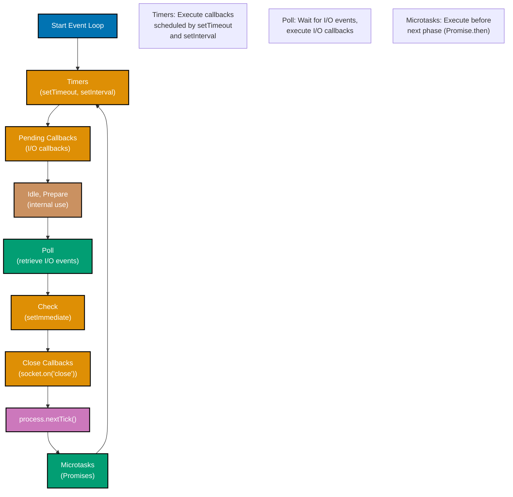

# TypeScript Concurrency and Parallelism

**Quick Reference**: [Overview](#overview) | [Async/Await](#asyncawait-patterns) | [Promise Combinators](#promise-combinators) | [Web Workers](#web-workers) | [AbortController](#abortcontroller) | [Related Documentation](#related-documentation)

## Overview

TypeScript/JavaScript uses a single-threaded event loop with asynchronous operations. Understanding promises, async/await, and Web Workers is essential for responsive applications.

### Event Loop Phases



## Async/Await Patterns

### Async/Await Flow Visualization

```mermaid
%% Color Palette: Blue #0173B2, Orange #DE8F05, Teal #029E73, Purple #CC78BC, Brown #CA9161
sequenceDiagram
    participant C as Caller
    participant F as fetchDonation
    participant API as API Server
    participant DB as Database

    C->>F: await fetchDonation#40;id#41;
    activate F
    F->>API: fetch#40;/api/donations/id#41;
    activate API
    API->>DB: SELECT * FROM donations
    activate DB
    DB-->>API: Donation data
    deactivate DB
    API-->>F: HTTP 200 + JSON
    deactivate API
    F-->>C: Donation object
    deactivate F

    Note over C,DB: Sequential async/await execution
    Note over F: Pauses until promise resolves

    classDef blue fill:#0173B2,stroke:#000000,color:#FFFFFF,stroke-width:2px
    classDef orange fill:#DE8F05,stroke:#000000,color:#FFFFFF,stroke-width:2px
    classDef teal fill:#029E73,stroke:#000000,color:#FFFFFF,stroke-width:2px
```

```typescript
// Basic async function
async function fetchDonation(id: string): Promise<Donation> {
  const response = await fetch(`/api/donations/${id}`);
  if (!response.ok) {
    throw new Error(`Failed to fetch donation: ${response.statusText}`);
  }
  return await response.json();
}

// Error handling
async function processDonation(id: string): Promise<void> {
  try {
    const donation = await fetchDonation(id);
    const validated = await validateDonation(donation);
    await saveDonation(validated);
    console.log("Success");
  } catch (error) {
    console.error("Error:", error);
  }
}

// Sequential vs Parallel
async function processSequential(ids: string[]): Promise<Donation[]> {
  const results: Donation[] = [];
  for (const id of ids) {
    const donation = await fetchDonation(id);
    results.push(donation);
  }
  return results;
}

async function processParallel(ids: string[]): Promise<Donation[]> {
  return Promise.all(ids.map((id) => fetchDonation(id)));
}
```

## Promise Combinators

```typescript
// Promise.all - wait for all
async function fetchMultiple(ids: string[]): Promise<Donation[]> {
  return Promise.all(ids.map((id) => fetchDonation(id)));
}

// Promise.race - first to complete
async function fetchWithTimeout<T>(promise: Promise<T>, timeoutMs: number): Promise<T> {
  const timeout = new Promise<never>((_, reject) => setTimeout(() => reject(new Error("Timeout")), timeoutMs));
  return Promise.race([promise, timeout]);
}

// Promise.allSettled - wait for all, don't fail fast
async function processAllDonations(ids: string[]): Promise<void> {
  const results = await Promise.allSettled(ids.map((id) => processDonation(id)));

  const succeeded = results.filter((r) => r.status === "fulfilled").length;
  const failed = results.filter((r) => r.status === "rejected").length;
  console.log(`Success: ${succeeded}, Failed: ${failed}`);
}

// Promise.any - first to succeed
async function fetchFromMultipleSources(sources: string[]): Promise<Donation> {
  return Promise.any(sources.map((source) => fetch(source)));
}
```

## Web Workers

### Web Worker Communication Pattern

```mermaid
%% Color Palette: Blue #0173B2, Orange #DE8F05, Teal #029E73, Purple #CC78BC, Brown #CA9161
sequenceDiagram
    participant M as Main Thread
    participant W as Worker Thread

    M->>M: Create Worker
    Note over M: new Worker#40;"worker.js"#41;

    M->>W: postMessage#40;data#41;
    activate W
    Note over W: Process data<br/>#40;CPU intensive#41;
    W->>W: expensiveCalculation#40;data#41;
    W-->>M: postMessage#40;result#41;
    deactivate W

    M->>M: onmessage handler
    Note over M: UI remains responsive

    M->>W: postMessage#40;more data#41;
    activate W
    W->>W: Process again
    W-->>M: postMessage#40;result#41;
    deactivate W

    M->>W: terminate#40;#41;
    Note over W: Worker destroyed

    classDef blue fill:#0173B2,stroke:#000000,color:#FFFFFF,stroke-width:2px
    classDef orange fill:#DE8F05,stroke:#000000,color:#FFFFFF,stroke-width:2px
    classDef teal fill:#029E73,stroke:#000000,color:#FFFFFF,stroke-width:2px
```

```typescript
// worker.ts
self.onmessage = (e: MessageEvent) => {
  const result = expensiveCalculation(e.data);
  self.postMessage(result);
};

function expensiveCalculation(data: number[]): number {
  return data.reduce((sum, n) => sum + n, 0);
}

// main.ts
const worker = new Worker("worker.js");

worker.postMessage([1, 2, 3, 4, 5]);

worker.onmessage = (e: MessageEvent) => {
  console.log("Result from worker:", e.data);
};

worker.onerror = (error: ErrorEvent) => {
  console.error("Worker error:", error);
};
```

## AbortController

```typescript
// Cancellable fetch
async function fetchWithCancel(url: string, signal: AbortSignal): Promise<Response> {
  return fetch(url, { signal });
}

// Usage
const controller = new AbortController();

fetchWithCancel("/api/donations", controller.signal)
  .then((response) => console.log("Success"))
  .catch((error) => {
    if (error.name === "AbortError") {
      console.log("Fetch cancelled");
    } else {
      console.error("Error:", error);
    }
  });

// Cancel after timeout
setTimeout(() => controller.abort(), 5000);
```

## Related Documentation

- **[TypeScript Best Practices](./ex-so-stla-ts__best-practices.md)** - Coding standards
- **[TypeScript Error Handling](./ex-so-stla-ts__error-handling.md)** - Async error patterns

---

**Last Updated**: 2025-01-23
**TypeScript Version**: 5.0+ (baseline), 5.4+ (milestone), 5.6+ (stable), 5.9.3+ (latest stable)
**Maintainers**: OSE Documentation Team
