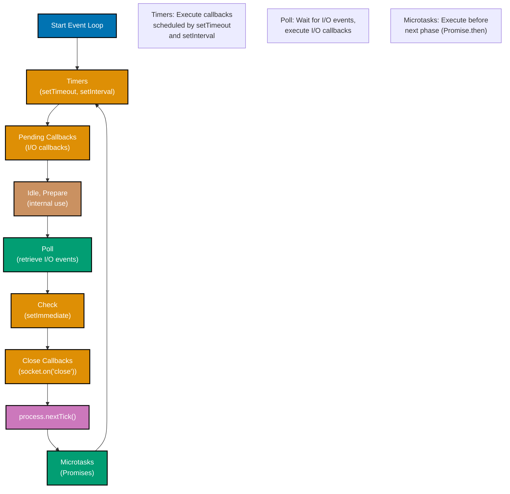
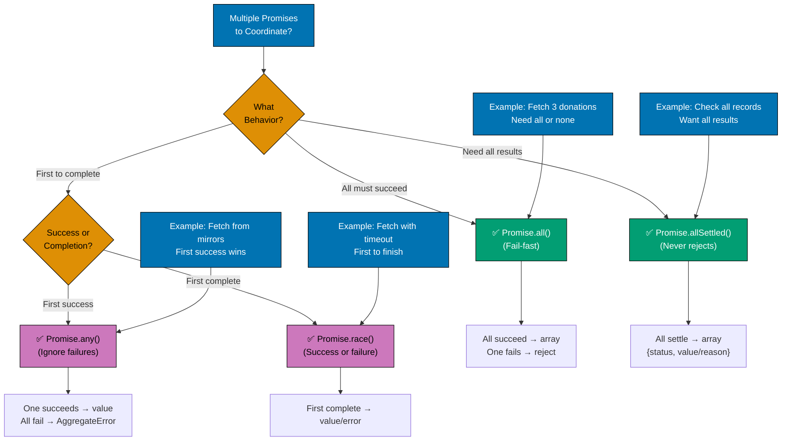
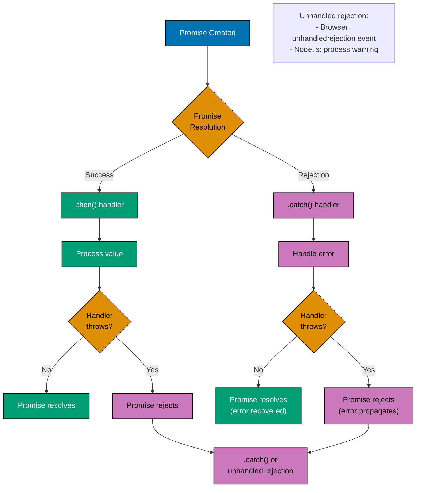
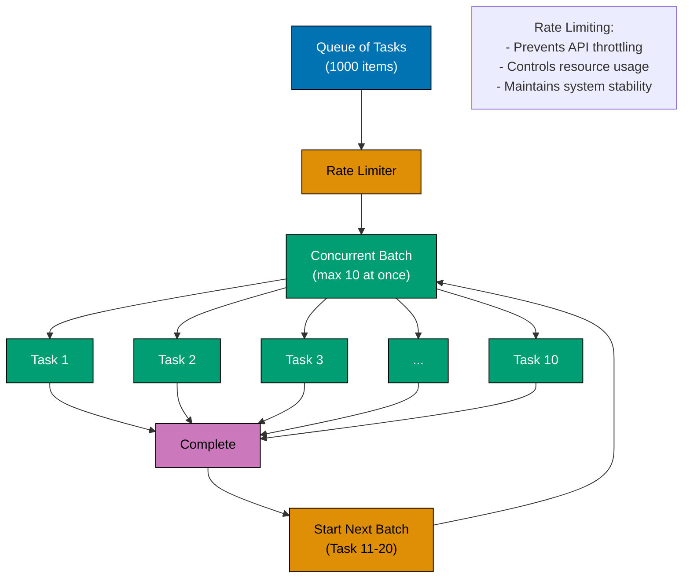

# TypeScript Concurrency and Parallelism

**Quick Reference**: [Overview](#overview) | [Async/Await](#asyncawait-patterns) | [Promise Combinators](#promise-combinators) | [Web Workers](#web-workers) | [AbortController](#abortcontroller) | [Related Documentation](#related-documentation)

## Overview

TypeScript/JavaScript uses a single-threaded event loop with asynchronous operations. Understanding promises, async/await, and Web Workers is essential for responsive applications.

### Event Loop Phases



## Async/Await Patterns

### Async/Await Flow Visualization

```mermaid
%% Color Palette: Blue #0173B2, Orange #DE8F05, Teal #029E73, Purple #CC78BC, Brown #CA9161
sequenceDiagram
    participant C as Caller
    participant F as fetchDonation
    participant API as API Server
    participant DB as Database

    C->>F: await fetchDonation#40;id#41;
    activate F
    F->>API: fetch#40;/api/donations/id#41;
    activate API
    API->>DB: SELECT * FROM donations
    activate DB
    DB-->>API: Donation data
    deactivate DB
    API-->>F: HTTP 200 + JSON
    deactivate API
    F-->>C: Donation object
    deactivate F

    Note over C,DB: Sequential async/await execution
    Note over F: Pauses until promise resolves

    classDef blue fill:#0173B2,stroke:#000000,color:#FFFFFF,stroke-width:2px
    classDef orange fill:#DE8F05,stroke:#000000,color:#FFFFFF,stroke-width:2px
    classDef teal fill:#029E73,stroke:#000000,color:#FFFFFF,stroke-width:2px
```

```typescript
// Basic async function
async function fetchDonation(id: string): Promise<Donation> {
  const response = await fetch(`/api/donations/${id}`);
  if (!response.ok) {
    throw new Error(`Failed to fetch donation: ${response.statusText}`);
  }
  return await response.json();
}

// Error handling
async function processDonation(id: string): Promise<void> {
  try {
    const donation = await fetchDonation(id);
    const validated = await validateDonation(donation);
    await saveDonation(validated);
    console.log("Success");
  } catch (error) {
    console.error("Error:", error);
  }
}
```

### Sequential vs Parallel Execution

```mermaid
%% Color Palette: Blue #0173B2, Orange #DE8F05, Teal #029E73, Purple #CC78BC
%% All colors are color-blind friendly and meet WCAG AA contrast standards

graph TD
    subgraph Sequential["Sequential Execution (Slow)"]
        S1["Start"]:::blue --> S2["await fetch(id1)<br/>Wait 100ms"]:::orange
        S2 --> S3["await fetch(id2)<br/>Wait 100ms"]:::orange
        S3 --> S4["await fetch(id3)<br/>Wait 100ms"]:::orange
        S4 --> S5["Complete<br/>Total: 300ms"]:::purple
    end

    subgraph Parallel["Parallel Execution (Fast)"]
        P1["Start"]:::blue --> P2["Promise.all([<br/>  fetch(id1),<br/>  fetch(id2),<br/>  fetch(id3)<br/>])"]:::teal
        P2 --> P3["All run concurrently<br/>Max wait: 100ms"]:::teal
        P3 --> P4["Complete<br/>Total: 100ms"]:::teal
    end

    Note1["Sequential: Each await<br/>blocks next operation<br/>100ms + 100ms + 100ms<br/>= 300ms total"]
    Note2["Parallel: All operations<br/>start immediately<br/>max(100ms, 100ms, 100ms)<br/>= 100ms total"]

    classDef blue fill:#0173B2,stroke:#000,color:#fff
    classDef orange fill:#DE8F05,stroke:#000,color:#000
    classDef teal fill:#029E73,stroke:#000,color:#fff
    classDef purple fill:#CC78BC,stroke:#000,color:#000
```



**Key Principles**:

- **Sequential**: Each `await` blocks until promise resolves
  - Total time = sum of all operation times
  - Use when operations depend on previous results
  - Easier to reason about, simpler error handling

- **Parallel**: All promises start immediately
  - Total time = longest operation time
  - Use when operations are independent
  - Much faster for I/O-bound tasks

**When to Use Each**:

```typescript
// ❌ BAD: Sequential when parallel would work
async function fetchDonationsSequential(ids: string[]): Promise<Donation[]> {
  const results: Donation[] = [];
  for (const id of ids) {
    const donation = await fetchDonation(id); // Waits for each
    results.push(donation);
  }
  return results; // 3 fetches × 100ms = 300ms
}

// ✅ GOOD: Parallel for independent operations
async function fetchDonationsParallel(ids: string[]): Promise<Donation[]> {
  return Promise.all(ids.map((id) => fetchDonation(id))); // All at once = 100ms
}

// ✅ GOOD: Sequential when operations depend on each other
async function processDonationSequential(id: string): Promise<void> {
  const donation = await fetchDonation(id); // Need this first
  const validated = await validateDonation(donation); // Depends on fetch
  await saveDonation(validated); // Depends on validation
}
```

```typescript
// Sequential vs Parallel
async function processSequential(ids: string[]): Promise<Donation[]> {
  const results: Donation[] = [];
  for (const id of ids) {
    const donation = await fetchDonation(id);
    results.push(donation);
  }
  return results;
}

async function processParallel(ids: string[]): Promise<Donation[]> {
  return Promise.all(ids.map((id) => fetchDonation(id)));
}
```

## Promise Combinators

### Promise Combinator Selection Guide



**Key Principles**:

- **Promise.all()**: All must succeed, fails fast on first rejection
  - Use when all promises must complete successfully
  - Returns array in same order as input

- **Promise.allSettled()**: Wait for all, never rejects
  - Use when you need results from all promises regardless of success/failure
  - Returns array of `{status: 'fulfilled'|'rejected', value|reason}`

- **Promise.any()**: First success wins, ignores failures
  - Use when any successful result is acceptable
  - Rejects only if all promises reject (AggregateError)

- **Promise.race()**: First to complete wins
  - Use for timeouts or fastest response
  - Resolves or rejects with first settled promise

**Islamic Finance Examples**:

```typescript
// Promise.all: All donations must validate
const validated = await Promise.all([
  validateDonation(donation1),
  validateDonation(donation2),
  validateDonation(donation3),
]); // Fails if any validation fails

// Promise.allSettled: Process all, log failures
const results = await Promise.allSettled([processDonation(d1), processDonation(d2), processDonation(d3)]);
results.forEach((r, i) => {
  if (r.status === "rejected") log.error(`Failed ${i}: ${r.reason}`);
});

// Promise.any: Fetch Zakat rate from multiple sources
const zakatRate = await Promise.any([fetchRateFromSource1(), fetchRateFromSource2(), fetchRateFromSource3()]); // First successful fetch wins

// Promise.race: Fetch with timeout
const donation = await Promise.race([fetchDonation(id), timeout(5000)]); // Cancel after 5s
```

```typescript
// Promise.all - wait for all
async function fetchMultiple(ids: string[]): Promise<Donation[]> {
  return Promise.all(ids.map((id) => fetchDonation(id)));
}

// Promise.race - first to complete
async function fetchWithTimeout<T>(promise: Promise<T>, timeoutMs: number): Promise<T> {
  const timeout = new Promise<never>((_, reject) => setTimeout(() => reject(new Error("Timeout")), timeoutMs));
  return Promise.race([promise, timeout]);
}

// Promise.allSettled - wait for all, don't fail fast
async function processAllDonations(ids: string[]): Promise<void> {
  const results = await Promise.allSettled(ids.map((id) => processDonation(id)));

  const succeeded = results.filter((r) => r.status === "fulfilled").length;
  const failed = results.filter((r) => r.status === "rejected").length;
  console.log(`Success: ${succeeded}, Failed: ${failed}`);
}

// Promise.any - first to succeed
async function fetchFromMultipleSources(sources: string[]): Promise<Donation> {
  return Promise.any(sources.map((source) => fetch(source)));
}
```

## Web Workers

### Web Worker Communication Pattern

```mermaid
%% Color Palette: Blue #0173B2, Orange #DE8F05, Teal #029E73, Purple #CC78BC, Brown #CA9161
sequenceDiagram
    participant M as Main Thread
    participant W as Worker Thread

    M->>M: Create Worker
    Note over M: new Worker#40;"worker.js"#41;

    M->>W: postMessage#40;data#41;
    activate W
    Note over W: Process data<br/>#40;CPU intensive#41;
    W->>W: expensiveCalculation#40;data#41;
    W-->>M: postMessage#40;result#41;
    deactivate W

    M->>M: onmessage handler
    Note over M: UI remains responsive

    M->>W: postMessage#40;more data#41;
    activate W
    W->>W: Process again
    W-->>M: postMessage#40;result#41;
    deactivate W

    M->>W: terminate#40;#41;
    Note over W: Worker destroyed

    classDef blue fill:#0173B2,stroke:#000000,color:#FFFFFF,stroke-width:2px
    classDef orange fill:#DE8F05,stroke:#000000,color:#FFFFFF,stroke-width:2px
    classDef teal fill:#029E73,stroke:#000000,color:#FFFFFF,stroke-width:2px
```

```typescript
// worker.ts
self.onmessage = (e: MessageEvent) => {
  const result = expensiveCalculation(e.data);
  self.postMessage(result);
};

function expensiveCalculation(data: number[]): number {
  return data.reduce((sum, n) => sum + n, 0);
}

// main.ts
const worker = new Worker("worker.js");

worker.postMessage([1, 2, 3, 4, 5]);

worker.onmessage = (e: MessageEvent) => {
  console.log("Result from worker:", e.data);
};

worker.onerror = (error: ErrorEvent) => {
  console.error("Worker error:", error);
};
```

## AbortController

### AbortController Cancellation Flow

```mermaid
%% Color Palette: Blue #0173B2, Orange #DE8F05, Teal #029E73, Purple #CC78BC
%% All colors are color-blind friendly and meet WCAG AA contrast standards

sequenceDiagram
    participant App as Application
    participant AC as AbortController
    participant Fetch as fetch() API
    participant Server as Server

    App->>AC: new AbortController()
    activate AC
    AC-->>App: controller + signal

    App->>Fetch: fetch(url, { signal })
    activate Fetch
    Fetch->>Server: HTTP Request
    activate Server

    alt Normal Completion
        Server-->>Fetch: HTTP Response
        deactivate Server
        Fetch-->>App: Response
        deactivate Fetch
        App->>AC: (optional) controller.abort()
        deactivate AC
    else Timeout or User Action
        App->>AC: controller.abort()
        AC->>Fetch: AbortSignal triggered
        Fetch->>Fetch: Cancel request
        Fetch-->>App: throw AbortError
        deactivate Fetch
        deactivate AC
        Note over Server: Request may complete<br/>but response ignored
    end

    Note over App,AC: AbortController provides<br/>cancellation mechanism
    Note over Fetch: fetch() respects signal<br/>and cancels request
```

**Key Principles**:

- **AbortController**: Creates cancellable operation
  - `controller.signal` passed to async operation
  - `controller.abort()` triggers cancellation
  - Operation throws `AbortError` when cancelled

- **Common Use Cases**:
  - Request timeouts
  - User-initiated cancellation (button click)
  - Component unmount (React cleanup)
  - Superseded requests (autocomplete)

**Islamic Finance Example**:

```typescript
// Fetch donation with 5-second timeout
async function fetchDonationWithTimeout(id: string): Promise<Donation> {
  const controller = new AbortController();
  const timeoutId = setTimeout(() => controller.abort(), 5000);

  try {
    const response = await fetch(`/api/donations/${id}`, {
      signal: controller.signal,
    });
    clearTimeout(timeoutId);
    return await response.json();
  } catch (error) {
    if (error.name === "AbortError") {
      throw new Error("Donation fetch timeout after 5 seconds");
    }
    throw error;
  }
}

// Cancel on component unmount (React example)
useEffect(() => {
  const controller = new AbortController();

  fetchDonations({ signal: controller.signal }).then(setDonations);

  return () => {
    controller.abort(); // Cleanup: cancel pending fetch
  };
}, []);
```

```typescript
// Cancellable fetch
async function fetchWithCancel(url: string, signal: AbortSignal): Promise<Response> {
  return fetch(url, { signal });
}

// Usage
const controller = new AbortController();

fetchWithCancel("/api/donations", controller.signal)
  .then((response) => console.log("Success"))
  .catch((error) => {
    if (error.name === "AbortError") {
      console.log("Fetch cancelled");
    } else {
      console.error("Error:", error);
    }
  });

// Cancel after timeout
setTimeout(() => controller.abort(), 5000);
```

## Async Error Handling

### Promise Error Propagation



**Key Principles**:

- **Promise rejection**: Propagates through chain until caught
- **`.catch()` recovers**: Returning value resolves the promise
- **`.catch()` can re-throw**: Rethrowing propagates error further
- **Unhandled rejections**: Trigger global error events

**Error Handling Patterns**:

```typescript
// ✅ GOOD: try/catch with async/await
async function fetchDonationSafe(id: string): Promise<Donation | null> {
  try {
    const response = await fetch(`/api/donations/${id}`);
    if (!response.ok) {
      throw new Error(`HTTP ${response.status}: ${response.statusText}`);
    }
    return await response.json();
  } catch (error) {
    console.error(`Failed to fetch donation ${id}:`, error);
    return null; // Recover gracefully
  }
}

// ✅ GOOD: Promise chain with .catch()
function fetchDonationChain(id: string): Promise<Donation | null> {
  return fetch(`/api/donations/${id}`)
    .then((response) => {
      if (!response.ok) throw new Error(`HTTP ${response.status}`);
      return response.json();
    })
    .catch((error) => {
      console.error(`Failed to fetch donation ${id}:`, error);
      return null; // Recover
    });
}

// ❌ BAD: Unhandled rejection
async function fetchDonationUnsafe(id: string): Promise<Donation> {
  const response = await fetch(`/api/donations/${id}`); // Can throw
  return await response.json(); // Can throw - no error handling!
}
```

## Common Concurrency Patterns

### Rate Limiting Pattern



**Rate Limiting Implementation**:

```typescript
// ✅ GOOD: Process items with concurrency limit
async function processWithConcurrencyLimit<T, R>(
  items: T[],
  processor: (item: T) => Promise<R>,
  maxConcurrent: number,
): Promise<R[]> {
  const results: R[] = [];
  const executing: Promise<void>[] = [];

  for (const item of items) {
    const promise = processor(item).then((result) => {
      results.push(result);
      executing.splice(executing.indexOf(promise), 1);
    });

    executing.push(promise);

    if (executing.length >= maxConcurrent) {
      await Promise.race(executing); // Wait for one to complete
    }
  }

  await Promise.all(executing); // Wait for remaining
  return results;
}

// Usage: Process 1000 donations with max 10 concurrent
const donations = await processWithConcurrencyLimit(donationIds, fetchDonation, 10);

// ✅ GOOD: Batch processing with delay
async function processBatchesWithDelay<T, R>(
  items: T[],
  processor: (batch: T[]) => Promise<R[]>,
  batchSize: number,
  delayMs: number,
): Promise<R[]> {
  const results: R[] = [];

  for (let i = 0; i < items.length; i += batchSize) {
    const batch = items.slice(i, i + batchSize);
    const batchResults = await processor(batch);
    results.push(...batchResults);

    if (i + batchSize < items.length) {
      await new Promise((resolve) => setTimeout(resolve, delayMs));
    }
  }

  return results;
}

// Usage: Process 1000 Zakat calculations, 50 at a time, 1s delay between batches
const zakatResults = await processBatchesWithDelay(
  accounts,
  calculateZakatBatch,
  50, // batch size
  1000, // 1s delay
);
```

## Related Documentation

- **[TypeScript Best Practices](./ex-so-stla-ts__best-practices.md)** - Coding standards
- **[TypeScript Error Handling](./ex-so-stla-ts__error-handling.md)** - Async error patterns

---

**Last Updated**: 2025-01-23
**TypeScript Version**: 5.0+ (baseline), 5.4+ (milestone), 5.6+ (stable), 5.9.3+ (latest stable)
**Maintainers**: OSE Documentation Team
