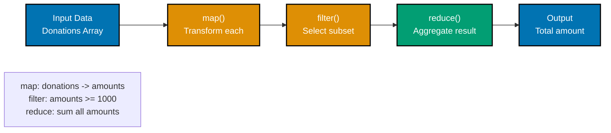
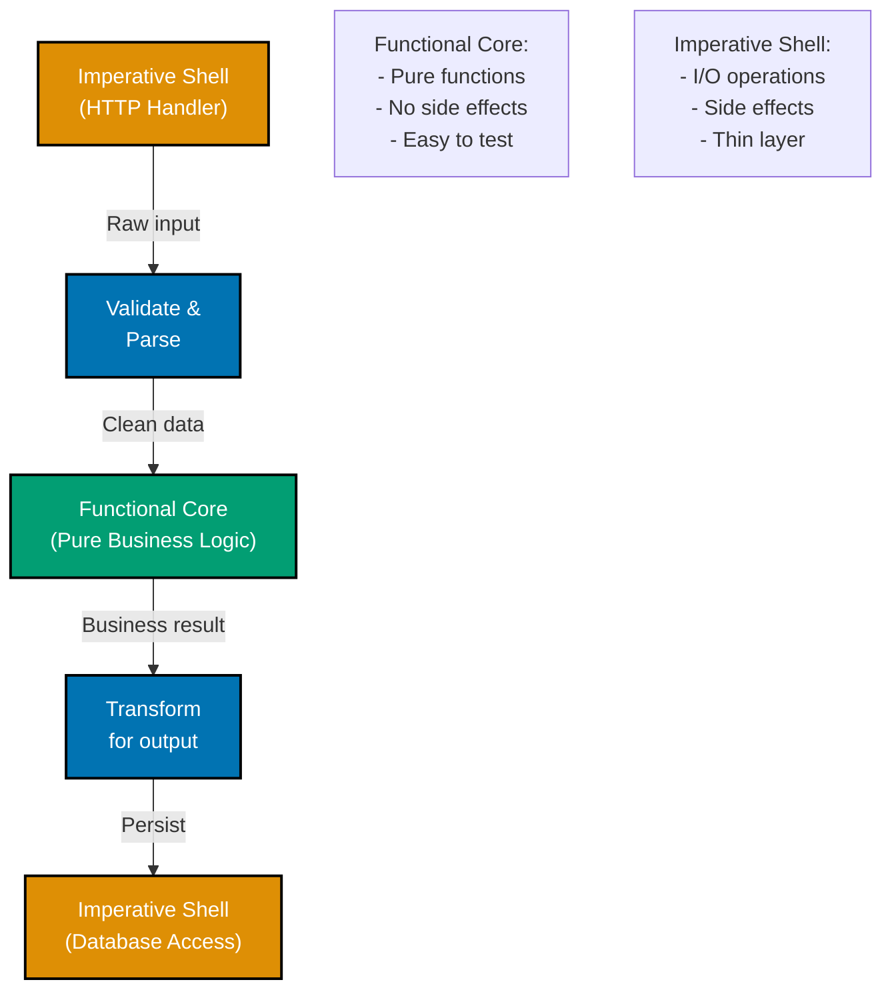
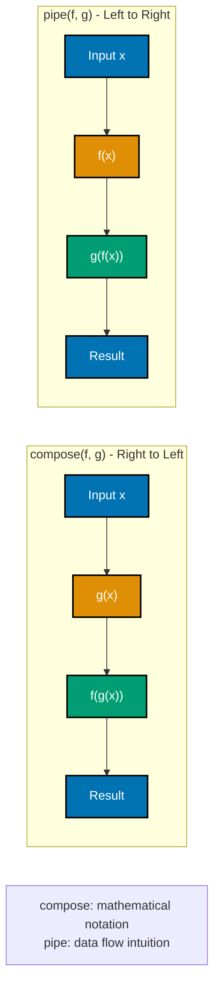

# TypeScript Functional Programming

**Quick Reference**: [Overview](#overview) | [Pure Functions](#pure-functions-and-immutability) | [Higher-Order Functions](#higher-order-functions) | [Composition](#function-composition) | [Currying](#currying-and-partial-application) | [Functors](#functors-and-monads) | [Related Documentation](#related-documentation)

## Overview

Functional programming in TypeScript emphasizes pure functions, immutability, and composition. These principles create predictable, testable code—critical for financial systems.

## Pure Functions and Immutability

```typescript
// Pure function - same input always produces same output
function calculateZakat(wealth: number): number {
  return wealth * 0.025;
}

// Immutable data structures
interface Money {
  readonly amount: number;
  readonly currency: string;
}

function addMoney(a: Money, b: Money): Money {
  if (a.currency !== b.currency) {
    throw new Error("Currency mismatch");
  }
  return Object.freeze({
    amount: a.amount + b.amount,
    currency: a.currency,
  });
}
```

## Higher-Order Functions

```typescript
// Function that returns a function
function createMultiplier(factor: number): (value: number) => number {
  return (value: number) => value * factor;
}

const double = createMultiplier(2);
const triple = createMultiplier(3);

// Financial example
function createZakatCalculator(rate: number): (wealth: number) => number {
  return (wealth: number) => wealth * rate;
}

const standardZakat = createZakatCalculator(0.025);
const agricultureZakat = createZakatCalculator(0.1);
```

## Function Composition

### Data Transformation Pipeline



```typescript
// Compose functions right-to-left
function compose<A, B, C>(f: (b: B) => C, g: (a: A) => B): (a: A) => C {
  return (a: A) => f(g(a));
}

// Pipe functions left-to-right
function pipe<A, B, C>(f: (a: A) => B, g: (b: B) => C): (a: A) => C {
  return (a: A) => g(f(a));
}

// Financial example
const validateAmount = (amount: number): number => {
  if (amount < 0) throw new Error("Amount must be positive");
  return amount;
};

const applyFee = (amount: number): number => amount * 0.97;

const calculateNet = (amount: number): number => amount - 100;

const processDonation = pipe(validateAmount, applyFee, calculateNet);
```

### Functional Core / Imperative Shell



### Compose and Pipe Functions



## Currying and Partial Application

```typescript
// Curried function
function add(a: number): (b: number) => number {
  return (b: number) => a + b;
}

const add5 = add(5);
console.log(add5(10)); // 15

// Generic curry
function curry<A, B, C>(fn: (a: A, b: B) => C): (a: A) => (b: B) => C {
  return (a: A) => (b: B) => fn(a, b);
}

// Financial example
const calculateProfit = (costPrice: number, profitMargin: number): number => costPrice + profitMargin;

const curriedProfit = curry(calculateProfit);
const addMargin = curriedProfit(100000);
console.log(addMargin(15000)); // 115000
```

## Functors and Monads

```typescript
// Maybe monad
type Maybe<T> = { type: "Just"; value: T } | { type: "Nothing" };

function just<T>(value: T): Maybe<T> {
  return { type: "Just", value };
}

function nothing<T>(): Maybe<T> {
  return { type: "Nothing" };
}

function mapMaybe<T, U>(maybe: Maybe<T>, fn: (value: T) => U): Maybe<U> {
  if (maybe.type === "Just") {
    return just(fn(maybe.value));
  }
  return nothing();
}

// Either monad (from error-handling.md)
type Either<L, R> = { _tag: "Left"; left: L } | { _tag: "Right"; right: R };

function mapEither<L, R, S>(either: Either<L, R>, fn: (value: R) => S): Either<L, S> {
  if (either._tag === "Right") {
    return { _tag: "Right", right: fn(either.right) };
  }
  return either;
}
```

## Related Documentation

- **[TypeScript Best Practices](./ex-so-stla-ts__best-practices.md)** - Coding standards
- **[Functional Programming Principle](../../../../../governance/development/pattern/functional-programming.md)** - FP principles

---

**Last Updated**: 2025-01-23
**TypeScript Version**: 5.0+ (baseline), 5.4+ (milestone), 5.6+ (stable), 5.9.3+ (latest stable)
**Maintainers**: OSE Documentation Team
