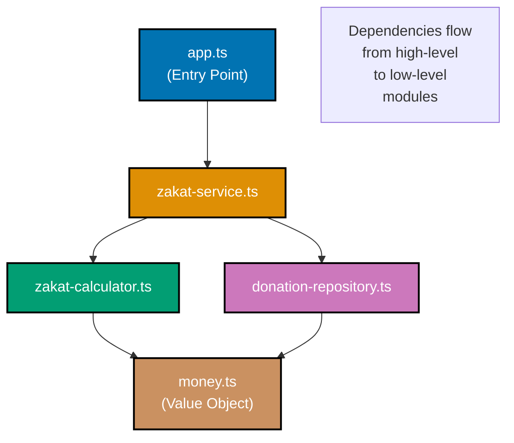
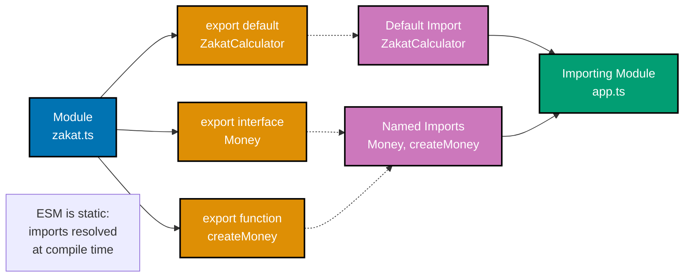
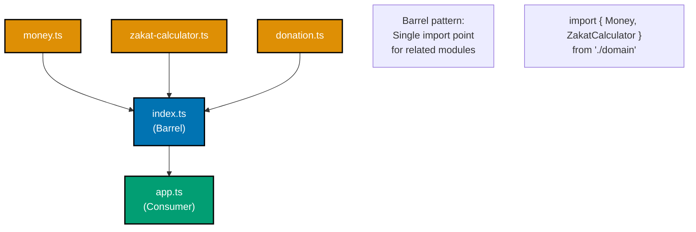

# TypeScript Modules and Dependencies

**Quick Reference**: [Overview](#overview) | [ES Modules](#es-modules) | [Package Managers](#package-managers) | [Module Resolution](#module-resolution) | [Monorepos](#workspaces-and-monorepos) | [Related Documentation](#related-documentation)

## Overview

TypeScript uses ES modules as its primary module system. Understanding module resolution, package managers, and dependency management is essential for reproducible builds.

## ES Modules

### Module Dependency Graph



```typescript
// Exporting
export interface Money {
  readonly amount: number;
  readonly currency: string;
}

export function createMoney(amount: number, currency: string): Money {
  return Object.freeze({ amount, currency });
}

export default class ZakatCalculator {
  calculate(wealth: Money, nisab: Money): Money {
    if (wealth.amount < nisab.amount) {
      return createMoney(0, wealth.currency);
    }
    return createMoney(wealth.amount * 0.025, wealth.currency);
  }
}

// Importing
import ZakatCalculator, { Money, createMoney } from "./zakat";

const calculator = new ZakatCalculator();
const wealth = createMoney(100000, "USD");
```

### ESM Import/Export Flow



### Barrel Export Pattern



## Package Managers

```json
// package.json with Volta
{
  "name": "ose-platform",
  "volta": {
    "node": "24.11.1",
    "npm": "11.6.3"
  },
  "dependencies": {
    "typescript": "5.7.3",
    "express": "5.2.1"
  },
  "devDependencies": {
    "@types/node": "24.11.1",
    "vitest": "4.0.18"
  }
}
```

### npm (11.8.0)

```bash
npm ci              # Install exact versions from lockfile
npm install pkg     # Add dependency
npm update          # Update within semver range
npm audit           # Check for vulnerabilities
```

### pnpm (10.28.1)

```bash
pnpm install        # Fast, disk-efficient installs
pnpm add pkg        # Add dependency
pnpm update         # Update dependencies
```

### bun (1.3.6)

```bash
bun install         # Ultra-fast installs
bun add pkg         # Add dependency
bun update          # Update dependencies
```

## Module Resolution

```json
// tsconfig.json
{
  "compilerOptions": {
    "moduleResolution": "Bundler", // or "Node16", "NodeNext"
    "module": "ESNext",
    "target": "ES2023",
    "baseUrl": "./src",
    "paths": {
      "@domain/*": ["domain/*"],
      "@infrastructure/*": ["infrastructure/*"]
    }
  }
}
```

## Workspaces and Monorepos

### Nx Workspace

```json
// nx.json
{
  "affected": {
    "defaultBase": "main"
  },
  "targetDefaults": {
    "build": {
      "cache": true
    }
  }
}
```

### pnpm Workspaces

```yaml
# pnpm-workspace.yaml
packages:
  - "apps/*"
  - "libs/*"
```

## Related Documentation

- **[TypeScript Best Practices](./ex-so-stla-ts__best-practices.md)** - Coding standards
- **[Reproducibility Principle](../../../../../governance/principles/software-engineering/reproducibility.md)** - Reproducible builds

---

**Last Updated**: 2025-01-23
**TypeScript Version**: 5.0+ (baseline), 5.4+ (milestone), 5.6+ (stable), 5.7.3+ (latest stable)
**Maintainers**: OSE Documentation Team
