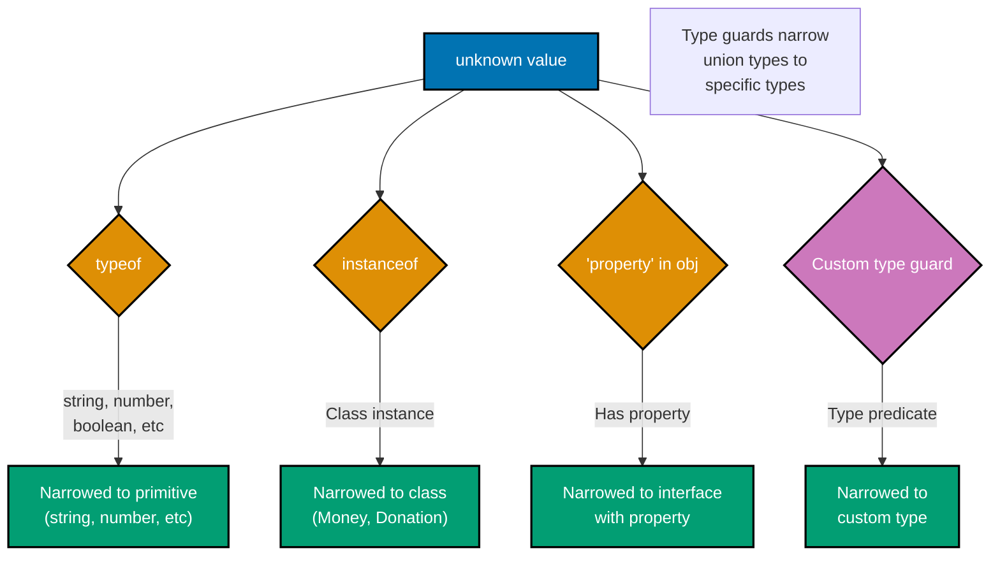
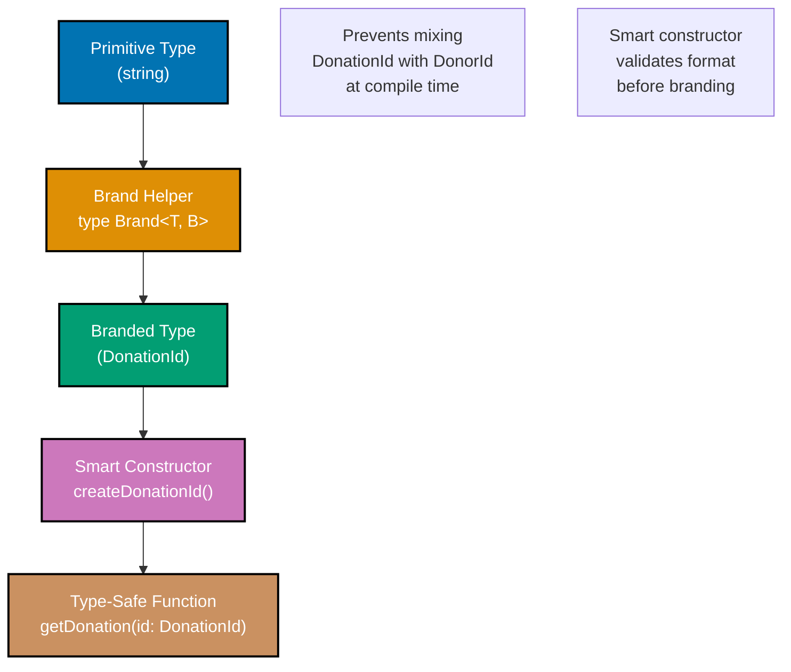
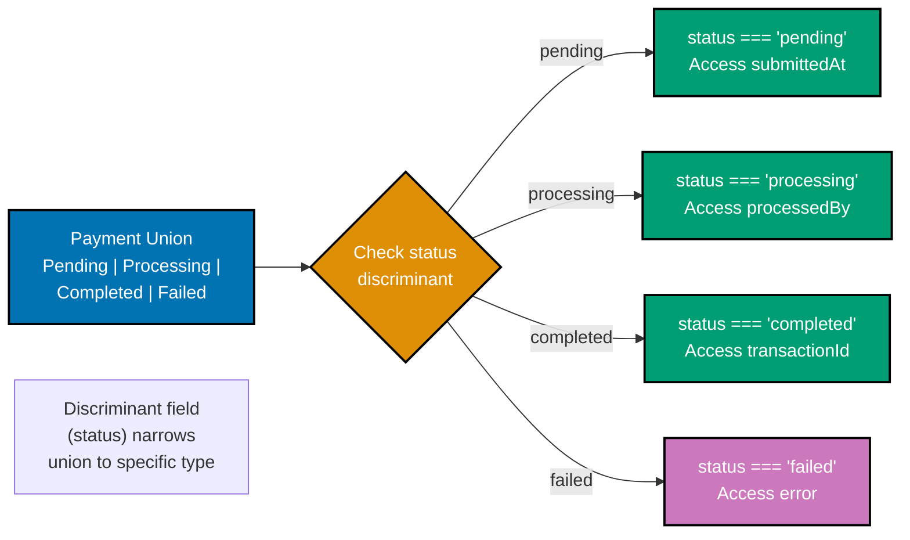

# TypeScript Type Safety

**Quick Reference**: [Overview](#overview) | [Branded Types](#branded-types) | [Discriminated Unions](#discriminated-unions) | [Exhaustiveness Checking](#exhaustiveness-checking) | [Type Predicates](#type-predicates) | [Const Assertions](#const-assertions) | [Strict Mode](#strict-mode-configuration) | [Generic Constraints](#generic-constraints) | [Variance](#variance-and-contravariance) | [Related Documentation](#related-documentation)

## Overview

Type safety is TypeScript's core strength. A properly type-safe codebase prevents entire classes of bugs at compile time, making it especially valuable for financial systems where correctness is paramount.

**Why Type Safety Matters for Finance**:

- **Prevent mixing incompatible units**: Can't add USD to EUR without conversion
- **Catch calculation errors early**: Type errors found during development, not production
- **Self-documenting code**: Types serve as inline documentation
- **Enable fearless refactoring**: Breaking changes caught immediately
- **Runtime safety**: Combine with runtime validation for defense-in-depth

### Type Narrowing Decision Tree



## Branded Types

Branded types (nominal typing) create distinct types from primitives, preventing type confusion.

### Branded Types Pattern



### Basic Branding

```typescript
// Brand type helper
type Brand<T, B> = T & { __brand: B };

// Domain-specific types
type DonationId = Brand<string, "DonationId">;
type DonorId = Brand<string, "DonorId">;
type TransactionId = Brand<string, "TransactionId">;
type ContractId = Brand<string, "ContractId">;

// Smart constructors enforce validation
function createDonationId(value: string): DonationId {
  if (!/^DON-\d{6}$/.test(value)) {
    throw new Error(`Invalid donation ID format: ${value}`);
  }
  return value as DonationId;
}

function createDonorId(value: string): DonorId {
  if (!/^DNR-\d{6}$/.test(value)) {
    throw new Error(`Invalid donor ID format: ${value}`);
  }
  return value as DonorId;
}

// Type-safe API
function getDonation(id: DonationId): Donation {
  // Implementation
  return {} as Donation;
}

function getDonor(id: DonorId): Donor {
  // Implementation
  return {} as Donor;
}

// Usage - compile-time safety
const donationId = createDonationId("DON-123456");
const donorId = createDonorId("DNR-789012");

getDonation(donationId); // ✓ Correct
// getDonation(donorId); // ✗ Compile error: Type 'DonorId' not assignable to 'DonationId'
```

### Numeric Brands

Prevent mixing incompatible numeric values.

```typescript
// Branded numeric types
type USD = Brand<number, "USD">;
type EUR = Brand<number, "EUR">;
type GBP = Brand<number, "GBP">;
type Percentage = Brand<number, "Percentage">;
type PositiveNumber = Brand<number, "Positive">;

// Smart constructors
function createUSD(amount: number): USD {
  if (!Number.isFinite(amount)) {
    throw new Error("Amount must be finite");
  }
  return amount as USD;
}

function createPercentage(value: number): Percentage {
  if (value < 0 || value > 100) {
    throw new Error("Percentage must be between 0 and 100");
  }
  return value as Percentage;
}

function createPositive(value: number): PositiveNumber {
  if (value <= 0) {
    throw new Error("Value must be positive");
  }
  return value as PositiveNumber;
}

// Type-safe operations
function applyDiscount(price: USD, discount: Percentage): USD {
  const discountAmount = (price * discount) / 100;
  return createUSD(price - discountAmount);
}

// Cannot mix currencies
function addUSD(a: USD, b: USD): USD {
  return createUSD(a + b);
}

const usd100 = createUSD(100);
const eur50 = createEUR(50);

// addUSD(usd100, eur50); // ✗ Compile error: Type 'EUR' not assignable to 'USD'
```

### Complex Branded Types

Brand complex objects for domain safety.

```typescript
// Branded Money type
interface MoneyData {
  readonly amount: number;
  readonly currency: string;
}

type Money = Brand<MoneyData, "Money">;

function createMoney(amount: number, currency: string): Money {
  if (!Number.isFinite(amount)) {
    throw new Error("Amount must be finite");
  }
  if (currency.length !== 3) {
    throw new Error("Currency must be ISO 4217 code (3 letters)");
  }
  return Object.freeze({ amount, currency }) as Money;
}

// Type-safe Money operations
function addMoney(a: Money, b: Money): Money {
  if (a.currency !== b.currency) {
    throw new Error(`Cannot add ${a.currency} to ${b.currency}`);
  }
  return createMoney(a.amount + b.amount, a.currency);
}

function multiplyMoney(money: Money, factor: number): Money {
  return createMoney(money.amount * factor, money.currency);
}

// Zakat calculation with branded types
function calculateZakat(wealth: Money, nisab: Money): Money {
  if (wealth.currency !== nisab.currency) {
    throw new Error("Wealth and nisab must be same currency");
  }
  if (wealth.amount < nisab.amount) {
    return createMoney(0, wealth.currency);
  }
  return multiplyMoney(wealth, 0.025);
}
```

## Discriminated Unions

Discriminated unions (tagged unions) model mutually exclusive states safely.

### Discriminated Union Narrowing



### Payment State Machine

```typescript
// Payment states as discriminated union
interface PendingPayment {
  readonly status: "pending";
  readonly submittedAt: Date;
  readonly amount: Money;
}

interface ProcessingPayment {
  readonly status: "processing";
  readonly submittedAt: Date;
  readonly amount: Money;
  readonly processedBy: string;
  readonly startedAt: Date;
}

interface CompletedPayment {
  readonly status: "completed";
  readonly submittedAt: Date;
  readonly amount: Money;
  readonly completedAt: Date;
  readonly transactionId: string;
  readonly receiptUrl: string;
}

interface FailedPayment {
  readonly status: "failed";
  readonly submittedAt: Date;
  readonly amount: Money;
  readonly failedAt: Date;
  readonly error: string;
  readonly retryable: boolean;
}

type Payment = PendingPayment | ProcessingPayment | CompletedPayment | FailedPayment;

// Type-safe state handling
function handlePayment(payment: Payment): void {
  switch (payment.status) {
    case "pending":
      console.log("Payment pending since:", payment.submittedAt);
      break;
    case "processing":
      console.log("Processing by:", payment.processedBy);
      console.log("Started at:", payment.startedAt);
      break;
    case "completed":
      console.log("Transaction ID:", payment.transactionId);
      console.log("Receipt:", payment.receiptUrl);
      break;
    case "failed":
      console.log("Error:", payment.error);
      console.log("Retryable:", payment.retryable);
      break;
  }
}

// State transitions
function transitionPayment(payment: Payment, event: PaymentEvent): Payment {
  switch (payment.status) {
    case "pending":
      if (event.type === "START_PROCESSING") {
        return {
          status: "processing",
          submittedAt: payment.submittedAt,
          amount: payment.amount,
          processedBy: event.processedBy,
          startedAt: new Date(),
        };
      }
      return payment;

    case "processing":
      if (event.type === "COMPLETE") {
        return {
          status: "completed",
          submittedAt: payment.submittedAt,
          amount: payment.amount,
          completedAt: new Date(),
          transactionId: event.transactionId,
          receiptUrl: event.receiptUrl,
        };
      }
      if (event.type === "FAIL") {
        return {
          status: "failed",
          submittedAt: payment.submittedAt,
          amount: payment.amount,
          failedAt: new Date(),
          error: event.error,
          retryable: event.retryable,
        };
      }
      return payment;

    case "completed":
    case "failed":
      // Terminal states - no transitions
      return payment;
  }
}
```

### Result Type Pattern

```typescript
// Generic Result type for error handling
type Result<T, E = Error> = { readonly ok: true; readonly value: T } | { readonly ok: false; readonly error: E };

// Helper functions
function ok<T>(value: T): Result<T, never> {
  return { ok: true, value };
}

function err<E>(error: E): Result<never, E> {
  return { ok: false, error };
}

// Usage in Zakat calculation
function calculateZakatSafe(wealth: Money, nisab: Money): Result<Money, string> {
  if (wealth.currency !== nisab.currency) {
    return err("Currency mismatch between wealth and nisab");
  }

  if (wealth.amount < nisab.amount) {
    return ok(createMoney(0, wealth.currency));
  }

  const zakatAmount = wealth.amount * 0.025;
  return ok(createMoney(zakatAmount, wealth.currency));
}

// Type-safe error handling
function processZakat(wealth: Money, nisab: Money): void {
  const result = calculateZakatSafe(wealth, nisab);

  if (result.ok) {
    console.log("Zakat amount:", result.value);
  } else {
    console.error("Error:", result.error);
  }
}
```

## Exhaustiveness Checking

Exhaustiveness checking ensures all cases in a union are handled.

### Never Type for Exhaustiveness

```typescript
type DonationCategory = "zakat" | "sadaqah" | "waqf" | "general";

function categorizeDonation(category: DonationCategory): string {
  switch (category) {
    case "zakat":
      return "Obligatory charity";
    case "sadaqah":
      return "Voluntary charity";
    case "waqf":
      return "Endowment";
    case "general":
      return "General donation";
    default:
      // Exhaustiveness check
      const _exhaustive: never = category;
      throw new Error(`Unhandled category: ${_exhaustive}`);
  }
}

// If a new category is added to the union:
// type DonationCategory = "zakat" | "sadaqah" | "waqf" | "general" | "emergency";
// TypeScript will error at the never assignment, forcing you to add the case
```

### Exhaustive Discriminated Unions

```typescript
function getPaymentStatusMessage(payment: Payment): string {
  switch (payment.status) {
    case "pending":
      return "Payment is pending";
    case "processing":
      return `Processing by ${payment.processedBy}`;
    case "completed":
      return `Completed: ${payment.transactionId}`;
    case "failed":
      return `Failed: ${payment.error}`;
    default:
      const _exhaustive: never = payment;
      throw new Error(`Unhandled payment status: ${_exhaustive}`);
  }
}
```

## Type Predicates

Type predicates enable custom type guards for runtime type narrowing.

### Basic Type Predicates

```typescript
function isMoney(value: unknown): value is Money {
  return (
    typeof value === "object" &&
    value !== null &&
    "amount" in value &&
    typeof (value as any).amount === "number" &&
    "currency" in value &&
    typeof (value as any).currency === "string"
  );
}

// Usage
function processMoney(value: unknown): void {
  if (isMoney(value)) {
    // TypeScript knows value is Money
    console.log(`${value.currency} ${value.amount}`);
  } else {
    throw new Error("Invalid money value");
  }
}
```

### Array Filtering with Type Predicates

```typescript
interface Donation {
  donationId: string;
  amount: Money;
  category: string;
}

function isDonation(value: unknown): value is Donation {
  return (
    typeof value === "object" &&
    value !== null &&
    "donationId" in value &&
    typeof (value as any).donationId === "string" &&
    "amount" in value &&
    isMoney((value as any).amount) &&
    "category" in value &&
    typeof (value as any).category === "string"
  );
}

// Type-safe filtering
function filterDonations(values: unknown[]): Donation[] {
  return values.filter(isDonation);
}

const mixed: unknown[] = [
  { donationId: "D1", amount: createMoney(100, "USD"), category: "zakat" },
  "not a donation",
  null,
  { donationId: "D2", amount: createMoney(200, "USD"), category: "sadaqah" },
];

const donations = filterDonations(mixed);
// Type: Donation[]
```

## Const Assertions

Const assertions create immutable, literal types.

### Basic Const Assertions

```typescript
// Without as const - widened to string
const currency1 = "USD"; // Type: string

// With as const - literal type
const currency2 = "USD" as const; // Type: "USD"

// Object with as const
const zakatRates = {
  CASH: 0.025,
  GOLD: 0.025,
  SILVER: 0.025,
  AGRICULTURE: 0.1,
} as const;

// Type is readonly and literal
type ZakatCategory = keyof typeof zakatRates;
// "CASH" | "GOLD" | "SILVER" | "AGRICULTURE"

function getZakatRate(category: ZakatCategory): number {
  return zakatRates[category];
}
```

### Array Const Assertions

```typescript
const paymentMethods = ["cash", "card", "bank_transfer"] as const;

type PaymentMethod = (typeof paymentMethods)[number];
// "cash" | "card" | "bank_transfer"

function processPayment(method: PaymentMethod): void {
  console.log(`Processing ${method} payment`);
}

// Readonly array
// paymentMethods.push("crypto"); // Error: Property 'push' does not exist on readonly array
```

## Strict Mode Configuration

Enable all strict type-checking options for maximum safety.

### tsconfig.json Strict Configuration

```json
{
  "compilerOptions": {
    // Core strict options
    "strict": true,

    // Individual strict options (enabled by strict: true)
    "noImplicitAny": true,
    "strictNullChecks": true,
    "strictFunctionTypes": true,
    "strictBindCallApply": true,
    "strictPropertyInitialization": true,
    "noImplicitThis": true,
    "alwaysStrict": true,

    // Additional safety options
    "noUnusedLocals": true,
    "noUnusedParameters": true,
    "noImplicitReturns": true,
    "noFallthroughCasesInSwitch": true,
    "noUncheckedIndexedAccess": true,
    "noPropertyAccessFromIndexSignature": true,
    "allowUnusedLabels": false,
    "allowUnreachableCode": false,

    // Module safety
    "esModuleInterop": true,
    "forceConsistentCasingInFileNames": true,
    "isolatedModules": true,

    // Type checking
    "skipLibCheck": true
  }
}
```

### Null Safety

```typescript
// With strictNullChecks: true

// Error: Object is possibly 'undefined'
function processAmount(amount: number | undefined): void {
  // console.log(amount.toFixed(2)); // Error

  // Correct: Check for undefined
  if (amount !== undefined) {
    console.log(amount.toFixed(2));
  }
}

// Financial example: Safe Money access
interface Donation {
  donationId: string;
  amount?: Money;
}

function formatDonation(donation: Donation): string {
  // Error: Object is possibly 'undefined'
  // return `${donation.amount.currency} ${donation.amount.amount}`;

  // Correct: Handle undefined
  if (!donation.amount) {
    return "Amount not specified";
  }
  return `${donation.amount.currency} ${donation.amount.amount}`;
}
```

### No Implicit Any

```typescript
// With noImplicitAny: true

// Error: Parameter 'data' implicitly has an 'any' type
// function processData(data) { ... }

// Correct: Explicit type
function processData(data: unknown): void {
  if (typeof data === "object" && data !== null) {
    // Process validated data
  }
}

// Financial example
interface DonationInput {
  donorId: string;
  amount: number;
  category: string;
}

function createDonation(input: DonationInput): Donation {
  return {
    donationId: crypto.randomUUID(),
    donorId: input.donorId,
    amount: createMoney(input.amount, "USD"),
    category: input.category,
  };
}
```

## Generic Constraints

Constrain generic types to ensure type safety.

### Basic Constraints

```typescript
// Constraint: T must have a 'currency' property
function extractCurrency<T extends { currency: string }>(value: T): string {
  return value.currency;
}

const money = createMoney(100, "USD");
const currency = extractCurrency(money); // ✓ OK

// const number = 123;
// extractCurrency(number); // ✗ Error: Type 'number' doesn't satisfy constraint
```

### Multiple Constraints

```typescript
interface Identifiable {
  id: string;
}

interface Timestamped {
  createdAt: Date;
}

// T must satisfy both constraints
function logEntity<T extends Identifiable & Timestamped>(entity: T): void {
  console.log(`ID: ${entity.id}, Created: ${entity.createdAt}`);
}

interface Donation extends Identifiable, Timestamped {
  amount: Money;
}

const donation: Donation = {
  id: "DON-001",
  createdAt: new Date(),
  amount: createMoney(1000, "USD"),
};

logEntity(donation); // ✓ OK
```

### Conditional Constraints

```typescript
// Different behavior based on type
type ToArray<T> = T extends any[] ? T : T[];

type A = ToArray<string>; // string[]
type B = ToArray<string[]>; // string[]

// Financial example: Normalize amount input
type NormalizeAmount<T> = T extends Money ? T : number;

function processAmount<T extends Money | number>(amount: T): NormalizeAmount<T> {
  if (typeof amount === "number") {
    return amount as NormalizeAmount<T>;
  }
  return amount as NormalizeAmount<T>;
}
```

## Variance and Contravariance

Understanding variance helps with assignability and subtyping.

### Covariance

Arrays are covariant in TypeScript.

```typescript
class Animal {
  name: string = "";
}
class Dog extends Animal {
  bark(): void {}
}

// Covariant: Dog[] is assignable to Animal[]
const dogs: Dog[] = [];
const animals: Animal[] = dogs; // ✓ OK
```

### Contravariance

Function parameters are contravariant with strictFunctionTypes.

```typescript
type Handler<T> = (value: T) => void;

const animalHandler: Handler<Animal> = (animal) => {
  console.log(animal.name);
};

const dogHandler: Handler<Dog> = (dog) => {
  dog.bark();
};

// Contravariant: Handler<Animal> is assignable to Handler<Dog>
const handler1: Handler<Dog> = animalHandler; // ✓ OK

// Not assignable: Handler<Dog> is NOT assignable to Handler<Animal>
// const handler2: Handler<Animal> = dogHandler; // ✗ Error
```

### Financial Example

```typescript
interface Money {
  amount: number;
  currency: string;
}

interface USDMoney extends Money {
  currency: "USD";
}

type MoneyHandler = (money: Money) => void;
type USDHandler = (money: USDMoney) => void;

const handleMoney: MoneyHandler = (money) => {
  console.log(`${money.currency} ${money.amount}`);
};

// Can use more general handler for specific type
const handleUSD: USDHandler = handleMoney; // ✓ OK
```

## Related Documentation

### TypeScript Core

- **[TypeScript Idioms](./ex-so-stla-ts__idioms.md)** - TypeScript patterns
- **[TypeScript Interfaces and Types](./ex-so-stla-ts__interfaces-and-types.md)** - Type definitions
- **[TypeScript Best Practices](./ex-so-stla-ts__best-practices.md)** - Coding standards
- **[TypeScript Anti-Patterns](./ex-so-stla-ts__anti-patterns.md)** - Mistakes to avoid

### Development Practices

- **[Explicit Over Implicit](../../../../../governance/principles/software-engineering/explicit-over-implicit.md)** - Clear configuration
- **[Immutability](../../../../../governance/principles/software-engineering/immutability.md)** - Immutable patterns

---

**Last Updated**: 2025-01-23
**TypeScript Version**: 5.0+ (baseline), 5.4+ (milestone), 5.6+ (stable), 5.9.3+ (latest stable)
**Maintainers**: OSE Documentation Team
