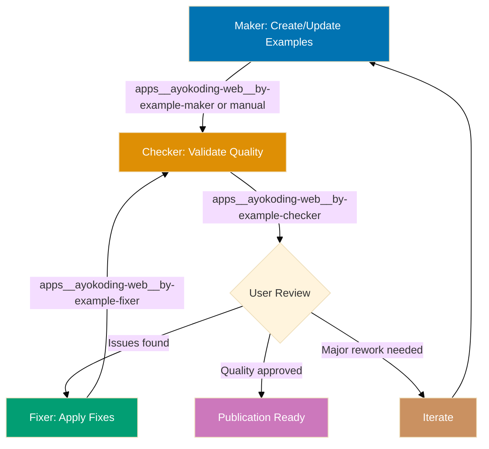
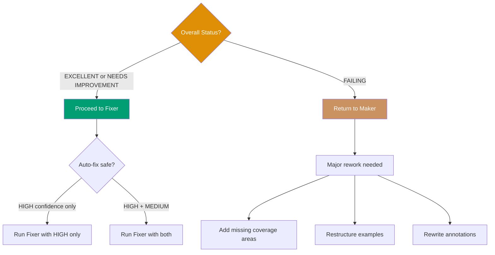
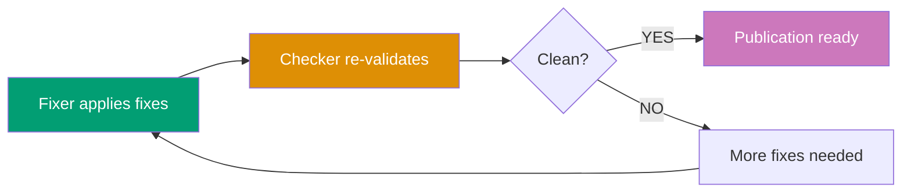

# AyoKoding Content By-Example Quality Gate Workflow

**Purpose**: Validate and improve by-example tutorial quality through iterative checking and fixing until tutorials achieve 95% coverage with 75-90 self-contained, annotated examples.

**When to use**:

- After creating or updating by-example tutorials
- Before publishing by-example content to ayokoding-web
- When migrating tutorials from 90% to 95% coverage standard
- After adding new examples or diagrams to existing tutorials
- Periodically to ensure tutorial quality remains high

This workflow implements the **Maker-Checker-Fixer pattern** to ensure by-example tutorials meet quality standards before publication.

## Workflow Overview



## Steps

### 1. Maker - Create/Update Examples (Manual/AI-Assisted)

**Objective**: Create or update by-example tutorial content

**Approaches**:

**Option A: Manual creation** (human author)

- Write examples following [By-Example Tutorial Convention](../conventions/ex-co__by-example-tutorial.md)
- Focus on educational value and code quality
- Don't worry about perfect compliance (checker will catch issues)

**Option B: AI-assisted creation** (docs-tutorial-maker or future by-example-maker)

- Use docs-tutorial-maker with by-example specifications
- Generate initial examples based on language/framework
- Human review and refinement

**Outputs**:

- Tutorial files: overview.md, beginner.md, intermediate.md, advanced.md
- 75-90 examples across three levels
- Mermaid diagrams where appropriate
- Educational annotations and comments

**Next step**: Proceed to step 2

### 2. Checker - Validate Quality (Sequential)

**Objective**: Identify gaps and issues against by-example standards

**Agent**: **apps**ayokoding-web**by-example-checker**

**Execution**:

```bash
# Invoke via Task tool
subagent_type: apps__ayokoding-web__by-example-checker
prompt: "Validate apps/ayokoding-web/content/en/learn/software-engineering/programming-language/golang/tutorials/by-example/ for compliance with by-example standards"
```

**Validation areas**:

1. **Coverage and count**: 95% coverage, 75-90 examples
2. **Self-containment**: Copy-paste-runnable within chapter scope
3. **Annotations**: `// =>` notation for outputs and states
4. **Diagrams**: 30-50% frequency, color-blind palette
5. **Format**: Four-part structure (explanation, diagram, code, takeaway)
6. **Frontmatter**: Complete and correct

**Outputs**:

- Audit report: `generated-reports/by-example-checker__{timestamp}__audit.md`
- Executive summary with overall status
- Detailed findings with confidence levels
- Specific line numbers for issues
- Actionable recommendations

**Depends on**: Step 1 completion

**Next step**: Proceed to step 3

### 3. User Review (Manual Decision Point)

**Objective**: Human decision on validation findings

**User actions**:

**1. Read audit report** from generated-reports/

**2. Assess overall status**:

- ✅ **EXCELLENT**: Minor issues only, proceed to fixer
- ⚠️ **NEEDS IMPROVEMENT**: Medium issues, proceed to fixer for mechanical fixes
- ❌ **FAILING**: Major issues, return to maker for rework

**3. Review confidence levels**:

- **HIGH confidence**: Trust findings, approve auto-fix
- **MEDIUM confidence**: Review specific examples, approve if valid
- **FALSE POSITIVE risk**: Decide whether to keep current design or fix

**4. Make decision**:



**Decision matrix**:

| Status            | HIGH Conf Issues | MEDIUM Conf Issues | Action                                 |
| ----------------- | ---------------- | ------------------ | -------------------------------------- |
| EXCELLENT         | 0-5              | 0-10               | Run fixer (all)                        |
| NEEDS IMPROVEMENT | 5-15             | 10-30              | Run fixer (HIGH only or review MEDIUM) |
| FAILING           | 15+              | 30+ or Major gaps  | Return to maker                        |

**Depends on**: Step 2 completion

**Next step**:

- If approved → Proceed to step 4
- If failing → Return to step 1

### 4. Fixer - Apply Validated Fixes (Sequential, Conditional)

**Objective**: Automatically apply safe, validated improvements

**Agent**: **apps**ayokoding-web**by-example-fixer**

**Execution**:

```bash
# Invoke via Task tool with audit report
subagent_type: apps__ayokoding-web__by-example-fixer
prompt: "Apply fixes from generated-reports/by-example-checker__2025-12-25--14-30__audit.md"
```

**Fix application strategy**:

**HIGH confidence fixes** (auto-apply):

- Add missing imports
- Fix color palette violations
- Add frontmatter fields
- Fix incorrect weights
- Add example numbering

**MEDIUM confidence fixes** (re-validate first):

- Add `// =>` annotations
- Add missing key takeaways
- Condense verbose explanations
- Add diagrams (verify necessity)

**FALSE POSITIVE risks** (report to user):

- Example count adjustments (requires content creation)
- Diagram frequency changes (requires visual design)
- Self-containment violations (may be intentional pedagogy)

**Outputs**:

- Modified tutorial files with fixes applied
- Fix report: `generated-reports/by-example-fixer__{timestamp}__fixes-applied.md`
- List of deferred issues requiring user decision

**Depends on**: Step 3 approval

**Success criteria**: Fixer successfully applies fixes without errors.

**On failure**: Log errors, proceed to re-validation anyway.

**Next step**: Proceed to step 5

### 5. Iteration Control (Sequential)

Determine whether to continue fixing or finalize.

**Logic**:

- Re-run checker (step 2) to get fresh report
- Count ALL findings (HIGH, MEDIUM) across new report
- If findings = 0 AND iterations >= min-iterations (or min not provided): Proceed to step 6 (Finalization)
- If findings = 0 AND iterations < min-iterations: Loop back to step 3 (need more iterations)
- If findings > 0 AND max-iterations provided AND iterations >= max-iterations: Proceed to step 6 with status `needs-improvement`
- If findings > 0 AND (max-iterations not provided OR iterations < max-iterations): Loop back to step 3

**Depends on**: Step 4 completion

**Notes**:

- **Default behavior**: Runs indefinitely until zero findings (no max-iterations limit)
- **Optional min-iterations**: Prevents premature termination before sufficient iterations
- **Optional max-iterations**: Prevents infinite loops when explicitly provided
- Each iteration gets fresh validation report
- Tracks iteration count and finding trends

**Iteration diagram**:



### 6. Finalization (Sequential)

Report final status and summary.

**Output**: `{final-status}`, `{iterations-completed}`, `{examples-count}`, `{coverage-percentage}`, final reports

**Status determination**:

- **Excellent** (`excellent`): Zero findings after final validation, 75-90 examples, 95% coverage achieved
- **Needs Improvement** (`needs-improvement`): Findings remain after max-iterations OR below example/coverage targets
- **Failing** (`failing`): Major structural issues prevent auto-fixing, requires maker rework

**Depends on**: Step 5 completion

## Termination Criteria

- ✅ **Success** (`excellent`): Zero findings, 75-90 examples, 95% coverage achieved
- ⚠️ **Partial** (`needs-improvement`): Findings remain OR example count/coverage below targets after max-iterations
- ❌ **Failure** (`failing`): Major structural issues require maker rework, auto-fixing not applicable

## Iteration Examples

### Example 1: New By-Example Tutorial (Clean Path)

**Scenario**: Creating Go by-example tutorial from scratch

**Step 1: Maker** (manual creation)

- Author writes 60 examples across 3 levels
- Includes code, some annotations, few diagrams
- Saves to golang/tutorials/by-example/

**Step 2: Checker** (validation)

```bash
apps__ayokoding-web__by-example-checker validates golang by-example
```

**Results**:

- 60 examples (target: 75-90) ⚠️
- Self-containment: 90% ✅
- Annotations: 70% coverage ⚠️
- Diagrams: 20% frequency ⚠️
- Status: **NEEDS IMPROVEMENT**

**Step 3: User Review**

- Reviews audit report
- Approves HIGH confidence fixes
- Approves MEDIUM confidence annotation additions
- Defers diagram additions (will add manually)
- Defers example count increase (needs content planning)

**Step 4: Fixer** (apply fixes)

```bash
apps__ayokoding-web__by-example-fixer applies fixes from audit
```

**Fixes applied**:

- Added 5 missing imports (HIGH)
- Added 45 `// =>` annotations (MEDIUM, re-validated)
- Fixed 3 color violations (HIGH)
- Added 2 missing key takeaways (MEDIUM)

**Step 5: Re-validation**

```bash
apps__ayokoding-web__by-example-checker re-validates
```

**Results**:

- Self-containment: 100% ✅
- Annotations: 95% coverage ✅
- Diagrams: 20% (deferred) ⚠️
- Example count: 60 (deferred) ⚠️
- Status: **EXCELLENT** (remaining issues are user decisions)

**Outcome**: Publication ready with notes to add diagrams and examples incrementally

### Example 2: Updating Existing Tutorial (Issue Path)

**Scenario**: Updating Elixir by-example with new language features

**Step 1: Maker** (add 10 new examples)

- Author adds 10 examples for Elixir 1.17 features
- Brings total to 70 examples
- Focused on code, minimal annotations

**Step 2: Checker**

```bash
apps__ayokoding-web__by-example-checker validates elixir by-example
```

**Results**:

- 70 examples (target: 75-90) ⚠️
- New examples missing imports ❌
- New examples no annotations ❌
- Status: **NEEDS IMPROVEMENT**

**Step 3: User Review**

- Approves all HIGH + MEDIUM fixes
- Wants to add 5-10 more examples later

**Step 4: Fixer**

```bash
apps__ayokoding-web__by-example-fixer applies fixes
```

**Fixes applied**:

- Added 10 missing imports (HIGH)
- Added 85 annotations to new examples (MEDIUM)
- Added 3 key takeaways (MEDIUM)

**Step 5: Re-validation**

```bash
apps__ayokoding-web__by-example-checker re-validates
```

**Results**:

- 70 examples ⚠️ (still below target, deferred)
- All other metrics ✅
- Status: **EXCELLENT**

**Outcome**: Published with plan to add 5-10 examples in next iteration

### Example 3: Major Rework (Failing Path)

**Scenario**: Java by-example audit reveals major issues

**Step 1: Checker** (initial validation)

```bash
apps__ayokoding-web__by-example-checker validates java by-example
```

**Results**:

- 45 examples (target: 75-90) ❌ MAJOR GAP
- Coverage: 60% (target: 95%) ❌ MAJOR GAP
- Self-containment: 40% ❌ MAJOR ISSUE
- Status: **FAILING**

**Step 2: User Review**

- Audit shows tutorial not ready for fixer
- Missing 30-45 examples for 95% coverage
- Most examples not self-contained
- Decision: **Return to Maker**

**Step 3: Maker** (major rework)

- Author analyzes missing coverage areas
- Plans 35 new examples across levels
- Rewrites existing examples for self-containment
- Takes 2-3 weeks

**Step 4: Checker** (re-validation after rework)

```bash
apps__ayokoding-web__by-example-checker re-validates
```

**Results**:

- 80 examples ✅
- Coverage: 90% ⚠️ (close to target)
- Self-containment: 85% ⚠️
- Status: **NEEDS IMPROVEMENT**

**Step 5: User Review**

- Much better, proceed to fixer

**Step 6: Fixer** (apply remaining fixes)

- Fixes self-containment issues
- Adds missing annotations

**Step 7: Re-validation**

- Status: **EXCELLENT**

**Outcome**: Published after major rework and iteration

## Workflow Invocation

### Manual Invocation (Step-by-Step)

**User controls each phase**:

```bash
# Phase 1: Create content (manual or AI-assisted)
# User writes examples

# Phase 2: Validate
subagent_type: apps__ayokoding-web__by-example-checker
prompt: "Validate golang by-example tutorial"

# Phase 3: Review
# User reads generated-reports/by-example-checker__*.md

# Phase 4: Fix
subagent_type: apps__ayokoding-web__by-example-fixer
prompt: "Apply fixes from [audit report path]"

# Phase 5: Re-validate
subagent_type: apps__ayokoding-web__by-example-checker
prompt: "Re-validate golang by-example"

# Repeat Phases 4-5 until clean (or set max-iterations to limit)
```

### Automated Invocation (Future Enhancement)

**Single command triggers full workflow**:

```bash
# Not yet implemented - future workflow automation
subagent_type: apps__ayokoding-web__by-example-quality-gate
prompt: "Run complete quality gate for golang by-example"

# Would orchestrate:
# 1. checker → audit
# 2. user review → decision
# 3. fixer → apply
# 4. checker → re-validate
# 5. repeat until clean
```

## Safety Features

**Infinite Loop Prevention**:

- Optional max-iterations parameter (no default - runs until zero findings)
- When provided, workflow terminates with `needs-improvement` if limit reached
- Tracks iteration count and finding trends
- Use max-iterations when fix convergence is uncertain

**False Positive Protection**:

- Fixer re-validates findings before applying
- Skips FALSE_POSITIVE findings automatically
- Progressive writing ensures audit history survives

**Error Recovery**:

- Continues to finalization even if fixer partially fails
- Reports which fixes succeeded/failed
- Generates final reports regardless of status

**User Control**:

- Auto-fix-level parameter controls automation degree
- Manual decision points at user review step
- Can abort and return to maker for major rework

## Success Metrics

Track across executions:

- **Average iterations to completion**: How many cycles typically needed for EXCELLENT status
- **Success rate**: Percentage reaching zero findings and coverage targets
- **Common issues**: What problems appear most frequently (imports, annotations, diagrams)
- **Fix success rate**: Percentage of fixes applied without errors
- **Tutorial improvement velocity**: Example count and coverage increase per iteration

## Related Workflows

This workflow is part of the **Tutorial Quality Family**:

- **[Maker-Checker-Fixer Pattern](../development/ex-de__maker-checker-fixer-pattern.md)**: General pattern
- **docs-tutorial workflow**: General tutorial validation
- **ayokoding-web-by-example-quality-gate** (this workflow): Specialized for by-example tutorials
- **ayokoding-web workflow**: Hugo content validation

## Notes

- **User-driven**: Requires manual decision points (user review), not fully automated
- **Iterative**: Multiple checker-fixer cycles until quality achieved
- **Bounded**: Max-iterations prevents runaway execution
- **Observable**: Generates detailed audit and fix reports
- **Flexible**: Auto-fix-level parameter controls automation degree
- **Focused**: Specialized for by-example tutorials only (not general tutorials)

## Principles Respected

- ✅ **Explicit Over Implicit**: All steps, decisions, and criteria are explicit
- ✅ **Automation Over Manual**: Automated validation and fixing where safe
- ✅ **Quality Over Speed**: Iterative refinement until excellent
- ✅ **Convention Over Configuration**: Standardized by-example validation criteria
- ✅ **Simplicity Over Complexity**: Clear flow despite maker-checker-fixer complexity
- ✅ **Progressive Disclosure**: Can adjust iteration limits and auto-fix levels

## Related Documentation

- **[By-Example Tutorial Convention](../conventions/ex-co__by-example-tutorial.md)**: Quality standards
- **[Maker-Checker-Fixer Pattern](../development/ex-de__maker-checker-fixer-pattern.md)**: Workflow pattern
- **[Fixer Confidence Levels](../development/ex-de__fixer-confidence-levels.md)**: Confidence assessment
- **[apps**ayokoding-web**by-example-checker agent](../../.claude/agents/apps__ayokoding-web__by-example-checker.md)**: Validation agent
- **[apps**ayokoding-web**by-example-fixer agent](../../.claude/agents/apps__ayokoding-web__by-example-fixer.md)**: Fixing agent
- **[apps**ayokoding-web**by-example-maker agent](../../.claude/agents/apps__ayokoding-web__by-example-maker.md)**: Content creation agent
