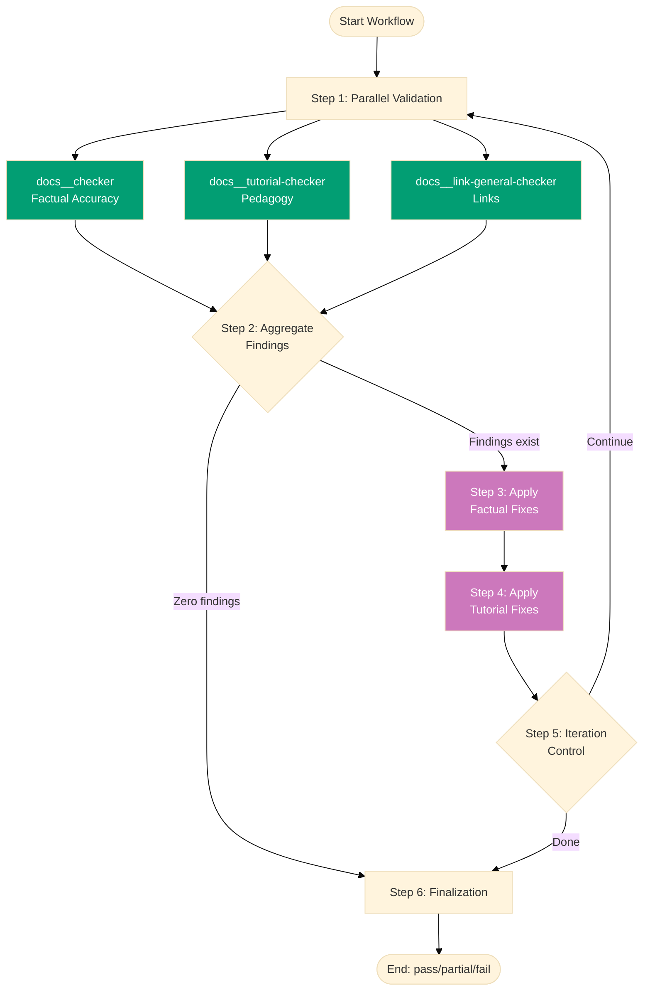

# Documentation Quality Gate Workflow

**Purpose**: Comprehensively validate all documentation content (factual accuracy, pedagogical structure, link validity), apply fixes iteratively until all issues are resolved.

**When to use**:

- After creating or updating documentation
- Before major releases or deployments
- Periodically to ensure documentation quality and accuracy
- After bulk documentation changes or restructuring
- When migrating or refactoring documentation

This workflow implements the **Maker-Checker-Fixer pattern** across three validation dimensions to ensure comprehensive documentation quality before publication.

## Workflow Overview



## Steps

### 1. Parallel Validation (Parallel)

Run all documentation validators concurrently to identify all issues across different quality dimensions.

**Agent 1a**: `docs__checker`

- **Args**: `scope: {input.scope}, EXECUTION_SCOPE: docs`
- **Output**: `{docs-report-N}` - Factual accuracy, technical correctness, contradictions

**Agent 1b**: `docs__tutorial-checker`

- **Args**: `scope: {input.scope}, EXECUTION_SCOPE: docs`
- **Output**: `{tutorial-report-N}` - Pedagogical structure, narrative flow, visual completeness

**Agent 1c**: `docs__link-general-checker`

- **Args**: `scope: {input.scope}, EXECUTION_SCOPE: docs`
- **Output**: `{links-report-N}` - Internal/external link validation, cache management

**Success criteria**: All three checkers complete and generate audit reports.

**On failure**: Terminate workflow with status `fail`.

**Notes**:

- All checkers run in parallel (up to max-concurrency) for efficiency
- Each generates independent audit report in `generated-reports/`
- UUID chain scope = "docs" (execution-chain-docs)
- Tutorial-checker gracefully handles non-tutorial files
- Reports use progressive writing to survive context compaction

### 2. Aggregate Findings (Sequential)

Analyze all audit reports to determine if fixes are needed.

**Condition Check**: Count findings based on mode level across all three reports

**Mode-Based Counting**:

- **lax**: Count CRITICAL only
- **normal**: Count CRITICAL + HIGH (default)
- **strict**: Count CRITICAL + HIGH + MEDIUM
- **ocd**: Count all levels (CRITICAL, HIGH, MEDIUM, LOW)

**Below-threshold findings**: Reported but don't block success

- **lax**: HIGH/MEDIUM/LOW reported, not counted
- **normal**: MEDIUM/LOW reported, not counted
- **strict**: LOW reported, not counted
- **ocd**: All findings counted

**Decision**:

- If threshold-level findings > 0: Proceed to step 3
- If threshold-level findings = 0: Skip to step 6 (Success)

**Depends on**: Step 1 completion

**Notes**:

- Combines findings from all three validation dimensions
- Fix scope determined by mode level
- Below-threshold findings remain visible in audit reports
- Enables progressive quality improvement
- **Link-checker findings count toward total** (blocks success if broken links exist)

### 3. Apply Factual Fixes (Sequential, Conditional)

Fix factual errors, outdated information, technical inaccuracies, and contradictions.

**Agent**: `docs__fixer`

- **Args**: `report: {step1.outputs.docs-report-N}, approved: all, mode: {input.mode}`
- **Output**: `{factual-fixes-applied}` - Fix report with same UUID chain as source audit
- **Condition**: Factual findings exist from step 2
- **Depends on**: Step 2 completion

**Success criteria**: Fixer successfully applies factual fixes without errors.

**On failure**: Log errors, continue to step 4.

**Notes**:

- Re-validates findings before applying (prevents false positives)
- Uses web verification for technical claims
- **Fix scope based on mode**:
  - **lax**: Fix CRITICAL only (skip HIGH/MEDIUM/LOW)
  - **normal**: Fix CRITICAL + HIGH (skip MEDIUM/LOW)
  - **strict**: Fix CRITICAL + HIGH + MEDIUM (skip LOW)
  - **ocd**: Fix all levels (CRITICAL, HIGH, MEDIUM, LOW)
- Below-threshold findings remain untouched
- Preserves documentation intent while ensuring accuracy

### 4. Apply Pedagogical Fixes (Sequential, Conditional)

Fix pedagogical issues, tutorial structure problems, narrative flow issues, and visual completeness gaps.

**Agent**: `docs__tutorial-fixer`

- **Args**: `report: {step1.outputs.tutorial-report-N}, approved: all, mode: {input.mode}`
- **Output**: `{tutorial-fixes-applied}` - Fix report with same UUID chain as source audit
- **Condition**: Tutorial findings exist from step 2
- **Depends on**: Step 3 completion

**Success criteria**: Fixer successfully applies tutorial fixes without errors.

**On failure**: Log errors, proceed to step 5.

**Notes**:

- Runs AFTER docs-fixer (sequential to avoid conflicts)
- Handles subjective tutorial issues carefully
- Only fixes objective, verifiable pedagogical issues
- Respects mode parameter for fix scoping
- Preserves educational narrative and learning objectives

### 5. Iteration Control (Sequential)

Determine whether to continue fixing or finalize.

**Logic**:

- Re-run all checkers (step 1) to get fresh reports
- Count findings based on mode level (same as Step 2):
  - **lax**: Count CRITICAL only
  - **normal**: Count CRITICAL + HIGH
  - **strict**: Count CRITICAL + HIGH + MEDIUM
  - **ocd**: Count all levels
- If threshold-level findings = 0 AND iterations >= min-iterations (or min not provided): Proceed to step 6 (Success)
- If threshold-level findings = 0 AND iterations < min-iterations: Loop back to step 3 (need more iterations)
- If threshold-level findings > 0 AND max-iterations provided AND iterations >= max-iterations: Proceed to step 6 (Partial)
- If threshold-level findings > 0 AND (max-iterations not provided OR iterations < max-iterations): Loop back to step 3

**Below-threshold findings**: Continue to be reported in audit but don't affect iteration logic

**Depends on**: Step 4 completion

**Notes**:

- **Default behavior**: Runs indefinitely until zero threshold-level findings (no max-iterations limit)
- **Optional min-iterations**: Prevents premature termination before sufficient iterations
- **Optional max-iterations**: Prevents infinite loops when explicitly provided
- Each iteration uses the latest audit reports from all validators
- Tracks iteration count for observability
- **Broken links block zero-finding achievement** (no auto-fix available)

### 6. Finalization (Sequential)

Report final status and summary.

**Output**: `{final-status}`, `{iterations-completed}`, `{final-report}`

**Status determination**:

- **Success** (`pass`): Zero threshold-level findings across all validators
- **Partial** (`partial`): Findings remain after max-iterations OR broken links exist
- **Failure** (`fail`): Technical errors during check or fix

**Depends on**: Reaching this step from step 2, 4, or 5

**Notes**:

- Below-threshold findings are reported in final audit but don't prevent success status
- **Broken links always result in `partial` status** (manual intervention required)
- Generates comprehensive summary across all three validation dimensions

## Termination Criteria

**Success** (`pass`):

- **lax**: Zero CRITICAL findings (HIGH/MEDIUM/LOW may exist)
- **normal**: Zero CRITICAL/HIGH findings (MEDIUM/LOW may exist)
- **strict**: Zero CRITICAL/HIGH/MEDIUM findings (LOW may exist)
- **ocd**: Zero findings at all levels

**Requires**: Zero threshold-level findings across ALL three validators (docs, tutorial, links)

**Partial** (`partial`):

- Threshold-level findings remain after max-iterations safety limit
- **Broken links exist** (no fixer available - manual intervention required)
- Some fixers failed to apply changes

**Failure** (`fail`):

- Technical errors during validation
- System failures during execution

**Note**: Below-threshold findings are reported in final audit but don't prevent success status.

## Example Usage

### Standard Check-Fix (Normal Strictness)

```bash
# Run full documentation check-fix with default settings
# Fixes CRITICAL/HIGH only, reports MEDIUM/LOW
workflow run docs__quality-gate

# Equivalent explicit form
workflow run docs__quality-gate --mode=normal
```

### Quick Critical-Only Check (Lax Mode)

```bash
# Fixes CRITICAL only, reports HIGH/MEDIUM/LOW
workflow run docs__quality-gate --mode=lax

# Success criteria: Zero CRITICAL findings
# HIGH/MEDIUM/LOW findings reported but don't block
```

### Pre-Release Validation (Strict)

```bash
# Fixes CRITICAL/HIGH/MEDIUM, reports LOW
workflow run docs__quality-gate --mode=strict

# Success criteria: Zero CRITICAL/HIGH/MEDIUM findings
# LOW findings reported but don't block
```

### Comprehensive Audit (OCD)

```bash
# Fixes all levels, zero tolerance
workflow run docs__quality-gate --mode=ocd

# Success criteria: Zero findings at all levels
# Equivalent to pre-mode parameter behavior
```

### Validate Specific Scope

```bash
# Validate only tutorials
workflow run docs__quality-gate --scope=docs/tutorials/

# Validate specific file
workflow run docs__quality-gate --scope=docs/explanation/conventions/ex-co__file-naming-convention.md
```

### With Iteration Bounds

```bash
# Require at least 2 iterations, cap at 10 maximum
workflow run docs__quality-gate \
  --mode=normal \
  --min-iterations=2 \
  --max-iterations=10
```

### Fast Parallel Execution

```bash
# Allow all 3 checkers to run simultaneously
workflow run docs__quality-gate --max-concurrency=3
```

## Iteration Example

Typical execution flow:

```
Iteration 1:
  Parallel Check (3 validators) → 18 total findings
    - Factual: 8 CRITICAL/HIGH findings
    - Tutorial: 6 CRITICAL/HIGH findings
    - Links: 4 broken links
  Sequential Fix → Factual → Tutorial
  Re-check → 4 findings remain (links unfixable)

Iteration 2:
  Parallel Check → 4 findings (all link-related)
  Sequential Fix → Factual (0 new) → Tutorial (0 new)
  Re-check → 4 findings remain

Result: PARTIAL (broken links require manual intervention)

After manual link fixes:

Iteration 3:
  Parallel Check → 0 findings

Result: SUCCESS (3 iterations)
```

## Safety Features

**Infinite Loop Prevention**:

- Optional max-iterations parameter (no default - runs until zero findings)
- When provided, workflow terminates with `partial` if limit reached
- Tracks iteration count for monitoring
- Use max-iterations when fix convergence is uncertain

**False Positive Protection**:

- Fixers re-validate each finding before applying
- Skips FALSE_POSITIVE findings automatically
- Progressive writing ensures audit history survives

**Error Recovery**:

- Continues to verification even if some fixes fail
- Reports which fixes succeeded/failed
- Generates final report regardless of status

**Mode-Based Progressive Improvement**:

- Start with `mode=lax` for critical issues only
- Progress to `mode=normal` for daily quality
- Use `mode=strict` for pre-release validation
- Apply `mode=ocd` for zero-tolerance requirements

## Validation Dimensions

**Factual Accuracy** (docs\_\_checker):

- Technical correctness using web verification
- Command syntax and flags validation
- Version information accuracy
- Code example API correctness
- Contradiction detection within/across documents
- Outdated information identification
- Mathematical notation validation
- Diagram color accessibility (color-blind palette)

**Pedagogical Quality** (docs\_\_tutorial-checker):

- Tutorial structure and type compliance
- Narrative flow and story arc
- Learning scaffold progression
- Visual completeness (diagrams at 30-50% frequency)
- Hands-on elements (examples, exercises, actionable steps)
- Writing style and engagement
- **Time estimate detection** (forbidden in educational content)
- Color-blind friendly diagrams
- LaTeX delimiter correctness

**Link Validity** (docs\_\_link-general-checker):

- External URL accessibility (HTTP status codes)
- Internal file reference validity
- Markdown extension presence (.md required)
- Redirect chain tracking
- **Cache management** (docs/metadata/external-links-status.yaml)
- Per-link expiry (6 months individual)
- **NO AUTO-FIX AVAILABLE** - Broken links block success, require manual intervention

## Edge Cases

### Case 1: Only Tutorial-Checker Finds Issues

**Scenario**: Factual and link validators pass, tutorial validator reports findings

**Handling**:

- Step 3 skipped (no factual findings)
- Step 4 runs (tutorial fixer applies fixes)
- Re-validate confirms success across all dimensions

### Case 2: Broken Links Block Success

**Scenario**: Factual and tutorial issues fixed, but link-checker reports broken links

**Handling**:

- No fixer available for links (link-checker reports only)
- Threshold-level findings > 0 (broken links count)
- Max-iterations reached → Status `partial`
- User must manually fix broken links
- Re-run workflow after manual fixes

**Mitigation**:

- Document broken link locations clearly in audit report
- Provide file paths and line numbers for manual fixes
- Recommend running link-checker separately before workflow

### Case 3: Below-Threshold Findings Only

**Scenario**: Mode=normal, but only MEDIUM/LOW findings exist

**Handling**:

- Only CRITICAL/HIGH counted toward threshold
- MEDIUM/LOW reported but don't block
- Fixers skip MEDIUM/LOW (not in scope)
- Success achieved with documented below-threshold issues
- User can re-run with stricter mode if desired

### Case 4: Non-Converging Fixes

**Scenario**: Fixes introduce new issues, findings never reach zero

**Handling**:

- Each iteration tracks finding trends
- Max-iterations reached → Status `partial`
- Report lists remaining issues for investigation
- May indicate fundamental content problems requiring maker intervention

### Case 5: Tutorial-Checker on Non-Tutorial Content

**Scenario**: Tutorial-checker validates reference or how-to documents

**Handling**:

- Tutorial-checker gracefully handles non-tutorial files
- Skips tutorial-specific checks (story arc, scaffold progression)
- Applies universal checks (writing quality, diagram colors, time estimates)
- No false positives from tutorial structure expectations

## Related Workflows

This workflow can be composed with:

- **Repository Rules Quality Gate** (`wow__rules__quality-gate`) - Validate after docs changes affect repository consistency
- Deployment workflows - Validate before deploying documentation sites
- Content creation workflows - Validate after bulk documentation creation
- Migration workflows - Ensure quality during documentation restructuring

## Success Metrics

Track across executions:

- **Average iterations to completion**: How many cycles typically needed
- **Success rate**: Percentage reaching zero findings vs partial/fail
- **Findings by dimension**: Which validators find most issues (factual, pedagogical, links)
- **Fix success rate**: Percentage of fixes applied without errors
- **Common issue categories**: What problems appear most frequently
- **Broken link frequency**: How often manual intervention required

## Notes

- **Three-dimensional validation**: Ensures comprehensive documentation quality
- **Parallel validation**: Efficient checking across all dimensions (up to max-concurrency)
- **Sequential fixing**: Manages dependencies between fixers (factual → tutorial)
- **Mode-based flexibility**: Progressive quality improvement (lax → normal → strict → ocd)
- **Idempotent**: Safe to run multiple times without side effects
- **Observable**: Generates detailed audit reports for each validation dimension
- **Bounded**: Max-iterations prevents runaway execution
- **Link limitation**: Broken links require manual intervention (no auto-fix available)

**Concurrency**: Currently validates in parallel (up to max-concurrency) and fixes sequentially. The `max-concurrency` parameter controls parallel checker execution.

**Best Practice**: Run link-checker separately first (`docs__link-general-checker` agent) to fix broken links before running full quality gate. This prevents workflow from blocking on unfixable link issues.

This workflow ensures comprehensive documentation quality through multi-dimensional validation, iterative fixing, and mode-based progressive improvement.

## Principles Respected

- ✅ **Explicit Over Implicit**: All steps, conditions, and termination criteria are explicit
- ✅ **Automation Over Manual**: Fully automated validation and fixing (except broken links)
- ✅ **Simplicity Over Complexity**: Clear linear flow with mode-based scoping
- ✅ **Accessibility First**: Generates human-readable audit reports, validates color-blind diagrams
- ✅ **Progressive Disclosure**: Can run with different modes and iteration limits
- ✅ **No Time Estimates**: Focus on quality outcomes, not duration
