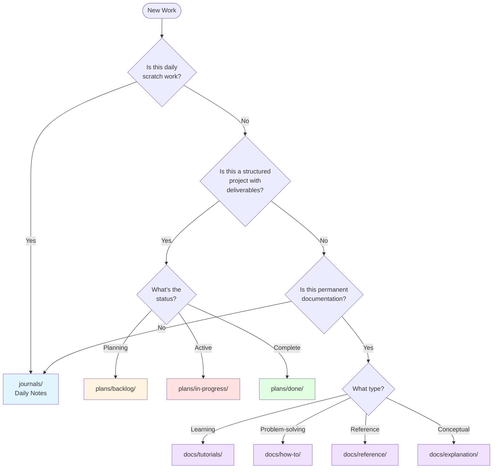

# How to Organize Your Work

## Problem

You're starting new work and need to know: **Where should I put this?** Should it go in `journals/`, `plans/`, or `docs/`?

This guide helps you choose the right location based on the type and lifecycle of your work.

## Quick Decision Tree



## The Three Work Folders

### docs/ - Permanent Documentation

**Purpose:** Long-term, structured documentation using the [Diátaxis framework](../explanation/conventions/ex-co__diataxis-framework.md)

**Key Characteristics:**

- **Lifecycle:** Permanent, evolves over time
- **Structure:** Four categories (tutorials, how-to, reference, explanation)
- **File Naming:** Requires prefixes (`tu__`, `ht__`, `re__`, `ex__`)
- **Diagram Format:** Mermaid (inside Obsidian vault)
- **Audience:** Anyone who needs to understand, learn, or reference the project

**Subfolders:**

- `tutorials/` - Learning-oriented step-by-step guides
- `how-to/` - Problem-solving guides (like this one!)
- `reference/` - Technical reference material
- `explanation/` - Conceptual understanding

### plans/ - Project Planning

**Purpose:** Temporary, ephemeral project planning and tracking documents

**Key Characteristics:**

- **Lifecycle:** Temporary, moves between states, archived when done
- **Structure:** Three states (backlog, in-progress, done) plus ideas.md for quick captures
- **File Naming:** NO prefixes inside plan folders; folder names use `YYYY-MM-DD__[identifier]`
- **Diagram Format:** ASCII art (outside Obsidian vault)
- **Audience:** Project team, stakeholders tracking progress

**Root Level:**

- `ideas.md` - Quick 1-3 liner ideas not yet formalized into plans

**Subfolders:**

- `backlog/` - Planned projects waiting to start
- `in-progress/` - Active projects being worked on
- `done/` - Completed and archived projects

**Standard Plan Files (inside plan folders):**

- `README.md` - Plan overview
- `requirements.md` - Requirements and objectives
- `tech-docs.md` - Technical documentation
- `delivery.md` - Timeline and milestones

See [CLAUDE.md Plans Organization](../../CLAUDE.md#plans-organization) for full details.

### docs/journals/ - Daily Notes

**Purpose:** Daily research notes and monthly summaries using Logseq-style outliner format

**Key Characteristics:**

- **Lifecycle:** Ongoing, date-based, never deleted
- **Structure:** Monthly folders with daily files (`YYYY-MM/YYYY-MM-DD.md`)
- **File Naming:** Special date format (no prefixes)
- **Format:** Logseq-style outliner (bullet-based, only `# YYYY-MM-DD` heading)
- **Diagram Format:** Mermaid (inside Obsidian vault)
- **Audience:** Personal use, team communication, temporal record

**Format Details:** Unlike formal documentation which uses traditional markdown structure (multiple headings, paragraphs), journals use bullet-based outliner format optimized for quick capture and progressive thinking. See [Journals Format Convention](../explanation/conventions/ex-co__journals-format.md).

**What Goes Here:**

- Daily research notes
- Work logs and progress tracking
- Meeting notes
- Brainstorming sessions
- Quick ideas and explorations
- Temporary thoughts that might evolve

## When to Use Each Folder

### Use journals/ when you're:

✅ **Brainstorming** - Exploring ideas without structure
✅ **Taking daily notes** - Logging what you worked on today
✅ **Recording meetings** - Capturing discussions and decisions
✅ **Sketching ideas** - Early-stage exploration
✅ **Writing scratch notes** - Temporary thoughts and reminders
✅ **Doing research** - Gathering information before structuring it

**Example:** "I want to brainstorm ideas for our brand identity" → `journals/2025-11/2025-11-24.md`

### Use plans/ when you're:

✅ **Capturing quick ideas** - 1-3 liner todos for potential projects → `plans/ideas.md`
✅ **Planning a feature** - Structured project with requirements and timeline → `plans/backlog/`
✅ **Organizing a sprint** - Time-boxed work with deliverables
✅ **Designing a system** - Technical planning with architecture decisions
✅ **Tracking a project** - Work that moves through stages (backlog → in-progress → done)
✅ **Creating specifications** - Detailed requirements for implementation
✅ **Managing initiatives** - Strategic projects with clear outcomes

**Examples:**

- "Quick idea: Add OAuth2 authentication" → `plans/ideas.md`
- "I want to plan the monorepo migration" → `plans/backlog/2025-11-24__init-monorepo/`

### Use docs/ when you're:

✅ **Writing a tutorial** - Teaching someone how to use something
✅ **Creating a how-to guide** - Solving a specific problem
✅ **Documenting APIs** - Reference material for developers
✅ **Explaining concepts** - Conceptual understanding of the system
✅ **Establishing conventions** - Project standards and guidelines
✅ **Recording decisions** - Architectural decision records (ADRs)

**Example:** "I want to document our authentication system" → `docs/explanation/ex-sys__authentication.md`

## Common Workflows

### Workflow 1: Quick Idea → Project Plan

**Scenario:** You have a quick idea for a feature but aren't ready for full planning yet.

**Steps:**

1. **Capture in plans/ideas.md** (Quick Capture Phase)

   ```markdown
   # Ideas

   - Add real-time notification system using WebSockets
   - Create admin dashboard for user management
   ```

   - One-liner or short description
   - No structure needed
   - Fast capture

2. **Promote to plans/backlog/** (When Ready for Planning)

   When the idea is ready for formal planning:

   ```
   plans/backlog/2025-11-25__notification-system/
   ├── README.md
   ├── requirements.md
   ├── tech-docs.md
   └── delivery.md
   ```

   - Create full plan structure
   - Define requirements and deliverables
   - Remove or check off the idea from ideas.md

3. **Move to in-progress/** (Execution Phase)

   ```
   mv plans/backlog/2025-11-25__notification-system/ plans/in-progress/
   ```

4. **Complete and archive**

   ```
   mv plans/in-progress/2025-11-25__notification-system/ plans/done/
   ```

### Workflow 2: Brandstorm → Project Plan

**Scenario:** You want to develop your brand identity.

**Steps:**

1. **Brainstorm in journals/** (Exploration Phase)

   ```
   journals/2025-11/2025-11-24.md
   ```

   - Free-form brainstorming
   - Collect inspiration and ideas
   - Sketch initial concepts
   - No structure required

2. **Create plan in plans/backlog/** (Planning Phase)

   ```
   plans/backlog/2025-11-24__brand-strategy/
   ├── README.md           # Overview of brand strategy
   ├── requirements.md     # Brand goals, target audience
   ├── tech-docs.md        # Brand guidelines, design systems
   └── delivery.md         # Timeline for brand development
   ```

   - Structure the ideas into a formal plan
   - Define requirements and deliverables
   - Set timeline and milestones

3. **Move to in-progress/** (Execution Phase)

   ```
   mv plans/backlog/2025-11-24__brand-strategy/ plans/in-progress/
   ```

   - Update README status to "In Progress"
   - Start working on deliverables

4. **Move to done/** (Completion Phase)

   ```
   mv plans/in-progress/2025-11-24__brand-strategy/ plans/done/
   ```

   - Update README status to "Done"
   - Archive for historical reference

5. **Document in docs/** (Optional - if creating permanent guidelines)

   ```
   docs/reference/re-br__brand-guidelines.md
   ```

   - Extract permanent brand guidelines from the plan
   - Create reference documentation for the team

### Workflow 2: Feature Development

**Scenario:** You're building a new authentication system.

**Steps:**

1. **Research in journals/**

   ```
   journals/2025-11/2025-11-24.md
   ```

   - Research authentication approaches
   - Compare OAuth vs JWT vs sessions
   - Note pros/cons

2. **Plan in plans/backlog/**

   ```
   plans/backlog/2025-11-25__auth-system/
   ```

   - Create structured plan with requirements
   - Define technical approach
   - Set delivery milestones

3. **Execute (move to in-progress/)**

   ```
   plans/in-progress/2025-11-25__auth-system/
   ```

   - Implement the feature
   - Update delivery.md with progress

4. **Document in docs/**

   ```
   docs/explanation/ex-sys__authentication.md  # How it works
   docs/how-to/ht__setup-auth.md              # How to use it
   docs/reference/re-api__auth-endpoints.md   # API reference
   ```

   - Create permanent documentation
   - Write tutorials for users
   - Document API for developers

5. **Archive plan**

   ```
   plans/done/2025-11-25__auth-system/
   ```

   - Move to done/ for historical record

### Workflow 3: Daily Work Pattern

**Typical Day:**

```
Morning:
1. Open journals/2025-11/2025-11-24.md
2. Log daily plan and goals
3. Note any ideas or thoughts

During Day:
4. Work on active plans in plans/in-progress/
5. Update plan delivery.md with progress
6. Jot meeting notes in today's journal

Evening:
7. Update journal with what was accomplished
8. Move completed plans to plans/done/
9. Create new plans in backlog/ for tomorrow
```

### Workflow 4: Documentation Pattern

**Scenario:** You want to document a new coding convention.

**Steps:**

1. **Draft in journals/** (Optional)

   ```
   journals/2025-11/2025-11-24.md
   ```

   - Sketch out the convention
   - Get feedback from team

2. **Create formal doc in docs/explanation/**

   ```
   docs/explanation/conventions/ex-co__new-convention.md
   ```

   - Write comprehensive explanation
   - Include examples and rationale
   - Follow [Diátaxis framework](../explanation/conventions/ex-co__diataxis-framework.md)

3. **Update CLAUDE.md** (If it affects project workflow)
   - Add reference to new convention
   - Link to the full documentation

## Moving Content Between Folders

### From journals/ to plans/

**When:** Your brainstorming has solidified into a concrete project with deliverables.

**How:**

1. Create new plan folder: `plans/backlog/YYYY-MM-DD__[project-name]/`
2. Structure ideas into `requirements.md`, `tech-docs.md`, `delivery.md`
3. Add link in journal entry to the new plan
4. Keep journal entry as historical record

**Example:**

```markdown
<!-- In journals/2025-11/2025-11-24.md -->

## Brandstorm Session

[Original brainstorming notes...]

**Update:** These ideas have been structured into a formal plan:
→ [Brand Strategy Plan](../../plans/backlog/2025-11-24__brand-strategy/)
```

### From plans/ to docs/

**When:** The project is complete and needs permanent documentation for ongoing reference.

**How:**

1. Identify what needs permanent documentation:
   - System architecture → `docs/explanation/`
   - Setup instructions → `docs/how-to/`
   - API specifications → `docs/reference/`
2. Create appropriate docs following [Diátaxis framework](../explanation/conventions/ex-co__diataxis-framework.md)
3. Link from plan README to the permanent docs
4. Move plan to `plans/done/` for archival

**Example:**

```markdown
<!-- In plans/done/2025-11-25__auth-system/README.md -->

## Permanent Documentation

This project is complete. See the following documentation:

- [Authentication System Explanation](../../docs/explanation/ex-sys__authentication.md)
- [How to Setup Auth](../../docs/how-to/ht__setup-auth.md)
- [Auth API Reference](../../docs/reference/re-api__auth-endpoints.md)
```

### From journals/ to docs/

**When:** Your notes contain insights that should be preserved as permanent documentation.

**How:**

1. Extract key insights from journal
2. Structure into appropriate doc type (tutorial, how-to, reference, explanation)
3. Follow [file naming convention](../explanation/conventions/ex-co__file-naming-convention.md)
4. Optionally link from journal to the new doc

**Note:** This is less common than journals → plans → docs workflow.

## Quick Reference Table

| If you're doing...                         | Use folder...        | Example                                         |
| ------------------------------------------ | -------------------- | ----------------------------------------------- |
| Daily scratch work                         | `journals/`          | Meeting notes, daily logs                       |
| Brainstorming ideas                        | `journals/`          | Brand identity brainstorm                       |
| Quick project ideas (1-3 liners)           | `plans/ideas.md`     | "Add OAuth2 authentication"                     |
| Planning a feature                         | `plans/backlog/`     | `2025-11-24__auth-system/`                      |
| Working on a project                       | `plans/in-progress/` | Move from backlog when starting                 |
| Archiving completed project                | `plans/done/`        | Move from in-progress when done                 |
| Writing a tutorial                         | `docs/tutorials/`    | `tu__getting-started.md`                        |
| Creating a how-to guide                    | `docs/how-to/`       | `ht__setup-dev-environment.md`                  |
| Documenting an API                         | `docs/reference/`    | `re-api__endpoints.md`                          |
| Explaining a concept                       | `docs/explanation/`  | `ex-sys__authentication.md`                     |
| Recording project conventions              | `docs/explanation/`  | `ex-co__naming-convention.md`                   |
| Research notes (temporary)                 | `journals/`          | Exploring different approaches                  |
| Research documentation (permanent)         | `docs/explanation/`  | Final decision and rationale                    |
| Sprint planning                            | `plans/backlog/`     | One plan per sprint goal                        |
| Technical specifications                   | `plans/` or `docs/`  | Plans if temporary, docs/ if permanent standard |
| Architecture Decision Records (ADRs)       | `docs/explanation/`  | `ex-adr__use-postgresql.md`                     |
| Project roadmap (current work)             | `plans/`             | Multiple plans in backlog/in-progress           |
| Project roadmap (historical documentation) | `docs/explanation/`  | Summary of completed work and direction         |

## Troubleshooting

### "I'm not sure if this should be temporary or permanent"

**Ask yourself:**

- Will this need to be referenced months/years from now? → `docs/`
- Is this specific to a time-bound project? → `plans/`
- Is this just for today/this week? → `journals/`

**Rule of thumb:** When in doubt, start in `journals/`. It's easier to promote content to `plans/` or `docs/` later than to demote it.

### "Should this be a plan or documentation?"

**Plans are for:**

- Time-bound projects with a beginning and end
- Work that moves through stages (backlog → in-progress → done)
- Project-specific requirements and deliverables
- Temporary planning artifacts

**Documentation is for:**

- Permanent reference material
- System explanations that don't change often
- Learning resources and how-to guides
- Standards and conventions

**Example:**

- "Building the auth system" → `plans/` (time-bound project)
- "How the auth system works" → `docs/explanation/` (permanent)
- "How to use auth in your code" → `docs/how-to/` (permanent)

### "I started in journals/, now it's becoming bigger"

**This is normal!** Follow the natural progression:

1. **Keep the journal entry** - It's a historical record of your thinking
2. **Promote to plans/** - If it's becoming a structured project
3. **Or promote to docs/** - If it's becoming permanent documentation
4. **Link between them** - Add links so you can trace the evolution

**Example:**

```markdown
<!-- In journals/2025-11/2025-11-24.md -->

## Initial Idea: Monorepo Migration

[Original notes...]

**Update 2025-11-25:** This is now a formal project:
→ [Monorepo Migration Plan](../../plans/in-progress/2025-11-24__init-monorepo/)
```

### "Should meeting notes go in journals/ or plans/?"

**Depends on the meeting:**

- **Team sync, standup, general discussion** → `journals/` (temporal record)
- **Sprint planning meeting** → `plans/` (create/update sprint plan)
- **Architecture decision meeting** → `journals/` first, then extract decision to `docs/explanation/` as ADR

**Best practice:** Start in `journals/`, extract action items to `plans/`, and decisions to `docs/`.

### "Where do I put [specific thing]?"

**Common specific cases:**

| What                      | Where                | Why                                     |
| ------------------------- | -------------------- | --------------------------------------- |
| Git commit history        | Git only             | Not in this system                      |
| Code comments             | Source code          | Not in this system                      |
| README.md (repo root)     | Repo root            | Special file for GitHub                 |
| CLAUDE.md                 | Repo root            | Special file for Claude Code            |
| API schemas               | `docs/reference/`    | Permanent reference                     |
| Meeting agenda            | `journals/`          | Temporal                                |
| Architecture diagrams     | `docs/explanation/`  | Permanent system understanding          |
| Sprint burndown charts    | `plans/in-progress/` | Project-specific tracking               |
| Team onboarding guide     | `docs/tutorials/`    | Learning-oriented                       |
| Troubleshooting guide     | `docs/how-to/`       | Problem-solving                         |
| Product requirements      | `plans/backlog/`     | Project planning                        |
| System requirements       | `docs/reference/`    | Permanent specs                         |
| Quick experiment          | `journals/`          | Scratch work                            |
| Proof of concept          | `plans/in-progress/` | Structured exploration with deliverable |
| Research findings (final) | `docs/explanation/`  | Permanent knowledge                     |
| Research notes (working)  | `journals/`          | Temporal exploration                    |

## Related Documentation

- [Diátaxis Framework](../explanation/conventions/ex-co__diataxis-framework.md) - Understanding the four documentation types
- [File Naming Convention](../explanation/conventions/ex-co__file-naming-convention.md) - How to name files in `docs/`
- [Diagram and Schema Convention](../explanation/conventions/ex-co__diagrams.md) - When to use Mermaid vs ASCII art
- [CLAUDE.md - Plans Organization](../../CLAUDE.md#plans-organization) - Detailed guide to the plans/ folder
- [CLAUDE.md - Documentation Organization](../../CLAUDE.md#documentation-organization) - Overview of docs/ structure

---

**Last Updated:** 2025-11-24
