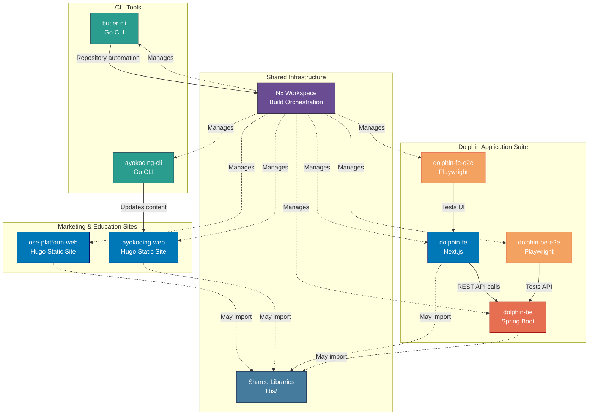
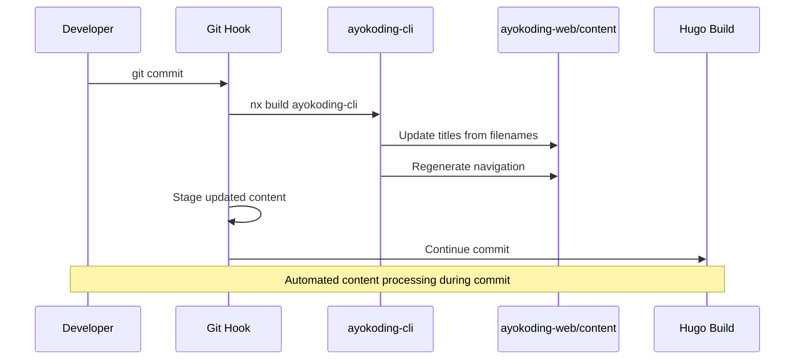
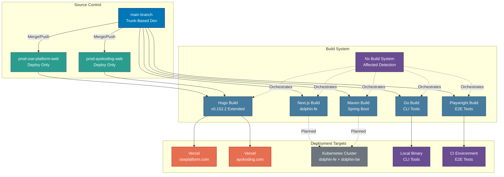
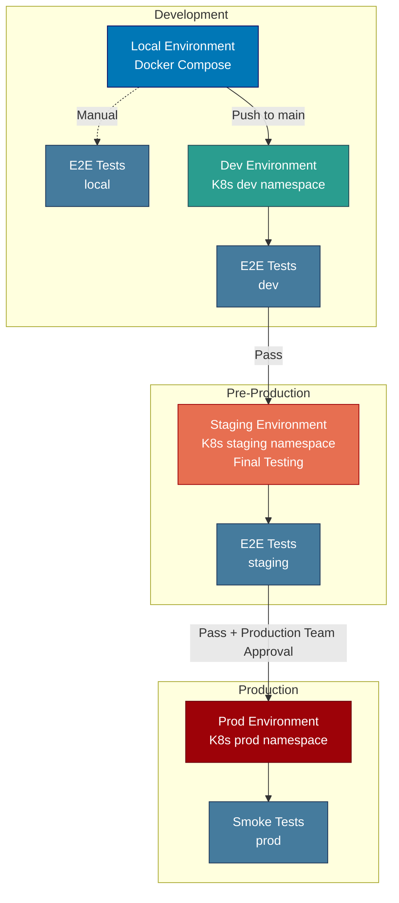
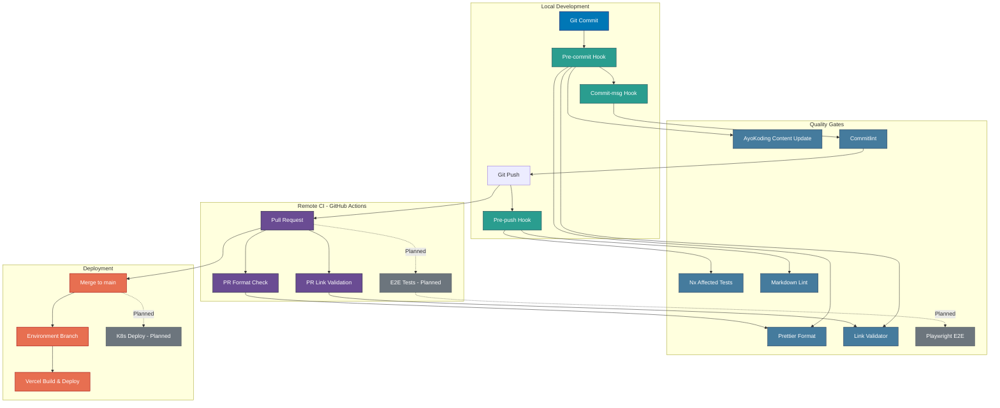
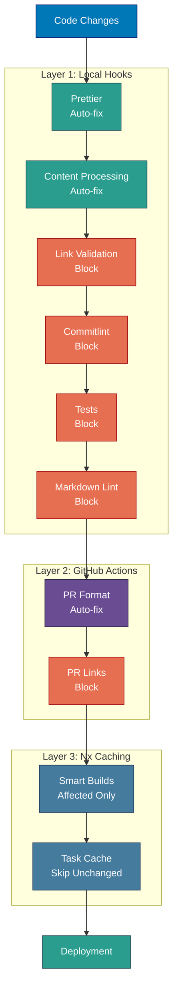

# System Architecture

Comprehensive reference for the Open Sharia Enterprise platform architecture, including application inventory, interactions, deployment infrastructure, and CI/CD pipelines.

## System Overview

Open Sharia Enterprise is a monorepo-based platform built with Nx, containing multiple applications that serve different aspects of the Sharia-compliant enterprise ecosystem. The system follows a microservices-style architecture where applications are independent but share common libraries and build infrastructure.

**Key Characteristics:**

- **Monorepo Architecture**: Nx workspace with multiple independent applications
- **Trunk-Based Development**: All development on `main` branch
- **Automated Quality Gates**: Git hooks + GitHub Actions + Nx caching
- **Multi-Platform Deployment**: Vercel for static sites, Kubernetes cluster for Dolphin suite
- **Build Optimization**: Nx affected builds ensure only changed code is rebuilt

## Applications Inventory

The platform consists of 8 applications across 5 technology stacks:

### Frontend Applications (Hugo Static Sites)

#### ose-platform-web

- **Purpose**: Marketing and documentation website for OSE Platform
- **URL**: <https://oseplatform.com>
- **Technology**: Hugo 0.152.2 Extended + PaperMod theme
- **Deployment**: Vercel (via `prod-ose-platform-web` branch)
- **Build Command**: `nx build ose-platform-web`
- **Dev Command**: `nx dev ose-platform-web`
- **Location**: `apps/ose-platform-web/`

#### ayokoding-web

- **Purpose**: Educational platform for programming, AI, and security
- **URL**: <https://ayokoding.com>
- **Technology**: Hugo 0.152.2 Extended + Hextra theme
- **Languages**: Bilingual (Indonesian primary, English)
- **Deployment**: Vercel (via `prod-ayokoding-web` branch)
- **Build Command**: `nx build ayokoding-web`
- **Dev Command**: `nx dev ayokoding-web`
- **Location**: `apps/ayokoding-web/`
- **Special Features**:
  - Automated title updates from filenames
  - Auto-generated navigation structure
  - Pre-commit hooks for content processing

### CLI Tools (Go)

#### ayokoding-cli

- **Purpose**: Content automation for ayokoding-web
- **Language**: Go 1.24+
- **Build Command**: `nx build ayokoding-cli`
- **Location**: `apps/ayokoding-cli/`
- **Features**:
  - Title extraction and update from markdown filenames
  - Navigation structure regeneration
  - Integrated into pre-commit hooks
- **Usage**: Automatically runs during git commit when ayokoding-web content changes

#### butler-cli

- **Purpose**: Repository management and automation
- **Language**: Go 1.24+
- **Build Command**: `nx build butler-cli`
- **Location**: `apps/butler-cli/`
- **Status**: Active development

### Frontend Applications (Next.js)

#### dolphin-fe

- **Purpose**: Web frontend for Dolphin enterprise application
- **Technology**: Next.js (React framework)
- **Build Command**: `nx build dolphin-fe`
- **Dev Command**: `nx dev dolphin-fe`
- **Test Command**: `nx test dolphin-fe`
- **Location**: `apps/dolphin-fe/`
- **Status**: Planned
- **Deployment**: Multi-environment (local, dev K8s, staging K8s, prod K8s)
- **Backend Integration**: Connects to dolphin-be REST API
- **Feature Flags**: Supports per-environment feature flag configuration

### Backend Applications (Java)

#### dolphin-be

- **Purpose**: Backend services for enterprise applications
- **Language**: Java (Spring Boot)
- **Build Command**: `nx build dolphin-be`
- **Test Command**: `nx test dolphin-be`
- **Serve Command**: `nx serve dolphin-be`
- **Location**: `apps/dolphin-be/`
- **Status**: Initial setup (Phase 0)
- **Deployment**: Multi-environment (local, dev K8s, staging K8s, prod K8s)
- **API Consumers**: dolphin-fe, dolphin-be-e2e
- **Feature Flags**: Supports per-environment feature flag configuration

### E2E Testing Applications (Playwright)

#### dolphin-be-e2e

- **Purpose**: API and E2E testing for dolphin-be backend
- **Technology**: Playwright (API testing mode)
- **Test Command**: `nx e2e dolphin-be-e2e`
- **Location**: `apps/dolphin-be-e2e/`
- **Status**: Planned
- **Test Target**: dolphin-be REST API endpoints
- **Test Environments**: local, dev, staging (NOT prod)
- **Test Types**:
  - API contract tests
  - Integration tests
  - End-to-end backend flows
- **Configuration**: Environment-specific endpoints and test data

#### dolphin-fe-e2e

- **Purpose**: E2E testing for dolphin-fe web application
- **Technology**: Playwright (browser automation)
- **Test Command**: `nx e2e dolphin-fe-e2e`
- **Location**: `apps/dolphin-fe-e2e/`
- **Status**: Planned
- **Test Target**: dolphin-fe UI and user flows
- **Test Environments**: local, dev, staging (NOT prod)
- **Test Types**:
  - UI component tests
  - User journey tests
  - Cross-browser compatibility
- **Configuration**: Environment-specific URLs and test data

## Application Architecture



### Application Interactions

**Independent Application Suites:**

Marketing & Education Sites:

- ose-platform-web: Fully independent static site
- ayokoding-web: Fully independent static site (with CLI automation)

Dolphin Application Suite:

- dolphin-fe: Frontend application consuming dolphin-be REST API
- dolphin-be: Backend services exposing REST API
- dolphin-fe-e2e: Tests dolphin-fe UI and user flows
- dolphin-be-e2e: Tests dolphin-be API endpoints

**Runtime Dependencies:**

- dolphin-fe → dolphin-be (HTTP REST API calls)
- dolphin-fe-e2e → dolphin-fe (browser automation)
- dolphin-be-e2e → dolphin-be (API testing)

**Build-Time Dependencies:**

- All applications managed by Nx workspace
- CLI tools may be executed during build processes
- Shared libraries imported at build time via `@open-sharia-enterprise/[lib-name]`
- E2E test suites depend on their target applications being built first

**Content Processing Pipeline (ayokoding-web):**



## Deployment Architecture



### Deployment Configuration

#### Vercel Deployment

**Hugo Static Sites** (ose-platform-web, ayokoding-web):

- **Build Framework**: `@vercel/static-build`
- **Build Script**: `build.sh` in each app directory
- **Output Directory**: `public/`
- **Hugo Version**: 0.152.2 (configured via environment variable)

**Next.js Application** (dolphin-fe, planned):

- **Deployment Target**: Kubernetes cluster
- **Containerization**: Docker container
- **Build Output**: Next.js standalone build
- **Environment Variables**: API endpoint configuration for dolphin-be

**Security Headers (All Vercel Sites):**

- `X-Content-Type-Options: nosniff`
- `X-Frame-Options: SAMEORIGIN`
- `X-XSS-Protection: 1; mode=block`
- `Referrer-Policy: strict-origin-when-cross-origin`

**Caching Strategy:**

- Static assets (css/js/fonts/images): 1 year immutable cache
- HTML pages: Standard caching
- Next.js: Automatic optimization via Vercel

#### Kubernetes Cluster Deployment (Planned)

**Dolphin Suite** (dolphin-fe + dolphin-be):

- **Platform**: Kubernetes cluster (multi-environment)
- **Containerization**: Docker containers for both applications
- **dolphin-be**: Spring Boot application with REST API
- **dolphin-fe**: Next.js application (standalone build)
- **Database**: Sharia-compliant data storage (deployed in cluster or external)
- **Service Communication**: Internal cluster DNS for dolphin-fe → dolphin-be
- **Ingress**: External access to dolphin-fe, internal-only access to dolphin-be API
- **Configuration**: ConfigMaps and Secrets for environment-specific variables

**Deployment Environments:**

1. **local** (Local Machine):
   - **Applications**: dolphin-fe, dolphin-be
   - **E2E Tests**: dolphin-fe-e2e, dolphin-be-e2e
   - **Platform**: Docker Compose or local processes
   - **Purpose**: Local development and testing
   - **Feature Flags**: Local environment feature flag configuration

2. **dev** (Kubernetes):
   - **Applications**: dolphin-fe, dolphin-be
   - **E2E Tests**: dolphin-fe-e2e, dolphin-be-e2e
   - **Platform**: Kubernetes cluster (dev namespace)
   - **Purpose**: Development integration testing
   - **Feature Flags**: Dev environment feature flag configuration
   - **Deployment Trigger**: Merge to main branch

3. **staging** (Kubernetes):
   - **Applications**: dolphin-fe, dolphin-be
   - **E2E Tests**: dolphin-fe-e2e, dolphin-be-e2e
   - **Platform**: Kubernetes cluster (staging namespace)
   - **Purpose**: Final testing and production team handover/acceptance testing
   - **Feature Flags**: Staging environment feature flag configuration
   - **Deployment Trigger**: Manual promotion from dev or automated on success
   - **Environment**: Production-like configuration for realistic testing

4. **prod** (Kubernetes):
   - **Applications**: dolphin-fe, dolphin-be
   - **E2E Tests**: NOT run in production
   - **Platform**: Kubernetes cluster (prod namespace)
   - **Purpose**: Production workloads
   - **Feature Flags**: Production environment feature flag configuration
   - **Deployment Trigger**: Manual promotion from staging after validation
   - **Traffic Split**: Full production traffic

**Feature Flag Management:**

- **Per-Environment Configuration**: Each environment (local, dev, staging, prod) has independent feature flag settings
- **Configuration Storage**: Feature flags stored in ConfigMaps or external feature flag service
- **Runtime Toggles**: Enable/disable features without redeployment
- **Progressive Rollout**: Features can be enabled in dev → staging → prod progression
- **Emergency Rollback**: Quick feature disable via flag toggle without rollback deployment

**Deployment Progression Flow:**



#### E2E Testing Environment

**E2E Test Execution:**

- **Test Applications**: dolphin-be-e2e, dolphin-fe-e2e
- **Supported Environments**:
  - **local**: Run against local dolphin-fe/be instances (Docker Compose or local processes)
  - **dev**: Run in GitHub Actions CI against dev Kubernetes deployment
  - **staging**: Run in GitHub Actions CI against staging Kubernetes deployment before prod promotion
  - **prod**: E2E tests are NOT run in production environment
- **Execution Triggers**:
  - **local**: Manual execution during development (`nx e2e dolphin-fe-e2e`, `nx e2e dolphin-be-e2e`)
  - **dev**: Automated on merge to main, PR workflows, scheduled runs
  - **staging**: Automated after dev deployment, before prod promotion
- **Test Data**: Isolated test database per environment
- **Environment Configuration**: Tests use environment-specific endpoints and credentials

#### Environment Branches

- **Purpose**: Deployment triggers only
- **Branches**: `prod-ose-platform-web`, `prod-ayokoding-web`
- **Future Branches**: `prod-dolphin-fe` (when dolphin-fe is ready)
- **Policy**: NEVER commit directly to these branches
- **Workflow**: Merge from `main` when ready to deploy

## CI/CD Pipeline

The platform uses a multi-layered quality assurance strategy combining local git hooks, GitHub Actions workflows (CI), and Nx caching. All continuous integration is handled through GitHub Actions.

### CI/CD Pipeline Overview



### Git Hooks (Local Quality Gates)

#### Pre-commit Hook

**Location**: `.husky/pre-commit`

**Execution Order:**

1. **AyoKoding Content Processing** (if affected):
   - Rebuild ayokoding-cli binary
   - Update titles from filenames
   - Regenerate navigation structure
   - Auto-stage changes to `apps/ayokoding-web/content/`
2. **Prettier Formatting** (via lint-staged):
   - Format all staged files
   - Auto-stage formatted changes
3. **Link Validation**:
   - Validate markdown links in staged files only
   - Exit with error if validation fails

**Impact**: Ensures all committed code is formatted and content is processed

#### Commit-msg Hook

**Location**: `.husky/commit-msg`

**Validation**: Conventional Commits format via Commitlint

**Format**: `<type>(<scope>): <description>`

**Valid Types**: feat, fix, docs, style, refactor, perf, test, chore, ci, revert

**Impact**: Ensures consistent commit message format

#### Pre-push Hook

**Location**: `.husky/pre-push`

**Execution Order:**

1. **Nx Affected Tests**:
   - Run `test:quick` target for all affected projects
   - Only tests projects changed since last push
2. **Markdown Linting**:
   - Run markdownlint-cli2 on all markdown files
   - Exit with error if linting fails

**Impact**: Prevents pushing code that fails tests or has markdown violations

### GitHub Actions Workflows

#### PR Format Workflow

**File**: `.github/workflows/format-pr.yml`

**Trigger**: Pull request opened, synchronized, or reopened

**Steps:**

1. Checkout PR branch
2. Setup Volta (Node.js version manager)
3. Install dependencies
4. Detect changed files (JS/TS, JSON, MD, YAML, CSS, HTML)
5. Run Prettier on changed files
6. Auto-commit formatting changes if any

**Purpose**: Ensure all PR code is properly formatted even if local hooks were bypassed

#### PR Link Validation Workflow

**File**: `.github/workflows/validate-links.yml`

**Trigger**: Pull request opened, synchronized, or reopened

**Steps:**

1. Checkout PR branch
2. Setup Python 3.12
3. Run link validation script (`scripts/validate-links.py`)
4. Fail PR if broken links detected

**Purpose**: Prevent merging PRs with broken markdown links

#### Planned Workflows for Dolphin Suite

**Dolphin Dev Deploy Workflow** (planned):

- **File**: `.github/workflows/dolphin-deploy-dev.yml`
- **Trigger**: Push to main branch
- **Steps**:
  1. Checkout code
  2. Build Docker images for dolphin-fe and dolphin-be
  3. Tag images with commit SHA and `dev-latest`
  4. Push images to container registry
  5. Deploy to Kubernetes dev namespace
  6. Apply dev environment feature flag configuration
  7. Run dolphin-be-e2e against dev environment
  8. Run dolphin-fe-e2e against dev environment
  9. Report deployment and test results

**Dolphin Staging Deploy Workflow** (planned):

- **File**: `.github/workflows/dolphin-deploy-staging.yml`
- **Trigger**: Manual workflow dispatch or automated on dev success
- **Steps**:
  1. Verify dev environment tests passed
  2. Pull Docker images from dev deployment
  3. Tag images with `staging-latest`
  4. Deploy to Kubernetes staging namespace
  5. Apply staging environment feature flag configuration
  6. Run dolphin-be-e2e against staging environment
  7. Run dolphin-fe-e2e against staging environment
  8. Notify production team for acceptance testing
  9. Monitor metrics and error rates
  10. Report staging validation results

**Dolphin Prod Deploy Workflow** (planned):

- **File**: `.github/workflows/dolphin-deploy-prod.yml`
- **Trigger**: Manual workflow dispatch (requires approval)
- **Steps**:
  1. Verify staging environment tests passed
  2. Pull Docker images from staging deployment
  3. Tag images with version number and `prod-latest`
  4. Deploy to Kubernetes prod namespace (rolling update)
  5. Apply prod environment feature flag configuration
  6. Run smoke tests (NOT full E2E suite)
  7. Monitor metrics and error rates
  8. Notify deployment status
  9. Automatic rollback on critical errors

**Dolphin E2E Test Workflow** (planned):

- **File**: `.github/workflows/dolphin-e2e.yml`
- **Trigger**: Pull request, scheduled runs
- **Steps**:
  1. Checkout code
  2. Setup Node.js and Java
  3. Build dolphin-be and dolphin-fe
  4. Start services in CI environment (Docker Compose)
  5. Apply local environment feature flag configuration
  6. Run dolphin-be-e2e (Playwright API tests)
  7. Run dolphin-fe-e2e (Playwright UI tests)
  8. Upload test results and screenshots

### Nx Build System

**Caching Strategy:**

- **Cacheable Operations**: `build`, `test`, `lint`
- **Cache Location**: Local + Nx Cloud (if configured)
- **Affected Detection**: Compares against `main` branch

**Build Optimization:**

- **Affected Builds**: `nx affected:build` only builds changed projects
- **Dependency Graph**: Automatically builds dependencies first
- **Parallel Execution**: Runs independent tasks concurrently

**Target Defaults:**

```json
{
  "build": {
    "dependsOn": ["^build"],
    "outputs": ["{projectRoot}/dist"],
    "cache": true
  },
  "test": {
    "dependsOn": ["build"],
    "cache": true
  },
  "lint": {
    "cache": true
  }
}
```

## Development Workflow

### Standard Development Flow

1. **Start Development**:

   ```bash
   nx dev [project-name]
   ```

2. **Make Changes**:
   - Edit code/content
   - Test locally

3. **Commit Changes**:

   ```bash
   git add .
   git commit -m "type(scope): description"
   ```

   - Pre-commit hook runs:
     - Formats code with Prettier
     - Processes ayokoding-web content if affected
     - Validates links
   - Commit-msg hook validates format
   - Commit created

4. **Push to Remote**:

   ```bash
   git push origin main
   ```

   - Pre-push hook runs:
     - Tests affected projects
     - Lints markdown

5. **Create Pull Request** (if using PR workflow):
   - GitHub Actions run:
     - Format check
     - Link validation
   - Review and merge

6. **Deploy** (for Hugo sites):

   ```bash
   git checkout prod-[app-name]
   git merge main
   git push origin prod-[app-name]
   ```

   - Vercel automatically builds and deploys

### Dolphin Suite Deployment Flow (Planned)

**Local Development:**

1. **Start Local Environment**:

   ```bash
   # Option 1: Docker Compose
   docker-compose up -d

   # Option 2: Direct execution
   nx serve dolphin-be
   nx dev dolphin-fe
   ```

2. **Run E2E Tests Locally**:

   ```bash
   nx e2e dolphin-be-e2e --configuration=local
   nx e2e dolphin-fe-e2e --configuration=local
   ```

**Dev Environment Deployment:**

1. **Push to main branch**:

   ```bash
   git push origin main
   ```

2. **GitHub Actions automatically**:
   - Builds Docker images
   - Deploys to K8s dev namespace
   - Applies dev feature flags
   - Runs full E2E test suite against dev
   - Reports results

**Staging Environment Promotion:**

1. **Verify dev deployment**:
   - Check E2E test results passed
   - Review dev environment metrics

2. **Trigger staging deployment**:

   ```bash
   # Manual workflow dispatch via GitHub UI or CLI
   gh workflow run dolphin-deploy-staging.yml
   ```

3. **GitHub Actions automatically**:
   - Deploys same images to K8s staging namespace
   - Applies staging feature flags
   - Runs full E2E test suite against staging
   - Notifies production team for acceptance testing
   - Monitors metrics and error rates

4. **Production Team Handover**:
   - Production team performs acceptance testing
   - Validates business requirements
   - Reviews staging test results
   - Approves for production deployment

**Production Deployment:**

1. **Verify staging deployment and approval**:
   - Check E2E test results passed
   - Review staging metrics and error rates
   - Validate feature flag behavior
   - Confirm production team approval

2. **Trigger production deployment** (requires approval):

   ```bash
   # Manual workflow dispatch with approval
   gh workflow run dolphin-deploy-prod.yml
   ```

3. **GitHub Actions automatically**:
   - Deploys same images to K8s prod namespace
   - Applies prod feature flags
   - Performs rolling update
   - Runs smoke tests (not full E2E)
   - Monitors metrics with auto-rollback on critical errors

**Feature Flag Updates:**

- Feature flags can be updated independently without redeployment
- Changes apply per environment (local, dev, staging, prod)
- Progressive rollout: enable in dev → test → enable in staging → validate → enable in prod

### Quality Assurance Layers



### Quality Gate Categories

**Auto-fix Gates** (Non-blocking with automatic fixes):

- Prettier formatting
- AyoKoding content processing
- PR format workflow

**Blocking Gates** (Must pass to proceed):

- Link validation (pre-commit, PR)
- Commitlint format check
- Affected tests (pre-push)
- Markdown linting (pre-push)

## Technology Stack Summary

### Frontend

**Static Sites** (Hugo):

- **Hugo**: 0.152.2 Extended
- **Themes**: PaperMod (ose-platform-web), Hextra (ayokoding-web)
- **Deployment**: Vercel
- **Applications**: ose-platform-web, ayokoding-web

**Web Applications** (Next.js):

- **Framework**: Next.js (React)
- **Deployment**: Kubernetes cluster (planned)
- **Applications**: dolphin-fe
- **Status**: Planned

### Backend

- **Java**: Spring Boot (dolphin-be)
- **Build**: Maven
- **Deployment**: Kubernetes cluster (planned)
- **API**: REST API for dolphin-fe consumption

### CLI Tools

- **Language**: Go 1.24+
- **Build**: Native Go toolchain via Nx
- **Distribution**: Local binaries
- **Applications**: ayokoding-cli, butler-cli

### E2E Testing

- **Framework**: Playwright
- **Test Types**: API testing (dolphin-be-e2e), UI testing (dolphin-fe-e2e)
- **Execution**: GitHub Actions CI, local development
- **Applications**: dolphin-be-e2e, dolphin-fe-e2e
- **Status**: Planned

### Infrastructure

- **Monorepo**: Nx workspace
- **Node.js**: 24.11.1 LTS (Volta-managed)
- **Package Manager**: npm 11.6.3
- **Git Workflow**: Trunk-Based Development
- **CI**: GitHub Actions
- **CD**: Vercel (Hugo sites), Kubernetes cluster (Dolphin suite)
- **Container Orchestration**: Kubernetes (planned)
- **Deployment Environments**: local, dev (K8s), staging (K8s), prod (K8s)
- **Feature Flags**: Per-environment configuration for progressive rollout

### Quality Tools

- **Formatting**: Prettier 3.6.2
- **Markdown Linting**: markdownlint-cli2 0.20.0
- **Link Validation**: Custom Python script
- **Commit Linting**: Commitlint + Conventional Commits
- **Git Hooks**: Husky + lint-staged
- **Testing**: Nx test orchestration + Playwright E2E

## Future Architecture Considerations

### Immediate Next Steps (Dolphin Suite Completion)

- **dolphin-fe**: Next.js frontend application with REST API integration
- **dolphin-be-e2e**: Playwright API testing for backend endpoints
- **dolphin-fe-e2e**: Playwright UI testing for frontend flows
- **Multi-Environment Kubernetes Deployment**:
  - Four environments: local, dev, staging, prod
  - Namespace-based isolation in Kubernetes cluster
  - Docker containerization for both applications
- **Kubernetes Configuration**:
  - Deployments, Services, Ingress per environment
  - Environment-specific ConfigMaps and Secrets
  - Namespace-based environment isolation
- **Feature Flag Infrastructure**:
  - Per-environment feature flag configuration
  - Progressive rollout capability (dev → staging → prod)
  - Runtime feature toggling without redeployment
  - Emergency rollback mechanism
- **GitHub Actions CI/CD Workflows**:
  - Dev deployment workflow (automated on merge to main)
  - Staging deployment workflow (manual/automated promotion for acceptance testing)
  - Prod deployment workflow (manual with production team approval)
  - E2E test integration for dev and staging environments
  - Docker image building, tagging, and pushing
  - Environment-specific deployment automation

### Future Additions

- **API Gateway**: API aggregation layer for multiple backend services
- **Shared Libraries**: TypeScript, Java, Python libs in `libs/`
- **Additional Applications**: More domain-specific enterprise apps
- **Service Mesh**: Inter-service communication and observability (Istio/Linkerd)
- **Authentication Service**: Centralized auth for all applications
- **Advanced Feature Flag Service**:
  - Centralized feature flag management platform
  - A/B testing and experimentation framework
  - User segmentation and targeted rollouts
  - Real-time flag updates with monitoring
- **Observability Stack**:
  - Metrics: Prometheus + Grafana
  - Logging: ELK/Loki stack
  - Tracing: Jaeger/Tempo
  - Environment-specific dashboards
  - Staging environment monitoring for production readiness
- **GitOps**: Argo CD or Flux for declarative K8s deployments

### Scalability Considerations

- **Nx Cloud**: Distributed task execution and caching
- **Kubernetes Scaling Features**:
  - Horizontal Pod Autoscaling (HPA) for dolphin-fe and dolphin-be
  - Resource limits and requests for optimal resource allocation
  - Rolling updates for zero-downtime deployments
  - Multi-replica deployments for high availability
  - Environment-specific scaling policies:
    - dev: Minimal replicas (1-2 pods)
    - staging: Production-like scaling for realistic testing
    - prod: Full auto-scaling based on traffic and metrics
- **Microservices**: Independent scaling per application via K8s deployments
- **CDN**: Static asset delivery optimization (Vercel for Hugo sites)
- **Database Scaling**:
  - Sharia-compliant data storage patterns (StatefulSets or external)
  - Read replicas for dev/staging environments
  - Production database with high availability
- **Load Balancing**:
  - Kubernetes Services and Ingress controllers
  - Environment-isolated ingress configurations
  - Geographic load balancing (future consideration)
- **Caching Strategy**:
  - Redis/similar deployed in K8s cluster per environment
  - Environment-isolated cache namespaces
  - API response caching with environment-specific TTLs
- **Cost Optimization**:
  - Auto-scaling down in non-production environments during off-hours
  - Spot instances for dev/staging workloads
  - Reserved capacity for production

## Related Documentation

- **Monorepo Structure**: [docs/reference/re\_\_monorepo-structure.md](./re__monorepo-structure.md)
- **Adding New Apps**: [docs/how-to/hoto\_\_add-new-app.md](../how-to/hoto__add-new-app.md)
- **Git Workflow**: [governance/development/workflow/commit-messages.md](../../governance/development/workflow/commit-messages.md)
- **Markdown Quality**: [governance/development/quality/markdown.md](../../governance/development/quality/markdown.md)
- **Trunk-Based Development**: [governance/development/workflow/trunk-based-development.md](../../governance/development/workflow/trunk-based-development.md)
- **Repository Architecture**: [governance/repository-governance-architecture.md](../../governance/repository-governance-architecture.md)
