# System Architecture

> **Note:** This document is a work in progress (WIP/Draft). Content and diagrams are subject to change as the platform evolves.

Comprehensive reference for the Open Sharia Enterprise platform architecture, including application inventory, interactions, deployment infrastructure, and CI/CD pipelines.

## System Overview

Open Sharia Enterprise is a monorepo-based platform built with Nx, containing multiple applications that serve different aspects of the Sharia-compliant enterprise ecosystem. The system follows a microservices-style architecture where applications are independent but share common libraries and build infrastructure.

**Key Characteristics:**

- **Monorepo Architecture**: Nx workspace with multiple independent applications
- **Trunk-Based Development**: All development on `main` branch
- **Automated Quality Gates**: Git hooks + GitHub Actions + Nx caching
- **Deployment**: Vercel for static sites
- **Build Optimization**: Nx affected builds ensure only changed code is rebuilt

## C4 Model Architecture

The system architecture is documented using the C4 model (Context, Container, Component, Code) to provide multiple levels of abstraction suitable for different audiences.

### C4 Level 1: System Context

Shows how the Open Sharia Enterprise platform fits into the world, including users and external systems.

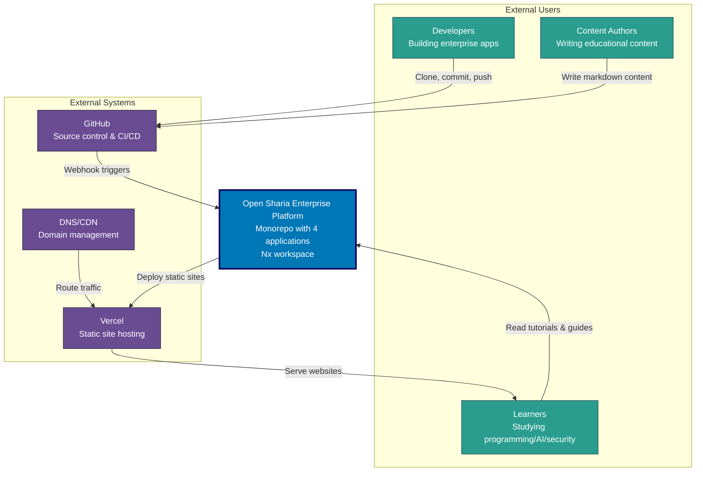

**Key Relationships:**

- **Developers & Authors**: Interact with GitHub (source of truth) to build applications and create content
- **Learners**: Access educational content via Vercel-hosted Hugo sites (ayokoding-web, oseplatform-web)
- **GitHub**: Central hub for CI/CD automation and quality gates
- **Vercel**: Automated deployment platform for static Hugo sites

## Applications Inventory

The platform consists of 4 applications across 2 technology stacks:

### Frontend Applications (Hugo Static Sites)

#### oseplatform-web

- **Purpose**: Marketing and documentation website for OSE Platform
- **URL**: <https://oseplatform.com>
- **Technology**: Hugo 0.152.2 Extended + PaperMod theme
- **Deployment**: Vercel (via `prod-oseplatform-web` branch)
- **Build Command**: `nx build oseplatform-web`
- **Dev Command**: `nx dev oseplatform-web`
- **Location**: `apps/oseplatform-web/`

#### ayokoding-web

- **Purpose**: Educational platform for programming, AI, and security
- **URL**: <https://ayokoding.com>
- **Technology**: Hugo 0.152.2 Extended + Hextra theme
- **Languages**: Bilingual (Indonesian primary, English)
- **Deployment**: Vercel (via `prod-ayokoding-web` branch)
- **Build Command**: `nx build ayokoding-web`
- **Dev Command**: `nx dev ayokoding-web`
- **Location**: `apps/ayokoding-web/`
- **Special Features**:
  - Automated title updates from filenames
  - Auto-generated navigation structure
  - Pre-commit hooks for content processing

### CLI Tools (Go)

#### ayokoding-cli

- **Purpose**: Content automation for ayokoding-web
- **Language**: Go 1.24+
- **Build Command**: `nx build ayokoding-cli`
- **Location**: `apps/ayokoding-cli/`
- **Features**:
  - Title extraction and update from markdown filenames
  - Navigation structure regeneration
  - Integrated into pre-commit hooks
- **Usage**: Automatically runs during git commit when ayokoding-web content changes

#### rhino-cli

- **Purpose**: Repository management and automation
- **Language**: Go 1.24+
- **Build Command**: `nx build rhino-cli`
- **Location**: `apps/rhino-cli/`
- **Status**: Active development

### C4 Level 2: Container Diagram

Shows the high-level technical building blocks (containers) of the system. In C4 terminology, a "container" is a deployable/executable unit (web app, database, file system, etc.), not a Docker container.

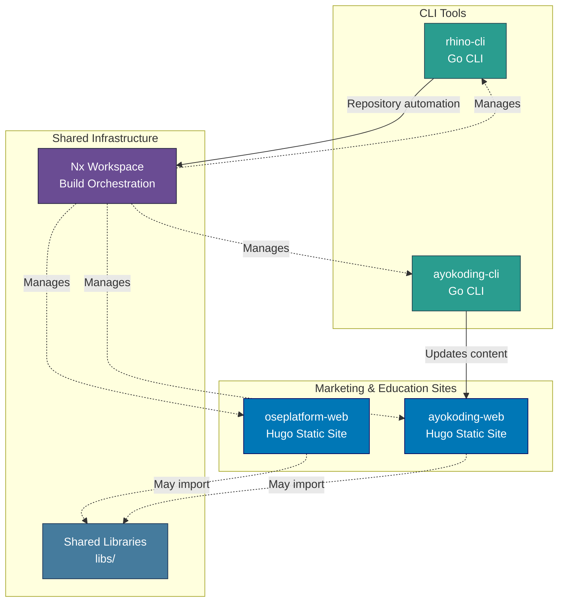

### Application Interactions

**Independent Application Suites:**

Marketing & Education Sites:

- oseplatform-web: Fully independent static site
- ayokoding-web: Fully independent static site (with CLI automation)

CLI Tools:

- ayokoding-cli: Processes ayokoding-web content during build
- rhino-cli: Repository management automation

**Build-Time Dependencies:**

- All applications managed by Nx workspace
- CLI tools executed during build processes
- Shared libraries may be imported at build time via `@open-sharia-enterprise/[lib-name]`

**Content Processing Pipeline (ayokoding-web):**

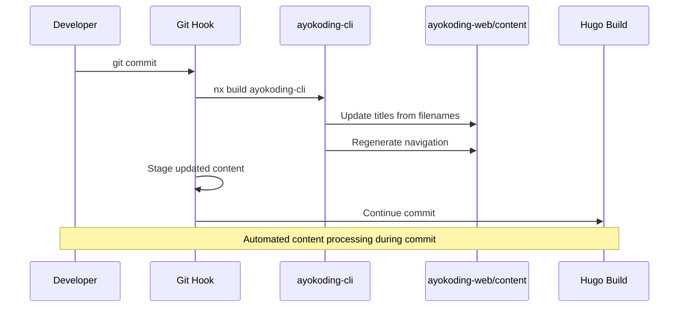

### C4 Level 3: Component Diagrams

Shows the internal components within each container. Components are groupings of related functionality behind a well-defined interface.

#### oseplatform-web Components (Hugo Static Site)

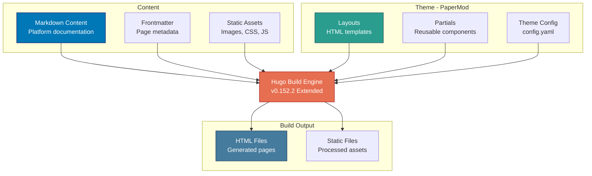

**Component Responsibilities:**

- **Markdown Content**: Platform marketing and documentation content
- **Layouts**: PaperMod theme templates for page structure
- **Theme Config**: Site configuration, navigation menus, theme settings

#### ayokoding-cli Components (Go CLI Tool)

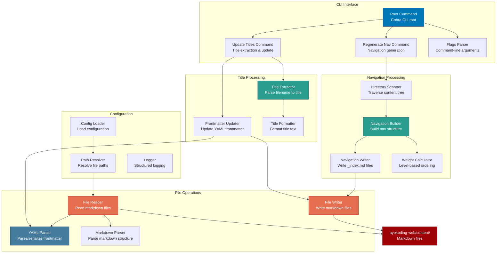

**Component Responsibilities:**

- **Root Command**: CLI entry point, command routing, help text
- **Title Extractor**: Extract title from filename pattern (e.g., `01__intro.md` → "Intro")
- **Frontmatter Updater**: Update YAML frontmatter in markdown files
- **Navigation Scanner**: Recursively scan content directory structure
- **Navigation Builder**: Build hierarchical navigation structure
- **Weight Calculator**: Calculate level-based ordering (level 1 = 100, level 2 = 200, etc.)
- **YAML Parser**: Parse and serialize YAML frontmatter

#### rhino-cli Components (Go CLI Tool)

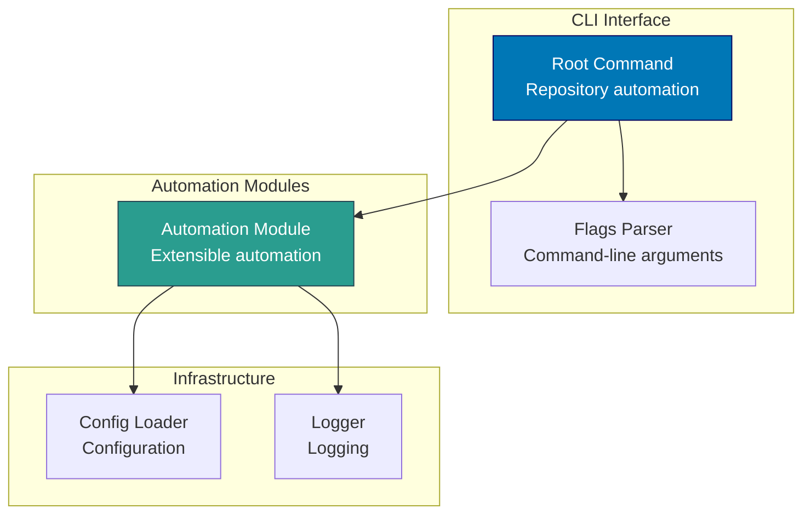

**Component Responsibilities:**

- **Root Command**: CLI entry point for repository automation tasks
- **Automation Module**: Extensible module system for automation workflows
- **Config Loader**: Load butler-specific configuration

#### oseplatform-web Components (Hugo Static Site)


**Component Responsibilities:**

- **Markdown Content**: Platform marketing and documentation content
- **Layouts**: PaperMod theme templates for page structure
- **Theme Config**: Site configuration, navigation menus, theme settings

#### ayokoding-web Components (Hugo Static Site)

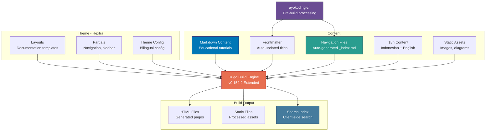

**Component Responsibilities:**

- **ayokoding-cli**: Pre-build processing (title updates, navigation generation)
- **Markdown Content**: Programming, AI, and security educational content
- **Navigation Files**: Auto-generated navigation structure with level-based weights
- **i18n Content**: Bilingual support (Indonesian primary, English secondary)
- **Search Index**: Client-side search for documentation

### C4 Level 4: Code Architecture

Shows implementation details for critical components. Focus on Go CLI tool package structures and key implementation patterns.

#### ayokoding-cli Package Structure (Go)

```mermaid
classDiagram
    class main {
        +main() void
    }

    class RootCmd {
        +Execute() error
        -initConfig() void
    }

    class UpdateTitlesCmd {
        +Run() error
        -scanContentDir() []string
        -updateFile(path) error
    }

    class RegenerateNavCmd {
        +Run() error
        -buildNavigationTree() NavTree
        -writeIndexFiles(tree) error
    }

    class TitleExtractor {
        +ExtractFromFilename(path) string
        -parseFilename(name) string
        -formatTitle(raw) string
    }

    class FrontmatterUpdater {
        +UpdateTitle(path, title) error
        -readFile(path) ([]byte, error)
        -parseFrontmatter(content) map[string]interface{}
        -serializeFrontmatter(data) []byte
        -writeFile(path, content) error
    }

    class NavigationScanner {
        +ScanDirectory(root) NavTree
        -walkDir(path) error
        -isMarkdownFile(path) bool
        -extractMetadata(path) Metadata
    }

    class NavigationBuilder {
        +BuildTree(files) NavTree
        -calculateWeights(tree) NavTree
        -sortByWeight(nodes) []NavNode
    }

    class WeightCalculator {
        +CalculateWeight(level) int
        +GetLevelFromPath(path) int
    }

    class NavWriter {
        +WriteIndexFiles(tree) error
        -generateIndexContent(node) string
        -writeFile(path, content) error
    }

    class FileReader {
        +ReadMarkdown(path) (string, error)
        +ParseYAML(content) (map[string]interface{}, error)
    }

    class FileWriter {
        +WriteMarkdown(path, content) error
        +SerializeYAML(data) ([]byte, error)
    }

    class Config {
        -string ContentDir
        -string BaseURL
        -bool Verbose
        +Load() error
        +Validate() error
    }

    class Logger {
        +Info(msg) void
        +Error(msg) void
        +Debug(msg) void
    }

    main --> RootCmd
    RootCmd --> UpdateTitlesCmd
    RootCmd --> RegenerateNavCmd
    RootCmd --> Config
    UpdateTitlesCmd --> TitleExtractor
    UpdateTitlesCmd --> FrontmatterUpdater
    UpdateTitlesCmd --> FileReader
    UpdateTitlesCmd --> FileWriter
    RegenerateNavCmd --> NavigationScanner
    RegenerateNavCmd --> NavigationBuilder
    RegenerateNavCmd --> NavWriter
    NavigationBuilder --> WeightCalculator
    NavWriter --> FileWriter
    FrontmatterUpdater --> FileReader
    FrontmatterUpdater --> FileWriter
    UpdateTitlesCmd --> Logger
    RegenerateNavCmd --> Logger
```

**Go Package Design Patterns:**

- **Command Pattern**: Cobra-based CLI with subcommands
- **Single Responsibility**: Each struct handles one specific task
- **Dependency Injection**: Explicit dependencies passed to constructors
- **Error Handling**: Explicit error returns, no exceptions
- **Interface Abstraction**: FileReader/FileWriter interfaces for testability
- **Configuration Management**: Centralized config loading and validation
- **Structured Logging**: Consistent logging throughout the application

#### Key Sequence Diagrams

**Content Processing Flow (ayokoding-cli + ayokoding-web):**

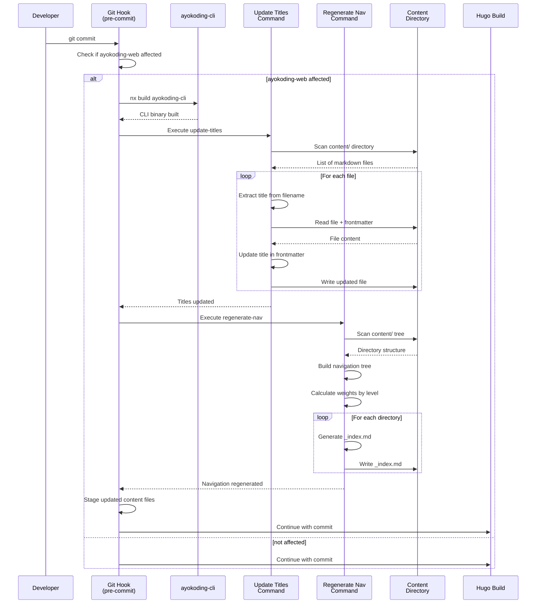

## Deployment Architecture

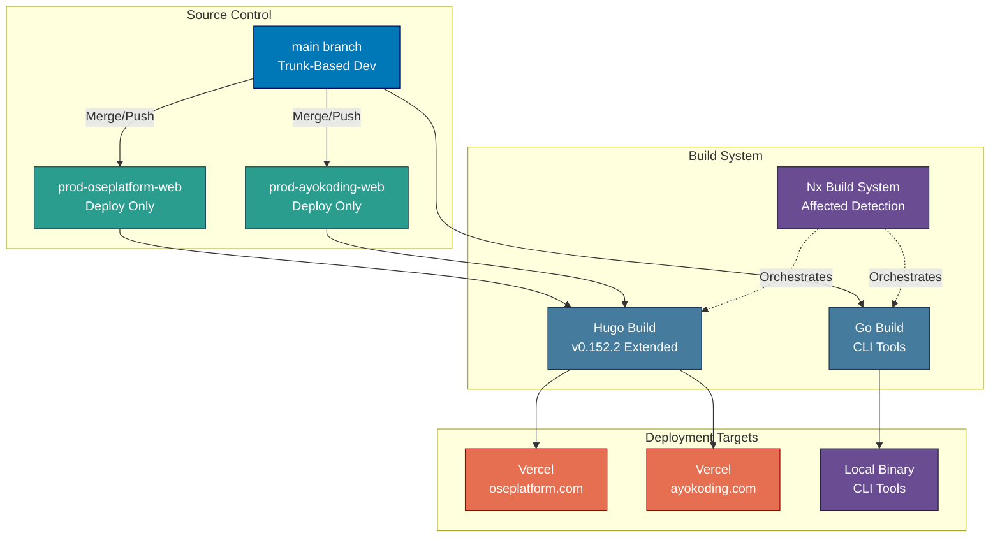

### Deployment Configuration

#### Vercel Deployment

**Hugo Static Sites** (oseplatform-web, ayokoding-web):

- **Build Framework**: `@vercel/static-build`
- **Build Script**: `build.sh` in each app directory
- **Output Directory**: `public/`
- **Hugo Version**: 0.152.2 (configured via environment variable)

**Security Headers (All Vercel Sites):**

- `X-Content-Type-Options: nosniff`
- `X-Frame-Options: SAMEORIGIN`
- `X-XSS-Protection: 1; mode=block`
- `Referrer-Policy: strict-origin-when-cross-origin`

**Caching Strategy:**

- Static assets (css/js/fonts/images): 1 year immutable cache
- HTML pages: Standard caching

#### Environment Branches

- **Purpose**: Deployment triggers only
- **Branches**: `prod-oseplatform-web`, `prod-ayokoding-web`
- **Policy**: NEVER commit directly to these branches
- **Workflow**: Merge from `main` when ready to deploy

## CI/CD Pipeline

The platform uses a multi-layered quality assurance strategy combining local git hooks, GitHub Actions workflows (CI), and Nx caching. All continuous integration is handled through GitHub Actions.

### CI/CD Pipeline Overview

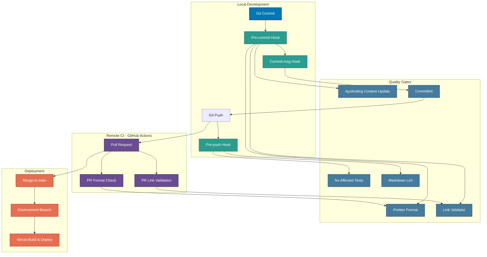

### Git Hooks (Local Quality Gates)

#### Pre-commit Hook

**Location**: `.husky/pre-commit`

**Execution Order:**

1. **AyoKoding Content Processing** (if affected):
   - Rebuild ayokoding-cli binary
   - Update titles from filenames
   - Regenerate navigation structure
   - Auto-stage changes to `apps/ayokoding-web/content/`
2. **Prettier Formatting** (via lint-staged):
   - Format all staged files
   - Auto-stage formatted changes
3. **Link Validation**:
   - Validate markdown links in staged files only
   - Exit with error if validation fails

**Impact**: Ensures all committed code is formatted and content is processed

#### Commit-msg Hook

**Location**: `.husky/commit-msg`

**Validation**: Conventional Commits format via Commitlint

**Format**: `<type>(<scope>): <description>`

**Valid Types**: feat, fix, docs, style, refactor, perf, test, chore, ci, revert

**Impact**: Ensures consistent commit message format

#### Pre-push Hook

**Location**: `.husky/pre-push`

**Execution Order:**

1. **Nx Affected Tests**:
   - Run `test:quick` target for all affected projects
   - Only tests projects changed since last push
2. **Markdown Linting**:
   - Run markdownlint-cli2 on all markdown files
   - Exit with error if linting fails

**Impact**: Prevents pushing code that fails tests or has markdown violations

### GitHub Actions Workflows

#### PR Format Workflow

**File**: `.github/workflows/format-pr.yml`

**Trigger**: Pull request opened, synchronized, or reopened

**Steps:**

1. Checkout PR branch
2. Setup Volta (Node.js version manager)
3. Install dependencies
4. Detect changed files (JS/TS, JSON, MD, YAML, CSS, HTML)
5. Run Prettier on changed files
6. Auto-commit formatting changes if any

**Purpose**: Ensure all PR code is properly formatted even if local hooks were bypassed

#### PR Link Validation Workflow

**File**: `.github/workflows/validate-links.yml`

**Trigger**: Pull request opened, synchronized, or reopened

**Steps:**

1. Checkout PR branch
2. Setup Go 1.24.2
3. Run link validation (`rhino-cli validate-links`)
4. Fail PR if broken links detected

**Purpose**: Prevent merging PRs with broken markdown links

### Nx Build System

**Caching Strategy:**

- **Cacheable Operations**: `build`, `test`, `lint`
- **Cache Location**: Local + Nx Cloud (if configured)
- **Affected Detection**: Compares against `main` branch

**Build Optimization:**

- **Affected Builds**: `nx affected -t build` only builds changed projects
- **Dependency Graph**: Automatically builds dependencies first
- **Parallel Execution**: Runs independent tasks concurrently

**Target Defaults:**

```json
{
  "build": {
    "dependsOn": ["^build"],
    "outputs": ["{projectRoot}/dist"],
    "cache": true
  },
  "test": {
    "dependsOn": ["build"],
    "cache": true
  },
  "lint": {
    "cache": true
  }
}
```

## Development Workflow

### Standard Development Flow

1. **Start Development**:

   ```bash
   nx dev [project-name]
   ```

2. **Make Changes**:
   - Edit code/content
   - Test locally

3. **Commit Changes**:

   ```bash
   git add .
   git commit -m "type(scope): description"
   ```

   - Pre-commit hook runs:
     - Formats code with Prettier
     - Processes ayokoding-web content if affected
     - Validates links
   - Commit-msg hook validates format
   - Commit created

4. **Push to Remote**:

   ```bash
   git push origin main
   ```

   - Pre-push hook runs:
     - Tests affected projects
     - Lints markdown

5. **Create Pull Request** (if using PR workflow):
   - GitHub Actions run:
     - Format check
     - Link validation
   - Review and merge

6. **Deploy** (for Hugo sites):

   ```bash
   git checkout prod-[app-name]
   git merge main
   git push origin prod-[app-name]
   ```

   - Vercel automatically builds and deploys

### Quality Assurance Layers

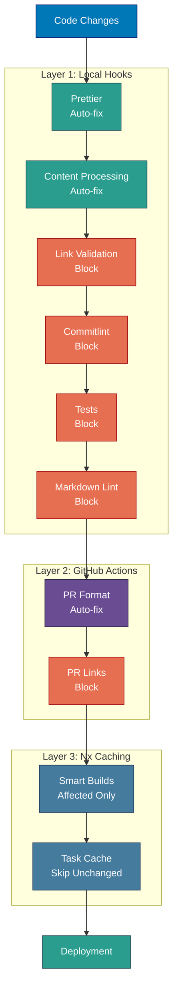

### Quality Gate Categories

**Auto-fix Gates** (Non-blocking with automatic fixes):

- Prettier formatting
- AyoKoding content processing
- PR format workflow

**Blocking Gates** (Must pass to proceed):

- Link validation (pre-commit, PR)
- Commitlint format check
- Affected tests (pre-push)
- Markdown linting (pre-push)

## Technology Stack Summary

### Frontend

**Static Sites** (Hugo):

- **Hugo**: 0.152.2 Extended
- **Themes**: PaperMod (oseplatform-web), Hextra (ayokoding-web)
- **Deployment**: Vercel
- **Applications**: oseplatform-web, ayokoding-web

### CLI Tools

- **Language**: Go 1.24+
- **Build**: Native Go toolchain via Nx
- **Distribution**: Local binaries
- **Applications**: ayokoding-cli, rhino-cli

### Infrastructure

- **Monorepo**: Nx workspace
- **Node.js**: 24.11.1 LTS (Volta-managed)
- **Package Manager**: npm 11.6.3
- **Git Workflow**: Trunk-Based Development
- **CI**: GitHub Actions
- **CD**: Vercel (Hugo sites)

### Quality Tools

- **Formatting**: Prettier 3.6.2
- **Markdown Linting**: markdownlint-cli2 0.20.0
- **Link Validation**: Custom Python script
- **Commit Linting**: Commitlint + Conventional Commits
- **Git Hooks**: Husky + lint-staged
- **Testing**: Nx test orchestration

## Future Architecture Considerations

### Future Additions

- **Shared Libraries**: TypeScript, Go, Python libs in `libs/`
- **Additional Applications**: More domain-specific enterprise apps
- **Backend Services**: Sharia-compliant business logic services
- **Authentication Service**: Centralized auth for all applications
- **Observability Stack**:
  - Metrics: Prometheus + Grafana
  - Logging: ELK/Loki stack
  - Tracing: Jaeger/Tempo

### Scalability Considerations

- **Nx Cloud**: Distributed task execution and caching
- **CDN**: Static asset delivery optimization (currently Vercel for Hugo sites)
- **Additional Hugo Sites**: More specialized content platforms
- **CLI Tool Suite Expansion**: More specialized automation tools
- **Shared Go Modules**: Common functionality across CLI tools

## Related Documentation

- **Monorepo Structure**: [docs/reference/re\_\_monorepo-structure.md](./re__monorepo-structure.md)
- **Adding New Apps**: [docs/how-to/hoto\_\_add-new-app.md](../how-to/hoto__add-new-app.md)
- **Git Workflow**: [governance/development/workflow/commit-messages.md](../../governance/development/workflow/commit-messages.md)
- **Markdown Quality**: [governance/development/quality/markdown.md](../../governance/development/quality/markdown.md)
- **Trunk-Based Development**: [governance/development/workflow/trunk-based-development.md](../../governance/development/workflow/trunk-based-development.md)
- **Repository Architecture**: [governance/repository-governance-architecture.md](../../governance/repository-governance-architecture.md)
