# System Architecture

> **Note:** This document is a work in progress (WIP/Draft). Content and diagrams are subject to change as the platform evolves.

Comprehensive reference for the Open Sharia Enterprise platform architecture, including application inventory, interactions, deployment infrastructure, and CI/CD pipelines.

## System Overview

Open Sharia Enterprise is a monorepo-based platform built with Nx, containing multiple applications that serve different aspects of the Sharia-compliant enterprise ecosystem. The system follows a microservices-style architecture where applications are independent but share common libraries and build infrastructure.

**Key Characteristics:**

- **Monorepo Architecture**: Nx workspace with multiple independent applications
- **Trunk-Based Development**: All development on `main` branch
- **Automated Quality Gates**: Git hooks + GitHub Actions + Nx caching
- **Multi-Platform Deployment**: Vercel for static sites, Kubernetes cluster for Orca Grid suite
- **Build Optimization**: Nx affected builds ensure only changed code is rebuilt

## C4 Model Architecture

The system architecture is documented using the C4 model (Context, Container, Component, Code) to provide multiple levels of abstraction suitable for different audiences.

### C4 Level 1: System Context

Shows how the Open Sharia Enterprise platform fits into the world, including users and external systems.

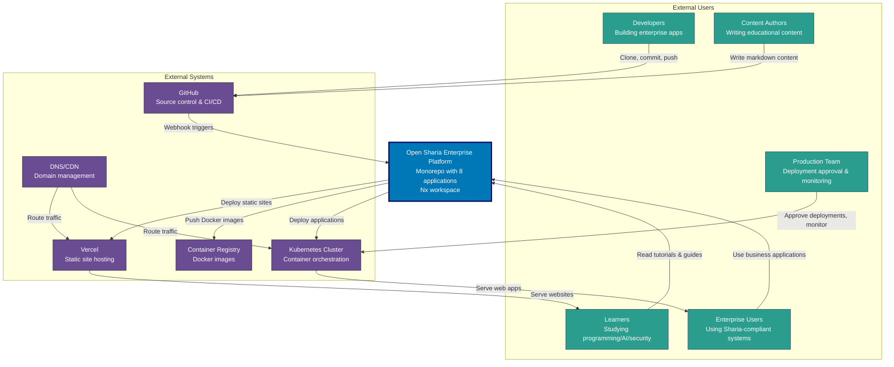

**Key Relationships:**

- **Developers & Authors**: Interact with GitHub (source of truth) to build applications and create content
- **Learners**: Access educational content via Vercel-hosted Hugo sites (ayokoding-web, ose-platform-web)
- **Enterprise Users**: Access business applications via Kubernetes-hosted Orca Grid suite
- **Production Team**: Approves staging deployments and monitors production environment
- **GitHub**: Central hub for CI/CD automation and quality gates
- **Vercel**: Automated deployment platform for static Hugo sites
- **Kubernetes**: Container orchestration for Orca Grid suite (multi-environment)

## Applications Inventory

The platform consists of 8 applications across 5 technology stacks:

### Frontend Applications (Hugo Static Sites)

#### ose-platform-web

- **Purpose**: Marketing and documentation website for OSE Platform
- **URL**: <https://oseplatform.com>
- **Technology**: Hugo 0.152.2 Extended + PaperMod theme
- **Deployment**: Vercel (via `prod-ose-platform-web` branch)
- **Build Command**: `nx build ose-platform-web`
- **Dev Command**: `nx dev ose-platform-web`
- **Location**: `apps/ose-platform-web/`

#### ayokoding-web

- **Purpose**: Educational platform for programming, AI, and security
- **URL**: <https://ayokoding.com>
- **Technology**: Hugo 0.152.2 Extended + Hextra theme
- **Languages**: Bilingual (Indonesian primary, English)
- **Deployment**: Vercel (via `prod-ayokoding-web` branch)
- **Build Command**: `nx build ayokoding-web`
- **Dev Command**: `nx dev ayokoding-web`
- **Location**: `apps/ayokoding-web/`
- **Special Features**:
  - Automated title updates from filenames
  - Auto-generated navigation structure
  - Pre-commit hooks for content processing

### CLI Tools (Go)

#### ayokoding-cli

- **Purpose**: Content automation for ayokoding-web
- **Language**: Go 1.24+
- **Build Command**: `nx build ayokoding-cli`
- **Location**: `apps/ayokoding-cli/`
- **Features**:
  - Title extraction and update from markdown filenames
  - Navigation structure regeneration
  - Integrated into pre-commit hooks
- **Usage**: Automatically runs during git commit when ayokoding-web content changes

#### butler-cli

- **Purpose**: Repository management and automation
- **Language**: Go 1.24+
- **Build Command**: `nx build butler-cli`
- **Location**: `apps/butler-cli/`
- **Status**: Active development

### Frontend Applications (Next.js)

#### orca-grid-fe

- **Purpose**: Web frontend for Orca Grid enterprise application
- **Technology**: Next.js (React framework)
- **Build Command**: `nx build orca-grid-fe`
- **Dev Command**: `nx dev orca-grid-fe`
- **Test Command**: `nx test orca-grid-fe`
- **Location**: `apps/orca-grid-fe/`
- **Status**: Planned
- **Deployment**: Multi-environment (local, dev K8s, staging K8s, prod K8s)
- **Backend Integration**: Connects to orca-grid-be REST API
- **Feature Flags**: Supports per-environment feature flag configuration

### Backend Applications (Java)

#### orca-grid-be

- **Purpose**: Knowledge Management System backend
- **Language**: Java (Spring Boot)
- **Build Command**: `nx build orca-grid-be`
- **Test Command**: `nx test orca-grid-be`
- **Serve Command**: `nx serve orca-grid-be`
- **Location**: `apps/orca-grid-be/`
- **Status**: Initial setup (Phase 0)
- **Deployment**: Multi-environment (local, dev K8s, staging K8s, prod K8s)
- **API Consumers**: orca-grid-fe, orca-grid-be-e2e
- **Feature Flags**: Supports per-environment feature flag configuration

### E2E Testing Applications (Playwright)

#### orca-grid-be-e2e

- **Purpose**: API and E2E testing for orca-grid-be backend
- **Technology**: Playwright (API testing mode)
- **Test Command**: `nx e2e orca-grid-be-e2e`
- **Location**: `apps/orca-grid-be-e2e/`
- **Status**: Planned
- **Test Target**: orca-grid-be REST API endpoints
- **Test Environments**: local, dev, staging (NOT prod)
- **Test Types**:
  - API contract tests
  - Integration tests
  - End-to-end backend flows
- **Configuration**: Environment-specific endpoints and test data

#### orca-grid-fe-e2e

- **Purpose**: E2E testing for orca-grid-fe web application
- **Technology**: Playwright (browser automation)
- **Test Command**: `nx e2e orca-grid-fe-e2e`
- **Location**: `apps/orca-grid-fe-e2e/`
- **Status**: Planned
- **Test Target**: orca-grid-fe UI and user flows
- **Test Environments**: local, dev, staging (NOT prod)
- **Test Types**:
  - UI component tests
  - User journey tests
  - Cross-browser compatibility
- **Configuration**: Environment-specific URLs and test data

### C4 Level 2: Container Diagram

Shows the high-level technical building blocks (containers) of the system. In C4 terminology, a "container" is a deployable/executable unit (web app, database, file system, etc.), not a Docker container.

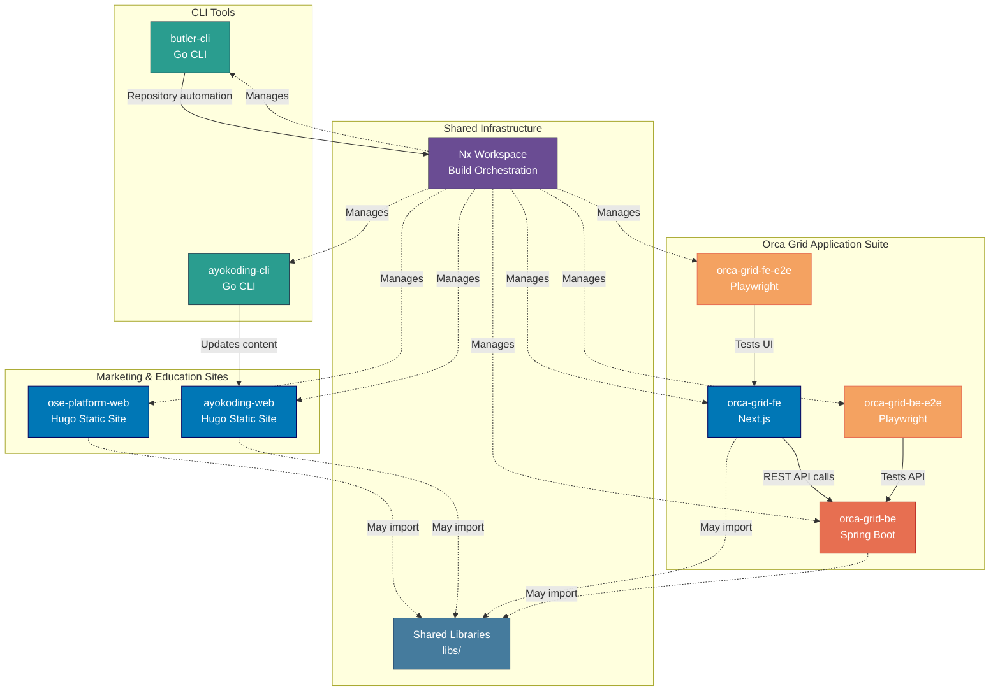

### Application Interactions

**Independent Application Suites:**

Marketing & Education Sites:

- ose-platform-web: Fully independent static site
- ayokoding-web: Fully independent static site (with CLI automation)

Orca Grid Application Suite:

- orca-grid-fe: Frontend application consuming orca-grid-be REST API
- orca-grid-be: Backend services exposing REST API
- orca-grid-fe-e2e: Tests orca-grid-fe UI and user flows
- orca-grid-be-e2e: Tests orca-grid-be API endpoints

**Runtime Dependencies:**

- orca-grid-fe → orca-grid-be (HTTP REST API calls)
- orca-grid-fe-e2e → orca-grid-fe (browser automation)
- orca-grid-be-e2e → orca-grid-be (API testing)

**Build-Time Dependencies:**

- All applications managed by Nx workspace
- CLI tools may be executed during build processes
- Shared libraries imported at build time via `@open-sharia-enterprise/[lib-name]`
- E2E test suites depend on their target applications being built first

**Content Processing Pipeline (ayokoding-web):**

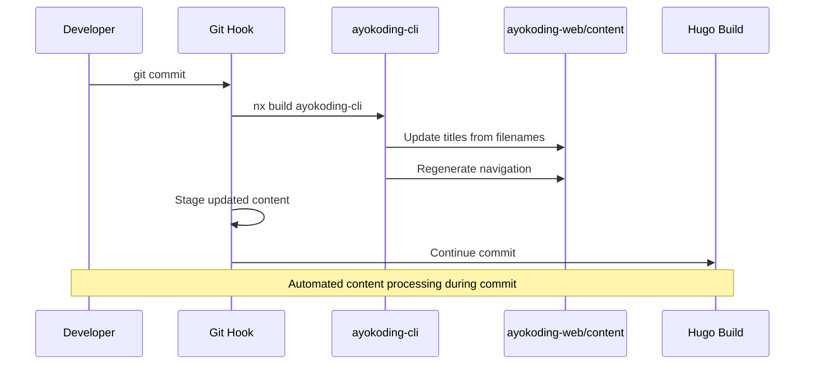

### C4 Level 3: Component Diagrams

Shows the internal components within each container. Components are groupings of related functionality behind a well-defined interface.

#### orca-grid-be Components (Spring Boot Backend)

```mermaid
flowchart TB
    subgraph api_layer[API Layer]
        REST_CTRL[REST Controllers<br/>&#64;RestController]
        API_DOCS[API Documentation<br/>OpenAPI/Swagger]
        REQ_VAL[Request Validation<br/>&#64;Valid annotations]
    end

    subgraph security_layer[Security Layer]
        AUTH_FILTER[Authentication Filter<br/>JWT validation]
        AUTHZ[Authorization Service<br/>Role-based access]
        SEC_CONFIG[Security Config<br/>Spring Security]
    end

    subgraph business_layer[Business Logic Layer]
        SERVICES[Business Services<br/>&#64;Service components]
        DOMAIN_MODELS[Domain Models<br/>Business entities]
        BIZ_RULES[Business Rules Engine<br/>Sharia compliance validation]
    end

    subgraph data_layer[Data Access Layer]
        REPOSITORIES[Repositories<br/>&#64;Repository JPA]
        ENTITIES[JPA Entities<br/>&#64;Entity classes]
        QUERY_DSL[Query Services<br/>Custom queries]
    end

    subgraph integration_layer[Integration Layer]
        EVENT_PUB[Event Publisher<br/>Domain events]
        EXT_CLIENTS[External API Clients<br/>RestTemplate/WebClient]
        MSG_BROKER[Message Broker Client<br/>Optional async messaging]
    end

    subgraph infra_layer[Infrastructure]
        EXCEPTION[Exception Handler<br/>&#64;ControllerAdvice]
        LOGGING[Logging Service<br/>Structured logging]
        CONFIG[Configuration<br/>&#64;ConfigurationProperties]
        HEALTH[Health Checks<br/>Actuator endpoints]
    end

    DATABASE[(Database<br/>PostgreSQL/MySQL)]
    CACHE[(Cache<br/>Redis)]

    REST_CTRL --> REQ_VAL
    REQ_VAL --> AUTH_FILTER
    AUTH_FILTER --> AUTHZ
    REST_CTRL --> SERVICES
    AUTHZ --> SERVICES
    SERVICES --> BIZ_RULES
    SERVICES --> DOMAIN_MODELS
    SERVICES --> REPOSITORIES
    SERVICES --> EVENT_PUB
    SERVICES --> EXT_CLIENTS
    REPOSITORIES --> ENTITIES
    REPOSITORIES --> QUERY_DSL
    REPOSITORIES --> DATABASE
    SERVICES --> CACHE
    REST_CTRL --> EXCEPTION
    SERVICES --> LOGGING
    CONFIG --> SERVICES
    HEALTH --> DATABASE

    style REST_CTRL fill:#0077b6,stroke:#03045e,color:#ffffff
    style SERVICES fill:#2a9d8f,stroke:#264653,color:#ffffff
    style REPOSITORIES fill:#e76f51,stroke:#9d0208,color:#ffffff
    style AUTH_FILTER fill:#6a4c93,stroke:#22223b,color:#ffffff
    style AUTHZ fill:#6a4c93,stroke:#22223b,color:#ffffff
    style BIZ_RULES fill:#f4a261,stroke:#e76f51,color:#ffffff
    style DATABASE fill:#9d0208,stroke:#6a040f,color:#ffffff
    style CACHE fill:#457b9d,stroke:#1d3557,color:#ffffff
```

**Component Responsibilities:**

- **REST Controllers**: HTTP endpoint handling, request/response mapping, OpenAPI documentation
- **Authentication Filter**: JWT token validation, user identity extraction
- **Authorization Service**: Role-based access control, permission checks
- **Business Services**: Core business logic orchestration, transaction management
- **Business Rules Engine**: Sharia compliance validation, domain-specific rules
- **Repositories**: Data persistence abstraction, query execution
- **Event Publisher**: Domain event publication for async processing
- **Exception Handler**: Centralized error handling, error response formatting
- **Health Checks**: Application health monitoring for Kubernetes probes

#### orca-grid-fe Components (Next.js Frontend)

```mermaid
graph TB
    subgraph "Presentation Layer"
        PAGES[Pages/Routes<br/>Next.js pages router]
        LAYOUTS[Layouts<br/>Shared page layouts]
        UI_COMP[UI Components<br/>Reusable React components]
        FORMS[Form Components<br/>Input validation & handling]
    end

    subgraph "State Management"
        GLOBAL_STATE[Global State<br/>Context API / Zustand]
        FORM_STATE[Form State<br/>React Hook Form]
        SERVER_STATE[Server State Cache<br/>React Query / SWR]
    end

    subgraph "Business Logic"
        HOOKS[Custom Hooks<br/>Reusable logic]
        VALIDATORS[Validators<br/>Client-side validation]
        FORMATTERS[Formatters<br/>Data formatting utilities]
        BIZ_LOGIC[Business Logic<br/>Client-side rules]
    end

    subgraph "API Integration"
        API_CLIENT[API Client<br/>HTTP client wrapper]
        API_ENDPOINTS[API Endpoints<br/>Type-safe endpoints]
        AUTH_INTERCEPTOR[Auth Interceptor<br/>JWT token injection]
        ERROR_HANDLER[Error Handler<br/>API error handling]
    end

    subgraph "Authentication"
        AUTH_CONTEXT[Auth Context<br/>User session state]
        LOGIN_FLOW[Login Flow<br/>Authentication logic]
        PROTECTED_ROUTES[Protected Routes<br/>Route guards]
        TOKEN_MANAGER[Token Manager<br/>JWT storage & refresh]
    end

    subgraph "Feature Modules"
        FEAT_A[Feature Module A<br/>Domain-specific features]
        FEAT_B[Feature Module B<br/>Business workflows]
        SHARED[Shared Module<br/>Common components]
    end

    subgraph "Infrastructure"
        I18N[Internationalization<br/>i18next]
        THEME[Theme Provider<br/>Tailwind/MUI theme]
        ERROR_BOUNDARY[Error Boundary<br/>Error catching]
        ANALYTICS[Analytics<br/>User tracking]
    end

    ORCA_GRID_BE_API[orca-grid-be REST API]

    PAGES --> LAYOUTS
    PAGES --> UI_COMP
    PAGES --> FORMS
    LAYOUTS --> UI_COMP
    FORMS --> FORM_STATE
    FORMS --> VALIDATORS
    UI_COMP --> HOOKS
    HOOKS --> GLOBAL_STATE
    HOOKS --> SERVER_STATE
    HOOKS --> API_CLIENT
    API_CLIENT --> API_ENDPOINTS
    API_CLIENT --> AUTH_INTERCEPTOR
    API_CLIENT --> ERROR_HANDLER
    API_CLIENT --> ORCA_GRID_BE_API
    AUTH_CONTEXT --> TOKEN_MANAGER
    LOGIN_FLOW --> AUTH_CONTEXT
    LOGIN_FLOW --> API_CLIENT
    PROTECTED_ROUTES --> AUTH_CONTEXT
    PAGES --> PROTECTED_ROUTES
    FEAT_A --> HOOKS
    FEAT_A --> UI_COMP
    FEAT_B --> HOOKS
    FEAT_B --> UI_COMP
    PAGES --> ERROR_BOUNDARY
    THEME --> UI_COMP

    style PAGES fill:#0077b6,stroke:#03045e,color:#ffffff
    style UI_COMP fill:#2a9d8f,stroke:#264653,color:#ffffff
    style API_CLIENT fill:#e76f51,stroke:#9d0208,color:#ffffff
    style AUTH_CONTEXT fill:#6a4c93,stroke:#22223b,color:#ffffff
    style SERVER_STATE fill:#457b9d,stroke:#1d3557,color:#ffffff
    style ORCA_GRID_BE_API fill:#9d0208,stroke:#6a040f,color:#ffffff
```

**Component Responsibilities:**

- **Pages/Routes**: Next.js page components, routing, server-side rendering setup
- **UI Components**: Reusable React components (buttons, cards, tables, etc.)
- **Global State**: Application-wide state management (user preferences, UI state)
- **Server State Cache**: API response caching, optimistic updates, cache invalidation
- **API Client**: Type-safe HTTP client, request/response interceptors
- **Auth Context**: User authentication state, session management
- **Protected Routes**: Route-level authorization guards
- **Custom Hooks**: Reusable React hooks for common patterns
- **Error Boundary**: Component error catching and fallback UI

#### ayokoding-cli Components (Go CLI Tool)

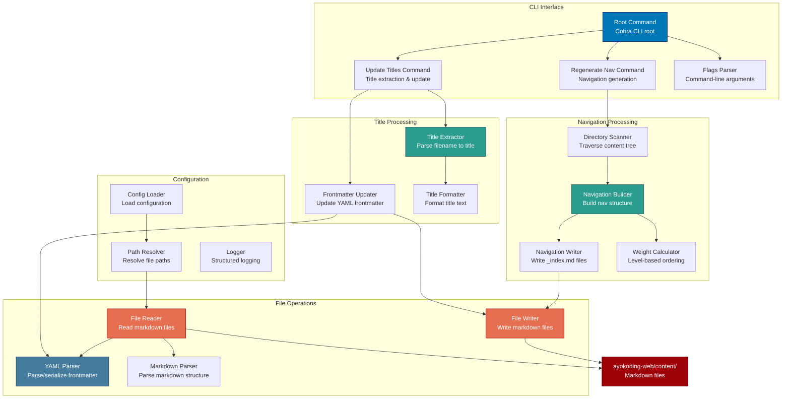

**Component Responsibilities:**

- **Root Command**: CLI entry point, command routing, help text
- **Title Extractor**: Extract title from filename pattern (e.g., `01__intro.md` → "Intro")
- **Frontmatter Updater**: Update YAML frontmatter in markdown files
- **Navigation Scanner**: Recursively scan content directory structure
- **Navigation Builder**: Build hierarchical navigation structure
- **Weight Calculator**: Calculate level-based ordering (level 1 = 100, level 2 = 200, etc.)
- **YAML Parser**: Parse and serialize YAML frontmatter

#### butler-cli Components (Go CLI Tool)

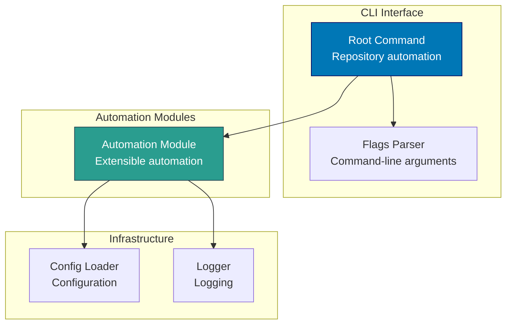

**Component Responsibilities:**

- **Root Command**: CLI entry point for repository automation tasks
- **Automation Module**: Extensible module system for automation workflows
- **Config Loader**: Load butler-specific configuration

#### ose-platform-web Components (Hugo Static Site)

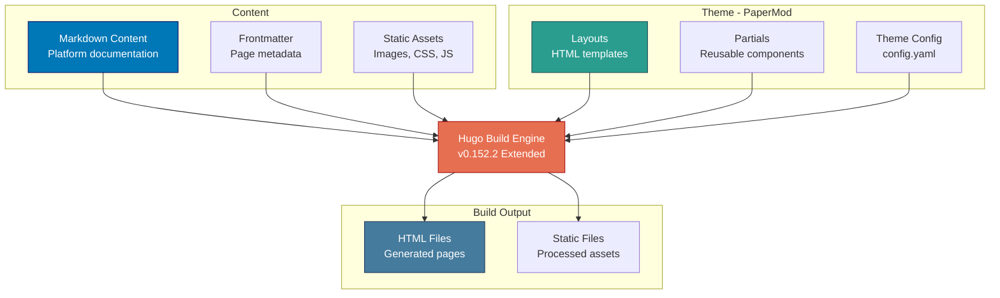

**Component Responsibilities:**

- **Markdown Content**: Platform marketing and documentation content
- **Layouts**: PaperMod theme templates for page structure
- **Theme Config**: Site configuration, navigation menus, theme settings

#### ayokoding-web Components (Hugo Static Site)

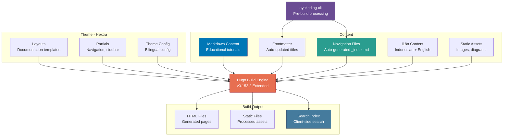

**Component Responsibilities:**

- **ayokoding-cli**: Pre-build processing (title updates, navigation generation)
- **Markdown Content**: Programming, AI, and security educational content
- **Navigation Files**: Auto-generated navigation structure with level-based weights
- **i18n Content**: Bilingual support (Indonesian primary, English secondary)
- **Search Index**: Client-side search for documentation

#### E2E Test Components

```mermaid
graph TB
    subgraph "Backend E2E Test Suites"
        API_TESTS[API Contract Tests<br/>REST endpoint validation]
        INTEGRATION_TESTS[Integration Tests<br/>Multi-endpoint flows]
        AUTH_TESTS[Auth Tests<br/>JWT authentication]
    end

    subgraph "Backend Test Infrastructure"
        PLAYWRIGHT_BE[Playwright API<br/>HTTP client]
        TEST_DATA_BE[Test Data Builder<br/>Test fixtures]
        ASSERTIONS_BE[Assertions<br/>Response validation]
        ENV_CONFIG_BE[Environment Config<br/>local/dev/staging]
    end

    subgraph "Frontend E2E Test Suites"
        UI_TESTS[UI Component Tests<br/>Component validation]
        JOURNEY_TESTS[User Journey Tests<br/>End-to-end workflows]
        CROSS_BROWSER[Cross-Browser Tests<br/>Browser compatibility]
    end

    subgraph "Frontend Test Infrastructure"
        PLAYWRIGHT_FE[Playwright Browser<br/>Browser automation]
        PAGE_OBJECTS[Page Objects<br/>UI abstraction]
        TEST_DATA_FE[Test Data Builder<br/>Test fixtures]
        ENV_CONFIG_FE[Environment Config<br/>local/dev/staging]
    end

    API_TESTS --> PLAYWRIGHT_BE
    INTEGRATION_TESTS --> PLAYWRIGHT_BE
    AUTH_TESTS --> PLAYWRIGHT_BE
    PLAYWRIGHT_BE --> TEST_DATA_BE
    PLAYWRIGHT_BE --> ASSERTIONS_BE
    ENV_CONFIG_BE --> PLAYWRIGHT_BE

    UI_TESTS --> PLAYWRIGHT_FE
    JOURNEY_TESTS --> PLAYWRIGHT_FE
    CROSS_BROWSER --> PLAYWRIGHT_FE
    PLAYWRIGHT_FE --> PAGE_OBJECTS
    PLAYWRIGHT_FE --> TEST_DATA_FE
    ENV_CONFIG_FE --> PLAYWRIGHT_FE

    style API_TESTS fill:#0077b6,stroke:#03045e,color:#ffffff
    style UI_TESTS fill:#0077b6,stroke:#03045e,color:#ffffff
    style PLAYWRIGHT_BE fill:#e76f51,stroke:#9d0208,color:#ffffff
    style PLAYWRIGHT_FE fill:#e76f51,stroke:#9d0208,color:#ffffff
    style PAGE_OBJECTS fill:#2a9d8f,stroke:#264653,color:#ffffff
```

**Component Responsibilities:**

- **API Contract Tests**: Validate REST API contracts, request/response schemas
- **Integration Tests**: Multi-step workflows across multiple API endpoints
- **UI Component Tests**: Individual component behavior validation
- **User Journey Tests**: Complete user workflows (login → action → logout)
- **Page Objects**: UI abstraction layer for maintainable tests
- **Environment Config**: Switch between local, dev, and staging environments

### C4 Level 4: Code Architecture

Shows implementation details for critical components. Focus on database schemas, class structures, and key implementation patterns.

#### orca-grid-be Database Schema (Entity-Relationship Diagram)

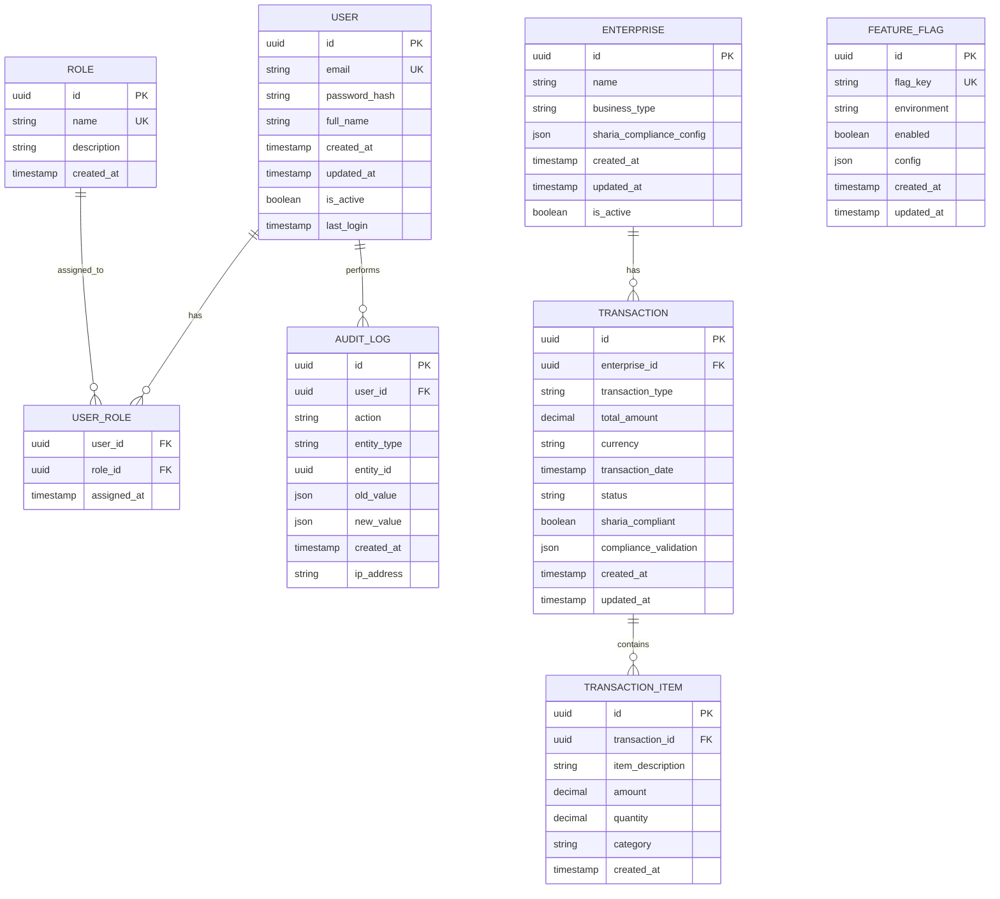

**Schema Design Principles:**

- **UUID Primary Keys**: All entities use UUID for distributed system compatibility
- **Audit Trail**: Comprehensive audit logging for compliance requirements
- **Sharia Compliance**: Built-in compliance validation fields in transactions
- **Feature Flags**: Database-backed feature flag configuration per environment
- **Soft Deletes**: `is_active` flags instead of hard deletes for audit purposes
- **Timestamps**: Created/updated timestamps on all mutable entities

#### orca-grid-be Class Structure (Spring Boot Layered Architecture)

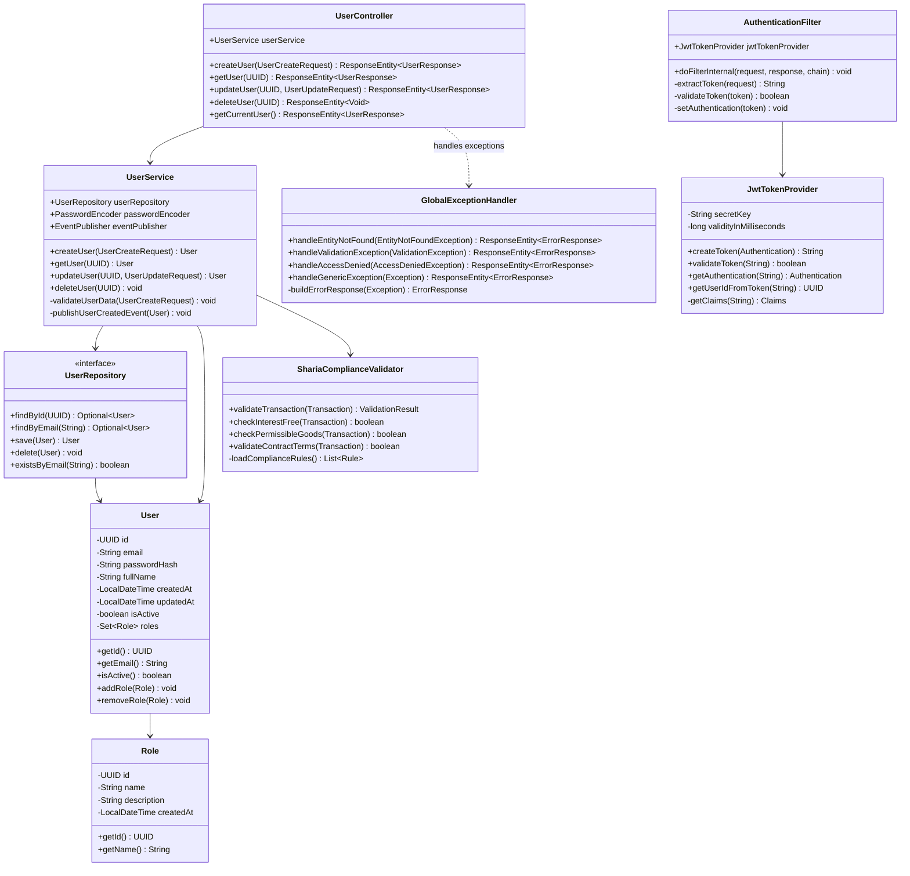

**Class Design Patterns:**

- **Layered Architecture**: Controllers → Services → Repositories separation
- **Dependency Injection**: Spring annotations for loose coupling
- **Repository Pattern**: Data access abstraction via Spring Data JPA
- **Service Layer**: Business logic orchestration, transaction management
- **DTO Pattern**: Request/Response objects separate from domain entities
- **Exception Handling**: Centralized error handling via @ControllerAdvice
- **Domain Events**: Event-driven architecture for async operations
- **Validation**: Built-in validation via @Valid and custom validators

#### orca-grid-fe Component Hierarchy (React/Next.js)

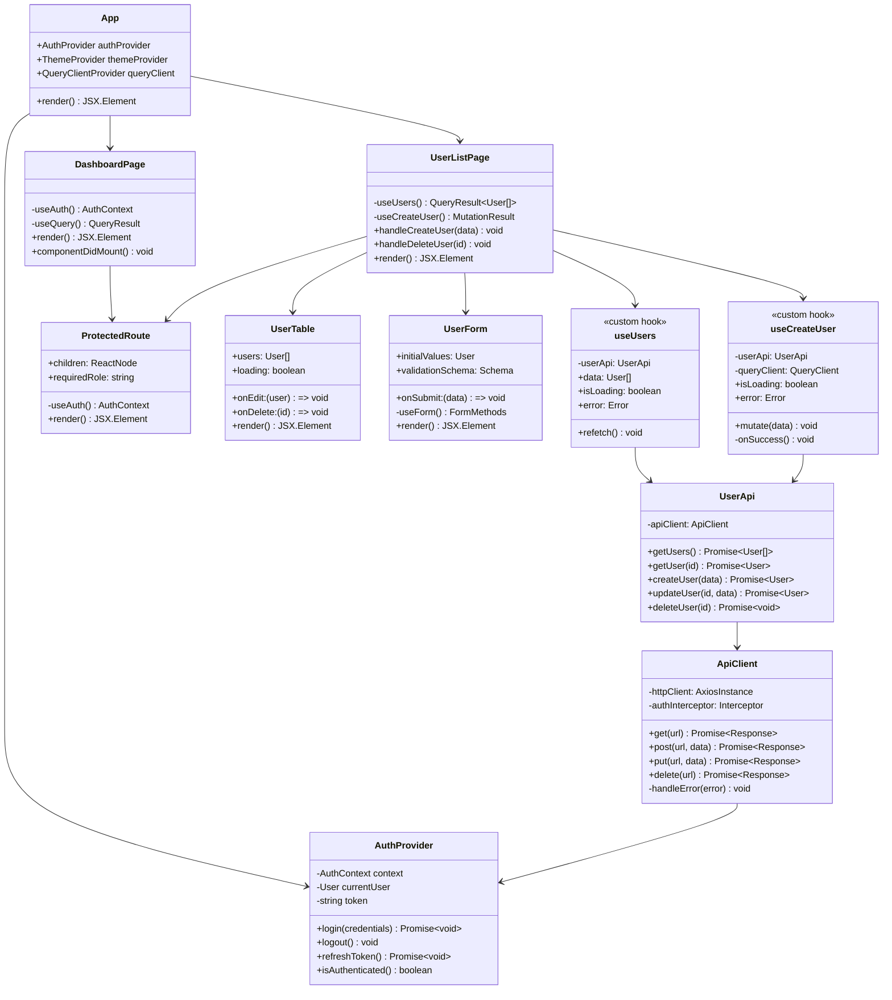

**Component Design Patterns:**

- **Context API**: Global state (auth, theme) via React Context
- **Custom Hooks**: Reusable logic extraction (useAuth, useUsers, useApi)
- **React Query**: Server state management, caching, optimistic updates
- **Component Composition**: Small, focused components with clear responsibilities
- **Higher-Order Components**: ProtectedRoute for authentication guards
- **Form Management**: React Hook Form for form state and validation
- **API Client Layer**: Axios-based HTTP client with interceptors
- **TypeScript**: Type-safe props, API contracts, and state management

#### ayokoding-cli Package Structure (Go)

```mermaid
classDiagram
    class main {
        +main() void
    }

    class RootCmd {
        +Execute() error
        -initConfig() void
    }

    class UpdateTitlesCmd {
        +Run() error
        -scanContentDir() []string
        -updateFile(path) error
    }

    class RegenerateNavCmd {
        +Run() error
        -buildNavigationTree() NavTree
        -writeIndexFiles(tree) error
    }

    class TitleExtractor {
        +ExtractFromFilename(path) string
        -parseFilename(name) string
        -formatTitle(raw) string
    }

    class FrontmatterUpdater {
        +UpdateTitle(path, title) error
        -readFile(path) ([]byte, error)
        -parseFrontmatter(content) map[string]interface{}
        -serializeFrontmatter(data) []byte
        -writeFile(path, content) error
    }

    class NavigationScanner {
        +ScanDirectory(root) NavTree
        -walkDir(path) error
        -isMarkdownFile(path) bool
        -extractMetadata(path) Metadata
    }

    class NavigationBuilder {
        +BuildTree(files) NavTree
        -calculateWeights(tree) NavTree
        -sortByWeight(nodes) []NavNode
    }

    class WeightCalculator {
        +CalculateWeight(level) int
        +GetLevelFromPath(path) int
    }

    class NavWriter {
        +WriteIndexFiles(tree) error
        -generateIndexContent(node) string
        -writeFile(path, content) error
    }

    class FileReader {
        +ReadMarkdown(path) (string, error)
        +ParseYAML(content) (map[string]interface{}, error)
    }

    class FileWriter {
        +WriteMarkdown(path, content) error
        +SerializeYAML(data) ([]byte, error)
    }

    class Config {
        -string ContentDir
        -string BaseURL
        -bool Verbose
        +Load() error
        +Validate() error
    }

    class Logger {
        +Info(msg) void
        +Error(msg) void
        +Debug(msg) void
    }

    main --> RootCmd
    RootCmd --> UpdateTitlesCmd
    RootCmd --> RegenerateNavCmd
    RootCmd --> Config
    UpdateTitlesCmd --> TitleExtractor
    UpdateTitlesCmd --> FrontmatterUpdater
    UpdateTitlesCmd --> FileReader
    UpdateTitlesCmd --> FileWriter
    RegenerateNavCmd --> NavigationScanner
    RegenerateNavCmd --> NavigationBuilder
    RegenerateNavCmd --> NavWriter
    NavigationBuilder --> WeightCalculator
    NavWriter --> FileWriter
    FrontmatterUpdater --> FileReader
    FrontmatterUpdater --> FileWriter
    UpdateTitlesCmd --> Logger
    RegenerateNavCmd --> Logger
```

**Go Package Design Patterns:**

- **Command Pattern**: Cobra-based CLI with subcommands
- **Single Responsibility**: Each struct handles one specific task
- **Dependency Injection**: Explicit dependencies passed to constructors
- **Error Handling**: Explicit error returns, no exceptions
- **Interface Abstraction**: FileReader/FileWriter interfaces for testability
- **Configuration Management**: Centralized config loading and validation
- **Structured Logging**: Consistent logging throughout the application

#### Key Sequence Diagrams

**User Authentication Flow (orca-grid-be + orca-grid-fe):**

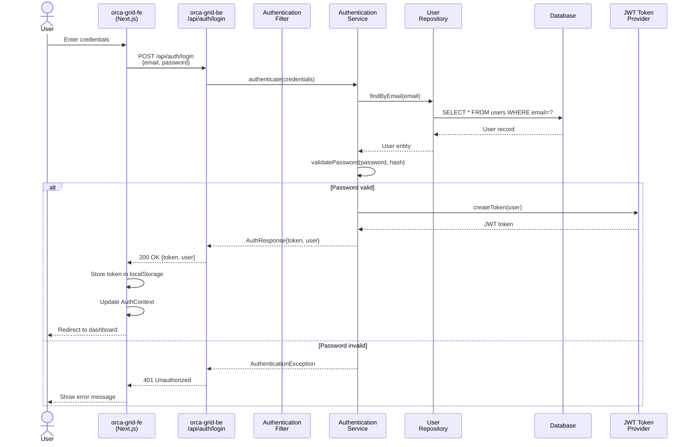

**Transaction Creation with Sharia Compliance (orca-grid-be):**

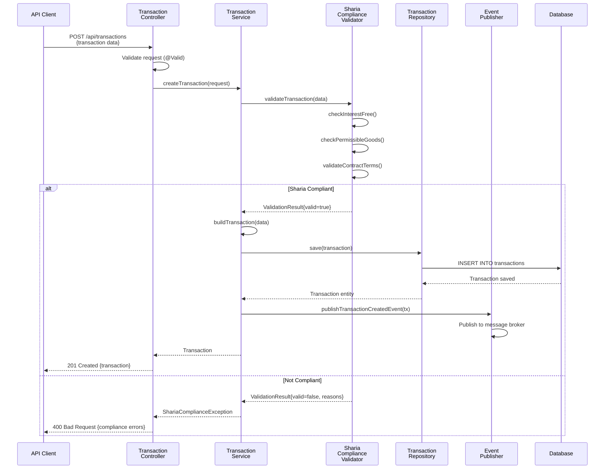

**Content Processing Flow (ayokoding-cli + ayokoding-web):**

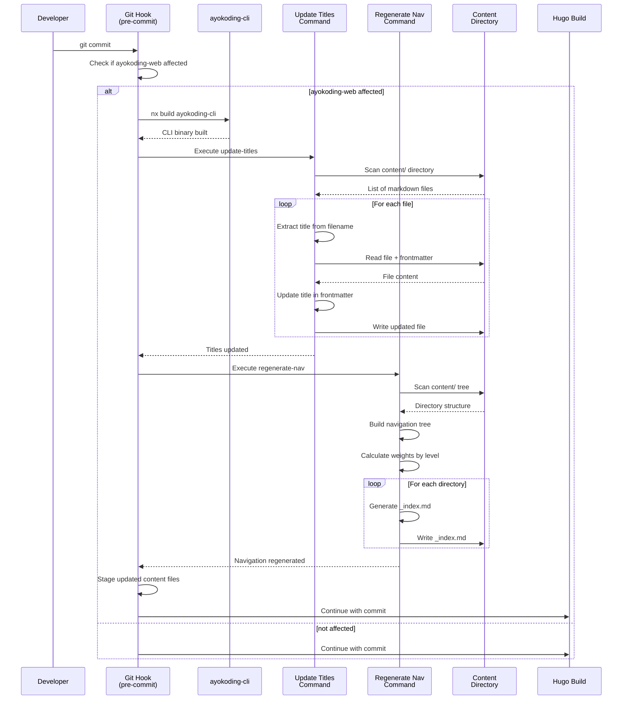

## Deployment Architecture


### Deployment Configuration

#### Vercel Deployment

**Hugo Static Sites** (ose-platform-web, ayokoding-web):

- **Build Framework**: `@vercel/static-build`
- **Build Script**: `build.sh` in each app directory
- **Output Directory**: `public/`
- **Hugo Version**: 0.152.2 (configured via environment variable)

**Next.js Application** (orca-grid-fe, planned):

- **Deployment Target**: Kubernetes cluster
- **Containerization**: Docker container
- **Build Output**: Next.js standalone build
- **Environment Variables**: API endpoint configuration for orca-grid-be

**Security Headers (All Vercel Sites):**

- `X-Content-Type-Options: nosniff`
- `X-Frame-Options: SAMEORIGIN`
- `X-XSS-Protection: 1; mode=block`
- `Referrer-Policy: strict-origin-when-cross-origin`

**Caching Strategy:**

- Static assets (css/js/fonts/images): 1 year immutable cache
- HTML pages: Standard caching
- Next.js: Automatic optimization via Vercel

#### Kubernetes Cluster Deployment (Planned)

**Orca Grid Suite** (orca-grid-fe + orca-grid-be):

- **Platform**: Kubernetes cluster (multi-environment)
- **Containerization**: Docker containers for both applications
- **orca-grid-be**: Spring Boot application with REST API
- **orca-grid-fe**: Next.js application (standalone build)
- **Database**: Sharia-compliant data storage (deployed in cluster or external)
- **Service Communication**: Internal cluster DNS for orca-grid-fe → orca-grid-be
- **Ingress**: External access to orca-grid-fe, internal-only access to orca-grid-be API
- **Configuration**: ConfigMaps and Secrets for environment-specific variables

**Deployment Environments:**

1. **local** (Local Machine):
   - **Applications**: orca-grid-fe, orca-grid-be
   - **E2E Tests**: orca-grid-fe-e2e, orca-grid-be-e2e
   - **Platform**: Docker Compose or local processes
   - **Purpose**: Local development and testing
   - **Feature Flags**: Local environment feature flag configuration

2. **dev** (Kubernetes):
   - **Applications**: orca-grid-fe, orca-grid-be
   - **E2E Tests**: orca-grid-fe-e2e, orca-grid-be-e2e
   - **Platform**: Kubernetes cluster (dev namespace)
   - **Purpose**: Development integration testing
   - **Feature Flags**: Dev environment feature flag configuration
   - **Deployment Trigger**: Merge to main branch

3. **staging** (Kubernetes):
   - **Applications**: orca-grid-fe, orca-grid-be
   - **E2E Tests**: orca-grid-fe-e2e, orca-grid-be-e2e
   - **Platform**: Kubernetes cluster (staging namespace)
   - **Purpose**: Final testing and production team handover/acceptance testing
   - **Feature Flags**: Staging environment feature flag configuration
   - **Deployment Trigger**: Manual promotion from dev or automated on success
   - **Environment**: Production-like configuration for realistic testing

4. **prod** (Kubernetes):
   - **Applications**: orca-grid-fe, orca-grid-be
   - **E2E Tests**: NOT run in production
   - **Platform**: Kubernetes cluster (prod namespace)
   - **Purpose**: Production workloads
   - **Feature Flags**: Production environment feature flag configuration
   - **Deployment Trigger**: Manual promotion from staging after validation
   - **Traffic Split**: Full production traffic

**Feature Flag Management:**

- **Per-Environment Configuration**: Each environment (local, dev, staging, prod) has independent feature flag settings
- **Configuration Storage**: Feature flags stored in ConfigMaps or external feature flag service
- **Runtime Toggles**: Enable/disable features without redeployment
- **Progressive Rollout**: Features can be enabled in dev → staging → prod progression
- **Emergency Rollback**: Quick feature disable via flag toggle without rollback deployment

**Deployment Progression Flow:**

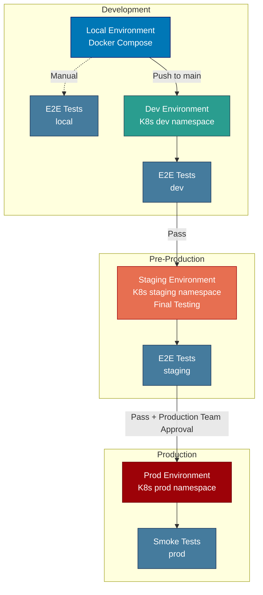

#### E2E Testing Environment

**E2E Test Execution:**

- **Test Applications**: orca-grid-be-e2e, orca-grid-fe-e2e
- **Supported Environments**:
  - **local**: Run against local orca-grid-fe/be instances (Docker Compose or local processes)
  - **dev**: Run in GitHub Actions CI against dev Kubernetes deployment
  - **staging**: Run in GitHub Actions CI against staging Kubernetes deployment before prod promotion
  - **prod**: E2E tests are NOT run in production environment
- **Execution Triggers**:
  - **local**: Manual execution during development (`nx e2e orca-grid-fe-e2e`, `nx e2e orca-grid-be-e2e`)
  - **dev**: Automated on merge to main, PR workflows, scheduled runs
  - **staging**: Automated after dev deployment, before prod promotion
- **Test Data**: Isolated test database per environment
- **Environment Configuration**: Tests use environment-specific endpoints and credentials

#### Environment Branches

- **Purpose**: Deployment triggers only
- **Branches**: `prod-ose-platform-web`, `prod-ayokoding-web`
- **Future Branches**: `prod-orca-grid-fe` (when orca-grid-fe is ready)
- **Policy**: NEVER commit directly to these branches
- **Workflow**: Merge from `main` when ready to deploy

## CI/CD Pipeline

The platform uses a multi-layered quality assurance strategy combining local git hooks, GitHub Actions workflows (CI), and Nx caching. All continuous integration is handled through GitHub Actions.

### CI/CD Pipeline Overview

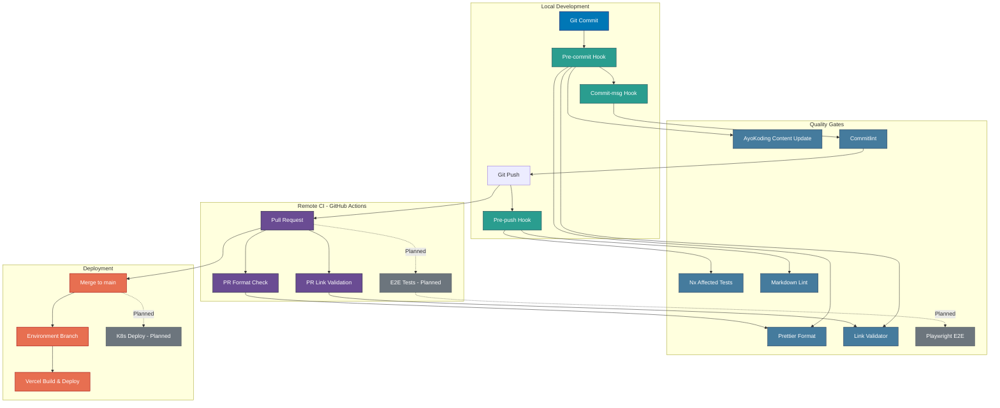

### Git Hooks (Local Quality Gates)

#### Pre-commit Hook

**Location**: `.husky/pre-commit`

**Execution Order:**

1. **AyoKoding Content Processing** (if affected):
   - Rebuild ayokoding-cli binary
   - Update titles from filenames
   - Regenerate navigation structure
   - Auto-stage changes to `apps/ayokoding-web/content/`
2. **Prettier Formatting** (via lint-staged):
   - Format all staged files
   - Auto-stage formatted changes
3. **Link Validation**:
   - Validate markdown links in staged files only
   - Exit with error if validation fails

**Impact**: Ensures all committed code is formatted and content is processed

#### Commit-msg Hook

**Location**: `.husky/commit-msg`

**Validation**: Conventional Commits format via Commitlint

**Format**: `<type>(<scope>): <description>`

**Valid Types**: feat, fix, docs, style, refactor, perf, test, chore, ci, revert

**Impact**: Ensures consistent commit message format

#### Pre-push Hook

**Location**: `.husky/pre-push`

**Execution Order:**

1. **Nx Affected Tests**:
   - Run `test:quick` target for all affected projects
   - Only tests projects changed since last push
2. **Markdown Linting**:
   - Run markdownlint-cli2 on all markdown files
   - Exit with error if linting fails

**Impact**: Prevents pushing code that fails tests or has markdown violations

### GitHub Actions Workflows

#### PR Format Workflow

**File**: `.github/workflows/format-pr.yml`

**Trigger**: Pull request opened, synchronized, or reopened

**Steps:**

1. Checkout PR branch
2. Setup Volta (Node.js version manager)
3. Install dependencies
4. Detect changed files (JS/TS, JSON, MD, YAML, CSS, HTML)
5. Run Prettier on changed files
6. Auto-commit formatting changes if any

**Purpose**: Ensure all PR code is properly formatted even if local hooks were bypassed

#### PR Link Validation Workflow

**File**: `.github/workflows/validate-links.yml`

**Trigger**: Pull request opened, synchronized, or reopened

**Steps:**

1. Checkout PR branch
2. Setup Go 1.24.2
3. Run link validation (`butler-cli validate-links`)
4. Fail PR if broken links detected

**Purpose**: Prevent merging PRs with broken markdown links

#### Planned Workflows for Orca Grid Suite

**Orca Grid Dev Deploy Workflow** (planned):

- **File**: `.github/workflows/orca-grid-deploy-dev.yml`
- **Trigger**: Push to main branch
- **Steps**:
  1. Checkout code
  2. Build Docker images for orca-grid-fe and orca-grid-be
  3. Tag images with commit SHA and `dev-latest`
  4. Push images to container registry
  5. Deploy to Kubernetes dev namespace
  6. Apply dev environment feature flag configuration
  7. Run orca-grid-be-e2e against dev environment
  8. Run orca-grid-fe-e2e against dev environment
  9. Report deployment and test results

**Orca Grid Staging Deploy Workflow** (planned):

- **File**: `.github/workflows/orca-grid-deploy-staging.yml`
- **Trigger**: Manual workflow dispatch or automated on dev success
- **Steps**:
  1. Verify dev environment tests passed
  2. Pull Docker images from dev deployment
  3. Tag images with `staging-latest`
  4. Deploy to Kubernetes staging namespace
  5. Apply staging environment feature flag configuration
  6. Run orca-grid-be-e2e against staging environment
  7. Run orca-grid-fe-e2e against staging environment
  8. Notify production team for acceptance testing
  9. Monitor metrics and error rates
  10. Report staging validation results

**Orca Grid Prod Deploy Workflow** (planned):

- **File**: `.github/workflows/orca-grid-deploy-prod.yml`
- **Trigger**: Manual workflow dispatch (requires approval)
- **Steps**:
  1. Verify staging environment tests passed
  2. Pull Docker images from staging deployment
  3. Tag images with version number and `prod-latest`
  4. Deploy to Kubernetes prod namespace (rolling update)
  5. Apply prod environment feature flag configuration
  6. Run smoke tests (NOT full E2E suite)
  7. Monitor metrics and error rates
  8. Notify deployment status
  9. Automatic rollback on critical errors

**Orca Grid E2E Test Workflow** (planned):

- **File**: `.github/workflows/orca-grid-e2e.yml`
- **Trigger**: Pull request, scheduled runs
- **Steps**:
  1. Checkout code
  2. Setup Node.js and Java
  3. Build orca-grid-be and orca-grid-fe
  4. Start services in CI environment (Docker Compose)
  5. Apply local environment feature flag configuration
  6. Run orca-grid-be-e2e (Playwright API tests)
  7. Run orca-grid-fe-e2e (Playwright UI tests)
  8. Upload test results and screenshots

### Nx Build System

**Caching Strategy:**

- **Cacheable Operations**: `build`, `test`, `lint`
- **Cache Location**: Local + Nx Cloud (if configured)
- **Affected Detection**: Compares against `main` branch

**Build Optimization:**

- **Affected Builds**: `nx affected:build` only builds changed projects
- **Dependency Graph**: Automatically builds dependencies first
- **Parallel Execution**: Runs independent tasks concurrently

**Target Defaults:**

```json
{
  "build": {
    "dependsOn": ["^build"],
    "outputs": ["{projectRoot}/dist"],
    "cache": true
  },
  "test": {
    "dependsOn": ["build"],
    "cache": true
  },
  "lint": {
    "cache": true
  }
}
```

## Development Workflow

### Standard Development Flow

1. **Start Development**:

   ```bash
   nx dev [project-name]
   ```

2. **Make Changes**:
   - Edit code/content
   - Test locally

3. **Commit Changes**:

   ```bash
   git add .
   git commit -m "type(scope): description"
   ```

   - Pre-commit hook runs:
     - Formats code with Prettier
     - Processes ayokoding-web content if affected
     - Validates links
   - Commit-msg hook validates format
   - Commit created

4. **Push to Remote**:

   ```bash
   git push origin main
   ```

   - Pre-push hook runs:
     - Tests affected projects
     - Lints markdown

5. **Create Pull Request** (if using PR workflow):
   - GitHub Actions run:
     - Format check
     - Link validation
   - Review and merge

6. **Deploy** (for Hugo sites):

   ```bash
   git checkout prod-[app-name]
   git merge main
   git push origin prod-[app-name]
   ```

   - Vercel automatically builds and deploys

### Orca Grid Suite Deployment Flow (Planned)

**Local Development:**

1. **Start Local Environment**:

   ```bash
   # Option 1: Docker Compose
   docker-compose up -d

   # Option 2: Direct execution
   nx serve orca-grid-be
   nx dev orca-grid-fe
   ```

2. **Run E2E Tests Locally**:

   ```bash
   nx e2e orca-grid-be-e2e --configuration=local
   nx e2e orca-grid-fe-e2e --configuration=local
   ```

**Dev Environment Deployment:**

1. **Push to main branch**:

   ```bash
   git push origin main
   ```

2. **GitHub Actions automatically**:
   - Builds Docker images
   - Deploys to K8s dev namespace
   - Applies dev feature flags
   - Runs full E2E test suite against dev
   - Reports results

**Staging Environment Promotion:**

1. **Verify dev deployment**:
   - Check E2E test results passed
   - Review dev environment metrics

2. **Trigger staging deployment**:

   ```bash
   # Manual workflow dispatch via GitHub UI or CLI
   gh workflow run orca-grid-deploy-staging.yml
   ```

3. **GitHub Actions automatically**:
   - Deploys same images to K8s staging namespace
   - Applies staging feature flags
   - Runs full E2E test suite against staging
   - Notifies production team for acceptance testing
   - Monitors metrics and error rates

4. **Production Team Handover**:
   - Production team performs acceptance testing
   - Validates business requirements
   - Reviews staging test results
   - Approves for production deployment

**Production Deployment:**

1. **Verify staging deployment and approval**:
   - Check E2E test results passed
   - Review staging metrics and error rates
   - Validate feature flag behavior
   - Confirm production team approval

2. **Trigger production deployment** (requires approval):

   ```bash
   # Manual workflow dispatch with approval
   gh workflow run orca-grid-deploy-prod.yml
   ```

3. **GitHub Actions automatically**:
   - Deploys same images to K8s prod namespace
   - Applies prod feature flags
   - Performs rolling update
   - Runs smoke tests (not full E2E)
   - Monitors metrics with auto-rollback on critical errors

**Feature Flag Updates:**

- Feature flags can be updated independently without redeployment
- Changes apply per environment (local, dev, staging, prod)
- Progressive rollout: enable in dev → test → enable in staging → validate → enable in prod

### Quality Assurance Layers

```mermaid
graph TB
    CODE[Code Changes]

    subgraph "Layer 1: Local Hooks"
        L1_FORMAT[Prettier<br/>Auto-fix]
        L1_CONTENT[Content Processing<br/>Auto-fix]
        L1_LINKS[Link Validation<br/>Block]
        L1_COMMIT[Commitlint<br/>Block]
        L1_TEST[Tests<br/>Block]
        L1_MD[Markdown Lint<br/>Block]
    end

    subgraph "Layer 2: GitHub Actions"
        L2_FORMAT[PR Format<br/>Auto-fix]
        L2_LINKS[PR Links<br/>Block]
    end

    subgraph "Layer 3: Nx Caching"
        L3_BUILD[Smart Builds<br/>Affected Only]
        L3_CACHE[Task Cache<br/>Skip Unchanged]
    end

    DEPLOY[Deployment]

    CODE --> L1_FORMAT
    L1_FORMAT --> L1_CONTENT
    L1_CONTENT --> L1_LINKS
    L1_LINKS --> L1_COMMIT
    L1_COMMIT --> L1_TEST
    L1_TEST --> L1_MD

    L1_MD --> L2_FORMAT
    L2_FORMAT --> L2_LINKS

    L2_LINKS --> L3_BUILD
    L3_BUILD --> L3_CACHE
    L3_CACHE --> DEPLOY

    style CODE fill:#0077b6,stroke:#03045e,color:#ffffff
    style L1_FORMAT fill:#2a9d8f,stroke:#264653,color:#ffffff
    style L1_CONTENT fill:#2a9d8f,stroke:#264653,color:#ffffff
    style L1_LINKS fill:#e76f51,stroke:#9d0208,color:#ffffff
    style L1_COMMIT fill:#e76f51,stroke:#9d0208,color:#ffffff
    style L1_TEST fill:#e76f51,stroke:#9d0208,color:#ffffff
    style L1_MD fill:#e76f51,stroke:#9d0208,color:#ffffff
    style L2_FORMAT fill:#6a4c93,stroke:#22223b,color:#ffffff
    style L2_LINKS fill:#e76f51,stroke:#9d0208,color:#ffffff
    style L3_BUILD fill:#457b9d,stroke:#1d3557,color:#ffffff
    style L3_CACHE fill:#457b9d,stroke:#1d3557,color:#ffffff
    style DEPLOY fill:#2a9d8f,stroke:#264653,color:#ffffff
```

### Quality Gate Categories

**Auto-fix Gates** (Non-blocking with automatic fixes):

- Prettier formatting
- AyoKoding content processing
- PR format workflow

**Blocking Gates** (Must pass to proceed):

- Link validation (pre-commit, PR)
- Commitlint format check
- Affected tests (pre-push)
- Markdown linting (pre-push)

## Technology Stack Summary

### Frontend

**Static Sites** (Hugo):

- **Hugo**: 0.152.2 Extended
- **Themes**: PaperMod (ose-platform-web), Hextra (ayokoding-web)
- **Deployment**: Vercel
- **Applications**: ose-platform-web, ayokoding-web

**Web Applications** (Next.js):

- **Framework**: Next.js (React)
- **Deployment**: Kubernetes cluster (planned)
- **Applications**: orca-grid-fe
- **Status**: Planned

### Backend

- **Java**: Spring Boot (orca-grid-be)
- **Build**: Maven
- **Deployment**: Kubernetes cluster (planned)
- **API**: REST API for orca-grid-fe consumption

### CLI Tools

- **Language**: Go 1.24+
- **Build**: Native Go toolchain via Nx
- **Distribution**: Local binaries
- **Applications**: ayokoding-cli, butler-cli

### E2E Testing

- **Framework**: Playwright
- **Test Types**: API testing (orca-grid-be-e2e), UI testing (orca-grid-fe-e2e)
- **Execution**: GitHub Actions CI, local development
- **Applications**: orca-grid-be-e2e, orca-grid-fe-e2e
- **Status**: Planned

### Infrastructure

- **Monorepo**: Nx workspace
- **Node.js**: 24.11.1 LTS (Volta-managed)
- **Package Manager**: npm 11.6.3
- **Git Workflow**: Trunk-Based Development
- **CI**: GitHub Actions
- **CD**: Vercel (Hugo sites), Kubernetes cluster (Orca Grid suite)
- **Container Orchestration**: Kubernetes (planned)
- **Deployment Environments**: local, dev (K8s), staging (K8s), prod (K8s)
- **Feature Flags**: Per-environment configuration for progressive rollout

### Quality Tools

- **Formatting**: Prettier 3.6.2
- **Markdown Linting**: markdownlint-cli2 0.20.0
- **Link Validation**: Custom Python script
- **Commit Linting**: Commitlint + Conventional Commits
- **Git Hooks**: Husky + lint-staged
- **Testing**: Nx test orchestration + Playwright E2E

## Future Architecture Considerations

### Immediate Next Steps (Orca Grid Suite Completion)

- **orca-grid-fe**: Next.js frontend application with REST API integration
- **orca-grid-be-e2e**: Playwright API testing for backend endpoints
- **orca-grid-fe-e2e**: Playwright UI testing for frontend flows
- **Multi-Environment Kubernetes Deployment**:
  - Four environments: local, dev, staging, prod
  - Namespace-based isolation in Kubernetes cluster
  - Docker containerization for both applications
- **Kubernetes Configuration**:
  - Deployments, Services, Ingress per environment
  - Environment-specific ConfigMaps and Secrets
  - Namespace-based environment isolation
- **Feature Flag Infrastructure**:
  - Per-environment feature flag configuration
  - Progressive rollout capability (dev → staging → prod)
  - Runtime feature toggling without redeployment
  - Emergency rollback mechanism
- **GitHub Actions CI/CD Workflows**:
  - Dev deployment workflow (automated on merge to main)
  - Staging deployment workflow (manual/automated promotion for acceptance testing)
  - Prod deployment workflow (manual with production team approval)
  - E2E test integration for dev and staging environments
  - Docker image building, tagging, and pushing
  - Environment-specific deployment automation

### Future Additions

- **API Gateway**: API aggregation layer for multiple backend services
- **Shared Libraries**: TypeScript, Java, Python libs in `libs/`
- **Additional Applications**: More domain-specific enterprise apps
- **Service Mesh**: Inter-service communication and observability (Istio/Linkerd)
- **Authentication Service**: Centralized auth for all applications
- **Advanced Feature Flag Service**:
  - Centralized feature flag management platform
  - A/B testing and experimentation framework
  - User segmentation and targeted rollouts
  - Real-time flag updates with monitoring
- **Observability Stack**:
  - Metrics: Prometheus + Grafana
  - Logging: ELK/Loki stack
  - Tracing: Jaeger/Tempo
  - Environment-specific dashboards
  - Staging environment monitoring for production readiness
- **GitOps**: Argo CD or Flux for declarative K8s deployments

### Scalability Considerations

- **Nx Cloud**: Distributed task execution and caching
- **Kubernetes Scaling Features**:
  - Horizontal Pod Autoscaling (HPA) for orca-grid-fe and orca-grid-be
  - Resource limits and requests for optimal resource allocation
  - Rolling updates for zero-downtime deployments
  - Multi-replica deployments for high availability
  - Environment-specific scaling policies:
    - dev: Minimal replicas (1-2 pods)
    - staging: Production-like scaling for realistic testing
    - prod: Full auto-scaling based on traffic and metrics
- **Microservices**: Independent scaling per application via K8s deployments
- **CDN**: Static asset delivery optimization (Vercel for Hugo sites)
- **Database Scaling**:
  - Sharia-compliant data storage patterns (StatefulSets or external)
  - Read replicas for dev/staging environments
  - Production database with high availability
- **Load Balancing**:
  - Kubernetes Services and Ingress controllers
  - Environment-isolated ingress configurations
  - Geographic load balancing (future consideration)
- **Caching Strategy**:
  - Redis/similar deployed in K8s cluster per environment
  - Environment-isolated cache namespaces
  - API response caching with environment-specific TTLs
- **Cost Optimization**:
  - Auto-scaling down in non-production environments during off-hours
  - Spot instances for dev/staging workloads
  - Reserved capacity for production

## Related Documentation

- **Monorepo Structure**: [docs/reference/re\_\_monorepo-structure.md](./re__monorepo-structure.md)
- **Adding New Apps**: [docs/how-to/hoto\_\_add-new-app.md](../how-to/hoto__add-new-app.md)
- **Git Workflow**: [governance/development/workflow/commit-messages.md](../../governance/development/workflow/commit-messages.md)
- **Markdown Quality**: [governance/development/quality/markdown.md](../../governance/development/quality/markdown.md)
- **Trunk-Based Development**: [governance/development/workflow/trunk-based-development.md](../../governance/development/workflow/trunk-based-development.md)
- **Repository Architecture**: [governance/repository-governance-architecture.md](../../governance/repository-governance-architecture.md)
