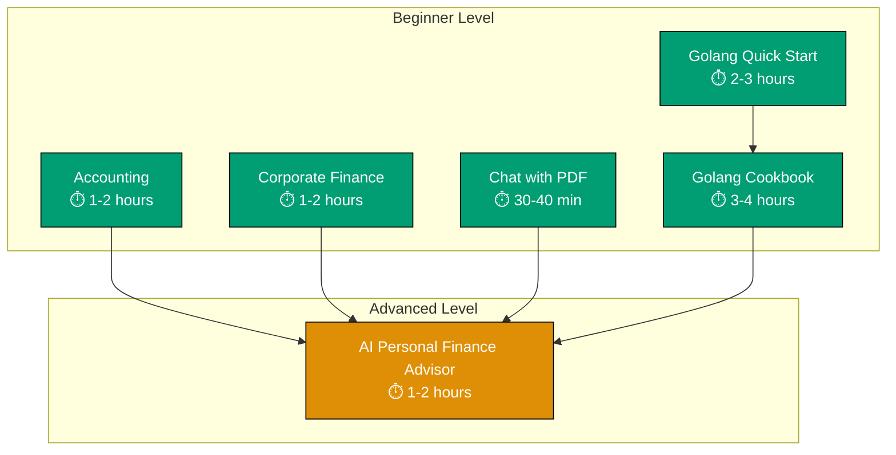
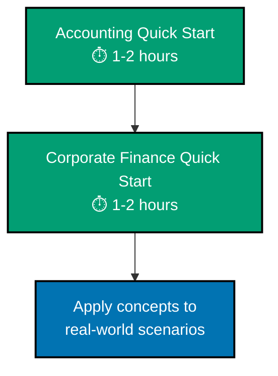
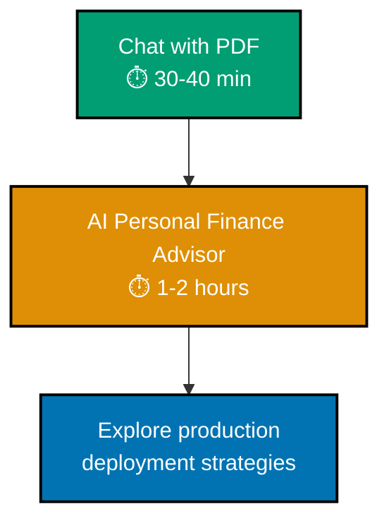
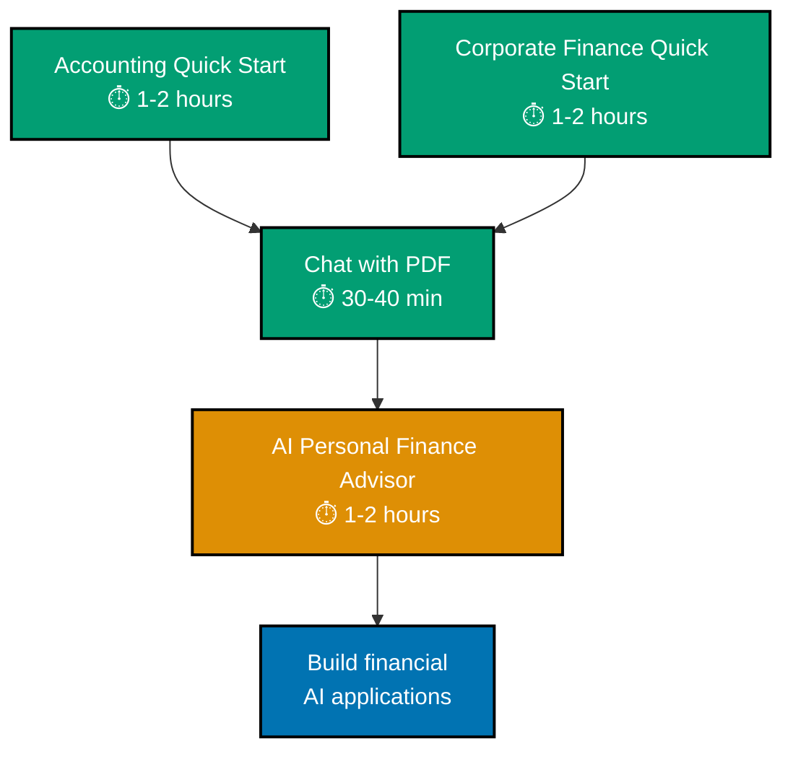
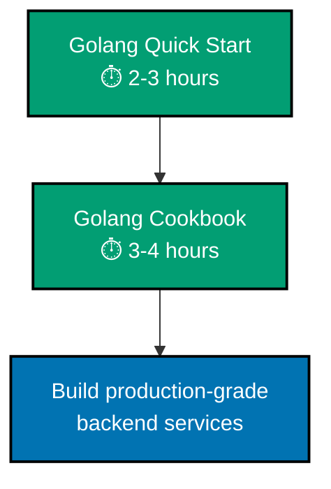

# Tutorials

Learning-oriented guides for the open-sharia-enterprise project. These documents provide step-by-step tutorials that help users learn the fundamentals and get started with the system.

## 📊 Tutorial Overview

%% Color palette: Teal #029E73 (beginner), Orange #DE8F05 (advanced)
%% All colors are color-blind friendly and meet WCAG AA contrast standards

**Legend**:

- 🟢 **Beginner** - No prerequisites, start here
- 🔴 **Advanced** - Requires beginner knowledge
- Solid arrows (→) show recommended learning paths

---

## 📋 Contents

### 💼 Business and Finance

Learning-oriented guides for accounting, corporate finance, and financial analysis:

- [**Business and Finance Index**](./business-and-finance/README.md) - All available business and finance tutorials
  - 🟢 [**Accounting Quick Start**](./business-and-finance/tu-bufi__accounting.md) - Fundamental accounting principles and financial statements
  - 🟢 [**Corporate Finance Quick Start**](./business-and-finance/tu-bufi__corporate-finance.md) - Time value of money and capital budgeting

### 🏗️ System Design

Real-world system design study cases and architectural tutorials:

- [**System Design Index**](./software-engineering/system-design/README.md) - All available system design study cases
  - 🔴 [**AI Personal Finance Advisor**](./software-engineering/system-design/tu-soen-syde__ai-personal-finance-advisor.md) - Complete system design for fintech AI **(⏱️ 1-2 hours)**

### 🤖 AI Engineering

Learning-oriented guides for building AI and machine learning systems:

- [**AI Engineering Index**](./ai-engineering/README.md) - All available AI engineering tutorials
  - 🟢 [**Chat with PDF**](./ai-engineering/tu-aien__chat-with-pdf.md) - Understanding how PDF chat applications work **(⏱️ 30-40 minutes)**

### 🔧 Programming Languages

Learning-oriented guides for programming languages, from fundamentals to advanced patterns:

- [**Programming Languages Index**](./software-engineering/programming-languages/README.md) - All available programming language tutorials

## Golang

Complete learning path from installation to expert mastery:

**Full Set (Sequential Learning Path)**:

1. 🟢 [**Golang Initial Setup**](./software-engineering/programming-languages/golang/tu-soen-prla-gola__initial-setup.md) - Get Go installed and running in 15 minutes **(⏱️ 5-15 min, 0-5%)**
2. 🟢 [**Golang Quick Start**](./software-engineering/programming-languages/golang/tu-soen-prla-gola__quick-start.md) - Learn core syntax to explore independently **(⏱️ 1-2 hours, 5-30%)**
3. 🟢 [**Complete Beginner's Guide to Go**](./software-engineering/programming-languages/golang/tu-soen-prla-gola__beginner.md) - Comprehensive Go fundamentals from scratch **(⏱️ 3-4 hours, 0-60%)**
4. 🟡 [**Intermediate Go Programming**](./software-engineering/programming-languages/golang/tu-soen-prla-gola__intermediate.md) - Professional techniques for production systems **(⏱️ 4-8 hours, 60-85%)**
5. 🔴 [**Advanced Go Programming**](./software-engineering/programming-languages/golang/tu-soen-prla-gola__advanced.md) - Expert mastery of internals and optimization **(⏱️ 6-12 hours, 85-95%)**

**Parallel Track (Problem-Solving Reference)**:

- 🟢 [**Golang Cookbook**](./software-engineering/programming-languages/golang/tu-soen-prla-gola__cookbook.md) - Practical patterns and recipes for common problems **(⏱️ 3-4 hours)**

## Java

Complete learning path from installation to expert mastery _(Coming Soon)_:

- 🟢 [**Java Initial Setup**](./software-engineering/programming-languages/java/) - Get Java installed and running
- 🟢 [**Java Quick Start**](./software-engineering/programming-languages/java/) - Learn core syntax to explore independently
- 🟢 [**Complete Beginner's Guide to Java**](./software-engineering/programming-languages/java/) - Comprehensive Java fundamentals from scratch
- 🟡 [**Intermediate Java Programming**](./software-engineering/programming-languages/java/) - Professional techniques for production systems
- 🔴 [**Advanced Java Programming**](./software-engineering/programming-languages/java/) - Expert mastery of JVM internals and optimization
- 🟢 [**Java Cookbook**](./software-engineering/programming-languages/java/) - Practical patterns and recipes for common problems

### 🔒 Information Security

Learning-oriented guides for information security concepts and practices:

- [**Information Security Index**](./information-security/README.md) - All available information security tutorials

### 🎨 Web Backend

Learning-oriented guides for web backend development and frameworks:

- [**Web Backend Index**](./software-engineering/web-backend/README.md) - All available web backend tutorials
  - [Spring Boot Tutorials](./software-engineering/web-backend/spring-boot/) - Complete Full Set from setup to expert mastery (coming soon)

### 🌐 Web Frontend

Learning-oriented guides for web frontend development:

- [**Web Frontend Index**](./software-engineering/web-frontend/README.md) - All available web frontend tutorials
  - [React Tutorials](./software-engineering/web-frontend/react/) - Complete Full Set from setup to expert mastery (coming soon)

### 📱 Mobile

Learning-oriented guides for mobile application development:

- [**Mobile Index**](./software-engineering/mobile/README.md) - All available mobile tutorials
  - [React Native Tutorials](./software-engineering/mobile/react-native/) - Complete Full Set from setup to expert mastery (coming soon)

---

## 🎯 Learning Paths

### Path 1: Business and Finance Professional

**Goal**: Understand accounting and financial analysis fundamentals

%% Color palette: Teal #029E73 (beginner), Blue #0173B2 (application)
%% All colors are color-blind friendly and meet WCAG AA contrast standards

**Total Time**: ~2-4 hours core learning

---

### Path 2: AI/ML Engineer

**Goal**: Build intelligent systems with LLMs and RAG

%% Color palette: Teal #029E73 (beginner), Orange #DE8F05 (advanced), Blue #0173B2 (exploration)
%% All colors are color-blind friendly and meet WCAG AA contrast standards

**Total Time**: ~2-3 hours core learning

---

### Path 3: Fintech Developer

**Goal**: Combine financial knowledge with AI capabilities

%% Color palette: Teal #029E73 (beginner), Orange #DE8F05 (advanced), Blue #0173B2 (application)
%% All colors are color-blind friendly and meet WCAG AA contrast standards

**Total Time**: ~4-6 hours core learning

---

### Path 4: Backend/Systems Engineer

**Goal**: Master Go for building scalable backend systems

%% Color palette: Teal #029E73 (beginner), Blue #0173B2 (application)
%% All colors are color-blind friendly and meet WCAG AA contrast standards

**Total Time**: ~5-7 hours core learning

---

## 💡 How to Use These Tutorials

### 🎓 For Beginners

**Start here if**: You're new to finance, accounting, AI/ML systems, or backend programming

1. Pick a 🟢 **Beginner** tutorial based on your interest:
   - Want to learn finance? → [Accounting](./business-and-finance/tu-bufi__accounting.md) or [Corporate Finance](./business-and-finance/tu-bufi__corporate-finance.md)
   - Want to learn AI? → [Chat with PDF](./ai-engineering/tu-aien__chat-with-pdf.md)
   - Want to learn Go? → [Golang Quick Start](./software-engineering/programming-languages/golang/tu-soen-prla-gola__quick-start.md)

2. Work through the tutorial step-by-step
3. Try the practice exercises and calculations
4. Move to the next level when comfortable

### 🚀 For Advanced Learners

**Start here if**: You want to design complete systems

1. Go directly to 🔴 **Advanced** tutorials:
   - [AI Personal Finance Advisor](./software-engineering/system-design/tu-soen-syde__ai-personal-finance-advisor.md) - End-to-end system design

2. Study architecture decisions and trade-offs
3. Adapt patterns to your specific requirements
4. Contribute your own patterns back to the project

---

## 📖 Tutorial Categories Explained

### Business and Finance 💼

- **Purpose**: Learn fundamental accounting and finance concepts
- **Format**: Concepts → Formulas → Examples → Applications
- **Best for**: Professionals needing financial literacy, fintech developers
- **Time**: 1-2 hours per tutorial

### System Design 🏗️

- **Purpose**: Architectural case studies and design patterns
- **Format**: Requirements → Architecture → Implementation → Scale
- **Best for**: Senior developers, architects, tech leads
- **Time**: 1-2 hours reading, days/weeks implementing

### AI Engineering 🤖

- **Purpose**: Understanding and building AI systems
- **Format**: Concepts → Architecture → Implementation strategies
- **Best for**: Developers exploring AI/ML applications
- **Time**: 30 minutes to 2 hours depending on depth

### Programming Languages 🔧

- **Purpose**: Learn programming languages from fundamentals to advanced patterns
- **Format**: Syntax → Fundamentals → Advanced Features → Practical Patterns
- **Best for**: Backend developers, systems engineers, anyone learning a new language
- **Time**: 2-7 hours per language depending on depth (Quick Start vs Cookbook)

---

## 🔗 Next Steps

After completing tutorials, explore:

- **[How-To Guides](../how-to/README.md)** - Step-by-step solutions for specific tasks
- **[Reference Documentation](../reference/README.md)** - Technical specifications and API references
- **[Explanations](../explanation/README.md)** - Deep dives into concepts and architecture decisions

---

**Last Updated**: 2025-12-04
