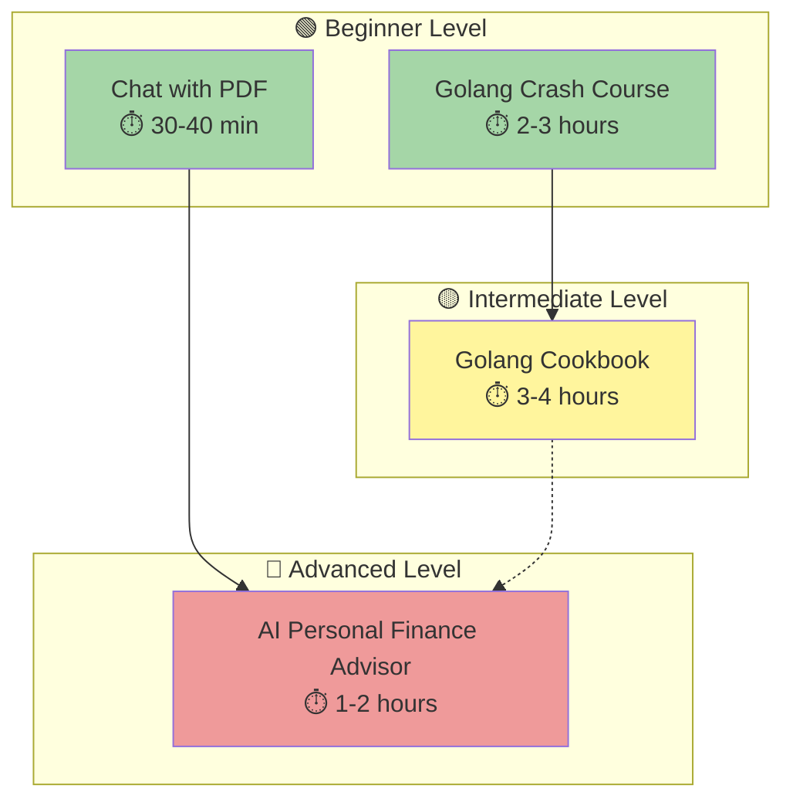

# Tutorials

Learning-oriented guides for the open-sharia-enterprise project. These documents provide step-by-step tutorials that help users learn the fundamentals and get started with the system.

## 📊 Tutorial Overview



**Legend**:

- 🟢 **Beginner** - No prerequisites, start here
- 🟡 **Intermediate** - Requires beginner knowledge
- 🔴 **Advanced** - Requires intermediate knowledge
- Solid arrows (→) show recommended learning paths
- Dotted arrows (⋯→) show optional connections

---

## 📋 Contents

### 🚀 Crash Courses

Quick-start guides for learning programming languages and technologies:

- [**Crash Courses Index**](./crash-courses/README.md) - All available crash courses
  - 🟢 [**Golang Crash Course**](./crash-courses/tu-crco__golang.md) - Learn Go language mechanics **(⏱️ 2-3 hours)**

### 🍳 Cookbooks

Practical recipes and patterns for solving real-world programming problems:

- [**Cookbooks Index**](./cookbooks/README.md) - All available cookbooks
  - 🟡 [**Golang Cookbook**](./cookbooks/tu-co__golang.md) - Practical Go patterns and recipes **(⏱️ 3-4 hours)**

### 🏗️ System Design

Real-world system design study cases and architectural tutorials:

- [**System Design Index**](./system-design/README.md) - All available system design study cases
  - 🔴 [**AI Personal Finance Advisor**](./system-design/tu-syde__ai-personal-finance-advisor.md) - Complete system design for fintech AI **(⏱️ 1-2 hours)**

### 🤖 AI Engineering

Learning-oriented guides for building AI and machine learning systems:

- [**AI Engineering Index**](./ai-engineering/README.md) - All available AI engineering tutorials
  - 🟢 [**Chat with PDF**](./ai-engineering/tu-aien__chat-with-pdf.md) - Understanding how PDF chat applications work **(⏱️ 30-40 minutes)**

---

## 🎯 Learning Paths

### Path 1: Backend Developer (Go)

**Goal**: Learn Go and build production-ready backend services

```
1. 🟢 Golang Crash Course (2-3 hours)
   ↓
2. 🟡 Golang Cookbook (3-4 hours)
   ↓
3. Check How-To Guides for specific tasks
   ↓
4. Reference Documentation for API details
```

**Total Time**: ~5-7 hours core learning

---

### Path 2: AI/ML Engineer

**Goal**: Build intelligent systems with LLMs and RAG

```
1. 🟢 Chat with PDF (30-40 min)
   ↓
2. 🔴 AI Personal Finance Advisor (1-2 hours)
   ↓
3. Explore production deployment strategies
```

**Total Time**: ~2-3 hours core learning

---

### Path 3: Full-Stack Developer

**Goal**: Build complete applications (backend + AI)

```
1. 🟢 Golang Crash Course (2-3 hours)
   ↓
2. 🟡 Golang Cookbook (3-4 hours)
   ↓ (parallel)
3. 🟢 Chat with PDF (30-40 min)
   ↓
4. 🔴 AI Personal Finance Advisor (1-2 hours)
   ↓
5. Build integrated applications
```

**Total Time**: ~7-10 hours core learning

---

## 💡 How to Use These Tutorials

### 🎓 For Beginners

**Start here if**: You're new to Go or AI/ML systems

1. Pick a 🟢 **Beginner** tutorial based on your interest:
   - Want to learn backend? → [Golang Crash Course](./crash-courses/tu-crco__golang.md)
   - Want to learn AI? → [Chat with PDF](./ai-engineering/tu-aien__chat-with-pdf.md)

2. Work through the tutorial step-by-step
3. Try the practice exercises
4. Move to the next level when comfortable

### 📚 For Intermediate Learners

**Start here if**: You know the basics and want practical patterns

1. Jump to 🟡 **Intermediate** tutorials:
   - [Golang Cookbook](./cookbooks/tu-co__golang.md) - Real-world Go patterns

2. Focus on sections relevant to your projects
3. Apply patterns to your own code
4. Explore advanced topics when ready

### 🚀 For Advanced Developers

**Start here if**: You want to design complete systems

1. Go directly to 🔴 **Advanced** tutorials:
   - [AI Personal Finance Advisor](./system-design/tu-syde__ai-personal-finance-advisor.md) - End-to-end system design

2. Study architecture decisions and trade-offs
3. Adapt patterns to your specific requirements
4. Contribute your own patterns back to the project

---

## 📖 Tutorial Categories Explained

### Crash Courses 🚀

- **Purpose**: Fast-paced introduction to language fundamentals
- **Format**: Code-first, minimal explanation
- **Best for**: Experienced developers learning a new language
- **Time**: 2-3 hours typically

### Cookbooks 🍳

- **Purpose**: Practical recipes for real-world problems
- **Format**: Problem → Solution → Explanation
- **Best for**: Developers who know basics, need patterns
- **Time**: 3-4 hours typically

### System Design 🏗️

- **Purpose**: Architectural case studies and design patterns
- **Format**: Requirements → Architecture → Implementation → Scale
- **Best for**: Senior developers, architects, tech leads
- **Time**: 1-2 hours reading, days/weeks implementing

### AI Engineering 🤖

- **Purpose**: Understanding and building AI systems
- **Format**: Concepts → Architecture → Implementation strategies
- **Best for**: Developers exploring AI/ML applications
- **Time**: 30 minutes to 2 hours depending on depth

---

## 🔗 Next Steps

After completing tutorials, explore:

- **[How-To Guides](../how-to/README.md)** - Step-by-step solutions for specific tasks
- **[Reference Documentation](../reference/README.md)** - Technical specifications and API references
- **[Explanations](../explanation/README.md)** - Deep dives into concepts and architecture decisions

---

**Last Updated**: 2025-12-02
