# Tutorials

Learning-oriented guides for the open-sharia-enterprise project. These documents provide step-by-step tutorials that help users learn the fundamentals and get started with the system.

## 📊 Tutorial Overview

```mermaid
graph TB
	subgraph "🟢 Beginner Level"
		A[Accounting<br/>⏱️ 1-2 hours]
		B[Corporate Finance<br/>⏱️ 1-2 hours]
		C[Chat with PDF<br/>⏱️ 30-40 min]
	end

	subgraph "🔴 Advanced Level"
		D[AI Personal Finance Advisor<br/>⏱️ 1-2 hours]
	end

	A --> D
	B --> D
	C --> D

	style A fill:#a5d6a7
	style B fill:#a5d6a7
	style C fill:#a5d6a7
	style D fill:#ef9a9a

	classDef beginner fill:#a5d6a7,stroke:#4caf50,stroke-width:2px
	classDef advanced fill:#ef9a9a,stroke:#e53935,stroke-width:2px
```



**Legend**:

- 🟢 **Beginner** - No prerequisites, start here
- 🔴 **Advanced** - Requires beginner knowledge
- Solid arrows (→) show recommended learning paths

---

## 📋 Contents

### 💼 Business and Finance

Learning-oriented guides for accounting, corporate finance, and financial analysis:

- [**Business and Finance Index**](./business-and-finance/README.md) - All available business and finance tutorials
  - 🟢 [**Accounting Crash Course**](./business-and-finance/tu-bufi__accounting.md) - Fundamental accounting principles and financial statements
  - 🟢 [**Corporate Finance Crash Course**](./business-and-finance/tu-bufi__corporate-finance.md) - Time value of money and capital budgeting

### 🏗️ System Design

Real-world system design study cases and architectural tutorials:

- [**System Design Index**](./software-engineering/system-design/README.md) - All available system design study cases
  - 🔴 [**AI Personal Finance Advisor**](./software-engineering/system-design/tu-soen-syde__ai-personal-finance-advisor.md) - Complete system design for fintech AI **(⏱️ 1-2 hours)**

### 🤖 AI Engineering

Learning-oriented guides for building AI and machine learning systems:

- [**AI Engineering Index**](./ai-engineering/README.md) - All available AI engineering tutorials
  - 🟢 [**Chat with PDF**](./ai-engineering/tu-aien__chat-with-pdf.md) - Understanding how PDF chat applications work **(⏱️ 30-40 minutes)**

### 🔒 Information Security

Learning-oriented guides for information security concepts and practices:

- [**Information Security Index**](./information-security/README.md) - All available information security tutorials

---

## 🎯 Learning Paths

### Path 1: Business and Finance Professional

**Goal**: Understand accounting and financial analysis fundamentals

```
1. 🟢 Accounting Crash Course (1-2 hours)
   ↓
2. 🟢 Corporate Finance Crash Course (1-2 hours)
   ↓
3. Apply concepts to real-world scenarios
```

**Total Time**: ~2-4 hours core learning

---

### Path 2: AI/ML Engineer

**Goal**: Build intelligent systems with LLMs and RAG

```
1. 🟢 Chat with PDF (30-40 min)
   ↓
2. 🔴 AI Personal Finance Advisor (1-2 hours)
   ↓
3. Explore production deployment strategies
```

**Total Time**: ~2-3 hours core learning

---

### Path 3: Fintech Developer

**Goal**: Combine financial knowledge with AI capabilities

```
1. 🟢 Accounting Crash Course (1-2 hours)
   ↓ (parallel)
2. 🟢 Corporate Finance Crash Course (1-2 hours)
   ↓
3. 🟢 Chat with PDF (30-40 min)
   ↓
4. 🔴 AI Personal Finance Advisor (1-2 hours)
   ↓
5. Build financial AI applications
```

**Total Time**: ~4-6 hours core learning

---

## 💡 How to Use These Tutorials

### 🎓 For Beginners

**Start here if**: You're new to finance, accounting, or AI/ML systems

1. Pick a 🟢 **Beginner** tutorial based on your interest:
   - Want to learn finance? → [Accounting](./business-and-finance/tu-bufi__accounting.md) or [Corporate Finance](./business-and-finance/tu-bufi__corporate-finance.md)
   - Want to learn AI? → [Chat with PDF](./ai-engineering/tu-aien__chat-with-pdf.md)

2. Work through the tutorial step-by-step
3. Try the practice exercises and calculations
4. Move to the next level when comfortable

### 🚀 For Advanced Learners

**Start here if**: You want to design complete systems

1. Go directly to 🔴 **Advanced** tutorials:
   - [AI Personal Finance Advisor](./software-engineering/system-design/tu-soen-syde__ai-personal-finance-advisor.md) - End-to-end system design

2. Study architecture decisions and trade-offs
3. Adapt patterns to your specific requirements
4. Contribute your own patterns back to the project

---

## 📖 Tutorial Categories Explained

### Business and Finance 💼

- **Purpose**: Learn fundamental accounting and finance concepts
- **Format**: Concepts → Formulas → Examples → Applications
- **Best for**: Professionals needing financial literacy, fintech developers
- **Time**: 1-2 hours per tutorial

### System Design 🏗️

- **Purpose**: Architectural case studies and design patterns
- **Format**: Requirements → Architecture → Implementation → Scale
- **Best for**: Senior developers, architects, tech leads
- **Time**: 1-2 hours reading, days/weeks implementing

### AI Engineering 🤖

- **Purpose**: Understanding and building AI systems
- **Format**: Concepts → Architecture → Implementation strategies
- **Best for**: Developers exploring AI/ML applications
- **Time**: 30 minutes to 2 hours depending on depth

---

## 🔗 Next Steps

After completing tutorials, explore:

- **[How-To Guides](../how-to/README.md)** - Step-by-step solutions for specific tasks
- **[Reference Documentation](../reference/README.md)** - Technical specifications and API references
- **[Explanations](../explanation/README.md)** - Deep dives into concepts and architecture decisions

---

**Last Updated**: 2025-12-03
