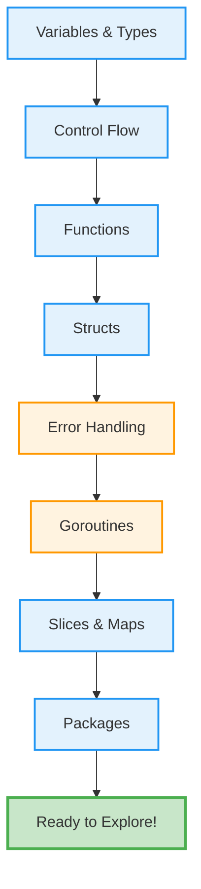

# Golang Quick Start

**Want to get productive with Go fast?** This Quick Start teaches you the essential syntax and core patterns you need to read Go code and try simple examples independently. In just **1-2 hours**, you'll understand Go's approach to simplicity and concurrency.

For comprehensive coverage and hands-on practice, see the [Complete Beginner's Guide](./tu-soen-prla-gola__beginner.md). For practical patterns and recipes, check out the [Golang Cookbook](./tu-soen-prla-gola__cookbook.md).

## 🗺️ Go Learning Touchpoints

This Quick Start gives you exposure to Go's core concepts in order of importance:



Each section introduces ONE essential concept with ONE example. After completing all touchpoints, you'll understand Go's philosophy and can start experimenting independently.

## 📋 Prerequisites

- Basic programming knowledge in any language
- Go installed (version 1.23.4 or later from [go.dev/dl](https://go.dev/dl))

## 🔤 Variables and Types

Go has simple, explicit type declarations. Here's what you need to know:

```go
package main

import "fmt"

func main() {
	// Explicit declaration
	var name string = "Alice"
	var age int = 30

	// Type inference (compiler figures out the type)
	var city = "Jakarta"

	// Short declaration (inside functions only)
	country := "Indonesia"

	// Constants
	const maxRetries = 3

	fmt.Println(name, age, city, country, maxRetries)
	// Output: Alice 30 Jakarta Indonesia 3
}
```

**Key Types**:

- `string` - Text
- `int` - Whole numbers
- `float64` - Decimal numbers
- `bool` - True/false
- `rune` - Single Unicode character

Zero values: Variables without explicit values get defaults (`0` for numbers, empty string `""` for strings, `false` for booleans, `nil` for pointers).

---

## 🔄 Control Flow

Go has `if`, `switch`, and `for` loops. No `while` or `do-while`:

```go
package main

import "fmt"

func main() {
	// If/else
	age := 18
	if age >= 18 {
		fmt.Println("Adult")
	} else {
		fmt.Println("Minor")
	}

	// Switch
	day := "Monday"
	switch day {
	case "Monday":
		fmt.Println("Start of week")
	case "Friday":
		fmt.Println("TGIF!")
	default:
		fmt.Println("Regular day")
	}

	// For loop (traditional)
	for i := 0; i < 3; i++ {
		fmt.Println(i) // Prints: 0, 1, 2
	}

	// For loop (range over slice)
	numbers := []int{10, 20, 30}
	for index, value := range numbers {
		fmt.Printf("Index %d: %d\n", index, value)
	}
}
```

---

## 🔧 Functions

Functions are Go's basic building blocks:

```go
package main

import "fmt"

// Simple function
func greet(name string) string {
	return "Hello, " + name
}

// Multiple return values (Go's error handling style)
func divide(a, b float64) (float64, error) {
	if b == 0 {
		return 0, fmt.Errorf("cannot divide by zero")
	}
	return a / b, nil
}

func main() {
	fmt.Println(greet("Alice"))

	result, err := divide(10, 2)
	if err != nil {
		fmt.Println("Error:", err)
	} else {
		fmt.Println("Result:", result)
	}
}
```

**Key Points**:

- Parameters have types: `name string`, `age int`
- Multiple return values are common in Go
- Error handling uses `error` return type and `if err != nil` pattern

---

## 📦 Simple Structs

Structs group related data together:

```go
package main

import "fmt"

// Define a struct
type Person struct {
	Name string
	Age  int
	City string
}

func main() {
	// Create and initialize
	alice := Person{
		Name: "Alice",
		Age:  30,
		City: "Jakarta",
	}

	// Access fields
	fmt.Println(alice.Name)  // Alice
	fmt.Println(alice.Age)   // 30

	// Modify fields
	alice.Age = 31
	fmt.Println(alice)
	// Output: {Alice 31 Jakarta}
}
```

Structs are useful for bundling related values together. You'll learn methods and embedding later in the Beginner tutorial.

---

## ⚠️ Basic Error Handling

Go uses explicit error handling. Functions return errors as values:

```go
package main

import (
	"fmt"
	"strconv"
)

func main() {
	// Standard library functions return (value, error)
	num, err := strconv.Atoi("42")
	if err != nil {
		fmt.Println("Error:", err)
		return
	}

	fmt.Println("Number:", num) // Number: 42

	// Custom errors
	result, err := processData("invalid")
	if err != nil {
		fmt.Println("Failed:", err)
	}
}

// Function that returns an error
func processData(input string) (int, error) {
	if input == "invalid" {
		return 0, fmt.Errorf("invalid input: %s", input)
	}
	return 42, nil
}
```

**Pattern**: `if err != nil { ... }` is the standard way to check for errors.

---

## 🚀 Goroutines (Intro)

Goroutines are lightweight concurrency. Think of them as "cheap threads":

```go
package main

import (
	"fmt"
	"time"
)

func work(name string) {
	for i := 0; i < 3; i++ {
		fmt.Println(name, "working", i)
		time.Sleep(100 * time.Millisecond)
	}
	fmt.Println(name, "done")
}

func main() {
	// Launch two goroutines (concurrent execution)
	go work("Worker 1")
	go work("Worker 2")

	// Wait for goroutines to finish
	time.Sleep(1 * time.Second)
	fmt.Println("Main finished")
}
```

The `go` keyword launches a function concurrently. This is Go's superpower—concurrency is built-in and simple to use.

---

## 📋 Slices and Maps

Collections for storing multiple values:

```go
package main

import "fmt"

func main() {
	// Slice (dynamic array)
	fruits := []string{"apple", "banana", "cherry"}
	fruits = append(fruits, "date") // Add element

	for _, fruit := range fruits {
		fmt.Println(fruit)
	}

	// Map (key-value store)
	scores := map[string]int{
		"Alice": 90,
		"Bob":   85,
		"Carol": 92,
	}

	fmt.Println(scores["Alice"]) // 90

	// Iterate over map
	for name, score := range scores {
		fmt.Printf("%s: %d\n", name, score)
	}
}
```

Slices are ordered, maps are not. Both are essential for most Go programs.

---

## 📚 Packages and Imports

Go code is organized in packages. Import standard library packages as needed:

```go
package main

import (
	"fmt"     // Formatting and printing
	"strconv" // String conversion
	"time"    // Time functions
)

func main() {
	// Use functions from imported packages
	fmt.Println("Hello")

	now := time.Now()
	fmt.Println("Current time:", now)

	num, _ := strconv.Atoi("42")
	fmt.Println("Parsed:", num)
}
```

Key standard library packages:

- `fmt` - Printing and formatting
- `strings` - String manipulation
- `time` - Time and dates
- `strconv` - String conversion
- `math` - Mathematical functions
- `os` - Operating system functions

---

## ✅ Next Steps

You now have touchpoints across Go's core concepts! To deepen your knowledge:

1. **Try the examples**: Copy and run each code snippet. Modify them and experiment.
2. **Read the docs**: Visit [go.dev/doc](https://go.dev/doc) to explore in depth.
3. **Complete the Beginner tutorial**: [Complete Beginner's Guide to Go](./tu-soen-prla-gola__beginner.md) covers everything comprehensively (3-4 hours) with:
   - Methods, interfaces, and embedding
   - Comprehensive error handling and wrapping
   - Advanced concurrency patterns
   - Testing and benchmarking
   - 4 levels of practice exercises

4. **Use the Cookbook**: [Golang Cookbook](./tu-soen-prla-gola__cookbook.md) provides recipes for common patterns when you hit real-world problems.

## 🎯 Self-Assessment

After completing this Quick Start, you should be able to:

- [ ] Read and understand basic Go syntax
- [ ] Write simple functions with proper parameter and return types
- [ ] Handle errors with the `if err != nil` pattern
- [ ] Use slices and maps to store collections
- [ ] Create and use structs to bundle related data
- [ ] Launch goroutines for concurrent execution
- [ ] Understand Go's approach to simplicity and concurrency

If you can do these, you're ready to explore Go code and try simple examples independently!
