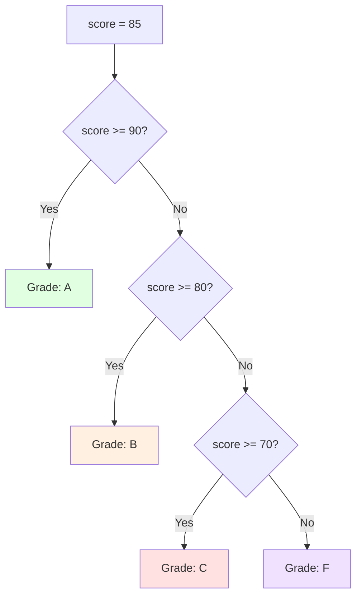

# Java Quick Start

**Learn enough Java to explore independently in 1-2 hours.** This tutorial gives you a quick tour of Java's essential features. You'll explore variables, methods, classes, collections, and error handling through practical examples. Perfect for getting a quick overview before diving into comprehensive learning.

## What You'll Achieve

By the end of this tutorial (1-2 hours), you'll be able to:

- ✅ Understand Java's basic data types and variables
- ✅ Write and call methods (functions)
- ✅ Create simple classes and objects
- ✅ Use collections (ArrayList, HashMap)
- ✅ Handle basic errors with try-catch
- ✅ Read simple Java code and understand what it does
- ✅ Know what to learn next for deeper expertise

## Prerequisites

- Completed [Initial Setup for Java](./tu-se-pl-ja__initial-setup.md) - You have Java installed and can compile/run programs
- Or just run the Initial Setup tutorial first (15 minutes)

## Learning Path

This Quick Start covers **5-30% of Java knowledge**. It's a **breadth-first** approach - touching all major topics shallowly. For each concept, we show:

1. **Syntax** - How to write it
2. **Example** - Real code
3. **What it does** - Brief explanation
4. **Where to learn more** - Reference to Beginner tutorial for depth

**Note**: This is NOT comprehensive. For thorough learning, see [Complete Beginner's Guide to Java](./tu-se-pl-ja__beginner.md).

---

## 1. Variables and Data Types

Java is **strongly typed** - every variable has a declared type.

### Example: Basic Variables

```java
public class Variables {
    public static void main(String[] args) {
        // Integer types
        int age = 25;
        long population = 8000000000L;  // "L" suffix for long

        // Floating point
        double price = 19.99;
        float discount = 0.1f;          // "f" suffix for float

        // Text and logic
        String name = "Alice";
        boolean isActive = true;

        // Character
        char grade = 'A';

        System.out.println(name + " is " + age + " years old");
        System.out.println("Price: $" + price);
    }
}
```

### What's Happening

- **`int`** - 32-bit whole numbers (most common for counting)
- **`long`** - 64-bit whole numbers (large values like population)
- **`double`** - 64-bit decimals (most common for math)
- **`float`** - 32-bit decimals (rarely used, requires "f" suffix)
- **`String`** - Text (special type, not primitive)
- **`boolean`** - true/false logic
- **`char`** - Single character

Use `double` for decimals. Use `int` for whole numbers. Use `String` for text.

**Learn more**: See Beginner tutorial section "Primitive Types and Variables" for complete coverage.

---

## 2. Operations and Expressions

### Example: Math and Logic

```java
public class Operations {
    public static void main(String[] args) {
        int x = 10, y = 3;

        // Arithmetic
        System.out.println(x + y);        // 13 (addition)
        System.out.println(x - y);        // 7 (subtraction)
        System.out.println(x * y);        // 30 (multiplication)
        System.out.println(x / y);        // 3 (division, integer result)
        System.out.println(x % y);        // 1 (remainder/modulo)

        // Comparison
        boolean isGreater = x > y;        // true
        boolean isEqual = x == y;         // false
        boolean isNotEqual = x != y;      // true

        // Logic (and, or, not)
        boolean result = (x > 5) && (y < 5);  // true AND true = true
        boolean other = (x < 5) || (y > 0);   // false OR true = true
        boolean not = !(x > y);                // NOT true = false

        System.out.println(result);
    }
}
```

### Key Operators

- **Arithmetic**: `+`, `-`, `*`, `/`, `%`
- **Comparison**: `==`, `!=`, `<`, `>`, `<=`, `>=`
- **Logic**: `&&` (AND), `||` (OR), `!` (NOT)
- **Increment/Decrement**: `x++`, `x--`, `++x`, `--x`

**Learn more**: See Beginner tutorial section "Operators and Expressions" for full details.

---

## 3. Control Flow

### Decision Tree Visualization

Here's how if/else makes decisions:



### Example: If/Else and Loops

```java
public class ControlFlow {
    public static void main(String[] args) {
        int score = 85;

        // If/else
        if (score >= 90) {
            System.out.println("Grade: A");
        } else if (score >= 80) {
            System.out.println("Grade: B");
        } else if (score >= 70) {
            System.out.println("Grade: C");
        } else {
            System.out.println("Grade: F");
        }

        // For loop
        System.out.println("Counting: ");
        for (int i = 1; i <= 5; i++) {
            System.out.println(i);
        }

        // While loop
        int count = 0;
        while (count < 3) {
            System.out.println("Loop " + count);
            count++;
        }
    }
}
```

### Control Structures

- **`if`/`else if`/`else`** - Conditional execution
- **`for` loop** - Loop a fixed number of times
- **`while` loop** - Loop while a condition is true
- **`break`** - Exit a loop early
- **`continue`** - Skip to next iteration

**Learn more**: See Beginner tutorial section "Control Flow" for switch statements and do-while loops.

---

## 4. Methods (Functions)

### Example: Writing and Calling Methods

```java
public class Methods {
    // Method that returns a value
    public static int add(int a, int b) {
        return a + b;
    }

    // Method that returns text
    public static String greet(String name) {
        return "Hello, " + name + "!";
    }

    // Method that doesn't return anything
    public static void printMultiplicationTable(int n) {
        for (int i = 1; i <= 10; i++) {
            System.out.println(n + " x " + i + " = " + (n * i));
        }
    }

    public static void main(String[] args) {
        int result = add(5, 3);                  // 8
        String message = greet("Alice");         // "Hello, Alice!"
        printMultiplicationTable(7);

        System.out.println(result);
        System.out.println(message);
    }
}
```

### Method Parts

- **`public static`** - Modifiers (more on this in Beginner)
- **Return type** - `int`, `String`, `void` (no return), etc.
- **Method name** - `add`, `greet`, `printMultiplicationTable`
- **Parameters** - Values in parentheses: `(int a, int b)`
- **Body** - Code in braces
- **`return`** - Send value back to caller (optional if return type is `void`)

Methods let you reuse code and organize logic.

**Learn more**: See Beginner tutorial section "Methods and Functions" for static/instance methods, overloading, and best practices.

---

## 5. Classes and Objects

### Example: Simple Class

```java
public class Person {
    // Fields (data)
    public String name;
    public int age;

    // Constructor (creates objects)
    public Person(String name, int age) {
        this.name = name;
        this.age = age;
    }

    // Method (behavior)
    public void introduce() {
        System.out.println("Hi, I'm " + name +
                          " and I'm " + age + " years old");
    }

    public int yearsUntilRetirement() {
        return 65 - age;
    }
}

// Using the class
public class ClassExample {
    public static void main(String[] args) {
        Person alice = new Person("Alice", 30);
        Person bob = new Person("Bob", 25);

        alice.introduce();
        bob.introduce();

        System.out.println(alice.name + " has " +
                          alice.yearsUntilRetirement() +
                          " years until retirement");
    }
}
```

### Class Concepts

- **Class** - Blueprint for objects (like a template)
- **Fields** - Data belonging to an object
- **Constructor** - Special method that creates objects
- **`new`** - Creates an instance (object) of a class
- **Methods** - Functions that objects can perform
- **`this`** - Refers to the current object

Classes are the foundation of Java's object-oriented approach.

**Learn more**: See Beginner tutorial section "Classes and Objects" for encapsulation, inheritance, and static vs instance members.

---

## 6. Collections: ArrayList and HashMap

### Example: ArrayList (List of Items)

```java
import java.util.ArrayList;

public class ListExample {
    public static void main(String[] args) {
        // Create a list of strings
        ArrayList<String> fruits = new ArrayList<>();

        // Add items
        fruits.add("apple");
        fruits.add("banana");
        fruits.add("cherry");

        // Access by index (0-based)
        System.out.println(fruits.get(0));      // "apple"

        // Loop through all items
        for (String fruit : fruits) {
            System.out.println(fruit);
        }

        // Check size
        System.out.println("Count: " + fruits.size());  // 3

        // Remove an item
        fruits.remove("banana");
        System.out.println("Count: " + fruits.size());  // 2
    }
}
```

### Example: HashMap (Key-Value Pairs)

```java
import java.util.HashMap;

public class MapExample {
    public static void main(String[] args) {
        // Create a map of student grades
        HashMap<String, Integer> grades = new HashMap<>();

        // Add entries
        grades.put("Alice", 95);
        grades.put("Bob", 87);
        grades.put("Charlie", 92);

        // Look up a value
        System.out.println("Alice's grade: " + grades.get("Alice"));  // 95

        // Loop through all entries
        for (String student : grades.keySet()) {
            int grade = grades.get(student);
            System.out.println(student + ": " + grade);
        }

        // Check if key exists
        if (grades.containsKey("David")) {
            System.out.println(grades.get("David"));
        } else {
            System.out.println("David not found");
        }

        // Remove an entry
        grades.remove("Bob");
    }
}
```

### Collections

- **`ArrayList<Type>`** - Ordered list (add, remove, get by index)
- **`HashMap<Key, Value>`** - Key-value pairs (fast lookup by key)
- **`<Type>`** - Generic type (what the collection contains)

Collections handle groups of items efficiently.

**Learn more**: See Beginner tutorial section "Collections Framework" for HashSet, TreeMap, and advanced patterns.

---

## 7. Exception Handling

### Example: Try-Catch

```java
public class ExceptionExample {
    public static void main(String[] args) {
        // Divide by zero would crash normally
        try {
            int[] numbers = {10, 20, 30};
            System.out.println(numbers[5]);  // Index doesn't exist!
        } catch (ArrayIndexOutOfBoundsException e) {
            System.out.println("Error: Index out of bounds");
            System.out.println("Details: " + e.getMessage());
        }

        // Convert string to number
        try {
            String text = "not-a-number";
            int number = Integer.parseInt(text);
        } catch (NumberFormatException e) {
            System.out.println("Error: Could not convert to number");
        }

        // Finally block always runs
        try {
            int result = 10 / 0;  // Division by zero
        } catch (ArithmeticException e) {
            System.out.println("Error: " + e.getMessage());
        } finally {
            System.out.println("This always runs");
        }
    }
}
```

### Exception Handling

- **`try`** - Code that might throw an error
- **`catch`** - Handle specific errors
- **`finally`** - Code that always runs (cleanup)
- **Exception** - An error that disrupts normal flow

Proper error handling makes programs more robust.

**Learn more**: See Beginner tutorial section "Exception Handling" for custom exceptions and best practices.

---

## 8. String Operations

### Example: Working with Strings

```java
public class StringExample {
    public static void main(String[] args) {
        String text = "Hello, Java!";

        // Length
        System.out.println(text.length());           // 12

        // Character at position
        System.out.println(text.charAt(0));          // 'H'

        // Substring
        System.out.println(text.substring(0, 5));    // "Hello"

        // Case conversion
        System.out.println(text.toLowerCase());      // "hello, java!"
        System.out.println(text.toUpperCase());      // "HELLO, JAVA!"

        // Contains/Find
        System.out.println(text.contains("Java"));   // true
        System.out.println(text.indexOf("Java"));    // 7

        // Replace
        System.out.println(text.replace("Java", "World"));  // "Hello, World!"

        // Split into array
        String csv = "apple,banana,cherry";
        String[] fruits = csv.split(",");
        for (String fruit : fruits) {
            System.out.println(fruit);
        }

        // String concatenation
        String greeting = "Hello" + " " + "World";
        String formatted = String.format("Age: %d, Name: %s", 25, "Alice");
        System.out.println(formatted);
    }
}
```

### String Methods

Common operations: `length()`, `charAt()`, `substring()`, `toLowerCase()`, `toUpperCase()`, `contains()`, `indexOf()`, `replace()`, `split()`, `trim()`

**Learn more**: See Beginner tutorial section "Strings and Text Processing" for StringBuilder, regex, and formatting.

---

## 9. Input from User

### Example: Reading User Input

```java
import java.util.Scanner;

public class InputExample {
    public static void main(String[] args) {
        // Create a Scanner to read input
        Scanner scanner = new Scanner(System.in);

        // Read a string
        System.out.print("Enter your name: ");
        String name = scanner.nextLine();

        // Read an integer
        System.out.print("Enter your age: ");
        int age = scanner.nextInt();

        // Read a double
        System.out.print("Enter your height (meters): ");
        double height = scanner.nextDouble();

        System.out.println(name + " is " + age +
                          " years old and " + height + "m tall");

        // Important: Close the scanner when done
        scanner.close();
    }
}
```

### Scanner Usage

- **`nextLine()`** - Read a whole line of text
- **`nextInt()`** - Read an integer
- **`nextDouble()`** - Read a decimal number
- **`close()`** - Always close when done

**Learn more**: See Beginner tutorial for file I/O and more advanced input handling.

---

## 10. Putting It Together: A Simple Program

### Example: Student Grade Calculator

```java
import java.util.HashMap;
import java.util.Scanner;

public class GradeCalculator {
    public static double calculateAverage(int[] grades) {
        int sum = 0;
        for (int grade : grades) {
            sum += grade;
        }
        return (double) sum / grades.length;
    }

    public static String getLetterGrade(double average) {
        if (average >= 90) return "A";
        if (average >= 80) return "B";
        if (average >= 70) return "C";
        if (average >= 60) return "D";
        return "F";
    }

    public static void main(String[] args) {
        Scanner scanner = new Scanner(System.in);
        HashMap<String, Double> studentGrades = new HashMap<>();

        System.out.println("=== Student Grade Calculator ===");

        // Get student info
        System.out.print("Enter student name: ");
        String name = scanner.nextLine();

        // Get grades
        System.out.print("How many grades? ");
        int count = scanner.nextInt();
        int[] grades = new int[count];

        for (int i = 0; i < count; i++) {
            System.out.print("Grade " + (i + 1) + ": ");
            grades[i] = scanner.nextInt();
        }

        // Calculate and display
        double average = calculateAverage(grades);
        String letterGrade = getLetterGrade(average);

        System.out.println("\nResults for " + name + ":");
        System.out.println("Average: " + String.format("%.2f", average));
        System.out.println("Grade: " + letterGrade);

        scanner.close();
    }
}
```

This program combines:

- Variables and arrays
- Methods
- Control flow (loops, if/else)
- User input with Scanner
- Collections concepts
- String formatting

---

## 🎯 Practice Challenges

Ready to test your knowledge? Try these challenges using the concepts you've learned:

### Challenge 1: Temperature Converter

**Goal**: Create a program that converts Celsius to Fahrenheit

**Requirements**:

- Read a temperature in Celsius from user input
- Calculate Fahrenheit using the formula: F = (C × 9/5) + 32
- Display the result clearly

**Hint**: You'll need Scanner, variables, and arithmetic operators.

### Challenge 2: Name Formatter

**Goal**: Create a program that takes a first and last name and outputs them formatted

**Requirements**:

- Read first name from user
- Read last name from user
- Print three formats:
  1.  "First Last" (normal format)
  2.  "Last, First" (formal format)
  3.  "F. Last" (abbreviated format)

**Hint**: You'll need String methods like `charAt()` and string concatenation.

### Challenge 3: Simple Calculator

**Goal**: Build a program that performs basic math operations

**Requirements**:

- Read two numbers from the user
- Read an operation (+, -, \*, /)
- Perform the calculation
- Display the result
- Handle division by zero

**Hint**: You'll need if/else statements for the operation selection.

### Challenge 4: Grade Calculator

**Goal**: Create a program that stores student grades and calculates the average

**Requirements**:

- Read 3 grades from the user
- Store them in an array
- Calculate and display the average
- Display a letter grade (A: 90+, B: 80-89, C: 70-79, F: below 70)

**Hint**: You'll need arrays, loops, and conditional logic.

### Challenge 5: Product Inventory (Advanced)

**Goal**: Build a simple inventory system

**Requirements**:

- Create a HashMap to store product names and prices
- Add 3 products to the inventory
- Allow the user to look up a product price
- Calculate the total value of all inventory
- Display a summary

**Hint**: You'll need HashMap methods like `put()`, `get()`, and `values()`.

**These challenges consolidate all concepts from this Quick Start tutorial. Start with Challenge 1 and work your way up!**

---

## Next Steps: What to Learn Next

### Congratulations! You've covered the basics.

Now you have two paths:

**Path 1: Dive Deeper (Recommended)**

Continue with [Complete Beginner's Guide to Java](./tu-se-pl-ja__beginner.md) (3-4 hours) to learn:

- Object-oriented principles (inheritance, polymorphism, interfaces)
- Collections Framework comprehensively
- Exception handling best practices
- Testing with JUnit 5
- Streams and functional programming
- Practice projects

**Path 2: Practical Exploration**

Use [Java Cookbook](./tu-se-pl-ja__cookbook.md) for recipes you need right now. The cookbook has common patterns and solutions you can copy and adapt.

### Key Concepts to Explore

When you're ready for depth:

1. **Object-Oriented Programming** - Inheritance, polymorphism, encapsulation
2. **Collections Framework** - All data structures and when to use them
3. **Exception Handling** - Best practices and custom exceptions
4. **Testing** - Writing tests with JUnit 5
5. **Streams and Lambdas** - Functional programming in Java
6. **Build Tools** - Maven or Gradle for managing projects

### Resources

- **[Oracle Java Documentation](https://docs.oracle.com/en/java/javase/21/)** - Official reference
- **[Java Language Specification](https://docs.oracle.com/javase/specs/)** - Complete language details

---

## Quick Reference Cheat Sheet

| Concept   | Example                                                 |
| --------- | ------------------------------------------------------- |
| Variable  | `int age = 25;`                                         |
| Method    | `public static int add(int a, int b) { return a + b; }` |
| Class     | `public class Person { ... }`                           |
| Object    | `Person p = new Person("Alice", 30);`                   |
| ArrayList | `ArrayList<String> list = new ArrayList<>();`           |
| HashMap   | `HashMap<String, Integer> map = new HashMap<>();`       |
| Try-Catch | `try { ... } catch (Exception e) { ... }`               |
| Loop      | `for (int i = 0; i < 10; i++) { ... }`                  |
| Condition | `if (x > 5) { ... }`                                    |

---

**Quick Start Complete!** You now understand Java's core concepts. Choose your next step above based on whether you want comprehensive learning or practical recipes.
