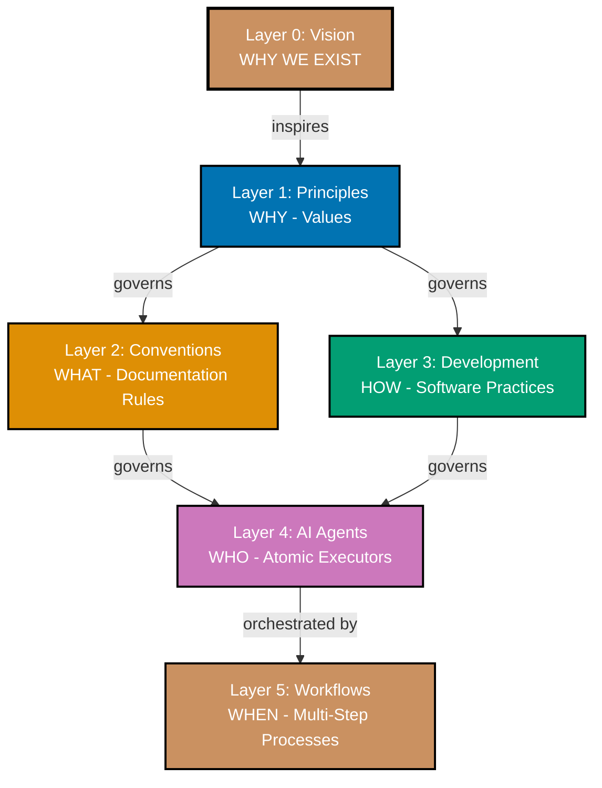

# Rules - Repository Governance

This directory contains all governance layers that define WHY the project exists, WHAT we value, WHAT documentation standards we follow, HOW we develop software, and WHEN we orchestrate multi-step processes.

All governance content is organized under this `governance/` directory for clear semantic grouping while maintaining the six-layer architecture terminology.

## 🎯 Purpose

The `governance/` directory groups all governance documentation together:

- **Layer 0: Vision** - WHY we exist, WHAT change we seek
- **Layer 1: Principles** - WHY we value specific approaches
- **Layer 2: Conventions** - WHAT documentation rules we follow
- **Layer 3: Development** - HOW we develop software
- **Layer 5: Workflows** - WHEN we run multi-step orchestrated processes

See [Repository Governance Architecture](./repository-governance-architecture.md) for complete explanation of the six-layer architecture, layer characteristics, traceability examples, and usage guidance.

## 📊 Six-Layer Architecture



## 📋 Contents

### Core Governance Layers

#### Layer 0: Vision (WHY WE EXIST)

- **[Vision](./vision/README.md)** - Foundational purpose establishing WHY the project exists
  - Democratize Shariah-compliant enterprise
  - Make ethical Islamic business solutions accessible to everyone
  - Nearly immutable - changes only if mission fundamentally shifts

#### Layer 1: Principles (WHY - Values)

- **[Core Principles](./principles/README.md)** - Foundational values that govern all lower layers
  - 10 principles across 3 categories (General, Content, Software Engineering)
  - Each principle traces back to vision with "Vision Supported" section
  - Examples: Simplicity Over Complexity, Accessibility First, Documentation First, Automation Over Manual

#### Layer 2: Conventions (WHAT - Documentation Rules)

- **[Conventions](./conventions/README.md)** - Documentation writing and organization standards
  - 24 conventions across 6 categories (formatting, content, tutorial, hugo, meta, project)
  - Implements principles in concrete documentation rules
  - Each convention includes "Principles Implemented/Respected" section
  - Enforced by AI agents (docs**checker, docs**maker, etc.)

#### Layer 3: Development (HOW - Software Practices)

- **[Development](./development/README.md)** - Software development practices and workflows
  - 15 practices across 6 categories (workflow, quality, pattern, agents, infra, hugo)
  - Implements principles in concrete software standards
  - Each practice includes "Principles Implemented/Respected" AND "Conventions Implemented/Respected" sections
  - Enforced by AI agents and automation (git hooks, build tools)

#### Layer 5: Workflows (WHEN - Multi-Step Processes)

- **[Workflows](./workflows/README.md)** - Orchestrated multi-step processes composing AI agents
  - 13 workflows across 5 categories (ayokoding-web, docs, meta, plan, wow)
  - Define sequences (sequential/parallel/conditional), state management, termination criteria
  - Examples: Maker-Checker-Fixer, Plan-Execute-Validate
  - Orchestrate agents from Layer 4

### Architecture Documentation

- **[Repository Governance Architecture](./repository-governance-architecture.md)** - Comprehensive guide to the six-layer architecture
  - Complete layer characteristics and relationships
  - Traceability examples showing Vision → Principles → Conventions/Development → Agents → Workflows
  - Usage guidance for creating, changing, and troubleshooting governance content
  - Verification methods and validation approaches

## 🔗 Traceability Example

Every rule in this repository traces back to foundational vision and principles:

```
Vision: Democratize Shariah-compliant enterprise (accessible to everyone)
    ↓ inspires
Principle: Accessibility First (Layer 1)
    ↓ governs
Convention: Color Accessibility (Layer 2) - verified accessible palette
Development: Hugo Development (Layer 3) - semantic HTML, ARIA labels
    ↓ implemented by
Agents: docs__checker, docs__fixer (Layer 4) - validate/fix colors
    ↓ orchestrated by
Workflow: Maker-Checker-Fixer (Layer 5) - automated quality gate
```

## 🧪 Layer Test: Where Does My Document Belong?

Use these questions to determine the correct subdirectory:

### Vision Test

**Question**: Does this document define WHY the project exists?

- ✅ **YES** → Place in `governance/vision/`
- ❌ **NO** → Continue to next test

### Principles Test

**Question**: Can you ask "**WHY do we value this?**" about the content?

- ✅ **YES** → Place in `governance/principles/` - It's a foundational value
- ❌ **NO** → Continue to next test

### Conventions Test

**Question**: Can you ask "**WHAT are the documentation rules?**" about the content?

- ✅ **YES** → Place in `governance/conventions/` - It's a documentation standard
- ❌ **NO** → Continue to next test

### Development Test

**Question**: Can you ask "**HOW do we develop software?**" about the content?

- ✅ **YES** → Place in `governance/development/` - It's a software practice
- ❌ **NO** → Continue to next test

### Workflows Test

**Question**: Can you ask "**WHEN do we orchestrate multiple agents?**" about the content?

- ✅ **YES** → Place in `governance/workflows/` - It's a multi-step process
- ❌ **NO** → It doesn't belong in governance/ - consider how-to/ or reference/

## 📐 Quick Decision Tree

```
Is it about WHY the project exists?
├─ YES → vision/
└─ NO → Is it about WHY we value something?
    ├─ YES → principles/
    └─ NO → Is it about WHAT documentation rules?
        ├─ YES → conventions/
        └─ NO → Is it about HOW to develop software?
            ├─ YES → development/
            └─ NO → Is it about WHEN to orchestrate agents?
                ├─ YES → workflows/
                └─ NO → Wrong category (try how-to/ or reference/)
```

## 🔑 Key Principles

### Immutability Decreases Down the Layers

- **Layer 0 (Vision)**: Nearly immutable - only changes if mission fundamentally shifts
- **Layer 1 (Principles)**: Very stable - rarely change, require strong justification
- **Layer 2 (Conventions)**: Moderately stable - change when documentation needs evolve
- **Layer 3 (Development)**: Moderately stable - change when software practices evolve
- **Layer 5 (Workflows)**: Changes frequently - new workflows as needs emerge

### Traceability is Mandatory

- **Principles** → MUST include "Vision Supported" section
- **Conventions** → MUST include "Principles Implemented/Respected" section
- **Development** → MUST include both "Principles" AND "Conventions" sections
- **Workflows** → MUST reference which agents they orchestrate

### Changes Propagate Down

When changing a layer, all lower layers may need updates. Use `repo-governance-maker` to propagate changes systematically.

---

**Last Updated**: 2026-01-04
