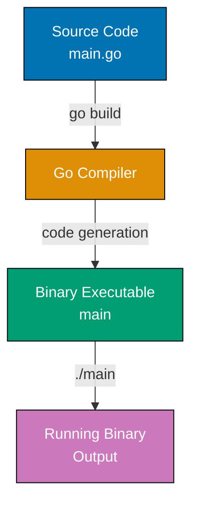
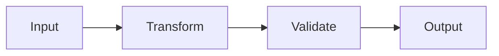
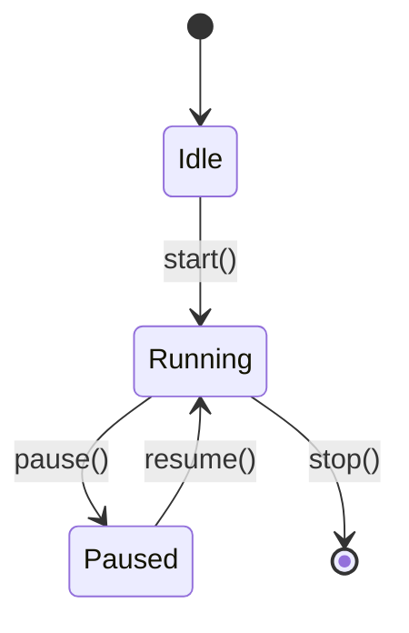
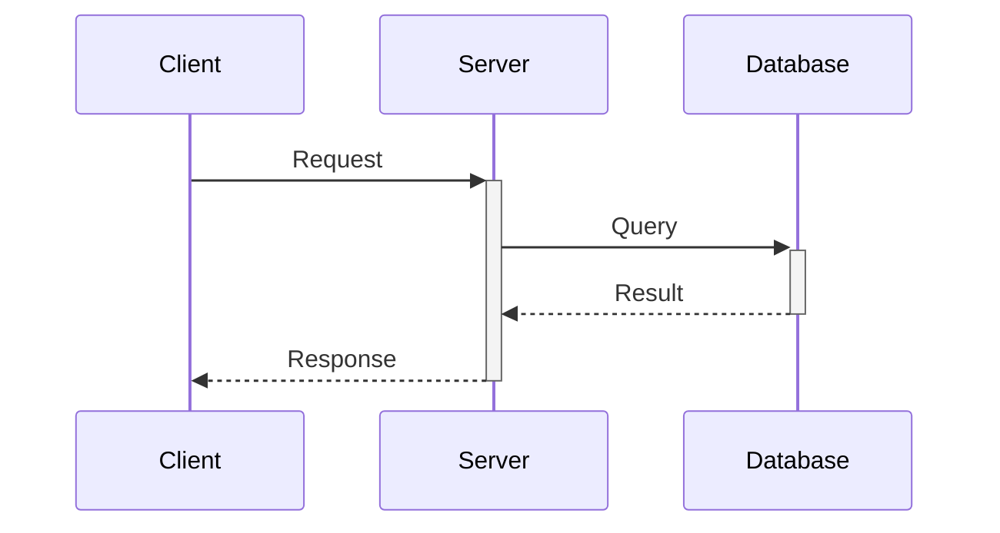
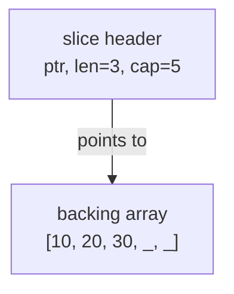
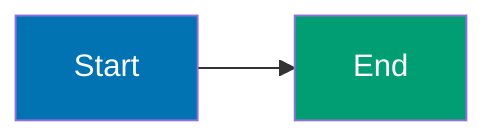

## Purpose

This convention **extends the [Tutorials Convention](./general.md) for the By Example tutorial type**, defining specialized standards for code-first learning through 75-85 heavily annotated, self-contained, runnable examples achieving 95% coverage.

**Base requirements**: By-example tutorials inherit general tutorial standards (learning-oriented approach, visual completeness, hands-on elements from [Tutorials Convention](./general.md)) and add code-specific specializations defined below.

**Target audience**: Experienced developers (seasonal programmers, software engineers) switching languages or frameworks who prefer learning through working code rather than narrative explanations.

## Structure Integration with General Tutorial Standards

By-example tutorials adapt the general [Tutorial Convention](./general.md) structure for code-first learning:

### Adaptation of General Structure

**Traditional Tutorial Structure** (from [Tutorials Convention](./general.md)):

- Introduction → Prerequisites → Objectives → Content Sections → Challenges → Summary → Next Steps

**By-Example Structure Adaptation**:

1. **overview.md** (serves as introduction):
   - Hook and motivation (why this language/framework matters)
   - Prerequisites (required programming experience level)
   - Learning approach explanation (code-first via 75-85 examples)
   - Comparison to by-concept path (narrative-driven alternative)
   - Links to by-concept tutorials for those preferring comprehensive explanations

2. **beginner.md / intermediate.md / advanced.md** (replace traditional content sections):
   - Contains 75-85 annotated examples across three complexity levels
   - Each example is self-contained and runnable (not sequential sections)
   - Examples progress from fundamental syntax (beginner) to expert mastery (advanced)
   - Coverage: beginner (0-40%), intermediate (40-75%), advanced (75-95%)

3. **Hands-on elements integrated into examples**:
   - No separate "Challenges" section - each example IS a hands-on exercise
   - Self-contained code means learners can copy, run, and modify immediately
   - Educational annotations guide experimentation

4. **Summary and next steps** (included in overview.md or advanced.md):
   - Links to by-concept path for deeper narrative explanations
   - Links to related frameworks/tools
   - Production application guidance

### Inherited Requirements from General Tutorial Convention

By-example tutorials MUST follow these general tutorial standards:

- PASS: **Learning-oriented approach** (Diátaxis framework): Teach through experience, not just reference
- PASS: **Progressive Disclosure**: Complexity increases gradually (beginner → intermediate → advanced)
- PASS: **Visual completeness**: Diagrams when appropriate (30-50% of examples)
- PASS: **Hands-on elements**: Every example is runnable code (inherently hands-on)
- PASS: **No time estimates**: Use coverage percentages (0-40%, 40-75%, 75-95%), not time
- PASS: **Accessibility**: Color-blind friendly diagrams, clear structure
- PASS: **Real-world relevance**: "Why It Matters" sections connect to production use

### Specialized Requirements for By-Example

Beyond general tutorial standards, by-example adds:

- PASS: **Annotation density**: 1-2.25 comment lines per code line (reduce if > 2.5)
- PASS: **Self-containment**: Examples runnable within chapter scope
- PASS: **Five-part structure**: Explanation → Diagram → Annotated Code → Takeaway → Why It Matters
- PASS: **Coverage target**: 95% through 75-85 examples (higher than other tutorial types)
- PASS: **Code-first approach**: Show code first, explain through annotations

## Core Characteristics

### 1. Code-First Approach

**Philosophy**: Show the code first, run it second, understand through direct interaction.

Examples prioritize:

- Working, runnable code over explanatory text
- Inline annotations over separate documentation
- Immediate execution over theoretical discussion
- Pattern demonstration over concept explanation

### 2. Coverage Target: 95%

**What 95% means**: Depth and breadth of language/framework features needed for production work.

**Included in 95%**:

- Core syntax and semantics
- Standard library essentials
- Production patterns and best practices
- Common frameworks and tools
- Modern language features
- Testing and debugging
- Concurrency and parallelism
- Error handling patterns
- Performance considerations

**Excluded from 95% (the remaining 5%)**:

- Rare edge cases
- Framework internals and source code
- Specialized libraries outside standard use
- Language implementation details
- Platform-specific advanced features
- Deprecated features

**Coverage verification**: The ayokoding-web-by-example-checker agent validates coverage against comprehensive checklists for each language/framework.

### 3. Example Count: 75-85 Total

**Target range**: 75-85 examples per language or framework

**Distribution across levels**:

- **Beginner**: 27-30 examples (0-40% coverage) - Fundamentals and syntax
- **Intermediate**: 25-30 examples (40-75% coverage) - Production patterns
- **Advanced**: 25-28 examples (75-95% coverage) - Expert mastery

**Actual ranges observed in production** (ayokoding-web):

- Golang: 85 examples (30/30/25)
- Python: 80 examples (27/27/26)
- Rust: 85 examples (28/29/28)
- Java: 75 examples (30/20/25)
- Kotlin: 81 examples (27/27/27)
- Elixir: 85 examples (30/30/25)
- Clojure: 80 examples (27/27/26)

**Rationale**:

- 75-85 examples provides comprehensive coverage achieving 95% target
- Distribution adapts to language complexity (intermediate can vary 20-30 based on need)
- Beyond 85 becomes maintenance burden without proportional value gain
- Range allows flexibility while maintaining quality bar

## Example Structure

Every example follows a **mandatory five-part format**:

### Part 1: Brief Explanation (2-3 sentences)

**Purpose**: Provide context and motivation

**Must answer**:

- What is this concept/pattern?
- Why does it matter in production code?
- When should you use it?

**Example**:

```markdown
### Example 23: Context-Aware Cancellation

Go's `context` package provides a standardized way to pass cancellation signals, deadlines, and request-scoped values across API boundaries. Context enables graceful shutdown of operations when requests are cancelled or time out, preventing resource leaks in production systems.
```

### Part 2: Mermaid Diagram (when appropriate)

**When to include**:

- Data flow between components is non-obvious
- State transitions need visualization
- Concurrency patterns involve multiple goroutines/processes
- Request/response cycles span multiple layers
- Memory layout or pointer relationships clarify behavior
- Architecture patterns benefit from visual representation

**When NOT to include**:

- Simple syntax demonstrations (variable declaration, basic loops)
- Single-function examples with clear linear flow
- Trivial transformations or calculations

**Diagram requirements**:

- Use color-blind friendly palette: Blue #0173B2, Orange #DE8F05, Teal #029E73, Purple #CC78BC, Brown #CA9161
- Include descriptive labels on nodes and edges
- Keep diagrams focused on the specific concept (avoid overwhelming detail)
- Use appropriate diagram type (graph LR/TD, sequenceDiagram, stateDiagram)

### Part 3: Heavily Annotated Code

**Core requirement**: Every significant line must have an inline comment

**CRITICAL REQUIREMENT: Annotation Density Standard**

- **Density target**: 1-2.25 lines of comment for every line of code
- **Simple lines**: 1 line of annotation (variable declarations, simple operations)
- **Complex lines**: 2 lines of annotation (method calls with multiple effects, state changes)
- **Focus**: Concise explanations that scale naturally with code complexity

**Annotation Quality Over Quantity**:

- Each line of code gets 1-2 lines explaining what it does and why
- Simple lines get brief explanations, complex lines get detailed breakdowns
- Annotations remain focused without repetitive patterns across similar code

**Comment annotations use `// =>` or `# =>` notation**:

```go
x := 10                          // => x is now 10 (type: int)
y := x * 2                       // => y is 20 (x remains unchanged at 10)
result := transform(y)           // => result is "20-transformed" (string)
fmt.Println(result)              // => Output: 20-transformed
```

**Production example from ayokoding-web** (Golang Example 1):

```go
package main // => Declares this is the main executable package
             // => "main" is special - it tells the compiler to create an executable
             // => Other package names (like "utils") create libraries, not executables

import (
    "fmt" // => Import formatting package from standard library
          // => fmt provides I/O formatting functions (Printf, Println, Sprintf, etc.)
          // => Standard library packages are always available, no installation needed
)

func main() { // => Entry point - every executable needs main() in main package
              // => Go runtime calls main() when program starts
              // => No parameters, no return value (unlike C/Java's int main)
              // => Program exits when main() returns

    fmt.Println("Hello, World!") // => Println writes to stdout and adds newline
                                  // => Returns (n int, err error) but we ignore them here
                                  // => n is bytes written, err is write error (if any)
                                  // => Equivalent to: fmt.Fprintln(os.Stdout, "Hello, World!")
    // => Output: Hello, World!
}
```

**Annotation density**: 7 code lines, 15 comment lines = **2.14 density** (within 1-2.25 target)

**Required annotations**:

- **Annotation density**: 1-2.25 lines of comment per line of code
- **Pattern matching**: Document which branch matched and why
- **Execution flow**: Show control flow decisions (which if/case branch taken)

- **Variable states**: Show value and type after assignment
- **Intermediate values**: Document values at each transformation step
- **Function outputs**: Show return values inline
- **Side effects**: Document mutations, I/O operations, state changes
- **Expected outputs**: Show stdout/stderr content with `=> Output:` prefix
- **Timing (compile vs runtime)**: Distinguish compile-time checks from runtime execution
- **Best practices**: Use PASS: GOOD vs FAIL: BAD indicators for pattern comparisons
- **Error cases**: Document when errors occur and how they're handled

**Code organization**:

- Include full imports (no "assume this is imported")
- Define helper functions if needed for self-containment
- Use descriptive variable names (avoid single-letter unless idiomatic)
- Format code with language-standard tools (gofmt, mix format, etc.)

### Part 4: Key Takeaway (1-2 sentences)

**Purpose**: Distill the core insight to its essence

**Must highlight**:

- The most important pattern or concept
- When to apply this in production
- Common pitfalls to avoid

**Example**:

```markdown
**Key Takeaway**: Use `context.WithTimeout` for operations that must complete within a deadline, and always pass context as the first parameter to functions that perform I/O or long-running operations to enable cancellation.
```

### Part 5: Why It Matters (2-3 sentences, 50-100 words)

**Purpose**: Connect the concept to production relevance and real-world impact

**Must explain**:

- Why professionals care about this in real systems (sentence 1: production relevance)
- How it compares to alternatives or what problems it solves (sentence 2: comparative insight)
- Consequences for quality/performance/safety/scalability (sentence 3: practical impact)

**Quality guidelines**:

- **Active voice**: Use concrete, active language
- **Length**: 50-100 words (2-3 sentences)
- **Contextual**: Specific to the concept, NOT generic statements
- **Production-focused**: Reference real usage, companies, or measurable impacts

**Production example from ayokoding-web** (Golang Example 1, 62 words):

```markdown
**Why It Matters**: Single-binary deployment makes Go ideal for containers and microservices, where `go build` produces a statically-linked executable with no runtime dependencies unlike Java (requires JVM) or Python (requires interpreter and packages). Docker containers for Go services are 5-10MB (vs 200MB+ for equivalent Java apps), enabling faster deployments, reduced attack surface, and simplified distribution as a single file that runs anywhere.
```

**Production example from ayokoding-web** (Rust Example 2, 78 words):

```markdown
**Why It Matters**: Microsoft research shows that 70% of security vulnerabilities stem from memory safety issues, many caused by unexpected mutations in concurrent contexts. Rust's immutable-by-default design eliminates data races at compile time—bugs that cost companies millions in C++ codebases—while enabling aggressive compiler optimizations since immutable values can be safely cached and parallelized without locks.
```

---

## Complete Example Structure (Production Reference)

Below is a complete example from ayokoding-web demonstrating all five parts in practice:

### Example 1: Hello World and Go Compilation (Golang)

Go is a compiled language - you write source code, compile it into a binary executable, then run that binary. Understanding this pipeline reveals why Go is fast and portable.



**Code**:

```go
package main // => Declares this is the main executable package
             // => "main" is special - it tells the compiler to create an executable
             // => Other package names (like "utils") create libraries, not executables

import (
    "fmt" // => Import formatting package from standard library
          // => fmt provides I/O formatting functions (Printf, Println, Sprintf, etc.)
          // => Standard library packages are always available, no installation needed
)

func main() { // => Entry point - every executable needs main() in main package
              // => Go runtime calls main() when program starts
              // => No parameters, no return value (unlike C/Java's int main)
              // => Program exits when main() returns

    fmt.Println("Hello, World!") // => Println writes to stdout and adds newline
                                  // => Returns (n int, err error) but we ignore them here
                                  // => n is bytes written, err is write error (if any)
                                  // => Equivalent to: fmt.Fprintln(os.Stdout, "Hello, World!")
    // => Output: Hello, World!
}
```

**Key Takeaway**: Every executable Go program needs `package main` and a `func main()` entry point. The `import` statement brings standard library packages into scope.

**Why It Matters**: Single-binary deployment makes Go ideal for containers and microservices, where `go build` produces a statically-linked executable with no runtime dependencies unlike Java (requires JVM) or Python (requires interpreter and packages). Docker containers for Go services are 5-10MB (vs 200MB+ for equivalent Java apps), enabling faster deployments, reduced attack surface, and simplified distribution as a single file that runs anywhere.

**Analysis of this example**:

- **Part 1 (Brief Explanation)**: 2 sentences explaining compiled language model
- **Part 2 (Diagram)**: Build pipeline visualization with 4 stages
- **Part 3 (Code)**: 7 code lines with 15 comment lines (2.14 density)
- **Part 4 (Key Takeaway)**: 2 sentences on essential requirements
- **Part 5 (Why It Matters)**: 62 words on production benefits

## Self-Containment Rules

**Critical requirement**: Examples must be copy-paste-runnable within their chapter scope.

### Beginner Level Self-Containment

**Rule**: Each example is completely standalone

**Requirements**:

- Full package declaration and imports
- All helper functions defined in-place
- No references to previous examples
- Runnable with single command (go run, iex, java, etc.)

**Example structure**:

```go
package main

import (
    "fmt"
    "strings"
)

// Helper function defined inline
func helper(s string) string {
    return strings.ToUpper(s)
}

func main() {
    result := helper("go")  // => result is "GO"
    fmt.Println(result)     // => Output: GO
}
```

### Intermediate Level Self-Containment

**Rule**: Examples assume beginner concepts but include all necessary code

**Allowed assumptions**:

- Reader knows basic syntax (covered in beginner)
- Reader understands fundamental types and control flow
- Reader can run basic commands

**Requirements**:

- Full imports and necessary helper code
- Can reference beginner concepts conceptually ("as we saw with slices")
- Must be runnable without referring to previous examples
- Include type definitions and setup code needed

### Advanced Level Self-Containment

**Rule**: Examples assume beginner + intermediate knowledge but remain runnable

**Allowed assumptions**:

- Reader knows language fundamentals and production patterns
- Reader understands framework basics and architecture
- Reader can navigate documentation for context

**Requirements**:

- Full runnable code with imports and setup
- Can reference patterns by name ("using the middleware pattern")
- Include all interfaces, types, and configurations needed
- Provide complete example even if building on earlier concepts

### Cross-Reference Guidelines

**Acceptable cross-references**:

```markdown
This builds on the middleware pattern from Example 30, but here's the complete code including the middleware setup...
```

**Unacceptable cross-references**:

```markdown
Use the `handleRequest` function from Example 12 (code not shown).
```

**Golden rule**: If you delete all other examples, this example should still compile and run.

### CRITICAL: Per-Example Annotation Density Measurement

**Density is measured PER INDIVIDUAL EXAMPLE, not as file average**

This is a CRITICAL distinction that affects validation and content creation:

- PASS: **CORRECT**: Each example (Example 1, Example 2, etc.) must individually achieve 1.0-2.25 comment lines per code line
- FAIL: **INCORRECT**: Averaging density across entire file (beginner.md, intermediate.md, advanced.md)

**Why per-example measurement matters**:

1. **Consistent learning experience**: Users learn from individual examples. Every example should have consistent annotation depth.
2. **Quality enforcement**: File averages hide problems - a few over-annotated examples can mask many under-annotated ones.
3. **Fixer precision**: Validation reports must identify which specific examples need more/fewer annotations, not just file totals.

**Validation approach**:

- Measure code lines and comment lines for EACH example separately
- Flag examples below 1.0 density (under-annotated, needs enhancement)
- Flag examples above 2.5 density (over-annotated, needs condensing)
- Target range: 1.0-2.25 per example (optimal educational value)
- File averages are informative but NOT the validation criteria

**Content creation approach**:

When creating examples, ensure EACH example meets density target:

- Simple example (basic variable assignment): ~1.0 density
- Complex example (concurrency with channels): ~2.0-2.25 density
- Do NOT rely on file averages to "balance out" sparse examples

### Where to Place Extensive Explanations

**CRITICAL**: Code block annotations should focus on WHAT the code does and returns. Extensive WHY explanations go in designated markdown text sections.

**Code block purpose** (inside ` ```language ` fence):

- Show WHAT each line does: `x := 10 // => x is now 10 (type: int)`
- Show return values: `result := fn() // => result is "output" (string)`
- Show state changes: `counter++ // => counter is now 5`
- Show outputs: `fmt.Println(x) // => Output: 10`

**Text section purpose** (outside code blocks):

- **Brief Explanation**: WHY this concept matters, WHEN to use it (2-3 sentences)
- **Why It Matters**: Production relevance, comparisons, practical impact (50-100 words)
- **Key Takeaway**: Core insight and common pitfalls (1-2 sentences)

**Anti-pattern** (verbose tutorial-style comments in code):

```go
// Go's goroutines are lightweight threads managed by the Go runtime.
// Unlike OS threads which consume 1MB+ of stack space, goroutines
// start with only 2KB and grow dynamically. This allows Go servers
// to handle 10,000+ concurrent connections on a single machine.
go processRequest(req)  // => Goroutine spawned (runs concurrently)
```

**Correct pattern** (concise code annotations + text sections):

```go
go processRequest(req)  // => Goroutine spawned (runs concurrently with minimal overhead)
```

**Why It Matters**: Goroutines enable servers to handle 10,000+ concurrent connections on a single machine with minimal memory overhead (2KB stack per goroutine vs 1MB+ per thread in Java), making Go the language of choice for high-throughput network services like Kubernetes, Docker, and Prometheus.

**Density control**:

- If code annotations exceed 2.5 density, MOVE explanatory content to text sections
- Keep code annotations focused on state tracking (`// =>` notation)
- Reserve extensive explanations for "Brief Explanation" and "Why It Matters" sections

**Note**: This annotation density standard (1-2.25 per example) is the general [ayokoding-web code annotation standard](../../hugo/ayokoding.md#code-annotation-standards) applied to all content. By-example tutorials follow the same standard as other tutorial types, with additional requirements for self-containment and five-part format.

### Output Annotation Pattern

Use `// =>` or `# =>` to show outputs, states, and intermediate values:

```go
// Variable assignment
age := 25                        // => age is 25 (type: int)

// Transformation
doubled := age * 2               // => doubled is 50 (age still 25)

// Function call with return
greeting := fmt.Sprintf("Age: %d", doubled)
                                 // => greeting is "Age: 50" (string)

// Output to stdout
fmt.Println(greeting)            // => Output: Age: 50

// Multiple returns
result, err := parseValue("42")  // => result is 42, err is nil

// Error case
result, err := parseValue("bad") // => result is 0, err is "invalid input"
```

### State Documentation Pattern

Show how state changes through execution:

```go
// Initial state
counter := 0                     // => counter is 0

// First increment
counter++                        // => counter is now 1

// Conditional modification
if counter > 0 {
    counter *= 10                // => counter is now 10 (condition was true)
}

// Final state
fmt.Println(counter)             // => Output: 10
```

### Collection Annotation Pattern

Show collection contents at each step:

```go
// Initialize
nums := []int{1, 2, 3}           // => nums is [1, 2, 3] (len=3, cap=3)

// Append
nums = append(nums, 4)           // => nums is [1, 2, 3, 4] (len=4, cap=6)

// Slice
subset := nums[1:3]              // => subset is [2, 3] (len=2, cap=5)
                                 // => nums unchanged: [1, 2, 3, 4]

// Modify slice
subset[0] = 99                   // => subset is [99, 3]
                                 // => nums is [1, 99, 3, 4] (backing array shared!)
```

### Concurrency Annotation Pattern

Document goroutine execution and channel operations:

```go
// Channel creation
ch := make(chan int)             // => ch is unbuffered channel (blocks on send until receive)

// Goroutine spawn
go func() {
    ch <- 42                     // => Blocks until main goroutine receives
}()                              // => Goroutine now running concurrently

// Receive
value := <-ch                    // => Blocks until goroutine sends, then value is 42
fmt.Println(value)               // => Output: 42
```

## Mermaid Diagram Guidelines

### When to Include Diagrams

**INCLUDE diagram when**:

- **Data flow** spans multiple functions/components
- **State machines** have multiple states and transitions
- **Concurrency** involves multiple goroutines/processes/actors
- **Request flow** traverses multiple layers (HTTP → router → controller → model)
- **Memory layout** clarifies pointer behavior or data structures
- **Pipeline patterns** show data transformation stages
- **Error propagation** shows error handling across function calls

**SKIP diagram when**:

- Single function with linear execution
- Simple variable assignment or calculation
- Trivial control flow (basic if/else, simple loops)
- Concept is clearer from code alone

### Diagram Frequency Target

**Guideline**: 30-50% of examples should include diagrams (30-50 total diagrams per language)

**Actual diagram counts in production** (ayokoding-web):

- **Beginner level**: 7-11 diagrams (25-37% of 27-30 examples)
- **Intermediate level**: 8-17 diagrams (30-60% of 20-30 examples)
- **Advanced level**: 10-24 diagrams (40-86% of 25-28 examples)

**Total diagrams per language**: 30-48 diagrams across all levels

**Rationale**: Simple beginner concepts need fewer diagrams, while advanced topics (concurrency, memory management, state machines) benefit heavily from visualization.

### Diagram Types by Use Case

**Data flow**: `graph LR` or `graph TD`



**State transitions**: `stateDiagram-v2`



**Sequence of operations**: `sequenceDiagram`



**Memory layout**: `graph TD` with annotations



### Color-Blind Friendly Palette

**Mandatory colors** (WCAG AA compliant):

- **Blue** #0173B2 - Primary elements, starting states
- **Orange** #DE8F05 - Secondary elements, processing states
- **Teal** #029E73 - Success states, outputs
- **Purple** #CC78BC - Alternative paths, options
- **Brown** #CA9161 - Neutral elements, helpers

**Forbidden colors**: Red, green, yellow (not color-blind accessible)

**Comment syntax**: Use `%%` for comments (NOT `%%{ }%%` which causes syntax errors)



## Coverage Progression by Level

### Beginner (0-40% coverage)

**Focus**: Language/framework fundamentals and core syntax

**Topics**:

- Variable declaration and types
- Control flow (if, loops, switch)
- Functions and methods
- Basic data structures (arrays, slices, maps, structs)
- Error handling basics
- Package/module structure
- Basic testing
- Standard library essentials

**Example count**: 27-30 examples

### Intermediate (40-75% coverage)

**Focus**: Production patterns and framework features

**Topics**:

- Advanced data structures and patterns
- Concurrency primitives
- I/O and networking
- HTTP clients and servers
- Database access patterns
- Testing strategies (integration, mocking)
- Common frameworks and libraries
- Error wrapping and custom errors
- Configuration and environment handling

**Example count**: 20-30 examples (varies by language complexity)

**Rationale for variance**: Some languages have simpler production patterns requiring fewer examples (Java: 20), while others with richer standard libraries need more (Golang, Python: 30).

### Advanced (75-95% coverage)

**Focus**: Expert mastery and optimization

**Topics**:

- Advanced concurrency patterns (pipelines, fan-out/fan-in)
- Performance optimization and profiling
- Reflection and metaprogramming
- Generic programming (where applicable)
- Advanced framework features
- Production deployment patterns
- Observability (metrics, tracing, logging)
- Security patterns
- Internals and debugging
- Best practices synthesis

**Example count**: 25-28 examples

## File Naming and Organization

### Directory Structure

```
content/
└── en/
    └── learn/
        └── software-engineering/
            └── programming-language/
                └── {language}/
                    └── tutorials/
                        └── by-example/
                            ├── _index.md          # Landing page
                            ├── overview.md        # What is by-example, how to use
                            ├── beginner.md        # Examples 1-25/30
                            ├── intermediate.md    # Examples 26-50/60
                            └── advanced.md        # Examples 51-75/90
```

### File Naming Pattern

- `overview.md`: Always named "Overview" (weight: 10000000)
- `beginner.md`: Always named "Beginner" (weight: 10000001)
- `intermediate.md`: Always named "Intermediate" (weight: 10000002)
- `advanced.md`: Always named "Advanced" (weight: 10000003)

### Example Numbering

**Sequential numbering across all levels**: Examples 1-75 to 1-85

**Typical distribution**:

- **Beginner**: Examples 1-30 (0-40% coverage)
- **Intermediate**: Examples 31-60 (40-75% coverage)
- **Advanced**: Examples 61-85 (75-95% coverage)

**Actual distributions in production** (ayokoding-web):

- Golang: 1-30 (beginner), 31-60 (intermediate), 61-85 (advanced)
- Python: 1-27 (beginner), 28-54 (intermediate), 55-80 (advanced)
- Rust: 1-28 (beginner), 29-57 (intermediate), 58-85 (advanced)

**Rationale**: Sequential numbering creates a unified reference system across the entire tutorial series, making it easy to reference specific examples ("see Example 42") without ambiguity.

## Frontmatter Requirements

### Overview Page

```yaml
---
title: "Overview"
date: YYYY-MM-DDTHH:MM:SS+07:00
draft: false
weight: 10000000
description: "Learn {Language/Framework} through {N}+ annotated code examples covering 95% of the language - ideal for experienced developers"
tags: ["language-tag", "tutorial", "by-example", "examples", "code-first"]
---
```

### Tutorial Level Pages

```yaml
---
title: "Beginner" | "Intermediate" | "Advanced"
date: YYYY-MM-DDTHH:MM:SS+07:00
draft: false
weight: 10000001 | 10000002 | 10000003
description: "Examples {range}: {Topic summary} ({coverage}% coverage)"
tags: ["language-tag", "tutorial", "by-example", "level-tag", "topic-tags"]
---
```

## Quality Checklist

Before publishing by-example content, verify:

### Coverage

- [ ] 75-85 total examples across three levels
- [ ] Beginner: 27-30 examples (0-40% coverage)
- [ ] Intermediate: 20-30 examples (40-75% coverage, varies by language)
- [ ] Advanced: 25-28 examples (75-95% coverage)
- [ ] 95% coverage of language/framework achieved
- [ ] Coverage gaps documented and justified

### Self-Containment

- [ ] Every beginner example is fully standalone
- [ ] Every intermediate example runs without external references
- [ ] Every advanced example is copy-paste-runnable
- [ ] All imports and helper code included

### Code Quality

- [ ] Every significant line has inline comment
- [ ] Annotation density meets target PER EXAMPLE (1.0-2.25 comment lines per code line, reduce if >2.5, enhance if <1.0)
- [ ] Annotations explain WHY (not just WHAT)
- [ ] Pattern matching branches documented (which matched, why)
- [ ] Execution flow decisions shown (if/case branches, timing)
- [ ] Best practices indicated (PASS: GOOD vs FAIL: BAD where relevant)
- [ ] `// =>` or `# =>` notation shows outputs and states
- [ ] Variable states documented at each step
- [ ] Code is formatted with standard tools
- [ ] Examples compile/run successfully

### Educational Value

- [ ] Brief explanation (2-3 sentences) present
- [ ] Key takeaway (1-2 sentences) present
- [ ] Comments explain WHY, not just WHAT
- [ ] Production relevance clear

### Diagrams

- [ ] 30-50 total diagrams across all three levels (30-50% of 75-85 examples)
- [ ] Beginner: 7-11 diagrams (25-37% of examples)
- [ ] Intermediate: 8-17 diagrams (30-60% of examples)
- [ ] Advanced: 10-24 diagrams (40-86% of examples)
- [ ] Diagrams use color-blind friendly palette (Blue #0173B2, Orange #DE8F05, Teal #029E73, Purple #CC78BC, Brown #CA9161)
- [ ] Diagrams clarify non-obvious concepts (data flow, state machines, concurrency, memory layout)
- [ ] No diagrams for trivial examples (simple variable assignments, basic operations)

### Structure

- [ ] Five-part format followed consistently
- [ ] Examples numbered sequentially
- [ ] File naming convention followed
- [ ] Frontmatter complete and accurate

## Validation and Enforcement

### Automated Validation

The **ayokoding-web-by-example-checker** agent validates:

- **Coverage percentage**: 95% target achieved
- **Example count**: 75-85 total (beginner: 27-30, intermediate: 20-30, advanced: 25-28)
- **Self-containment**: All imports present, code runnable within chapter scope
- **Annotation density**: 1.0-2.25 comment lines per code line PER EXAMPLE (not file average)
- **Annotation quality**: `// =>` or `# =>` notation used, explains WHY not just WHAT
- **Diagram frequency**: 30-50 total diagrams (7-11 beginner, 8-17 intermediate, 10-24 advanced)
- **Color-blind palette**: Blue #0173B2, Orange #DE8F05, Teal #029E73, Purple #CC78BC, Brown #CA9161
- **Five-part structure**: Brief explanation, diagram (when appropriate), annotated code, key takeaway, why it matters
- **Frontmatter completeness**: Title, date, weight, description, tags present

**Production validation results** (ayokoding-web languages):

- Golang: ✅ 85 examples, 33 diagrams, 2.1 avg density
- Python: ✅ 80 examples, 34 diagrams, 2.0 avg density
- Rust: ✅ 85 examples, 37 diagrams, 1.9 avg density
- Java: ✅ 75 examples, 30 diagrams, 2.2 avg density
- Kotlin: ✅ 81 examples, 48 diagrams, 2.1 avg density
- Elixir: ✅ 85 examples, 46 diagrams, 2.0 avg density
- Clojure: ✅ 80 examples, 32 diagrams, 1.8 avg density

### Quality Gate Workflow

The **by-example-quality-gate** workflow orchestrates:

1. **ayokoding-web-by-example-maker**: Creates/updates examples
2. **ayokoding-web-by-example-checker**: Validates against standards
3. **User review**: Reviews audit report
4. **ayokoding-web-by-example-fixer**: Applies validated fixes

## Relationship to Other Tutorial Types

By-example tutorials complement other learning approaches:

| Type              | Coverage         | Example Count | Approach                | Target Audience            |
| ----------------- | ---------------- | ------------- | ----------------------- | -------------------------- |
| **Initial Setup** | 0-5%             | 1-3           | Environment setup       | All users                  |
| **Quick Start**   | 5-30%            | 5-10          | Project-based           | Newcomers                  |
| **Beginner**      | 0-60%            | 15-25         | Narrative explanations  | Complete beginners         |
| **By Example**    | **95%**          | **75-85**     | **Code-first examples** | **Experienced developers** |
| **Intermediate**  | 60-85%           | 20-30         | Production patterns     | Past basics                |
| **Advanced**      | 85-95%           | 15-25         | Expert topics           | Experienced users          |
| **Cookbook**      | Problem-specific | Varies        | Recipe solutions        | All levels                 |

**Key distinction**: By-example achieves 95% coverage through 75-85 heavily annotated examples while beginner achieves 60% through ~20 narrative-driven examples. Advanced tutorials reach 85-95% through ~20 deep dives into specialized topics. By-example's higher example count (75-85 vs 15-25) enables comprehensive reference while maintaining code-first learning approach.

## Cross-Language Consistency

When creating by-example tutorials for multiple languages:

**Maintain consistency in**:

- Overall structure (overview + 3 levels)
- Example count range (75-85)
- Coverage target (95%)
- Five-part example format
- Self-containment rules
- Comment annotation patterns

**Allow variation in**:

- Language-specific idioms and patterns
- Framework-specific features
- Standard library organization
- Testing approaches
- Tooling and ecosystem

## Production-Validated Standards Summary

This convention reflects standards validated by **7 production languages** (75-85 examples each) on ayokoding-web:

**Example Count**: 75-85 total (refined from initial 75-85 target)

- Beginner: 27-30 examples
- Intermediate: 20-30 examples (varies by language complexity)
- Advanced: 25-28 examples

**Diagram Density**: 30-50 total diagrams per language

- Beginner: 7-11 diagrams (25-37% of examples)
- Intermediate: 8-17 diagrams (30-60% of examples)
- Advanced: 10-24 diagrams (40-86% of examples)

**Annotation Density**: 1.0-2.25 comments per code line PER EXAMPLE

- Measured per individual example, not file average
- Production average: 1.8-2.2 across languages
- Example: 7 code lines with 15 comment lines = 2.14 density

**Why It Matters Length**: 50-100 words (2-3 sentences)

- Production examples: 62-78 words
- Active voice, production-focused, specific to concept

**Five-Part Structure**: Mandatory in all examples

1. Brief explanation (2-3 sentences)
2. Mermaid diagram (when appropriate, 30-50% of examples)
3. Heavily annotated code (1.0-2.25 density per example)
4. Key takeaway (1-2 sentences)
5. Why it matters (50-100 words)

**Production languages validated**: Golang (85), Python (80), Rust (85), Java (75), Kotlin (81), Elixir (85), Clojure (80)

## Principles Implemented/Respected

This convention implements and respects:

- **[Automation Over Manual](../../../principles/software-engineering/automation-over-manual.md)**: Automated validation via ayokoding-web-by-example-checker agent
- **[Progressive Disclosure](../../../principles/content/progressive-disclosure.md)**: Content organized in complexity levels (beginner/intermediate/advanced)
- **[No Time Estimates](../../../principles/content/no-time-estimates.md)**: Uses coverage percentages instead of time-based estimates
- **[Accessibility First](../../../principles/content/accessibility-first.md)**: Color-blind friendly diagrams and accessible formatting
- **[Explicit Over Implicit](../../../principles/software-engineering/explicit-over-implicit.md)**: Self-contained examples with explicit imports and clear context

## Scope

**Universal Application**: This convention applies to **all by-example tutorial content** across the repository:

- **docs/tutorials/** - Programming language tutorials in docs
- **apps/ayokoding-web/content/** - Programming language tutorials (Java, Golang, Python, etc.)
- **apps/ose-platform-web/content/** - Platform tutorials using by-example approach
- **Any other location** - By-example tutorials regardless of directory

**Implementation Notes**: While these standards apply universally, Hugo-specific details (frontmatter, weights, navigation) are covered in [Hugo conventions](../../hugo/)

### What This Convention Covers

- **By Example tutorial structure** - 75-85 heavily annotated code examples achieving 95% coverage
- **Target audience** - Experienced developers switching languages (code-first learning)
- **Example annotation** - 1.0-2.25 comment density per example with `// =>` notation
- **Code organization** - Sequential numbering (1-85) across beginner/intermediate/advanced
- **Example selection** - 95% coverage target (core syntax to production patterns)
- **Diagram standards** - 30-50 total diagrams using accessible color palette
- **Five-part structure** - Explanation, diagram, code, takeaway, why it matters

### What This Convention Does NOT Cover

- **General tutorial standards** - Covered in [Tutorials Convention](./general.md)
- **Tutorial naming** - Covered in [Tutorial Naming Convention](./naming.md)
- **Hugo-specific implementation** - Frontmatter, weights, navigation covered in [Hugo conventions](../../hugo/)
- **Code quality** - Source code standards in development conventions
- **Tutorial validation** - Covered by apps**ayokoding-web**by-example-checker agent

## Related Documentation

- [Tutorial Naming Convention](./naming.md): Tutorial type definitions and naming standards
- [Content Quality Principles](../quality.md): General content quality standards
- [Diagrams Convention](../../formatting/diagrams.md): Mermaid diagram standards
- [Color Accessibility Convention](../../formatting/color-accessibility.md): Color-blind friendly palette
- [Diátaxis Framework](../../meta/diataxis-framework.md): Tutorial categorization framework

## Multiple Code Blocks Pattern

**CRITICAL NEW RULE**: Examples comparing multiple approaches, libraries, or implementations should use MULTIPLE CODE BLOCKS with markdown text between them, NOT cramming all explanations into comments within a single code block.

### Pattern Structure

When demonstrating alternatives or comparisons:

1. **Brief explanation** (markdown text) - What are we comparing and why
2. **Code Block 1**: Approach A with minimal annotations (1.0-2.25 density)
3. **Explanation of Approach A** (markdown text) - WHY this approach, trade-offs
4. **Code Block 2**: Approach B with minimal annotations (1.0-2.25 density)
5. **Explanation of Approach B** (markdown text) - WHY this approach, trade-offs
6. **Comparison/Summary** (markdown text) - When to use each

### Benefits

- **Syntax highlighting works properly** - Each block gets correct language highlighting
- **Code is copy-paste runnable** - No need to extract from comment-heavy blocks
- **Clear separation of WHAT vs WHY** - Code shows WHAT (with state annotations), text explains WHY
- **Each code block maintains density target** - 1.0-2.25 annotations per code line per block
- **Better scannability** - Readers can quickly compare code side-by-side

### Anti-Pattern: Single Block with Excessive Comments

**BAD EXAMPLE** (violates density target and readability):

```java
// Library A approach - low-level API
import lib.A;
// => Uses library A
// => Requires manual configuration
// => Low-level API but powerful
// => More complex but flexible
ClassA a = new ClassA();
// => Creates instance of ClassA
// => Parameter 1: configuration object
// => Parameter 2: callback handler
// => This approach gives you full control

// Library B approach - high-level API
import lib.B;
// => Uses library B
// => Automatic configuration
// => High-level API but limited
// => Simpler but less flexible
ClassB b = ClassB.create();
// => Creates instance via factory method
// => No parameters needed (auto-configured)
// => This approach is easier but less powerful
```

**Problems**:

- Single code block has excessive comments (density > 2.5)
- Syntax highlighting broken (imports mixed with comments)
- Code not runnable (two incompatible approaches in one block)
- Hard to scan (comments overwhelm code)
- Explanations buried in code instead of structured text

### Correct Pattern: Multiple Blocks with Text

**GOOD EXAMPLE** (maintains density, clear structure):

**Brief explanation**: Compare two libraries for HTTP client implementation - Library A offers low-level control while Library B provides convenience.

**Approach A: Library A (Low-Level Control)**

```java
import lib.A;

ClassA client = new ClassA();
// => Creates client instance
// => Requires manual configuration

client.configure(config);
// => Applies configuration
// => Sets timeout, headers, etc.

Response response = client.execute(request);
// => Executes HTTP request
// => Returns response object
```

**Library A Trade-offs**: Provides fine-grained control over connection pooling, retry logic, and request lifecycle. Requires manual configuration but enables advanced use cases like custom authentication schemes and request interceptors. Best for complex production systems needing precise control.

**Approach B: Library B (High-Level Convenience)**

```java
import lib.B;

ClassB client = ClassB.create();
// => Creates auto-configured client
// => Sensible defaults applied

Response response = client.get(url);
// => Executes GET request
// => Returns response object
```

**Library B Trade-offs**: Prioritizes developer experience with automatic configuration and fluent API. Limited customization options but handles 80% of use cases. Best for rapid prototyping and simple integrations.

**Comparison Summary**: Use Library A when you need complete control over HTTP behavior (custom protocols, advanced retry logic, connection management). Use Library B for standard REST API consumption where defaults suffice. Library A has steeper learning curve but scales to complex requirements.

**Benefits of this approach**:

- **Each code block**: ~1.5 density (3 annotations for 2 code lines)
- **Syntax highlighting**: Works correctly for each block
- **Runnable code**: Each block is independently executable
- **Structured explanations**: WHY and trade-offs in text sections
- **Easy comparison**: Readers can see code side-by-side

### When to Split Code Blocks to Avoid Excessive Comments

**CRITICAL RULE**: When a single code block contains multiple distinct concepts, approaches, or language implementations, split into separate code blocks with markdown text between them. This prevents comment overload and maintains syntax highlighting.

**Indicators for splitting**:

1. **Commented-out code for alternative implementations** - `/* ... */` or `// ...` showing different approaches
2. **Code in different languages** - Java + C, Java + SQL, Go + Assembly
3. **Multiple library approaches** - ASM vs ByteBuddy, JNI vs Panama Foreign Function API
4. **Excessive comments explaining alternatives/trade-offs** - >30% comment lines explaining options rather than showing state
5. **Multiple distinct patterns in one example** - Strategy + Observer + Decorator combined

**Why this matters**:

- **Syntax highlighting breaks** when mixing languages or commented-out alternatives
- **Density measurement becomes meaningless** when comments explain alternatives instead of annotating code
- **Code isn't runnable** when showing multiple incompatible approaches in one block
- **Scannability suffers** when readers must mentally parse which code is active

**Solution**: Split into multiple code blocks with explanatory text between:

````markdown
**Approach A: Low-Level Library**

```java
import lib.A;
ClassA client = new ClassA();  // => Creates client instance
client.configure(config);      // => Applies configuration
```

**Trade-offs**: Provides fine-grained control but requires manual setup.

**Approach B: High-Level Library**

```java
import lib.B;
ClassB client = ClassB.create();  // => Auto-configured client
Response res = client.get(url);   // => Executes GET request
```

**Trade-offs**: Automatic configuration but limited customization.
````

This maintains 1.0-2.25 density PER BLOCK while separating WHAT (code annotations) from WHY (explanatory text).

### When to Use Multiple Code Blocks

**Use multiple code blocks when**:

- Comparing different libraries (Library A vs Library B)
- Showing alternative implementations (approach 1 vs approach 2)
- Demonstrating evolution (before refactoring → after refactoring)
- Illustrating different language features (for loop vs stream API)
- Contrasting patterns (PASS: GOOD vs FAIL: BAD examples)

**Still use single code block when**:

- Showing one approach with progressive state changes
- Demonstrating linear execution flow
- Building up a single concept step by step
- Code doesn't involve comparisons or alternatives

### Integration with Five-Part Format

When using multiple code blocks within an example:

1. **Brief Explanation** - Introduce the comparison
2. **Diagram (optional)** - Show conceptual difference if helpful
3. **Multiple Annotated Code Blocks** - Each approach as separate block with text between
4. **Key Takeaway** - Summarize when to use each approach
5. **Why It Matters** - Production implications of the choice

### Annotation Density Measurement

**IMPORTANT**: Density is measured PER CODE BLOCK when using multiple blocks:

- Code Block 1 (Approach A): Should have 1.0-2.25 density
- Code Block 2 (Approach B): Should have 1.0-2.25 density
- Text sections between blocks: Do NOT count toward density

**Example measurement**:

```
Code Block 1: 5 code lines, 6 annotation lines = 1.2 density
Text Section: 3 sentences of explanation (NOT counted)
Code Block 2: 4 code lines, 8 annotation lines = 2.0 density
Overall: Both blocks meet 1.0-2.25 target
```
