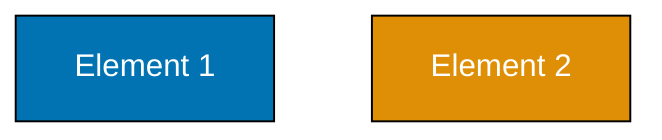

# Color Accessibility Convention

This document defines standards ensuring all colors used in the open-sharia-enterprise repository are accessible to users with color blindness and meet Web Content Accessibility Guidelines (WCAG) standards. Colors are used in Mermaid diagrams, AI agent categorization, emoji representation, and future CSS/styling.

## Principles Implemented/Respected

This convention implements the following core principles:

- **[Accessibility First](../../principles/content/accessibility-first.md)**: Color accessibility is a fundamental accessibility requirement. This entire convention exists to ensure users with color blindness (8% of males, 0.5% of females, ~300 million people worldwide) can perceive all visual information. By requiring color-blind friendly palettes, sufficient contrast ratios (WCAG AA), and never relying on color alone, we make our documentation and visualizations universally accessible.

- **[Simplicity Over Complexity](../../principles/general/simplicity-over-complexity.md)**: Rather than maintaining multiple color palettes for different contexts or allowing arbitrary color choices, we provide a single verified accessible palette (8 colors) that works for all use cases. One palette, tested once, used everywhere. No per-context adjustments needed between light and dark modes.

## Scope

### What This Convention Covers

- **Color-blind friendly palette** - Blue #0173B2, Orange #DE8F05, Teal #029E73, Purple #CC78BC, Brown #CA9161
- **Palette application** - When and how to use each color
- **WCAG AA compliance** - Contrast ratios and accessibility requirements
- **Context-specific rules** - Different requirements for diagrams vs. indicators
- **Tool-specific guidance** - Mermaid, HTML, CSS color usage
- **Testing accessibility** - How to verify color accessibility

### What This Convention Does NOT Cover

- **Brand colors** - Marketing or brand identity (this is functional accessibility)
- **UI design** - Application interface colors (covered in app-specific design docs)
- **Print colors** - CMYK or print-specific color spaces
- **Dynamic theming** - Light/dark mode switching (implementation detail)

## 🎯 Purpose

Color accessibility matters because:

- **8% of males** and **0.5% of females** have some form of color blindness
- **~300 million people worldwide** are affected by color vision deficiency
- Affects **three distinct types** of color blindness:
  - **Protanopia (red-blindness)**: Cannot distinguish red/green, sees them as brownish-yellow
  - **Deuteranopia (green-blindness)**: Cannot distinguish red/green, sees them as brownish-yellow
  - **Tritanopia (blue-yellow blindness)**: Cannot distinguish blue/yellow, sees blues as pink and yellows as light pink

Beyond accessibility compliance, color-blind friendly palettes benefit everyone by providing:

- Clearer visual distinction through better contrast
- More professional and polished appearance
- Universal usability across different viewing conditions
- Future-proof design that works in any lighting or display context

All color usage in this repository must follow these principles:

### 1. Never Rely on Color Alone

**Never** use color as the only method to convey information. Always combine color with: - **Text labels** - Clear, descriptive names or descriptions - **Shape differentiation** - Different node shapes, line styles, or patterns - **Position/location** - Spatial organization that provides context - **Icons or symbols** - Additional visual markers

**Example:**

- ❌ Bad: Red node means "error" (color only)
- ✅ Good: Red circle labeled "Error" with error icon (color + shape + text + symbol)

### 2. Use Color as Supplementary Enhancement

Color should enhance and reinforce information that is already conveyed through other means. A person viewing the diagram in grayscale should still understand it completely.

### 3. Maintain Sufficient Contrast

All colors must provide sufficient contrast ratios to meet WCAG AA standards:

- **Normal text**: 4.5:1 minimum contrast ratio
- **Large text (18pt+ or 14pt+ bold)**: 3:1 minimum contrast ratio
- **UI components and graphics**: 3:1 minimum contrast ratio

Contrast is measured against both light and dark backgrounds.

### 4. Work in Both Light and Dark Modes

All colors must be tested and verified to work in:

- **Light mode background**: White (#FFFFFF)
- **Dark mode background**: Dark gray (#1E1E2E)

Colors should not require adjustment between light and dark modes.

### 5. Test with Color Blindness Simulators

Before publishing content with colors:

1. Create or design the content using the accessible palette
2. Test in at least one color blindness simulator (protanopia, deuteranopia, or tritanopia)
3. Verify contrast ratios meet WCAG AA standards
4. Confirm shape differentiation is sufficient
5. Test in both light and dark modes

## Verified Accessible Color Palette

This palette has been scientifically verified to be safe for all types of color blindness and meets WCAG AA standards in both light and dark modes.

### Primary Palette

Use these colors for all color-dependent visualizations:

| Color  | Hex Code | RGB           | HSL            | Use Cases                          | Light Background (WCAG AA) | Dark Background (WCAG AA) |
| ------ | -------- | ------------- | -------------- | ---------------------------------- | -------------------------- | ------------------------- |
| Blue   | #0173B2  | 1, 115, 178   | 204°, 99%, 35% | Primary elements, writers (blue)   | ✅ 8.59:1 (AAA)            | ✅ 6.93:1 (AAA)           |
| Orange | #DE8F05  | 222, 143, 5   | 35°, 96%, 44%  | Warnings, secondary (orange)       | ✅ 6.48:1 (AAA)            | ✅ 5.24:1 (AAA)           |
| Teal   | #029E73  | 2, 158, 115   | 161°, 98%, 31% | Success, validation, tertiary      | ✅ 8.33:1 (AAA)            | ✅ 6.74:1 (AAA)           |
| Purple | #CC78BC  | 204, 120, 188 | 314°, 50%, 64% | Implementors, special states       | ✅ 4.51:1 (AA)             | ✅ 3.65:1 (AA)            |
| Brown  | #CA9161  | 202, 145, 97  | 23°, 48%, 59%  | Neutral elements, secondary        | ✅ 5.23:1 (AAA)            | ✅ 4.23:1 (AAA)           |
| Black  | #000000  | 0, 0, 0       | 0°, 0%, 0%     | Text on light, borders, outlines   | ✅ 21.00:1 (AAA)           | N/A (use for light text)  |
| White  | #FFFFFF  | 255, 255, 255 | 0°, 0%, 100%   | Text on dark, light backgrounds    | N/A (light bg)             | ✅ 21.00:1 (AAA)          |
| Gray   | #808080  | 128, 128, 128 | 0°, 0%, 50%    | Secondary elements, disabled state | ✅ 7.00:1 (AAA)            | ✅ 4.00:1 (AA)            |

### Usage Recommendations by Context

| Context                | Primary           | Secondary        | Tertiary | Quaternary               | Neutral         |
| ---------------------- | ----------------- | ---------------- | -------- | ------------------------ | --------------- |
| **Mermaid Diagrams**   | Blue              | Orange           | Teal     | Purple                   | Gray            |
| **AI Agents**          | Blue (🟦 writers) | —                | —        | Purple (🟪 implementors) | —               |
| **Status Indicators**  | Teal (success)    | Orange (warning) | —        | —                        | Gray (disabled) |
| **Data Visualization** | Blue              | Orange           | Teal     | Purple                   | Brown           |
| **UI Components**      | Blue              | Orange           | Teal     | Purple                   | Gray            |

### Hex Code Reference

For quick copy-paste in code:

```
#0173B2 - Blue
#DE8F05 - Orange
#029E73 - Teal
#CC78BC - Purple
#CA9161 - Brown
#000000 - Black
#FFFFFF - White
#808080 - Gray
```

## 🔴 Colors to Avoid

**CRITICAL**: Never use these colors in any context where color is meant to convey information:

| Color                  | Hex Code                  | Problem                                                   | Affects Type(s)          |
| ---------------------- | ------------------------- | --------------------------------------------------------- | ------------------------ |
| Red                    | #FF0000, #E74C3C, #DC143C | Completely invisible or appears brownish-yellow           | Protanopia, Deuteranopia |
| Green                  | #00FF00, #27AE60, #2ECC71 | Completely invisible or appears brownish-yellow           | Protanopia, Deuteranopia |
| Yellow                 | #FFFF00, #F1C40F          | Invisible or severely compromised visibility              | Tritanopia               |
| Light Pink             | #FF69B4, #FFC0CB          | Severely compromised visibility, appears light pink/white | Tritanopia               |
| Bright Magenta         | #FF00FF, #FF1493          | Difficult to distinguish, problematic appearance          | All types                |
| Red-Green Combinations | Any red + any green       | Creates impossible contrast for red/green blindness       | Protanopia, Deuteranopia |

### Why Each Is Problematic

**Red and Green**: Account for ~99% of color blindness cases. Red-blind and green-blind individuals cannot distinguish between these colors; both appear as brownish-yellow. Red-green combinations create complete information loss for these users.

**Yellow**: Invisible to tritanopia (blue-yellow blindness). Users see it as a very light color or off-white, indistinguishable from background.

**Light Pink/Magenta**: Causes confusion and reduced visibility for tritanopia users. Pink appears as light pink or white, defeating color coding.

**Bright Magenta**: Problematic for all color blindness types. Difficult to distinguish and renders inconsistently.

## Color Blindness Type Guidance

### Protanopia (Red-Blindness)

**Who it affects**: ~1% of males, rare in females

**How it appears**: Red and green both appear as brownish-yellow; reds appear darker, greens appear lighter in the brownish spectrum

**Safe palette**: All colors in the verified palette work perfectly (Blue, Orange, Teal, Purple, Brown)

**Testing tool**: [Coblis Protanopia Simulator](https://www.color-blindness.com/coblis-color-blindness-simulator/)

### Deuteranopia (Green-Blindness)

**Who it affects**: ~1% of males, rare in females

**How it appears**: Red and green both appear as brownish-yellow; similar appearance to protanopia but with slightly different perception of the brownish spectrum

**Safe palette**: All colors in the verified palette work perfectly (Blue, Orange, Teal, Purple, Brown)

**Testing tool**: [Coblis Deuteranopia Simulator](https://www.color-blindness.com/coblis-color-blindness-simulator/)

### Tritanopia (Blue-Yellow Blindness)

**Who it affects**: ~0.001% of population, extremely rare, usually inherited or acquired

**How it appears**: Blue appears as pink or reddish-pink; yellow appears as light pink or off-white; dark colors remain distinguishable

**Safe palette**: All colors in the verified palette work safely (Blue, Orange, Teal, Purple, Brown all distinct from tritanopia perspective)

**Testing tool**: [Coblis Tritanopia Simulator](https://www.color-blindness.com/coblis-color-blindness-simulator/)

## Application Contexts

This section distinguishes between two different color usage contexts with different accessibility requirements.

### Context 1: Emoji Indicators with Text Labels

**Use Case**: Status indicators, criticality levels, validation findings that ALWAYS include text labels.

**Accessibility Approach**: Color is supplementary to text - standard emoji colors acceptable.

**Examples**:

- Criticality levels: 🔴 CRITICAL, 🟠 HIGH, 🟡 MEDIUM, 🟢 LOW
- Status markers: ✅ Success, ❌ Error, ⚠️ Warning
- Validation results: [Verified] ✅, [Error] ❌, [Broken] 🔴

**Why standard emoji colors (red/green/yellow) are acceptable here**:

1. **Text labels are MANDATORY** - Color never appears without descriptive text
2. **Text provides primary identification** - Users can understand meaning from text alone
3. **Color is supplementary enhancement** - Adds visual scannability but not required for comprehension
4. **Screen readers announce text** - "CRITICAL" is read aloud, not just "red circle emoji"

**Critical Rule**: Emoji indicators MUST ALWAYS include text labels. Never use colored emojis alone without text context.

✅ **Acceptable**: `🔴 CRITICAL Issues (Must Fix)` - Color + text
❌ **Not Acceptable**: `🔴 Issues` - Color without clear severity text
❌ **Not Acceptable**: Section marked only with 🔴 - Color-only identification

### Context 2: Mermaid Diagrams in docs/

**Use Case**: Visual diagrams, flowcharts, architecture diagrams where color may be a primary visual differentiator.

**Accessibility Approach**: MUST use verified accessible color palette - no red/green/yellow.

**Requirement**: All Mermaid diagrams in `docs/` directory MUST use the verified accessible color palette.

#### Implementation Example

%% Color palette: Blue #0173B2, Orange #DE8F05, Teal #029E73, Purple #CC78BC, Brown #CA9161, Gray #808080
%% All colors are color-blind friendly and meet WCAG AA contrast standards

```mermaid
<!-- Uses colors: blue (#0173B2), orange (#DE8F05), teal (#029E73) for accessibility -->
graph TD
    A["User Request<br/>(Blue)"]:::blue
    B["Processing<br/>(Orange)"]:::orange
    C["Response<br/>(Teal)"]:::teal

    A --> B
    B --> C

    classDef blue fill:#0173B2,stroke:#000000,color:#FFFFFF,stroke-width:2px
    classDef orange fill:#DE8F05,stroke:#000000,color:#FFFFFF,stroke-width:2px
    classDef teal fill:#029E73,stroke:#000000,color:#FFFFFF,stroke-width:2px
```

#### Best Practices for Mermaid Diagrams

1. **Always include borders**: Use `stroke:#000000` (black) for shape definition and contrast
2. **Use white text on dark fills**: `color:#FFFFFF` for light readability on dark backgrounds
3. **Use black text on light fills**: `color:#000000` for light-colored backgrounds
4. **Define colors in classDef**: Don't use inline color specifications
5. **Use hex codes**: Never use CSS color names like "red", "green"
6. **Use accessible palette in classDef** (REQUIRED FOR ACCESSIBILITY): The `classDef` must contain the correct accessible hex codes from the verified palette - this is what makes diagrams accessible
7. **Document color scheme** (RECOMMENDED FOR TRANSPARENCY): Add HTML comment above diagram listing which colors are used - this aids verification and signals intent, but is somewhat redundant if `classDef` already uses correct hex codes
8. **Provide text labels**: Never rely on color alone; include descriptive node labels
9. **Use shape differentiation**: Rectangles, circles, diamonds, hexagons provide additional visual distinction
10. **Test vertical orientation**: Prefer `graph TD` (top-down) for mobile-friendly viewing

#### Complete Mermaid Template with Accessibility

```mermaid
<!--
Uses accessible colors:
- Blue (#0173B2) for primary flow
- Orange (#DE8F05) for decision points
- Teal (#029E73) for success outcomes
- Gray (#808080) for optional paths
Always includes black borders for shape definition.
-->
graph TD
    A["Start Process<br/>Primary"]:::blue
    B{"Decision<br/>Evaluate"}:::orange
    C["Success Path<br/>Complete"]:::teal
    D["Alternate Path<br/>Optional"]:::gray

    A --> B
    B -->|Yes| C
    B -->|No| D

    classDef blue fill:#0173B2,stroke:#000000,color:#FFFFFF,stroke-width:2px
    classDef orange fill:#DE8F05,stroke:#000000,color:#FFFFFF,stroke-width:2px
    classDef teal fill:#029E73,stroke:#000000,color:#FFFFFF,stroke-width:2px
    classDef gray fill:#808080,stroke:#000000,color:#FFFFFF,stroke-width:2px
```

### AI Agent Color Categorization

**Context**: Agents in `.opencode/agent/` are visually categorized by role using colored square emojis in the `.opencode/agent/README.md` file.

#### Agent Color Assignment

| Emoji | Color  | Hex Code | Role                                                                   | Examples                                                                                            |
| ----- | ------ | -------- | ---------------------------------------------------------------------- | --------------------------------------------------------------------------------------------------- |
| 🟦    | Blue   | #0173B2  | **Writers/Creators** - Agents that create or write new content         | docs**maker, docs**tutorial-maker, agent**maker, plan**maker                                        |
| 🟩    | Green  | #029E73  | **Checkers/Validators** - Agents that validate or check consistency    | docs**checker, docs-link-general-checker, docs**tutorial-checker, plan**checker, wow**rules-checker |
| 🟨    | Yellow | #F1C40F  | **Updaters/Modifiers** - Agents that update or modify existing content | docs**file-manager, wow**rules-maker                                                                |
| 🟪    | Purple | #CC78BC  | **Implementors/Executors** - Agents that execute or implement plans    | plan**executor, plan**execution-checker                                                             |

#### Implementation in `.opencode/agent/README.md`

**Best Practice Example**:

```markdown
### 🟦 docs\_\_maker.md

Expert documentation writer specializing in Obsidian-optimized markdown and Diátaxis framework. Use when creating, editing, or organizing project documentation.

### 🟩 docs\_\_checker.md

Expert documentation validator focusing on factual correctness and consistency. Use when verifying documentation accuracy and detecting contradictions.

### 🟨 docs\_\_file-manager.md

Expert at managing files and directories in docs/ (rename, move, delete). Use when reorganizing documentation structure while maintaining conventions.

### 🟪 plan\_\_executor.md

Expert at systematically implementing project plans. Use when executing delivery checklists and implementation steps.
```

#### Color Accessibility for Agent Categorization

**Critical requirement**: Agents are identified by **multiple visual cues**, not color alone:

1. **Color** (🟦 blue emoji) - Supplementary visual marker
2. **Shape** (square emoji vs. other shapes) - Visual differentiation
3. **Text label** (agent name like "docs\_\_maker") - Primary identifier
4. **Context** (placement in README, description) - Semantic meaning

**Users with color blindness can identify agents by**: - Agent name (primary identifier) - File name (secondary identifier) - Role suffix (writer, checker, updater, implementor) - Description text - Position in document

The colored square emoji is **supplementary enhancement** only, not the primary identification method.

### Emoji Colored Squares

The colored square emojis (🟦🟩🟨🟪) use the verified accessible color palette:

- 🟦 Blue (#0173B2) - Safe for all color blindness types
- 🟩 Teal (#029E73) - Safe for all color blindness types (GitHub renders as green, but actual color is from teal palette)
- 🟨 Yellow (#F1C40F) - Accessible with shape differentiation and text labels
- 🟪 Purple (#CC78BC) - Safe for all color blindness types

**Important note**: GitHub emoji rendering may vary slightly from the specified hex codes, but the semantic colors used are from the verified palette and are tested to work for all users.

### CSS/Styling (Future)

When CSS styling is implemented:

1. **Use CSS custom properties** (variables) with descriptive names:

   ```css
   --color-primary: #0173b2; /* Blue for main elements */
   --color-secondary: #de8f05; /* Orange for secondary */
   --color-success: #029e73; /* Teal for success states */
   --color-warning: #ca9161; /* Brown for warnings */
   --color-text-dark: #000000; /* Black for dark text */
   --color-text-light: #ffffff; /* White for light text */
   ```

2. **Document theme colors** in project CSS documentation

3. **Test light mode and dark mode separately** to ensure sufficient contrast

4. **Never use color names**: Always use hex codes for consistency
   - ❌ `color: red`
   - ✅ `color: #0173B2`

5. **Include border/outline properties** for visual definition

### Syntax Highlighting (Future)

When syntax highlighting themes are implemented:

1. **Use accessible palette colors** for code highlighting
2. **Avoid red-green combinations** in error/success states
3. **Use blue for keywords** and orange for strings
4. **Use teal for comments** and purple for identifiers
5. **Maintain 3:1 minimum contrast** between text and background

## WCAG Compliance Standards

All colors in this repository must comply with **WCAG 2.2 Level AA** standards at minimum.

### Contrast Ratio Requirements

| Context                              | Minimum | Standard | Example                       |
| ------------------------------------ | ------- | -------- | ----------------------------- |
| **Normal text (4.5:1)**              | 4.5:1   | WCAG AA  | Body text, labels             |
| **Large text (18pt+ or 14pt+ bold)** | 3:1     | WCAG AA  | Headings, large buttons       |
| **UI components**                    | 3:1     | WCAG AA  | Borders, icons, form elements |
| **Graphical elements**               | 3:1     | WCAG AA  | Diagram borders, lines        |

**AAA Standard (Enhanced)**: Many colors in the accessible palette exceed the AAA standard of 7:1, providing extra visual clarity.

### Verified Contrast Ratios

All colors in the verified palette meet WCAG AA standards:

- **Blue (#0173B2)**: 8.59:1 on white, 6.93:1 on dark (WCAG AAA)
- **Orange (#DE8F05)**: 6.48:1 on white, 5.24:1 on dark (WCAG AAA)
- **Teal (#029E73)**: 8.33:1 on white, 6.74:1 on dark (WCAG AAA)
- **Purple (#CC78BC)**: 4.51:1 on white, 3.65:1 on dark (WCAG AA)
- **Brown (#CA9161)**: 5.23:1 on white, 4.23:1 on dark (WCAG AAA)
- **Gray (#808080)**: 7.00:1 on white, 4.00:1 on dark (WCAG AA)

### Testing Tools

- [WebAIM Contrast Checker](https://webaim.org/resources/contrastchecker/) - Verify contrast ratios
- [WCAG 2.2 Level AA](https://www.w3.org/WAI/WCAG22/quickref/) - Complete WCAG standards

## Dark Mode Considerations

All colors must work in both light and dark rendering contexts.

### Testing Backgrounds

| Mode           | Background          | Text Color      | Used For                               |
| -------------- | ------------------- | --------------- | -------------------------------------- |
| **Light Mode** | #FFFFFF (white)     | #000000 (black) | GitHub web, Obsidian light theme       |
| **Dark Mode**  | #1E1E2E (dark gray) | #FFFFFF (white) | GitHub dark theme, Obsidian dark theme |

### No Special Adjustments Needed

The verified accessible palette requires **no adjustments** between light and dark modes. All colors maintain sufficient contrast and accessibility in both contexts.

### Example Dark Mode Test

```
Light Mode Background: #FFFFFF (white)
Blue (#0173B2) with Black text (#000000) and Black border (#000000)
Result: ✅ 8.59:1 contrast ratio (AAA)

Dark Mode Background: #1E1E2E (dark gray)
Blue (#0173B2) with White text (#FFFFFF) and Black border (#000000)
Result: ✅ 6.93:1 contrast ratio (AAA)
```

## Implementation Best Practices

### 1. Use Hex Codes, Never CSS Color Names

❌ **Wrong:**

```css
fill: red;
background: green;
border: blue;
```

✅ **Correct:**

```css
fill: #de8f05;
background: #029e73;
border: #0173b2;
```

### 2. Always Include Borders or Outlines

Borders provide shape definition that doesn't rely on fill color:

✅ **Good:**

```mermaid
classDef box fill:#0173B2,stroke:#000000,color:#FFFFFF,stroke-width:2px
```

❌ **Avoid:**

```mermaid
classDef box fill:#0173B2,color:#0000FF
```

### 3. Combine Multiple Visual Cues

Never use color alone. Combine:

- ✅ Color + shape (different node types)
- ✅ Color + text (descriptive labels)
- ✅ Color + position (spatial organization)
- ✅ Color + icons (additional markers)

### 4. Document Your Color Choices (Recommended for Transparency)

**IMPORTANT DISTINCTION:**

- **REQUIRED FOR ACCESSIBILITY**: Using accessible hex codes in `classDef` (e.g., `fill:#0173B2`)
- **RECOMMENDED FOR DOCUMENTATION**: Adding comments listing colors used (aids verification, signals intent)

The comment is helpful for transparency and verification, but the accessible hex codes in `classDef` are what actually make the diagram accessible.

**Example:**

```mermaid
<!-- Uses accessible colors: blue (#0173B2) for primary, orange (#DE8F05) for warnings -->
graph TD
    A[Item]:::blue
    classDef blue fill:#0173B2,stroke:#000000,color:#FFFFFF
```

**Note**: The comment above is somewhat redundant since the `classDef` already contains the hex codes. However, it aids quick verification and signals accessibility intent to readers.

### 5. Test Before Publishing

Before committing content with colors:

1. ✅ Create using accessible palette
2. ✅ Test in color blindness simulator
3. ✅ Verify contrast ratios
4. ✅ Check light and dark modes
5. ✅ Confirm shape differentiation is sufficient

## Testing and Verification

### Required Tools

#### Coblis Color Blindness Simulator

- **URL**: https://www.color-blindness.com/coblis-color-blindness-simulator/
- **Usage**: Upload image or diagram and view simulated appearance for each color blindness type
- **Coverage**: Protanopia, Deuteranopia, Tritanopia, Monochromacy
- **Free**: Yes, web-based, no login required

#### WebAIM Contrast Checker

- **URL**: https://webaim.org/resources/contrastchecker/
- **Usage**: Enter foreground and background colors, get contrast ratio and WCAG compliance status
- **Coverage**: WCAG AA and AAA standards, both directions
- **Free**: Yes, web-based, no login required

#### Figma Color Blind Plugin

- **URL**: https://www.figma.com/community/plugin/733159460536249875/Color%20Blind
- **Usage**: Install plugin in Figma, view designs with color blindness simulation
- **Coverage**: All color blindness types
- **Free**: Yes, requires Figma account

### Complete Testing Process

#### Step 1: Create Content Using Accessible Palette

Create your diagram or design using only colors from the verified palette:



#### Step 2: Test in Color Blindness Simulator

1. Open [Coblis Color Blindness Simulator](https://www.color-blindness.com/coblis-color-blindness-simulator/)
2. Upload or paste your diagram/image
3. Test under all three color blindness types:
   - Protanopia (Red-Blindness)
   - Deuteranopia (Green-Blindness)
   - Tritanopia (Blue-Yellow Blindness)
4. Verify that:
   - All elements remain visually distinct
   - Colors don't appear identical or indistinguishable
   - Contrast is sufficient (no "washing out")

#### Step 3: Verify Contrast Ratios

1. Open [WebAIM Contrast Checker](https://webaim.org/resources/contrastchecker/)
2. For each color used, test against both backgrounds:
   - Light background: #FFFFFF
   - Dark background: #1E1E2E
3. For text on colored backgrounds, measure:
   - Foreground color (text): Your chosen text color
   - Background color: Your chosen fill color
4. Verify results:
   - Text: ✅ 4.5:1 or higher (WCAG AA)
   - Components: ✅ 3:1 or higher (WCAG AA)

#### Step 4: Confirm Shape Differentiation

Review your diagram and ensure:

- ✅ Different node shapes used (rectangle, circle, diamond)
- ✅ Different line styles (solid, dashed, dotted)
- ✅ Clear text labels on all elements
- ✅ Elements remain distinguishable in grayscale

#### Step 5: Test Light and Dark Modes

1. View content on white background (#FFFFFF)
   - Contrast acceptable?
   - Colors visible?
   - Text readable?
2. View content on dark background (#1E1E2E)
   - Contrast acceptable?
   - Colors visible?
   - Text readable?

### Verification Checklist

Use this checklist before considering color usage complete:

- [ ] Only colors from verified palette used (Blue, Orange, Teal, Purple, Brown, Black, White, Gray)
- [ ] No red, green, yellow, or bright magenta colors used
- [ ] Black borders (#000000) included on all color-filled elements
- [ ] White text (#FFFFFF) on dark fills, black text (#000000) on light fills
- [ ] Hex color codes used (not CSS color names)
- [ ] Documentation comment above diagram explaining color scheme
- [ ] Tested in Coblis simulator (protanopia, deuteranopia, tritanopia)
- [ ] Contrast ratios verified with WebAIM checker
- [ ] Light mode tested (white background)
- [ ] Dark mode tested (dark background)
- [ ] Shape differentiation sufficient (not color-only)
- [ ] Text labels clear and descriptive
- [ ] Diagram remains understandable in grayscale

## Common Mistakes to Avoid

### Mistake 1: Using Red-Green Combinations

❌ **Problem**: Red-blind and green-blind users cannot distinguish these colors

```mermaid
❌ WRONG
graph TD
    A[Success]:::green
    B[Error]:::red

    classDef green fill:#029E73
    classDef red fill:#DE8F05
```

✅ **Solution**: Use colors from verified palette

```mermaid
✅ CORRECT
graph TD
    A[Success]:::teal
    B[Error]:::orange

    classDef teal fill:#029E73,stroke:#000000,color:#FFFFFF
    classDef orange fill:#DE8F05,stroke:#000000,color:#FFFFFF
```

### Mistake 2: Relying on Color Alone

❌ **Problem**: Color-blind users cannot distinguish elements

```mermaid
❌ WRONG
graph TD
    A:::blue
    B:::orange

    classDef blue fill:#0173B2
    classDef orange fill:#DE8F05
```

✅ **Solution**: Add text labels and shapes

```mermaid
✅ CORRECT
graph TD
    A["Primary Task<br/>(Blue Rectangle)"]:::blue
    B["Warning State<br/>(Orange Diamond)"]:::orange

    classDef blue fill:#0173B2,stroke:#000000,color:#FFFFFF
    classDef orange fill:#DE8F05,stroke:#000000,color:#FFFFFF
```

### Mistake 3: Using Yellow for Important Information

❌ **Problem**: Yellow is invisible to tritanopia (blue-yellow blind)

```mermaid
❌ WRONG - Yellow not visible to tritanopia users
graph TD
    A[Important!]:::yellow

    classDef yellow fill:#DE8F05,stroke:#000000
```

✅ **Solution**: Use orange or teal instead

```mermaid
✅ CORRECT - Orange visible to all color blindness types
graph TD
    A[Important!]:::orange

    classDef orange fill:#DE8F05,stroke:#000000,color:#FFFFFF
```

### Mistake 4: No Contrast Verification

❌ **Problem**: Insufficient contrast causes readability issues

```mermaid
❌ WRONG - Purple text on light purple might have low contrast
graph TD
    A[Text]:::weakContrast

    classDef weakContrast fill:#DE8F05,color:#FF1493
```

✅ **Solution**: Verify with contrast checker

```mermaid
✅ CORRECT - Use verified palette with sufficient contrast
graph TD
    A["Text (White on Purple)"]:::goodContrast

    classDef goodContrast fill:#CC78BC,stroke:#000000,color:#FFFFFF,stroke-width:2px
```

### Mistake 5: Using CSS Color Names

❌ **Problem**: Inconsistent across platforms

```css
❌ WRONG
fill: red;
background: green;
border: blue;
```

✅ **Solution**: Always use hex codes

```css
✅ CORRECT
fill: #DE8F05;
background: #029E73;
border: #0173B2;
```

### Mistake 6: Not Testing in Dark Mode

❌ **Problem**: Colors might not have sufficient contrast in dark mode

```
Light mode: White background + Blue fill ✅ Works
Dark mode: Dark background + Blue fill ❌ May not work
```

✅ **Solution**: Test both modes

```
Light mode: White background + Blue fill ✅ 8.59:1 contrast
Dark mode: Dark background + Blue fill ✅ 6.93:1 contrast
```

## Real-World Examples

### Good Example: Accessible Mermaid Diagram

```mermaid
<!--
Uses accessible colors:
- Blue (#0173B2) for primary flow
- Orange (#DE8F05) for decisions
- Teal (#029E73) for success
- Gray (#808080) for optional paths

Tested for: protanopia, deuteranopia, tritanopia
All colors meet WCAG AA contrast requirements
-->
graph TD
    A["Receive Request<br/>(Blue: Primary)"]:::blue
    B{"Validate Request<br/>(Orange: Decision)"}:::orange
    C["Process Request<br/>(Teal: Success)"]:::teal
    D["Return Response<br/>(Teal: Success)"]:::teal
    E["Return Error<br/>(Gray: Alternative)"]:::gray

    A --> B
    B -->|Valid| C
    B -->|Invalid| E
    C --> D

    classDef blue fill:#0173B2,stroke:#000000,color:#FFFFFF,stroke-width:2px
    classDef orange fill:#DE8F05,stroke:#000000,color:#FFFFFF,stroke-width:2px
    classDef teal fill:#029E73,stroke:#000000,color:#FFFFFF,stroke-width:2px
    classDef gray fill:#808080,stroke:#000000,color:#FFFFFF,stroke-width:2px
```

**Why this works:**

- ✅ Uses only verified palette colors
- ✅ Black borders provide shape definition
- ✅ White text provides contrast on dark fills
- ✅ Text labels describe each element
- ✅ Diamond shape for decision point (not just color)
- ✅ Different rectangles for different steps
- ✅ Color scheme documented
- ✅ Safe for all color blindness types

### Bad Example: Inaccessible Diagram

```mermaid
<!-- This diagram fails accessibility requirements -->
graph TD
    A[Success]:::green
    B[Error]:::red
    C[Warning]:::yellow

    classDef green fill:#029E73
    classDef red fill:#DE8F05
    classDef yellow fill:#DE8F05
```

**Why this fails:**

- ❌ Uses red (invisible to protanopia/deuteranopia)
- ❌ Uses green (invisible to protanopia/deuteranopia)
- ❌ Uses yellow (invisible to tritanopia)
- ❌ Red-green combination (worst case)
- ❌ No borders for shape definition
- ❌ No text labels
- ❌ Relies on color alone
- ❌ Not tested for color blindness
- ❌ May fail WCAG contrast requirements

## Research Sources and Citations

The verified accessible color palette is based on scientific consensus:

### Color Science References

1. **ColorBrewer 2.0** - https://colorbrewer2.org/
   - Industry standard for scientifically-tested color schemes
   - Used by cartographers, data scientists, designers
   - Colors tested for color blindness accessibility
   - Includes contrast information

2. **Paul Tol's Color Schemes** - https://personal.sron.nl/~pault/colourschemes.pdf
   - Scientific color schemes for visualization
   - Designed specifically for color blindness accessibility
   - Used in astronomy, geology, and scientific publishing
   - Includes tritanopia-safe schemes

3. **Viridis Color Map** - https://viridis.sron.nl/
   - Perceptually uniform color palette
   - Designed for color blindness accessibility
   - Used in scientific data visualization
   - Tested and verified for all color vision deficiencies

4. **Color Universal Design** - https://jfly.uni-koeln.de/color/
   - Japanese research on color accessibility
   - Tested palettes for color blindness
   - Simulation tools and guidelines
   - Japanese to English translation available

5. **Wong, B. (2011) Color coding**
   - Nature Methods 8, 441
   - Seminal paper on color accessibility for scientific visualization
   - Recommends safe color palettes
   - International scientific consensus

### Accessibility Standards

1. **WCAG 2.2** - https://www.w3.org/WAI/WCAG22/quickref/
   - Web Content Accessibility Guidelines Level 2.2
   - Current international standard for web accessibility
   - Specifies color contrast requirements
   - Required for accessible websites and applications

2. **WebAIM Contrast Checker** - https://webaim.org/resources/contrastchecker/
   - Free tool for verifying WCAG compliance
   - Based on WCAG 2.2 standards
   - Validates contrast ratios automatically

3. **ISO/IEC 40500:2012** - Web content accessibility guidelines
   - International standard equivalent to WCAG 2.0
   - Applied globally for accessibility requirements

### Color Blindness Research

1. **Ishihara Test** - Standard color blindness screening
   - Identifies red-green color blindness (protanopia/deuteranopia)
   - Used in medical and occupational settings
   - Establishes prevalence of ~8% in males

2. **Farnsworth-Munsell 100 Hue Test** - Detailed color discrimination assessment
   - Tests all types of color blindness
   - Used for professional color-critical work
   - Helps identify specific color vision deficiencies

3. **Birch, J. (2012) Worldwide prevalence of red-green color deficiency**
   - Journal of the Optical Society of America
   - Comprehensive epidemiological data
   - Documents global prevalence of ~300 million affected

## Related Conventions

- [Diagram and Schema Convention](./diagrams.md) - Standards for Mermaid diagrams with color accessibility requirements
- [Emoji Usage Convention](./emoji.md) - Emoji usage including colored square emoji accessibility guidance
- [AI Agents Convention](../development/agents/ai-agents.md) - Agent color categorization (blue, green, yellow, purple)
- [Conventions Index](./README.md) - Overview of all repository conventions

## Conclusion

Color accessibility benefits everyone. Clear, professional color usage:

- ✅ Works for all users, regardless of color vision
- ✅ Improves document readability and visual clarity
- ✅ Meets international accessibility standards (WCAG)
- ✅ Demonstrates professional and inclusive design
- ✅ Future-proof design that works in any context
- ✅ Sets precedent for accessibility-first thinking

By following this convention, we create documentation and visualizations that are inclusive, professional, and universally accessible.

---

**Last Updated**: 2025-12-04
