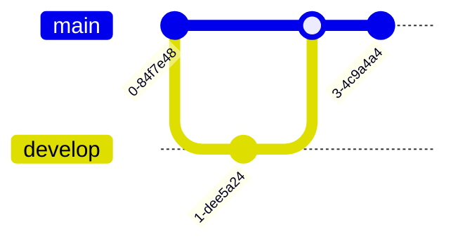
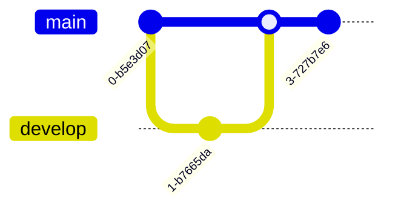

# Diagram and Schema Convention

This document defines when and how to use different diagram formats in the open-sharia-enterprise project. Understanding the appropriate format for each context ensures diagrams render consistently across all platforms where our documentation is viewed.

## Principles Implemented/Respected

This convention implements the following core principles:

- **[Accessibility First](../../principles/content/accessibility-first.md)**: Requires color-blind friendly palettes, vertical orientation for mobile users, and text-based source that screen readers can parse. Mermaid diagrams provide semantic structure accessible to assistive technology.

- **[Simplicity Over Complexity](../../principles/general/simplicity-over-complexity.md)**: Mermaid as the primary format for all markdown files provides a single, universal approach instead of juggling multiple diagram tools. Simple, text-based syntax that's easy to learn and version control.

## Purpose

This convention establishes Mermaid diagrams as the primary visualization format for all markdown files in the repository. It ensures diagrams are accessible, maintainable, and render consistently across GitHub, Obsidian, VS Code, and mobile platforms. This replaces fragmented diagram approaches with a single, universal standard that works everywhere.

## Scope

### What This Convention Covers

- **Mermaid diagram syntax** - Flowcharts, sequence diagrams, class diagrams, state diagrams, and all supported Mermaid types
- **Color accessibility requirements** - Mandatory color-blind friendly palette for all diagrams
- **Mobile-friendly orientation** - Vertical diagram orientation for mobile viewing
- **Mermaid comment syntax** - Correct use of `%%` comments (not `%%{ }%%`)
- **ASCII art guidelines** - When and how to use ASCII as optional fallback
- **Diagram placement** - Where to use diagrams in different markdown contexts

### What This Convention Does NOT Cover

- **Hugo theme diagram rendering** - Covered in [Hugo Development Convention](../../development/hugo/development.md)
- **Diagram content strategy** - What diagrams to create (covered in specific domain conventions)
- **Vector graphics or images** - This convention is only for text-based diagrams (Mermaid and ASCII)
- **Interactive diagram features** - Platform-specific interactivity (zoom, pan) is implementation detail
- **Diagram export formats** - Exporting Mermaid to PNG, SVG, PDF (tool-specific, not repository standard)

## The Core Principle

**Mermaid diagrams are the primary and preferred format for all markdown files** in this repository, both inside and outside the `docs/` directory.

- **All markdown files**: Use Mermaid diagrams as the primary format
- **ASCII art**: Optional fallback for edge cases where Mermaid isn't supported (rarely needed)

## Why Mermaid First?

Mermaid diagram support has become ubiquitous across modern development tools:

### Wide Platform Support

- **GitHub**: Native Mermaid rendering in markdown files (since May 2021)
- **Text Editors**: VS Code, IntelliJ IDEA, Sublime Text (via plugins/extensions)
- **Obsidian**: Native rendering without plugins
- **Documentation Platforms**: GitLab, Notion, Confluence all support Mermaid
- **Mobile Apps**: GitHub mobile, Obsidian mobile render Mermaid correctly

### Advantages Over ASCII Art

1. **Professional Appearance**: Clean, crisp diagrams with proper styling
2. **Maintainability**: Text-based source is easier to edit than ASCII positioning
3. **Expressiveness**: Supports complex relationships (sequence diagrams, entity relationships, state machines)
4. **Interactive**: Many platforms allow zooming and inspection
5. **Accessible**: Screen readers can parse the source text structure

### When ASCII Art Is Still Useful

ASCII art is now **optional** and only recommended for rare edge cases:

- Terminal-only environments without rich markdown support
- Extremely limited bandwidth scenarios where rendering is disabled
- Simple directory tree structures (where ASCII is clearer than Mermaid)

**In practice**: Most users will view markdown files through GitHub, Obsidian, or modern text editors, all of which support Mermaid.

## Mermaid Diagrams: Primary Format for All Markdown Files

### When to Use

Use Mermaid diagrams for **all markdown files** in the repository:

```
open-sharia-enterprise/
 ├── README.md              ← Use Mermaid
 ├── AGENTS.md             ← Use Mermaid
 ├── CONTRIBUTING.md       ← Use Mermaid
 ├── docs/                 ← Use Mermaid
│   ├── tutorials/
│   ├── how-to/
│   ├── reference/
│   └── explanation/
├── plans/                ← Use Mermaid
│   ├── in-progress/
│   ├── backlog/
│   └── done/
└── .github/              ← Use Mermaid
    └── *.md
```

### Why Mermaid?

1. **Universal Support** - GitHub, Obsidian, VS Code, and most platforms render Mermaid natively
2. **Rich Visuals** - Professional-looking diagrams with colors, shapes, and styling
3. **Interactive** - Diagrams can be zoomed and inspected
4. **Maintainable** - Text-based source is easy to version control and edit
5. **Powerful** - Supports flowcharts, sequence diagrams, class diagrams, entity relationships, state diagrams, and more
6. **Mobile-Friendly** - Renders beautifully on mobile devices (when using vertical orientation)

### Mermaid Syntax

Mermaid diagrams are defined in code blocks with the `mermaid` language identifier:

````markdown
%% Color palette: Blue #0173B2, Orange #DE8F05, Teal #029E73, Purple #CC78BC, Brown #CA9161, Gray #808080
%% All colors are color-blind friendly and meet WCAG AA contrast standards


````

### Common Mermaid Diagram Types

#### Flowchart

Perfect for processes, workflows, and decision trees:

````markdown

````


#### Sequence Diagram

Shows interactions between components over time:

````markdown

````


#### Class Diagram

Represents object-oriented structures and relationships:

````markdown

````


#### Entity Relationship Diagram

Shows database schema relationships:

````markdown

````


#### State Diagram

Illustrates state transitions in systems:

````markdown

````


#### Git Graph

Shows branch and merge history:

````markdown

````



### Diagram Orientation

**Default Layout: Top-Down (TD)**

**CRITICAL RULE**: Mermaid diagrams MUST use `graph TD` (top-down vertical layout) by default.

**Rationale**:

- Better readability on mobile devices (vertical screens)
- More natural for sequential processes
- Consistent user experience across all educational content

**Alternative layouts** (`graph LR`, `graph RL`, `graph BT`):

- ONLY use when explicitly requested by the user
- ONLY use when vertical layout would significantly harm clarity
- Default assumption is always TD unless stated otherwise

**Mobile-First Orientation**: Diagrams should be styled vertically (top to bottom or bottom to top) for optimal mobile viewing:

- **Preferred**: `graph TD` (top-down) or `graph BT` (bottom-top)
- **Avoid when possible**: `graph LR` (left-right) or `graph RL` (right-left)
- **Exception**: Use horizontal orientation when vertical layout would significantly harm clarity or readability

**Rationale**: Mobile devices have vertical screens. Vertical diagrams are easier to view without horizontal scrolling.

**Example**:


### Mermaid Best Practices

1. **Keep it Simple** - Complex diagrams become hard to maintain
2. **Use Descriptive Labels** - Clear node names improve readability
3. **Add Comments** - Explain complex logic with inline comments
4. **Test Rendering** - Preview in Obsidian before committing
5. **Version Control Friendly** - Use consistent formatting for easier diffs
6. **Prefer Vertical Orientation** - Use top-down or bottom-top layouts for mobile-friendly viewing
7. **Use Color-Blind Friendly Colors** - REQUIRED: Use accessible hex codes in `classDef` from verified palette (see Color Accessibility below)
8. **Document Color Scheme** - RECOMMENDED: Add ONE color palette comment at the start listing colors used (aids verification, but somewhat redundant if `classDef` already has correct hex codes). No duplicate comments
9. **Correct Comment Syntax** - Use `%%` for comments, NOT `%%{ }%%` (see Comment Syntax below)

### Mermaid Comment Syntax

**CRITICAL**: Mermaid comments MUST use `%%` syntax, NOT `%%{ }%%` syntax.

**Correct Syntax** ():


**Incorrect Syntax** ():


**Why**: The `%%{ }%%` syntax causes "Syntax error in text" in Mermaid rendering. The correct syntax is simply `%%` followed by the comment text.

**Common Mistake**: Adding curly braces around comments is invalid Mermaid syntax. Always use plain `%%` comments.

**Example (Color Palette Comment)**:


**Exception - Mermaid Initialization Directives**:

The `%%{init:...}%%` syntax is VALID when used for Mermaid initialization directives (theme configuration, variables). This is DIFFERENT from comments:

- **Valid Init Directive**: `%%{init: {'theme': 'base', 'themeVariables': {...}}}%%` - For theme customization
- **Invalid Comment**: `%%{ Color Palette: ... }%%` - WRONG syntax for comments
- **Valid Comment**: `%% Color Palette: ...` - Correct syntax for comments

**Key Distinction**: `%%{...}%%` is ONLY valid when containing `init:` directive for Mermaid configuration. Never use it for general comments, color palette notes, or documentation.

**When to Use Init Directives**: Rarely needed. Most diagrams use default theming. Use only when you need to customize Mermaid's theme variables or configuration. See [Hugo Development Convention](../../development/hugo/development.md) for examples of valid init directive usage.

### Color Accessibility for Color Blindness

**CRITICAL REQUIREMENT**: All Mermaid diagrams MUST use color-blind friendly colors that work in both light and dark modes.

**Master Reference**: See [Color Accessibility Convention](./color-accessibility.md) for the complete authoritative guide to color usage, including verified accessible palette, WCAG standards, testing methodology, and implementation details. This section provides a summary for diagram-specific context.

#### Why This Matters

Approximately 8% of males and 0.5% of females have some form of color blindness. Accessible diagrams benefit everyone with clearer, more professional appearance and ensure compliance with accessibility standards.

#### Color Blindness Types to Support

1. **Protanopia (red-blind)**: Cannot distinguish red/green, sees reds and greens as brownish-yellow
2. **Deuteranopia (green-blind)**: Cannot distinguish red/green, sees reds and greens as brownish-yellow
3. **Tritanopia (blue-yellow blind)**: Cannot distinguish blue/yellow, sees blues as pink and yellows as light pink

#### Accessible Color Palette

Use ONLY these proven accessible colors for Mermaid diagram elements:

**Recommended Colors (safe for all color blindness types):**

- **Blue**: `#0173B2` - Safe for all types, works in light and dark mode
- **Orange**: `#DE8F05` - Safe for all types, works in light and dark mode
- **Teal**: `#029E73` - Safe for all types, works in light and dark mode
- **Purple**: `#CC78BC` - Safe for all types, works in light and dark mode
- **Brown**: `#CA9161` - Safe for all types, works in light and dark mode
- **Black**: `#000000` - Safe for borders and text on light backgrounds
- **White**: `#FFFFFF` - Safe for text on dark backgrounds
- **Gray**: `#808080` - Safe for secondary elements

**DO NOT USE:**

- FAIL: Red (`#FF0000`, `#E74C3C`, `#DC143C`) - Invisible to protanopia/deuteranopia
- FAIL: Green (`#00FF00`, `#27AE60`, `#2ECC71`) - Invisible to protanopia/deuteranopia
- FAIL: Yellow (`#FFFF00`, `#F1C40F`) - Invisible to tritanopia
- FAIL: Light red/pink (`#FF69B4`, `#FFC0CB`) - Problematic for tritanopia
- FAIL: Bright magenta (`#FF00FF`) - Problematic for all types

#### Dark and Light Mode Compliance

All colors must provide sufficient contrast in BOTH rendering modes:

**Light mode background**: White (`#FFFFFF`)
**Dark mode background**: Dark gray/black (`#1E1E2E`)

**Contrast Requirements (WCAG AA):**

- Minimum contrast ratio: **4.5:1** for normal text
- Large text (18pt+ or 14pt+ bold): **3:1**
- Element borders must be distinguishable by shape + color, not color alone

#### Shape Differentiation (Required)

**Never rely on color alone.** Always use multiple visual cues:

- Different node shapes (rectangle, circle, diamond, hexagon)
- Different line styles (solid, dashed, dotted)
- Clear text labels
- Icons or symbols where appropriate

#### Implementation Example

**Good Example (accessible):**

````markdown
<!-- Uses accessible colors: blue (#0173B2), orange (#DE8F05), teal (#029E73) -->


````

**Bad Example (not accessible):**

````markdown
<!-- Uses inaccessible colors: red and green -->


````

#### Testing Requirements

All diagrams SHOULD be tested with color blindness simulators before publishing:

- **Simulators**: [Coblis Color Blindness Simulator](https://www.color-blindness.com/coblis-color-blindness-simulator/)
- **Contrast Checker**: [WebAIM Contrast Checker](https://webaim.org/resources/contrastchecker/)

**Testing Process:**

1. Create diagram with accessible color palette
2. Test in at least one color blindness simulator (protanopia, deuteranopia, or tritanopia)
3. Verify contrast ratios meet WCAG AA standards
4. Confirm shape differentiation is sufficient

#### Documentation Requirements

**IMPORTANT DISTINCTION:**

- **REQUIRED FOR ACCESSIBILITY**: Using accessible hex codes in `classDef` from the verified palette - this is what makes diagrams accessible
- **RECOMMENDED FOR DOCUMENTATION**: Adding a color palette comment listing which colors are used - this aids verification and signals intent, but is somewhat redundant

For each diagram using colors:

1. **Use accessible hex codes in `classDef`** (REQUIRED)
   - Example: `classDef blue fill:#0173B2,stroke:#000000,color:#FFFFFF`
   - This is the functional accessibility requirement
2. **Add ONE color palette comment** (RECOMMENDED)
   - Example: `<!-- Uses colors #0173B2 (blue), #DE8F05 (orange) for accessibility -->`
   - This is a documentation/transparency practice
   - **CRITICAL**: Each diagram should have exactly ONE color palette comment (no duplicates)
   - Multiple identical comments add unnecessary clutter and create maintenance burden
   - Comment is helpful for quick verification but is redundant with the hex codes in `classDef`
3. **Include labels** that don't rely solely on color
4. **Test verification** noted in diagram documentation (if applicable)

#### Key Implementation Points

When creating Mermaid diagrams:

- Use hex color codes (not CSS color names like "red", "green")
- Always include black borders (`#000000`) for shape definition
- Use white text (`#FFFFFF`) for dark-filled backgrounds
- Use black text (`#000000`) for light-filled backgrounds
- Define colors in `classDef` sections, not inline
- Ensure contrast ratios meet WCAG AA (4.5:1 for normal text)

### Mermaid Resources

- [Official Mermaid Documentation](https://mermaid.js.org/)
- [Mermaid Live Editor](https://mermaid.live/) - Test diagrams online
- [Obsidian Mermaid Docs](https://help.obsidian.md/Editing+and+formatting/Advanced+formatting+syntax#Diagram)
- [Coblis Color Blindness Simulator](https://www.color-blindness.com/coblis-color-blindness-simulator/) - Test diagrams for accessibility
- [WebAIM Contrast Checker](https://webaim.org/resources/contrastchecker/) - Verify WCAG compliance

## ASCII Art: Optional Fallback

### When to Use

ASCII art is now **optional** and should only be used when:

- **Directory tree structures**: Simple file/folder hierarchies (ASCII is often clearer than Mermaid for this specific use case)
- **Terminal-only contexts**: Rare situations where rich markdown rendering is completely unavailable
- **Personal preference**: When you find ASCII art clearer for a specific simple diagram

**Default recommendation**: Use Mermaid for all diagrams unless you have a specific reason to use ASCII art.

### Why ASCII Art Is Now Optional

With widespread Mermaid support across GitHub, Obsidian, VS Code, and other platforms, the original rationale for requiring ASCII art in files outside `docs/` no longer applies:

1. **GitHub Support**: GitHub has supported Mermaid natively since May 2021
2. **Editor Support**: Modern text editors (VS Code, IntelliJ, Sublime) all support Mermaid previews
3. **Mobile Support**: GitHub mobile and Obsidian mobile render Mermaid correctly
4. **Better Maintainability**: Mermaid is easier to update than manually positioned ASCII art

**Previous approach**: We required ASCII art for files outside `docs/` (README.md, AGENTS.md, plans/) to ensure universal compatibility.

**Current approach**: Use Mermaid everywhere. ASCII art is a fallback option, not a requirement.

### ASCII Art Use Cases

#### Directory Structure

Perfect for showing file and folder hierarchies:

```
open-sharia-enterprise/
 ├── .opencode/                   # OpenCode configuration
 │   ├── agent/               # Specialized AI agents
 │   └── skill/               # Progressive knowledge packages
 ├── docs/                      # Documentation (Diátaxis framework)
│   ├── tutorials/            # Learning-oriented guides
│   ├── how-to/               # Problem-oriented guides
│   ├── reference/            # Technical reference
│   └── explanation/          # Conceptual documentation
├── src/                       # Source code
├── package.json              # Node.js manifest
└── README.md                 # Project README
```

#### Simple Diagrams

Basic flowcharts and relationships:

```
┌─────────────┐
│   Request   │
└──────┬──────┘
       │
       ▼
┌─────────────┐     ┌─────────────┐
│ Validation  │────▶│   Process   │
└─────────────┘     └──────┬──────┘
                           │
                           ▼
                    ┌─────────────┐
                    │  Response   │
                    └─────────────┘
```

#### Process Flow

Sequential steps with connectors:

```
User Action
    │
    ├──▶ Authentication Check
    │        │
    │        ├─ Success ──▶ Process Request ──▶ Return Result
    │        │
    │        └─ Failure ──▶ Return 401
    │
    └──▶ Log Event
```

#### Component Relationships

System architecture overview:

```
┌──────────────────────────────────────┐
│           Frontend (React)           │
└────────────┬─────────────────────────┘
             │
             ▼
┌──────────────────────────────────────┐
│         API Gateway (Express)        │
└─────┬──────────────┬─────────────────┘
      │              │
      ▼              ▼
┌─────────┐    ┌─────────────┐
│ Auth    │    │  Business   │
│ Service │    │  Logic      │
└─────────┘    └──────┬──────┘
                      │
                      ▼
               ┌─────────────┐
               │  Database   │
               └─────────────┘
```

#### Tables and Matrices

Structured data representation:

```
┌──────────────┬────────────┬──────────────┐
│   Category   │   Prefix   │   Example    │
├──────────────┼────────────┼──────────────┤
│  Tutorials   │    tu__    │  tu__start.md│
│  How-To      │   hoto__   │ hoto__api.md │
│  Reference   │    re__    │  re__spec.md │
│  Explanation │    ex__    │  ex__arch.md │
└──────────────┴────────────┴──────────────┘
```

### ASCII Art Best Practices

1. **Use Box-Drawing Characters** - `┌─┐│└┘├┤┬┴┼` for clean borders
2. **Consistent Spacing** - Align elements for better readability
3. **Test in Monospace** - Verify rendering in fixed-width fonts
4. **Keep it Simple** - Complex ASCII art is hard to maintain
5. **Comment Structure** - Add text labels for clarity

### ASCII Art Character Sets

Common characters for drawing:

```
Box Drawing:
┌ ┬ ┐   ╔ ╦ ╗
├ ┼ ┤   ╠ ╬ ╣
└ ┴ ┘   ╚ ╩ ╝
─ │     ═ ║

Arrows:
→ ← ↑ ↓ ↔ ↕
▶ ◀ ▲ ▼

Connectors:
┬ ┴ ├ ┤ ┼
╭ ╮ ╰ ╯
```

### ASCII Art Tools

- Manual creation in text editor with monospace font
- Online generators (limited utility)
- Terminal tools like `figlet` for text banners

## Decision Matrix

Use this quick reference to choose the right format:

| File Location     | Primary Format | Alternative       | Notes                                           |
| ----------------- | -------------- | ----------------- | ----------------------------------------------- |
| `docs/**/*.md`    | **Mermaid**    | ASCII (optional)  | Native Obsidian rendering, rich visuals         |
| `README.md`       | **Mermaid**    | ASCII (optional)  | GitHub renders Mermaid natively                 |
| `AGENTS.md`       | **Mermaid**    | ASCII (optional)  | Modern text editors support Mermaid             |
| `plans/**/*.md`   | **Mermaid**    | ASCII (optional)  | GitHub and editors render Mermaid               |
| `.github/**/*.md` | **Mermaid**    | ASCII (optional)  | GitHub Actions and web UI support Mermaid       |
| `CONTRIBUTING.md` | **Mermaid**    | ASCII (optional)  | Contributors use GitHub web or modern editors   |
| Directory trees   | **ASCII**      | Mermaid (complex) | ASCII is clearer for simple file/folder listing |

## Examples in Context

### Example 1: API Flow in Documentation

**File**: `docs/explanation/architecture/ex-ar__request-flow.md`

**Use Mermaid**:

````markdown
## Request Processing Flow


````

### Example 2: Project Structure in README

**File**: `README.md`

**Recommended: Use Mermaid for Complex Diagrams**:

````markdown
## Project Architecture

```mermaid
graph TD
    A[Client Request] --> B[API Gateway]
    B --> C{Auth Check}
    C -->|Valid| D[Business Logic]
    C -->|Invalid| E[Return 401]
    D --> F[Database]
    F --> D
    D --> G[Response]
```
````

**Alternative: Use ASCII for Simple Directory Trees**:

```markdown
## Project Structure

open-sharia-enterprise/
├── .opencode/ # OpenCode configuration
├── docs/ # Documentation
│ ├── tutorials/ # Step-by-step guides
│ ├── how-to/ # Problem solutions
│ └── reference/ # Technical specs
├── src/ # Source code
└── package.json # Dependencies
```

### Example 3: State Machine in Tutorial

**File**: `docs/tutorials/transactions/tu-tr__transaction-lifecycle.md`

**Use Mermaid**:

````markdown
## Transaction States

```mermaid
stateDiagram-v2
		[*] --> Draft
		Draft --> Submitted : submit()
		Submitted --> UnderReview : auto
		UnderReview --> Approved : approve()
		UnderReview --> Rejected : reject()
		Approved --> Completed : process()
		Rejected --> [*]
		Completed --> [*]
```
````

### Example 4: Component Architecture in AGENTS.md

**File**: `AGENTS.md`

**Recommended: Use Mermaid**:

````markdown
## Agent Architecture

```mermaid
graph TD
    A[OpenCode- Main Agent] --> B[docs__maker.md]
    A --> C[repo-governance-checker.md]
    A --> D[repo-governance-maker.md]
    A --> E[plan__maker.md]

    B --> F[Documentation]
    C --> G[Validation]
    D --> H[Propagation]
    E --> I[Planning]
```
````

**Alternative: Use ASCII for Simple Hierarchies**:

```markdown
## Agent Architecture

OpenCode(Main Agent)
├── docs**maker.md (Documentation)
├── wow**rules-checker.md (Validation)
├── wow**rules-maker.md (Propagation)
└── plan**maker.md (Planning)
```

## Mixing Formats

**Prefer consistency within a single file**. Choose Mermaid as your primary format and use it throughout the file unless you have a specific reason to use ASCII art.

FAIL: **Avoid mixing unnecessarily**:

````markdown
## System Flow

```mermaid
graph TD
    A --> B
```

## Directory Structure

```
A
└── B
```

## Another Flow

A --> B (plain text - no format!)
````

PASS: **Good - consistent Mermaid**:

````markdown
## System Flow

```mermaid
graph TD
    A[Component A] --> B[Component B]
```

## State Transitions

```mermaid
stateDiagram-v2
    [*] --> Active
    Active --> Inactive
```
````

PASS: **Acceptable - intentional format choice**:

````markdown
## Architecture Diagram

```mermaid
graph TD
    A[API] --> B[Database]
```

## Project Structure (simple tree)

```
project/
├── src/
└── docs/
```
````

**Rationale**: Mermaid is preferred, but ASCII directory trees are acceptable when they're clearer for simple file/folder listings.

## Migration Strategy

### Upgrading ASCII to Mermaid (Recommended)

Since Mermaid is now the primary format, consider upgrading existing ASCII art diagrams to Mermaid for better maintainability and visual quality:

**When to upgrade**:

- Complex flowcharts or architecture diagrams currently in ASCII
- Diagrams that are hard to update due to ASCII positioning
- When adding new content to a file with ASCII diagrams (good time to upgrade all diagrams)

**When to keep ASCII**:

- Simple directory tree structures (ASCII is clearer)
- If the ASCII diagram is simple and works perfectly well

**Upgrade process**:

1. Identify the diagram type (flowchart, sequence, state machine, etc.)
2. Use appropriate Mermaid syntax
3. Test rendering on GitHub preview or Obsidian
4. Verify all relationships and labels are preserved
5. Keep vertical orientation (top-down or bottom-top) for mobile-friendliness

**Example upgrade**:

**Before (ASCII)**:

```
┌───────┐
│ Start │
└───┬───┘
    │
    ▼
┌─────────┐
│ Process │
└────┬────┘
     │
     ▼
┌─────┐
│ End │
└─────┘
```

**After (Mermaid - vertical orientation)**:

````markdown
```mermaid
graph TD
    A[Start] --> B[Process]
    B --> C[End]
```
````

### No Need to Convert Mermaid to ASCII

With widespread Mermaid support, there's no reason to convert Mermaid diagrams to ASCII art. If you encounter a situation where Mermaid doesn't render, consider:

1. Using a different viewing platform (GitHub web, VS Code, Obsidian)
2. Updating your editor/viewer to support Mermaid
3. Only in extreme edge cases: create an ASCII fallback

## Verification Checklist

Before committing documentation with diagrams:

- [ ] Primary format is Mermaid (unless specific reason for ASCII)
- [ ] Mermaid diagrams use vertical orientation (TD or BT) for mobile-friendliness
- [ ] Mermaid diagrams use color-blind friendly colors (only accessible palette)
- [ ] Colors work in both light and dark mode
- [ ] Shape differentiation used (not relying on color alone)
- [ ] Contrast ratios meet WCAG AA standards (4.5:1 for text)
- [ ] Color scheme documented in comment above diagram
- [ ] **Each diagram has exactly ONE color palette comment** (no duplicates)
- [ ] **Mermaid comments use `%%` syntax, NOT `%%{ }%%`** (correct comment syntax)
  - [ ] **Square brackets and angle brackets escaped** (use `#91;` `#93;` `#60;` `#62;` - prevents nested delimiter conflicts)
- [ ] **Parentheses and brackets escaped in node text** (use HTML entities: `#40;` `#41;` `#91;` `#93;`)
- [ ] **No literal quotes inside node text** (remove quotes or use descriptive text like "string value")
- [ ] **No style commands in sequence diagrams** (use `box` syntax or switch to flowchart)
- [ ] Mermaid diagrams tested in GitHub preview or Obsidian
- [ ] ASCII art (if used) verified in monospace font
- [ ] Format choice is intentional (not mixing Mermaid and ASCII unnecessarily)
- [ ] All labels and text are clear and readable
- [ ] Complex diagrams simplified where possible
- [ ] Diagram serves the documentation purpose
- [ ] Vertical orientation preferred (horizontal only if clarity requires it)

## Common Mermaid Syntax Errors

This section documents critical Mermaid syntax rules discovered through debugging production diagrams. These errors cause "syntax error in text" or rendering failures.

### Error 1: Special Characters in Node Text and Edge Labels

**CRITICAL**: Parentheses, square brackets, and curly braces inside node definitions AND edge labels cause syntax errors.

**Problem Examples (FAIL: BROKEN):**

```mermaid
graph TD
    A[O(1) lookup]                  %% ERROR: Parentheses cause syntax error
    B[function(args)]               %% ERROR: Parentheses cause syntax error
    C[Array: [0, 1, 2]]             %% ERROR: Square brackets cause syntax error
    D[Dict: {key: value}]           %% ERROR: Curly braces cause syntax error
    E -->|iter()| F[Iterator]       %% ERROR: Parentheses in edge label cause syntax error
```

**Solution (PASS: WORKING):**

Escape special characters using HTML entity codes:

**Entity Codes**:

- Parentheses: `(` → `#40;`, `)` → `#41;`
- Square brackets: `[` → `#91;`, `]` → `#93;`
- Curly braces: `{` → `#123;`, `}` → `#125;`
- Angle brackets: `<` → `#60;`, `>` → `#62;`

**In node text:**

```mermaid
graph TD
    A[O#40;1#41; lookup]                     %% CORRECT: Escaped parentheses
    B[function#40;args#41;]                  %% CORRECT: Escaped parentheses
    C[Array: #91;0, 1, 2#93;]                %% CORRECT: Escaped square brackets
    D[Dict: #123;key: value#125;]            %% CORRECT: Escaped curly braces
    E[Generic#60;T#62;]                      %% CORRECT: Escaped angle brackets
```

**In edge labels:**

Edge labels use `-->|text|` syntax and require the same escaping:

```mermaid
graph TD
    A -->|iter#40;#41;| B[Iterator]          %% CORRECT: Escaped parentheses in edge label
    B -->|next#40;#41;| C{Has Item?}         %% CORRECT: Escaped parentheses in edge label
    D -->|get#91;key#93;| E[Value]           %% CORRECT: Escaped brackets in edge label
```

**Rationale**: Mermaid's parser interprets unescaped special characters as syntax elements in BOTH node text and edge labels, not literal characters.

**Real-World Examples Fixed:**

- Python beginner Example 12 (dictionaries): `O(1) lookup` → `O#40;1#41; lookup`
- Python intermediate Example 43 (deque): `O(1) operations` → `O#40;1#41; operations`
- SQL beginner (index lookup): `O(log n)` → `O#40;log n#41;`
- Rust advanced (generics): `Array<T>` → `Array#60;T#62;`
- Rust advanced (arrays): `[i32; 3]` → `#91;i32; 3#93;`

### Error 2: Literal Quotes Inside Node Text

**CRITICAL**: Literal quote characters inside Mermaid node text cause parsing errors.

**Problem Example (FAIL: BROKEN)**:

```mermaid
graph TD
    F[let x = "hello"]        %% ERROR: Inner quotes conflict with node syntax
    G[const name = "Alice"]   %% ERROR: Parser sees "hello" as end of node label
```

**Why it fails**: The outer `[...]` syntax uses quotes for node label definition. When literal `"` characters appear inside, the Mermaid parser interprets them as structural syntax, not literal text.

**Solution (PASS: WORKING)**:

Remove the inner quotes or use descriptive text:

```mermaid
graph TD
    F[let x = hello]              %% CORRECT: No inner quotes
    G[const name = Alice]         %% CORRECT: No inner quotes
    H[let x = string value]       %% CORRECT: Descriptive text
```

**Rule**: Avoid literal quote characters inside Mermaid node text. If you need to show a string value, omit the quotes or use descriptive text.

**Real-World Context**: This error was discovered when trying to show code syntax like `let x = "hello"` in Mermaid nodes.

### Error 3: Nested Escaping in Node Text

**CRITICAL**: Combining HTML entity codes with escaped quotes in the same node text causes parsing failures.

**Problem Example (FAIL: BROKEN):**

```mermaid
graph TD
    A["JSON #123;\"name\":\"Alice\"#125;"]    %% ERROR: Nested escaping fails
```

**Why it fails**: The combination of `#123;#125;` (entity codes for curly braces) with `\"` (escaped quotes) creates nested escaping that the Mermaid parser cannot handle.

**Solution (PASS: WORKING):**

Simplify the text - remove quotes or use plain text instead of trying to escape multiple special characters:

```mermaid
graph TD
    A["JSON #123;name:Alice#125;"]                %% CORRECT: No quotes, just entity codes
    B["JSON object with name field"]              %% CORRECT: Plain text description
```

**Rule**: Avoid nested escaping patterns. If you need both entity codes AND special punctuation in the same node:

- Option 1: Remove the punctuation (often quotes can be omitted)
- Option 2: Simplify to plain text description
- Option 3: Split into multiple nodes
- Do NOT combine entity codes with escaped quotes (`#123;` + `\"`) in the same node

**Real-World Context**: This error was discovered when trying to show JSON syntax like `{"name":"value"}` in Mermaid nodes. The working solution is to use entity codes for braces but omit the quotes: `#123;name:value#125;`.

### Error 4: Style Commands in Sequence Diagrams

**CRITICAL**: The `style` command only works in `graph`/`flowchart` diagrams, NOT in `sequenceDiagram`.

**Problem Example (FAIL: BROKEN):**

```mermaid
sequenceDiagram
    participant User
    participant System

    User->>System: Request
    System-->>User: Response

    style User fill:#0173B2           %% ERROR: style not supported in sequence diagrams
    style System fill:#DE8F05         %% ERROR: style not supported in sequence diagrams
```

**Solution (PASS: WORKING):**

For sequence diagrams, use `box` syntax for grouping and coloring instead:

```mermaid
sequenceDiagram
    box Blue User Side
        participant User
    end
    box Orange System Side
        participant System
    end

    User->>System: Request
    System-->>User: Response
```

**Alternative: Use graph/flowchart for styled diagrams:**

```mermaid
flowchart LR
    User[User]:::blue
    System[System]:::orange

    User --> System

    classDef blue fill:#0173B2,stroke:#000000,color:#FFFFFF
    classDef orange fill:#DE8F05,stroke:#000000,color:#FFFFFF
```

**Rationale**: Mermaid diagram types have different syntax capabilities. `style` commands are only valid in graph-based diagrams (graph, flowchart), not in interaction diagrams (sequenceDiagram, classDiagram, stateDiagram).

**Real-World Example Fixed:**

- Python intermediate Example 33 (context manager): Removed `style` commands from sequence diagram

### Error 5: Sequence Diagram Participant Syntax with "as" Keyword

**CRITICAL**: Using `participant X as "Display Name"` syntax with quotes in sequence diagrams causes rendering failures in Hugo/Hextra environments.

**Problem Example (FAIL: BROKEN)**:

```mermaid
sequenceDiagram
    participant Main as "main()"
    participant Loop as "Event Loop"
    participant F1 as "fetch_data(api1)"

    Main->>Loop: Start execution
    Loop->>F1: Call async function
    F1-->>Loop: Return result
```

**Why it fails**: The Hextra theme's Mermaid renderer struggles with complex display names containing spaces, parentheses, or special characters when combined with the `as` keyword and quotes. This syntax pattern causes parsing errors in Hugo/Hextra contexts.

**Solution (PASS: WORKING)**:

Use simple participant identifiers without the `as` keyword:

```mermaid
sequenceDiagram
    participant Main
    participant EventLoop
    participant API1

    Main->>EventLoop: Start execution
    EventLoop->>API1: Call async function
    API1-->>EventLoop: Return result
```

**Alternative - Descriptive names without quotes**:

If you need descriptive names, use CamelCase or underscores without the `as` keyword:

```mermaid
sequenceDiagram
    participant MainFunction
    participant EventLoop
    participant FetchData

    MainFunction->>EventLoop: Initialize
    EventLoop->>FetchData: Retrieve data
    FetchData-->>EventLoop: Data received
```

**Rule**: In sequence diagrams, use simple participant identifiers. Avoid the `as` keyword with quoted display names. Use CamelCase or simple names instead of quoted strings with spaces or special characters.

**Rationale**:

- The Hextra theme documentation shows working examples using simple participant syntax
- Complex display names with `as` keyword and quotes cause parsing errors
- Simple identifiers are more reliable across different Mermaid versions and rendering contexts
- Hugo/Hextra environments have different parser constraints than standalone Mermaid

**Affected diagram types**: `sequenceDiagram` only (not `graph`/`flowchart`)

**Real-World Examples Fixed:**

- Python intermediate Example 33 (async/await): Changed `participant Main as "main()"` to `participant Main`
- Elixir advanced Example 62 (GenServer): Changed `participant Client as "Client Process"` to `participant Client`

### Error 6: Colons in State Diagram Edge Labels

**CRITICAL**: In `stateDiagram-v2`, edge labels cannot contain colon characters (`:`).

**Syntax**: State diagram edge labels use the format `state1 --> state2: label text here`, where the colon after `state2` separates the transition from the label text.

**Problem**: If the label text itself contains colons (like Clojure keywords `:count` or `:users`, or other code snippets with colons), Mermaid's parser fails because the colon is a reserved separator character.

**Problem Example (FAIL: BROKEN)**:

```mermaid
stateDiagram-v2
    complex --> updated: swap! update :count inc
    updated --> final: swap! update :users conj
```

**Why it fails**: The parser sees `:count` and `:users` as additional syntax elements, not part of the label text. The first colon in the label text (`:` in `:count`) is interpreted as a new separator, breaking the parsing.

**Solution (PASS: WORKING)**:

Remove colons from edge label text. Use plain text descriptions instead of literal code syntax when colons are present:

```mermaid
stateDiagram-v2
    complex --> updated: swap! update count inc
    updated --> final: swap! update users conj
```

**Alternative - Descriptive Text**:

If the code syntax is critical to show, use descriptive text that avoids colons:

```mermaid
stateDiagram-v2
    complex --> updated: update count with increment
    updated --> final: add user to collection
```

**Rule**: Avoid colons in state diagram edge labels. Remove colons from code snippets in labels (e.g., use `count` instead of `:count` for Clojure keywords, use `key value` instead of `key: value` for object notation).

**Affected syntax**: `stateDiagram-v2` only. This does NOT affect:

- Flowchart edge labels (`graph TD` / `flowchart TD`) - colons work fine in flowchart edge labels
- Sequence diagram messages - different syntax, no issue with colons
- Node text in any diagram type - only affects state diagram edge labels

**Rationale**: In state diagrams, the colon is a structural syntax element that separates the transition from its label. Any additional colons in the label text create parsing ambiguity.

**Real-World Context**: This error was discovered when documenting Clojure state transitions using keywords like `:count` and `:users` in edge labels.

### Quick Reference: Character Escaping

**Characters requiring HTML entity codes in Mermaid node text:**

| Character       | HTML Entity | Example Usage                           |
| --------------- | ----------- | --------------------------------------- |
| `(`             | `#40;`      | `O#40;1#41;` for "O(1)"                 |
| `)`             | `#41;`      | `O#40;1#41;` for "O(1)"                 |
| `[`             | `#91;`      | `#91;0, 1#93;` for "[0, 1]"             |
| `]`             | `#93;`      | `#91;0, 1#93;` for "[0, 1]"             |
| `{`             | `#123;`     | `#123;key: value#125;` for "{key: ...}" |
| `}`             | `#125;`     | `#123;key: value#125;` for "{key: ...}" |
| `<` (less than) | `#60;`      | `Array#60;T#62;` for "Array<T>"         |
| `>` (more than) | `#62;`      | `Array#60;T#62;` for "Array<T>"         |

**When to escape:**

- Only when these characters appear **inside square bracket node definitions** `[text here]`
- Also required in **edge labels** (`-->|text|` syntax)
- NOT needed in regular text, comments, or code blocks

**Example: Complex node text with multiple escapes:**

```mermaid
graph TD
    A[HashMap#60;K, V#62;<br/>O#40;1#41; lookup<br/>Values: #91;1, 2, 3#93;<br/>Dict: #123;a: 1#125;]
```

Renders as: "HashMap<K, V> / O(1) lookup / Values: [1, 2, 3] / Dict: {a: 1}"

## Related Documentation

- [Color Accessibility Convention](./color-accessibility.md) - Master reference for accessible color palette, WCAG standards, and testing tools (comprehensive guide for all color usage)
- [File Naming Convention](../meta/file-naming.md) - How to name documentation files
- [Linking Convention](./linking.md) - How to link between files
- [Diátaxis Framework](../meta/diataxis-framework.md) - Documentation organization principles
- [Conventions Index](./README.md) - Overview of all conventions

## External Resources

- [Mermaid Official Documentation](https://mermaid.js.org/)
- [Mermaid Live Editor](https://mermaid.live/)
- [ASCII Art Generator](https://www.asciiart.eu/)
- [Box Drawing Unicode Characters](https://en.wikipedia.org/wiki/Box-drawing_characters)

---

**Last Updated**: 2025-12-31

### Error 7: Sequence Diagram Participant Syntax with "as" Keyword

**CRITICAL**: Using `participant X as "Display Name"` syntax with quotes in sequence diagrams causes rendering failures in Hugo/Hextra environments.

**Problem Example (FAIL: BROKEN)**:

```mermaid
sequenceDiagram
    participant Main as "main()"
    participant Loop as "Event Loop"
    participant F1 as "fetch_data(api1)"

    Main->>Loop: Start execution
    Loop->>F1: Call async function
    F1-->>Loop: Return result
```

**Why it fails**: The Hextra theme's Mermaid renderer struggles with complex display names containing spaces, parentheses, or special characters when combined with the `as` keyword and quotes. This syntax pattern causes parsing errors in Hugo/Hextra contexts.

**Solution (PASS: WORKING)**:

Use simple participant identifiers without the `as` keyword:

```mermaid
sequenceDiagram
    participant Main
    participant EventLoop
    participant API1

    Main->>EventLoop: Start execution
    EventLoop->>API1: Call async function
    API1-->>EventLoop: Return result
```

**Alternative - Descriptive names without quotes**:

If you need descriptive names, use CamelCase or underscores without the `as` keyword:

```mermaid
sequenceDiagram
    participant MainFunction
    participant EventLoop
    participant FetchData

    MainFunction->>EventLoop: Initialize
    EventLoop->>FetchData: Retrieve data
    FetchData-->>EventLoop: Data received
```

**Rule**: In sequence diagrams, use simple participant identifiers. Avoid the `as` keyword with quoted display names. Use CamelCase or simple names instead of quoted strings with spaces or special characters.

**Rationale**:

- The Hextra theme documentation shows working examples using simple participant syntax
- Complex display names with `as` keyword and quotes cause parsing errors
- Simple identifiers are more reliable across different Mermaid versions and rendering contexts
- Hugo/Hextra environments have different parser constraints than standalone Mermaid

**Affected diagram types**: `sequenceDiagram` only (not `graph`/`flowchart`)

**Real-World Examples Fixed:**

- Python intermediate Example 33 (async/await): Changed `participant Main as "main()"` to `participant Main`
- Elixir advanced Example 62 (GenServer): Changed `participant Client as "Client Process"` to `participant Client`

## Diagram Size and Splitting

**CRITICAL RULE**: Split complex diagrams into multiple focused diagrams for mobile readability.

### Why This Matters

Large diagrams with multiple concepts, many branches, or subgraphs render too small on mobile devices (narrow screens) and become difficult to read. Mobile-first design requires each diagram to be simple enough to display clearly on small screens.

### Problem: Diagrams That Become Too Small

**Symptoms**:

- Diagram contains multiple distinct concepts in one visualization
- More than 4-5 branches from a single node (renders wide and small)
- Using `subgraph` syntax for comparisons (e.g., "Eager vs Lazy")
- Combining different aspects of a feature (hierarchy + usage pattern)

**Real-world examples of diagrams that were too small**:

1. **Java Example 43 (Sealed Classes)**: Combined sealed class hierarchy + pattern matching switch in one diagram
2. **Java Example 36 (Concurrent Collections)**: Combined BlockingQueue + ConcurrentHashMap in one diagram
3. **Kotlin Example 30 (Structured Concurrency)**: Combined hierarchy + cancellation propagation in one diagram
4. **Kotlin Example 34 (Flow Operators)**: Combined transform + buffer + conflate in one diagram
5. **Kotlin Example 38 (Sequences)**: Used subgraphs for Eager vs Lazy comparison
6. **Kotlin Example 43 (Operator Overloading)**: 7 operator types branching from one central node

### Solution: Split Into Focused Diagrams

**One Concept Per Diagram**: Each diagram should explain one idea, pattern, or workflow.

### When to Split

**SPLIT when you have**:

- Multiple distinct concepts in one diagram
- More than 4-5 branches from a single node
- `subgraph` syntax (replace with separate diagrams)
- A vs B comparisons (split into A diagram and B diagram)
- Workflow with multiple stages (split into stage-specific diagrams)

**KEEP as one diagram when**:

- Simple linear flow (3-4 steps)
- Single concept with minimal branching
- Diagram is already focused and readable on mobile

### Splitting Guidelines

**1. One Concept Per Diagram**

FAIL: **Bad** (multiple concepts):

- "Sealed classes + Pattern matching + Exhaustiveness checking"

PASS: **Good** (focused):

- Diagram 1: "Sealed Class Hierarchy"
- Diagram 2: "Pattern Matching with Switch"

**2. Limit Branching (3-4 nodes per level)**

FAIL: **Bad** (excessive branching):

- One node branching to 7+ child nodes (renders wide and small)

PASS: **Good** (controlled):

- Split into 2-3 diagrams, each with 3-4 branches maximum

**3. Avoid Subgraphs (use separate diagrams)**

FAIL: **Bad** (subgraphs):

```mermaid
graph TD
    subgraph Eager
        A[Load All] --> B[Process]
    end

    subgraph Lazy
        C[Load On Demand] --> D[Process]
    end
```

PASS: **Good** (separate diagrams with headers):

**Eager Evaluation:**

```mermaid
graph TD
    A[Load All Data] --> B[Process Immediately]
```

**Lazy Evaluation:**

```mermaid
graph TD
    A[Load On Demand] --> B[Process When Needed]
```

**4. Use Descriptive Headers**

When splitting diagrams, add bold headers above each diagram:

- Format: `**Concept Name:**` followed by the Mermaid code block
- Example: `**BlockingQueue (Producer-Consumer):**`

This provides clear context for each focused diagram.

**5. Mobile-First Design**

All diagrams should be readable on narrow mobile screens:

- TD (top-down) layout already helps with vertical orientation
- Splitting ensures each diagram has enough vertical space
- Reduced horizontal width prevents text truncation

### Real-World Fixes

**Example 1: Sealed Classes (Before)**

Combined hierarchy + pattern matching:

```mermaid
graph TD
    Shape --> Circle
    Shape --> Rectangle
    Shape --> Triangle

    Switch[Pattern Match] --> |Circle| C[Handle Circle]
    Switch --> |Rectangle| R[Handle Rectangle]
    Switch --> |Triangle| T[Handle Triangle]
```

**Example 1: Sealed Classes (After)**

**Sealed Class Hierarchy:**

```mermaid
graph TD
    Shape[Shape<br/>sealed interface] --> Circle
    Shape --> Rectangle
    Shape --> Triangle
```

**Pattern Matching Switch:**

```mermaid
graph TD
    A[switch#40;shape#41;] --> B{Type?}
    B -->|Circle| C[area = π × r²]
    B -->|Rectangle| D[area = w × h]
    B -->|Triangle| E[area = ½ × b × h]
```

**Example 2: Concurrent Collections (Before)**

Combined BlockingQueue + ConcurrentHashMap:

```mermaid
graph TD
    BQ[BlockingQueue] --> Put[put#40;#41;]
    BQ --> Take[take#40;#41;]

    CHM[ConcurrentHashMap] --> PutIfAbsent
    CHM --> Compute
    CHM --> Merge
```

**Example 2: Concurrent Collections (After)**

**BlockingQueue (Producer-Consumer):**

```mermaid
graph TD
    Producer --> |put#40;item#41;| Queue[BlockingQueue]
    Queue --> |take#40;#41;| Consumer
    Queue --> |Blocks if full| Producer
    Consumer --> |Blocks if empty| Queue
```

**ConcurrentHashMap (Atomic Operations):**

```mermaid
graph TD
    A[putIfAbsent#40;k,v#41;] --> B{Key exists?}
    B -->|No| C[Insert value]
    B -->|Yes| D[Return existing]
```

### Summary

**Golden Rules**:

1. **One concept per diagram** - Each diagram explains one idea
2. **Limit branching** - Maximum 3-4 branches per level
3. **No subgraphs** - Use separate diagrams with headers instead
4. **Descriptive headers** - Add `**Concept Name:**` above each diagram
5. **Mobile-first** - Ensure readability on narrow screens

This prevents "too small" diagram issues and improves mobile user experience.
