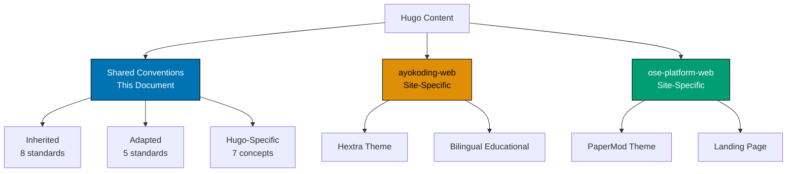
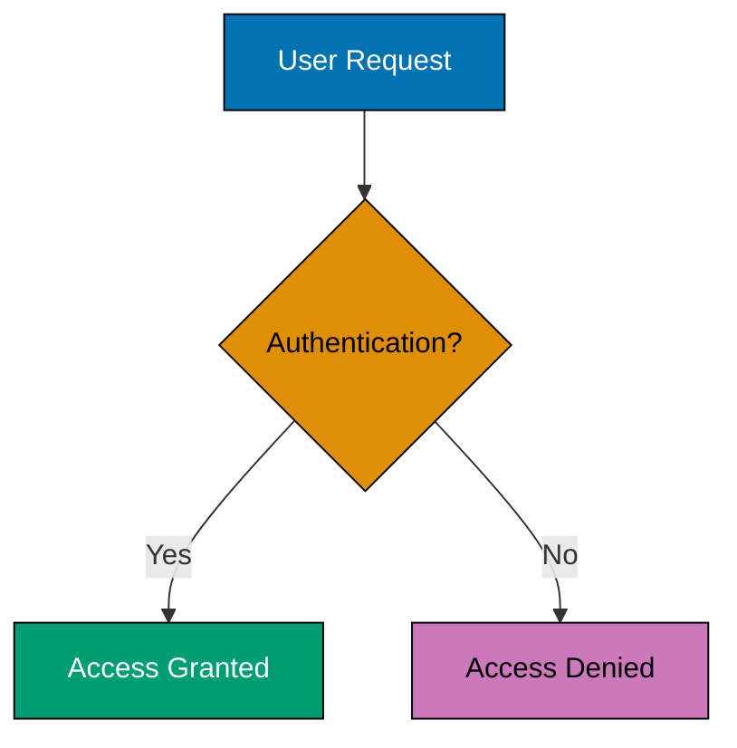
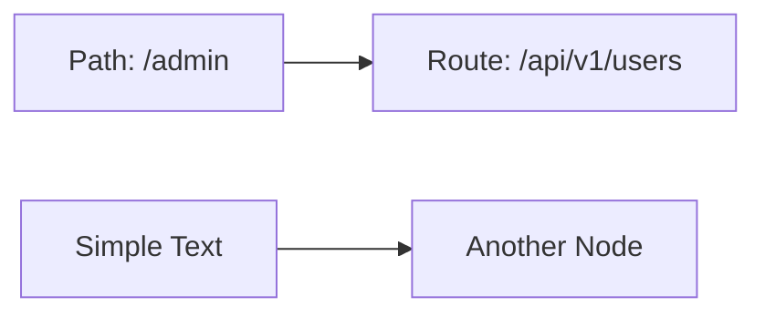

# Hugo Content Convention - Shared

This document defines **common Hugo conventions** that apply to ALL Hugo sites in this repository:

- **ayokoding-web** - Educational platform using Hextra theme ([site-specific conventions](./ayokoding.md))
- **ose-platform-web** - Project landing page using PaperMod theme ([site-specific conventions](./ose-platform.md))

## Principles Implemented/Respected

This convention implements the following core principles:

- **[Accessibility First](../../principles/content/accessibility-first.md)**: Requires alt text for images, color-blind friendly palettes in diagrams, proper heading hierarchy, and WCAG-compliant content across all Hugo sites.

- **[No Time Estimates](../../principles/content/no-time-estimates.md)**: Inherited from docs/ - forbids time-based framing in Hugo content ("takes 30 minutes", "complete in 2 weeks").

- **[Simplicity Over Complexity](../../principles/general/simplicity-over-complexity.md)**: Shared conventions document eliminates duplication between site-specific documents. Common standards in one place, site-specific patterns separated cleanly.

## Purpose

This convention establishes shared standards that apply to **all Hugo sites** in the repository (ayokoding-web and ose-platform-web). It defines universal frontmatter requirements, markdown formatting, and content quality rules that every Hugo site must follow, providing a common foundation before site-specific conventions apply.

## Scope

### What This Convention Covers

- **Universal frontmatter** - YAML fields required by all Hugo sites
- **Markdown syntax** - How to write content for Hugo markdown processing
- **Content formatting** - Headings, lists, code blocks, and other markdown elements
- **Asset management** - Images, diagrams, and other media files
- **Cross-site standards** - Quality requirements for all Hugo content

### What This Convention Does NOT Cover

- **Site-specific conventions** - See [ayokoding-web convention](./ayokoding.md) and [ose-platform-web convention](./ose-platform.md)
- **Hugo theme development** - Covered in [Hugo Development Convention](../../development/hugo/development.md)
- **Content strategy** - What content to create (covered in domain conventions)
- **Deployment** - Covered by site-specific deployer agents

## Document Structure

This shared document contains conventions that apply to **both sites**:

1. **Inherited Conventions** (8) - Standards from `docs/` that apply to Hugo content
2. **Adapted Conventions** (5) - Standards modified for Hugo's requirements
3. **Hugo-Specific Conventions** (7) - Basic Hugo concepts that apply to both sites

**Site-specific patterns** (themes, configurations, workflows) are documented in separate files:

- [ayokoding-web specific conventions](./ayokoding.md)
- [ose-platform-web specific conventions](./ose-platform.md)



---

## Inherited Conventions

These conventions from `docs/` directory apply to Hugo content without modification.

### 1. Mathematical Notation Convention

**Reference**: [Mathematical Notation Convention](../formatting/mathematical-notation.md)

**Application to Hugo**: Use LaTeX notation for all mathematical equations and formulas in Hugo content.

- **Inline math**: `$...$` for inline equations (e.g., $r_f$, $\beta$)
- **Display math**: `$$...$$` for block equations
- **Applies to**: Learning content in ayokoding-web (tutorials, technical explanations)

**Example (ayokoding-web learning content)**:

```markdown
The risk-free rate $r_f$ is typically represented using the formula:

$$
r_f = r_{real} + \pi
$$

where $\pi$ represents the expected inflation rate.
```

**Important**: Do NOT use LaTeX inside code blocks, Mermaid diagrams, or ASCII art.

### 2. Color Accessibility Convention

**Reference**: [Color Accessibility Convention](../formatting/color-accessibility.md)

**Application to Hugo**: All Mermaid diagrams in Hugo content MUST use the verified accessible color palette.

**Accessible Color Palette**:

- Blue: `#0173B2`
- Orange: `#DE8F05`
- Teal: `#029E73`
- Purple: `#CC78BC`
- Brown: `#CA9161`

**Applies to**: All diagrams in both sites (ayokoding-web and ose-platform-web)

**Example**:

````markdown

````

**Never use**: Red, green, or yellow (invisible to color blindness types)

### 3. Diagrams Convention

**Reference**: [Diagrams and Schema Convention](../formatting/diagrams.md)

**Application to Hugo**: Use Mermaid diagrams as primary format. Prefer vertical orientation (top-down) for mobile-friendly viewing.

**Applies to**: All visual content in both sites

**Diagram Types**:

- Flowcharts for processes
- Sequence diagrams for interactions
- Class diagrams for architecture
- State diagrams for workflows

**Example (ayokoding-web tutorial)**:

````markdown

````

**CRITICAL: Mermaid Syntax Rules**

Hugo's Mermaid renderer has strict syntax requirements:

1. **Comments**: Use `%% Comment %%` (NO curly braces)
2. **Text with special characters**: Quote text containing forward slashes, brackets, or special symbols

PASS: **Good (correct Mermaid syntax)**:

````markdown

````

FAIL: **Bad (syntax errors)**:

````markdown
```mermaid
%%{ Color Palette: ... }%% <!-- WRONG! Curly braces cause "syntax error in text" -->
flowchart LR
    A[/admin] --> B[/api/v1/users] <!-- WRONG! Unquoted forward slashes cause "syntax error in text" -->
```
````

**Rationale**:

- `%%{ }%%` is reserved for Mermaid directives (init config), not comments
- Forward slashes in unquoted bracket text break Mermaid's parser
- Quoting text containing special characters prevents parsing errors

### 4. Emoji Usage Convention

**Reference**: [Emoji Usage Convention](../formatting/emoji.md)

**Application to Hugo**: Selective use of semantic emojis to enhance document scannability.

**Applies to**: Both ayokoding-web and ose-platform-web content

**Allowed Usage**:

- Section markers (PASS: Success, FAIL: Error, Warning)
- Status indicators (Launch, Maintenance, Analytics)
- Category icons ( Tutorial, Goal, Tip)

**Example (ose-platform-web update)**:

```markdown
## Release Update

PASS: **Completed Features**

- User authentication system
- Dashboard analytics

**Known Issues**

- Search optimization in progress
```

**Forbidden**: Overuse, decorative emojis without semantic meaning

### 5. Timestamp Format Convention

**Reference**: [Timestamp Format Convention](../formatting/timestamp.md)

**Application to Hugo**: All timestamps MUST use ISO 8601 format with UTC+7 timezone.

**Format**: `YYYY-MM-DDTHH:MM:SS+07:00`

**Applies to**: All frontmatter date fields in both sites

**Example**:

```yaml
---
title: "Getting Started with Hugo"
date: 2025-12-07T14:30:00+07:00
lastmod: 2025-12-07T15:45:00+07:00
---
```

**Important**: Hugo's frontmatter parser requires this exact format. Do NOT omit the timezone offset.

### 6. Tutorial Convention

**Reference**: [Tutorial Convention](../tutorial/general.md)

**Application to Hugo**: Applies to learning content in **ayokoding-web only**.

**Scope**: `apps/ayokoding-web/content/id/belajar/` and `apps/ayokoding-web/content/en/learn/`

**Key Requirements**:

- Progressive scaffolding (build on previous knowledge)
- Hands-on elements (code examples, exercises)
- Visual aids (diagrams, screenshots, code blocks)
- Clear learning objectives
- Narrative flow with context

**Example (ayokoding-web tutorial structure)**:

```markdown
---
title: "Building Your First API with Node.js"
date: 2025-12-07T10:00:00+07:00
draft: false
description: "Step-by-step tutorial for creating a REST API"
weight: 10
tags: ["nodejs", "api", "tutorial"]
categories: ["learn"]
---

## What You'll Learn

By the end of this tutorial, you'll be able to:

- Create a basic Express.js server
- Define REST API endpoints
- Handle JSON requests and responses

## Prerequisites

Before starting, ensure you have:

- Node.js 18+ installed
- Basic JavaScript knowledge
- A code editor (VS Code recommended)

## Step 1: Project Setup

Let's start by creating a new project...
```

### 7. Tutorial Naming Convention

**Reference**: [Tutorial Naming Convention](../tutorial/naming.md)

**Application to Hugo**: Use standardized tutorial types in **ayokoding-web learning content only**.

**Scope**: ayokoding-web only (ose-platform-web does not use tutorials)

**Tutorial Types**:

- **Initial Setup** (0-5%) - Quick "Hello World" verification
- **Quick Start** (5-30%) - Learn enough to explore independently
- **Beginner** (0-60%) - Comprehensive foundation from scratch
- **Intermediate** (60-85%) - Professional-level expertise
- **Advanced** (85-95%) - Expert-level mastery
- **Cookbook** (Practical) - Day-to-day recipes and real-world problems

**Note**: Coverage percentages indicate depth/scope, NOT time required. See "No Time Estimates" convention below.

**Example (ayokoding-web file naming)**:

```
content/id/belajar/nodejs/
├── initial-setup.md           # Initial Setup tutorial
├── quick-start.md             # Quick Start tutorial
├── beginner-guide.md          # Beginner tutorial
└── cookbook/
    └── error-handling.md      # Cookbook recipe
```

### 8. No Time Estimates in Educational Content

**Reference**: [Content Quality Principles - No Time Estimates](../content/quality.md#no-time-estimates)

**Application to Hugo**: Do NOT include time estimates in educational/tutorial content.

**Scope**: ayokoding-web learning content (`content/en/learn/`, `content/id/belajar/`)

**Rationale**:

- Time estimates create artificial pressure on learners
- Everyone learns at different speeds
- Focus on WHAT learners accomplish, not HOW LONG it takes
- Makes content evergreen (no need to update time claims)

**Forbidden in Hugo Content**:

FAIL: **Avoid**:

```markdown
This tutorial takes 2-3 hours to complete.
Duration: 45 minutes
Learn this in 30 minutes.
```

PASS: **Good**:

```markdown
By the end of this tutorial, you'll be able to...
Coverage: 60-85% of domain knowledge (intermediate depth)
```

**Exception - Coverage Percentages Allowed**:

Coverage percentages indicate **depth/scope**, not **time**, so they're allowed:

- PASS: "Coverage: 0-5%" (initial setup scope)
- PASS: "Coverage: 60-85%" (intermediate depth)

---

## Adapted Conventions

These conventions from `docs/` are modified for Hugo's specific requirements.

### 1. Indentation Convention

**Reference**: [Indentation Convention](../formatting/indentation.md)

**Adaptation for Hugo**:

- **YAML Frontmatter**: MUST use 2 spaces per indentation level (NOT tabs)
- **Markdown Content**: Standard markdown indentation (spaces or tabs acceptable)
- **Code Blocks**: Follow language-specific indentation (see convention doc)

**Why different from docs/?**

- docs/ uses standard markdown with space indentation (2 spaces per level)
- Hugo content is published web content, not Obsidian vault
- Standard markdown practices apply

**Example (correct indentation)**:

```yaml
---
title: "My Post"
tags:
  - nodejs # 2 spaces before dash
  - javascript # 2 spaces before dash
categories:
  - tutorials
---
Content starts here with standard markdown indentation.

- Bullet points use spaces or tabs (both acceptable)
- Nested bullets follow standard markdown
```

FAIL: **Incorrect (tabs in frontmatter)**:

```yaml
---
title: "My Post"
tags:
  - nodejs # TAB before dash - WRONG!
  - javascript
---
```

### 2. Linking Convention

**Reference**: [Linking Convention](../formatting/linking.md)

**Adaptation for Hugo**:

- **Internal Links**: Use absolute paths starting with `/` (e.g., `/learn/path`) WITHOUT `.md` extension
- **External Links**: Standard markdown `[text](url)`
- **Asset Links**: Reference `/images/` path (served from `static/`)

**Why different from docs/?**

- docs/ uses `.md` extensions for Obsidian compatibility
- Hugo generates URLs without `.md` extensions
- Using `.md` in Hugo links breaks in production builds

#### Internal Link Path Format

**CRITICAL RULE**: Always use **absolute paths** starting with `/` for internal content links. Never use relative paths (`./` or `../`).

**Why absolute paths?**

Hugo renders the same navigation content in different page contexts (sidebar, mobile menu, homepage). Relative links resolve differently depending on where they're rendered:

- From `/en/learn/` page: `./ai/` → `/en/learn/ai/`
- From `/en/` homepage: `./ai/` → `/en/ai/` FAIL: (broken)

Absolute paths work correctly from **any page context**.

**Correct (absolute paths)**:

```markdown
<!-- Hugo ref shortcode (recommended for validation) -->

Check out our [getting started guide]()

<!-- Absolute path without .md (works in all contexts) -->

[Chat with PDF](/learn/ai/chat-with-pdf)
[Software Engineering](/learn/swe)
[About Us](/about)

<!-- External link (standard markdown) -->

Visit [Hugo Documentation](https://gohugo.io/documentation/)

<!-- Image from static/ directory -->


```

FAIL: **Incorrect (relative paths or .md extension)**:

```markdown
<!-- WRONG! Relative paths break in different rendering contexts -->

[Chat with PDF](./ai/chat-with-pdf/)
[Software Engineering](../swe/)
[Advanced Guide](../../advanced/)

<!-- WRONG! Using .md extension breaks in production -->

[Tutorial](/learn/tutorial.md)
[Guide](./guide.md)
```

**Language Prefix Handling**:

The approach depends on your Hugo configuration:

**For sites with `defaultContentLanguageInSubdir: true`** (like ayokoding-web and ose-platform-web):

- **INCLUDE language prefix** explicitly in internal links
- Both languages are served from subdirectories (`/en/`, `/id/`, etc.)
- Links should specify the target language explicitly

```markdown
PASS: Correct: [Tutorial](/en/learn/nodejs)
PASS: Correct: [Tutorial](/id/belajar/nodejs)
FAIL: Wrong: [Tutorial](/learn/nodejs) <!-- Missing language prefix -->
```

**For sites with `defaultContentLanguageInSubdir: false`**:

- Default language served at root (`/learn/nodejs`)
- Other languages in subdirectories (`/id/belajar/nodejs`)
- Omit prefix for default language links

**Using Hugo Shortcodes** (recommended for cross-language safety):

```markdown
 <!-- Hugo handles language context automatically -->
 <!-- Explicit language targeting -->
```

**Verified**: Production ayokoding.com uses `/en/` prefix in all internal links. This is the correct approach for `defaultContentLanguageInSubdir: true` configuration.

### 3. File Naming Convention

**Reference**: [File Naming Convention](../meta/file-naming.md)

**Adaptation for Hugo**:

- **Content Files**: Use simple slugs or date-prefixed slugs (no prefix encoding)
- **Section Files**: Use `_index.md` for directory listings
- **URL Generation**: Hugo uses filename (minus extension) as URL slug

**Patterns**:

```
Hugo Content Naming Patterns:

1. Simple slug (most common):
   getting-started.md
   advanced-tutorial.md

2. Date-prefixed (blog posts):
   2025-12-07-release-update.md
   2025-11-15-feature-announcement.md

3. Section index:
   _index.md (lists content in directory)

4. Multi-language:
   about.id.md (Indonesian)
   about.en.md (English)
```

**Example (ayokoding-web structure)**:

```
content/
├── id/
│   ├── _index.md                      # Indonesian homepage
│   ├── belajar/
│   │   ├── _index.md                  # Learning section index
│   │   └── nodejs/
│   │       ├── _index.md              # Node.js topic index
│   │       ├── getting-started.md     # Simple slug
│   │       └── advanced-patterns.md   # Simple slug
└── en/
    └── learn/
        └── nodejs/
            └── getting-started.md     # English version
```

**Example (ose-platform-web structure)**:

```
content/
├── updates/
│   ├── _index.md                                 # Updates section index
│   ├── 2025-12-07-initial-release.md            # Date-prefixed
│   └── 2025-11-20-platform-announcement.md      # Date-prefixed
└── about.md                                      # Simple slug
```

### 4. Frontmatter Convention

**Format**: YAML (both sites use YAML, not TOML)

**Universal Required Fields**:

- `title` - Page title (string)
- `date` - Publication date (ISO 8601 with UTC+7)
- `draft` - Draft status (boolean)

**Common Optional Fields**:

- `description` - Page description (recommended 150-160 chars for SEO)
- `tags` - Content tags (array)
- `categories` - Content categories (array)
- `weight` - Page ordering (integer)

**Site-Specific Fields**: See site-specific convention documents

**Example (basic frontmatter)**:

```yaml
---
title: "Getting Started with TypeScript"
date: 2025-12-07T10:00:00+07:00
draft: false
description: "Learn TypeScript fundamentals and start building type-safe applications"
weight: 10
tags: ["typescript", "javascript", "tutorial"]
categories: ["learn"]
---
```

### 5. Date Format Convention

**Reference**: [Timestamp Format Convention](../formatting/timestamp.md)

**Adaptation for Hugo**: Same as inherited convention, but emphasized here due to critical importance.

**REQUIRED Format**: `YYYY-MM-DDTHH:MM:SS+07:00` (ISO 8601 with UTC+7)

**Hugo Frontmatter Fields Using This Format**:

- `date` - Publication date (required)
- `lastmod` - Last modification date
- `publishDate` - Future publish date
- `expiryDate` - Content expiration date

**Example**:

```yaml
---
title: "My Post"
date: 2025-12-07T14:30:00+07:00
lastmod: 2025-12-07T15:45:00+07:00
---
```

**Why This Matters**:

- Hugo's frontmatter parser expects ISO 8601 format
- Timezone is REQUIRED for accurate timestamps
- UTC+7 is Western Indonesian Time (WIB) - repository standard

---

## Hugo-Specific Conventions

These conventions are unique to Hugo static site generation and apply to both sites.

### 1. No Duplicate H1 Headings

**CRITICAL**: Hugo content markdown files MUST NOT include H1 headings (`# ...`) that duplicate the frontmatter `title` field.

**Why this matters**: Hugo themes (Hextra for ayokoding-web, PaperMod for ose-platform-web) automatically render the `title` field from frontmatter as the page heading (H1). When markdown content also includes an H1 heading, it creates duplicate heading display on the rendered page.

**Rule**: Content should start with introduction text or H2 headings (`## ...`). If an H1 is needed for structural reasons, it must be semantically different from the title.

**Applies to**: ALL Hugo content files in both ayokoding-web and ose-platform-web.

PASS: **Good (no duplicate H1)**:

```markdown
---
title: "Beginner Tutorial - Elixir"
date: 2025-12-22T10:00:00+07:00
draft: false
---

This tutorial covers the fundamentals of Elixir programming...

## What You'll Learn

- Pattern matching
- Functional programming concepts
- Basic syntax

## Prerequisites

Before starting, ensure you have...
```

FAIL: **Bad (duplicate H1)**:

```markdown
---
title: "Beginner Tutorial - Elixir"
date: 2025-12-22T10:00:00+07:00
draft: false
---

# Beginner Tutorial - Elixir

This tutorial covers the fundamentals...
```

**Issue**: The title "Beginner Tutorial - Elixir" appears twice on the rendered page (once from frontmatter auto-rendering, once from markdown H1).

**Valid Use Case for H1** (semantically different from title):

```markdown
---
title: "Software Engineering Best Practices"
---

# Introduction to Code Quality

This section discusses foundational concepts...

# Design Patterns Overview

This section covers common patterns...
```

**Note**: While multiple H1s are technically allowed when semantically different from the title, most Hugo content should avoid H1s entirely and start with H2s.

### 2. Archetypes

**Definition**: Content templates used to generate new files with pre-populated frontmatter.

**Location**: `archetypes/` directory in each Hugo site

**Usage**: `hugo new content/path/to/file.md --kind archetype-name`

**Purpose**: Ensure consistent frontmatter across content types

**Site-Specific Archetypes**: Each site defines its own archetypes - see site-specific convention documents:

- [ayokoding-web archetypes](./ayokoding.md#archetypes)
- [ose-platform-web archetypes](./ose-platform.md#archetypes)

### 3. Shortcodes

**Definition**: Reusable content snippets that generate HTML dynamically.

**Hugo Built-in Shortcodes** (available in both sites):

- `` - Internal content reference
- `` - Relative content reference
- `` - Image with caption
- `` - Syntax highlighting
- `` - Embed YouTube video
- `` - Embed tweet

**Theme-Specific Shortcodes**: Each theme provides additional shortcodes - see site-specific convention documents:

- [Hextra shortcodes (ayokoding-web)](./ayokoding.md#hextra-shortcodes)
- [PaperMod shortcodes (ose-platform-web)](./ose-platform.md#papermod-shortcodes)

**Example (using Hugo built-in shortcodes)**:

```markdown


Check out our [getting started guide]()
```

**CRITICAL: Shortcode Delimiter Rules**

Hugo uses two delimiter types based on content processing needs:

1. **``** - For shortcodes that output **HTML directly** (no Markdown processing)
2. **`{}`** - For shortcodes that contain **Markdown content** (requires Markdown processing)

**When to Use Each**:

PASS: **Use `{}` for Markdown content**:

```markdown
{}

### Step 1: Install Dependencies

Run `npm install` to install required packages.

### Step 2: Configure Settings

Edit the configuration file...

{}
```

PASS: **Use `` for HTML content**:

```markdown



```

FAIL: **Bad (wrong delimiter for Markdown content)**:

```markdown
 <!-- WRONG! Displays as plain text instead of rendering -->

### Step 1: Install Dependencies

Run `npm install`


```

**Rationale**:

- `` treats inner content as raw HTML - Markdown won't be processed
- `{}` processes inner content as Markdown before rendering
- Using wrong delimiter causes content to display as plain text
- Theme shortcodes often require Markdown processing (steps, callouts, cards)

### 4. Taxonomy

**Definition**: Classification system for content (tags, categories, series).

**Universal Taxonomy** (both sites):

- **tags**: Granular topics (e.g., "nodejs", "api", "tutorial")
- **categories**: Broad content groupings (e.g., "learn", "updates")

**Site-Specific Taxonomy**: Each site defines specific category values - see site-specific convention documents:

- [ayokoding-web taxonomy](./ayokoding.md#taxonomy)
- [ose-platform-web taxonomy](./ose-platform.md#taxonomy)

**Example (generic usage)**:

```yaml
---
title: "Understanding Async/Await in JavaScript"
tags: ["javascript", "async", "promises", "tutorial"]
categories: ["learn"]
---
```

### 5. Asset Organization

**Static Assets Location**: `static/` directory (served at site root)

**Recommended Structure**:

```
static/
├── images/
│   ├── screenshots/
│   ├── diagrams/
│   ├── logos/
│   └── posts/
│       └── 2025/
│           └── 12/
│               └── post-specific-image.png
├── downloads/                # Downloadable files
└── fonts/                    # Custom fonts (if needed)
```

**Image References in Content**:

```markdown
<!-- Absolute path from static/ root -->


<!-- Using Hugo figure shortcode -->


```

**Alt Text Requirement**: All images MUST have descriptive alt text for accessibility.

**Site-Specific Asset Organization**: Each site may have additional subdirectories - see site-specific convention documents.

### 6. Content Types

**Regular Content Files**: `file-name.md`

- Individual pages or posts
- Display full content
- Appear in lists and navigation

**Section Index Files**: `_index.md`

- List pages for a directory
- Can include intro content
- Generate taxonomy pages

**Example Structure**:

```
content/en/learn/
├── _index.md                           # Learning section index
├── nodejs/
│   ├── _index.md                       # Node.js topic index
│   ├── getting-started.md              # Regular content
│   └── advanced-patterns.md            # Regular content
└── typescript/
    ├── _index.md                       # TypeScript topic index
    └── basics.md                       # Regular content
```

**\\\_index.md vs Regular Content**:

```yaml
# _index.md (section index)
---
title: "Node.js Learning Resources"
description: "Comprehensive Node.js tutorials and guides"
---
Browse our Node.js learning materials below.
# regular file (e.g., getting-started.md)
---
title: "Getting Started with Node.js"
date: 2025-12-07T10:00:00+07:00
draft: false
---
This tutorial covers...
```

**Site-Specific Content Type Patterns**: Each site has specific rules for index files and content organization - see site-specific convention documents.

### 7. URL Structure

**Hugo URL Generation**:

- Filename (minus extension) becomes URL slug
- Directory structure reflects URL path
- Configured via `hugo.yaml` (permalink patterns)

**URL Pattern Examples**:

```
# ayokoding-web
content/id/belajar/nodejs/getting-started.md
→ URL: https://ayokoding.com/id/belajar/nodejs/getting-started

content/en/learn/typescript/basics.md
→ URL: https://ayokoding.com/en/learn/typescript/basics

# ose-platform-web
content/updates/2025-12-07-initial-release.md
→ URL: https://oseplatform.com/updates/2025-12-07-initial-release

content/about.md
→ URL: https://oseplatform.com/about
```

**Custom URLs** (using frontmatter):

```yaml
---
title: "About Us"
url: "/about/" # Override default URL
slug: "company-info" # Override slug only (keeps path)
---
```

**Site-Specific URL Patterns**: Each site may have custom permalink configurations - see site-specific convention documents.

---

## Content Validation Checklist

Before publishing Hugo content, verify:

- [ ] Frontmatter uses YAML format with 2-space indentation
- [ ] Date format is `YYYY-MM-DDTHH:MM:SS+07:00`
- [ ] Description length is 150-160 characters (if present)
- [ ] **No duplicate H1 headings** - Content does NOT include H1 (`# ...`) that duplicates frontmatter title
- [ ] Internal links use absolute paths without `.md` extension
- [ ] All images have descriptive alt text
- [ ] Mermaid diagrams use accessible color palette
- [ ] Tags and categories are properly formatted arrays
- [ ] Draft status is set correctly (`draft: true/false`)
- [ ] Assets are organized in appropriate `static/` subdirectories

**Site-Specific Validation**: Each site has additional validation requirements - see site-specific convention documents.

---

## References

**Inherited Conventions**:

- [Mathematical Notation Convention](../formatting/mathematical-notation.md)
- [Color Accessibility Convention](../formatting/color-accessibility.md)
- [Diagrams and Schema Convention](../formatting/diagrams.md)
- [Emoji Usage Convention](../formatting/emoji.md)
- [Timestamp Format Convention](../formatting/timestamp.md)
- [Tutorial Convention](../tutorial/general.md)
- [Tutorial Naming Convention](../tutorial/naming.md)
- [Content Quality Principles](../content/quality.md)

**Related Conventions**:

- [File Naming Convention](../meta/file-naming.md)
- [Linking Convention](../formatting/linking.md)
- [Indentation Convention](../formatting/indentation.md)

**Site-Specific Conventions**:

- [ayokoding-web Hugo Content Convention](./ayokoding.md)
- [ose-platform-web Hugo Content Convention](./ose-platform.md)

**External Resources**:

- [Hugo Documentation](https://gohugo.io/documentation/)
- [Hextra Theme Documentation](https://imfing.github.io/hextra/docs/)
- [PaperMod Theme Documentation](https://adityatelange.github.io/hugo-PaperMod/)
