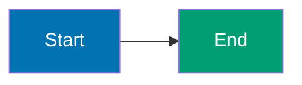

## Purpose

This convention **extends the [Tutorials Convention](./general.md) for the By Concept tutorial type**, defining specialized standards for narrative-driven learning through comprehensive concept explanations, heavily annotated code examples, and rich diagrams achieving 95% coverage.

**Base requirements**: By-concept tutorials inherit general tutorial standards (learning-oriented approach, visual completeness, hands-on elements from [Tutorials Convention](./general.md)) and add concept-specific specializations defined below.

**Target audience**: Developers learning a new language/framework who prefer comprehensive narrative explanations over code-first learning, including complete beginners and those transitioning from other languages.

## Structure Integration with General Tutorial Standards

By-concept tutorials adapt the general [Tutorial Convention](./general.md) structure for narrative-driven learning:

### Adaptation of General Structure

**Traditional Tutorial Structure** (from [Tutorials Convention](./general.md)):

- Introduction → Prerequisites → Objectives → Content Sections → Challenges → Summary → Next Steps

**By-Concept Structure Adaptation**:

1. **Introduction section** (serves as motivation):
   - Hook and motivation (why this language/framework matters)
   - Prerequisites (programming experience level)
   - Learning path diagram (visual roadmap)
   - Coverage explanation (0-40% beginner, 40-75% intermediate, 75-95% advanced)
   - Links to by-example path for code-first alternative

2. **Concept sections** (replace sequential examples):
   - 15-25 concept sections per level (beginner/intermediate/advanced)
   - Each section teaches one major concept through narrative + annotated code
   - Concepts build progressively from fundamentals to advanced patterns
   - Coverage: beginner (0-40%), intermediate (40-75%), advanced (75-95%)

3. **Hands-on elements integrated into sections**:
   - Code examples within each concept section
   - Exercises at 4 difficulty levels (Basic, Intermediate, Advanced, Expert)
   - Learners can copy, run, and modify code while reading explanations

4. **Summary and next steps** (at end of each level):
   - Links to by-example path for code-first learning
   - Links to related frameworks/tools
   - Production application guidance

### Inherited Requirements from General Tutorial Convention

By-concept tutorials MUST follow these general tutorial standards:

- PASS: **Learning-oriented approach** (Diátaxis framework): Teach through understanding, not just reference
- PASS: **Progressive Disclosure**: Complexity increases gradually (beginner → intermediate → advanced)
- PASS: **Visual completeness**: Diagrams when appropriate (30-50 diagrams total)
- PASS: **Hands-on elements**: Every section has runnable code examples
- PASS: **No time estimates**: Use coverage percentages (0-40%, 40-75%, 75-95%), not time
- PASS: **Accessibility**: Color-blind friendly diagrams, clear structure
- PASS: **Real-world relevance**: Connect concepts to production use cases

### Specialized Requirements for By-Concept

Beyond general tutorial standards, by-concept adds:

- PASS: **Annotation density**: 1.0-2.25 comment lines per code line (same as by-example)
- PASS: **Narrative structure**: Concepts explained before showing code
- PASS: **Section count**: 40-60 sections total achieving 95% coverage
- PASS: **Diagram density**: 30-50 diagrams total (same as by-example)
- PASS: **Concept-first approach**: Explain concepts, then illustrate with annotated code

## Core Characteristics

### 1. Concept-Driven Approach

**Philosophy**: Explain the concept first, then illustrate with heavily annotated code.

Sections prioritize:

- Conceptual understanding before code
- Narrative explanations of WHY and HOW
- Multiple code examples per concept showing variations
- Progressive building from simple to complex

### 2. Coverage Target: 95%

**What 95% means**: Depth and breadth of language/framework features needed for production work.

**Included in 95%**:

- Core syntax and semantics
- Standard library essentials
- Production patterns and best practices
- Common frameworks and tools
- Modern language features
- Testing and debugging
- Concurrency and parallelism
- Error handling patterns
- Performance considerations

**Excluded from 95% (the remaining 5%)**:

- Rare edge cases
- Framework internals and source code
- Specialized libraries outside standard use
- Language implementation details
- Platform-specific advanced features
- Deprecated features

**Coverage verification**: The ayokoding-web-general-checker agent validates coverage against comprehensive checklists for each language/framework.

### 3. Section Count: 40-60 Total

**Target range**: 40-60 concept sections per language or framework

**Distribution across levels**:

- **Beginner**: 15-25 sections (0-40% coverage) - Fundamentals and core concepts
- **Intermediate**: 12-20 sections (40-75% coverage) - Production patterns
- **Advanced**: 10-20 sections (75-95% coverage) - Expert mastery

**Actual ranges observed in production** (ayokoding-web):

- Golang: 60 sections (20/21/19)
- Python: 42 sections (20/12/10)
- Rust: 49 sections (19/15/15)
- Java: 50 sections (18/15/17)
- Kotlin: 49 sections (18/16/15)
- Elixir: 53 sections (23/16/14)
- Clojure: 43 sections (18/12/13)
- Dart: 49 sections (17/19/13)

**Rationale**:

- 40-60 sections provides comprehensive coverage achieving 95% target
- Distribution adapts to language complexity (advanced can vary 10-20 based on depth)
- Fewer sections than by-example (40-60 vs 75-85) because concepts group related features
- Each section covers more ground than individual examples

## Section Structure

Every concept section follows a **recommended structure**:

### Part 1: Concept Title and Brief Introduction (2-3 sentences)

**Purpose**: Introduce the concept and its importance

**Must answer**:

- What is this concept?
- Why does it matter in production code?
- How does it relate to previous concepts?

**Example**:

```markdown
## Goroutines and Concurrency

Go's goroutines are lightweight threads managed by the Go runtime, not the OS. Unlike traditional threads that consume 1MB+ of stack space, goroutines start with only 2KB and grow dynamically. This design enables Go programs to run millions of concurrent operations on a single machine, making Go ideal for high-throughput network services.
```

### Part 2: Mermaid Diagram (when appropriate)

**When to include**:

- Concept involves multiple components or flow
- State machines or lifecycle diagrams clarify behavior
- Architecture or relationships need visualization
- Comparison between approaches benefits from visual aid

**When NOT to include**:

- Simple syntax demonstrations
- Single-function concepts with clear linear flow
- Trivial operations

**Diagram requirements**:

- Use color-blind friendly palette: Blue #0173B2, Orange #DE8F05, Teal #029E73, Purple #CC78BC, Brown #CA9161
- Include descriptive labels on nodes and edges
- Keep diagrams focused on the specific concept
- Use appropriate diagram type (graph LR/TD, sequenceDiagram, stateDiagram)

### Part 3: Narrative Explanation (3-10 paragraphs)

**Purpose**: Explain the concept in depth before showing code

**Must cover**:

- How the concept works internally
- When to use this pattern
- Common use cases and applications
- Trade-offs and alternatives
- Best practices and pitfalls

**Example**:

```markdown
Goroutines are functions that run concurrently with other functions. To start a goroutine, use the `go` keyword before a function call. The Go runtime multiplexes goroutines onto OS threads, handling scheduling and context switching automatically.

Channel-based communication prevents the shared-memory concurrency bugs that plague C++ and Java. Instead of locks and mutexes, goroutines communicate by sending values through channels. This "share memory by communicating" philosophy eliminates entire classes of race conditions.

The Go scheduler is non-preemptive at the language level but preemptive at the runtime level. Goroutines yield control at communication points (channel operations, system calls, function calls), enabling efficient cooperative multitasking with minimal overhead.
```

### Part 4: Heavily Annotated Code Examples (1-5 examples)

**Core requirement**: Every significant line must have an inline comment

**Annotation density**: 1.0-2.25 lines of comment for every line of code (same as by-example)

**Comment annotations use `// =>` or `# =>` notation**:

```go
ch := make(chan int)             // => ch is unbuffered channel (blocks on send until receive)
                                  // => Type: chan int (channel of integers)

go func() {                       // => Spawn goroutine (runs concurrently)
    ch <- 42                      // => Send 42 to channel (blocks until main receives)
}()                               // => Goroutine now running in background

value := <-ch                     // => Receive from channel (blocks until goroutine sends)
                                  // => value is 42
fmt.Println(value)                // => Output: 42
```

**Required annotations**:

- **Variable states**: Show value and type after assignment
- **Execution flow**: Show which branch executes and why
- **Side effects**: Document mutations, I/O operations, state changes
- **Expected outputs**: Show stdout/stderr content with `=> Output:` prefix
- **Timing (compile vs runtime)**: Distinguish compile-time checks from runtime execution
- **Best practices**: Use PASS: GOOD vs FAIL: BAD indicators for pattern comparisons

**Code organization**:

- Include full imports (no "assume this is imported")
- Define helper functions if needed for clarity
- Use descriptive variable names
- Format code with language-standard tools (gofmt, mix format, etc.)

### Part 5: Key Takeaway (1-2 sentences)

**Purpose**: Distill the core insight to its essence

**Must highlight**:

- The most important aspect of the concept
- When to apply this in production
- Common pitfalls to avoid

**Example**:

```markdown
**Key Takeaway**: Use goroutines for I/O-bound operations and channel communication for coordination. Never share memory between goroutines without synchronization - use channels or sync primitives instead.
```

### Part 6: Why It Matters (2-3 sentences, 50-100 words)

**Purpose**: Connect the concept to production relevance and real-world impact

**Must explain**:

- Why professionals care about this in real systems (production relevance)
- How it compares to alternatives or what problems it solves (comparative insight)
- Consequences for quality/performance/safety/scalability (practical impact)

**Quality guidelines**:

- **Active voice**: Use concrete, active language
- **Length**: 50-100 words (2-3 sentences)
- **Contextual**: Specific to the concept, NOT generic statements
- **Production-focused**: Reference real usage, companies, or measurable impacts

**Example**:

```markdown
**Why It Matters**: Goroutines enable servers to handle 10,000+ concurrent connections on a single machine with minimal memory overhead (2KB stack per goroutine vs 1MB+ per thread in Java), making Go the language of choice for high-throughput network services like Kubernetes, Docker, and Prometheus. The channel-based communication model prevents race conditions that plague shared-memory concurrency, while select statements enable sophisticated timeout and cancellation patterns essential for production resilience.
```

---

## Complete Section Structure (Production Reference)

Below is a complete section from ayokoding-web demonstrating the recommended structure:

### Goroutines and Concurrency (Golang Beginner)

Go's goroutines are lightweight threads managed by the Go runtime, not the OS. Unlike traditional threads that consume 1MB+ of stack space, goroutines start with only 2KB and grow dynamically. This design enables Go programs to run millions of concurrent operations on a single machine, making Go ideal for high-throughput network services.

```mermaid
%% Color Palette: Blue #0173B2, Orange #DE8F05, Teal #029E73, Purple #CC78BC, Brown #CA9161
sequenceDiagram
    participant Main as Main Goroutine
    participant Ch as Channel
    participant Worker as Worker Goroutine

    Main->>Ch: Create channel
    Main->>Worker: go func() (spawn)
    Worker->>Ch: Send 42
    Note over Worker: Blocks until receive
    Main->>Ch: Receive
    Ch->>Main: Returns 42
    Note over Main: Goroutine completes

    style Main fill:#0173B2,color:#fff
    style Ch fill:#DE8F05,color:#000
    style Worker fill:#029E73,color:#fff
```

Goroutines are functions that run concurrently with other functions. To start a goroutine, use the `go` keyword before a function call. The Go runtime multiplexes goroutines onto OS threads, handling scheduling and context switching automatically.

Channel-based communication prevents the shared-memory concurrency bugs that plague C++ and Java. Instead of locks and mutexes, goroutines communicate by sending values through channels. This "share memory by communicating" philosophy eliminates entire classes of race conditions.

**Code**:

```go
package main

import "fmt"

func main() {
    ch := make(chan int)             // => ch is unbuffered channel (blocks on send until receive)
                                      // => Type: chan int (channel of integers)
                                      // => Unbuffered = no capacity, synchronous send/receive

    go func() {                       // => Spawn anonymous function as goroutine
                                      // => Goroutine runs concurrently with main
                                      // => Runtime handles scheduling

        ch <- 42                      // => Send 42 to channel
                                      // => Blocks here until main goroutine receives
                                      // => Synchronous communication point
    }()                               // => Goroutine now running in background
                                      // => Main continues to next line immediately

    value := <-ch                     // => Receive from channel (blocks until goroutine sends)
                                      // => value is 42 (type: int)
                                      // => Both goroutines synchronized at this point

    fmt.Println(value)                // => Output: 42
                                      // => Goroutine has completed by now
}
```

**Key Takeaway**: Use goroutines for I/O-bound operations and channel communication for coordination. Never share memory between goroutines without synchronization - use channels or sync primitives instead.

**Why It Matters**: Goroutines enable servers to handle 10,000+ concurrent connections on a single machine with minimal memory overhead (2KB stack per goroutine vs 1MB+ per thread in Java), making Go the language of choice for high-throughput network services like Kubernetes, Docker, and Prometheus. The channel-based communication model prevents race conditions that plague shared-memory concurrency, while select statements enable sophisticated timeout and cancellation patterns essential for production resilience.

**Analysis of this section**:

- **Part 1 (Title + Intro)**: 3 sentences explaining goroutines and their importance
- **Part 2 (Diagram)**: Sequence diagram showing goroutine-channel-main communication
- **Part 3 (Narrative)**: 3 paragraphs on how goroutines work, channel communication, and design philosophy
- **Part 4 (Code)**: 11 code lines with 17 comment lines (1.55 density)
- **Part 5 (Key Takeaway)**: 2 sentences on when to use and what to avoid
- **Part 6 (Why It Matters)**: 70 words on production benefits

## Annotation Density Standards

**CRITICAL REQUIREMENT: Annotation Density Standard**

- **Density target**: 1.0-2.25 lines of comment for every line of code (same as by-example)
- **Simple code**: 1 line of annotation per code line
- **Complex code**: 2-2.25 lines of annotation per code line
- **Focus**: Concise explanations that scale naturally with code complexity

**Annotation Quality Over Quantity**:

- Each line of code gets 1-2 lines explaining what it does and why
- Simple lines get brief explanations, complex lines get detailed breakdowns
- Annotations remain focused without repetitive patterns

**Output Annotation Pattern**

Use `// =>` or `# =>` to show outputs, states, and intermediate values:

```python
x = 42                            # => x references integer object 42
                                  # => type(x) is int

y = x * 2                         # => y is 84 (x unchanged at 42)
                                  # => Multiplication creates new object

print(y)                          # => Output: 84
```

### Where to Place Extensive Explanations

**CRITICAL**: Code block annotations should focus on WHAT the code does. Extensive WHY explanations go in narrative sections.

**Code block purpose** (inside ` ```language ` fence):

- Show WHAT each line does: `x := 10 // => x is now 10 (type: int)`
- Show return values: `result := fn() // => result is "output" (string)`
- Show state changes: `counter++ // => counter is now 5`
- Show outputs: `fmt.Println(x) // => Output: 10`

**Narrative section purpose** (before/after code blocks):

- WHY this concept matters
- HOW it works internally
- WHEN to use this pattern
- Production relevance and comparisons
- Trade-offs and alternatives

## Mermaid Diagram Guidelines

### When to Include Diagrams

**INCLUDE diagram when**:

- **Concept flow** spans multiple steps or components
- **State machines** have multiple states and transitions
- **Concurrency** involves multiple threads/processes/actors
- **Architecture** shows relationships between components
- **Comparison** between approaches benefits from visual aid
- **Learning path** shows progression through topics

**SKIP diagram when**:

- Single-function concept with linear execution
- Simple syntax demonstration
- Trivial operation or calculation
- Concept is clearer from narrative + code alone

### Diagram Frequency Target

**Guideline**: 30-50 total diagrams per language (same as by-example)

**Production standards** (ayokoding-web enhanced target):

- **Beginner level**: 10-15 diagrams (50-40% of 15-25 sections)
- **Intermediate level**: 10-15 diagrams (60-75% of 12-20 sections)
- **Advanced level**: 10-15 diagrams (60-75% of 10-20 sections)

**Current production state** (ayokoding-web, needs enhancement):

- Most languages: 8-15 diagrams total (below target)
- Dart: 46 diagrams (above target, good reference)

**Rationale**: By-concept sections cover broader topics than by-example individual examples, so higher diagram percentage per section (60-75% vs 30-50%) achieves similar total diagram count (30-50).

### Color-Blind Friendly Palette

**Mandatory colors** (WCAG AA compliant):

- **Blue** #0173B2 - Primary elements, starting states
- **Orange** #DE8F05 - Secondary elements, processing states
- **Teal** #029E73 - Success states, outputs
- **Purple** #CC78BC - Alternative paths, options
- **Brown** #CA9161 - Neutral elements, helpers

**Forbidden colors**: Red, green, yellow (not color-blind accessible)

**Comment syntax**: Use `%%` for comments (NOT `%%{ }%%` which causes syntax errors)



## Coverage Progression by Level

### Beginner (0-40% coverage)

**Focus**: Language/framework fundamentals and core concepts

**Topics**:

- Variable declaration and types
- Control flow (if, loops, switch)
- Functions and methods
- Basic data structures (arrays, lists, maps, structs)
- Error handling basics
- Package/module structure
- Basic testing
- Standard library essentials

**Section count**: 15-25 sections

### Intermediate (40-75% coverage)

**Focus**: Production patterns and framework features

**Topics**:

- Advanced data structures and patterns
- Concurrency primitives
- I/O and networking
- HTTP clients and servers
- Database access patterns
- Testing strategies (integration, mocking)
- Common frameworks and libraries
- Error wrapping and custom errors
- Configuration and environment handling

**Section count**: 12-20 sections (varies by language complexity)

**Rationale for variance**: Some languages have simpler production patterns requiring fewer sections, while others with richer ecosystems need more coverage.

### Advanced (75-95% coverage)

**Focus**: Expert mastery and optimization

**Topics**:

- Advanced concurrency patterns (pipelines, fan-out/fan-in)
- Performance optimization and profiling
- Reflection and metaprogramming
- Generic programming (where applicable)
- Advanced framework features
- Production deployment patterns
- Observability (metrics, tracing, logging)
- Security patterns
- Internals and debugging
- Best practices synthesis

**Section count**: 10-20 sections

## File Naming and Organization

### Directory Structure

```
content/
└── en/
    └── learn/
        └── software-engineering/
            └── programming-language/
                └── {language}/
                    └── tutorials/
                        └── by-concept/
                            ├── _index.md          # Landing page
                            ├── beginner.md        # Sections 1-25 (0-40%)
                            ├── intermediate.md    # Sections 26-45 (40-75%)
                            └── advanced.md        # Sections 46-60 (75-95%)
```

### File Naming Pattern

- `beginner.md`: Always named "Beginner" (weight: 10000000)
- `intermediate.md`: Always named "Intermediate" (weight: 10000001)
- `advanced.md`: Always named "Advanced" (weight: 10000002)

### Section Organization

**Sections are NOT numbered** (unlike by-example examples which are numbered 1-85)

**Sections are organized by concept hierarchy**:

- Main Concept (H2)
  - Subsection 1 (H3)
  - Subsection 2 (H3)
  - Code examples within subsections

**Rationale**: Concept-driven learning groups related topics hierarchically, not sequentially.

## Frontmatter Requirements

### Beginner/Intermediate/Advanced Pages

```yaml
---
title: "Beginner" | "Intermediate" | "Advanced"
date: YYYY-MM-DDTHH:MM:SS+07:00
draft: false
weight: 10000000 | 10000001 | 10000002
description: "Comprehensive {Language} tutorial covering {coverage}% with hands-on exercises"
tags: ["language-tag", "tutorial", "by-concept", "level-tag", "topic-tags"]
---
```

## Quality Checklist

Before publishing by-concept content, verify:

### Coverage

- [ ] 40-60 total sections across three levels
- [ ] Beginner: 15-25 sections (0-40% coverage)
- [ ] Intermediate: 12-20 sections (40-75% coverage, varies by language)
- [ ] Advanced: 10-20 sections (75-95% coverage)
- [ ] 95% coverage of language/framework achieved
- [ ] Coverage gaps documented and justified

### Code Quality

- [ ] Every significant line has inline comment
- [ ] Annotation density meets target PER CODE BLOCK (1.0-2.25 comment lines per code line)
- [ ] `// =>` or `# =>` notation shows outputs and states
- [ ] Variable states documented at each step
- [ ] Code is formatted with standard tools
- [ ] Examples compile/run successfully

### Narrative Quality

- [ ] Each section has conceptual introduction (2-3 sentences)
- [ ] Narrative explanation before code (3-10 paragraphs)
- [ ] Key takeaway present (1-2 sentences)
- [ ] Why It Matters present (50-100 words)
- [ ] Production relevance clear
- [ ] Concepts build progressively

### Diagrams

- [ ] 30-50 total diagrams across all three levels
- [ ] Beginner: 10-15 diagrams (50-40% of sections)
- [ ] Intermediate: 10-15 diagrams (60-75% of sections)
- [ ] Advanced: 10-15 diagrams (60-75% of sections)
- [ ] Diagrams use color-blind friendly palette (Blue #0173B2, Orange #DE8F05, Teal #029E73, Purple #CC78BC, Brown #CA9161)
- [ ] Diagrams clarify non-obvious concepts (data flow, state machines, concurrency, architecture)
- [ ] No diagrams for trivial concepts

### Structure

- [ ] Section structure followed consistently (intro, diagram, narrative, code, takeaway, why it matters)
- [ ] Sections organized by concept hierarchy (not numbered)
- [ ] File naming convention followed
- [ ] Frontmatter complete and accurate

## Validation and Enforcement

### Automated Validation

The **ayokoding-web-general-checker** agent validates:

- **Coverage percentage**: 95% target achieved
- **Section count**: 40-60 total (beginner: 15-25, intermediate: 12-20, advanced: 10-20)
- **Annotation density**: 1.0-2.25 comment lines per code line PER CODE BLOCK (not file average)
- **Annotation quality**: `// =>` or `# =>` notation used, explains WHY not just WHAT
- **Diagram frequency**: 30-50 total diagrams (10-15 per level)
- **Color-blind palette**: Blue #0173B2, Orange #DE8F05, Teal #029E73, Purple #CC78BC, Brown #CA9161
- **Section structure**: Intro, narrative, code, takeaway, why it matters present
- **Frontmatter completeness**: Title, date, weight, description, tags present

**Production validation targets** (ayokoding-web needs enhancement to match by-example quality):

- Current: 40-60 sections, 8-15 diagrams, minimal annotation
- Target: 40-60 sections, 30-50 diagrams, 1.0-2.25 annotation density

### Quality Gate Workflow

The **by-concept-quality-gate** workflow orchestrates:

1. **ayokoding-web-general-maker**: Creates/updates sections
2. **ayokoding-web-general-checker**: Validates against standards
3. **User review**: Reviews audit report
4. **ayokoding-web-general-fixer**: Applies validated fixes

## Relationship to Other Tutorial Types

By-concept tutorials complement other learning approaches:

| Type              | Coverage         | Section Count | Approach                | Target Audience            |
| ----------------- | ---------------- | ------------- | ----------------------- | -------------------------- |
| **Initial Setup** | 0-5%             | 1-3           | Environment setup       | All users                  |
| **Quick Start**   | 5-30%            | 5-10          | Project-based           | Newcomers                  |
| **Beginner**      | 0-40%            | 15-25         | Narrative explanations  | Complete beginners         |
| **By Concept**    | **95%**          | **40-60**     | **Narrative + code**    | **Comprehensive learners** |
| **By Example**    | **95%**          | **75-85**     | **Code-first examples** | **Experienced developers** |
| **Intermediate**  | 40-75%           | 20-30         | Production patterns     | Past basics                |
| **Advanced**      | 75-95%           | 15-25         | Expert topics           | Experienced users          |
| **Cookbook**      | Problem-specific | Varies        | Recipe solutions        | All levels                 |

**Key distinction**: By-concept achieves 95% coverage through 40-60 narrative-driven sections while by-example achieves 95% through 75-85 code-first examples. By-concept groups related features into conceptual sections (fewer but broader sections), while by-example demonstrates each feature individually (more but focused examples). Both paths reach the same comprehensive coverage through different pedagogical approaches.

## Cross-Language Consistency

When creating by-concept tutorials for multiple languages:

**Maintain consistency in**:

- Overall structure (beginner + intermediate + advanced)
- Section count range (40-60)
- Coverage target (95%)
- Annotation density (1.0-2.25)
- Diagram density (30-50 diagrams)
- Section structure (intro, narrative, code, takeaway, why it matters)

**Allow variation in**:

- Language-specific idioms and patterns
- Framework-specific features
- Standard library organization
- Testing approaches
- Tooling and ecosystem

## Production-Validated Standards Summary

This convention reflects standards that should be achieved by by-concept tutorials on ayokoding-web:

**Section Count**: 40-60 total

- Beginner: 15-25 sections (0-40% coverage)
- Intermediate: 12-20 sections (40-75% coverage, varies by language)
- Advanced: 10-20 sections (75-95% coverage)

**Diagram Density**: 30-50 total diagrams per language (same as by-example)

- Beginner: 10-15 diagrams (50-40% of sections)
- Intermediate: 10-15 diagrams (60-75% of sections)
- Advanced: 10-15 diagrams (60-75% of sections)

**Annotation Density**: 1.0-2.25 comments per code line PER CODE BLOCK

- Same standard as by-example
- Measured per individual code block, not file average
- Production target: 1.5-2.0 average density

**Why It Matters Length**: 50-100 words (2-3 sentences)

- Active voice, production-focused, specific to concept
- Same standard as by-example

**Section Structure**: Recommended six-part format

1. Concept title and brief introduction (2-3 sentences)
2. Mermaid diagram (when appropriate, 50-75% of sections)
3. Narrative explanation (3-10 paragraphs)
4. Heavily annotated code (1.0-2.25 density per block)
5. Key takeaway (1-2 sentences)
6. Why it matters (50-100 words)

**Current state** (ayokoding-web as of 2026-01-30):

- Section counts: ✅ 42-60 sections (within target)
- Diagram counts: ❌ 8-15 diagrams (needs enhancement to 30-50)
- Annotation density: ❌ Minimal annotations (needs enhancement to 1.0-2.25)

**Enhancement needed**: Bring by-concept to same quality standards as by-example (30-50 diagrams, 1.0-2.25 annotation density).

## Principles Implemented/Respected

This convention implements and respects:

- **[Automation Over Manual](../../principles/software-engineering/automation-over-manual.md)**: Automated validation via ayokoding-web-general-checker agent
- **[Progressive Disclosure](../../principles/content/progressive-disclosure.md)**: Content organized in complexity levels (beginner/intermediate/advanced)
- **[No Time Estimates](../../principles/content/no-time-estimates.md)**: Uses coverage percentages instead of time-based estimates
- **[Accessibility First](../../principles/content/accessibility-first.md)**: Color-blind friendly diagrams and accessible formatting
- **[Explicit Over Implicit](../../principles/software-engineering/explicit-over-implicit.md)**: Narrative explanations with explicit imports and clear context

## Scope

### What This Convention Covers

- **By Concept tutorial structure** - 40-60 narrative-driven sections achieving 95% coverage
- **Target audience** - Comprehensive learners preferring narrative explanations
- **Code annotation** - 1.0-2.25 comment density per code block with `// =>` notation
- **Section organization** - Concept hierarchy (not numbered examples)
- **Coverage distribution** - 0-40% (beginner), 40-75% (intermediate), 75-95% (advanced)
- **Diagram standards** - 30-50 total diagrams using accessible color palette
- **Section structure** - Intro, narrative, code, takeaway, why it matters

### What This Convention Does NOT Cover

- **General tutorial standards** - Covered in [Tutorials Convention](./general.md)
- **Tutorial naming** - Covered in [Tutorial Naming Convention](./naming.md)
- **Hugo implementation** - Hextra specifics in [ayokoding-web convention](../hugo/ayokoding.md)
- **Code quality** - Source code standards in development conventions
- **Tutorial validation** - Covered by ayokoding-web-general-checker agent

## Related Documentation

- [By-Example Tutorial Convention](./by-example.md): Code-first alternative achieving same 95% coverage
- [Tutorial Naming Convention](./naming.md): Tutorial type definitions and naming standards
- [Content Quality Principles](../content/quality.md): General content quality standards
- [Diagrams Convention](../formatting/diagrams.md): Mermaid diagram standards
- [Color Accessibility Convention](../formatting/color-accessibility.md): Color-blind friendly palette
- [Diátaxis Framework](../meta/diataxis-framework.md): Tutorial categorization framework
