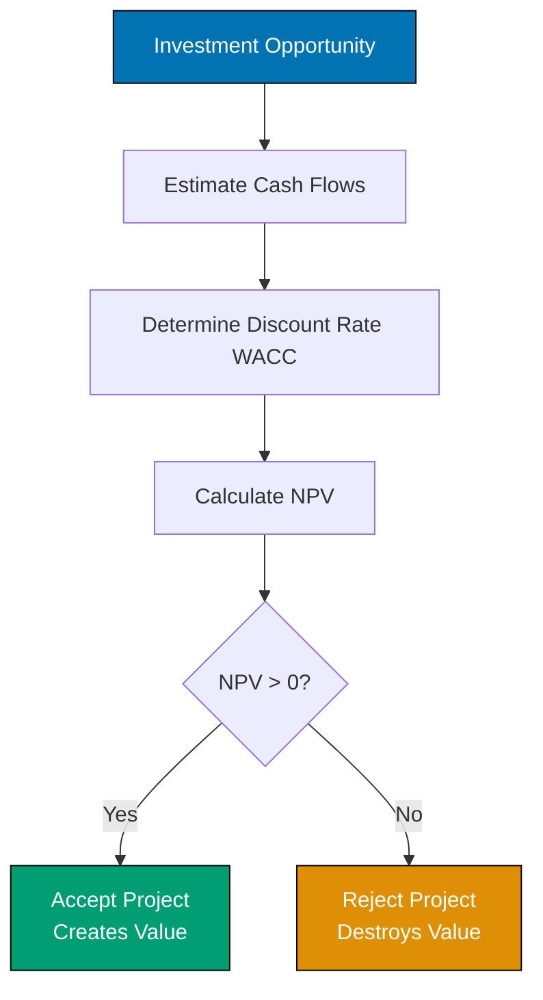

# Tutorial Convention

Standards for creating effective, engaging, and pedagogically sound tutorials in the open-sharia-enterprise project.

## Principles Implemented/Respected

This convention implements the following core principles:

- **[Progressive Disclosure](../../principles/content/progressive-disclosure.md)**: Tutorials build knowledge incrementally through guided experience. Simple concepts first, complexity added gradually. Each section complete and useful before moving to the next.

- **[No Time Estimates](../../principles/content/no-time-estimates.md)**: Tutorials focus on learning outcomes and skill development, not completion time. Everyone learns at different speeds - what matters is mastery, not how long it takes.

- **[Accessibility First](../../principles/content/accessibility-first.md)**: Learning-oriented content with clear structure, encouraging tone, and step-by-step guidance makes knowledge accessible to beginners. Reduces barriers to entry for learners from all backgrounds.

## Purpose

This convention establishes comprehensive standards for tutorial content across all tutorial types (Initial Setup, Quick Start, Beginner, Intermediate, Advanced, Cookbook, By Example). These types combine to form the **Full Set Tutorial Package** for programming languages - a complete educational bundle with 5 mandatory components. See [Tutorial Naming Convention](./naming.md) for the complete architecture and [Programming Language Structure](./programming-language-structure.md) for directory organization.

**Note**: The By Example tutorial type has specialized standards defined in [By-Example Tutorial Convention](./by-example.md) that extend the general requirements in this document for code-first learning.

## Scope

### What This Convention Covers

- **Seven tutorial types** - Initial Setup, Quick Start, Beginner, Intermediate, Advanced, Cookbook, By Example
- **Coverage percentages** - What percentage of topic each type covers
- **Tutorial structure** - Required sections and content patterns
- **Learning progression** - How tutorials build on each other
- **Full Set Tutorial Package** - How 5 components combine for complete content (see [Tutorial Naming](./naming.md))
- **Component relationships** - How foundational, learning tracks, and cookbook interact
- **No time estimates** - Why tutorials use coverage percentages instead of time-based framing
- **Tutorial quality** - Standards for effective learning content

### What This Convention Does NOT Cover

- **Tutorial naming** - Covered in [Tutorial Naming Convention](./naming.md)
- **Hugo site tutorials** - Hextra theme specifics covered in [ayokoding-web convention](../hugo/ayokoding.md)
- **Non-tutorial content** - How-To guides, Reference, Explanation covered separately
- **Tutorial validation** - Covered by docs\_\_tutorial-checker agent

## Overview

Tutorials are **learning-oriented** documentation that guide learners through acquiring new skills and knowledge. Unlike how-to guides (goal-oriented) or reference material (information-oriented), tutorials focus on the **learning journey** itself.

**Purpose**: This convention defines the requirements and standards for creating tutorials that both `docs__tutorial-maker` creates and `docs__tutorial-checker` validates. It serves as the single source of truth for tutorial quality.

**Scope**: Applies to **all tutorial content in the repository**, including:

- **docs/tutorials/** - Business, AI Engineering, Software Engineering tutorials
- **apps/ayokoding-web/content/** - Programming language tutorials (Java, Golang, Python, etc.)
- **apps/ose-platform-web/content/** - Platform tutorials and guides
- **Any other location** - Tutorial content regardless of directory

**Implementation Notes**: While these standards apply universally, implementation details (Hugo frontmatter, weight values, navigation structure) vary by platform and are covered in site-specific conventions ([ayokoding-web](../hugo/ayokoding.md), [ose-platform-web](../hugo/ose-platform.md))

## Diátaxis Principles for Tutorials

Tutorials follow the **Diátaxis framework** principles for learning-oriented documentation. See [Diátaxis Framework Convention](../meta/diataxis-framework.md) for complete framework details.

### What Makes Documentation a Tutorial

A tutorial is characterized by:

**Learning-Oriented** (Not Goal-Oriented) - Teaches concepts through experience - Focuses on the learning process, not just the end result - Builds understanding incrementally - Provides context and explanation, not just steps

**Provides a Learning Experience** - Learner actively participates (hands-on) - Builds confidence through small wins - Creates "aha!" moments of understanding - Makes abstract concepts concrete

**Gets the Learner Started** - Assumes minimal prior knowledge (with clear prerequisites) - First exposure to a topic or skill - Provides foundation for further learning - Removes barriers to entry

**Is Guided by a Teacher** - Written in teaching voice (friendly, encouraging) - Teacher decides what to show and when - Provides scaffolding and support - Anticipates learner difficulties

**Inspires Confidence** - Learner succeeds at each step - Clear progress markers (checkpoints) - Celebrates achievements - Reduces anxiety and fear of failure

### Tutorial vs Other Documentation Types

| Aspect        | Tutorial                  | How-To Guide            | Reference                | Explanation              |
| ------------- | ------------------------- | ----------------------- | ------------------------ | ------------------------ |
| **Purpose**   | Learning                  | Achieving a goal        | Information lookup       | Understanding            |
| **Oriented**  | Learning                  | Task/Goal               | Information              | Conceptual               |
| **Format**    | Lesson                    | Series of steps         | Dry description          | Discursive explanation   |
| **Analogy**   | Teaching a child to cook  | Recipe                  | Encyclopedia entry       | Article on culinary arts |
| **Answers**   | "Can you teach me to...?" | "How do I...?"          | "What is...?"            | "Why...?"                |
| **Structure** | Sequential, guided        | Goal-focused, direct    | Structured by topic      | Thematic, exploratory    |
| **Tone**      | Encouraging, supportive   | Direct, efficient       | Neutral, factual         | Informative, engaging    |
| **Example**   | "Accounting Quick Start"  | "How to Calculate WACC" | "WACC Formula Reference" | "Why WACC Matters"       |

**Critical Distinction**: A tutorial teaches **through experience**. If it just lists steps without teaching concepts, it's a how-to guide, not a tutorial.

## ️ Tutorial Structure Requirements

All tutorials must follow a consistent structure that supports the learning journey.

### Required Sections (In Order)

#### 1. Title and Metadata

**Format**:

```markdown
---
title: "[Subject] Quick Start" or "Tutorial: [Topic]"
description: Brief description (1-2 sentences) of what learner will achieve
category: tutorials
tags:
  - [subject]
  - [domain]
  - quick-start (if applicable)
created: YYYY-MM-DD
updated: 2026-01-01
---

# [Subject] Quick Start
```

**Requirements**: - Title clearly indicates it's a tutorial/quick start - Description states learning outcome (not just topic) - Tags include subject and domain - Follows [File Naming Convention](../meta/file-naming.md): `tu-*` prefix

#### 2. Introduction (The Hook)

**Purpose**: Motivate the learner and set expectations

**Required Elements**: - Opening hook (why this topic matters) - Learning context (real-world relevance) - What learner will achieve by the end - Time estimate (if applicable) - Motivational element (builds excitement)

**Example Structure**:

```markdown
# [Subject] Quick Start

[Opening paragraph: Why this topic matters in real-world context]

**What you'll learn:**

- [Learning objective 1]
- [Learning objective 2]
- [Learning objective 3]

**What makes this valuable**: [Real-world impact or application]
```

**Anti-Pattern**: Starting with dry definitions or theory. Lead with relevance and motivation.

#### 3. Prerequisites

**Purpose**: Set clear expectations for required prior knowledge

**Required Elements**: - List of prerequisite knowledge - Links to prerequisite tutorials (if available) - Assessment checklist (learner can self-verify readiness)

**Format**:

```markdown
## Prerequisites

Before starting this tutorial, you should:

- [Prerequisite 1 with clear description]
- [Prerequisite 2 with clear description]
- [Prerequisite 3 with clear description]

**Optional but helpful:**

- [Nice-to-have knowledge 1]
- [Nice-to-have knowledge 2]

If you're new to [topic], start with [link to beginner tutorial].
```

**Rules**: - Be specific about what "knowing" means - Distinguish required vs optional prerequisites - Provide paths for learners who lack prerequisites - Use checkboxes () for self-assessment

#### 4. Learning Objectives

**Purpose**: Clear, measurable outcomes the learner will achieve

**Required Elements**: - 3-7 specific learning objectives - Written in measurable terms (Bloom's taxonomy verbs) - Focused on learner achievements (not content coverage)

**Format**:

```markdown
## Learning Objectives

By the end of this tutorial, you will be able to:

1. **[Verb] [Object]** - [Brief context or application]
2. **[Verb] [Object]** - [Brief context or application]
3. **[Verb] [Object]** - [Brief context or application]
```

**Bloom's Taxonomy Verbs** (by cognitive level): - **Remember**: Define, list, recall, identify - **Understand**: Explain, describe, summarize, interpret - **Apply**: Calculate, demonstrate, solve, use - **Analyze**: Compare, contrast, differentiate, examine - **Evaluate**: Assess, judge, critique, justify - **Create**: Design, develop, construct, formulate

**Good Example**:

```markdown
1. **Calculate** the weighted average cost of capital (WACC) for a company
2. **Explain** why WACC is used as the discount rate in NPV analysis
3. **Apply** WACC to evaluate investment decisions
```

**Bad Example** (not measurable):

```markdown
1. Understand WACC
2. Learn about cost of capital
3. Know financial formulas
```

#### 5. Content Sections (The Learning Journey)

**Structure**: 4-8 main sections, each building on previous knowledge

**Each Section Must Include**:

**a) Section Title (Clear, Descriptive)**

```markdown
## [Section Number]. [Concept Name]
```

**b) Concept Introduction (The "Why")** - Why this concept matters - How it connects to what learner already knows - Real-world context or application

**c) Explanation (The "What")** - Clear definition or explanation - Visual aids (diagrams, formulas, examples) - Breaking down complexity - Multiple representations (text, visual, example)

**d) Demonstration (The "How")** - Worked example - Step-by-step walkthrough - Teacher showing the process - Annotations explaining each step

**e) Practice Exercise (The "You Try")** - Hands-on activity for learner - Similar to demonstration but learner does it - Hints or guidance provided - Solution provided (in collapsible details)

**f) Checkpoint (Self-Assessment)** - Summary of what was learned - Self-check questions or reflection - Confirmation of understanding before moving on

**Complete Section Example**:

```markdown
## 2. Time Value of Money

**Why this matters**: A dollar today is worth more than a dollar tomorrow. Understanding this concept is fundamental to all finance decisions—from personal savings to billion-dollar investments.

### The Core Concept

Money has **time value** because:

1. **Earning potential** - Money can be invested to earn returns
2. **Inflation** - Currency loses purchasing power over time
3. **Risk** - Future money is uncertain

**Formula:**

$$
FV = PV \times (1 + r)^n
$$

Where:

- $FV$ = Future Value
- $PV$ = Present Value
- $r$ = Interest rate per period
- $n$ = Number of periods

**Visual representation:**

[Diagram showing timeline of money growing]

### Example: Growing Your Investment

Suppose you invest $1,000 at 8% annual interest for 5 years.

**Step-by-step calculation:**

$$
\begin{align}
FV &= \$1,000 \times (1 + 0.08)^5 \\
FV &= \$1,000 \times 1.469 \\
FV &= \$1,469
\end{align}
$$

Your $1,000 grows to $1,469 in 5 years.

### Practice Exercise

**Your turn**: Calculate the future value of $5,000 invested at 6% for 3 years.

<details>
<summary>Solution</summary>

$$
\begin{align}
FV &= \$5,000 \times (1 + 0.06)^3 \\
FV &= \$5,000 \times 1.191 \\
FV &= \$5,955
\end{align}
$$

The investment grows to $5,955.

</details>

### Checkpoint

**What you've learned:**

- Money has time value due to earning potential, inflation, and risk
- Future value formula: $FV = PV \times (1 + r)^n$
- How to calculate investment growth over time

**Self-check**: Can you explain why $1,000 today is worth more than $1,000 in 5 years?
```

### Tutorial Length and Splitting

**Recommended Length**: 500-1,500 lines (15-45 minutes reading time)

**Why length matters**: - Too short: May lack sufficient depth or practice opportunities - Too long: Overwhelms learners, violates single-focus principle

**Length Guidelines**:

**< 300 lines (Too Short)**: - May indicate insufficient depth - Consider: - Combining with related tutorial - Adding more examples and practice exercises - Expanding explanations with visual aids - Exception: "Initial Setup" tutorials can be shorter (200-300 lines)

**500-1,500 lines (Ideal)**: - Focused on single topic or skill - Sufficient depth and practice - Maintains learner engagement - Completable in one sitting

**1,500-5,000 lines (Upper Limit)**: - Still manageable but approaching threshold - Consider if content can be split - Ensure strong narrative flow to maintain engagement

**> 5,000 lines (Too Long - Must Split)**: - Risk overwhelming learners - Violates single-focus principle - Action required: Split into tutorial series

**How to Split Long Tutorials**:

**1. Identify Natural Break Points**: - Basic vs. Advanced concepts (beginner/intermediate split) - Core features vs. Optional extensions - Local development vs. Production deployment - Theory vs. Practice (conceptual/hands-on split)

**2. Create Progressive Series**:

```
Part 1: Basic Setup (tu__rag-basics.md)
Part 2: Advanced Features (tu__rag-advanced.md)
Part 3: Production Deployment (tu__rag-production.md)
```

**3. Link Tutorials Together**: - **Part 1 "Next Steps"**: Link to Part 2 - **Part 2 "Prerequisites"**: Link back to Part 1 - **Part 2 "Next Steps"**: Link to Part 3 - Each part should be self-contained but reference the series

**4. Optional: Create Series Index**:

Create a series overview tutorial (e.g., `tu__rag-series.md`):

```markdown
# RAG Tutorial Series

Complete guide to building Retrieval-Augmented Generation systems.

## Tutorial Sequence

**Part 1: RAG Basics** (Beginner)

- [Link to Part 1](./tu__rag-basics.md)
- Build your first RAG system
- Estimated time: 30 minutes

**Part 2: Advanced RAG** (Intermediate)

- [Link to Part 2](./tu__rag-advanced.md)
- Hybrid search, reranking, and optimization
- Estimated time: 45 minutes
- Prerequisites: Part 1

**Part 3: Production RAG** (Advanced)

- [Link to Part 3](./tu__rag-production.md)
- Deploy RAG to production with monitoring
- Estimated time: 1 hour
- Prerequisites: Parts 1 & 2
```

**Example Split**:

FAIL: **Bad**: Single 3,000-line tutorial covering basic RAG, advanced techniques, and production deployment

PASS: **Good**: Three focused tutorials:

1. "Build Your First RAG System" (800 lines) - Core concepts, simple implementation
2. "Advanced RAG Techniques" (700 lines) - Hybrid search, reranking, optimization
3. "Deploy RAG to Production" (600 lines) - Scalability, monitoring, best practices

**Each part**: - Has clear prerequisites - Focuses on specific skill level - Is completable in one session - Links to previous/next parts

#### 6. Challenges Section (Optional but Recommended)

**Purpose**: Test understanding with realistic scenarios

**Format**:

```markdown
## Challenges

Test your understanding with these realistic scenarios.

### Challenge 1: [Scenario Name]

[Realistic problem description]

**Given:**

- [Data point 1]
- [Data point 2]

**Task**: [What to calculate or determine]

<details>
<summary>Solution</summary>

[Step-by-step solution with explanations]

</details>

### Challenge 2: [Scenario Name]

[Next challenge...]
```

**Requirements**: - 2-4 challenges per tutorial - Progressive difficulty (easy → medium → hard) - Realistic scenarios (not just formula practice) - Complete solutions with explanations - Solutions in collapsible `<details>` blocks

#### 7. Summary and Next Steps

**Purpose**: Consolidate learning and provide pathways forward

**Required Elements**:

**a) Key Takeaways**

```markdown
## Summary

**What you've learned:**

- [Key concept 1 with brief explanation]
- [Key concept 2 with brief explanation]
- [Key concept 3 with brief explanation]

**Key formulas:**

- [Formula 1 with name]
- [Formula 2 with name]

**Skills you've gained:**

- [Skill 1]
- [Skill 2]
```

**b) Next Steps**

```markdown
## Next Steps

**Ready to go deeper?**

- [Link to advanced tutorial or how-to guide]
- [Link to related explanation]
- [Link to reference material]

**Want to practice more?**

- [Link to exercises or projects]
- [External resources for practice]

**Apply what you've learned:**

- [Suggestion for real-world application 1]
- [Suggestion for real-world application 2]
```

**c) Further Resources (Optional)**

```markdown
## Further Resources

**Books:**

- [Book title] by [Author] - [Why recommended]

**Online:**

- [Resource] - [Description]

**Tools:**

- [Tool name] - [What it helps with]
```

### Section Flow Requirements

**Progressive Complexity**: - Start simple, add complexity gradually - Each section builds on previous knowledge - No sudden jumps in difficulty - Clear "stepping stones" of understanding

**Smooth Transitions**:

```markdown
## 2. First Concept

[Content...]

---

Now that you understand [first concept], let's explore how [second concept] builds on this foundation.

## 3. Second Concept

[Content...]
```

**Clear Segmentation**: - Use horizontal rules (`---`) between major sections - Use subsections (`###`) for sub-topics within sections - Visual hierarchy matches conceptual hierarchy

## Narrative Requirements

Tutorials are **stories about learning**. Narrative quality directly impacts engagement and retention.

### Story Arc (Beginning, Middle, End)

**Beginning (Introduction)**: - Hook: Grab attention with relevance or intrigue - Context: Why this topic matters - Promise: What learner will achieve - Orientation: What to expect

**Middle (Content Sections)**: - Rising action: Building knowledge incrementally - Challenges: Moments of difficulty (with support) - Small wins: Success at each stage - Momentum: Maintaining engagement

**End (Conclusion)**: - Resolution: Bringing concepts together - Celebration: Acknowledging achievement - Reflection: What was learned - Continuation: Where to go next

### Progressive Scaffolding

**Scaffolding Theory**: Provide support structures that are gradually removed as learner gains competence.

**Implementation**:

**Early Sections (High Scaffolding)**: - Detailed explanations - Step-by-step guidance - Extensive examples - Hints readily available - Simpler problems

**Middle Sections (Medium Scaffolding)**: - Moderate explanation detail - Key steps highlighted - Examples with some gaps to fill - Hints available but less prominent - Moderate difficulty

**Late Sections (Low Scaffolding)**: - Concise explanations - Learner expected to fill in steps - Examples with more independence - Hints only for complex parts - Increased difficulty

**Example Progression**:

```markdown
## 2. Introduction to NPV (High Scaffolding)

Let's calculate NPV step by step. I'll walk you through each part carefully.

**Step 1**: Identify the cash flows
[Detailed explanation...]

**Step 2**: Determine the discount rate
[Detailed explanation...]

[Continue with full guidance]

---

## 4. WACC Calculation (Medium Scaffolding)

Now you've seen several financial calculations. Let's apply what you know to WACC.

**Key steps**:

1. Calculate component costs
2. Determine weights
3. Compute weighted average

[Less detailed, expects learner to apply previous knowledge]

---

## 6. DCF Valuation (Low Scaffolding)

Time to bring everything together. You'll combine NPV, WACC, and time value concepts.

**Challenge**: Value a company using DCF analysis.

[Minimal guidance, learner applies all previous learning]
```

### Voice and Perspective

**Teacher Voice** (Not Neutral Documentation Voice)

**Good Examples**:

```markdown
PASS: "Let's start with a simple example to build your intuition."
PASS: "You might be wondering why we multiply by (1-T). Here's the reasoning..."
PASS: "Great! You've now mastered the basics. Let's add some complexity."
PASS: "This is where many people get confused. Take your time with this step."
```

**Bad Examples** (Too Neutral):

```markdown
FAIL: "NPV is calculated using the following formula."
FAIL: "The components are equity and debt."
FAIL: "This formula is used in finance."
```

**Characteristics of Teacher Voice**: - **Personal**: Use "you" and "we" (not "one" or passive voice) - **Encouraging**: Positive, supportive tone - **Anticipatory**: Address common confusions preemptively - **Conversational**: Natural language (not academic jargon) - **Empathetic**: Acknowledges difficulty, provides reassurance

**Perspective Consistency**: - Maintain same voice throughout - Use "we" for joint exploration: "Let's explore..." - Use "you" for learner actions: "Now you try..." - Avoid switching between formal and informal tone

### Transitions Between Sections

**Purpose of Transitions**: - Connect concepts logically - Show how new material builds on previous - Maintain narrative flow - Prevent cognitive jarring

**Transition Patterns**:

**Building Pattern**:

```markdown
Now that you understand [previous concept], we can build on this to explore [new concept].
```

**Connecting Pattern**:

```markdown
[Previous concept] and [new concept] work together to [achieve something].
```

**Contrasting Pattern**:

```markdown
We've seen how [previous concept] works. [New concept] takes a different approach by [contrast].
```

**Problem-Solution Pattern**:

```markdown
[Previous concept] helps us understand the basics, but what about [complication]? That's where [new concept] comes in.
```

**Example**:

```markdown
## 3. Present Value

[Content about PV...]

---

Now you can calculate what future money is worth today. But what if you have multiple cash flows over many years? That's where **Net Present Value (NPV)** comes in. NPV extends the PV concept to handle complex cash flow streams.

## 4. Net Present Value (NPV)

[Content about NPV...]
```

### Engagement Techniques

**Storytelling**: - Use realistic scenarios and characters - Create narrative tension ("What happens if...") - Show real-world applications - Make abstract concepts concrete

**Example**:

```markdown
Imagine you're the CFO of CloudTech, a growing SaaS company. Your CEO wants to invest $10M in a new product line. How do you decide if it's worth it? This is where NPV analysis becomes your most powerful tool.
```

**Motivational Elements**: - Celebrate small wins: "Excellent! You've mastered..." - Acknowledge difficulty: "This step is tricky, but you've got this." - Show progress: Checkpoints and progress markers - Build confidence: Start easy, increase complexity gradually

**Humor and Personality** (When Appropriate): - Light humor can increase engagement - Personality makes content memorable - Keep it professional and inclusive - Never at expense of clarity

**Relatable Examples**: - Use familiar contexts (everyday decisions) - Then extend to professional contexts - Bridge known to unknown

## Visual Completeness Requirements

**Principle**: Every major concept should have at least one visual representation.

### Diagrams (Mermaid)

**When to Use Diagrams**: - Showing processes or workflows - Illustrating relationships between concepts - Visualizing decision trees - Depicting system architecture or structure

**Requirements**: - Every major concept has a diagram - Diagrams follow [Diagram and Schema Convention](../formatting/diagrams.md) - Use Mermaid for all diagrams (Obsidian vault support) - Prefer vertical orientation for mobile-friendliness - Clear labels and styling - Legend or caption explaining the diagram

**Example**:

````markdown
### Capital Budgeting Decision Process

This flowchart shows how companies evaluate investment opportunities:

%% Color palette: Blue #0173B2, Orange #DE8F05, Teal #029E73, Purple #CC78BC, Brown #CA9161, Gray #808080
%% All colors are color-blind friendly and meet WCAG AA contrast standards


````

If NPV is positive, the project creates value. If negative, it destroys value.

````

**Diagram Types by Use Case**:

| Use Case                  | Mermaid Type   | Example                      |
| ------------------------- | -------------- | ---------------------------- |
| Process flow              | `flowchart TD` | Capital budgeting process    |
| Decision tree             | `flowchart TD` | Investment accept/reject     |
| Relationships             | `graph LR`     | Financial statement linkages |
| Timeline                  | `gantt`        | Project schedule             |
| Class/Entity relationship | `classDiagram` | Data model                   |

### Mathematical Formulas (LaTeX)

**Requirements**:
 - All formulas use LaTeX notation
 - Follow [Mathematical Notation Convention](../formatting/mathematical-notation.md)
 - **CRITICAL**: Use `$$` for display math (not single `$`)
 - **CRITICAL**: All `\begin{align}` blocks MUST use `$$` delimiters
 - **Obsidian note**: Both `$$...$$` and `$$ ... $$` (with spaces) work, but prefer no spaces for consistency with GitHub
 - Define all variables after displaying formula
 - Show worked examples with step-by-step calculations

**Display Math Format**:
```markdown
$$
WACC = \frac{E}{V} \times r_e + \frac{D}{V} \times r_d \times (1 - T_c)
$$

Where:

- $E$ = market value of equity
- $D$ = market value of debt
- $V$ = total market value ($V = E + D$)
- $r_e$ = cost of equity
- $r_d$ = cost of debt
- $T_c$ = corporate tax rate
````

**Multi-line Calculations**:

```markdown
$$
\begin{align}
FV &= PV \times (1 + r)^n \\
   &= \$1,000 \times (1.08)^5 \\
   &= \$1,000 \times 1.469 \\
   &= \$1,469
\end{align}
$$
```

**Common LaTeX Mistakes to Avoid**: - FAIL: Single `$` on its own line (use `$$` for display math) - FAIL: Single `$` with `\begin{align}` (MUST use `$$`) - FAIL: Undefined variables (always define after formula) - FAIL: Using forward slash for fractions (use `\frac{}{}`)

### Code Examples

**When to Include Code**: - Programming tutorials (always) - Financial calculations that can be automated - Tool configuration examples - Implementation demonstrations

**Requirements**: - Runnable, complete code (not fragments) - Clear comments explaining logic - Expected output shown - Progressive complexity - Real-world relevance

**Format**:

````markdown
### Calculating NPV in Python

Here's a reusable function to calculate NPV:

```python
def calculate_npv(discount_rate: float, cash_flows: list[float]) -> float:
    """
    Calculate Net Present Value of a series of cash flows.

    Args:
        discount_rate: The discount rate (e.g., 0.10 for 10%)
        cash_flows: List of cash flows by period (Year 0 is initial investment)

    Returns:
        Net Present Value
    """
    npv = 0
    for t, cash_flow in enumerate(cash_flows):
        npv += cash_flow / (1 + discount_rate) ** t
    return npv

# Example: Evaluate a project
cash_flows = [-10000, 3000, 3000, 3000, 3000]  # Initial -10K, then +3K/year
discount_rate = 0.12

npv = calculate_npv(discount_rate, cash_flows)
print(f"NPV: ${npv:,.2f}")
```
````

**Output:**

```
NPV: $814.33
```

Since NPV is positive, accept the project!

````

**Code Quality Standards**:
 - Follows language conventions (PEP 8 for Python, etc.)
 - Type hints when applicable
 - Docstrings for functions
 - Error handling for production code
 - Clear variable names

### Visual Aids for Abstract Concepts

**Purpose**: Make abstract concepts concrete through visualization

**Techniques**:

**1. Timelines** (for time-based concepts):
```markdown
**Present Value Timeline:**

````

Year 0 Year 1 Year 2 Year 3
│ │ │ │
PV ←────────────────────────────────── FV
↑ ↑
$1,000 $1,259

```

```

**2. Tables** (for comparing values):

```markdown
| Year | Cash Flow | PV Factor @ 10% | Present Value |
| ---- | --------- | --------------- | ------------- |
| 0    | -$10,000  | 1.000           | -$10,000      |
| 1    | $3,000    | 0.909           | $2,727        |
| 2    | $3,000    | 0.826           | $2,479        |
| 3    | $3,000    | 0.751           | $2,254        |
```

**3. Before/After Comparisons**:

```markdown
**Before WACC:**

- Equity cost: 12%
- Debt cost: 6%
- Which rate to use for NPV?

**After WACC:**

- Blended rate: 8.56%
- Use this for all project evaluations
```

**4. Visual Emphasis** (emoji, formatting): - PASS: Success indicators - FAIL: Error or reject indicators - Warning or caution - Insight or tip - Goal or objective - Financial/money related

### Screenshot Requirements (If Applicable)

**When to Include Screenshots**: - Tool/software tutorials - UI/UX walkthroughs - Configuration steps - Expected results visualization

**Requirements**: - High resolution (readable) - Annotated with arrows/callouts - Crop to relevant area - Follow [Temporary Files Convention](../../development/infra/temporary-files.md) for storage - Alt text for accessibility

## Hands-On Elements Requirements

**Principle**: Learning happens through doing. Every tutorial must include hands-on practice.

### Practice Exercises

**Purpose**: Let learner apply concepts immediately after learning

**Requirements**: - **Frequency**: After each major section (every 2-3 concepts) - **Difficulty**: Slightly easier than demonstration - **Support**: Hints available, solution provided - **Format**: Clear problem statement + solution in `<details>` block

**Structure**:

```markdown
### Practice Exercise

[Clear problem statement with context]

**Given:**

- [Data point 1]
- [Data point 2]
- [Data point 3]

**Task**: [What to calculate or determine]

**Hint** (optional): [Guidance without giving away answer]

<details>
<summary>Solution</summary>

**Step-by-step solution:**

[Explanation of approach]

[Calculations or implementation]

[Final answer with interpretation]

**Key insight**: [What this exercise demonstrates]

</details>
```

**Example**:

```markdown
### Practice Exercise

You're evaluating whether to invest in new manufacturing equipment.

**Given:**

- Initial cost: $50,000
- Annual savings: $15,000 for 4 years
- Discount rate: 10%

**Task**: Calculate NPV and determine if you should invest.

<details>
<summary>Solution</summary>

**Step 1: Set up the cash flows**

- Year 0: -$50,000 (initial investment)
- Years 1-4: +$15,000 (annual savings)

**Step 2: Calculate present value of each cash flow**

$$
\begin{align}
PV_0 &= -\$50,000 \\
PV_1 &= \frac{\$15,000}{(1.10)^1} = \$13,636 \\
PV_2 &= \frac{\$15,000}{(1.10)^2} = \$12,397 \\
PV_3 &= \frac{\$15,000}{(1.10)^3} = \$11,270 \\
PV_4 &= \frac{\$15,000}{(1.10)^4} = \$10,245
\end{align}
$$

**Step 3: Sum to get NPV**

$$
NPV = -\$50,000 + \$13,636 + \$12,397 + \$11,270 + \$10,245 = -\$2,452
$$

**Decision**: NPV is negative (-$2,452), so **reject this investment**. The equipment doesn't generate enough savings to justify the cost at a 10% discount rate.

**Key insight**: Even though total savings ($60,000) exceed initial cost ($50,000), the time value of money makes this a value-destroying investment.

</details>
```

### Challenges

**Purpose**: Test understanding with realistic, complex scenarios

**Characteristics**: - **Complexity**: Combines multiple concepts - **Realism**: Mirrors real-world situations - **Difficulty Progression**: Easy → Medium → Hard - **Completeness**: Full solution with explanation

**Placement**: After main content, before summary

**Structure**:

```markdown
## Challenges

Test your understanding with these realistic scenarios.

### Challenge 1: [Easy - Straightforward Application]

[Scenario that applies one or two concepts]

<details>
<summary>Solution</summary>

[Complete solution with explanations]

</details>

### Challenge 2: [Medium - Multi-Step Problem]

[Scenario that requires combining concepts]

<details>
<summary>Solution</summary>

[Complete solution with explanations]

</details>

### Challenge 3: [Hard - Complex Analysis]

[Scenario with ambiguity or requiring judgment]

<details>
<summary>Solution</summary>

[Complete solution with explanations and discussion of trade-offs]

</details>
```

**Requirements**: - 2-4 challenges per tutorial - Cover different aspects of content - Progressively more difficult - Solutions include explanations (not just answers) - Realistic scenarios with context

### Interactive Elements

**Purpose**: Engage learner actively in the learning process

**Types of Interaction**:

**1. Self-Check Questions** (Checkpoints):

```markdown
### Checkpoint

**Quick check - Can you:**

- [ ] Explain why NPV is better than payback period?
- [ ] Calculate the present value of future cash flows?
- [ ] Determine the appropriate discount rate to use?

If you answered yes to all three, you're ready to move on!
```

**2. Reflection Prompts**:

```markdown
**Pause and reflect**: How would this concept apply to a decision you're currently facing in your work?
```

**3. Prediction Questions**:

```markdown
**Before we calculate**: What do you think will happen to NPV if the discount rate increases? Take a moment to predict.

[Then show the calculation demonstrating the relationship]
```

**4. Fill-in-the-Blank** (Cognitive Engagement):

```markdown
Complete this formula: WACC = (E/V) × **\_** + (D/V) × **\_** × (1 - T)

<details>
<summary>Answer</summary>

WACC = (E/V) × **r_e** + (D/V) × **r_d** × (1 - T)

Where r_e is cost of equity and r_d is cost of debt.

</details>
```

### Real-World Relevance

**Requirement**: Every major concept must be connected to real-world application

**Techniques**:

**1. Case Studies**:

```markdown
### Real-World Example: Amazon's Capital Allocation

When Amazon decides whether to build a new warehouse, they use NPV analysis. Here's how:

[Realistic scenario with actual business context]
```

**2. Industry Context**:

```markdown
**How professionals use this**: Financial analysts calculate WACC hundreds of times per year when valuing companies for M&A transactions.
```

**3. Decision Frameworks**:

```markdown
**When to use NPV in your work:**

- Evaluating capital projects (equipment, facilities)
- Assessing acquisition opportunities
- Comparing investment alternatives
- Portfolio allocation decisions
```

**4. Common Mistakes (Learned from Practice)**:

```markdown
**Common Mistake**: Using the wrong discount rate

**What happens**: If you use cost of equity (12%) instead of WACC (8.5%), you'll reject profitable projects.

**Real example**: [Concrete scenario showing the impact]
```

## Technical Standards

Technical quality ensures tutorials are accurate, accessible, and maintainable.

### Mathematical Notation

**Requirements**: - Follow [Mathematical Notation Convention](../formatting/mathematical-notation.md) - Use LaTeX for all formulas - **CRITICAL**: Display-level equations MUST use `$$` delimiters - **CRITICAL**: Single `$` ONLY for inline math (on same line as text) - **CRITICAL**: All `\begin{align}` blocks MUST use `$$` delimiters - Define all variables after formulas - Use proper mathematical typography

**Correct Display Math**:

```markdown
PASS: Correct:

$$
r_e = r_f + \beta \times (r_m - r_f)
$$

PASS: Correct (multi-line):

$$
\begin{align}
WACC &= \frac{E}{V} \times r_e + \frac{D}{V} \times r_d \times (1 - T_c) \\
     &= 0.645 \times 11.4\% + 0.355 \times 3.41\% \\
     &= 8.56\%
\end{align}
$$
```

**Incorrect Display Math**:

```markdown
FAIL: Incorrect (single $ for display):
$
r_e = r_f + \beta \times (r_m - r_f)
$

FAIL: Incorrect (single $ with align):
$
\begin{align}
WACC &= \frac{E}{V} \times r_e
\end{align}
$
```

**Why This Matters**: Single `$` on its own line causes LaTeX to display as raw text instead of rendering properly in both GitHub and Obsidian.

### Code Examples

**Requirements**: - Complete, runnable code (not fragments) - Follow language-specific conventions - Include comments explaining logic - Show expected output - Type hints when applicable (Python, TypeScript) - Error handling for production examples

**Quality Checklist**: - [ ] Code runs without errors - [ ] Output is shown and correct - [ ] Comments explain "why" not just "what" - [ ] Variable names are clear and descriptive - [ ] Follows project style guide - [ ] No security vulnerabilities (hardcoded secrets, etc.)

### File Organization

**Naming**: - Follow [File Naming Convention](../formatting/linking.md) - Use relative paths with `.md` extension - Link to related tutorials, how-to guides, references - Link to prerequisite material - Link to next steps

**Format**:

```markdown
For more details on the Diátaxis framework, see [Diátaxis Framework Convention](../meta/diataxis-framework.md).

If you're new to finance, start with [Accounting](../business-and-finance/tu-bufi__accounting.md).
```

**Internal Links**: - Link to glossary for terms - Link to conventions for standards - Link to references for formulas - Link to how-to guides for tasks

### Accessibility

**Requirements**: - Clear headings hierarchy (H1 → H2 → H3, no skipping) - Alt text for images (if using images) - Descriptive link text (not "click here") - Sufficient color contrast (Mermaid diagrams) - Screen reader friendly LaTeX (MathJax support)

**Examples**:

```markdown
PASS: Good: See [Capital Budgeting Process](./ex-co__capital-budgeting.md)
FAIL: Bad: See capital budgeting process [here](./ex-co__capital-budgeting.md)

PASS: Good: 
FAIL: Bad: 
```

## PASS: Validation Criteria

These criteria define what `docs__tutorial-checker` validates. Every tutorial must pass all checks.

### Structure Validation

**Required Sections Checklist**: - [ ] Title and metadata (frontmatter with title, description, tags) - [ ] Introduction with hook and motivation - [ ] Prerequisites clearly stated - [ ] Learning objectives (3-7 specific outcomes) - [ ] 4-8 content sections - [ ] Practice exercises (at least one per major section) - [ ] Challenges section (2-4 challenges recommended) - [ ] Summary with key takeaways - [ ] Next steps with links

**Section Organization**: - [ ] Logical progression (simple → complex) - [ ] Clear section numbering - [ ] Consistent heading hierarchy - [ ] Smooth transitions between sections

### Narrative Validation

**Story Arc**: - [ ] Clear beginning (introduction with hook) - [ ] Developed middle (building knowledge) - [ ] Satisfying end (summary and next steps) - [ ] Maintains narrative flow throughout

**Progressive Scaffolding**: - [ ] Starts with simple concepts - [ ] Gradually increases complexity - [ ] No sudden jumps in difficulty - [ ] Support decreases as learner progresses

**Voice and Tone**: - [ ] Uses teaching voice (encouraging, supportive) - [ ] Consistent use of "you" and "we" - [ ] Anticipates learner confusion - [ ] Maintains conversational tone - [ ] Avoids overly academic jargon

**Transitions**: - [ ] Every section has clear transition - [ ] Connections between concepts explained - [ ] Building/connecting language used - [ ] No abrupt topic changes

### Visual Validation

**Diagrams**: - [ ] At least one diagram per major concept - [ ] Diagrams use Mermaid (for Obsidian compatibility) - [ ] Vertical orientation preferred (mobile-friendly) - [ ] Clear labels and styling - [ ] Captions or legends provided

**Mathematical Formulas**: - [ ] All formulas use LaTeX notation - [ ] Display-level equations use `$$` delimiters (not single `$`) - [ ] All `\begin{align}` blocks use `$$` delimiters - [ ] Single `$` ONLY for inline math (same line as text) - [ ] Variables defined after formulas - [ ] Worked examples with step-by-step calculations

**Code Examples**: - [ ] Complete, runnable code - [ ] Clear comments - [ ] Expected output shown - [ ] Progressive complexity - [ ] Follows language conventions

**Visual Aids**: - [ ] Abstract concepts have visualizations - [ ] Tables for comparing values - [ ] Timelines for time-based concepts - [ ] Appropriate use of emoji for emphasis

### Hands-On Validation

**Practice Exercises**: - [ ] Present after each major section - [ ] Clear problem statements - [ ] Hints provided when helpful - [ ] Solutions in `<details>` blocks - [ ] Solutions include explanations (not just answers)

**Challenges**: - [ ] 2-4 challenges present - [ ] Progressive difficulty (easy → medium → hard) - [ ] Realistic scenarios - [ ] Complete solutions with explanations - [ ] Cover different aspects of content

**Interactive Elements**: - [ ] Checkpoints for self-assessment - [ ] Reflection prompts or prediction questions - [ ] Active learner engagement throughout

**Real-World Relevance**: - [ ] Every major concept connected to real-world application - [ ] Case studies or industry examples - [ ] Practical decision frameworks - [ ] Common mistakes highlighted

### Technical Validation

**Mathematical Notation**: - [ ] Follows Mathematical Notation Convention - [ ] LaTeX delimiters used correctly (`$$` for display, single `$` for inline) - [ ] No single `$` on its own line (must use `$$`) - [ ] No single `$` with `\begin{align}` (must use `$$`) - [ ] All variables defined - [ ] Formulas render correctly in both Obsidian and GitHub

**Code Quality**: - [ ] Code runs without errors - [ ] Output is correct - [ ] Comments explain logic - [ ] No security vulnerabilities - [ ] Follows language conventions

**File Organization**: - [ ] Follows File Naming Convention (`tu-*` prefix) - [ ] Located in correct directory - [ ] Frontmatter complete and accurate

**Cross-References**: - [ ] Links use correct format (relative paths, `.md` extension) - [ ] All internal links are valid - [ ] Prerequisites linked when available - [ ] Next steps include relevant links

**Accessibility**: - [ ] Clear heading hierarchy (no skipping levels) - [ ] Descriptive link text - [ ] Alt text for images (if present) - [ ] Screen reader friendly

### Content Quality Validation

**Accuracy**: - [ ] Technical content is factually correct - [ ] Formulas are accurate - [ ] Code examples produce correct output - [ ] Real-world examples are realistic

**Completeness**: - [ ] Learning objectives are met - [ ] All promised topics are covered - [ ] Sufficient depth for understanding - [ ] No critical gaps in explanation

**Clarity**: - [ ] Explanations are clear and understandable - [ ] Examples illuminate concepts - [ ] Jargon is explained - [ ] Complexity is managed appropriately

**Engagement**: - [ ] Introduction is compelling - [ ] Content maintains interest - [ ] Hands-on elements engage learner - [ ] Conclusion is satisfying

## FAIL: Anti-Patterns

Common mistakes that violate tutorial principles. Avoid these!

### 1. Reference Material Disguised as Tutorial

**Problem**: Presenting dry facts without learning experience

**Example** (Bad):

```markdown
## Net Present Value

Net Present Value (NPV) is the sum of discounted cash flows.

Formula: NPV = Σ(CF_t / (1+r)^t)

Components:

- CF_t: cash flow at time t
- r: discount rate
- t: time period
```

**Why it's bad**: No teaching, no examples, no practice. This is reference material, not a tutorial.

**Correct Approach**:

```markdown
## Understanding Net Present Value (NPV)

Imagine you're deciding whether to invest $10,000 in new equipment. It'll save you $3,000 per year for 5 years. Worth it?

You can't just add up the savings ($15,000) and compare to the cost ($10,000). Money in the future is worth less than money today. NPV helps us make this comparison fairly.

[Continue with explanation, example, practice exercise...]
```

### 2. Goal-Oriented Instead of Learning-Oriented

**Problem**: Treating tutorial like a how-to guide (steps without teaching)

**Example** (Bad):

```markdown
## How to Calculate WACC

1. Calculate cost of equity
2. Calculate cost of debt
3. Determine weights
4. Multiply and add

Done!
```

**Why it's bad**: Steps without explanation. Learner can follow steps but doesn't understand why or when to use WACC.

**Correct Approach**: Explain the concept, why it matters, how components work together, then show calculation with context.

### 3. Assuming Too Much Prior Knowledge

**Problem**: Starting beyond learner's level without prerequisites

**Example** (Bad):

```markdown
## Corporate Finance Tutorial

[Starts immediately with: "Let's calculate the Hamada formula for unlevering beta..."]
```

**Why it's bad**: Assumes advanced knowledge without stating prerequisites or providing foundation.

**Correct Approach**: Clear prerequisites, start with basics, build to advanced concepts.

### 4. No Hands-On Practice

**Problem**: All explanation, no exercises

**Example** (Bad):

```markdown
[10 pages of explanation about NPV, WACC, DCF...]

## Summary

You've learned about NPV, WACC, and DCF!
```

**Why it's bad**: Reading ≠ Learning. Without practice, learner hasn't truly learned.

**Correct Approach**: Practice exercises after each major concept. Challenges at end. Hands-on engagement throughout.

### 5. Missing Visual Aids

**Problem**: Text-only explanations of visual concepts

**Example** (Bad):

```markdown
The balance sheet has assets on the left and liabilities and equity on the right. Assets equal liabilities plus equity.
```

**Why it's bad**: Balance sheet is inherently visual. Text description is harder to understand than diagram.

**Correct Approach**: Include diagram showing balance sheet structure, then explain.

### 6. Incorrect LaTeX Delimiters

**Problem**: Using single `$` for display math or with `\begin{align}`

**Example** (Bad):

```markdown
$
r_e = r_f + \beta \times (r_m - r_f)
$

$
\begin{align}
NPV &= \sum_{t=0}^{n} \frac{CF_t}{(1+r)^t}
\end{align}
$
```

**Why it's bad**: Single `$` on its own line breaks rendering. LaTeX displays as raw text instead of formatted math.

**Correct Approach**: Use `$$` for all display math and `\begin{align}` blocks.

### 7. Sudden Difficulty Jumps

**Problem**: Jumping from basic to advanced without intermediate steps

**Example** (Bad):

```markdown
## 1. Basic Arithmetic

2 + 2 = 4

## 2. Advanced Calculus

Now let's integrate: ∫(x² + 3x + 2)dx from 0 to ∞
```

**Why it's bad**: Cognitive overload. Learner isn't prepared for the jump.

**Correct Approach**: Progressive scaffolding with gradual complexity increase.

### 8. No Story or Context

**Problem**: Dry, mechanical presentation without narrative

**Example** (Bad):

```markdown
## Topic 1

Definition: [definition]
Formula: [formula]

## Topic 2

Definition: [definition]
Formula: [formula]
```

**Why it's bad**: No engagement, no motivation, no connection to real-world.

**Correct Approach**: Use storytelling, real-world scenarios, and narrative flow.

### 9. Missing Prerequisites or Learning Objectives

**Problem**: Learner doesn't know what to expect or if they're ready

**Example** (Bad):

```markdown
# Advanced Corporate Finance

[Jumps straight into content with no introduction, prerequisites, or objectives]
```

**Why it's bad**: Learner might be unprepared or have wrong expectations.

**Correct Approach**: Clear prerequisites and learning objectives at the start.

### 10. No Checkpoints or Self-Assessment

**Problem**: No way for learner to gauge understanding

**Example** (Bad):

```markdown
[Content... content... content...]

## Summary

Great job! You learned a lot!
```

**Why it's bad**: Learner doesn't know if they actually understand. No reflection opportunity.

**Correct Approach**: Checkpoints after major sections with self-check questions.

### 11. Solutions Without Explanations

**Problem**: Providing answers without showing reasoning

**Example** (Bad):

```markdown
**Exercise**: Calculate the NPV.

<details>
<summary>Solution</summary>

NPV = $5,243

</details>
```

**Why it's bad**: Learner sees answer but doesn't understand how to get there.

**Correct Approach**: Step-by-step solution with explanations of reasoning.

### 12. Inconsistent Voice or Tone

**Problem**: Switching between formal and informal, or between perspectives

**Example** (Bad):

```markdown
Let's calculate WACC together. [informal, teacher voice]

The formula is applied as follows. [formal, passive voice]

Now you should try this yourself. [direct instruction]

One might consider using this approach. [impersonal]
```

**Why it's bad**: Jarring switches break narrative flow and confuse learner.

**Correct Approach**: Consistent teacher voice throughout (friendly, encouraging, personal).

## Examples and Templates

### Exemplary Tutorial: Quick Start Structure

See existing tutorials as examples: - [Accounting](../../tutorials/business-and-finance/tu-bufi__accounting.md) - [Corporate Finance](../../tutorials/business-and-finance/tu-bufi__corporate-finance.md)

**These exemplify**: - Clear structure with all required sections - Progressive scaffolding from simple to complex - Visual completeness with diagrams and formulas - Hands-on practice exercises and challenges - Narrative flow with teacher voice - Real-world relevance throughout

### Tutorial Template

````markdown
---
title: "[Subject] Quick Start" or "Tutorial: [Topic]"
description: [1-2 sentence description of learning outcome]
category: tutorials
tags:
  - [subject]
  - [domain]
  - quick-start
created: YYYY-MM-DD
updated: 2026-01-01
---

# [Subject] Quick Start

[Opening hook - why this topic matters, real-world relevance]

**What you'll learn:**

- [Learning objective 1]
- [Learning objective 2]
- [Learning objective 3]

**What makes this valuable**: [Real-world impact]

## Prerequisites

Before starting this tutorial, you should:

- [Prerequisite 1]
- [Prerequisite 2]

**Optional but helpful:**

- [Nice-to-have 1]
- [Nice-to-have 2]

## Learning Objectives

By the end of this tutorial, you will be able to:

1. **[Bloom's verb] [object]** - [Context]
2. **[Bloom's verb] [object]** - [Context]
3. **[Bloom's verb] [object]** - [Context]

---

## 1. [First Major Concept]

[Introduction - why this matters, connection to what learner knows]

### The Core Concept

[Explanation with definition]

**Formula** (if applicable):

$$
[LaTeX formula using $$ delimiters]
$$

Where:

- $[var1]$ = [definition]
- $[var2]$ = [definition]

**Visual representation:**

```mermaid
[Diagram illustrating concept]
```
````

### Example: [Realistic Scenario]

[Worked example with step-by-step walkthrough]

### Practice Exercise

[Exercise for learner to try]

<details>
<summary>Solution</summary>

[Complete solution with explanations]

</details>

### Checkpoint

**What you've learned:**

- [Key point 1]
- [Key point 2]

**Self-check**: [Question to verify understanding]

---

[Repeat pattern for sections 2-6]

---

## Challenges

Test your understanding with these realistic scenarios.

### Challenge 1: [Easy Scenario]

[Problem description]

<details>
<summary>Solution</summary>

[Complete solution]

</details>

### Challenge 2: [Medium Scenario]

[Problem description]

<details>
<summary>Solution</summary>

[Complete solution]

</details>

### Challenge 3: [Hard Scenario]

[Problem description]

<details>
<summary>Solution</summary>

[Complete solution]

</details>

## Summary

**What you've learned:**

- [Key takeaway 1]
- [Key takeaway 2]
- [Key takeaway 3]

**Key formulas:**

**Skills you've gained:**

- [Skill 1]
- [Skill 2]

## Next Steps

**Ready to go deeper?**

- [Link to advanced tutorial or how-to]
- [Link to related explanation]

**Want to practice more?**

- [Link to exercises or projects]

**Apply what you've learned:**

- [Real-world application suggestion 1]
- [Real-world application suggestion 2]

## Further Resources

**Books:**

- [Book] by [Author] - [Why recommended]

**Online:**

- [Resource] - [Description]

---

**Last Updated**: YYYY-MM-DD

```

##  Related Conventions

This tutorial convention builds upon and references:

- [Diátaxis Framework Convention](../meta/diataxis-framework.md) - Four documentation categories framework
- [Mathematical Notation Convention](../formatting/mathematical-notation.md) - LaTeX usage standards
- [Diagram and Schema Convention](../formatting/diagrams.md) - Mermaid diagram standards
- [File Naming Convention](../meta/file-naming.md) - Tutorial file naming (`tu-*` prefix)
- [Linking Convention](../formatting/linking.md) - Cross-reference standards
- [Emoji Usage Convention](../formatting/emoji.md) - Semantic emoji usage

##  External Resources

**Learning Theory**:
- [Bloom's Taxonomy](https://cft.vanderbilt.edu/guides-sub-pages/blooms-taxonomy/) - Framework for learning objectives
- [Cognitive Load Theory](https://www.instructionaldesign.org/theories/cognitive-load/) - Managing mental effort
- [Zone of Proximal Development](https://www.simplypsychology.org/Zone-of-Proximal-Development.html) - Vygotsky's scaffolding theory

**Diátaxis Framework**:
- [Diátaxis.fr](https://diataxis.fr/) - Official framework documentation
- [Diátaxis Tutorial Principles](https://diataxis.fr/tutorials/) - Specific guidance for tutorials

**Technical Writing**:
- [Google Developer Documentation Style Guide](https://developers.google.com/style) - Best practices
- [Microsoft Writing Style Guide](https://learn.microsoft.com/en-us/style-guide/welcome/) - Technical writing standards

**Pedagogy**:
- [How Learning Works](https://www.wiley.com/en-us/How+Learning+Works%3A+Seven+Research+Based+Principles+for+Smart+Teaching-p-9780470484104) - Evidence-based teaching principles
- [Make It Stick](https://www.retrievalpractice.org/make-it-stick) - Science of successful learning

---

**Last Updated**: 2025-12-03
```
