## Purpose

This convention **extends the [Tutorials Convention](./general.md) for the In-the-Field tutorial type**, defining specialized standards for production implementation guides that build on by-example and by-concept foundations by introducing frameworks, libraries, and enterprise patterns used in real-world systems.

**Base requirements**: In-the-field tutorials inherit general tutorial standards (learning-oriented approach, visual completeness, hands-on elements from [Tutorials Convention](./general.md)) and add production-specific specializations defined below.

**Target audience**: Developers with foundational knowledge (completed by-example and/or by-concept) ready to apply concepts in production environments using industry-standard frameworks, libraries, and enterprise patterns.

## Structure Integration with General Tutorial Standards

In-the-field tutorials adapt the general [Tutorial Convention](./general.md) structure for production implementation learning:

### Adaptation of General Structure

**Traditional Tutorial Structure** (from [Tutorials Convention](./general.md)):

- Introduction → Prerequisites → Objectives → Content Sections → Challenges → Summary → Next Steps

**In-the-Field Structure Adaptation**:

1. **overview.md** (serves as introduction):
   - Hook and motivation (why this topic matters in production)
   - Prerequisites (requires by-example and/or by-concept completion)
   - Learning approach explanation (standard library → production frameworks)
   - Comparison to by-example/by-concept (foundation vs production)
   - Links to prerequisite tutorials

2. **Topic-specific guides** (replace sequential examples/concepts):
   - 20-40 production implementation guides covering real-world scenarios
   - Each guide addresses a specific production pattern or practice
   - Topics progress from fundamentals (standard library) to production frameworks
   - Coverage: Specific production scenarios, not comprehensive language coverage

3. **Hands-on elements integrated into guides**:
   - Production-grade code examples with framework integration
   - Code is production-ready, not simplified for learning
   - Includes error handling, logging, security practices
   - Integration testing examples

4. **Summary and next steps** (included in overview.md):
   - Links to related production topics
   - Framework selection guidance
   - Production deployment considerations

### Inherited Requirements from General Tutorial Convention

In-the-field tutorials MUST follow these general tutorial standards:

- PASS: **Learning-oriented approach** (Diátaxis framework): Teach production practices through experience
- PASS: **Progressive Disclosure**: Complexity increases from standard library to frameworks
- PASS: **Visual completeness**: Diagrams for architecture, flow, and integration patterns
- PASS: **Hands-on elements**: Production-ready code examples
- PASS: **No time estimates**: Describe what will be accomplished, not duration
- PASS: **Accessibility**: Color-blind friendly diagrams, clear structure
- PASS: **Real-world relevance**: All examples from production contexts

### Specialized Requirements for In-the-Field

Beyond general tutorial standards, in-the-field adds:

- PASS: **Production readiness**: Code includes error handling, logging, security
- PASS: **Framework introduction**: External frameworks/libraries permitted and encouraged
- PASS: **Standard library first**: Teach fundamentals before frameworks
- PASS: **Problem-solution format**: Show why standard library insufficient, then introduce framework
- PASS: **Integration focus**: Demonstrate combining multiple concepts and tools
- PASS: **Enterprise patterns**: Professional practices from industry

## Core Characteristics

### 1. Production Implementation Focus

**Philosophy**: Show how to implement patterns used in actual production systems, not educational simplifications.

In-the-field prioritizes:

- Production-grade code with comprehensive error handling
- Framework integration and configuration
- Enterprise patterns (DI, transaction management, caching, security)
- Real-world trade-offs and architectural decisions
- Integration testing and deployment considerations

### 2. Coverage Focus: Production Scenarios

**What production scenarios mean**: Specific real-world implementation patterns, not comprehensive language coverage.

**Included in production scenarios**:

- Test-Driven Development and Behavior-Driven Development
- Build tools (Maven, Gradle) and CI/CD pipelines
- Docker containerization and Kubernetes orchestration
- Authentication (Basic Auth, JWT, OAuth2/OIDC)
- Security practices (input validation, secret management)
- SQL database integration (JDBC → HikariCP → JPA/Hibernate)
- NoSQL database integration (MongoDB, Redis, Cassandra)
- Messaging systems (JMS, Kafka, RabbitMQ)
- Caching strategies (Caffeine, Redis, Spring Cache)
- Performance optimization (profiling, tuning, APM)
- Logging frameworks (SLF4J, Logback, structured logging)
- Domain-Driven Design patterns
- Dependency Injection frameworks (Spring, Guice)
- Web services (JAX-RS, Spring Boot REST)
- API integration (HTTP clients, SDK patterns)
- Configuration management (externalized config, secrets)
- Concurrency patterns (thread pools, reactive programming)
- Reactive programming (Project Reactor, RxJava)

**Excluded from production scenarios**:

- Basic language syntax (covered in by-example beginner)
- Language fundamentals (covered in by-example/by-concept)
- Comprehensive language coverage (by-example achieves 95%)
- Sequential skill building (by-example/by-concept handle this)

**Coverage verification**: The ayokoding-web-general-checker agent validates production scenario completeness.

### 3. Topic Count: 20-40 Production Guides

**Target range**: 20-40 production implementation guides per language or framework

**Actual production counts** (ayokoding-web Java in-the-field):

- Current: 31 guides (authentication, security, TDD, BDD, build tools, CI/CD, Docker/K8s, SQL, NoSQL, messaging, caching, performance, logging, DDD, DI, web services, API integration, configuration, concurrency, reactive, resilience patterns, cloud-native patterns, design principles, best practices, anti-patterns, finite state machines, functional programming, type safety, CLI apps, linting/formatting)

**Rationale**:

- 20-40 guides covers major production patterns without overwhelming learners
- Each guide addresses a specific production scenario with depth
- Fewer guides than by-example (20-40 vs 75-85) because guides cover broader topics
- Range allows flexibility based on ecosystem maturity

### 4. Standard Library First Principle

**Core Principle**: In-the-field tutorials MUST teach standard library/built-in approaches first, THEN introduce production frameworks with clear rationale.

**Why this matters**:

- **Foundation understanding**: Know primitives before abstractions
- **Informed framework selection**: Understand problems frameworks solve
- **Problem awareness**: See manual implementation complexity
- **Framework independence**: Core knowledge transfers across tools
- **Trade-off comprehension**: Recognize when frameworks add value vs overhead
- **Debugging capability**: Understand what frameworks do under the hood
- **Optimization skills**: Recognize performance bottlenecks and optimization opportunities
- **Production disaster prevention**: Avoid N+1 queries, connection leaks, CPU thrashing from framework misuse

**Progression pattern**:

1. **Show standard library approach** - Demonstrate built-in capabilities
2. **Identify limitations** - Explain why standard approach insufficient for production
3. **Introduce framework** - Show how framework addresses limitations
4. **Compare trade-offs** - Discuss complexity, learning curve, maintenance

**Comprehensive Topic Progression Table**

| Topic                     | Standard Library                    | Limitations                                          | Production Framework               | When Framework Justified                 |
| ------------------------- | ----------------------------------- | ---------------------------------------------------- | ---------------------------------- | ---------------------------------------- |
| **Testing**               | `assert` keyword                    | No test organization, no reporting, manual execution | JUnit 5                            | Always (test automation essential)       |
| **HTTP Client**           | `java.net.http.HttpClient`          | No retry, no circuit breaker, limited interceptors   | OkHttp, Spring WebClient           | Resilience needed (production APIs)      |
| **JSON**                  | `javax.json`                        | Manual binding, limited type safety                  | Jackson, Gson                      | Complex domains (>10 types)              |
| **Database**              | JDBC                                | Manual mapping, no caching, connection leaks         | JPA/Hibernate                      | Complex domains, relationships           |
| **Connection Pool**       | `DriverManager`                     | One connection per request, no pooling               | HikariCP                           | Production (>100 req/sec)                |
| **Build**                 | `javac` + `jar`                     | No dependencies, manual classpath                    | Maven, Gradle                      | External libraries needed                |
| **Containers**            | `java -jar`                         | No isolation, dependency conflicts                   | Docker                             | Production deployment                    |
| **Orchestration**         | Manual process management           | No auto-scaling, no health checks                    | Kubernetes                         | High availability (>1 instance)          |
| **Logging**               | `System.out.println`                | No levels, no rotation, no structured logs           | SLF4J + Logback                    | Production (log aggregation)             |
| **Configuration**         | Hardcoded values                    | No externalization, no secrets management            | Spring Config, Dotenv              | Multiple environments (dev/staging/prod) |
| **Async**                 | `Thread`, `ExecutorService`         | Manual thread management, callback hell              | Project Reactor, CompletableFuture | High-throughput (>1K req/sec)            |
| **Dependency Injection**  | Manual constructor wiring           | Verbose, error-prone lifecycle management            | Spring Framework, Guice            | Complex apps (>20 classes)               |
| **Web Framework**         | `com.sun.net.httpserver`            | No routing, no middleware, manual parsing            | Spring Boot, JAX-RS                | REST APIs, web apps                      |
| **Caching**               | `Map` or manual caching             | No eviction, no TTL, memory leaks                    | Caffeine, Redis                    | Performance critical (DB queries)        |
| **Messaging**             | Manual queue implementation         | No persistence, no retry, no ordering                | Kafka, RabbitMQ, JMS               | Distributed systems, async processing    |
| **Security**              | Manual password hashing             | No salt, weak algorithms                             | Spring Security, BCrypt            | Authentication required                  |
| **Monitoring**            | Manual metrics collection           | No aggregation, no alerting                          | Prometheus, Micrometer             | Production observability                 |
| **Serialization**         | Java Serialization                  | Version incompatibility, slow                        | Protocol Buffers, Avro             | Cross-language, performance              |
| **Validation**            | Manual if/else checks               | Verbose, inconsistent                                | Bean Validation (JSR 380)          | Complex validation rules                 |
| **Scheduling**            | `Timer`, `ScheduledExecutorService` | No distributed scheduling, no persistence            | Quartz, Spring Scheduler           | Cron jobs, background tasks              |
| **Reactive Streams**      | Callbacks, `ExecutorService`        | Callback hell, manual backpressure                   | Project Reactor, RxJava            | Streaming data, high concurrency         |
| **API Documentation**     | Manual documentation                | Out of sync, no testing                              | OpenAPI/Swagger                    | Public APIs, contract-first              |
| **Testing (Integration)** | Manual setup/teardown               | Slow, brittle                                        | Testcontainers                     | Database/external service testing        |
| **Circuit Breaker**       | Manual retry logic                  | No fallback, cascading failures                      | Resilience4j, Hystrix              | Microservices, distributed systems       |
| **Service Discovery**     | Hardcoded URLs                      | Manual updates, no load balancing                    | Eureka, Consul                     | Microservices (>5 services)              |

**Key Patterns by Production Complexity**:

**Always Use Framework** (core production requirements):

- Testing: JUnit/TestNG (automation essential)
- Build: Maven/Gradle (dependency management)
- Logging: SLF4J (log levels, rotation)
- Security: BCrypt (proper hashing)

**Use Framework for Production Scale** (performance/resilience):

- HTTP: OkHttp (>100 req/sec, retry needed)
- Database: Hibernate (complex domains, >10 entities)
- Async: Reactor (>1K concurrent operations)
- Caching: Redis/Caffeine (high read load)

**Use Framework for Complex Systems** (orchestration/integration):

- DI: Spring (>20 classes, complex wiring)
- Messaging: Kafka (distributed, high throughput)
- Orchestration: Kubernetes (>1 instance, auto-scaling)
- Monitoring: Prometheus (production observability)

**Standard Library Sufficient** (simple use cases):

- HTTP: java.net.http (internal APIs, <100 req/sec)
- JSON: javax.json (<5 types, no polymorphism)
- Async: ExecutorService (CPU-bound tasks, <100 threads)
- Configuration: Properties files (single environment)

**Example progression** (JSON processing):

```markdown
## JSON Processing in Production

### Standard Library Approach (javax.json)

Java 11+ includes javax.json for basic JSON operations...

[Code example with javax.json]

**Limitations for production**:

- Manual binding to Java objects (verbose)
- Limited type safety (manual casting)
- No polymorphic deserialization
- Poor error messages

### Production Framework (Jackson)

Jackson addresses production JSON needs...

[Code example with Jackson annotations]

**Trade-offs**:

- Added dependency (2MB library)
- Learning curve (annotations, configuration)
- Justification: Worth it for complex domains with >10 types

### When to Use Each

- **javax.json**: Simple REST clients, <5 JSON types
- **Jackson**: Complex domains, polymorphic types, production APIs
```

**Validation**: Checkers verify standard library examples precede framework introductions.

## Guide Structure

Every in-the-field guide follows a **recommended structure**:

### Part 1: Why It Matters (2-3 paragraphs)

**Purpose**: Establish production relevance and motivation

**Must answer**:

- What production problem does this solve?
- What are consequences of NOT following this practice?
- What are core benefits in real systems?

**Example**:

```markdown
## Why Test-Driven Development Matters

Test-Driven Development (TDD) is critical for financial and enterprise systems because it prevents costly bugs, ensures correctness, enables confident refactoring, and documents behavior through executable specifications.

**Core Benefits**:

- Prevents costly bugs: Catch calculation errors before production
- Ensures correctness: Test-first forces thinking about requirements
- Enables refactoring: Tests provide safety net for improvements
- Documents behavior: Tests serve as executable specifications
- Builds confidence: High test coverage reduces deployment risk

**Problem**: Without TDD, bugs reach production causing incorrect calculations and financial losses.

**Solution**: Write tests first to catch bugs in seconds, never in production.
```

### Part 2: Standard Library First (mandatory)

**Purpose**: Teach fundamentals before introducing frameworks

**Must include**:

- Standard library/built-in approach with code example
- Annotation density: 1.0-2.25 per code line (same as by-example)
- Explanation of how standard approach works
- Limitations that motivate framework adoption
- Multiple comprehensive examples showing progression

**Example 1: Basic Testing with Standard Library**

````markdown
## Built-in Testing with Standard Library

Java provides the `assert` keyword for runtime assertions that verify program correctness.

**Pattern**:

```java
public class Calculator {
    // => Simple calculator for demonstration
    // => No external dependencies

    public int add(int a, int b) {
        return a + b;
        // => Returns sum of two integers
    }

    public static void main(String[] args) {
        // => main() serves as test runner
        // => Must enable assertions with -ea flag

        Calculator calc = new Calculator();
        // => Creates calculator instance

        int result = calc.add(2, 3);
        // => result is 5
        // => Invokes add method

        assert result == 5 : "Expected 2 + 3 = 5, got " + result;
        // => Assertion passes (no exception)
        // => If false, throws AssertionError with message
        // => Assertions disabled by default (no-op)

        System.out.println("All assertions passed!");
        // => Output: All assertions passed!
        // => Only printed if assertion didn't throw
    }
}
```
````

**Enabling assertions**: Assertions disabled by default. Enable with `-ea` flag.

```bash
java -ea Calculator  # => Assertions enabled
java Calculator      # => Assertions disabled (default, no checks)
```

**Limitations for production testing**:

- No test organization (all tests in main method)
- No reporting (just exceptions or silence)
- Manual execution (no test runner, no automation)
- No assertions library (limited built-in assertions)
- No test isolation (shared state between assertions)
- No parameterized tests (must copy-paste for variants)

**Example 2: HTTP Client with Standard Library**

```java
import java.net.URI;
// => URI class for parsing and validating URLs
import java.net.http.HttpClient;
// => HTTP client from Java 11+ standard library
import java.net.http.HttpRequest;
// => Immutable HTTP request builder
import java.net.http.HttpResponse;
// => HTTP response container
// => Java 11+ standard library
// => No external dependencies required
// => Supports HTTP/1.1 and HTTP/2

public class HttpExample {
    // => Standard library HTTP example
    // => Demonstrates basic GET request

    public static void main(String[] args) throws Exception {
        // => main() throws Exception for simplicity
        // => Production code should handle exceptions
        // => Synchronous blocking HTTP client

        HttpClient client = HttpClient.newHttpClient();
        // => Creates HTTP/2 client with default config
        // => Reusable for multiple requests
        // => Connection pooling built-in
        // => Thread-safe (share across application)

        HttpRequest request = HttpRequest.newBuilder()
            // => Builder pattern for request construction
            .uri(URI.create("https://api.example.com/users"))
            // => Validates URI format at runtime
            // => Supports HTTP/HTTPS protocols
            // => URI.create() throws IllegalArgumentException if invalid
            .header("Accept", "application/json")
            // => Sets Accept header for JSON response
            // => Multiple headers allowed
            .GET()
            // => HTTP GET method (also POST, PUT, DELETE)
            // => Default method if not specified
            .build();
        // => Builds immutable request object
        // => Cannot be modified after build()

        HttpResponse<String> response = client.send(
            request,
            HttpResponse.BodyHandlers.ofString()
        );
        // => Synchronous blocking call
        // => Blocks current thread until response received
        // => BodyHandlers.ofString() reads response as String
        // => Handles connection, reading, closing automatically
        // => Throws IOException on network error

        int statusCode = response.statusCode();
        // => statusCode is 200, 404, 500, etc.
        // => HTTP status code from server
        // => 2xx success, 4xx client error, 5xx server error

        String body = response.body();
        // => body is response body as String
        // => No automatic JSON parsing
        // => Must parse manually or use library
    }
    // => No connection cleanup needed
    // => HttpClient handles resource management
}
```

**Limitations for production HTTP**:

- No automatic retry (manual retry logic required)
- No circuit breaker (failures cascade to callers)
- Limited request/response interceptors (no logging, metrics)
- No reactive/async composition (only blocking or callbacks)
- Manual error handling (no declarative error policies)
- No connection pool tuning (uses default settings)

**Example 3: Database Persistence with JDBC**

```java
import java.sql.*;
// => JDBC standard library (java.sql package)
// => Included in Java SE, no external dependencies
// => No ORM framework required
// => Direct SQL execution

public class DatabaseExample {
    // => Standard library database example
    // => Demonstrates basic JDBC query

    public static void main(String[] args) throws SQLException {
        // => throws SQLException for simplicity
        // => Production code should use try-catch
        // => Or try-with-resources for auto-cleanup

        String url = "jdbc:postgresql://localhost:5432/mydb";
        // => Database connection string (JDBC URL)
        // => jdbc: protocol identifier
        // => postgresql: database type (also mysql, oracle, h2)
        // => localhost:5432: host and port
        // => mydb: database name
        // => Contains host, port, database name

        Connection conn = DriverManager.getConnection(url, user, pass);
        // => conn is JDBC Connection (AutoCloseable)
        // => DriverManager creates connection from URL
        // => Opens TCP connection to database
        // => Authentication happens here
        // => Must be closed to prevent connection leak
        // => One connection per query (no pooling)

        PreparedStatement stmt = conn.prepareStatement(
            "SELECT * FROM users WHERE id = ?");
        // => PreparedStatement prevents SQL injection
        // => ? is placeholder (parameter binding)
        // => Database pre-compiles query for performance
        // => Can be reused with different parameters
        // => Safer than string concatenation

        stmt.setLong(1, userId);
        // => Sets first parameter (1-indexed, not 0)
        // => Replaces ? with userId safely
        // => Database handles escaping
        // => Type-safe setter (setLong, setString, etc.)

        ResultSet rs = stmt.executeQuery();
        // => rs contains query results
        // => Cursor initially before first row
        // => Must call next() to access data
        // => Holds database resources until closed

        if (rs.next()) {
            // => next() advances cursor to first row
            // => Returns true if row exists, false if empty
            // => Loop with while(rs.next()) for multiple rows

            User user = new User(
                rs.getLong("id"),          // => Column by name
                rs.getString("username"),  // => Type-safe getters
                rs.getString("email")      // => Automatic conversion
            );
            // => Manual object mapping (tedious for large tables)
            // => Error-prone (typos in column names)
            // => Repetitive for many entities
        }

        rs.close();   // => Release result set resources
        stmt.close(); // => Release statement resources
        conn.close(); // => Close database connection
        // => Failure to close causes connection leaks
        // => Better: use try-with-resources
        // => Production: connection pool manages lifecycle
    }
    // => No connection pooling in standard library
    // => New connection for every request
    // => Connection creation is expensive (TCP handshake, auth)
}
```

**Limitations for production persistence**:

- Manual resource management (prone to leaks if exceptions occur)
- Verbose object mapping (repetitive code for each query)
- No query composition (string concatenation error-prone)
- No caching (every query hits database)
- No lazy loading (must load entire object graph)
- No transaction management (manual commit/rollback)

````

### Part 3: Production Framework Introduction

**Purpose**: Show industry-standard approach after establishing foundation

**Must include**:

- Framework selection rationale (why this framework)
- Installation/setup steps
- Production-grade code with error handling
- Configuration and best practices
- Integration testing examples
- Comparison with standard library approach

**Example 1: Production Testing with JUnit 5**

```markdown
## Production Testing with JUnit 5

JUnit 5 is the industry-standard testing framework for Java, used by 89% of Java projects. It provides test organization, rich assertions, parameterized tests, and integration with build tools.

**Adding JUnit 5** (Maven):

```xml
<dependency>
    <groupId>org.junit.jupiter</groupId>
    <artifactId>junit-jupiter</artifactId>
    <version>5.10.1</version>
    <scope>test</scope>
</dependency>
````

**Production test structure**:

```java
import org.junit.jupiter.api.*;
// => JUnit 5 API (org.junit.jupiter.api package)
// => Includes @Test, @BeforeEach, @AfterEach annotations
import static org.junit.jupiter.api.Assertions.*;
// => Static import for assertion methods
// => assertEquals, assertThrows, assertTrue, etc.
// => JUnit 5 testing framework
// => Provides test lifecycle and assertions
// => Industry standard (89% of Java projects)

class CalculatorTest {
    // => Test class naming: [ClassName]Test
    // => Must be in test source directory (src/test/java)
    // => Package-private visibility (no modifier needed)
    // => JUnit doesn't require public modifier
    // => Same package as Calculator class

    private Calculator calculator;
    // => Instance field shared across tests
    // => Reset before each test (test isolation)
    // => Not static (new instance per test)

    @BeforeEach
    void setUp() {
        // => Runs before each test method
        // => Creates fresh Calculator instance
        // => Annotation from org.junit.jupiter.api
        // => Test isolation pattern (clean state)

        calculator = new Calculator();
        // => Ensures test isolation
        // => Each test gets clean state
        // => No shared state between tests
    }

    @Test
    void add_shouldReturnSum() {
        // => Test method naming: [method]_should[Behavior]
        // => @Test annotation marks test method
        // => JUnit discovers and runs this method
        // => Must be void, no parameters
        // => Package-private or public visibility

        int result = calculator.add(2, 3);
        // => result is 5
        // => Invokes method under test
        // => Arrange-Act-Assert pattern (Act phase)

        assertEquals(5, result, "2 + 3 should equal 5");
        // => Assertion: expected value first, actual second
        // => Third parameter: failure message (shown on failure)
        // => Throws AssertionFailedError if values differ
        // => Test passes if no exception thrown
        // => Better error messages than assert keyword
    }

    @Test
    void divide_shouldThrowOnZeroDivisor() {
        // => Test exception handling
        // => Verifies correct error behavior
        // => Negative test case (error path)

        assertThrows(ArithmeticException.class, () -> {
            calculator.divide(10, 0);
        });
        // => Passes if lambda throws ArithmeticException
        // => Fails if different exception or no exception
        // => Lambda syntax for deferred execution
        // => Captures exception for inspection
    }

    @AfterEach
    void tearDown() {
        // => Runs after each test method
        // => Cleanup resources if needed
        // => Always executes (even if test fails)

        calculator = null;
        // => Release reference (GC eligible)
        // => Optional for simple objects
    }
    // => JUnit manages test lifecycle
    // => Test runner discovers @Test methods
    // => Reports: passed, failed, skipped
}
```

**Running tests**:

```bash
mvn test
# => Compiles test code in src/test/java
# => Runs all @Test methods via Surefire plugin
# => Reports: passed, failed, skipped
# => Exit code 0 if all pass, non-zero if failures
# => Generates reports in target/surefire-reports/
```

**WHY JUNIT 5**:

- Organized test structure (no main method required)
- Rich assertion library (assertEquals, assertThrows, assertTimeout)
- Test lifecycle hooks (@BeforeEach, @AfterEach, @BeforeAll, @AfterAll)
- Parameterized tests (@ParameterizedTest)
- Build tool integration (Maven, Gradle)
- IDE support (IntelliJ, Eclipse, VS Code)
- Trade-off: External dependency (2MB) vs assertion simplicity

**Example 2: Production HTTP with OkHttp**

```java
import okhttp3.*;
// => OkHttp HTTP client library (external dependency)
// => Industry standard for resilient HTTP
// => Supports HTTP/1.1, HTTP/2, WebSocket
// => Maven: com.squareup.okhttp3:okhttp:4.12.0

import java.util.concurrent.TimeUnit;
// => For timeout configuration
// => Java standard library time unit enum

import java.io.IOException;
// => Exception for network errors

public class HttpClient {
    // => Production HTTP client wrapper
    // => Encapsulates OkHttp configuration

    private final OkHttpClient client;
    // => OkHttpClient is thread-safe
    // => Share single instance across application
    // => Manages connection pool internally

    public HttpClient() {
        // => Constructor configures production client
        // => Called once at application startup
        // => Creates configured singleton

        this.client = new OkHttpClient.Builder()
            // => Builder pattern for configuration
            // => Immutable after build()
            .addInterceptor(new RetryInterceptor(3))
            // => Automatic retry up to 3 attempts
            // => Exponential backoff between retries
            // => Prevents cascading failures
            // => Custom interceptor (implements Interceptor)
            .addInterceptor(new LoggingInterceptor())
            // => Logs all requests/responses
            // => Interceptors run in order (retry → logging)
            // => Useful for debugging production issues
            .connectTimeout(10, TimeUnit.SECONDS)
            // => Connection timeout (prevents hanging)
            // => Throws SocketTimeoutException after 10s
            // => Applies to TCP handshake phase
            .readTimeout(30, TimeUnit.SECONDS)
            // => Read timeout for slow responses
            // => Applies to response body reading
            // => 30s for large payloads
            .build();
        // => Builds configured client
        // => Connection pooling enabled by default
        // => Max 5 idle connections, 5 minute keep-alive
    }

    public String get(String url) throws IOException {
        // => Synchronous GET request
        // => Throws IOException on network error
        // => Blocks calling thread until response

        Request request = new Request.Builder()
            // => Builder pattern for request construction
            .url(url)
            // => Validates URL format
            // => Throws IllegalArgumentException if invalid
            .header("Accept", "application/json")
            // => Sets Accept header
            // => Tells server we want JSON response
            .build();
        // => Builds immutable request
        // => Cannot be modified after build()

        try (Response response = client.newCall(request).execute()) {
            // => try-with-resources auto-closes response body
            // => execute() is synchronous (blocks until response)
            // => newCall creates Call object (request executor)
            // => Response must be closed to release connection
            // => Connection returns to pool on close

            if (!response.isSuccessful()) {
                // => Checks status code (200-299 is successful)
                // => isSuccessful() returns false for 4xx, 5xx
                throw new IOException("Unexpected code " + response);
                // => Non-2xx throws IOException
                // => Production: log error, trigger circuit breaker
            }

            return response.body().string();
            // => Reads entire response body as String
            // => body() returns ResponseBody (closeable)
            // => string() consumes and closes body
            // => Entire response loaded into memory
        }
        // => response auto-closed by try-with-resources
        // => Connection returned to pool for reuse
    }
    // => No cleanup needed (OkHttpClient manages resources)
    // => Connection pool evicts idle connections automatically
}
```

**WHY OKHTTP**:

- Automatic retry with exponential backoff (prevents cascading failures)
- Request/response interceptors (logging, auth, metrics)
- Connection pooling (reuses connections, better performance)
- HTTP/2 support (multiplexing, server push)
- WebSocket support (full-duplex communication)
- Trade-off: External dependency (500KB) vs resilience features

**Example 3: Production Persistence with JPA/Hibernate**

```java
import javax.persistence.*;
// => JPA annotations (Java Persistence API)
// => Standard interface, Hibernate is implementation
// => javax.persistence package (JPA 2.x)
// => Maven: org.hibernate:hibernate-core:5.6.15.Final

@Entity
// => @Entity marks JPA entity (database-mapped class)
// => Hibernate scans classpath for @Entity classes
// => Creates table schema on startup (auto-DDL)
@Table(name = "users")
// => @Table specifies table name (defaults to class name)
// => Optional if table name matches class name
// => Can specify schema, catalog, unique constraints
public class User {
    // => Entity class represents database table row
    // => Must have no-arg constructor (required by JPA)
    // => Fields map to table columns

    @Id
    // => @Id marks primary key field
    // => Required for all JPA entities
    // => Can be composite (multiple @Id fields)
    @GeneratedValue(strategy = GenerationType.IDENTITY)
    // => @GeneratedValue auto-increment strategy
    // => IDENTITY uses database auto-increment
    // => Database generates value on INSERT
    // => Alternative: SEQUENCE, TABLE, AUTO
    private Long id;
    // => Primary key type: Long (nullable wrapper)
    // => null before persist, populated after INSERT

    @Column(nullable = false, unique = true, length = 50)
    // => Column constraints enforced by Hibernate
    // => nullable = false: NOT NULL constraint
    // => unique = true: UNIQUE constraint
    // => length = 50: VARCHAR(50)
    // => Schema generation creates these constraints
    private String username;
    // => username field maps to username column
    // => @Column optional if field name matches column

    @Column(nullable = false, unique = true, length = 100)
    // => Email column with constraints
    // => length = 100: larger than username (email longer)
    private String email;
    // => email field maps to email column

    // Constructors, getters, setters omitted for brevity
    // => No-arg constructor required by JPA
    // => Getters/setters required for property access
}

// Usage
@Service
// => Spring service component
// => Business logic layer (not controller, not repository)
public class UserService {
    // => Service encapsulates entity operations
    // => Transaction boundary (methods are transactional)

    @PersistenceContext
    // => Injects EntityManager from Spring
    // => Container-managed EntityManager
    // => Thread-safe (proxy to request-scoped EntityManager)
    private EntityManager entityManager;
    // => EntityManager is JPA interface
    // => Injected by Spring/container
    // => Manages entity lifecycle (persist, merge, remove, find)
    // => Provides L1 cache (persistence context)

    @Transactional
    // => @Transactional wraps in database transaction
    // => Commits on success, rolls back on exception
    // => Required for any database write operation
    public User findById(Long id) {
        // => Read operation (no transaction strictly required)
        // => @Transactional enables L1 cache for lazy loading
        // => Returns User with full data (including lazy fields)

        User user = entityManager.find(User.class, id);
        // => find() executes SELECT * FROM users WHERE id = ?
        // => Returns User object (automatic mapping)
        // => Caches result in L1 cache (EntityManager)
        // => Second find(id) hits cache (no SQL)
        // => Returns null if not found (not exception)

        return user;
        // => Transaction commits when method returns
        // => L1 cache cleared after commit
        // => User becomes detached (no longer tracked)
    }

    @Transactional
    // => Transaction required for write operations
    // => Rollback on RuntimeException
    public void save(User user) {
        // => Save new user to database
        // => INSERT operation

        entityManager.persist(user);
        // => persist() adds entity to persistence context
        // => INSERT executed on transaction commit (not immediately)
        // => Auto-generated ID populated after commit
        // => Entity becomes managed (tracked for changes)
        // => Flush happens before commit
    }

    @Transactional
    // => Transaction required for update
    public void update(User user) {
        // => Update existing user
        // => User is detached (from another request/session)

        User managed = entityManager.merge(user);
        // => merge() syncs detached entity with database
        // => Returns managed entity (tracked)
        // => Loads current state from DB, applies changes
        // => UPDATE executed on commit if fields changed
        // => Hibernate dirty checking detects changes
        // => Original user remains detached
    }
    // => EntityManager lifecycle managed by Spring
    // => No manual close() needed
    // => Connection returned to pool after transaction
}
```

**WHY JPA/HIBERNATE**:

- Automatic resource management (no connection leaks)
- Object-relational mapping (no manual ResultSet parsing)
- Query composition (Criteria API, JPQL)
- Multi-level caching (L1: EntityManager, L2: SessionFactory, query cache)
- Dirty checking (automatic UPDATE on entity changes)
- Lazy loading (load related entities on-demand)
- Database portability (same code for PostgreSQL, MySQL, Oracle)
- Trade-off: Learning curve, magic behavior, N+1 query risk

````

### Part 4: Mermaid Diagram (when appropriate)

**When to include**:

- Architecture patterns (multi-tier, microservices, event-driven)
- Data flow across multiple systems
- State machines or lifecycle diagrams
- Deployment topologies
- Integration patterns
- Authentication/authorization flows
- Database persistence patterns
- Containerization architectures
- CI/CD pipelines
- Messaging patterns

**When NOT to include**:

- Simple linear processes
- Single-service patterns
- Trivial workflows

**Diagram requirements**:

- Use color-blind friendly palette: Blue #0173B2, Orange #DE8F05, Teal #029E73, Purple #CC78BC, Brown #CA9161
- Include descriptive labels
- Focus on production architecture/flow
- Use appropriate diagram type
- Show progression from standard library to framework

**Example 1: TDD State Machine**

```mermaid
%% Color Palette: Blue #0173B2, Orange #DE8F05, Teal #029E73, Purple #CC78BC
stateDiagram-v2
    [*] --> Red: Write test

    Red --> Green: Test fails
    Green --> Refactor: Test passes
    Refactor --> Red: Tests still pass,<br/>next feature

    note right of Red
        🔴 RED
        Write failing test
        Specify desired behavior
    end note

    note right of Green
        🟢 GREEN
        Write minimum code
        Make test pass
    end note

    note right of Refactor
        ♻️ REFACTOR
        Improve code quality
        Keep tests passing
    end note

    classDef redState fill:#CC78BC,stroke:#000000,color:#FFFFFF
    classDef greenState fill:#029E73,stroke:#000000,color:#FFFFFF
    classDef refactorState fill:#0173B2,stroke:#000000,color:#FFFFFF

    class Red redState
    class Green greenState
    class Refactor refactorState
````

**Example 2a: Authentication Flow - Standard Library (Basic Auth)**

```mermaid
%% Color Palette: Blue #0173B2, Orange #DE8F05, Teal #029E73, Purple #CC78BC
graph TD
    A1[Client] -->|Username + Password<br/>Base64 encoded| A2[Server]
    A2 -->|Validates credentials<br/>every request| A3[Database]
    A3 -->|User found| A2
    A2 -->|200 OK + Resource| A1

    style A1 fill:#0173B2,stroke:#000,color:#fff
    style A2 fill:#0173B2,stroke:#000,color:#fff
    style A3 fill:#0173B2,stroke:#000,color:#fff
```



**Limitation**: Database query on every request (high latency, database load).

**Example 2b: Authentication Flow - Framework (JWT)**


**Improvement**: Single database query during login, subsequent requests use cryptographic verification (fast, stateless).

**Example 2c: Authentication Flow - Production (OAuth2 OIDC)**


**Production benefit**: Centralized identity management, single sign-on (SSO), third-party integrations, token refresh flows.

**Example 3a: Database Persistence - Standard Library (JDBC)**


**Limitation**: Each request creates new database connection, causing connection overhead.

**Example 3b: Database Persistence - Framework (HikariCP Connection Pool)**


**Improvement**: Connection pooling eliminates connection creation overhead, but still requires manual object mapping.

**Example 3c: Database Persistence - Production (JPA/Hibernate with Caching)**


**Production benefit**: Multi-level caching (L1, L2) + connection pooling + automatic ORM mapping.

**Example 4a: Containerization - Standard Library (JAR Deployment)**


**Limitation**: Dependency conflicts on host machine, manual deployment, no isolation.

**Example 4b: Containerization - Framework (Docker)**


**Improvement**: Application isolation, no dependency conflicts, portable across environments.

**Example 4c: Containerization - Production (Kubernetes)**


**Production benefit**: High availability, auto-scaling, rolling updates, self-healing, load balancing.

**Example 5: CI/CD Pipeline Flow (Vertical)**


**Example 6a: Messaging - Point-to-Point (JMS Queue)**


**Use case**: Work queue distribution, only one consumer should process each message.

**Example 6b: Messaging - Pub/Sub (Kafka Topic)**


**Use case**: Event broadcasting, multiple services need same events for different purposes.

**Example 6c: Messaging - Production (Kafka Partitions)**


**Production benefit**: Parallel processing with ordering guarantees within partition, horizontal scalability.

`````

### Part 5: Production Patterns and Best Practices

**Purpose**: Share enterprise patterns and professional practices

**Must include**:

- Design patterns specific to this topic
- Error handling strategies
- Security considerations
- Performance implications
- Monitoring and observability
- Common pitfalls to avoid

**Example**:

````markdown
## TDD Best Practices in Production

### Test Organization Patterns

**Arrange-Act-Assert (AAA)** pattern structures every test:

```java
@Test
void transfer_shouldMoveMoneyBetweenAccounts() {
    // Arrange: Set up test data
    Account source = new Account("A", Money.of(100));
    Account target = new Account("B", Money.of(50));

    // Act: Execute behavior under test
    transferService.transfer(source, target, Money.of(30));

    // Assert: Verify outcome
    assertEquals(Money.of(70), source.balance());
    assertEquals(Money.of(80), target.balance());
}
```
`````

### Test Naming Conventions

**Production standard**: `[method]_should[Behavior]_when[Condition]`

- Clear behavior specification
- Fails become documentation of broken behavior
- Readable test reports for non-developers

### Security Considerations

**Never test with production credentials**:

```java
// FAIL: Production credentials in tests
@Test
void api_shouldAuthenticate() {
    api.login("prod-user", "prod-password");  // Security risk!
}

// PASS: Test credentials
@Test
void api_shouldAuthenticate() {
    api.login("test-user", "test-password");  // Separate test environment
}
```

````

### Part 6: Trade-offs and When to Use

**Purpose**: Help developers make informed framework/pattern choices

**Must explain**:

- Complexity vs capability trade-off
- Learning curve considerations
- Maintenance implications
- Performance impact
- When simpler approaches suffice

**Example**:

```markdown
## When to Use TDD vs Other Approaches

### TDD Ideal For:

- Financial calculations (correctness critical)
- Complex business logic (many edge cases)
- Public APIs (behavior contracts)
- Refactoring legacy code (regression safety)

### Simpler Approaches When:

- Prototyping (requirements uncertain)
- UI layout (visual validation better)
- Exploratory code (throw-away experiments)
- Simple CRUD (framework handles correctness)

### Hybrid Approach:

Most production systems use **Test-Informed Development**:
1. Write tests for business logic (TDD)
2. Test UI with integration tests (not TDD)
3. Use exploratory testing for UX (manual)
````

## Anti-Patterns: Skipping Standard Library First

**CRITICAL**: These anti-patterns show the consequences of jumping to frameworks without understanding standard library foundations.

### Anti-Pattern 1: Framework Without Foundation (Testing)

**FAIL: Starting with JUnit without understanding assertions**

```java
// Developer jumps directly to JUnit 5
import org.junit.jupiter.api.*;
import static org.junit.jupiter.api.Assertions.*;

@Test
void testCalculator() {
    Calculator calc = new Calculator();
    // What does assertEquals actually do?
    // When does test fail vs throw exception?
    // Why @Test annotation required?
    assertEquals(5, calc.add(2, 3));
}
```

**Problems**:

- Doesn't understand test execution model (when/how tests run)
- Can't debug test failures (assertion vs exception vs error)
- Doesn't know what @Test annotation does under the hood
- When to optimize: Can't reduce framework overhead because doesn't know what's happening

**PASS: Learning assertions first, then JUnit**

```java
// Step 1: Understand basic assertions (standard library)
assert result == 5 : "Expected 5";
// Now understands: assertion checks boolean, throws if false

// Step 2: Adopt JUnit (framework)
assertEquals(5, result);
// Now understands: assertEquals is assertion with better error messages
// Knows when test fails: assertion throws AssertionFailedError
// Can debug: understands test lifecycle (@BeforeEach, @Test, @AfterEach)
```

**Why standard library first matters**: Understanding `assert` keyword teaches test fundamentals. When JUnit's `assertEquals` fails, developer knows it's throwing specialized exception (AssertionFailedError), not magic. Can optimize by choosing appropriate assertion granularity.

### Anti-Pattern 2: ORM Without SQL Knowledge (Database)

**FAIL: Starting with Hibernate without understanding JDBC/SQL**

```java
// Developer jumps directly to JPA/Hibernate
@Entity
public class User {
    @Id @GeneratedValue
    private Long id;
    private String username;
}

User user = entityManager.find(User.class, 1L);
// What SQL query did this execute?
// Why is it slow (N+1 queries)?
// How to optimize (lazy vs eager loading)?
// Where is connection pool configured?
```

**Problems**:

- Doesn't understand N+1 query problem (fetch User, then 10 separate queries for relations)
- Can't optimize slow queries (doesn't know SQL EXPLAIN)
- Doesn't understand connection pooling (runs out of connections)
- When debugging: Can't read Hibernate logs showing SQL
- Production disaster: Entire app hangs because connection pool exhausted

**PASS: Learning JDBC first, then Hibernate**

```java
// Step 1: Understand JDBC (standard library)
Connection conn = DriverManager.getConnection(url, user, pass);
PreparedStatement stmt = conn.prepareStatement("SELECT * FROM users WHERE id = ?");
stmt.setLong(1, userId);
ResultSet rs = stmt.executeQuery();
// Now understands: SQL query, connection management, result set iteration

// Step 2: Adopt Hibernate (framework)
User user = entityManager.find(User.class, userId);
// Now understands: find() executes SELECT query (can mentally map to SQL)
// Knows why slow: Can reason about SQL generated (JOIN vs separate queries)
// Can optimize: Use @BatchSize, fetch joins, query hints
// Can debug: Reads Hibernate SQL logs and understands what's happening
```

**Why standard library first matters**: JDBC teaches SQL execution model and connection lifecycle. When Hibernate has N+1 queries, developer recognizes it's executing 10 separate SELECT statements (saw this in JDBC). Can optimize by using JOIN FETCH. Understands connection pool exhaustion because managed connections manually in JDBC.

### Anti-Pattern 3: REST Framework Without HTTP Fundamentals

**FAIL: Starting with Spring Boot without understanding HTTP**

```java
// Developer jumps directly to Spring Boot
@RestController
public class UserController {
    @GetMapping("/users/{id}")
    public User getUser(@PathVariable Long id) {
        return userService.findById(id);
    }
}
// What HTTP method is this?
// What status code for not found?
// How to return 404 vs 500?
// What are HTTP headers?
```

**Problems**:

- Doesn't understand HTTP status codes (returns 200 when should return 404)
- Can't debug network issues (doesn't know HTTP headers, request/response cycle)
- Security vulnerabilities (doesn't validate input, allows injection)
- When API fails: Can't read HTTP logs (doesn't understand request structure)

**PASS: Learning HttpClient first, then Spring Boot**

```java
// Step 1: Understand java.net.http.HttpClient (standard library)
HttpRequest request = HttpRequest.newBuilder()
    .uri(URI.create("https://api.example.com/users/1"))
    .header("Accept", "application/json")
    .GET()
    .build();
HttpResponse<String> response = client.send(request, BodyHandlers.ofString());
int statusCode = response.statusCode();  // 200, 404, 500
// Now understands: HTTP method, headers, status codes, request/response

// Step 2: Adopt Spring Boot (framework)
@GetMapping("/users/{id}")
public ResponseEntity<User> getUser(@PathVariable Long id) {
    return userService.findById(id)
        .map(ResponseEntity::ok)           // 200 OK
        .orElse(ResponseEntity.notFound()  // 404 Not Found
                .build());
}
// Now understands: ResponseEntity sets status code (200/404)
// Knows when to return 404: User not found (learned from HTTP fundamentals)
// Can debug: Reads request headers, status codes in logs
// Can optimize: Uses appropriate status codes (201 Created, 204 No Content)
```

**Why standard library first matters**: HttpClient teaches HTTP protocol fundamentals. When Spring Boot endpoint returns wrong status code, developer knows to check ResponseEntity mapping. Understands security implications because learned about headers (authentication, CORS). Can debug API issues by reading HTTP logs.

### Anti-Pattern 4: Async Frameworks Without Threading Knowledge

**FAIL: Starting with Reactive Streams without understanding Threads**

```java
// Developer jumps directly to Project Reactor
Flux.fromIterable(items)
    .flatMap(item -> processAsync(item))
    .subscribe(result -> System.out.println(result));
// What thread executes this?
// How many threads in pool?
// Why is CPU at 100%?
// How to control concurrency?
```

**Problems**:

- Doesn't understand thread scheduling (CPU thrashing from too many threads)
- Can't control concurrency (overwhelms downstream services)
- Deadlocks and race conditions (doesn't understand thread safety)
- When debugging: Can't read thread dumps (doesn't know thread states)

**PASS: Learning ExecutorService first, then Reactor**

```java
// Step 1: Understand ExecutorService (standard library)
ExecutorService executor = Executors.newFixedThreadPool(10);
for (Item item : items) {
    executor.submit(() -> {
        Result result = process(item);
        System.out.println(result);
    });
}
executor.shutdown();
// Now understands: Thread pool, task submission, concurrency limits

// Step 2: Adopt Project Reactor (framework)
Flux.fromIterable(items)
    .flatMap(item -> Mono.fromCallable(() -> process(item))
        .subscribeOn(Schedulers.boundedElastic()), 10)  // Concurrency: 10
    .subscribe(result -> System.out.println(result));
// Now understands: flatMap concurrency parameter limits parallel execution
// Knows why CPU at 100%: Too many parallel operations (learned from thread pool sizing)
// Can optimize: Sets appropriate concurrency based on CPU cores (learned from ExecutorService)
// Can debug: Reads thread dumps, recognizes scheduler thread pools
```

**Why standard library first matters**: ExecutorService teaches thread pool fundamentals and concurrency control. When Reactor app has performance issues, developer knows to check flatMap concurrency and scheduler configuration. Understands backpressure because learned about bounded queues in ExecutorService. Can optimize thread pool size based on workload type (CPU-bound vs I/O-bound).

### Anti-Pattern 5: Dependency Injection Frameworks Without Manual Wiring

**FAIL: Starting with Spring DI without understanding object composition**

```java
// Developer jumps directly to Spring DI
@Service
public class OrderService {
    @Autowired
    private PaymentService paymentService;
    // How does @Autowired work?
    // When is paymentService injected?
    // Why NullPointerException on startup?
}
```

**Problems**:

- Doesn't understand object lifecycle (when beans created, injected)
- Can't debug circular dependencies (Spring fails with cryptic error)
- Doesn't know when to use constructor vs field injection
- Magic behavior: Doesn't understand what @Autowired does

**PASS: Learning manual DI first, then Spring**

```java
// Step 1: Understand manual dependency injection (standard approach)
public class OrderService {
    private final PaymentService paymentService;

    public OrderService(PaymentService paymentService) {
        this.paymentService = paymentService;  // Manual injection
    }
}

// Wiring in main()
PaymentService paymentService = new PaymentService();
OrderService orderService = new OrderService(paymentService);
// Now understands: Dependencies injected via constructor
// Object lifecycle: PaymentService created first, then OrderService

// Step 2: Adopt Spring DI (framework)
@Service
public class OrderService {
    private final PaymentService paymentService;

    @Autowired  // Spring injects via constructor
    public OrderService(PaymentService paymentService) {
        this.paymentService = paymentService;
    }
}
// Now understands: @Autowired tells Spring to inject PaymentService
// Knows when injected: During Spring context initialization
// Can debug: Understands circular dependency errors (A needs B, B needs A)
// Can optimize: Uses constructor injection (immutable, testable)
```

**Why standard library first matters**: Manual dependency injection teaches object composition and lifecycle. When Spring reports circular dependency, developer visualizes constructor call chain (learned from manual wiring). Understands when to use interfaces vs concrete classes because manually composed dependencies. Can test without Spring because knows how to wire objects.

### Summary: Standard Library First Prevents Production Disasters

| Anti-Pattern                          | Production Consequence                   | Standard Library Foundation                  |
| ------------------------------------- | ---------------------------------------- | -------------------------------------------- |
| JUnit without assertions              | Can't debug test failures                | `assert` keyword teaches testing             |
| Hibernate without JDBC                | N+1 queries, connection pool exhaustion  | JDBC teaches SQL and connections             |
| Spring Boot without HTTP fundamentals | Wrong status codes, security holes       | HttpClient teaches HTTP protocol             |
| Reactive Streams without threads      | CPU thrashing, deadlocks                 | ExecutorService teaches concurrency          |
| Spring DI without manual wiring       | Circular dependencies, unclear lifecycle | Manual DI teaches object composition         |
| Jackson without standard library JSON | Can't debug parsing errors               | javax.json teaches JSON structure            |
| OkHttp without HttpClient             | Over-engineering simple use cases        | HttpClient teaches when complexity justified |

**Key insight**: Framework magic becomes comprehensible when you've implemented similar functionality with standard library. Debugging, optimization, and informed decision-making all require foundational understanding.

## Production Code Quality Standards

**CRITICAL**: In-the-field code is production-ready, not educational simplifications.

### Code Completeness Requirements

- PASS: **Error handling**: All code includes proper exception handling
- PASS: **Resource management**: try-with-resources for all closeable resources
- PASS: **Logging**: Production logging at appropriate levels
- PASS: **Security**: Input validation, secret management, secure defaults
- PASS: **Configuration**: Externalized configuration, no hardcoded values
- PASS: **Testing**: Integration tests demonstrating framework usage

### Annotation Density: 1.0-2.25 per Code Line

**Same standard as by-example/by-concept**: Production code still requires educational annotations.

**Annotations focus on**:

- Framework behavior (what framework does)
- Configuration impact (how settings affect behavior)
- Integration points (where components connect)
- Security implications (why this approach is secure)
- Performance characteristics (resource usage, bottlenecks)

**Example** (production Docker configuration):

```dockerfile
FROM eclipse-temurin:21-jre-alpine
# => Base image: Eclipse Temurin JRE 21 on Alpine Linux
# => alpine variant: Minimal OS (5MB vs 100MB+ Ubuntu)
# => jre not jdk: Runtime only, no compiler (smaller image)

WORKDIR /app
# => Sets working directory to /app
# => All subsequent commands run from /app
# => Files copied to /app

COPY target/myapp-1.0.jar app.jar
# => Copies JAR from local target/ to container /app/app.jar
# => Build JAR first: mvn clean package
# => Must run docker build from project root

EXPOSE 8080
# => Documents container listens on port 8080
# => Does NOT publish port (docker run -p 8080:8080 does)
# => Information only for developers

ENTRYPOINT ["java", "-jar", "app.jar"]
# => Command to run when container starts
# => Exec form (JSON array): Doesn't spawn shell
# => Proper signal handling for graceful shutdown
# => app.jar resolves relative to /app (WORKDIR)
```

**Density**: 17 code lines (ignoring comments), 18 annotation lines = 1.06 density (within 1.0-2.25 target)

## Framework and Library Usage

### External Dependencies Encouraged

**Unlike by-example/by-concept**: In-the-field explicitly ENCOURAGES framework and library usage.

**Permitted frameworks/libraries**:

- Testing: JUnit 5, Mockito, AssertJ, Cucumber
- Build: Maven, Gradle
- Dependency Injection: Spring Framework, Guice
- Web: Spring Boot, JAX-RS, Vert.x
- Persistence: JPA/Hibernate, Spring Data, jOOQ
- Messaging: Spring JMS, Kafka clients, RabbitMQ
- Caching: Caffeine, Redis clients, Spring Cache
- Security: Spring Security, OWASP libraries
- Monitoring: Micrometer, OpenTelemetry
- Any production-grade library with clear value proposition

### Framework Introduction Requirements

When introducing a framework:

- PASS: **Standard library first**: Show built-in approach before framework
- PASS: **Problem identification**: Explain limitations standard library doesn't address
- PASS: **Justification**: Why this specific framework (not just "industry standard")
- PASS: **Installation steps**: Dependency declaration and version
- PASS: **Configuration**: How to configure for production use
- PASS: **Trade-offs**: Complexity vs capability, when simpler approaches suffice

### Dependency Declaration Standards

**Maven example**:

```xml
<dependency>
    <groupId>com.fasterxml.jackson.core</groupId>
    <artifactId>jackson-databind</artifactId>
    <version>2.16.1</version>  <!-- Use specific version, not LATEST -->
</dependency>
```

**Gradle example**:

```kotlin
implementation("com.fasterxml.jackson.core:jackson-databind:2.16.1")
```

**Requirements**:

- Specific version numbers (never LATEST or ranges)
- Justification in surrounding text
- Link to framework documentation

## Diagram Standards

### Diagram Frequency Target

**Guideline**: 10-20 diagrams total per in-the-field collection (25-50% of 20-40 guides)

**When to include diagrams**:

- Architecture patterns (microservices, event-driven, layered)
- Deployment topologies (Docker, Kubernetes, cloud)
- Data flow across systems (API → service → database)
- State machines (TDD Red-Green-Refactor, workflow states)
- Integration patterns (message queues, pub/sub, request/reply)
- Security flows (authentication, authorization, token validation)
- **Progression patterns** (standard library → framework → production)
- Database persistence patterns (JDBC → connection pools → ORMs)
- HTTP client evolution (basic → resilient → reactive)
- Containerization stages (JAR → Docker → Kubernetes)
- CI/CD pipeline flows (build → test → deploy → monitor)
- Messaging architecture (queue → pub/sub → partitioned streams)

**Enhanced convention examples** (reference diagrams in Part 4):

1. **TDD State Machine** - Red-Green-Refactor cycle visualization
2. **Authentication Flow Progression** - Basic Auth → JWT → OAuth2 OIDC
3. **Database Persistence Progression** - JDBC → HikariCP → JPA/Hibernate
4. **Containerization Progression** - JAR → Docker → Kubernetes
5. **CI/CD Pipeline Flow** - Complete build-test-deploy-monitor pipeline
6. **Messaging Patterns** - Point-to-point vs Pub/Sub vs Partitioned Kafka

**Current production state** (Java in-the-field):

- TDD guide: 1 diagram (Red-Green-Refactor state machine)
- Docker/Kubernetes guide: 3 diagrams (container architecture, K8s topology, scaling)
- Authentication guide: 2 diagrams (OAuth2 flow, JWT validation)
- **Enhanced with 6 comprehensive progression diagrams** showing standard library → framework → production evolution

**Rationale**: Production topics benefit from architecture and flow visualization. Each complex guide should have 1-2 diagrams. **Progression diagrams** are especially valuable for showing why frameworks solve problems that standard library approaches leave unaddressed.

### Color-Blind Friendly Palette

**Mandatory colors** (WCAG AA compliant):

- **Blue** #0173B2 - Primary elements, starting states
- **Orange** #DE8F05 - Secondary elements, processing states
- **Teal** #029E73 - Success states, outputs
- **Purple** #CC78BC - Alternative paths, options
- **Brown** #CA9161 - Neutral elements, helpers

**Forbidden colors**: Red, green, yellow (not color-blind accessible)

## File Naming and Organization

### Directory Structure

```
content/
└── en/
    └── learn/
        └── software-engineering/
            └── programming-language/
                └── {language}/
                    └── in-the-field/
                        ├── _index.md              # Landing page
                        ├── overview.md            # What is in-the-field
                        ├── test-driven-development.md
                        ├── behavior-driven-development.md
                        ├── build-tools.md
                        ├── ci-cd.md
                        ├── docker-and-kubernetes.md
                        ├── authentication.md
                        ├── security-practices.md
                        └── [topic].md             # 20-40 guides
```

### File Naming Pattern

- Topic-based naming: `[topic-kebab-case].md`
- Examples: `test-driven-development.md`, `docker-and-kubernetes.md`, `sql-database.md`
- NO numbering (guides are independent, not sequential)

### Topic Weights

**Weight assignment** (controls navigation order):

```yaml
overview.md:  weight: 10000000  # Always first (what is in-the-field)
topic-1.md:   weight: 10000001  # First topic in pedagogical progression
topic-2.md:   weight: 10000002  # Second topic
# ... rest of topics following pedagogical progression
```

**Universal Pedagogical Ordering Principles**:

Apply these principles to determine optimal topic progression for ANY domain (programming languages, DevOps, cloud platforms, databases, frameworks, etc.):

### 1. **Foundation Layer** (10000000-1000000X)

**What**: Essential tools, setup, and basic observability

**Why first**: Can't practice production patterns without basic infrastructure

**Domain examples**:

- **Programming languages**: Build tools, linting, logging
- **DevOps**: Version control, CI basics, monitoring fundamentals
- **Cloud platforms**: Account setup, CLI tools, basic resource management
- **Databases**: Installation, connection management, query basics

**Principle**: Master tools before techniques

### 2. **Quality Foundation** (1000000X-1000000Y)

**What**: Testing, validation, and quality practices

**Why second**: Establish quality mindset BEFORE writing production code

**Domain examples**:

- **Programming languages**: TDD, BDD, static analysis
- **DevOps**: Infrastructure testing, policy validation, smoke tests
- **Cloud platforms**: Resource validation, cost monitoring, compliance checks
- **Databases**: Data validation, integrity constraints, backup verification

**Principle**: Test-first mindset prevents technical debt

### 3. **Core Concepts** (1000000Y-1000000Z)

**What**: Fundamental patterns, principles, and best practices

**Why third**: Establish proper design before complex implementations

**Domain examples**:

- **Programming languages**: Design principles (SOLID), idioms, type systems
- **DevOps**: Infrastructure as Code principles, immutability, declarative config
- **Cloud platforms**: Well-Architected Framework, cost optimization, tagging strategies
- **Databases**: Normalization, indexing strategies, query optimization basics

**Principle**: Understand fundamentals before frameworks

### 4. **Security and Configuration** (1000000Z-1000000W)

**What**: Authentication, authorization, secrets management, externalized configuration

**Why fourth**: Never store data or deploy without proper security

**Domain examples**:

- **Programming languages**: Authentication flows, input validation, secret management
- **DevOps**: Secrets management, RBAC, policy enforcement
- **Cloud platforms**: IAM, encryption, network security, compliance
- **Databases**: User management, encryption at rest/transit, audit logging

**Principle**: Security before data and deployment

### 5. **Data Management** (1000000W-1000000V)

**What**: Persistence, state management, data flows

**Why fifth**: Data handling requires security foundation from previous layer

**Domain examples**:

- **Programming languages**: SQL databases, NoSQL, caching, state management
- **DevOps**: State backends, artifact storage, log aggregation
- **Cloud platforms**: Object storage, managed databases, data lakes
- **Databases**: Replication, sharding, partitioning, backup strategies

**Principle**: Secure first, then persist

### 6. **Integration Patterns** (1000000V-1000000U)

**What**: System communication, APIs, messaging, inter-service patterns

**Why sixth**: Integration builds on data management and core patterns

**Domain examples**:

- **Programming languages**: REST APIs, messaging queues, API clients, caching
- **DevOps**: Service mesh, API gateways, event-driven pipelines
- **Cloud platforms**: Load balancers, API Gateway, event buses, service discovery
- **Databases**: Federation, change data capture (CDC), ETL pipelines

**Principle**: Internal correctness before external integration

### 7. **Advanced Patterns** (1000000U-1000000T)

**What**: Complex scenarios, async patterns, advanced architectures

**Why seventh**: Advanced patterns require solid grasp of fundamentals

**Domain examples**:

- **Programming languages**: Concurrency, reactive programming, resilience patterns
- **DevOps**: GitOps, progressive delivery, chaos engineering
- **Cloud platforms**: Multi-region, disaster recovery, auto-scaling strategies
- **Databases**: Distributed transactions, eventual consistency, CQRS

**Principle**: Complexity after simplicity

### 8. **Deployment and Operations** (1000000T-1000000S)

**What**: Containerization, orchestration, CI/CD, production deployments

**Why eighth**: Deploy after having correct, tested code to deploy

**Domain examples**:

- **Programming languages**: Docker, Kubernetes, CI/CD pipelines, blue-green deployment
- **DevOps**: Container orchestration, deployment strategies, rollback procedures
- **Cloud platforms**: Compute services, container registries, serverless deployments
- **Databases**: Migration strategies, zero-downtime deployments, rollback procedures

**Principle**: Build correctly, then deploy reliably

### 9. **Optimization and Observability** (1000000S-1000000R)

**What**: Performance tuning, monitoring, profiling, cost optimization

**Why ninth**: Optimize after correct implementation (premature optimization is evil)

**Domain examples**:

- **Programming languages**: Profiling, JVM tuning, memory optimization, benchmarking
- **DevOps**: Pipeline optimization, resource right-sizing, cost analysis
- **Cloud platforms**: Cost optimization, performance insights, reserved instances
- **Databases**: Query optimization, index tuning, connection pooling

**Principle**: Make it work, make it right, make it fast (in that order)

### 10. **Meta Topics** (1000000R+)

**What**: Anti-patterns, common mistakes, lessons learned, best practices synthesis

**Why last**: Learn from mistakes after understanding correct patterns

**Domain examples**:

- **Programming languages**: Anti-patterns, code smells, refactoring strategies
- **DevOps**: Pipeline anti-patterns, configuration drift pitfalls
- **Cloud platforms**: Common architectural mistakes, cost pitfalls, security gotchas
- **Databases**: Performance anti-patterns, schema design mistakes

**Principle**: Understand correct patterns before recognizing incorrect ones

### Pedagogical Progression Summary

**Layer Dependencies** (can't skip):

```
Foundation → Quality → Core → Security → Data → Integration → Advanced → Deploy → Optimize → Meta
```

**Key Insights**:

1. **Can't skip layers**: Need foundation before quality, security before data
2. **Security early**: Always before persistence and deployment
3. **Simple before complex**: Core patterns before advanced patterns
4. **Deploy after build**: Infrastructure knowledge after having working code
5. **Optimize last**: Performance tuning after correct, tested implementation

### Domain-Specific Customization

When creating in-the-field content for a new domain:

1. **Identify domain foundation**: What tools/setup are prerequisite?
2. **Map quality practices**: How does testing/validation work in this domain?
3. **Extract core concepts**: What are fundamental patterns/principles?
4. **Define security requirements**: Authentication, authorization, secrets
5. **Specify data patterns**: How is state/data managed?
6. **Outline integration**: How do systems communicate?
7. **Advanced scenarios**: Domain-specific complex patterns
8. **Deployment approach**: How to get to production?
9. **Optimization targets**: Performance, cost, resource optimization
10. **Common mistakes**: Domain-specific anti-patterns

### Example: Java Programming Language

See actual implementation in `/apps/ayokoding-web/content/en/learn/software-engineering/programming-languages/java/in-the-field/`:

```yaml
# Foundation Layer (10000000-10000003)
overview.md:                    weight: 10000000  # What is in-the-field
build-tools.md:                 weight: 10000001  # Maven/Gradle
linting-and-formatting.md:      weight: 10000002  # Code quality
logging.md:                     weight: 10000003  # Observability

# Quality Foundation (10000004-10000005)
test-driven-development.md:     weight: 10000004
behavior-driven-development.md: weight: 10000005

# Core Concepts (10000006-10000009)
design-principles.md:           weight: 10000006  # SOLID, DRY, YAGNI
best-practices.md:              weight: 10000007  # Java idioms
type-safety.md:                 weight: 10000008
functional-programming.md:      weight: 10000009

# Core Patterns (10000010-10000012)
dependency-injection.md:        weight: 10000010
domain-driven-design.md:        weight: 10000011
finite-state-machines.md:       weight: 10000012

# Security and Configuration (10000013-10000015)
configuration.md:               weight: 10000013
authentication.md:              weight: 10000014
security-practices.md:          weight: 10000015

# Data Management (10000016-10000017)
sql-database.md:                weight: 10000016
nosql-databases.md:             weight: 10000017

# Integration Patterns (10000018-10000021)
web-services.md:                weight: 10000018
json-and-api-integration.md:    weight: 10000019
messaging.md:                   weight: 10000020
caching.md:                     weight: 10000021

# Advanced Patterns (10000022-10000024)
concurrency-and-parallelism.md: weight: 10000022
reactive-programming.md:        weight: 10000023
resilience-patterns.md:         weight: 10000024

# Deployment and Operations (10000025-10000027)
docker-and-kubernetes.md:       weight: 10000025
ci-cd.md:                       weight: 10000026
cloud-native-patterns.md:       weight: 10000027

# Optimization (10000028-10000029)
performance.md:                 weight: 10000028
cli-app.md:                     weight: 10000029

# Meta Topics (10000030)
anti-patterns.md:               weight: 10000030
```

This Java example follows universal principles while adapting to language-specific concerns.

## Frontmatter Requirements

### Guide Pages

```yaml
---
title: "Guide Title"
date: YYYY-MM-DDTHH:MM:SS+07:00
draft: false
description: "Brief description of production topic covered"
weight: 10000XXX
tags: ["language-tag", "topic-tag", "framework-tag", "pattern-tag"]
---
```

**Requirements**:

- Title: Descriptive production topic name
- Description: 1-2 sentences on what guide covers
- Weight: Sequential from 10000000
- Tags: Language + topic + frameworks/tools used

## Quality Checklist

Before publishing in-the-field content, verify:

### Production Readiness

- [ ] Code includes comprehensive error handling
- [ ] Resource management with try-with-resources
- [ ] Logging at appropriate levels
- [ ] Security practices (input validation, secret management)
- [ ] Configuration externalized (no hardcoded values)
- [ ] Integration tests demonstrating framework usage

### Standard Library First

- [ ] Built-in approach shown before framework
- [ ] Limitations of standard approach explained
- [ ] Framework justification provided
- [ ] Trade-offs discussed (complexity vs capability)
- [ ] When to use each approach clarified

### Code Quality

- [ ] Annotation density meets target PER CODE BLOCK (1.0-2.25 comment lines per code line)
- [ ] `// =>` or `# =>` notation shows framework behavior
- [ ] Configuration impact documented
- [ ] Integration points explained
- [ ] Security implications noted
- [ ] Performance characteristics documented

### Guide Structure

- [ ] Why It Matters section present (2-3 paragraphs)
- [ ] Standard library approach shown first
- [ ] Production framework introduced with rationale
- [ ] Best practices section included
- [ ] Trade-offs and when-to-use guidance provided
- [ ] Diagrams for complex patterns (when appropriate)

### Diagrams

- [ ] 10-20 total diagrams across all guides (25-50% of guides)
- [ ] Diagrams use color-blind friendly palette
- [ ] Architecture, flow, and integration patterns visualized
- [ ] No diagrams for simple linear processes

### Framework Integration

- [ ] Framework selection justified
- [ ] Installation/setup steps provided
- [ ] Dependency versions specified (not LATEST)
- [ ] Configuration for production documented
- [ ] Links to framework documentation

### Frontmatter

- [ ] Title descriptive and specific
- [ ] Description clear and concise
- [ ] Weight assigned logically
- [ ] Tags include language + topic + frameworks

## Validation and Enforcement

### Automated Validation

The **ayokoding-web-general-checker** agent validates:

- **Production topic coverage**: 20-40 guides
- **Standard library first**: Built-in examples precede frameworks
- **Annotation density**: 1.0-2.25 comment lines per code line PER CODE BLOCK
- **Error handling**: Production code includes proper exception handling
- **Resource management**: try-with-resources used for closeables
- **Security practices**: Input validation, secret management present
- **Diagram frequency**: 10-20 total diagrams (25-50% of guides)
- **Color-blind palette**: Blue #0173B2, Orange #DE8F05, Teal #029E73, Purple #CC78BC, Brown #CA9161
- **Frontmatter completeness**: Title, date, weight, description, tags present

### Quality Gate Workflow

The **in-the-field-quality-gate** workflow orchestrates:

1. **ayokoding-web-general-maker**: Creates/updates production guides
2. **ayokoding-web-general-checker**: Validates against standards
3. **User review**: Reviews audit report
4. **ayokoding-web-general-fixer**: Applies validated fixes

## Relationship to Other Tutorial Types

In-the-field tutorials complete the learning progression from foundations to production:

| Type              | Coverage             | Count | Approach                | Prerequisites                |
| ----------------- | -------------------- | ----- | ----------------------- | ---------------------------- |
| **Initial Setup** | 0-5%                 | 1-3   | Environment setup       | None                         |
| **Quick Start**   | 5-30%                | 5-10  | Project-based           | None                         |
| **By Example**    | 95%                  | 75-85 | Code-first examples     | None                         |
| **By Concept**    | 95%                  | 40-60 | Narrative + code        | None                         |
| **In-the-Field**  | Production scenarios | 20-40 | **Production patterns** | **By-example or by-concept** |

**Key distinction**:

- **By-example/by-concept**: Comprehensive language coverage (95%) using standard library, achieving foundational mastery
- **In-the-field**: Production scenarios using frameworks/libraries, building on foundations to create real systems

**Prerequisites flow**:

```
By-Example (75-85 examples, 95% language coverage)
        ↓
   OR   ↓
        ↓
By-Concept (40-60 sections, 95% language coverage)
        ↓
        ↓ (foundational knowledge established)
        ↓
In-the-Field (20-40 guides, production patterns)
```

**Learning path example** (Java):

1. Complete by-example beginner (Examples 1-30, learn core Java)
2. Complete by-example intermediate (Examples 31-60, production patterns with standard library)
3. Read in-the-field guides:
   - TDD (assert → JUnit 5)
   - Build tools (javac → Maven → Gradle)
   - SQL (JDBC → HikariCP → JPA/Hibernate)
   - Docker/Kubernetes (java -jar → containers → orchestration)

## Cross-Language Consistency

When creating in-the-field tutorials for multiple languages:

**Maintain consistency in**:

- Standard library first approach (built-in → framework)
- Production code quality standards
- Annotation density (1.0-2.25)
- Guide structure (Why It Matters, Standard Library, Framework, Best Practices, Trade-offs)
- Topic coverage (TDD, BDD, build tools, CI/CD, Docker/K8s, security, persistence)

**Allow variation in**:

- Language-specific frameworks (Spring for Java, Django for Python)
- Standard library capabilities (some languages richer than others)
- Ecosystem maturity (established vs emerging)
- Platform-specific patterns (JVM vs Node.js vs .NET)

## Production-Validated Standards Summary

This convention reflects standards validated by production in-the-field content on ayokoding-web, enhanced with comprehensive examples matching by-example.md quality standards:

**Guide Count**: 20-40 production guides (currently 31 for Java)

**Topic Coverage**:

- Development practices (TDD, BDD, design principles, best practices, anti-patterns)
- Build and deployment (build tools, CI/CD, Docker/Kubernetes, cloud-native patterns)
- Security (authentication, security practices, type safety)
- Data persistence (SQL databases, NoSQL databases)
- Integration (messaging, caching, web services, JSON/API integration)
- Patterns (DDD, dependency injection, reactive programming, finite state machines, functional programming, resilience patterns)
- Quality (performance, logging, linting/formatting)
- Application types (CLI apps)

**Diagram Density**: 10-20 total diagrams (25-50% of guides)

- **Enhanced convention includes 6 comprehensive progression diagrams**:
  1. TDD State Machine (Red-Green-Refactor)
  2. Authentication Flow Progression (Basic Auth → JWT → OAuth2)
  3. Database Persistence Progression (JDBC → HikariCP → JPA/Hibernate)
  4. Containerization Progression (JAR → Docker → Kubernetes)
  5. CI/CD Pipeline Flow (complete build-test-deploy-monitor)
  6. Messaging Patterns (Point-to-point → Pub/Sub → Kafka Partitions)
- Complex patterns: 2-3 diagrams (Docker/K8s, authentication, messaging, database)
- Simple patterns: 0-1 diagram (logging, configuration, linting)
- **Production diagrams now comprehensive**: All major topics have progression visualizations

**Annotation Density**: 1.0-2.25 comments per code line PER CODE BLOCK

- Same standard as by-example/by-concept
- Production code still requires educational annotations
- Focus on framework behavior, configuration, integration, security, performance
- **Enhanced examples**: All code blocks now meet 1.0-2.25 density target
- **Multiple comprehensive examples** per topic (testing, HTTP, database, async, DI)

**Standard Library First**: Mandatory progression with enhanced examples

1. Built-in approach (assert, JDBC, java.net.http.HttpClient, ExecutorService, manual DI)
2. Limitations (why insufficient for production - detailed analysis)
3. Framework (JUnit 5, Hibernate/JPA, OkHttp, Project Reactor, Spring DI)
4. Trade-offs (when simpler approaches suffice - specific guidance)

**Enhanced Standard Library Examples** (comprehensive):

- **Testing**: assert keyword → JUnit 5 (test organization, lifecycle, reporting)
- **HTTP Client**: java.net.http.HttpClient → OkHttp (retry, interceptors, resilience)
- **Database**: JDBC → HikariCP → JPA/Hibernate (connection pooling, caching, ORM)
- **Async**: ExecutorService → Project Reactor (thread management, reactive streams)
- **DI**: Manual wiring → Spring DI (lifecycle, circular dependencies, injection patterns)

**Anti-Pattern Coverage**: 5 comprehensive anti-patterns showing consequences of skipping standard library

1. Framework without foundation (testing) - Can't debug test failures
2. ORM without SQL knowledge (database) - N+1 queries, connection pool exhaustion
3. REST framework without HTTP fundamentals - Wrong status codes, security holes
4. Async frameworks without threading knowledge - CPU thrashing, deadlocks
5. Dependency injection frameworks without manual wiring - Circular dependencies, lifecycle confusion

**Code Quality**: Production-ready standards

- Comprehensive error handling (all examples include try-catch or throws)
- Resource management (try-with-resources for all Closeable)
- Security practices (validation, secret management, secure defaults)
- Externalized configuration (no hardcoded values)
- Integration testing (framework usage examples)

**Quality Enhancements Summary**:

- **Diagram density**: Increased from 1 to 6 comprehensive progression diagrams
- **Code example depth**: Multiple comprehensive annotated examples per major topic
- **Standard library emphasis**: Enhanced with 5 detailed progressions + 5 anti-patterns
- **Annotation quality**: All code blocks meet 1.0-2.25 density with production focus
- **Educational value**: Matches by-example.md quality (62-78 word "Why It Matters" sections, multiple code blocks with text between)

## Principles Implemented/Respected

This convention implements and respects:

- **[Core Features First](../../principles/content/core-features-first.md)**: Standard library first, then frameworks - teach primitives before abstractions, enabling informed framework selection
- **[Progressive Disclosure](../../principles/content/progressive-disclosure.md)**: Content progresses from standard library to production frameworks, assumes by-example/by-concept foundation
- **[No Time Estimates](../../principles/content/no-time-estimates.md)**: Describes what will be accomplished, not duration
- **[Accessibility First](../../principles/content/accessibility-first.md)**: Color-blind friendly diagrams and accessible formatting
- **[Explicit Over Implicit](../../principles/software-engineering/explicit-over-implicit.md)**: Framework selection justified, trade-offs discussed, when-to-use guidance explicit
- **[Documentation First](../../principles/content/documentation-first.md)**: Production practices comprehensively documented with real-world examples

## Scope

**Universal Application**: This convention applies to **all in-the-field tutorial content** across the repository:

- **docs/tutorials/** - Production implementation guides in docs
- **apps/ayokoding-web/content/** - Programming language in-the-field guides (Java, Golang, Python, etc.)
- **apps/ose-platform-web/content/** - Platform in-the-field guides
- **Any other location** - In-the-field tutorials regardless of directory

**Implementation Notes**: While these standards apply universally, Hugo-specific details (frontmatter, weights, navigation) are covered in [Hugo conventions](../hugo/)

### What This Convention Covers

- **In-the-field tutorial structure** - 20-40 production guides building on by-example/by-concept
- **Target audience** - Developers with foundational knowledge ready for production patterns
- **Standard library first** - Built-in approaches before frameworks with clear rationale
- **Production code quality** - Error handling, logging, security, configuration
- **Framework introduction** - When and why to adopt industry-standard libraries
- **Guide organization** - Problem-solution format, best practices, trade-offs
- **Topic coverage** - Real-world production scenarios (TDD, Docker/K8s, security, persistence)

### What This Convention Does NOT Cover

- **General tutorial standards** - Covered in [Tutorials Convention](./general.md)
- **Tutorial naming** - Covered in [Tutorial Naming Convention](./naming.md)
- **Hugo-specific implementation** - Frontmatter, weights, navigation covered in [Hugo conventions](../hugo/)
- **Code quality** - Source code standards in development conventions
- **Tutorial validation** - Covered by ayokoding-web-general-checker agent

## Related Documentation

- [By-Example Tutorial Convention](./by-example.md): Code-first foundation achieving 95% language coverage
- [By-Concept Tutorial Convention](./by-concept.md): Narrative-driven foundation achieving 95% language coverage
- [Tutorial Naming Convention](./naming.md): Tutorial type definitions and naming standards
- [Content Quality Principles](../writing/quality.md): General content quality standards
- [Diagrams Convention](../formatting/diagrams.md): Mermaid diagram standards
- [Color Accessibility Convention](../formatting/color-accessibility.md): Color-blind friendly palette
- [Core Features First Principle](../../principles/content/core-features-first.md): Foundation for standard library first approach

## Related Agents

- [apps-ayokoding-web-general-maker](../../../.opencode/agent/apps-ayokoding-web-general-maker.md) - Creates in-the-field content
- [apps-ayokoding-web-general-checker](../../../.opencode/agent/apps-ayokoding-web-general-checker.md) - Validates in-the-field standards
- [apps-ayokoding-web-general-fixer](../../../.opencode/agent/apps-ayokoding-web-general-fixer.md) - Applies validated fixes

## Related Workflows

- [in-the-field-quality-gate](../../workflows/ayokoding-web/in-the-field-quality-gate.md) - Quality assurance workflow for in-the-field tutorials

## Related Skills

- [docs-creating-in-the-field-tutorials](../../../.claude/skills/docs-creating-in-the-field-tutorials/SKILL.md) - Skill package for creating in-the-field tutorials
