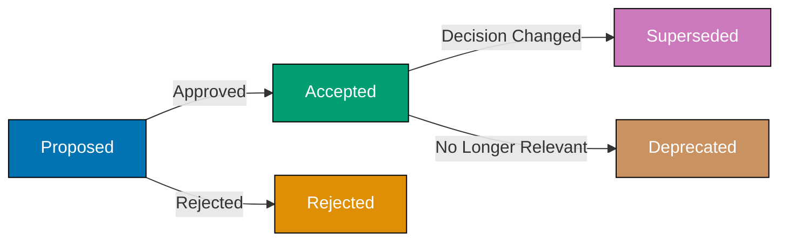

# OSS Documentation Convention

Standards for creating and maintaining repository-level documentation files that follow open source best practices. This convention defines requirements for README, CONTRIBUTING.md, Architecture Decision Records (ADRs), security documentation, and other repository-level files.

## Principles Implemented/Respected

This convention implements the following core principles:

- **[Accessibility First](../../principles/content/accessibility-first.md)**: README quality standards require clear, scannable content accessible to diverse audiences (non-native English speakers, screen reader users, developers of all skill levels).

- **[Explicit Over Implicit](../../principles/software-engineering/explicit-over-implicit.md)**: Architecture Decision Records document the "why" behind decisions explicitly. No hidden assumptions or implicit knowledge - reasoning is stated clearly for future maintainers.

## Purpose

This convention defines documentation standards specific to open-source software projects. It establishes requirements for README files, CONTRIBUTING guides, CODE_OF_CONDUCT, SECURITY policies, and LICENSE files that make open-source projects welcoming and professional.

## Scope

### What This Convention Covers

- **Essential OSS files** - README, CONTRIBUTING, LICENSE, CODE_OF_CONDUCT, SECURITY
- **File content requirements** - What each OSS file must contain
- **Community guidelines** - How to write contributor-friendly documentation
- **Legal compliance** - License and attribution requirements
- **Project metadata** - Badges, status indicators, project health signals

### What This Convention Does NOT Cover

- **Application documentation** - Product docs covered in Diátaxis framework categories
- **Internal documentation** - Internal practices covered in development conventions
- **API documentation** - Technical reference covered in reference/ category
- **Deployment documentation** - Covered in how-to guides

## Overview

Repository documentation serves as the primary interface between the project and its users, contributors, and maintainers. Well-structured documentation:

1. **Reduces Onboarding Time** - New contributors can quickly understand the project and start contributing
2. **Improves Discoverability** - Clear documentation helps users find and evaluate the project
3. **Enables Collaboration** - Explicit guidelines reduce friction in the contribution process
4. **Documents Decisions** - Architecture Decision Records preserve the reasoning behind key decisions
5. **Builds Trust** - Professional documentation signals project maturity and maintainability

## README Standards

The README is the primary entry point to the project. It should provide enough information for users to evaluate the project and get started quickly.

### Essential Sections

All READMEs must include:

1. **Project Title & Description**
   - Clear, concise project name
   - 1-2 sentence description of what the project does
   - Badges (build status, coverage, version, license)

2. **Motivation & Purpose**
   - Why does this project exist?
   - What problem does it solve?
   - Who is it for?

3. **Quick Start**
   - Installation instructions (copy-paste ready)
   - Minimal example to verify installation
   - Prerequisites clearly stated

4. **Key Features**
   - Bulleted list of main capabilities
   - Focus on user benefits, not implementation details

5. **Usage Examples**
   - Real code examples (not pseudocode)
   - Common use cases
   - Link to detailed documentation

6. **Documentation Links**
   - Link to full documentation
   - Link to API reference
   - Link to tutorials

7. **Contributing**
   - Link to `CONTRIBUTING.md`
   - Brief encouragement to contribute

8. **License**
   - License type (e.g., MIT, Apache 2.0)
   - Link to full LICENSE file

### Writing Principles

**Write for Beginners:**

- Explain like you're talking to a friend
- Avoid jargon or explain technical terms
- Assume no prior knowledge of the project
- List specific steps to remove ambiguity

**Keep it Concise:**

- README is an overview, not comprehensive docs
- Link to detailed documentation in `docs/`
- Use progressive disclosure (basics first, advanced later)

**Maintain Freshness:**

- Update README when project changes
- Keep examples working and tested
- Remove outdated information promptly

**Use Visual Hierarchy:**

- Clear section headings
- Bulleted lists for scanability
- Code blocks for commands and examples
- Tables for structured information

### Examples

**Good README structure:**

````markdown
# Project Name

Brief description of what the project does.

[]()
[]()

## Why This Project?

1-2 paragraphs explaining the motivation and problem being solved.

## Features

- Key feature 1
- Key feature 2
- Key feature 3

## Quick Start

### Prerequisites

- Node.js 24.x or higher
- npm 11.x or higher

### Installation

\```bash
npm install @open-sharia-enterprise/package-name
\```

### Basic Usage

\```typescript
import { functionName } from '@open-sharia-enterprise/package-name';

// Minimal working example
const result = functionName();
console.log(result);
\```

## Documentation

- [Full Documentation](./README.md)
- [Tutorials](./README.md)

## Contributing

We welcome contributions! Please read our [Contributing Guide](../../../CONTRIBUTING.md) to get started.

## License

This project is licensed under the MIT License - see the [LICENSE](./LICENSE) file for details.
````

### References

Standards based on:

- [GitHub README Best Practices](https://github.com/jehna/readme-best-practices)
- [Make a README](https://www.makeareadme.com/)
- [Standard README Specification](https://github.com/RichardLitt/standard-readme)
- [2025 Beginner-Friendly README Guide](https://www.readmecodegen.com/blog/beginner-friendly-readme-guide-open-source-projects)

## CONTRIBUTING.md Guidelines

The CONTRIBUTING.md file removes barriers to contribution by explicitly documenting the process, expectations, and standards.

### Essential Components

All CONTRIBUTING.md files must include:

1. **Welcome Message**
   - Thank contributors for their interest
   - Make them feel valued and encouraged
   - Set a positive, inclusive tone

2. **Table of Contents**
   - For files > 200 lines
   - Links to major sections
   - Improves navigation

3. **Development Environment Setup**
   - Prerequisites (Node.js, Volta, etc.)
   - Installation steps
   - Running locally
   - Common troubleshooting

4. **Code Conventions**
   - Coding style (link to style guide if detailed)
   - Commit message format (link to [Commit Message Convention](../../development/workflow/commit-messages.md))
   - Branch naming (link to [Trunk Based Development](../../development/workflow/trunk-based-development.md))
   - Testing requirements

5. **Contribution Process**
   - How to find issues to work on
   - How to propose new features
   - Pull request submission process
   - Code review expectations
   - Expected response time

6. **Bug Reports**
   - Where to report (GitHub Issues, email, etc.)
   - What information to include
   - Issue template (if available)

7. **Feature Requests**
   - How to propose enhancements
   - What information to include
   - Discussion process

8. **Testing Requirements**
   - How to run tests
   - Coverage expectations
   - Test writing guidelines

9. **Code of Conduct**
   - Link to CODE_OF_CONDUCT.md
   - Or embed if brief

10. **Getting Help**
    - Where to ask questions
    - Community channels
    - Maintainer contact

### Writing Principles

**Be Explicit:**

- Don't assume contributors know your process
- List specific steps, not general guidance
- Provide examples for complex processes

**Anticipate Challenges:**

- Address common setup issues
- Provide troubleshooting sections
- Link to solutions for known problems

**One PR Per Change:**

- Explicitly state: "Submit one pull request per bug fix or feature"
- Explain why (easier review, simpler rollback)
- Provide examples of good vs. bad PR scope

**Set Expectations:**

- Typical review time
- Merge requirements (approvals, tests passing)
- What happens after merge

### Example Structure

````markdown
# Contributing to Open Sharia Enterprise

Thank you for considering contributing to Open Sharia Enterprise! We appreciate your time and effort.

## Table of Contents

- [Development Setup](#development-setup)
- [Making Changes](#making-changes)
- [Submitting a Pull Request](#submitting-a-pull-request)
- [Code Conventions](#code-conventions)
- [Getting Help](#getting-help)

## Development Setup

### Prerequisites

- Node.js 24.11.1 (managed by Volta)
- npm 11.6.3 (managed by Volta)

### Installation

1. Clone the repository:
   \```bash
   git clone https://github.com/username/open-sharia-enterprise.git
   cd open-sharia-enterprise
   \```

2. Install dependencies:
   \```bash
   npm install
   \```

3. Run tests to verify setup:
   \```bash
   npm test
   \```

## Making Changes

1. Create a branch (or work on main for small changes - see [Trunk Based Development](../../development/workflow/trunk-based-development.md))
2. Make your changes
3. Add tests for new functionality
4. Ensure all tests pass: `npm test`
5. Format code: `npm run format` (runs automatically on commit)

## Submitting a Pull Request

1. Push your changes to GitHub
2. Open a pull request against the `main` branch
3. Fill out the PR template
4. Wait for code review (typically within 2-3 days)
5. Address review feedback
6. Once approved and tests pass, your PR will be merged

**Important:** Submit one pull request per bug fix or feature. This makes review easier and rollback simpler if needed.

## Code Conventions

- **Commit Messages:** Follow [Conventional Commits](../../development/workflow/commit-messages.md)
- **Code Style:** Enforced by Prettier (runs on commit)
- **TypeScript:** Use strict mode, no `any` types without justification
- **Tests:** Required for all new features and bug fixes

## Getting Help

- **Questions:** Open a GitHub Discussion
- **Bugs:** Open a GitHub Issue
- **Security:** See [SECURITY.md](../../../SECURITY.md)

## Code of Conduct

This project follows our Code of Conduct. By participating, you agree to uphold this code.
````

### References

Standards based on:

- [How to Build a CONTRIBUTING.md](https://contributing.md/how-to-build-contributing-md/)
- [CONTRIBUTING.md Template](https://gist.github.com/PurpleBooth/b24679402957c63ec426)
- [Open Source Contribution Guide](https://www.contribution-guide.org/)

## ️ Architecture Decision Records (ADRs)

ADRs document significant architectural decisions, preserving the context and reasoning for future maintainers.

### When to Create an ADR

Create an ADR for **architecturally significant decisions**:

- **Technology Choices** - Selecting frameworks, libraries, databases, cloud providers
- **Architectural Patterns** - Monorepo vs. polyrepo, microservices vs. monolith, state management
- **Infrastructure Decisions** - Deployment strategy, CI/CD approach, monitoring tools
- **Design Patterns** - Authentication approach, caching strategy, API design
- **Trade-offs** - Performance vs. simplicity, flexibility vs. standardization

**Do NOT create ADRs for:**

- Routine implementation details
- Temporary experimental code
- Decisions easily reversed without impact
- Minor library version updates

### ADR Structure

All ADRs must follow this structure:

```markdown
# [Number]. [Short Title]

Date: YYYY-MM-DD

## Status

[Proposed | Accepted | Deprecated | Superseded by ADR-XXX]

## Context

What is the issue we're facing? What factors are relevant?
Describe the forces at play (technical, political, social, project).
This section is value-neutral - present facts and constraints.

## Decision

What decision did we make?
State the decision clearly and concisely.
Use active voice: "We will use Nx for monorepo management."

## Consequences

What becomes easier or more difficult because of this decision?
Include both positive and negative consequences.
Be honest about trade-offs.

### Positive Consequences

- Benefit 1
- Benefit 2

### Negative Consequences

- Trade-off 1
- Trade-off 2

### Neutral Consequences

- Other impacts
```

### Storage and Naming

**Location:** `docs/adr/`

**Naming Pattern:** `NNNN-short-title.md`

- `NNNN` = 4-digit sequential number (0001, 0002, etc.)
- `short-title` = Kebab-case descriptive title
- Examples: `0001-use-nx-for-monorepo.md`, `0002-adopt-diataxis-framework.md`

**Index File:** `docs/adr/README.md` lists all ADRs with status

### Lifecycle Management

**Immutability:**

- ADRs are **immutable** after acceptance
- Do not edit the content of accepted ADRs
- If decision changes, create new ADR that supersedes old one

**Status Transitions:**



**Superseding ADRs:**

When decision changes, create new ADR:

1. Create new ADR with status "Proposed"
2. In new ADR context, reference previous ADR: "This supersedes ADR-0001"
3. After approval, update old ADR status: "Superseded by ADR-0005"
4. Do not modify old ADR's decision or consequences sections

### Review Process

**Meeting Format:**

- **Time-box:** 30-45 minutes maximum
- **Readout Style:** 10-15 minutes silent reading, then written feedback
- **Participants:** Cross-functional team, < 10 people
- **Author Ownership:** Author owns document and incorporates feedback

**Approval:**

- Team consensus required
- Document decision in ADR itself (add approval date)
- Update status from "Proposed" to "Accepted"

### Example ADR

```markdown
# 0001. Use Nx for Monorepo Management

Date: 2025-11-20

## Status

Accepted

## Context

We are building an enterprise platform that will consist of multiple applications (web, mobile, APIs) and shared libraries (utilities, components, domain logic). We need to decide how to organize and build this codebase.

Options considered:

1. **Polyrepo** - Separate repositories for each app and library
2. **Manual Monorepo** - Single repository with custom build scripts
3. **Nx Monorepo** - Single repository with Nx build system
4. **Turborepo** - Single repository with Turborepo build system

Key factors:

- Need to share code between apps (authentication, domain models, UI components)
- Want fast builds (only rebuild what changed)
- TypeScript is primary language
- Small team (< 10 developers initially)
- Need clear dependency management

## Decision

We will use Nx as our monorepo build system.

Rationale:

- Nx provides excellent TypeScript support with automatic project references
- Built-in task caching dramatically speeds up CI/CD
- Dependency graph visualization helps understand system
- Affected detection rebuilds only changed projects
- Strong documentation and community support

## Consequences

### Positive Consequences

- **Fast Builds:** Task caching reduces build time from minutes to seconds for unchanged projects
- **Code Sharing:** Easy to share libraries across apps with TypeScript path mappings
- **Dependency Management:** Nx enforces proper dependency boundaries, preventing circular dependencies
- **Developer Experience:** Single `nx` command interface for all projects
- **Scalability:** Architecture supports growth from 5 to 50+ projects

### Negative Consequences

- **Learning Curve:** Team must learn Nx commands and concepts
- **Vendor Lock-in:** Migration away from Nx would require significant effort
- **Configuration Complexity:** Each project needs `project.json` configuration
- **Build Tool Dependency:** Reliant on Nx team for bug fixes and updates

### Neutral Consequences

- **Node.js Ecosystem:** Committed to Node.js/TypeScript ecosystem (not polyglot)
- **Repository Size:** Single repository will grow large over time
```

### References

Standards based on:

- [ADR GitHub Organization](https://adr.github.io/)
- [AWS ADR Best Practices](https://docs.aws.amazon.com/prescriptive-guidance/latest/architectural-decision-records/best-practices.html)
- [Master ADRs: AWS Architecture Blog](https://aws.amazon.com/blogs/architecture/master-architecture-decision-records-adrs-best-practices-for-effective-decision-making/)
- [Microsoft Azure ADR Guide](https://learn.microsoft.com/en-us/azure/well-architected/architect-role/architecture-decision-record)

## Security Documentation

### SECURITY.md

The SECURITY.md file provides a clear channel for security researchers to responsibly disclose vulnerabilities.

**Location:** `SECURITY.md` at repository root

**Essential Sections:**

1. **Supported Versions**
   - Which versions receive security updates
   - End-of-life policy

2. **Reporting a Vulnerability**
   - Contact method (email, security platform)
   - Expected response time
   - What information to include

3. **Security Response Process**
   - How reports are handled
   - Timeline for fixes
   - Disclosure policy

4. **Security Update Policy**
   - How security fixes are released
   - Notification mechanism

**Example:**

```markdown
# Security Policy

## Supported Versions

| Version | Supported          |
| ------- | ------------------ |
| 1.x.x   | :white_check_mark: |
| < 1.0   | :x:                |

## Reporting a Vulnerability

**Please do not report security vulnerabilities through public GitHub issues.**

Instead, please report them via email to security@example.com.

Please include:

- Description of the vulnerability
- Steps to reproduce
- Potential impact
- Suggested fix (if any)

You should receive a response within 48 hours. We will keep you informed of progress toward a fix.

## Security Response Process

1. **Acknowledgment:** We will acknowledge receipt within 48 hours
2. **Investigation:** We will investigate and assess the severity
3. **Fix Development:** We will develop a fix (timeline depends on severity)
4. **Release:** We will release a security update
5. **Disclosure:** We will publicly disclose after fix is available

## Security Updates

Security fixes are released as patch versions (e.g., 1.2.3 → 1.2.4).
Subscribe to GitHub releases to be notified of security updates.
```

### Security Best Practices

**For Enterprise Platforms with Financial Services:**

- Explicitly document compliance standards (PCI DSS, SOC 2, etc.)
- Describe data protection measures
- Document authentication and authorization architecture
- Provide security contact for enterprise users

**References:**

- [GitHub Security Advisories](https://docs.github.com/en/code-security/security-advisories)
- [FINOS Security Standards](https://www.finos.org/) (financial services as one enterprise domain)

## Code of Conduct

The CODE_OF_CONDUCT.md establishes behavioral standards for the community.

**Location:** `CODE_OF_CONDUCT.md` at repository root

**Options:**

1. **Use Established Standards:**
   - [Contributor Covenant](https://www.contributor-covenant.org/) (most common)
   - [Citizen Code of Conduct](https://github.com/stumpsyn/policies/blob/master/citizen_code_of_conduct.md)

2. **Custom Code:**
   - If organizational policy requires
   - Must cover harassment, inclusion, enforcement

**Minimum Requirements:**

- Expected behavior standards
- Unacceptable behavior examples
- Consequences of violations
- Reporting mechanism
- Enforcement process

**Example (Brief):**

```markdown
# Code of Conduct

## Our Pledge

We pledge to make participation in our project a harassment-free experience for everyone, regardless of age, body size, disability, ethnicity, gender identity, level of experience, nationality, personal appearance, race, religion, or sexual orientation.

## Our Standards

**Examples of behavior that contributes to a positive environment:**

- Using welcoming and inclusive language
- Being respectful of differing viewpoints
- Gracefully accepting constructive criticism
- Focusing on what is best for the community

**Examples of unacceptable behavior:**

- Trolling, insulting/derogatory comments, and personal attacks
- Public or private harassment
- Publishing others' private information without permission
- Other conduct which could reasonably be considered inappropriate

## Enforcement

Instances of abusive, harassing, or otherwise unacceptable behavior may be reported to the project team at conduct@example.com. All complaints will be reviewed and investigated promptly and fairly.
```

## Additional Documentation Files

### LICENSE

**Location:** `LICENSE` (no extension) at repository root

**Requirements:**

- Use standard license text (MIT, Apache 2.0, GPL, etc.)
- Include copyright holder name and year
- Do not modify standard license text (except placeholders)

**Current Project:** MIT License (already present)

### CHANGELOG.md

**Location:** `CHANGELOG.md` at repository root

**Format:** Follow [Keep a Changelog](https://keepachangelog.com/)

**Structure:**

```markdown
# Changelog

All notable changes to this project will be documented in this file.

The format is based on [Keep a Changelog](https://keepachangelog.com/en/1.0.0/),
and this project adheres to [Semantic Versioning](https://semver.org/spec/v2.0.0.html).

## [Unreleased]

### Added

- New features in development

### Changed

- Changes in existing functionality

### Deprecated

- Soon-to-be removed features

### Removed

- Removed features

### Fixed

- Bug fixes

### Security

- Security fixes

## [1.0.0] - 2025-12-05

### Added

- Initial release
```

### AUTHORS or CONTRIBUTORS

**Location:** `AUTHORS.md` or `CONTRIBUTORS.md` at repository root

**Purpose:** Acknowledge contributors

**Options:**

1. Manual list (small teams)
2. Auto-generated from git history
3. Link to GitHub contributors page

## Maintenance and Updates

### Keeping Documentation Current

**README.md:**

- Update when features change
- Verify examples still work
- Update version badges
- Review quarterly for accuracy

**CONTRIBUTING.md:**

- Update when process changes
- Keep setup instructions current
- Update response time expectations
- Review annually or when onboarding issues arise

**ADRs:**

- Never edit after acceptance (create new ADR instead)
- Review when revisiting old decisions
- Update index when creating new ADRs

**SECURITY.md:**

- Update supported versions table
- Update contact information
- Review when security process changes

### Quality Checks

**Automated:**

- Link checking (internal and external links)
- Markdown linting
- Example code testing (if possible)

**Manual:**

- New contributor testing (can they follow setup?)
- Quarterly documentation review
- Post-incident reviews (did docs help or hinder?)

## Monorepo-Specific Considerations

For projects using Nx or similar monorepo tools:

**README Structure:**

- Root README explains overall architecture
- Each app/library has its own README
- Link from root README to app/library READMEs

**CONTRIBUTING.md Additions:**

- Explain monorepo structure (`apps/`, `libs/`)
- Document workspace commands (`nx run-many`, `nx affected`)
- Explain dependency boundaries
- Show how to create new apps/libraries

**ADRs:**

- Create ADRs at appropriate scope:
  - Workspace-level decisions in `docs/adr/`
  - App-specific decisions in `apps/[name]/docs/adr/`
  - Library-specific decisions in `libs/[name]/docs/adr/`

**References:**

- [Nx TypeScript Monorepos](https://nx.dev/blog/new-nx-experience-for-typescript-monorepos)
- [Managing TypeScript Packages in Monorepos](https://nx.dev/blog/managing-ts-packages-in-monorepos)

## Implementation Checklist

When setting up a new repository:

**Phase 1: Essential Files**

- [ ] `README.md` with all essential sections
- [ ] `LICENSE` file
- [ ] `.gitignore` appropriate for tech stack

**Phase 2: Contribution Infrastructure**

- [ ] `CONTRIBUTING.md` with setup and process
- [ ] `CODE_OF_CONDUCT.md` (use Contributor Covenant if no custom policy)
- [ ] `SECURITY.md` with vulnerability reporting

**Phase 3: Architecture Documentation**

- [ ] Create `docs/adr/` directory
- [ ] Create `docs/adr/README.md` index
- [ ] Write first ADR documenting major architectural decisions

**Phase 4: Continuous Improvement**

- [ ] `CHANGELOG.md` (once versioned releases begin)
- [ ] `AUTHORS.md` or contributor recognition
- [ ] Documentation review schedule
- [ ] Link checking automation

## Related Documentation

- [Diátaxis Framework](../structure/diataxis-framework.md) - Organization of internal documentation
- [File Naming Convention](../structure/file-naming.md) - Naming files within `docs/`
- [Linking Convention](../formatting/linking.md) - How to link between documentation
- [Commit Message Convention](../../development/workflow/commit-messages.md) - Git commit standards
- [Trunk Based Development](../../development/workflow/trunk-based-development.md) - Git workflow

## Further Reading

**README Best Practices:**

- [GitHub README Best Practices](https://github.com/jehna/readme-best-practices)
- [Make a README](https://www.makeareadme.com/)
- [Standard README Specification](https://github.com/RichardLitt/standard-readme)

**Contributing Guidelines:**

- [How to Build a CONTRIBUTING.md](https://contributing.md/how-to-build-contributing-md/)
- [CONTRIBUTING.md Template](https://gist.github.com/PurpleBooth/b24679402957c63ec426)

**Architecture Decision Records:**

- [ADR GitHub Organization](https://adr.github.io/)
- [AWS ADR Best Practices](https://docs.aws.amazon.com/prescriptive-guidance/latest/architectural-decision-records/best-practices.html)
- [Microsoft Azure ADR Guide](https://learn.microsoft.com/en-us/azure/well-architected/architect-role/architecture-decision-record)

**Financial Services Open Source:**

- [FINOS - Financial Services Open Source Foundation](https://www.finos.org/) (financial services as one enterprise domain)
- [State of Open Source in Financial Services](https://www.linuxfoundation.org/research/the-2023-state-of-open-source-in-financial-services)

---

**Last Updated**: 2025-12-05
