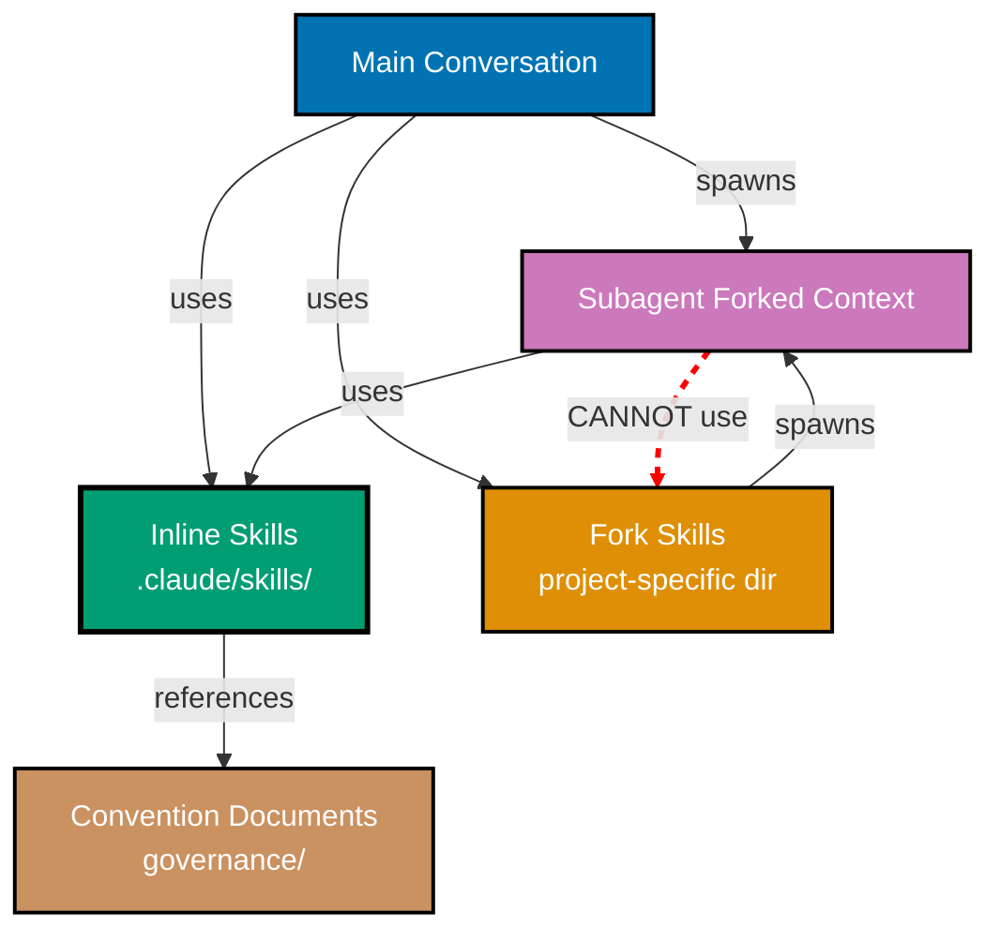

# Skill Context Architecture

This document defines the architectural constraint that all skills in `.claude/skills/` directory MUST use inline context mode (not `context: fork`) to ensure compatibility with both main conversation and subagent contexts.

## Principles Respected

This convention respects the following core principles:

- **[Explicit Over Implicit](../../principles/software-engineering/explicit-over-implicit.md)**: Explicitly documents the architectural constraint preventing subagents from spawning other subagents. Makes the limitation visible and provides clear guidance on skill design decisions.

- **[Simplicity Over Complexity](../../principles/general/simplicity-over-complexity.md)**: Single-level subagent spawning prevents complex nested agent hierarchies. Skills remain simple knowledge containers that work everywhere, avoiding architectural complexity.

## Purpose

This architectural decision establishes that all skills stored in the `.claude/skills/` directory must remain compatible with both main conversation agents and subagents. Since subagents cannot spawn other subagents (architectural constraint of Claude Code and OpenCode), skills with `context: fork` would be unusable in subagent contexts.

**Target Audience**:

- Agent developers creating or maintaining skills
- Repository maintainers reviewing skill contributions
- Anyone designing agent workflows involving skills

## The Architectural Constraint

### Core Limitation

**Subagents cannot spawn other subagents.**

This is a fundamental architectural constraint of both Claude Code and OpenCode systems:

```
Main Conversation
├─ Can spawn subagents ✅
└─ Subagent (forked context)
   ├─ Can use inline skills ✅
   ├─ Can reference conventions ✅
   └─ Can spawn subagents ❌ (architectural constraint)
```

### Impact on Skills

Since skills with `context: fork` spawn subagents:

1. **Main conversation** can use fork skills ✅ (spawns subagent successfully)
2. **Subagents** cannot use fork skills ❌ (would require spawning nested subagent)

If `.claude/skills/` contains fork skills:

- ✅ Work in main conversation
- ❌ Break when used by subagents
- ❌ Reduce skill composability
- ❌ Create confusing "works sometimes" behavior

## The Repository Standard

### All .claude/skills/ Must Be Inline

**Standard**: All skills in `.claude/skills/` directory MUST use inline context mode (or omit `context` field, defaulting to inline).

**Rationale**:

1. **Universal compatibility** - Work in both main conversation and subagent contexts
2. **Predictable behavior** - Skills always inject knowledge, never fail
3. **Composability** - Agents can freely compose multiple skills
4. **Subagent safety** - Subagents can use any skill without errors

### Inline Context Mode

**Default behavior** when `context` field is omitted or set to `inline`:

```yaml
---
description: Knowledge about X for agents
# context: inline is implicit (default)
---
```

**Characteristics**:

- **Progressive disclosure** - Name/description at startup, full content on-demand
- **Knowledge injection** - Add standards and guidance to current conversation
- **Convention packaging** - Bundle governance knowledge for efficient consumption
- **Universal compatibility** - Work in main conversation AND subagent contexts
- **Composition** - Multiple skills work together seamlessly

**Tool usage**: Skills can use `Read`, `Grep`, `Glob` to reference convention documents but should not modify files.

## Fork Skills: Use Outside .claude/skills/

### When You Need Fork Behavior

If you genuinely need task delegation with subagent spawning:

**Option 1: Create project-specific fork skills**

Place fork skills in a different directory (NOT `.claude/skills/`):

```
.claude/
├─ skills/              # ✅ All inline (universal compatibility)
└─ fork-skills/         # ✅ Fork skills (main conversation only)
   └─ deep-research/
      └─ SKILL.md      # context: fork, agent: Explore
```

**Characteristics**:

- Only usable from main conversation
- Clearly separated from universal skills
- Documented as "main conversation only"

**Option 2: Use agent workflows**

For complex orchestration, use workflow documents (Layer 5) that coordinate multiple agents in sequence rather than nesting:

```markdown
## Workflow Steps

1. Main conversation uses agent-maker
2. Main conversation uses agent-checker (separate invocation)
3. Main conversation uses agent-fixer (separate invocation)
```

This avoids subagent nesting while achieving similar orchestration goals.

### Fork Skill Use Cases (Outside Repository)

Valid use cases for fork skills (in project-specific directories):

- **Deep research** - Spawn Explore agent for focused investigation
- **Specialized analysis** - Delegate complex analysis to specific agent type
- **Parallel exploration** - Multiple fork skills explore different aspects
- **Workflow delegation** - Main conversation orchestrates multiple subagents

**Key constraint**: These must be used from main conversation, never from subagents.

## Validation and Compliance

### Skill Validation Checklist

When creating or reviewing skills in `.claude/skills/`:

- [ ] `context` field is omitted OR set to `inline`
- [ ] No `agent` field (only valid with `context: fork`)
- [ ] Skill provides knowledge, not task delegation
- [ ] Description focuses on knowledge domain, not agent spawning
- [ ] Skill works identically in main conversation and subagent contexts

### Common Mistakes

#### ❌ Mistake 1: Fork skill in .claude/skills/

**Wrong**:

```yaml
# .claude/skills/deep-research/SKILL.md
---
description: Performs deep research on topics
context: fork
agent: Explore
---
```

**Problem**: Breaks when subagents try to use this skill.

**Right**: Move to `.claude/fork-skills/` or use different approach.

#### ❌ Mistake 2: Inline skill trying to spawn agents

**Wrong**:

```yaml
# .claude/skills/analysis/SKILL.md
---
description: Analyzes code quality
---
# Analysis Skill

Run the code-checker agent to validate...
```

**Problem**: Inline skills can't spawn agents. Skill will fail to execute.

**Right**: Either make it a fork skill (outside .claude/skills/) or reference conventions instead of delegating to agents.

#### ❌ Mistake 3: Mixing inline and fork behavior

**Wrong**:

```yaml
# .claude/skills/hybrid/SKILL.md
---
description: Provides knowledge and delegates tasks
context: inline
---
Use these standards... [knowledge content]

For complex cases, spawn the analyzer agent... [delegation content]
```

**Problem**: Inline skills can't spawn agents. Choose one mode.

**Right**: Split into two skills - inline skill for knowledge, fork skill for delegation (in separate directory).

## Architecture Diagram



**Key**:

- Blue: Main conversation context
- Purple: Subagent (forked) context
- Green: Universal inline skills (works everywhere)
- Orange: Fork skills (main conversation only)
- Brown: Convention documents (governance layer)
- Red dashed: Architectural constraint (cannot do)

## Related Documentation

### Core Architecture

- **[Repository Governance Architecture](../../repository-governance-architecture.md)** - Six-layer architecture including skills as delivery infrastructure
- **[AI Agents Convention](./ai-agents.md)** - Agent structure and tool permissions

### Skills Documentation

- **[.claude/skills/README.md](../../../.claude/skills/README.md)** - Skill modes (inline vs fork) and organization
- **[How to Create a New Skill](../../../docs/how-to/hoto__create-new-skill.md)** - Step-by-step skill creation guide

### Related Conventions

- **[Maker-Checker-Fixer Pattern](../pattern/maker-checker-fixer.md)** - Three-stage workflow without nested subagents
- **[Temporary Files Convention](../infra/temporary-files.md)** - Audit reports enabling sequential agent workflows

## Enforcement

### Code Review Checklist

When reviewing PRs that add or modify skills in `.claude/skills/`:

1. Verify `context` field is omitted or set to `inline`
2. Confirm no `agent` field exists
3. Check skill description focuses on knowledge domain
4. Validate skill contains knowledge/guidance, not task delegation
5. Ensure skill references conventions rather than spawning agents

### Automated Validation (Future)

Potential automated checks:

```bash
# Check for fork context in .claude/skills/
grep -r "context: fork" .claude/skills/

# Check for agent field in .claude/skills/
grep -r "^agent:" .claude/skills/
```

Exit code 0 (no matches) = compliant, >0 = violations found.

## Summary

**The Rule**: All skills in `.claude/skills/` MUST use inline context mode.

**The Reason**: Subagents cannot spawn other subagents (architectural constraint).

**The Impact**: Universal skill compatibility across main conversation and subagent contexts.

**The Alternative**: Place fork skills in project-specific directories outside `.claude/skills/`, documented as "main conversation only".

This architectural decision ensures skills work predictably everywhere, enabling confident skill composition and subagent usage throughout the repository.

---

**Last Updated**: 2026-01-22
**Status**: Active Standard
