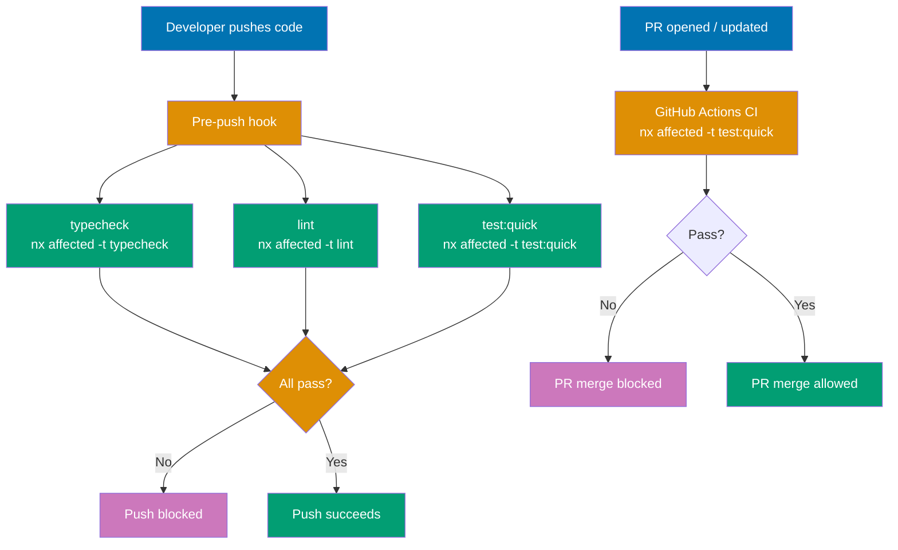
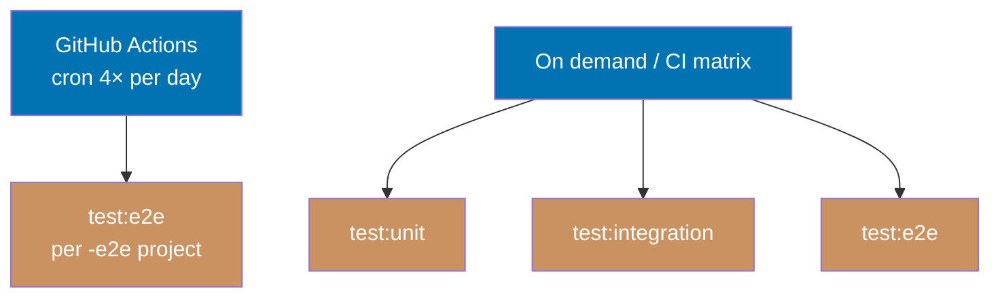

# Nx Target Standards

Defines the standard Nx targets that apps and libs expose, what each target must do, and naming conventions that keep all projects consistent across the workspace.

## Execution Model

### Quality Gates (pre-push enforcement)

`typecheck`, `lint`, and `test:quick` run at two mandatory checkpoints — locally before push and
remotely before merge.



### Scheduled and On-Demand Testing

Deeper tests run outside the pre-push/PR cycle — on a schedule or triggered explicitly.



## Principles Implemented/Respected

- **[Explicit Over Implicit](../../principles/software-engineering/explicit-over-implicit.md)**: Every project declares its capabilities through explicit targets. No implicit build or test mechanisms — if a project supports unit tests, it declares `test:unit`; if it has integration tests, it declares `test:integration`; if it has a dev server, it declares `dev`. The composition of `test:quick` is explicit in each project's `project.json`.

- **[Automation Over Manual](../../principles/software-engineering/automation-over-manual.md)**: Targets integrate with Nx affected computation, caching, the pre-push hook, and the PR merge gate. Consistent naming allows workspace-level automation (`nx affected -t test:quick`) to work across all project types without special cases.

- **[Simplicity Over Complexity](../../principles/general/simplicity-over-complexity.md)**: Each project exposes only the targets it actually needs. A Go CLI does not need `dev` or `start`. The full testing spectrum is composed from `test:quick`, `test:unit`, `test:integration`, and `test:e2e` — no aggregate wrapper target needed.

## Conventions Implemented/Respected

- **[File Naming Convention](../../conventions/structure/file-naming.md)**: `project.json` follows Nx workspace conventions; target names follow the kebab-case + colon-variant pattern defined here.

- **[Reproducible Environments Convention](../workflow/reproducible-environments.md)**: Projects with local dependencies expose an `install` target so dependency state is always explicit and reproducible.

## Target Naming Standards

Use these canonical names. Aliases (`serve`, `start:dev`, `unit-test`) are anti-patterns.

| Target             | Purpose                                                              | When Required                     |
| ------------------ | -------------------------------------------------------------------- | --------------------------------- |
| `build`            | Produce deployable or runnable artifacts                             | Compiled and bundled projects     |
| `typecheck`        | Verify type correctness without producing artifacts                  | Statically typed languages        |
| `lint`             | Static analysis and code style checks                                | All projects                      |
| `test:quick`       | Fast quality gate for pre-push and PR merge; composed of fast checks | All projects                      |
| `test:unit`        | Isolated unit tests with no external dependencies                    | Projects with unit tests          |
| `test:integration` | Tests that require external services (DB, APIs, filesystem)          | Projects with integration tests   |
| `test:e2e`         | Run E2E tests headlessly against a running app                       | E2E test projects (`*-e2e`)       |
| `test:e2e:ui`      | Run E2E tests with interactive Playwright UI                         | E2E test projects                 |
| `test:e2e:report`  | Open the last E2E HTML report                                        | E2E test projects                 |
| `dev`              | Start local development server with hot-reload                       | Apps with dev servers             |
| `start`            | Start server in production mode                                      | Apps with production server mode  |
| `run`              | Execute the application directly                                     | CLI applications                  |
| `install`          | Install project-local dependencies                                   | E2E suites, Flutter, Go CLIs      |
| `clean`            | Remove build artifacts and caches                                    | Projects with large build outputs |

### Naming Rules

- Use `dev` for the development server — never `serve`, never `start:dev`
- Use `start` for the production server — never `serve`
- Use `test:quick` for the fast pre-push gate; `test:unit` for isolated unit tests; `test:integration` for tests requiring external services; `test:e2e` for end-to-end tests — run targets individually rather than through an aggregate wrapper
- Separate target variants with a colon (`build:web`, `test:e2e:ui`), not a hyphen or underscore
- All target names use lowercase with hyphens for multi-word names (`run-pre-commit`)

## Mandatory Targets by Project Type

### All Projects

Every project in `apps/` and `libs/` must expose:

| Target       | Requirement                                                                                                                                                                                              |
| ------------ | -------------------------------------------------------------------------------------------------------------------------------------------------------------------------------------------------------- |
| `test:quick` | Complete in a few minutes (not tens of minutes); enforced by the pre-push hook and as a required GitHub Actions status check before PR merge                                                             |
| `lint`       | Exit non-zero on violations; enforced by the pre-push hook; **exception: Dart/Flutter omits this target** (see note below)                                                                               |
| `typecheck`  | Required for statically typed projects (TypeScript, Python/mypy, Dart/Flutter, Java with JSpecify + NullAway); enforced by the pre-push hook; skipped by Nx for projects that do not declare this target |

**Dart/Flutter exception — `lint` intentionally omitted**: `flutter analyze` combines type
checking and linting into a single pass. The pre-push hook runs `typecheck` → `lint`
sequentially — declaring both with the same `flutter analyze` command would execute it twice per
push with zero additional coverage. Flutter projects declare only `typecheck`; Nx silently skips
them for `nx affected -t lint`.

**`test:quick` composition** — each project decides which fast checks form its gate. The target runs its checks directly (calling the underlying tools, not other Nx targets) to avoid double execution when `lint` or `typecheck` are also run standalone by the pre-push hook. Common compositions:

| Project type       | Typical `test:quick` composition                                                                                                                                                                                                                                                                        |
| ------------------ | ------------------------------------------------------------------------------------------------------------------------------------------------------------------------------------------------------------------------------------------------------------------------------------------------------- |
| TypeScript app     | unit tests via vitest (typecheck and lint run separately in pre-push)                                                                                                                                                                                                                                   |
| Go app             | `go test -coverprofile=cover.out ./... && go tool go-test-coverage` — compiles and runs unit tests, then enforces ≥80% total coverage. The `go-test-coverage` tool is declared via the Go 1.24+ `tool` directive in each module's `go.mod` and configured via `.testcoverage.yml` at each project root. |
| Java/Spring Boot   | unit tests (Maven compile + Surefire unit subset)                                                                                                                                                                                                                                                       |
| Python app         | typecheck (mypy) + unit tests                                                                                                                                                                                                                                                                           |
| Hugo site          | `build` (smoke test; interpreted, no unit tests)                                                                                                                                                                                                                                                        |
| Flutter/Dart       | unit tests (`flutter test`); `flutter analyze` runs via `typecheck`, not `lint`                                                                                                                                                                                                                         |
| Playwright `*-e2e` | run the linter directly (no unit tests to add beyond linting)                                                                                                                                                                                                                                           |

The rule: include only checks that complete fast. If `test:unit` is slow for a project, exclude it from `test:quick` and run it separately. **The target must always exist** — even if it only runs the type checker — so the pre-push hook covers every project.

### Statically Typed Projects

TypeScript, Python (with mypy), Dart/Flutter:

| Target      | Requirement                                                                |
| ----------- | -------------------------------------------------------------------------- |
| `typecheck` | Run the type checker without emitting artifacts (`tsc --noEmit`, `mypy .`) |

**Not required for dynamically typed languages** (plain JavaScript, Ruby) or languages where compilation already enforces types and `build` covers it (Go, plain Java). **Exception**: Java projects that use JSpecify + NullAway declare `typecheck` because NullAway runs as a separate Error Prone plugin pass (via a dedicated Maven profile) that is not part of the standard `build`. The `typecheck` target also runs `javaproject-cli` to enforce that every Java package has a `package-info.java` annotated with `@NullMarked` — packages without it are silently skipped by NullAway.

### Compiled and Bundled Projects

Projects that produce artifacts from a compilation or bundling step (Go, Java, Hugo, Next.js, Flutter):

| Target  | Requirement                                                          |
| ------- | -------------------------------------------------------------------- |
| `build` | Produce production-ready artifacts; declare `outputs` for Nx caching |

**Not required for interpreted languages** (Python, Ruby, plain Node.js scripts) where the source is the deployable artifact.

### Apps with Development Servers

Hugo sites, Next.js, Flutter web, Spring Boot, Python web apps:

| Target | Requirement                                       |
| ------ | ------------------------------------------------- |
| `dev`  | Start local server with live-reload or watch mode |

### Apps with Production Server Mode

Spring Boot, Next.js, Python web apps:

| Target  | Requirement                |
| ------- | -------------------------- |
| `start` | Serve the production build |

### Projects with Unit Tests

Spring Boot, Flutter, Python apps, TypeScript apps:

| Target      | Requirement                                                          |
| ----------- | -------------------------------------------------------------------- |
| `test:unit` | Run only isolated unit tests; must not require any external services |

### Projects with Integration Tests

Spring Boot, Python apps, TypeScript apps that test against DB/APIs:

| Target             | Requirement                                                                     |
| ------------------ | ------------------------------------------------------------------------------- |
| `test:integration` | Run tests that require external services; slower than `test:unit` is acceptable |

### CLI Applications

Go CLIs and similar tools:

| Target    | Requirement                                              |
| --------- | -------------------------------------------------------- |
| `run`     | Execute the application (`go run main.go` or equivalent) |
| `install` | Sync dependencies (`go mod tidy` or equivalent)          |

### E2E Test Projects

Playwright suites (`*-e2e`):

| Target            | Requirement                  |
| ----------------- | ---------------------------- |
| `install`         | Install npm dependencies     |
| `test:e2e`        | Run all tests headlessly     |
| `test:e2e:ui`     | Run tests with Playwright UI |
| `test:e2e:report` | Open the HTML test report    |

**Execution strategy**: `test:e2e` is **not** part of the pre-push hook. It runs on a scheduled GitHub Actions cron job (twice daily per workflow) targeting each `*-e2e` project individually. This keeps pre-push fast while ensuring continuous E2E coverage against deployed or locally running services.

### Hugo Sites

| Target  | Requirement                                            |
| ------- | ------------------------------------------------------ |
| `clean` | Remove `public/`, `resources/`, and `.hugo_build.lock` |

`ayokoding-web` also exposes `run-pre-commit` — a pre-commit hook target that rebuilds the CLI, updates titles from filenames, and regenerates navigation. This is site-specific automation, not a general Hugo convention.

## Workspace-Level Defaults

`nx.json` `targetDefaults` provide inherited behaviour for standard targets. Individual `project.json` files override these when the project differs (e.g., Hugo sites output to `public/` not `dist/`).

```json
{
  "targetDefaults": {
    "build": {
      "dependsOn": ["^build"],
      "outputs": ["{projectRoot}/dist"],
      "cache": true
    },
    "typecheck": {
      "cache": true
    },
    "lint": {
      "cache": true
    },
    "test:quick": {
      "cache": true
    },
    "test:unit": {
      "cache": true
    },
    "test:integration": {
      "cache": false
    },
    "test:e2e": {
      "cache": false
    }
  }
}
```

### Caching Rules

| Target             | Cached | Notes                                                                                   |
| ------------------ | ------ | --------------------------------------------------------------------------------------- |
| `build`            | Yes    | Declare `outputs` in `project.json` for cache restoration                               |
| `typecheck`        | Yes    | Pure analysis; safe to cache against source changes                                     |
| `lint`             | Yes    | Pure static analysis; safe to cache                                                     |
| `test:quick`       | Yes    | Cache hit skips redundant pre-push runs                                                 |
| `test:unit`        | Yes    | Deterministic; safe to cache against source changes                                     |
| `test:integration` | No     | Nx cache is source-based; cannot detect external service changes (DB schema, API state) |
| `dev`              | No     | Long-running process                                                                    |
| `start`            | No     | Long-running process                                                                    |
| `run`              | No     | Side-effectful execution                                                                |
| `test:e2e`         | No     | Requires live app state; run via scheduled cron, not pre-push                           |
| `test:e2e:ui`      | No     | Interactive process                                                                     |
| `test:e2e:report`  | No     | Reads filesystem state at invocation time                                               |
| `install`          | No     | Must always run to ensure dep state                                                     |
| `clean`            | No     | Destructive operation                                                                   |

## Build Output Conventions

Declare the output directory in `project.json` `outputs` to enable Nx cache restoration.

| Project Type | Output Directory           |
| ------------ | -------------------------- |
| Go CLI       | `{projectRoot}/dist/`      |
| Hugo site    | `{projectRoot}/public/`    |
| Next.js      | `{projectRoot}/.next/`     |
| Flutter web  | `{projectRoot}/build/web/` |
| Spring Boot  | `{projectRoot}/target/`    |

Example override for a Hugo site:

```json
{
  "targets": {
    "build": {
      "executor": "nx:run-commands",
      "outputs": ["{projectRoot}/public"],
      "options": { "command": "bash build.sh" }
    }
  }
}
```

## Anti-Patterns

- **Non-standard target names**: `serve` instead of `dev`/`start`, `unit-test` instead of `test:unit`, `integration-test` instead of `test:integration`, `check` instead of `lint` or `typecheck`, bare `test` or `test:full` instead of a specific `test:*` variant
- **Missing `test:quick`**: Omitting the pre-push gate target silently excludes the project from `nx affected -t test:quick` — this breaks the workspace-wide hook
- **Missing `lint`**: Projects without `lint` cannot participate in workspace-wide lint runs or the pre-push hook lint gate
- **Heavy `test:quick`**: Including slow integration tests or E2E in `test:quick` defeats its purpose — keep the total to a few minutes, not tens of minutes
- **Mixing concerns in `test:unit`**: `test:unit` must not spin up databases, external APIs, or network services — those belong in `test:integration`
- **Enabling cache on `test:integration`**: Setting `cache: true` for integration tests risks serving stale results when external service state changes but source files have not
- **`build` on interpreted-language projects**: Adding a no-op `build` to Python or Ruby just to appear consistent — if there is no compile step, there is no `build` target
- **`typecheck` on compile-enforced languages without additional analysis**: Go and plain Java enforce types through `build`; a separate `typecheck` that only re-runs the compiler is redundant. **Exception**: Java with JSpecify + NullAway warrants `typecheck` because NullAway is a distinct null-safety pass not included in `build`
- **Undeclared outputs**: Omitting `outputs` on `build` disables caching and forces full rebuilds on every run
- **Apps-only targets on libs**: Libs do not expose `dev` or `start`; those are app-specific concepts
- **Creating a `test:full` wrapper**: Adding a `test:full` that just chains other targets adds indirection without value — run `test:unit`, `test:integration`, and `test:e2e` directly or via CI matrix steps

## Principles Traceability

| Decision                                                                              | Principle                                                                                 |
| ------------------------------------------------------------------------------------- | ----------------------------------------------------------------------------------------- |
| Consistent target names across all projects                                           | [Explicit Over Implicit](../../principles/software-engineering/explicit-over-implicit.md) |
| `typecheck`, `lint`, `test:quick` enforced at pre-push; `test:quick` at PR merge gate | [Automation Over Manual](../../principles/software-engineering/automation-over-manual.md) |
| Minimum required targets per project type                                             | [Simplicity Over Complexity](../../principles/general/simplicity-over-complexity.md)      |
| `outputs` required for cacheable targets                                              | [Explicit Over Implicit](../../principles/software-engineering/explicit-over-implicit.md) |
