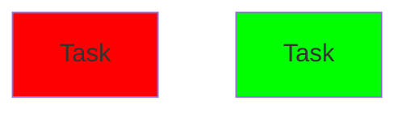
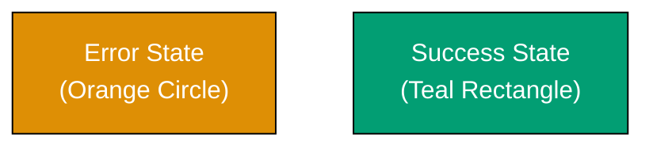
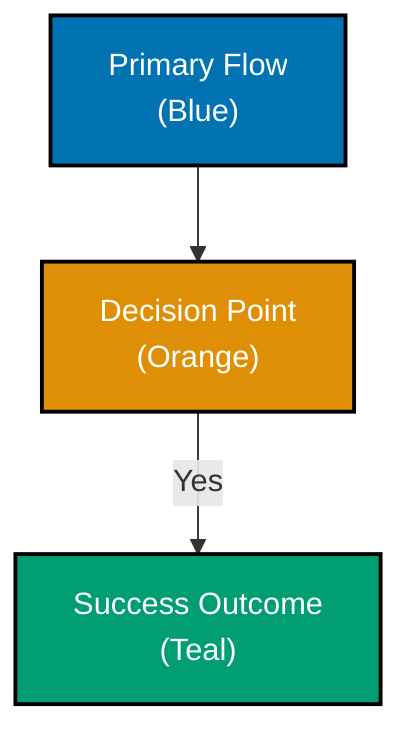

# Accessibility First

Design for **universal access from the start**. Accessibility is not an afterthought or optional feature - it's a foundational requirement that benefits everyone.

## 🌟 Vision Supported

This principle serves the [Open Sharia Enterprise Vision](../../vision/open-sharia-enterprise.md) of making Shariah-compliant enterprise accessible to everyone - literally and practically.

**How this principle serves the vision:**

- **Universal Islamic Finance Access**: Color-blind friendly diagrams and accessible documentation ensure Islamic finance education reaches developers with all abilities. No one excluded from learning or contributing
- **Global Reach**: Proper internationalization and semantic structure mean Islamic enterprise knowledge spreads across languages and cultures. Accessibility enables worldwide adoption
- **Inclusive Community**: When documentation, code, and tools are accessible, the community welcomes contributors from all backgrounds. Diversity strengthens the open-source Islamic enterprise movement
- **Alignment with Islamic Values**: Universal access embodies Islamic principles of justice ('Adl) and benefit to the ummah (Maslahah). Accessibility is not just good practice - it's an Islamic obligation
- **Professional Standards**: Accessible, WCAG-compliant projects attract serious developers and organizations. Raises the credibility and adoption of open-source halal enterprise

**Vision alignment**: Accessibility is integral to "democratizing" Islamic enterprise. If the technology is accessible but the documentation and tools are not, we haven't truly democratized anything. Universal design ensures universal benefit.

## 🎯 What

**Accessibility First** means:

- WCAG AA compliance as minimum standard
- Color-blind friendly palettes in all visual content
- Alt text for all images
- Proper heading hierarchy
- Screen reader compatibility
- Keyboard navigation support
- Semantic HTML structure

**Why "First"?**

- Built in from day one, not retrofitted
- Design decisions consider accessibility from the start
- Accessibility requirements drive design, not constrain it
- Universal benefit - accessible design works better for everyone

## 💡 Why

### Universal Benefit

Accessibility improvements help **everyone**, not just users with disabilities:

- **Color-blind friendly palettes** provide better contrast for all users
- **Alt text** helps search engines understand content
- **Semantic HTML** makes content machine-readable
- **Keyboard navigation** benefits power users
- **Clear heading hierarchy** improves scannability for all readers

### Moral Imperative

- **300 million people** worldwide have color vision deficiency
- **8% of males** and **0.5% of females** are color-blind
- **Millions** use screen readers for visual impairments
- **Everyone** benefits from accessible design

### Legal and Professional Standards

- **WCAG 2.2** is the international standard for web accessibility
- Many countries require WCAG AA compliance by law
- Professional software development includes accessibility
- Open source projects set standards for inclusive design

## 📋 How It Applies

### Color Accessibility

**Context**: All diagrams, visual aids, and styling.

**Requirement**: Use only color-blind friendly palette.

✅ **Accessible Palette** (Correct):

```css
/* Verified safe for all color blindness types */
#0173B2  /* Blue */
#DE8F05  /* Orange */
#029E73  /* Teal */
#CC78BC  /* Purple */
#CA9161  /* Brown */
```

❌ **Inaccessible Colors** (Avoid):

```css
/* Invisible or problematic for color-blind users */
#FF0000  /* Red - invisible to protanopia/deuteranopia */
#00FF00  /* Green - invisible to protanopia/deuteranopia */
#FFFF00  /* Yellow - invisible to tritanopia */
```

**See**: [Color Accessibility Convention](../../conventions/formatting/color-accessibility.md) - The master reference for all color usage

### Image Alt Text

**Context**: All images in documentation.

**Requirement**: Descriptive alt text for every image.

✅ **Good Alt Text**:

```markdown

```

**Why this works**: Describes what the image shows and its purpose. Screen reader users understand the content.

❌ **Bad Alt Text**:

```markdown

```

**Why this fails**: Generic "image" provides no information. Screen reader users learn nothing.

### Heading Hierarchy

**Context**: All markdown documents.

**Requirement**: Single H1, proper H2-H6 nesting, no skipped levels.

✅ **Correct Hierarchy**:

```markdown
# Document Title (H1)

## Section (H2)

### Subsection (H3)

#### Detail (H4)

## Another Section (H2)
```

**Why this works**: Screen readers build document outline from headings. Proper nesting creates logical structure.

❌ **Incorrect Hierarchy**:

```markdown
# Document Title (H1)

### Subsection (H3) <!-- WRONG! Skipped H2 -->

##### Detail (H5) <!-- WRONG! Skipped H4 -->
```

**Why this fails**: Skipped levels break screen reader navigation. Users can't understand document structure.

### Color Contrast

**Context**: All text and UI elements.

**Requirement**: WCAG AA minimum contrast ratios.

**Standards**:

- Normal text: **4.5:1** minimum
- Large text (18pt+ or 14pt+ bold): **3:1** minimum
- UI components: **3:1** minimum

✅ **Sufficient Contrast**:

```
Blue (#0173B2) on White (#FFFFFF): 8.59:1 (AAA)
Orange (#DE8F05) on White: 6.48:1 (AAA)
```

❌ **Insufficient Contrast**:

```
Light gray on white: 2:1 (fails WCAG AA)
Yellow on white: 1.5:1 (fails WCAG AA)
```

### Semantic HTML

**Context**: All markdown content.

**Requirement**: Use semantic elements, not styling hacks.

✅ **Semantic Structure**:

```markdown
## Section Heading

- Unordered list item
- Another item

> **Note**: This is a callout using blockquote
```

**Why this works**: Proper markdown syntax creates semantic HTML. Screen readers understand structure.

❌ **Non-Semantic**:

```markdown
**Section Heading**

**•** List item
**•** Another item

**Note**: This is just bold text
```

**Why this fails**: Manual formatting doesn't create semantic HTML. Screen readers see only styled text.

## 🚫 Anti-Patterns

### Using Color Alone

❌ **Problem**: Information conveyed only through color.



**Why it's bad**: Red-blind and green-blind users cannot distinguish these. Information is lost.

✅ **Solution**: Combine color with text labels and shapes.



### Missing Alt Text

❌ **Problem**: Images without descriptive alt text.

```markdown

```

**Why it's bad**: Screen reader users have no idea what the image shows.

### Red-Green Combinations

❌ **Problem**: Using red and green together.

**Why it's bad**: ~99% of color-blind users cannot distinguish red from green. Both appear as brownish-yellow.

### Low Contrast Text

❌ **Problem**: Light gray text on white background.

```css
color: #cccccc;
background: #ffffff;
/* Contrast: 1.6:1 - FAILS WCAG AA */
```

**Why it's bad**: Hard to read for everyone, impossible for vision-impaired users.

## ✅ Best Practices

### 1. Always Use Accessible Color Palette

**For all visual content** - diagrams, styling, UI:

```css
/* Only use these verified accessible colors */
#0173B2  /* Blue */
#DE8F05  /* Orange */
#029E73  /* Teal */
#CC78BC  /* Purple */
#CA9161  /* Brown */
#000000  /* Black */
#FFFFFF  /* White */
#808080  /* Gray */
```

**Never use**: Red, green, yellow, bright magenta, or any colors outside the verified palette.

### 2. Test with Color Blindness Simulators

**Before publishing**, test all visual content:

1. Open [Coblis Color Blindness Simulator](https://www.color-blindness.com/coblis-color-blindness-simulator/)
2. Upload diagram or screenshot
3. Test all three types: Protanopia, Deuteranopia, Tritanopia
4. Verify elements remain distinguishable
5. Confirm shape differentiation is sufficient

### 3. Verify Contrast Ratios

**For all text and UI elements**:

1. Open [WebAIM Contrast Checker](https://webaim.org/resources/contrastchecker/)
2. Enter foreground and background colors
3. Verify WCAG AA compliance (4.5:1 for normal text, 3:1 for large text)
4. Adjust colors if needed

### 4. Write Descriptive Alt Text

**For every image**:

- Describe what the image shows
- Explain why it's relevant
- Keep it concise (1-2 sentences)
- Avoid "image of" or "picture of"
- Include text from image if important

### 5. Use Proper Heading Structure

**For all documents**:

- Single H1 (document title)
- Logical H2-H6 hierarchy
- No skipped levels
- Descriptive heading text
- Headings for structure, not styling

### 6. Combine Multiple Visual Cues

**Never rely on a single visual cue**:

- ✅ Color + shape + text label
- ✅ Color + icon + position
- ❌ Color alone
- ❌ Shape alone without labels

## 📊 Examples from This Repository

### Mermaid Diagrams

**Location**: All `docs/` and convention documents



**Accessibility features**:

- ✅ Color-blind friendly palette
- ✅ Black borders for shape definition
- ✅ White text for contrast
- ✅ Text labels describe each element
- ✅ Shape differentiation (rectangle vs diamond)

### AI Agent Categorization

**Location**: `.opencode/agent/README.md`

```markdown
### 🟦 docs\_\_maker.md

Expert documentation writer specializing in Obsidian-optimized markdown.
```

**Accessibility features**:

- ✅ Colored square emoji (supplementary)
- ✅ Agent name (primary identifier)
- ✅ Description text (semantic meaning)
- ✅ Accessible blue color (#0173B2)
- ✅ Multiple visual cues, not color alone

### Document Frontmatter

**Location**: All markdown documents

```yaml
---
title: "Accessibility First"
description: Design for universal access from the start
category: explanation
tags:
  - principles
  - accessibility
---
```

**Accessibility features**:

- ✅ Descriptive title
- ✅ Clear description for search engines
- ✅ Semantic categorization
- ✅ Machine-readable structure

## 🔗 Related Principles

- [Explicit Over Implicit](../software-engineering/explicit-over-implicit.md) - Explicit alt text and descriptions
- [Simplicity Over Complexity](../general/simplicity-over-complexity.md) - Simple accessible design
- [Progressive Disclosure](./progressive-disclosure.md) - Accessible to all skill levels

## 📚 Related Conventions

- [Color Accessibility Convention](../../conventions/formatting/color-accessibility.md) - **Master reference for all color usage** (palette, WCAG, testing)
- [Content Quality Principles](../../conventions/content/quality.md) - Accessibility standards in content
- [Diagrams Convention](../../conventions/formatting/diagrams.md) - Accessible diagram standards

## 📖 References

**WCAG Standards**:

- [WCAG 2.2 Level AA](https://www.w3.org/WAI/WCAG22/quickref/) - International accessibility standard
- [WebAIM WCAG Checklist](https://webaim.org/standards/wcag/checklist) - Quick reference

**Color Accessibility**:

- [Coblis Color Blindness Simulator](https://www.color-blindness.com/coblis-color-blindness-simulator/) - Test tool
- [WebAIM Contrast Checker](https://webaim.org/resources/contrastchecker/) - Verify contrast ratios
- [ColorBrewer 2.0](https://colorbrewer2.org/) - Scientifically-tested color schemes

**Screen Reader Guides**:

- [WebAIM: Screen Reader User Survey](https://webaim.org/projects/screenreadersurvey/) - How users navigate
- [WebAIM: Writing for Screen Readers](https://webaim.org/articles/screenreader/) - Best practices

**Semantic HTML**:

- [MDN: HTML elements reference](https://developer.mozilla.org/en-US/docs/Web/HTML/Element) - Semantic elements
- [WebAIM: Semantic Structure](https://webaim.org/techniques/semanticstructure/) - Importance of semantics

---

**Last Updated**: 2025-12-15
