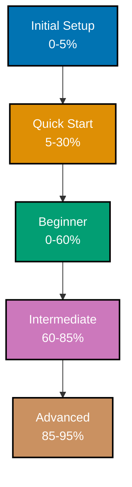

# Progressive Disclosure

**Start simple and layer complexity gradually**. Beginners see simple patterns first, experts access advanced features when needed. Complexity is **available** but not **required** for basic use.

## Vision Supported

This principle serves the [Open Sharia Enterprise Vision](../../vision/open-sharia-enterprise.md) of making Islamic enterprise accessible to developers at all skill levels - from beginners to experts.

**How this principle serves the vision:**

- **Lower Entry Barriers**: Beginners can start building Shariah-compliant applications with simple patterns immediately. Don't need to understand all of Islamic finance to begin
- **Supports Learning Journey**: Developers progress from basic implementations (Initial Setup → Quick Start) to advanced patterns (Intermediate → Advanced) at their own pace. Mirrors natural learning progression
- **Prevents Overwhelm**: New contributors see simple, achievable starting points. Complexity revealed gradually prevents decision paralysis and abandonment
- **Serves Multiple Audiences**: Same codebase serves both junior developers (need simple examples) and senior engineers (want advanced features). Inclusivity through layered design
- **Encourages Contribution**: Simple entry points mean more developers can contribute. As they learn, they contribute more sophisticated improvements

**Vision alignment**: Democratization requires meeting people at their current skill level. Progressive disclosure ensures Islamic enterprise is accessible whether you're learning your first "Hello World" or architecting enterprise systems.

## What

**Progressive Disclosure** means:

- Simple interfaces for common tasks
- Advanced features discoverable but hidden
- Learning paths from basic to expert
- Complexity introduced incrementally
- Each level complete and useful

**Immediate Complexity** means:

- All features exposed at once
- Beginners overwhelmed
- No clear learning path
- Cognitive overload
- Hard to get started

## Why

### Benefits of Progressive Disclosure

1. **Lower Barrier to Entry**: Beginners can start immediately
2. **Reduced Cognitive Load**: Learn one concept at a time
3. **Multiple Skill Levels**: Serves beginners and experts
4. **Guided Learning**: Clear progression path
5. **Just-in-Time Information**: Learn when needed, not all upfront

### Problems with Immediate Complexity

1. **Overwhelming**: Too much to learn at once
2. **Analysis Paralysis**: Can't decide where to start
3. **High Abandonment**: Beginners give up
4. **Inefficient Learning**: Time wasted on unnecessary details
5. **No Clear Path**: Random walk through features

### Principles of Progressive Disclosure

- **Start at Zero**: Assume no prior knowledge
- **One Concept at a Time**: Don't stack prerequisites
- **Make Each Level Complete**: Beginners can be productive with basics
- **Provide Clear Next Steps**: Show path to deeper knowledge
- **Advanced Features Discoverable**: Experts can find what they need

## How It Applies

### Tutorial Levels

**Context**: Learning paths for technical topics.

**Progressive Structure**:



**Why this works**:

- PASS: **Initial Setup (0-5%)**: Get running in 5 minutes
- PASS: **Quick Start (5-30%)**: Learn enough to explore independently
- PASS: **Beginner (0-60%)**: Comprehensive foundation
- PASS: **Intermediate (60-85%)**: Production-ready skills
- PASS: **Advanced (85-95%)**: Expert-level mastery

**Alternative** (what we avoid):

FAIL: **Single "Complete Guide"**: 1,000 pages covering everything at once. Overwhelming.

### Diátaxis Framework

**Context**: Documentation organization.

**Progressive Structure**:

```
Tutorials → How-To → Reference → Explanation
(Learn)     (Solve)   (Look up)   (Understand)
```

**Why this works**:

- PASS: **Tutorials**: Guided learning for beginners
- PASS: **How-To**: Problem-solving for practitioners
- PASS: **Reference**: Quick lookup for experts
- PASS: **Explanation**: Deep understanding for architects

**Not** a single type of documentation:

FAIL: Everything in one giant README
FAIL: Reference manual for beginners
FAIL: Tutorial for expert lookup

### File Naming Convention

**Context**: File organization system.

**Progressive Complexity**:

**Level 1 - Simple prefix**:

```
tu__getting-started.md
```

Simple prefix (`tu` for tutorials). Easy to understand.

**Level 2 - Subdirectory prefix**:

```
ex-co__file-naming-convention.md
```

Hyphenated prefix (`ex-co` for explanation/conventions). More context.

**Why this works**:

- PASS: Basic pattern is simple
- PASS: Advanced pattern adds context
- PASS: Prefix encodes location
- PASS: Understandable at each level

**Alternative** (what we avoid):

FAIL: **Complex classification system**: `L2-CAT3-TYPE1-SUBTYPE4-file.md`

Too complex. No progressive learning.

### Documentation Hierarchy

**Context**: Structuring documentation.

**Progressive Layers**:

```markdown
# Document Title

## Overview

Brief 2-3 sentence summary.

## Quick Start

Get running in 5 minutes.

## Basic Usage

Common use cases (80% of users).

## Advanced Usage

Edge cases and optimization.

## Reference

Complete API/configuration details.
```

**Why this works**:

- PASS: Beginners read Overview + Quick Start
- PASS: Practitioners read Basic Usage
- PASS: Experts jump to Advanced Usage
- PASS: All levels served

### Convention Documents

**Context**: Explaining repository standards.

**Progressive Structure**:

```markdown
# Convention Name

## What

Simple explanation of the convention.

## Why

Benefits and rationale.

## How It Applies

Basic examples and patterns.

## Advanced Patterns

Edge cases and complex scenarios.

## Anti-Patterns

What to avoid (for advanced users).
```

**Why this works**:

- PASS: "What" and "Why" for beginners
- PASS: "How It Applies" for practitioners
- PASS: "Advanced Patterns" for experts
- PASS: Each level optional

## Anti-Patterns

### Front-Loading Complexity

FAIL: **Problem**: Teaching advanced concepts before basics.

```markdown
# React Tutorial

## Advanced Patterns: Higher-Order Components

Before we learn basic components, let's understand HoCs...
```

**Why it's bad**: Beginners need basics first. HoCs require understanding components.

### No Clear Starting Point

FAIL: **Problem**: Documentation without "start here" guidance.

```
docs/
  advanced-optimization.md
  architecture-patterns.md
  basic-setup.md
  getting-started.md
  reference-api.md
```

**Why it's bad**: Unclear reading order. No indication of difficulty level.

### All-or-Nothing Documentation

FAIL: **Problem**: Either 10-page reference manual or nothing.

**No middle ground**: No quick start, no intermediate guides.

**Why it's bad**: Beginners overwhelmed, practitioners lack practical examples.

### Requiring Expert Knowledge for Basics

FAIL: **Problem**: Basic tasks require understanding internals.

```markdown
## Creating a Component

First, understand the reconciliation algorithm and virtual DOM diffing...
```

**Why it's bad**: Unnecessary complexity for basic tasks.

## PASS: Best Practices

### 1. Start with Minimal Viable Example

**Hello World first**:

```typescript
// PASS: Simplest possible example
console.log("Hello, World!");
```

**Then add complexity**:

```typescript
// Next step: Add type safety
const message: string = "Hello, World!";
console.log(message);
```

### 2. Provide Multiple Entry Points

**For different audiences**:

```markdown
- **New to React?** Start with [Quick Start Tutorial](./tu__react-quick-start.md)
- **Experienced developer?** See [API Reference](./re__react-api.md)
- **Migrating from Vue?** Read [Migration Guide](./hoto__migrate-from-vue.md)
```

### 3. Use "Learn More" Links

**Basic content with optional depth**:

```markdown
API authentication uses OAuth 2.0. [Learn more about OAuth 2.0](./ex__oauth2.md)
```

**Not** embedding OAuth explanation in basic tutorial.

### 4. Layer Complexity in Sections

**Structure documentation progressively**:

```markdown
## Basic Configuration

Simple options most users need.

## Advanced Configuration

Optional optimization and edge cases.

## Expert Configuration

Internals and customization.
```

### 5. Create Complete Levels

**Each level is self-contained**:

- PASS: Beginner tutorial teaches 0-60% completely
- PASS: Beginner can build real projects with 60% knowledge
- PASS: Intermediate builds on beginner (not replacement)

**Not**:

- FAIL: Beginner tutorial leaves gaps
- FAIL: Must read intermediate to be productive

## Examples from This Repository

### Tutorial Naming Convention

**Location**: `governance/conventions/tutorial/naming.md`

**Six progressive levels**:

1. **Initial Setup (0-5%)**: Run "Hello World"
2. **Quick Start (5-30%)**: Explore independently
3. **Beginner (0-60%)**: Comprehensive foundation
4. **Intermediate (60-85%)**: Production systems
5. **Advanced (85-95%)**: Expert mastery
6. **Cookbook**: Practical recipes (any level)

**Progressive disclosure features**:

- PASS: Clear percentage ranges (depth, not time)
- PASS: Each level complete and useful
- PASS: Linear progression
- PASS: Cookbook as parallel practical track

### Documentation Structure

**Location**: `docs/` directory

```
docs/
  tutorials/        # Start here (learning-oriented)
  how-to/           # Next (problem-solving)
  reference/        # Later (information lookup)
  explanation/      # Deep dives (understanding)
```

**Progressive disclosure features**:

- PASS: Clear starting point (tutorials)
- PASS: Progression path visible
- PASS: Each category serves different need
- PASS: Beginners and experts both served

### Agent Tool Permissions

**Location**: `.opencode/agent/` frontmatter

**Progressive tool access**:

```yaml
# Simple reader agent - minimal tools
tools: Read, Glob, Grep

# Writer agent - adds Write
tools: Read, Write, Glob, Grep

# Advanced agent - adds Edit
tools: Read, Write, Edit, Glob, Grep

# System agent - adds Bash
tools: Read, Write, Edit, Glob, Grep, Bash
```

**Progressive disclosure features**:

- PASS: Start with minimal tools
- PASS: Add tools as needed
- PASS: Explicit at each level
- PASS: Security through progressive access

### File Naming Prefixes

**Location**: File naming convention

**Progressive complexity**:

```
# Level 1: Root directory prefix
tu__getting-started.md         (2 letters)

# Level 2: Subdirectory prefix
ex-co__file-naming.md          (5 letters - ex-co)

# Level 3: Deep subdirectory prefix
ex-inse__security-basics.md    (7 letters - ex-inse)
```

**Progressive disclosure features**:

- PASS: Simple pattern for common case
- PASS: More context for deeper files
- PASS: Pattern scales with depth
- PASS: Learnable incrementally

## Related Principles

- [Simplicity Over Complexity](../general/simplicity-over-complexity.md) - Start simple, add complexity only when needed
- [No Time Estimates](./no-time-estimates.md) - Focus on learning outcomes, not duration
- [Accessibility First](./accessibility-first.md) - Progressive disclosure improves accessibility

## Related Conventions

- [Tutorial Naming Convention](../../conventions/tutorial/naming.md) - Six progressive tutorial levels
- [Diátaxis Framework](../../conventions/meta/diataxis-framework.md) - Four documentation types
- [File Naming Convention](../../conventions/meta/file-naming.md) - Progressive prefix complexity
- [Tutorial Convention](../../conventions/tutorial/general.md) - Progressive tutorial structure

## References

**UX Design**:

- [Progressive Disclosure (Nielsen Norman Group)](https://www.nngroup.com/articles/progressive-disclosure/) - UX principle
- [Information Architecture for the Web](https://www.oreilly.com/library/view/information-architecture-for/9781491913529/) - Louis Rosenfeld

**Learning Design**:

- [Cognitive Load Theory](https://en.wikipedia.org/wiki/Cognitive_load) - Psychology of learning
- [Bloom's Taxonomy](https://en.wikipedia.org/wiki/Bloom%27s_taxonomy) - Educational learning levels
- [Zone of Proximal Development](https://en.wikipedia.org/wiki/Zone_of_proximal_development) - Vygotsky

**Documentation**:

- [Diátaxis Framework](https://diataxis.fr/) - Documentation structure
- [Write the Docs](https://www.writethedocs.org/) - Documentation best practices

---

**Last Updated**: 2025-12-15
