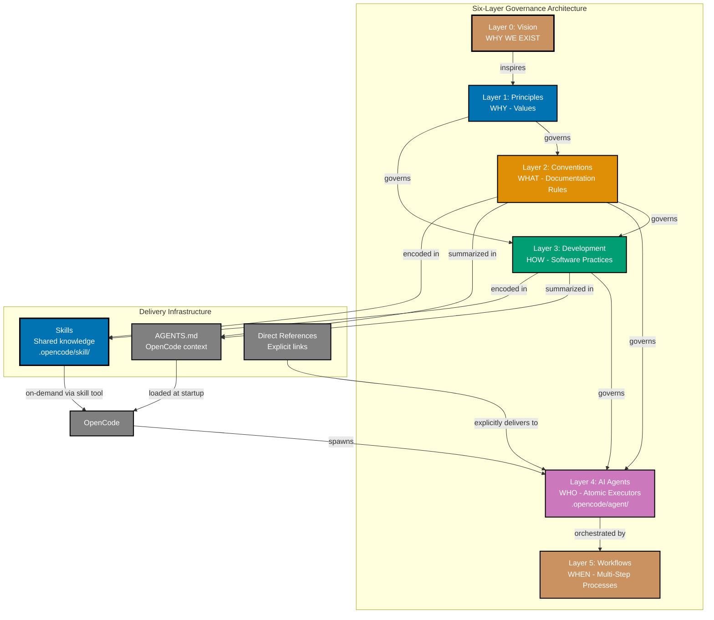

# Repository Architecture: Six-Layer Hierarchy

This document explains the complete six-layer architecture that governs the open-sharia-enterprise repository. Each layer builds on the foundation of the layer above, creating a traceable hierarchy from foundational purpose to automated workflows.

## 🎯 Purpose

The six-layer architecture provides:

1. **Clear governance** - Each layer governs the layer below
2. **Complete traceability** - Every rule traces back to foundational vision and principles
3. **Separation of concerns** - Vision, values, standards, practices, implementation, and orchestration are distinct
4. **Systematic consistency** - Changes propagate through layers in a predictable way

## 📊 The Six Layers



### Layer 0: Vision (WHY WE EXIST)

**Location**: `/governance/vision/`

**Purpose**: Foundational purpose establishing WHY the project exists and WHAT change we seek.

**Key Document**: [Vision - Open Sharia Enterprise](../vision/ex-vi__open-sharia-enterprise.md) (will be at `/governance/vision/` after move)

**Core Vision**:

- **Democratize Shariah-compliant enterprise** - Making ethical Islamic business solutions accessible to everyone
- **Problem**: Islamic finance locked in closed, expensive, proprietary systems
- **Solution**: Open-source halal enterprise solutions that anyone can build, deploy, and benefit from
- **Success metric**: When anyone globally can access, understand, and contribute to Islamic enterprise

**Characteristics**:

- Immutable foundational purpose
- Answers: "Why does this project exist?"
- Changes extremely rarely (only if mission fundamentally shifts)
- All other layers serve this vision

**Example**:

> "We exist to democratize Islamic finance by providing open-source, accessible, and verifiable enterprise solutions that anyone can use, understand, and contribute to."

### Layer 1: Principles (WHY - Foundational Values)

**Location**: `/governance/principles/`

**Purpose**: Foundational values that serve the vision and govern all conventions and development practices.

**Key Document**: [Core Principles Index](./principles/README.md) (will be at `/governance/principles/` after move)

**Ten Principles**:

**General Principles:**

1. **Simplicity Over Complexity** - Minimum viable abstraction, avoid over-engineering

**Content Principles:** 2. **Accessibility First** - WCAG compliance, universal design from the start 3. **Documentation First** - Documentation is mandatory, not optional 4. **No Time Estimates** - Outcomes over duration, respect different paces 5. **Progressive Disclosure** - Layer complexity gradually

**Software Engineering Principles:** 6. **Automation Over Manual** - Git hooks, AI agents for consistency 7. **Explicit Over Implicit** - Transparent configuration, no magic 8. **Immutability Over Mutability** - Prefer immutable data structures 9. **Pure Functions Over Side Effects** - Deterministic, composable functions 10. **Reproducibility First** - Eliminate "works on my machine" problems

**Characteristics**:

- Stable values that rarely change
- Each principle must include "Vision Supported" section
- Answers: "Why do we value this approach?"
- Governs both conventions (documentation) and development (software)

**Example Traceability**:

```
Vision: "Accessible to everyone"
    ↓ inspires
Principle: Accessibility First
    ↓ governs
Convention: Color Accessibility Convention (verified accessible palette)
Development: Hugo Development Convention (semantic HTML, ARIA labels)
```

### Layer 2: Conventions (WHAT - Documentation Rules)

**Location**: `/governance/conventions/`

**Purpose**: Documentation standards that implement core principles. Defines WHAT rules we follow for writing, organizing, and formatting documentation.

**Key Document**: [Conventions Index](./conventions/README.md) (will be at `/governance/conventions/` after move)

**Scope**: Documentation rules for:

- docs/ directory (all markdown files)
- Hugo sites (ayokoding-web, ose-platform-web)
- plans/ directory
- README files across repository

**Example Conventions**:

- **File Naming Convention** - `[prefix]__[content-identifier].[extension]`
- **Linking Convention** - GitHub-compatible relative paths with `.md`
- **Color Accessibility Convention** - Verified color-blind friendly palette
- **Content Quality Principles** - Active voice, proper heading hierarchy, alt text
- **Diátaxis Framework** - Four documentation types (Tutorials, How-To, Reference, Explanation)

**Characteristics**:

- Each convention MUST include "Principles Implemented/Respected" section
- Implemented by AI agents (Layer 4)
- Changes more frequently than principles
- Answers: "What documentation rules do we follow?"

**Example Traceability**:

```
Principle: Explicit Over Implicit
    ↓ governs
Convention: File Naming Convention (explicit prefixes encode directory path)
    ↓ governs
Agent: docs__file-manager (enforces naming when renaming files)
```

### Layer 3: Development (HOW - Software Practices)

**Location**: `/governance/development/`

**Purpose**: Software practices that implement core principles. Defines HOW we develop, test, and deploy software.

**Key Document**: [Development Index](./development/README.md) (will be at `/governance/development/` after move)

**Scope**: Software practices for:

- Source code (JavaScript, TypeScript, future: Java, Kotlin, Python)
- Hugo themes and layouts
- Build systems and tooling
- AI agents (`.opencode/agent/`, `.opencode/agent/`)
- Git workflows

**Example Practices**:

- **Trunk Based Development** - Single main branch, small frequent commits
- **Code Quality Convention** - Git hooks (Prettier, Commitlint, pre-push tests)
- **AI Agents Convention** - Agent structure, frontmatter, tool permissions
- **Maker-Checker-Fixer Pattern** - Three-stage workflow for quality
- **Implementation Workflow** - Make it work, make it right, make it fast

**Characteristics**:

- Each practice MUST include both "Principles Implemented/Respected" AND "Conventions Implemented/Respected" sections
- Implemented by AI agents (Layer 4) and automation (git hooks, build tools)
- Changes more frequently than conventions
- Answers: "How do we develop software?"

**Example Traceability**:

```
Principle: Automation Over Manual
    ↓ governs
Development: Code Quality Convention (automated git hooks)
    ↓ governs
Implementation: Husky + lint-staged (pre-commit formatting)
```

### Layer 4: AI Agents (WHO - Atomic Task Executors)

**Location**:

- `.opencode/agent/` (OpenCode format)

**Purpose**: Automated implementers that enforce conventions and development practices. Each agent implements and validates specific rules from layers 2 and 3.

**Note**: Agents use OpenCode format with YAML frontmatter, tool permissions, and skill access control. Agents reference shared skills from `.opencode/skill/`. See [AI Agents Convention - OpenCode Format](./development/agents/ai-agents.md#opencode-format) for format details.

**Key Document**: [Agents Index](../.opencode/agent/README.md)

**Agent Families**:

- **Makers** - Create/update content (docs**maker, readme**maker, plan\_\_maker)
- **Checkers** - Validate quality (docs**checker, wow**rules-checker, plan\_\_checker)
- **Fixers** - Apply validated fixes (docs**fixer, wow**rules-fixer, plan\_\_fixer)
- **Navigation** - Manage structure (ayokoding-web-navigation-maker, ayokoding-web-structure-maker)
- **Operations** - Deploy and manage (ayokoding-web-deployer, docs\_\_file-manager)

**Characteristics**:

- Each agent enforces specific conventions or practices
- Agents are atomic - one clear responsibility
- Frontmatter includes: name, description, tools, model, color
- Answers: "Who enforces the rules?"

**Example Traceability**:

```
Convention: Color Accessibility Convention
    ↓ implemented by
Agent: docs__checker (validates diagram colors against palette)
Agent: docs__fixer (applies color corrections)
    ↓ orchestrated by
Workflow: Maker-Checker-Fixer (Layer 5)
```

### Layer 5: Workflows (WHEN - Multi-Step Processes)

**Location**: `/governance/workflows/`

**Purpose**: Orchestrated multi-step processes that compose AI agents to achieve specific goals with clear termination criteria.

**Key Document**: [Workflows Index](./workflows/README.md) (will be at `/governance/workflows/` after move)

**Workflow Families**:

- **Maker-Checker-Fixer** - Content quality (docs, readme, ayokoding, ose-platform)
- **Check-Fix** - Iterative validation (ayokoding-check-fix, docs-check-fix)
- **Plan-Execute-Validate** - Project planning workflow

**Characteristics**:

- Define sequences (sequential/parallel/conditional)
- Manage state between steps
- Include human approval checkpoints
- Have clear termination criteria (exit conditions)
- Answers: "When do we run which agents in what order?"

**Example Workflow**:

```
Maker-Checker-Fixer Workflow:
1. Maker creates content → output: draft files
2. Checker validates → output: audit report
3. User reviews audit → decision: approve/reject
4. Fixer applies validated fixes → output: corrected files
5. Terminate when: all HIGH/MEDIUM findings resolved
```

## 🔧 Delivery Infrastructure

In addition to the six governance layers, the repository uses **delivery infrastructure** to transport knowledge from Layers 2-3 to Layer 4 (Agents). These are NOT governance layers - they don't enforce rules, they deliver knowledge.

### Delivery Mechanisms

| Mechanism             | Location           | Purpose                            | Tool(s)  | When Loaded                |
| --------------------- | ------------------ | ---------------------------------- | -------- | -------------------------- |
| **AGENTS.md**         | Root               | Comprehensive project instructions | OpenCode | Always at startup          |
| **Skills**            | `.opencode/skill/` | Progressive knowledge packages     | OpenCode | On-demand (tool-specific)  |
| **Direct References** | In agent prompts   | Links to convention docs           | OpenCode | When explicitly referenced |

### Skills as Infrastructure

**Skills** are model-invoked markdown knowledge packages that:

- **Enable progressive disclosure** - Name/description at startup, full content on-demand
- **Encode convention/development knowledge** - Packaged for efficient agent consumption
- **Support knowledge composition** - Multiple Skills work together seamlessly
- **Follow open standard** - agentskills.io format for portability

**Key Document**: [Skills Directory](../.opencode/skill/README.md)

**23 Skills Available**: See [Skills Directory](../.opencode/skill/README.md) for complete catalog.

**Skills Categories**:

- **Content Creation**: applying-content-quality, creating-by-example-tutorials, developing-ayokoding-content, developing-ose-content, writing-readme-files
- **Quality Assurance**: applying-maker-checker-fixer, assessing-criticality-confidence, validating-factual-accuracy, validating-links, generating-validation-reports
- **Standards Application**: applying-diataxis-framework, creating-accessible-diagrams, writing-gherkin-criteria
- **Process Execution**: creating-project-plans, defining-workflows, practicing-trunk-based-development, executing-checker-workflow, applying-fixer-workflow, multi-file-template
- **Technical Knowledge**: developing-agents, understanding-repository-architecture, documenting-references, selecting-models

See [AGENTS.md Skills Architecture](../../AGENTS.md#skills-knowledge-packages) for OpenCode-specific details.

### Why Infrastructure, Not a Layer?

**Governance layers** have defining characteristics:

- Enforce rules on the layer below
- Create obligations and constraints
- Answer "what must be done" at their level

**Testing the governance relationship**:

| Source                    | Target | Governance?                             | Evidence |
| ------------------------- | ------ | --------------------------------------- | -------- |
| Conventions → Development | Yes    | Conventions define HOW docs are written |
| Conventions → Agents      | Yes    | Agents MUST follow doc standards        |
| Development → Agents      | Yes    | Agents MUST follow coding patterns      |
| Skills → Agents           | **No** | Skills SERVE agents with knowledge      |

**Skills don't govern agents. Skills serve agents.**

**Delivery infrastructure** has different characteristics:

- Transports or delivers something
- No governance relationship with consumers
- Multiple alternatives can coexist (AGENTS.md, Skills, Direct References)

### Delivery vs Governance

```
Governance (enforces rules):
  Conventions ──governs──> Agents (agents MUST follow)
  Development ──governs──> Agents (agents MUST follow)

Delivery (serves knowledge):
  AGENTS.md ──loaded at startup──> Orchestrator ──spawns──> Agents (isolated contexts)
  Skills ──delivers via skill tool──> Agents
  Direct References ──explicit links──> Agents
```

## 🔗 Complete Traceability Examples

### Example 1: Color Accessibility

**Layer 0 - Vision**: Democratize Islamic enterprise → accessible to everyone

**Layer 1 - Principle**: [Accessibility First](./principles/content/accessibility-first.md)

- Vision supported: Accessible tools enable global participation in Islamic finance
- Key value: Design for universal access from the start

**Layer 2 - Convention**: [Color Accessibility Convention](./conventions/formatting/color-accessibility.md)

- Implements: Accessibility First principle
- Rule: Use only verified color-blind friendly palette (Blue, Orange, Teal, Purple, Brown)
- WCAG AA compliance required

**Layer 3 - Development**: [AI Agents Convention](./development/agents/ai-agents.md)

- Respects: Color Accessibility Convention
- Practice: Agent color categorization uses accessible palette
- Implementation: Frontmatter `color` field limited to accessible colors

**Layer 4 - Agents**:

- **docs\_\_checker**: Validates diagram colors against palette
- **docs\_\_fixer**: Applies color corrections to non-compliant diagrams
- **agent\_\_maker**: Validates new agents use accessible colors in frontmatter

**Layer 5 - Workflow**: [Maker-Checker-Fixer](./workflows/meta/workflow-pattern.md)

- Orchestrates: docs**maker → docs**checker → docs\_\_fixer
- Ensures: All diagrams use accessible colors through automated validation and fixing

### Example 2: Explicit Configuration

**Layer 0 - Vision**: Transparent, verifiable Islamic enterprise

**Layer 1 - Principle**: [Explicit Over Implicit](./principles/software-engineering/explicit-over-implicit.md)

- Vision supported: Transparency enables verification of Shariah compliance
- Key value: Code should be transparent and understandable

**Layer 2 - Convention**: [File Naming Convention](./conventions/meta/file-naming.md)

- Implements: Explicit Over Implicit principle
- Rule: Prefix encodes directory path explicitly (`ex-co__` = explanation/governance/conventions/)

**Layer 3 - Development**: [AI Agents Convention](./development/agents/ai-agents.md)

- Respects: File Naming Convention
- Practice: Agent files use kebab-case, explicit tool permissions in frontmatter
- Implementation: No default tool access, all tools explicitly whitelisted

**Layer 4 - Agents**:

- **agent\_\_maker**: Validates new agents have explicit tools field
- **wow\_\_rules-checker**: Audits agents for missing tool declarations
- **docs\_\_file-manager**: Enforces naming convention when renaming files

**Layer 5 - Workflow**: [Repo-Rules-Check-Fix](./workflows/repository/repository-rules-validation.md)

- Orchestrates: wow**rules-checker → wow**rules-fixer
- Ensures: All agents maintain explicit tool permissions

### Example 3: Automation for Consistency

**Layer 0 - Vision**: Reliable, trustworthy Islamic enterprise systems

**Layer 1 - Principle**: [Automation Over Manual](./principles/software-engineering/automation-over-manual.md)

- Vision supported: Automation ensures consistent Shariah compliance validation
- Key value: Machines handle repetitive tasks, humans focus on creative work

**Layer 2 - Convention**: [Content Quality Principles](./conventions/content/quality.md)

- Implements: Automation Over Manual principle
- Rule: Automated validation of active voice, heading hierarchy, alt text

**Layer 3 - Development**: [Code Quality Convention](./development/quality/code.md)

- Respects: Content Quality Principles
- Practice: Git hooks automate formatting and validation
- Implementation: Husky + lint-staged + Prettier + Commitlint

**Layer 4 - Agents**:

- **docs\_\_checker**: Automated content quality validation
- **ayokoding-web-general-checker**: Automated general Hugo content validation
- **ayokoding-web-by-example-checker**: Automated by-example tutorial validation
- **plan\_\_checker**: Automated plan completeness validation

**Layer 5 - Workflow**: [Ayokoding-Check-Fix](./workflows/ayokoding-web/general-quality-gate.md)

- Orchestrates: ayokoding-web-general-checker → ayokoding-web-general-fixer
- Ensures: All Hugo content meets quality standards through automated iteration

## 🏗️ Using the Architecture

### When Creating New Content

**Question**: "Where does my new document go?"

**Answer**: Determine the layer:

- **Vision** - Only if changing fundamental project purpose (extremely rare)
- **Principles** - If defining a foundational VALUE that governs decisions
- **Conventions** - If defining WHAT documentation rules to follow
- **Development** - If defining HOW to develop software
- **Workflows** - If orchestrating multiple agents in a repeatable sequence

**Process**:

1. Identify the layer based on "what question does this answer?"
2. Create document in appropriate directory
3. Add traceability sections (Principles/Conventions Implemented/Respected)
4. Update index files
5. Use wow\_\_rules-maker to propagate changes

### When Making Changes

**Process**:

1. **Start at the appropriate layer** - Don't modify Vision unless mission changes
2. **Check dependencies** - What layers depend on this change?
3. **Update traceability** - Ensure all references are updated
4. **Propagate changes** - Use wow\_\_rules-maker to propagate to AGENTS.md, indices, agents
5. **Validate** - Use wow\_\_rules-checker to verify consistency

**Example**: Adding a new principle

1. Create principle document in `/governance/principles/`
2. Add "Vision Supported" section showing how it serves the vision
3. Update `/governance/principles/README.md` index
4. Use wow\_\_rules-maker to propagate to AGENTS.md
5. Create conventions/practices that implement the principle
6. Create/update agents to enforce the principle

### When Troubleshooting

**Question**: "Why do we have this rule?"

**Answer**: Trace up the layers:

1. **Start at the rule** - Find the convention or practice
2. **Check traceability** - Read "Principles Implemented/Respected" section
3. **Read the principle** - Understand the foundational value
4. **Check vision alignment** - See "Vision Supported" section in principle
5. **Understand the WHY** - Now you know why the rule exists

**Example**: "Why do we use `ex-co__` prefixes in filenames?"

```
Rule: File Naming Convention (Layer 2)
    ↓ implements
Principle: Explicit Over Implicit (Layer 1)
    ↓ serves
Vision: Transparent, verifiable systems (Layer 0)

Answer: Explicit prefixes make file locations transparent without
opening files, supporting our vision of verifiable systems.
```

## 🎯 Key Principles

### Immutability Decreases Down the Layers

- **Layer 0 (Vision)**: Nearly immutable - only changes if mission fundamentally shifts
- **Layer 1 (Principles)**: Very stable - rarely change, require strong justification
- **Layer 2 (Conventions)**: Moderately stable - change when documentation needs evolve
- **Layer 3 (Development)**: Moderately stable - change when software practices evolve
- **Layer 4 (Agents)**: Changes frequently - new agents added, existing agents updated
- **Layer 5 (Workflows)**: Changes frequently - new workflows as needs emerge

### Traceability is Mandatory

Every convention, practice, and agent MUST be traceable:

- **Conventions** → MUST include "Principles Implemented/Respected" section
- **Development practices** → MUST include both "Principles" AND "Conventions" sections
- **Agents** → MUST reference which conventions/practices they enforce (in description or documentation)
- **Workflows** → MUST reference which agents they orchestrate (in definition)

### Changes Propagate Down

When changing a layer, all lower layers may need updates:

- **Vision change** → May require principle, convention, practice, agent, workflow updates
- **Principle change** → May require convention, practice, agent, workflow updates
- **Convention change** → May require agent and workflow updates
- **Practice change** → May require agent and workflow updates
- **Agent change** → May require workflow updates

Use **wow\_\_rules-maker** to propagate changes systematically.

## 🔍 Verification and Validation

### Layer Alignment Checks

**wow\_\_rules-checker** validates:

1. All conventions reference principles
2. All practices reference both principles and conventions
3. All agents reference conventions/practices
4. No circular dependencies between layers
5. AGENTS.md consistent with convention/practice documents

### Traceability Audits

Periodically verify:

1. Every convention traces to at least one principle
2. Every practice traces to principles AND conventions
3. Every agent enforces specific conventions/practices
4. Every workflow orchestrates appropriate agents
5. All "Vision Supported" sections accurately describe alignment

## Principles Implemented/Respected

**REQUIRED SECTION**: All explanation documents providing architectural guidance must include this section.

This architecture document implements/respects the following principles:

- **[Explicit Over Implicit](./principles/software-engineering/explicit-over-implicit.md)**: The six-layer architecture explicitly defines the governance hierarchy, making relationships between vision, principles, conventions, practices, agents, and workflows transparent and traceable.

- **[Simplicity Over Complexity](./principles/general/simplicity-over-complexity.md)**: The linear hierarchy (0→1→2→3→4→5) provides a simple mental model. Each layer has a clear purpose, avoiding complex cross-dependencies or matrix structures.

- **[Progressive Disclosure](./principles/content/progressive-disclosure.md)**: The architecture layers complexity - beginners understand vision and principles, intermediate users work with conventions/practices, advanced users create agents and workflows.

## 📚 Related Documentation

**Layer 0**:

- [Vision - Open Sharia Enterprise](../vision/ex-vi__open-sharia-enterprise.md)

**Layer 1**:

- [Core Principles Index](./principles/README.md)
- Individual principles in `/governance/principles/`

**Layer 2**:

- [Conventions Index](./conventions/README.md)
- 24 convention documents in `/governance/conventions/`

**Layer 3**:

- [Development Index](./development/README.md)
- 15 practice documents in `/governance/development/`

**Layer 4**:

- [OpenCode Agents Index](../.opencode/agent/README.md)
- Agent files in `.opencode/agent/` (OpenCode format)

**Layer 5**:

- [Workflows Index](./workflows/README.md)
- [Workflow Pattern Convention](./workflows/meta/workflow-pattern.md)

**Delivery Infrastructure**:

- [Skills Directory](../.opencode/skill/README.md) - 23 knowledge packages
- [How to Create a Skill](../how-to/hoto__create-new-skill.md) - Step-by-step guide
- [AGENTS.md](../../AGENTS.md) - OpenCode comprehensive instructions (~1,000 lines)

**Meta-Documentation**:

- [Diátaxis Framework](./conventions/meta/diataxis-framework.md) - Four documentation types
- [Convention Writing Convention](./conventions/content/convention-writing.md) - How to write conventions
- [AI Agents Convention](./development/agents/ai-agents.md) - How to create agents

---

**Last Updated**: 2026-01-05
