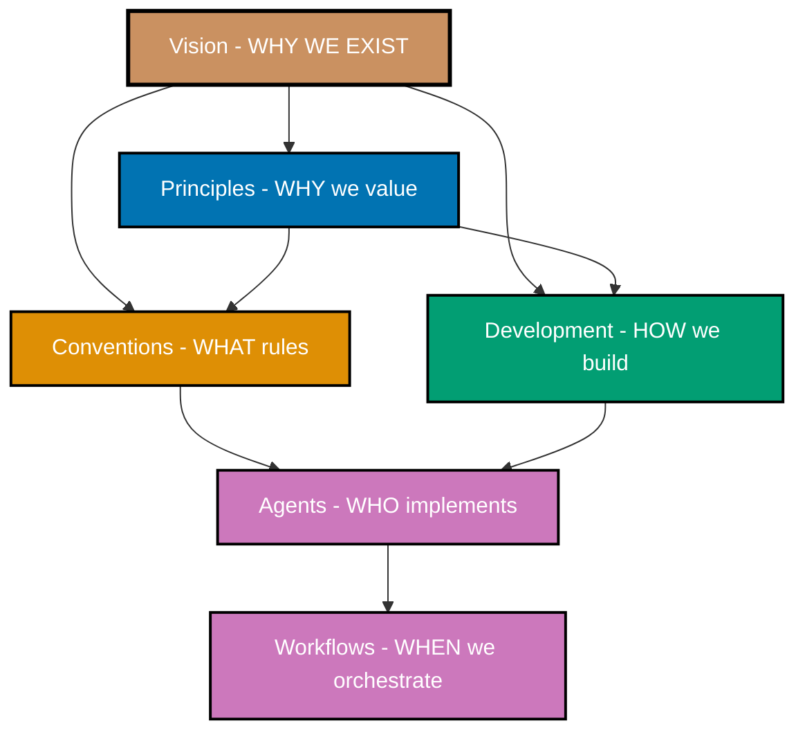

# Vision

The foundational purpose and change we seek through Open Sharia Enterprise - democratizing Shariah-compliant enterprise and making ethical Islamic business solutions accessible to everyone.

## Purpose

This directory contains the vision documents that establish **WHY** the Open Sharia Enterprise project exists and **WHAT CHANGE** we seek to create in the world. Vision is the top layer (Layer 0) of our six-layer architecture - it governs and gives purpose to all principles, conventions, development practices, agents, and workflows.

See [Repository Architecture](..repository-governance-architecture.md) for complete understanding of how vision fits into the governance hierarchy and how it inspires all other layers.

**Vision Hierarchy:**

- **Vision** (Layer 0) - Foundational purpose that inspires all principles
- **Principles** (Layer 1) - Values that serve the vision
- **Conventions** (Layer 2) - Standards implementing principles
- **Development** (Layer 3) - Practices implementing principles
- **Agents** (Layer 4) - Tools enforcing conventions and practices
- **Workflows** (Layer 5) - Processes orchestrating agents

## The Layer Test for Vision

**Question**: Does this document answer "**WHY do we exist and WHAT CHANGE do we seek?**"

✅ **Belongs in vision/** if it defines:

- The fundamental PURPOSE of the project
- The PROBLEM we exist to solve
- The CHANGE we want to create in the world
- WHO we serve and HOW they benefit
- WHAT SUCCESS looks like when we achieve our vision

❌ **Does NOT belong** if it defines:

- WHY we value something (that's a principle)
- WHAT specific rules to follow (that's a convention)
- HOW to implement something (that's a development practice)

**Examples:**

- "Democratize Shariah-compliant enterprise for everyone" → ✅ Vision (foundational purpose)
- "Traditional Islamic finance is locked in closed systems - we exist to open it" → ✅ Vision (problem and change)
- "Why we value simplicity in all solutions" → ❌ Principle (operational value)
- "File naming must use prefix\_\_identifier format" → ❌ Convention (specific rule)

## Vision Documents

### [Open Sharia Enterprise Vision](./ex-vi__open-sharia-enterprise.md)

The foundational vision document answering WHY we exist and WHAT change we seek.

**Contents:**

- **Why We Exist**: Democratize Shariah-compliant enterprise
- **The Problem**: Traditional Islamic finance is closed, expensive, inaccessible
- **The Change We Seek**: Anyone can build, deploy, and benefit from Shariah-compliant solutions
- **Islamic Foundation**: How this serves Islamic values and principles
- **Target Audience**: Developers, businesses, individuals seeking ethical finance
- **Success Vision**: What the world looks like when we succeed

## How Vision Governs Everything

Every decision in this project - from principles to conventions to code - should trace back to serving this vision:

### Vision → Principles

Each core principle supports specific aspects of the vision:

- **Accessibility First** → Makes Shariah-compliant enterprise accessible to everyone
- **Explicit Over Implicit** → Transparent, verifiable Islamic finance implementations
- **Simplicity Over Complexity** → Lowers barriers for developers to build halal enterprise solutions
- **Automation Over Manual** → Scales knowledge-sharing across the ummah
- **Progressive Disclosure** → Supports learners at all skill levels
- **No Time Estimates** → Respects individual learning and working pace

### Vision → Conventions

Documentation standards enable our mission:

- **Open documentation** → Knowledge shared freely, not hoarded
- **Accessible diagrams** → Learning materials available to all (color-blind friendly)
- **Clear linking** → Easy navigation supports learning and contribution
- **Quality standards** → Professional documentation attracts serious developers

### Vision → Development

Development practices embody our values:

- **Open source (MIT)** → Freedom to use, study, modify, distribute
- **Trunk-based development** → Continuous integration, transparent collaboration
- **Automated quality** → Reliability without expensive manual processes
- **AI-assisted workflows** → Automation serves the community

### Vision → Agents

Automation serves the mission:

- **Consistency checkers** → Maintain quality at scale
- **Content makers** → Lower barriers to contribution
- **Validators** → Ensure reliability without gatekeeping
- **Deployers** → Smooth path from code to production

## Questions the Vision Answers

### For Contributors

- **Why should I contribute?** → You're democratizing ethical finance for the ummah
- **Who benefits?** → Developers, businesses, individuals worldwide
- **What's the impact?** → Breaking down barriers to Shariah-compliant enterprise

### For Users

- **Why use this?** → Free, open, verifiable Islamic finance technology
- **Can I trust it?** → Transparent code, community-validated, Shariah-compliant
- **What's different?** → Built on values of sharing and service, not profit-maximization

### For the Project

- **Why this principle?** → Does it serve the vision of democratizing Islamic enterprise?
- **Why this convention?** → Does it make knowledge more accessible?
- **Why this practice?** → Does it embody Islamic values of transparency and service?

## Related Documentation

### Architecture

- [Repository Architecture](..repository-governance-architecture.md) - Complete six-layer architecture (Layer 0: Vision)

### Lower Layers (Governed by Vision)

- [Core Principles](../principles/README.md) - Layer 1: Values serving this vision
- [Conventions](../conventions/README.md) - Layer 2: Standards supporting the vision
- [Development](../development/README.md) - Layer 3: Practices aligned with the vision
- [AI Agents](../../../.opencode/agent/README.md) - Layer 4: Automation serving the mission
- [Workflows](../workflows/README.md) - Layer 5: Processes supporting our goals

### Project Context

- [Explanation Index](../README.md) - All conceptual documentation
- [CLAUDE.md](../../../CLAUDE.md) - Project guidance for all agents

---

**Last Updated**: 2025-12-24
