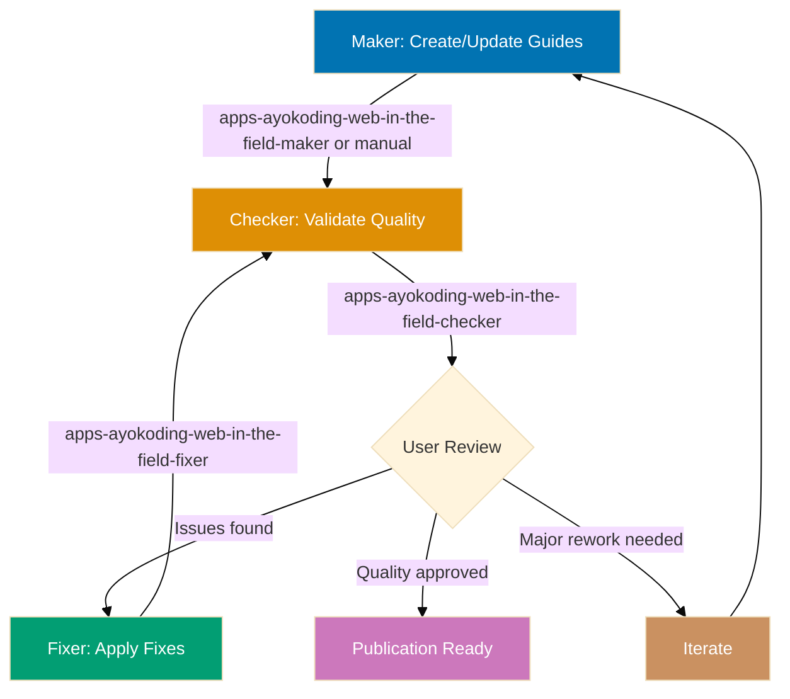
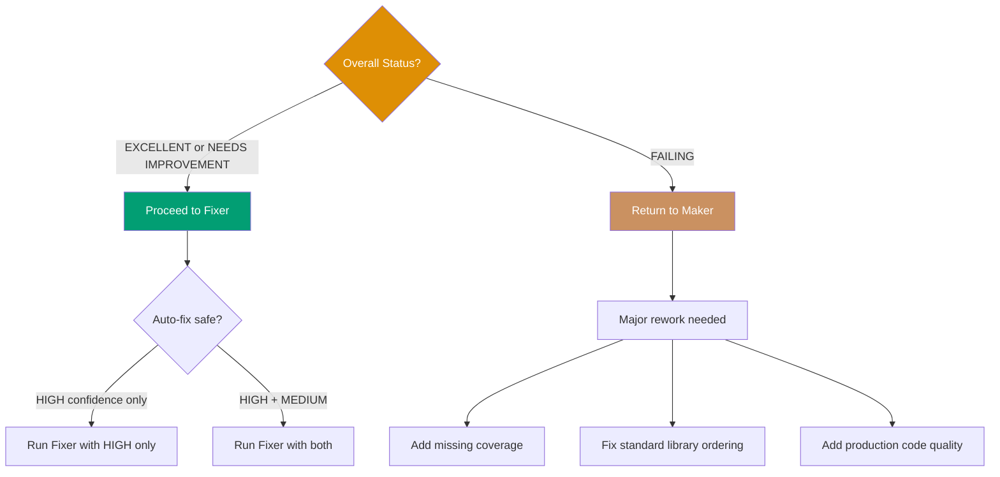

# AyoKoding Content In-the-Field Quality Gate Workflow

**Purpose**: Validate and improve in-the-field production guide quality through iterative checking and fixing until guides achieve production readiness with 20-40 guides following standard library first principle.

**When to use**:

- After creating or updating in-the-field production guides
- Before publishing in-the-field content to ayokoding-web
- When migrating guides to standard library first principle
- After adding new framework integrations to existing guides
- Periodically to ensure production code quality remains high

This workflow implements the **Maker-Checker-Fixer pattern** to ensure in-the-field guides meet quality standards before publication.

## Execution Mode

**Current Mode**: Manual Orchestration (see [Workflow Execution Modes Convention](../meta/execution-modes.md))

This workflow is currently executed through **manual orchestration** where the AI assistant follows workflow steps directly using Read/Write/Edit tools. File changes persist to the actual filesystem.

**How to Execute**:

```
User: "Run ayokoding-web in-the-field quality gate workflow for java/in-the-field/ in manual mode"
```

The AI will:

1. Execute apps-ayokoding-web-in-the-field-checker logic directly (validate guides, write audit)
2. User reviews audit report and decides on fixes (manual decision point)
3. Execute apps-ayokoding-web-in-the-field-fixer logic directly (read audit, apply fixes, write fix report)
4. Iterate until EXCELLENT status achieved (zero findings, 20-40 guides, production quality)
5. Show git status with modified files
6. Wait for user commit approval

**Why Manual Mode?**: Task tool runs agents in isolated contexts where file changes don't persist. Manual orchestration ensures audit reports and guide fixes are actually written to the filesystem. This workflow also includes manual decision points (user review step) unlike fully automated workflows.

## Workflow Overview



## Steps

### 1. Maker - Create/Update Guides (Manual/AI-Assisted)

**Objective**: Create or update in-the-field production guides

**Approaches**:

**Option A: Manual creation** (human author)

- Write guides following [In-the-Field Tutorial Convention](../../conventions/tutorials/in-the-field.md)
- Focus on standard library first, then frameworks
- Don't worry about perfect compliance (checker will catch issues)

**Option B: AI-assisted creation** (apps-ayokoding-web-in-the-field-maker)

- Use in-the-field-maker with production specifications
- Generate initial guides based on language/framework
- Human review and refinement

**Outputs**:

- Guide files: overview.md, [topic].md (20-40 guides)
- Standard library → framework progressions
- Production-ready code with error handling
- Mermaid diagrams where appropriate

**Next step**: Proceed to step 2

### 2. Checker - Validate Quality (Sequential)

**Objective**: Identify gaps and issues against in-the-field standards

**Agent**: `apps-ayokoding-web-in-the-field-checker`

**Execution**:

```bash
# Invoke via Task tool
subagent_type: apps-ayokoding-web-in-the-field-checker
prompt: "Validate apps/ayokoding-web/content/en/learn/software-engineering/programming-language/java/in-the-field/ for compliance with in-the-field standards"
```

**Validation areas**:

1. **Guide count**: 20-40 guides
2. **Standard library first**: Standard library BEFORE framework (CRITICAL)
3. **Annotation density**: 1.0-2.25 comment lines per code line
4. **Production code quality**: Error handling, logging, security, configuration
5. **Framework justification**: Why not standard library explained
6. **Diagram count**: 10-20 diagrams (progression diagrams prioritized)
7. **Frontmatter**: Complete and correct

**Outputs**:

- Audit report: `generated-reports/ayokoding-in-the-field__{uuid-chain}__{timestamp}__audit.md`
- Executive summary with overall status
- Detailed findings with confidence levels
- Specific line numbers for issues
- Actionable recommendations

**UUID Chain Tracking**: Checker generates 6-char UUID and writes to `generated-reports/.execution-chain-{scope}` (where scope is derived from tutorial path, e.g., "java").

**Depends on**: Step 1 completion

**Next step**: Proceed to step 3

### 3. User Review (Manual Decision Point)

**Objective**: Human decision on validation findings

**User actions**:

**1. Read audit report** from generated-reports/

**2. Count findings based on mode level** (default: `{input.mode}` or `normal`):

**Strictness-based counting**:

- **lax**: Count CRITICAL only
- **normal**: Count CRITICAL + HIGH
- **strict**: Count CRITICAL + HIGH + MEDIUM
- **ocd**: Count all levels (CRITICAL, HIGH, MEDIUM, LOW)

**3. Assess overall status**:

- PASS: **EXCELLENT**: Zero threshold-level findings
- **NEEDS IMPROVEMENT**: Some threshold-level findings, proceed to fixer
- FAIL: **FAILING**: Major structural issues, return to maker

**4. Review confidence levels**:

- **HIGH confidence**: Trust findings, approve auto-fix
- **MEDIUM confidence**: Review specific guides, approve if valid
- **FALSE POSITIVE risk**: Decide whether to keep current design or fix

**5. Make decision**:



**Depends on**: Step 2 completion

**Next step**:

- If approved → Proceed to step 4
- If failing → Return to step 1

### 4. Fixer - Apply Validated Fixes (Sequential, Conditional)

**Objective**: Automatically apply safe, validated improvements

**Agent**: `apps-ayokoding-web-in-the-field-fixer`

**Execution**:

```bash
# Invoke via Task tool with audit report and mode parameter
subagent_type: apps-ayokoding-web-in-the-field-fixer
prompt: "Apply fixes from generated-reports/ayokoding-in-the-field__a1b2c3__2026-02-06--14-30__audit.md with mode={input.mode}"
```

**Fix application strategy**:

**Fixer respects mode level** (`{input.mode}` from workflow):

- **lax**: Fix CRITICAL only (skip HIGH/MEDIUM/LOW)
- **normal**: Fix CRITICAL + HIGH (skip MEDIUM/LOW)
- **strict**: Fix CRITICAL + HIGH + MEDIUM (skip LOW)
- **ocd**: Fix all levels (CRITICAL, HIGH, MEDIUM, LOW)

**HIGH confidence fixes** (auto-apply within mode scope):

- Fix guide ordering (standard library before framework)
- Add missing sections (limitations, trade-offs)
- Add error handling blocks
- Fix frontmatter

**MEDIUM confidence fixes** (re-validate first, only if mode includes MEDIUM):

- Enhance framework justifications
- Add logging statements
- Add configuration examples

**FALSE POSITIVE risks** (report to user):

- Guide count adjustments (requires content creation)
- Production pattern selection (architectural decision)

**Outputs**:

- Modified guide files with fixes applied
- Fix report: `generated-reports/ayokoding-in-the-field__{uuid-chain}__{timestamp}__fix.md` (uses same UUID chain as source audit)
- List of deferred issues requiring user decision

**Depends on**: Step 3 approval

**Success criteria**: Fixer successfully applies fixes without errors.

**Next step**: Proceed to step 5

### 5. Iteration Control (Sequential)

Determine whether to continue fixing or finalize.

**Logic**:

- Re-run checker (step 2) to get fresh report
- Count findings based on mode level (same as Step 3)
- If threshold-level findings = 0 AND iterations >= min-iterations: Proceed to step 6 (Finalization)
- If threshold-level findings = 0 AND iterations < min-iterations: Loop back to step 3
- If threshold-level findings > 0 AND max-iterations provided AND iterations >= max-iterations: Proceed to step 6 with status `needs-improvement`
- If threshold-level findings > 0 AND (max-iterations not provided OR iterations < max-iterations): Loop back to step 3

**Depends on**: Step 4 completion

### 6. Finalization (Sequential)

Report final status and summary.

**Output**: `{final-status}`, `{iterations-completed}`, `{guides-count}`, `{production-coverage}`, final reports

**Status determination**:

- **Excellent** (`excellent`): Zero threshold-level findings, 20-40 guides, production code quality
- **Needs Improvement** (`needs-improvement`): Threshold-level findings remain after max-iterations OR below guide count
- **Failing** (`failing`): Major structural issues prevent auto-fixing, requires maker rework

**Depends on**: Step 5 completion

## Termination Criteria

**Success** (`excellent`):

- **lax**: Zero CRITICAL findings, 20-40 guides, production quality (HIGH/MEDIUM/LOW may exist)
- **normal**: Zero CRITICAL/HIGH findings, 20-40 guides, production quality (MEDIUM/LOW may exist)
- **strict**: Zero CRITICAL/HIGH/MEDIUM findings, 20-40 guides, production quality (LOW may exist)
- **ocd**: Zero findings at all levels, 20-40 guides, production quality

**Partial** (`needs-improvement`):

- Threshold-level findings remain after max-iterations OR guide count outside 20-40

**Failure** (`failing`):

- Major structural issues require maker rework, auto-fixing not applicable

## Related Workflows

This workflow is part of the **Tutorial Quality Family**:

- **[Maker-Checker-Fixer Pattern](../../development/pattern/maker-checker-fixer.md)**: General pattern
- **ayokoding-web-by-example-quality-gate**: Specialized for by-example tutorials
- **ayokoding-web-in-the-field-quality-gate** (this workflow): Specialized for in-the-field production guides

## Principles Implemented/Respected

- PASS: **Explicit Over Implicit**: All steps, decisions, and criteria are explicit
- PASS: **Automation Over Manual**: Automated validation and fixing where safe
- PASS: **Quality Over Speed**: Iterative refinement until excellent
- PASS: **Convention Over Configuration**: Standardized in-the-field validation criteria

## Conventions Implemented/Respected

- **[File Naming Convention](../../conventions/structure/file-naming.md)**: Workflow file follows plain name convention for workflows
- **[Linking Convention](../../conventions/formatting/linking.md)**: All cross-references use GitHub-compatible markdown with `.md` extensions
- **[Content Quality Principles](../../conventions/writing/quality.md)**: Active voice, proper heading hierarchy, single H1

## Related Documentation

- **[In-the-Field Tutorial Convention](../../conventions/tutorials/in-the-field.md)**: Quality standards
- **[Maker-Checker-Fixer Pattern](../../development/pattern/maker-checker-fixer.md)**: Workflow pattern
- **[`apps-ayokoding-web-in-the-field-checker` agent](../../../.claude/agents/apps-ayokoding-web-in-the-field-checker.md)**: Validation agent
- **[`apps-ayokoding-web-in-the-field-fixer` agent](../../../.claude/agents/apps-ayokoding-web-in-the-field-fixer.md)**: Fixing agent
- **[`apps-ayokoding-web-in-the-field-maker` agent](../../../.claude/agents/apps-ayokoding-web-in-the-field-maker.md)**: Content creation agent
