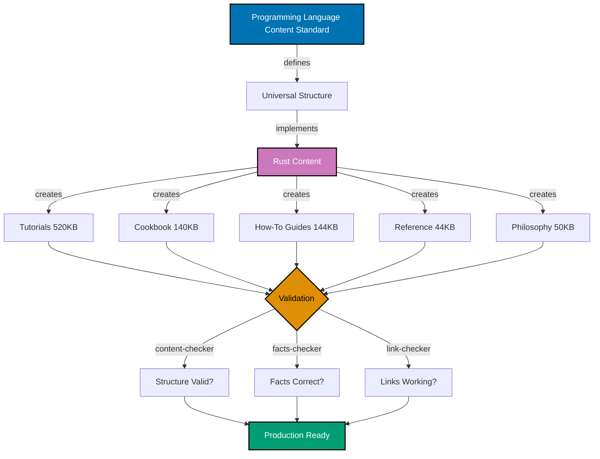
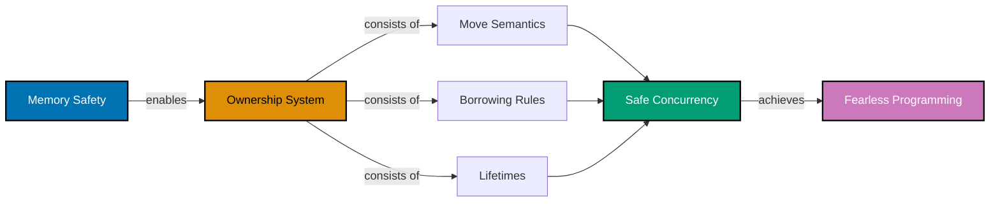
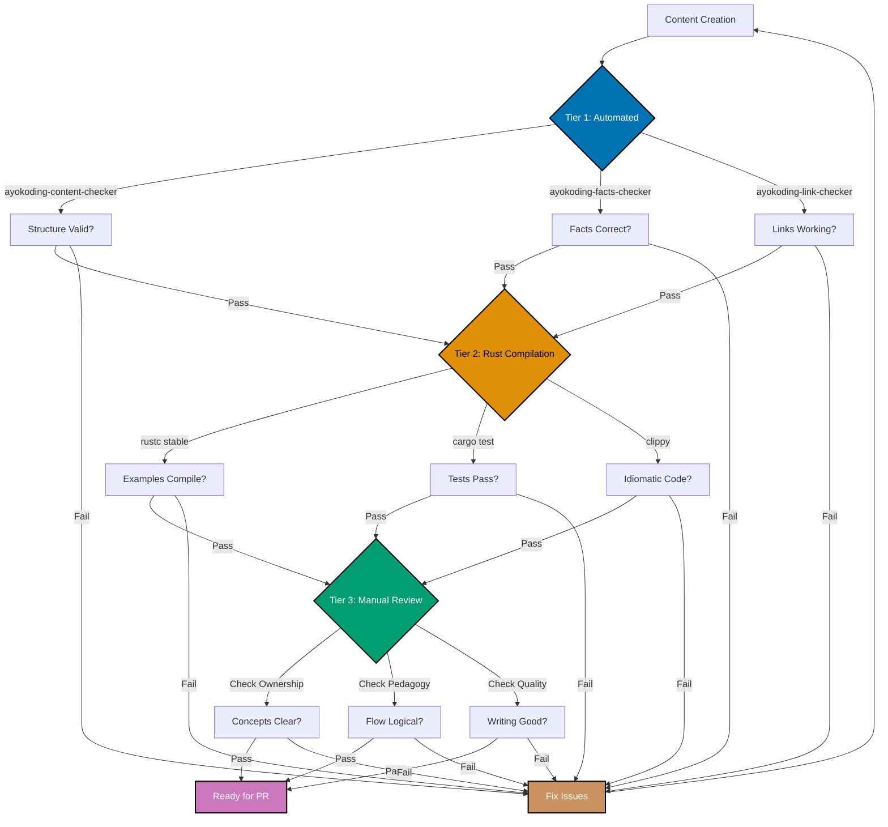

# Technical Documentation

## Architecture Overview

This project implements Rust programming language content following the established Programming Language Content Standard. The architecture leverages existing Hugo + Hextra framework with no new components - pure content expansion.

### Content Architecture



**Color Palette**: Blue (#0173B2), Purple (#CC78BC), Orange (#DE8F05), Teal (#029E73) - color-blind friendly per Color Accessibility Convention

### Rust-Specific Considerations

Rust introduces unique concepts requiring specialized pedagogical treatment:



**Color Palette**: Blue (#0173B2), Orange (#DE8F05), Teal (#029E73), Purple (#CC78BC) - color-blind friendly per Color Accessibility Convention

**Key Pedagogical Challenges**:

1. **Ownership Learning Curve**: Beginners struggle with mental model shift
2. **Lifetime Annotations**: Abstract concept needing concrete examples
3. **Async Complexity**: Modern async ecosystem evolving rapidly
4. **Unsafe Rust**: When and how to use properly

## Technology Stack

### Content Management

- **Hugo**: Static site generator (v0.119.0+)
- **Hextra Theme**: Documentation theme for ayokoding-web
- **Markdown**: Content format with extended syntax
- **Mermaid**: Diagram rendering (crucial for ownership visualizations)
- **Frontmatter**: YAML metadata for Hugo processing

### Validation Tools

- **ayokoding-content-checker**: Structural and quality validation
- **ayokoding-facts-checker**: Factual accuracy verification (Rust edition-specific)
- **ayokoding-link-checker**: Link integrity validation
- **Prettier**: JSON array format enforcement for tags

### Rust Toolchain

- **rustc**: Rust compiler (stable channel, 2024 edition)
- **cargo**: Package manager and build tool
- **rustfmt**: Code formatting
- **clippy**: Linting
- **rust-analyzer**: IDE support

### Development Tools

- **VS Code**: Primary editor with rust-analyzer extension
- **Git**: Version control (Trunk Based Development)
- **Node.js + npm**: Development environment (via Volta)

## Design Decisions

### Decision 1: Single Comprehensive PR Strategy

**Context**: Rust content totals ~520KB across all categories

**Decision**: Deliver all Rust content as a single PR

**Rationale**:

- **Atomic Delivery**: Rust content forms cohesive learning path
- **Cross-References**: Tutorials reference cookbook and how-to guides extensively
- **Ownership Progression**: Concepts build across categories (can't split)
- **Quality Baseline**: All content must meet standard together

**Alternatives Considered**:

- Multi-PR approach (tutorials, then cookbook, then guides): Rejected (incomplete learning experience between PRs)
- MVP then expand: Rejected (ownership concepts require comprehensive treatment from start)

**Consequences**:

- ✅ Complete learning path immediately available
- ✅ All cross-references valid at merge
- ✅ Single review focusing on Rust-specific quality
- ⚠️ Large PR requiring thorough review (mitigated by extensive validation)

### Decision 2: Ownership-First Tutorial Approach

**Context**: Ownership is Rust's defining feature and biggest learning hurdle

**Decision**: Introduce ownership early in Quick Start, dedicate major section in Beginner

**Rationale**:

- **Core Concept**: Understanding ownership is prerequisite for everything else
- **Mental Model**: Early exposure helps build correct intuitions
- **Avoid Confusion**: Delaying ownership creates false assumptions
- **Progressive Disclosure**: Start simple (move semantics), build to complex (lifetimes)

**Alternatives Considered**:

- Defer ownership to Intermediate: Rejected (creates frustration and confusion)
- Minimal ownership mention: Rejected (learners hit borrow checker without context)

**Consequences**:

- ✅ Learners understand borrow checker errors
- ✅ Solid foundation for advanced concepts
- ✅ Realistic about Rust's learning curve
- ⚠️ Quick Start slightly longer than other languages (acceptable trade-off)

### Decision 3: Edition-Specific Content (2024 Edition)

**Context**: Rust has edition system (2015, 2018, 2021, 2024)

**Decision**: Target Rust 2024 edition as baseline, note edition-specific features

**Rationale**:

- **Current Standard**: 2024 edition is stable (released February 2025)
- **Long Support**: Editions supported indefinitely
- **Modern Features**: Includes latest improvements and enhanced diagnostics
- **Migration Path**: Clear upgrade from 2021 to 2024
- **Future-Proof**: Content targets current edition, maximizes relevance timeline

**Alternatives Considered**:

- Target 2021 edition: Rejected (now outdated, 2024 is stable and current)
- Target 2018 edition: Rejected (missing important features)
- Edition-agnostic: Rejected (impossible due to syntax differences)

**Consequences**:

- ✅ Content remains relevant for years
- ✅ Includes latest Rust features
- ✅ Clear edition markers for version-specific content
- ✅ Aligns with community adoption of 2024 edition
- ⚠️ May need to mention 2021→2024 migration for learners upgrading existing code

### Decision 4: Async/Await in Intermediate Tutorial

**Context**: Async Rust is complex but increasingly essential

**Decision**: Cover async/await fundamentals in Intermediate, deep-dive in Advanced

**Rationale**:

- **Production Necessity**: Most modern Rust apps use async
- **Complexity Level**: Requires understanding of traits, lifetimes, error handling
- **Ecosystem Maturity**: Tokio is de facto standard
- **Progressive Learning**: Basics in Intermediate, internals in Advanced

**Alternatives Considered**:

- Skip async entirely: Rejected (too important to omit)
- Async in Beginner: Rejected (prerequisites not met)
- Only in Advanced: Rejected (delays practical async usage)

**Consequences**:

- ✅ Learners can build async apps after Intermediate
- ✅ Realistic about async complexity
- ✅ Tokio-focused (ecosystem standard)
- ⚠️ Async ecosystem evolution may require updates

### Decision 5: Unsafe Rust in Advanced Only

**Context**: Unsafe Rust provides escape hatch but requires deep understanding

**Decision**: Cover unsafe only in Advanced tutorial with emphasis on safety invariants

**Rationale**:

- **Advanced Concept**: Requires understanding of memory layout, guarantees
- **Rare Need**: Most Rust code doesn't need unsafe
- **Safety Critical**: Misuse of unsafe creates vulnerabilities
- **Expert Territory**: Belongs in 85-95% coverage level

**Alternatives Considered**:

- Skip unsafe entirely: Rejected (important for FFI, performance)
- Unsafe in Intermediate: Rejected (learners not ready)
- Unsafe throughout: Rejected (encourages premature use)

**Consequences**:

- ✅ Learners understand when unsafe is appropriate
- ✅ Emphasis on safety invariants
- ✅ FFI and performance optimization context
- ⚠️ Beginners won't know about unsafe (intentional - good default)

### Decision 6: Comprehensive Cookbook with Ownership Focus

**Context**: Cookbook needs 30-35 recipes showing idiomatic Rust

**Decision**: Dedicate significant cookbook space to ownership, borrowing, and lifetime patterns

**Rationale**:

- **Common Problems**: Ownership errors are most frequent beginner issues
- **Idiomatic Solutions**: Show correct patterns, not workarounds
- **Reference Material**: Learners need quick lookup for common scenarios
- **Reinforce Learning**: Concrete examples solidify abstract concepts

**Alternatives Considered**:

- Standard cookbook without ownership focus: Rejected (misses Rust's uniqueness)
- Separate ownership guide: Rejected (recipes format works better)

**Consequences**:

- ✅ Quick reference for ownership challenges
- ✅ Shows idiomatic Rust patterns
- ✅ Complements tutorial explanations
- ⚠️ Cookbook slightly longer than other languages (acceptable for comprehensiveness)

### Decision 7: 18 How-To Guides with Rust-Specific Topics

**Context**: How-to guides solve practical problems

**Decision**: Include 18 guides covering Rust ecosystem (Cargo, FFI, WebAssembly, embedded)

**Rationale**:

- **Ecosystem Coverage**: Rust spans many domains (systems, web, embedded, WASM)
- **Practical Focus**: Guides address real development scenarios
- **Tooling Emphasis**: Cargo, rustfmt, clippy are essential
- **Modern Rust**: Async, FFI, WASM reflect current usage

**Alternatives Considered**:

- Minimal guides (12): Rejected (insufficient ecosystem coverage)
- Domain-specific (web only): Rejected (Rust's versatility is strength)

**Consequences**:

- ✅ Comprehensive practical guidance
- ✅ Multiple career paths (web, systems, embedded)
- ✅ Ecosystem tools well-documented
- ⚠️ More guides to maintain (acceptable for completeness)

## Implementation Approach

### Phase Structure

Implementation follows 4-phase pattern:


**Color Palette**: Blue (#0173B2), Orange (#DE8F05), Teal (#029E73), Purple (#CC78BC), Brown (#CA9161) - color-blind friendly per Color Accessibility Convention

#### Phase 1: Analysis

**Goal**: Research Rust-specific pedagogical approaches

**Activities**:

1. Study Rust Book structure and progression
2. Analyze Rust by Example patterns
3. Review common learner struggles (ownership, lifetimes)
4. Identify ecosystem tools and frameworks (Tokio, Actix, Diesel, wasm-bindgen)
5. Map Rust concepts to coverage levels
6. Plan Mermaid diagrams for ownership visualization

**Output**: Detailed implementation checklist with Rust-specific adaptations

#### Phase 2: Content Creation

**Goal**: Write all Rust content

**Activities**:

1. **Tutorials** (5 levels):
   - Initial Setup: rustup, cargo, hello world
   - Quick Start: 12 touchpoints including ownership intro
   - Beginner: Deep ownership section with diagrams
   - Intermediate: Traits, lifetimes, async/await, smart pointers
   - Advanced: Unsafe, macros, optimization
2. **Cookbook** (30-35 recipes):
   - Ownership patterns (10 recipes)
   - Error handling (5 recipes)
   - Concurrency (5 recipes)
   - Traits and generics (5 recipes)
   - Remaining categories (5-10 recipes)
3. **How-To Guides** (18 guides):
   - Cargo, testing, traits, concurrency, async
   - FFI, WebAssembly, embedded, CLI, web APIs
4. **Reference Section**:
   - Cheat sheet with ownership syntax
   - Glossary with Rust terminology
   - Resources with learning paths
5. **Philosophy**:
   - Overview: What makes Rust special
   - Best practices: Idiomatic Rust
   - Anti-patterns: Common mistakes
6. **Cross-references**: Link everything together

**Output**: All content files ready for validation

#### Phase 3: Validation

**Goal**: Ensure Rust content quality and correctness

**Activities**:

1. **Automated Validation**:
   - Run ayokoding-content-checker (structure, formatting)
   - Run ayokoding-facts-checker (Rust 2024 edition verification)
   - Run ayokoding-link-checker (internal and external links)
2. **Code Example Testing**:
   - Test all examples with rustc stable
   - Verify cargo commands (new, build, test, run)
   - Check clippy and rustfmt suggestions
   - Test on macOS, Linux, Windows
3. **Manual Review**:
   - Ownership explanations clarity
   - Lifetime annotations correctness
   - Async examples with Tokio
   - Unsafe code safety invariants
   - Pedagogical flow (simple to complex)

**Output**: Content passing all validation checks

#### Phase 4: Integration

**Goal**: Prepare comprehensive PR

**Activities**:

1. Verify directory structure matches standard
2. Check weight numbering (500s, 600s, 700s, 800s)
3. Ensure cookbook at position 3 (weight: 603)
4. Test Hugo build locally (no errors)
5. Write detailed PR description
6. Create commit message following convention

**Output**: PR ready for review with validation evidence

## Rust Implementation Details

### Tutorial Content Strategy

#### Initial Setup (400-500 lines)

**Focus**: Get Rust toolchain working

**Key sections**:

- rustup installation (Windows, macOS, Linux)
- Toolchain management (stable, beta, nightly)
- Component installation (rustfmt, clippy, rust-analyzer)
- First program (cargo new hello-rust)
- IDE setup (VS Code with rust-analyzer)

**Rust-specific considerations**:

- Emphasize rustup as the standard tool
- Explain stable vs nightly concept
- Show edition selection (default 2024)

#### Quick Start (750-900 lines)

**Focus**: Essential Rust in 12 touchpoints

**Touchpoint structure**:

1. Variables and mutability (let vs let mut)
2. Data types (integers, floats, bool, char, tuples, arrays)
3. Functions and expressions (no return keyword pattern)
4. Control flow (if, loop, while, for, match)
5. **Ownership basics** (move semantics, copy trait)
6. **Borrowing fundamentals** (&T immutable, &mut T mutable)
7. Structs and methods (impl blocks)
8. Enums and pattern matching (Option, Result intro)
9. Error handling (?, unwrap, expect)
10. Modules and crates (mod, use, pub)
11. Common collections (Vec, HashMap, String)
12. Testing basics (#[test], assertions)

**Ownership introduction strategy**:

- Use simple examples (integers vs String)
- Visualize with Mermaid diagrams
- Explain why (memory safety without GC)
- Link to Beginner for depth

#### Beginner (1,700-2,300 lines)

**Focus**: Comprehensive fundamentals with ownership mastery

**Major sections** (10-15):

1. **Variables and Mutability** (100 lines)
   - let bindings, shadowing
   - mut keyword
   - const and static
2. **Data Types** (150 lines)
   - Scalar types (integers, floats, bool, char)
   - Compound types (tuples, arrays)
   - Type inference and annotations
3. **Functions** (100 lines)
   - Function syntax
   - Parameters and return values
   - Expressions vs statements
4. **Control Flow** (150 lines)
   - if expressions
   - Loops (loop, while, for)
   - Match expressions
5. **Ownership System** (400 lines) - CRITICAL SECTION
   - What is ownership? (stack vs heap, ownership rules)
   - Mermaid diagram: ownership transfer
   - Move semantics examples
   - Copy trait types
   - Clone when needed
6. **References and Borrowing** (300 lines)
   - Immutable references (&T)
   - Mutable references (&mut T)
   - Borrowing rules (one &mut OR many &)
   - Mermaid diagram: borrowing rules
   - Dangling reference prevention
7. **Slices** (150 lines)
   - String slices (&str)
   - Array slices
   - Range syntax (0..5, 0..=5)
8. **Structs** (200 lines)
   - Classic structs
   - Tuple structs
   - Methods and associated functions
9. **Enums and Pattern Matching** (250 lines)
   - Enum definition
   - Option<T> (Some, None)
   - Result<T, E> (Ok, Err)
   - Match exhaustiveness
10. **Error Handling** (200 lines)
    - Panic vs Result
    - ? operator
    - Custom error types basics
11. **Collections** (200 lines)
    - Vec<T> (vectors)
    - String vs &str
    - HashMap<K, V>
12. **Modules and Packages** (150 lines)
    - Module system (mod, pub, use)
    - Cargo.toml structure
    - Dependency management
13. **Testing** (150 lines)
    - Unit tests (#[test])
    - Test organization (#[cfg(test)])
    - Assertions (assert!, assert_eq!)
14. **Exercises**: Progressive challenges (Level 1-4)

**Pedagogical emphasis**:

- Ownership section is longest and most detailed
- Multiple Mermaid diagrams for ownership concepts
- Concrete examples before abstract rules
- Exercises reinforce ownership understanding

#### Intermediate (1,350-1,700 lines)

**Focus**: Production-grade Rust

**Major sections** (8-12):

1. **Generics** (200 lines)
   - Generic functions
   - Generic structs and enums
   - Monomorphization
2. **Traits** (250 lines)
   - Trait definition and implementation
   - Trait bounds
   - Default implementations
   - Derive macros
3. **Lifetimes** (300 lines) - CRITICAL SECTION
   - Lifetime annotations syntax ('a)
   - Lifetime elision rules
   - Multiple lifetime parameters
   - Struct lifetimes
   - 'static lifetime
   - Mermaid diagrams for lifetime relationships
4. **Smart Pointers** (250 lines)
   - Box<T> (heap allocation)
   - Rc<T> (reference counting)
   - RefCell<T> (interior mutability)
   - Arc<T> (atomic reference counting)
5. **Concurrency** (300 lines)
   - Threads (thread::spawn)
   - Message passing (mpsc channels)
   - Shared state (Mutex<T>, Arc<T>)
   - Send and Sync traits
6. **Async/Await** (250 lines)
   - Future trait
   - async fn and .await syntax
   - Tokio runtime basics
   - Basic async patterns
7. **Iterators and Closures** (200 lines)
   - Iterator trait
   - Iterator adapters (map, filter, fold)
   - Closure types (Fn, FnMut, FnOnce)
8. **Error Handling Patterns** (150 lines)
   - Custom error types
   - thiserror crate
   - anyhow crate
9. **Testing Strategies** (150 lines)
   - Integration tests
   - Documentation tests
   - Test organization

#### Advanced (1,250-1,500 lines)

**Focus**: Expert-level mastery

**Major sections** (6-10):

1. **Unsafe Rust** (300 lines)
   - When and why unsafe
   - Raw pointers (*const T, *mut T)
   - Unsafe functions and traits
   - FFI basics
   - Safety invariants
2. **Macros** (250 lines)
   - Declarative macros (macro_rules!)
   - Procedural macros overview
   - Derive macros
   - Common macro patterns
3. **Advanced Traits** (200 lines)
   - Associated types
   - Operator overloading
   - Supertraits
   - Phantom types
4. **Memory and Performance** (250 lines)
   - Memory layout (#[repr])
   - Drop and RAII
   - Profiling (flamegraph)
   - Optimization techniques
5. **Advanced Async** (200 lines)
   - Future internals
   - Pin and Unpin
   - Stream trait
   - Async runtime details
6. **Type-Level Programming** (150 lines)
   - Const generics
   - Type-state pattern
   - Compile-time computation
7. **WebAssembly** (150 lines)
   - wasm-bindgen basics
   - wasm-pack workflow
   - Browser integration

### Cookbook Content Strategy (4,000-5,500 lines)

**Recipe structure** (consistent format):

```markdown
## Recipe Name

**Problem**: Clear problem statement

**Solution**:

[Complete runnable code]

**How It Works**:

Explanation of the solution mechanism

**Use Cases**:

- When to use this pattern
- Real-world scenarios
```

**Category distribution** (30-35 recipes total):

- Ownership patterns: 5-6 recipes (showing move, borrow, lifetime solutions)
- Error handling: 4-5 recipes (Result, Option, custom errors)
- Collections and iterators: 4-5 recipes (Vec, HashMap, custom iterators)
- Concurrency: 4-5 recipes (threads, channels, Arc<Mutex<T>>)
- Traits and generics: 3-4 recipes (trait implementations, generic patterns)
- Smart pointers: 3-4 recipes (Box, Rc, Arc usage)
- Testing: 3-4 recipes (unit, integration, property-based)
- Performance: 3-4 recipes (zero-cost abstractions, profiling)
- FFI and unsafe: 2-3 recipes (C interop, safe wrappers)
- Macros: 2-3 recipes (declarative macros, derive)

### How-To Guide Content Strategy (18 guides)

**Guide categories and topics**:

1. **Fundamentals** (4 guides):
   - Working with Ownership
   - Error Handling Strategies
   - Managing Dependencies with Cargo
   - Writing Effective Tests
2. **Language Features** (4 guides):
   - Working with Collections
   - Implementing Traits
   - Macro Development
   - Advanced Type Patterns
3. **Concurrency** (2 guides):
   - Concurrent Programming
   - Async/Await Patterns
4. **Application Development** (4 guides):
   - Building CLI Applications
   - REST API Development
   - Database Integration
   - Performance Optimization
5. **Specialized Topics** (4 guides):
   - FFI and Interop
   - WebAssembly Development
   - Embedded Rust
   - Unsafe Rust Safely

**Each guide includes**:

- Problem statement
- Step-by-step solution
- Explanation
- Variations and trade-offs
- Common pitfalls
- Related patterns

### Reference Section Strategy

**Cheat Sheet focus**:

- Ownership syntax quick reference
- Borrowing rules table
- Lifetime annotation patterns
- Common trait implementations
- Cargo command reference

**Glossary emphasis**:

- Ownership terminology (move, copy, clone, borrow, lifetime)
- Type system terms (trait, generic, associated type)
- Concurrency terms (Send, Sync, Arc, Mutex)
- Clear examples for abstract concepts

**Resources curation**:

- Official Rust documentation (The Book, Rust by Example)
- Ecosystem guides (Tokio tutorial, Async Book)
- Tools (cargo, rustup, clippy, rustfmt)
- Community resources (forums, Discord, This Week in Rust)

## Data Models

### Content File Metadata

All Rust content uses Hugo frontmatter:

```yaml
---
title: "Tutorial Title"
date: 2025-12-19
draft: false
description: "Brief description for SEO and navigation"
weight: 503
tags: ["rust", "tutorial", "ownership", "beginner"]
---
```

**Rust-specific tags**:

- rust (always present)
- ownership, borrowing, lifetimes (when relevant)
- async, concurrency (for concurrent content)
- unsafe (for unsafe Rust content)
- Edition markers (2024, 2021, 2018) when edition-specific

### Weight Numbering Schema

```
rust/
├── _index.md                → 1
├── overview.md              → 2
├── tutorials/
│   ├── _index.md           → 501
│   ├── overview.md         → 502
│   ├── initial-setup.md    → 503
│   ├── quick-start.md      → 504
│   ├── beginner.md         → 505
│   ├── intermediate.md     → 506
│   └── advanced.md         → 507
├── how-to/
│   ├── _index.md           → 601
│   ├── overview.md         → 602
│   ├── cookbook.md         → 603 (MUST be position 3)
│   ├── working-with-ownership.md → 604
│   ├── error-handling-strategies.md → 605
│   └── ... (remaining 16 guides) → 606-621
├── explanation/
│   ├── _index.md           → 701
│   ├── overview.md         → 702
│   ├── best-practices.md   → 703
│   └── anti-patterns.md    → 704
└── reference/
    ├── _index.md           → 801
    ├── overview.md         → 802
    ├── cheat-sheet.md      → 803
    ├── glossary.md         → 804
    └── resources.md        → 805
```

## Testing Strategy

### Validation Approach

Three-tier validation ensures Rust content quality:



**Color Palette**: Blue (#0173B2), Orange (#DE8F05), Teal (#029E73), Purple (#CC78BC), Brown (#CA9161) - color-blind friendly per Color Accessibility Convention

#### Tier 1: Automated Validation

**ayokoding-content-checker** validates:

- File naming conventions
- Directory structure
- Frontmatter completeness
- Weight numbering (500s, 600s, 700s, 800s)
- Markdown formatting
- Heading hierarchy
- Mermaid syntax
- Color palette compliance

**ayokoding-facts-checker** verifies:

- Rust syntax correctness (2024 edition)
- Ownership rules accuracy
- Lifetime annotation validity
- Standard library API correctness
- Cargo command syntax

**ayokoding-link-checker** validates:

- Internal links (to other tutorials, guides)
- External links (rust-lang.org, docs.rs, crates.io)
- Anchor links (to headings within files)

**Exit Criteria**: All three checkers report zero issues

#### Tier 2: Rust Compilation Testing

**rustc validation**:

- All code examples compile with stable Rust
- Edition markers correct (2024)
- No compiler warnings (except where intentional for teaching)
- Examples tested on macOS, Linux, Windows

**cargo validation**:

- cargo new, build, test, run commands work
- Cargo.toml syntax correct
- Dependency versions resolve

**clippy validation**:

- Code follows Rust idioms
- No clippy warnings (except pedagogical examples)
- Demonstrates best practices

**Exit Criteria**: All code compiles, tests pass, clippy approves

#### Tier 3: Manual Quality Review

**Ownership and Borrowing Review**:

- Ownership explanations clear and accurate
- Mermaid diagrams helpful
- Borrowing rules correctly stated
- Lifetime annotations explained properly
- Progressive disclosure (simple to complex)

**Pedagogical Review**:

- Learning flow logical
- Concepts build on each other
- Examples clear and relevant
- Exercises appropriate difficulty
- Cross-references helpful

**Writing Quality**:

- Active voice consistently used
- Technical terminology explained
- No jargon without context
- Tone encouraging
- Rust-specific terms defined

**Exit Criteria**: Reviewer approves content for PR

### Rust-Specific Testing Considerations

**Platform testing**:

- macOS (Apple Silicon and Intel): rustup, cargo workflows
- Linux (Ubuntu 22.04 LTS): standard development environment
- Windows (Windows 11): PowerShell and CMD verification

**Tooling verification**:

- rustup commands (install, update, override)
- cargo commands (new, build, test, run, doc)
- rustfmt (code formatting)
- clippy (linting)
- rust-analyzer (IDE integration)

**Edition verification**:

- Content clearly marked for Rust 2024
- Edition-specific syntax noted
- Migration paths from 2021 to 2024 mentioned where relevant

## Deployment Strategy

### Trunk Based Development

All work on `main` branch with frequent commits:

**Commit pattern**:

```bash
# Phase 1: Analysis
git commit -m "docs(rust): analyze Rust content requirements and plan"

# Phase 2: Content Creation (by category)
git commit -m "docs(rust): create initial-setup and quick-start tutorials"
git commit -m "docs(rust): create beginner tutorial with ownership section"
git commit -m "docs(rust): create intermediate tutorial with lifetimes"
git commit -m "docs(rust): create advanced tutorial with unsafe Rust"
git commit -m "docs(rust): create cookbook with 30-35 recipes"
git commit -m "docs(rust): create 18 how-to guides"
git commit -m "docs(rust): create reference section (cheat-sheet, glossary, resources)"
git commit -m "docs(rust): create philosophy sections (overview, best-practices, anti-patterns)"

# Phase 3: Validation
git commit -m "fix(rust): address content-checker issues"
git commit -m "fix(rust): address facts-checker issues"
git commit -m "fix(rust): address link-checker issues"

# Phase 4: Integration
git commit -m "docs(rust): finalize Rust content to production standard"
```

**Branch strategy**:

- Work on `main` branch (no feature branches)
- Commit frequently (end of each work session)
- Push regularly (daily if possible)

### PR Strategy

**Single comprehensive PR** containing:

- All 5 tutorials
- Complete cookbook
- All 18 how-to guides
- Complete reference section
- Philosophy documents
- Navigation files (\_index.md, overview.md)

**PR template**:

```markdown
## Summary

Add comprehensive Rust programming language content to ayokoding-web per Programming Language Content Standard.

## Changes

### New Directory Structure

- `rust/` - Complete Rust language content
  - `tutorials/` - 5 tutorial levels (initial-setup through advanced)
  - `how-to/` - Cookbook + 18 guides
  - `explanation/` - Best practices and anti-patterns
  - `reference/` - Cheat sheet, glossary, resources

### Content Breakdown

#### Tutorials (~5,500 lines)

- initial-setup.md: 450 lines (rustup, cargo, first program)
- quick-start.md: 850 lines (12 touchpoints including ownership intro)
- beginner.md: 2,100 lines (comprehensive with ownership deep-dive)
- intermediate.md: 1,500 lines (traits, lifetimes, async, smart pointers)
- advanced.md: 1,400 lines (unsafe, macros, optimization)

#### Cookbook (~4,500 lines)

- 30-35 recipes across 10 categories
- Focus on ownership, borrowing, lifetime patterns
- All recipes follow Problem → Solution → How It Works → Use Cases format

#### How-To Guides (~7,200 lines)

- 18 guides (400 lines average)
- Cover ownership, error handling, cargo, testing, traits, concurrency, async
- Include FFI, WebAssembly, embedded, CLI, API development

#### Reference (~1,300 lines)

- cheat-sheet.md: 350 lines (syntax, ownership, cargo commands)
- glossary.md: 600 lines (ownership terminology, type system, concurrency)
- resources.md: 350 lines (official docs, books, tools, community)

#### Philosophy (~1,500 lines)

- overview.md: 180 lines (what makes Rust special, Rust in practice)
- best-practices.md: 700 lines (ownership, error handling, types, concurrency, performance)
- anti-patterns.md: 700 lines (ownership mistakes, error handling pitfalls, concurrency issues)

**Total**: ~520KB (~20,000 lines)

## Validation

- ✅ ayokoding-content-checker: PASS (structure, formatting, weight numbering)
- ✅ ayokoding-facts-checker: PASS (Rust 2024 edition syntax verified)
- ✅ ayokoding-link-checker: PASS (all internal and external links valid)
- ✅ Code compilation: PASS (all examples compile with rustc stable)
- ✅ Cargo commands: PASS (all cargo workflows tested)
- ✅ Clippy: PASS (code follows Rust idioms)
- ✅ Manual review: PASS (ownership clarity, pedagogical flow, writing quality)

## Testing

All code examples tested with Rust 1.85+ (2024 edition) on:

- macOS 14+ (Apple Silicon and Intel)
- Ubuntu 22.04 LTS
- Windows 11

All tooling verified:

- rustup (installation, update, override)
- cargo (new, build, test, run, doc)
- rustfmt (formatting)
- clippy (linting)
- rust-analyzer (IDE support)

## Rust-Specific Highlights

- **Ownership Focus**: Comprehensive ownership explanation in Beginner tutorial
- **Mermaid Diagrams**: Visual aids for ownership, borrowing, lifetime concepts
- **Progressive Disclosure**: Ownership introduced early, built upon throughout
- **Edition Markers**: Content clearly marked for Rust 2024
- **Idiomatic Patterns**: All examples follow Rust best practices
- **Comprehensive Cookbook**: 30-35 recipes with strong ownership pattern focus

## Checklist

- [x] All content follows Programming Language Content Standard
- [x] All line count targets met or exceeded
- [x] All diagrams use color-blind friendly palette
- [x] All cross-references valid
- [x] All code examples compile with rustc stable
- [x] All validation agents pass
- [x] Hugo builds without errors
- [x] Weight numbering correct (500s, 600s, 700s, 800s)
- [x] Cookbook at position 3 (weight: 603)
```

**Review process**:

1. Automated checks run on PR creation
2. Manual review focusing on Rust-specific quality
3. Address feedback in new commits
4. Re-run validation after changes
5. Merge when approved

## Monitoring and Observability

### Content Quality Metrics

Track these metrics for Rust:

```typescript
interface RustQualityMetrics {
  // Size Metrics
  totalLines: number; // Target: ~20,000
  tutorialsLines: number; // Target: ~5,500
  cookbookLines: number; // Target: ~4,500
  howToLines: number; // Target: ~7,200
  referenceLines: number; // Target: ~1,300
  philosophyLines: number; // Target: ~1,500

  // Structural Metrics
  tutorialCount: number; // Target: 5
  howToGuideCount: number; // Target: 18
  cookbookRecipeCount: number; // Target: 30-35
  mermaidDiagramCount: number; // Target: 8+ (ownership focus)

  // Quality Metrics
  codeExampleCount: number; // Target: 150+
  crossReferenceCount: number; // Target: 60+
  exerciseCount: number; // Target: 40+
  ownershipExamples: number; // Target: 50+ (Rust-specific)

  // Validation Metrics
  contentCheckerIssues: number; // Target: 0
  factsCheckerIssues: number; // Target: 0
  linkCheckerIssues: number; // Target: 0
  compilationErrors: number; // Target: 0 (Rust-specific)
  clippyWarnings: number; // Target: 0 (Rust-specific)
}
```

### Success Indicators

**Leading indicators**:

- All code examples compile on first try
- Ownership explanations clear (manual review)
- Mermaid diagrams helpful for understanding
- Clippy approves idiomatic code

**Lagging indicators**:

- PR merged without major revisions
- All content passes validation agents
- Line count targets achieved
- Hugo builds successfully with Rust content

## Related Documentation

### Conventions

- [Programming Language Content Standard](../../../docs/explanation/conventions/ex-co__programming-language-content.md) - Master reference
- [Hugo Content Convention - ayokoding](../../../docs/explanation/conventions/ex-co__hugo-content-ayokoding.md) - Hextra theme specifics
- [Hugo Content Convention - Shared](../../../docs/explanation/conventions/ex-co__hugo-content-shared.md) - Base Hugo rules
- [Content Quality Principles](../../../docs/explanation/conventions/ex-co__content-quality.md) - Quality standards
- [Tutorial Naming Convention](../../../docs/explanation/conventions/ex-co__tutorial-naming.md) - Tutorial level definitions
- [Color Accessibility Convention](../../../docs/explanation/conventions/ex-co__color-accessibility.md) - Approved color palette
- [Diagrams Convention](../../../docs/explanation/conventions/ex-co__diagrams.md) - Mermaid standards

### Development Practices

- [Trunk Based Development](../../../docs/explanation/development/ex-de__trunk-based-development.md) - Git workflow
- [Commit Messages](../../../docs/explanation/development/ex-de__commit-messages.md) - Commit format
- [Code Quality](../../../docs/explanation/development/ex-de__code-quality.md) - Automated checks

### AI Agents

- [ayokoding-content-maker](../../../.claude/agents/ayokoding-content-maker.md) - Content creation agent
- [ayokoding-content-checker](../../../.claude/agents/ayokoding-content-checker.md) - Validation agent
- [ayokoding-facts-checker](../../../.claude/agents/ayokoding-facts-checker.md) - Fact verification agent
- [ayokoding-link-checker](../../../.claude/agents/ayokoding-link-checker.md) - Link validation agent

### Rust Official Resources

- [The Rust Programming Language](https://doc.rust-lang.org/book/) - Official book
- [Rust by Example](https://doc.rust-lang.org/rust-by-example/) - Code examples
- [The Rustonomicon](https://doc.rust-lang.org/nomicon/) - Unsafe Rust guide
- [std Library Documentation](https://doc.rust-lang.org/std/) - Standard library reference
- [Rust Edition Guide](https://doc.rust-lang.org/edition-guide/) - Edition differences
