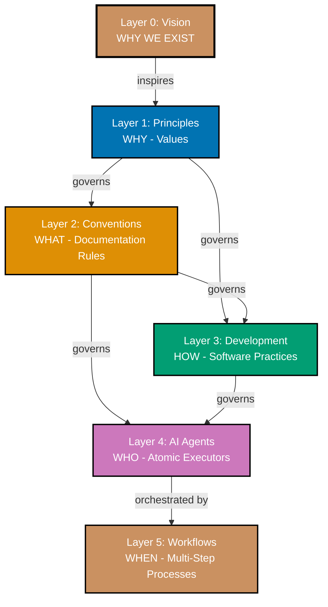
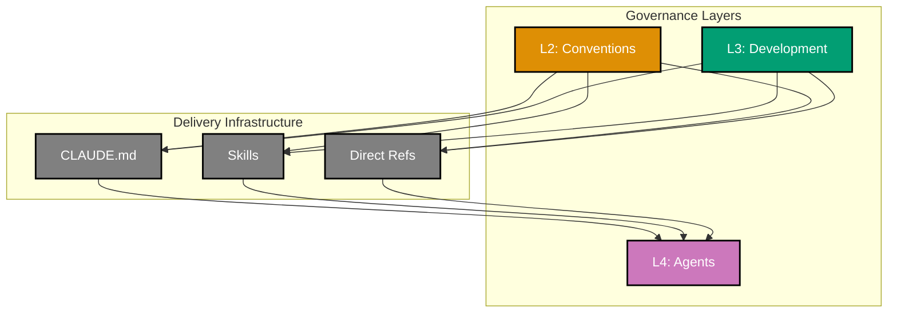
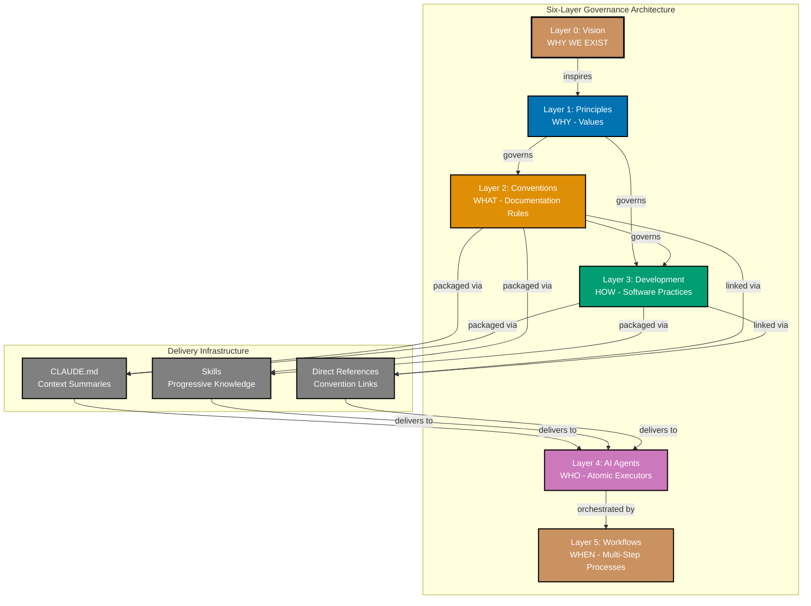
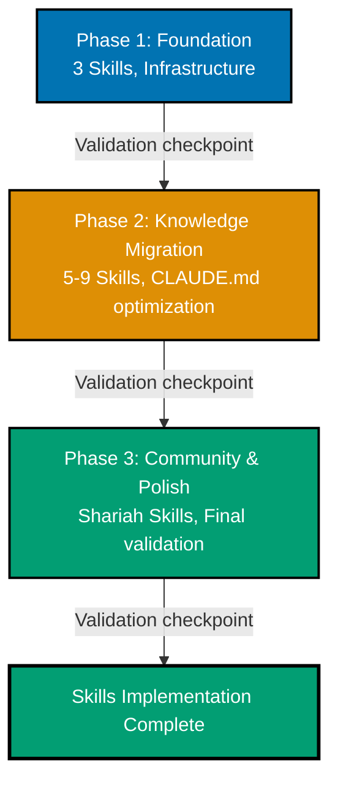

# Technical Documentation

## Architecture Overview

### Current Architecture (Six Layers - Unchanged)



**The six-layer governance hierarchy remains unchanged.** Skills are infrastructure that supports knowledge delivery, not a governance layer.

### Skills as Delivery Infrastructure



**Key insight**: Skills sit alongside CLAUDE.md and direct references as delivery mechanisms. All three transport knowledge from Conventions/Development to Agents. None of them are governance layers.

### Complete Architecture with Skills Infrastructure

This diagram shows the full six-layer governance architecture with Skills as delivery infrastructure. This is the diagram that will be added to `docs/explanation/ex__repository-governance-architecture.md`:



**Key points for this diagram:**

1. **Governance layers unchanged** - Six layers (L0-L5) remain exactly as they are
2. **Delivery infrastructure added** - New box showing three delivery mechanisms
3. **No governance arrows from Skills** - Skills don't govern anything
4. **Skills parallel to CLAUDE.md** - Both are delivery mechanisms, neither is a layer
5. **Gray color for infrastructure** - Distinguishes from governance layers

### Why Infrastructure, Not a Layer?

**Governance layers** have defining characteristics:

1. **Enforce rules** on the layer below
2. **Create obligations** and constraints
3. **Answer "what must be done"** at their level

**Testing the governance relationship:**

| Source                    | Target | Governance?                             | Evidence |
| ------------------------- | ------ | --------------------------------------- | -------- |
| Conventions → Development | Yes    | Conventions define HOW docs are written |
| Conventions → Agents      | Yes    | Agents MUST follow doc standards        |
| Development → Agents      | Yes    | Agents MUST follow coding patterns      |
| Skills → Agents           | **No** | Skills SERVE agents with knowledge      |

**Skills don't govern agents. Skills serve agents.**

**Infrastructure** has different characteristics:

1. **Transport or deliver** something
2. **No governance relationship** with consumers
3. **Multiple alternatives** can coexist

**Examples of infrastructure:**

- CLAUDE.md (delivers context summaries)
- Agent files (deliver prompts)
- Git hooks (deliver automation)
- Skills (deliver packaged knowledge)

### Skills Characteristics

**What Skills Are:**

- **Model-invoked knowledge packages** - Claude auto-loads based on description matching
- **Progressive disclosure implementation** - Name/description at startup, full content on-demand
- **Specialized knowledge encoding** - Conventions and practices packaged for efficient access
- **Composable building blocks** - Multiple Skills work together seamlessly
- **Portable standard** - agentskills.io format works across Claude ecosystem
- **Delivery infrastructure** - Transport mechanism like CLAUDE.md, not governance layer

**What Skills Are NOT:**

- **NOT a governance layer** - Skills don't enforce rules on agents
- **NOT replacing CLAUDE.md** - Skills complement existing delivery mechanisms
- **NOT mandatory** - Agents can use Skills, CLAUDE.md, or direct references
- **NOT conventions** - Conventions define rules; Skills deliver knowledge
- **NOT agents** - Agents execute tasks; Skills provide knowledge

**Distinction from Agents:**

| Aspect           | Skills               | Agents                 |
| ---------------- | -------------------- | ---------------------- |
| **Purpose**      | Deliver knowledge    | Execute tasks          |
| **Invocation**   | Model-invoked (auto) | User/Workflow-invoked  |
| **Output**       | Knowledge for Claude | Changed files, reports |
| **Relationship** | Serves agents        | Uses knowledge         |
| **Location**     | `.claude/skills/`    | `.claude/agents/`      |

## Technology Stack

### Core Technologies

**Claude Code Skills:**

- **Standard**: agentskills.io open specification
- **Format**: Markdown with YAML frontmatter
- **Storage**: `.claude/skills/` directory
- **Loading**: Automatic based on description matching

**Repository Stack (existing):**

- **Node.js**: 24.11.1 (Volta-managed)
- **Nx Monorepo**: Workspace organization
- **Git**: Version control with Trunk Based Development
- **Markdown**: Documentation format
- **YAML**: Frontmatter and configuration

### Skills File Structure

**Single-file Skill:**

```
.claude/skills/skill-name/
└── SKILL.md          # Frontmatter + content
```

**Multi-file Skill:**

```
.claude/skills/skill-name/
├── SKILL.md          # Frontmatter + overview
├── reference.md      # Detailed reference documentation
├── examples.md       # Code examples and usage patterns
└── scripts/          # Optional utility scripts
    └── helper.sh
```

**SKILL.md frontmatter:**

```yaml
---
name: skill-name
description: Clear description for auto-loading (CRITICAL)
allowed-tools: [Read, Grep] # Optional
model: sonnet # Optional
---
# Skill Content

Markdown instructions, examples, best practices...
```

## Design Decisions

### Decision 1: Skills as Infrastructure (Not a Layer)

**Context:**

The repository needs a way to package specialized knowledge for model consumption. Three architectural approaches were considered:

1. **Infrastructure** - Skills as delivery mechanism supporting existing layers (chosen)
2. **New Layer** - Insert Skills as Layer 4 between Development and Agents
3. **Layer subdivision** - Split Agents layer into Skills + Agents

**Decision:** Implement Skills as **delivery infrastructure**

**Rationale:**

**Why Infrastructure works:**

- **No governance relationship** - Skills serve agents, don't enforce rules
- **Parallel with existing patterns** - Like CLAUDE.md, agent files, git hooks
- **Simpler mental model** - Six layers unchanged, Skills are delivery mechanism
- **No layer renumbering** - Avoids renumbering L4→L5, L5→L6
- **Clear purpose** - Skills deliver knowledge from L2/L3 to L4
- **Coexistence** - Multiple delivery mechanisms (CLAUDE.md, Skills, direct refs) work together

**Why NOT a new Layer:**

- Skills don't GOVERN agents (governance layers enforce rules)
- Skills SERVE agents with knowledge (infrastructure relationship)
- Adding Layer 4 would imply Skills control agents (they don't)
- Layer renumbering adds complexity without governance benefit

**Why NOT Layer subdivision:**

- Skills and Agents have fundamentally different purposes
- Mixing them in same layer would be confusing
- Infrastructure is cleaner separation

**Consequences:**

- **Positive**: Six-layer architecture preserved (no renumbering)
- **Positive**: Simpler mental model (Skills = delivery like CLAUDE.md)
- **Positive**: Clear that Skills serve agents, not govern them
- **Positive**: Multiple delivery mechanisms naturally coexist
- **Negative**: Skills don't appear in architecture diagrams
- **Mitigation**: Document Skills in infrastructure section of architecture docs

### Decision 2: Description-Based Auto-Loading

**Context:**

Skills need a mechanism to automatically load when relevant to user tasks.

**Decision:** Use **description-based matching** (agentskills.io standard)

**Rationale:**

- **Standard compliance**: agentskills.io specifies description-based auto-loading
- **User simplicity**: Users describe tasks naturally; Claude handles Skill loading
- **Flexibility**: Description can encode multiple trigger patterns
- **Portability**: Works across Claude.ai, Code, and API

**Implementation:**

Skill descriptions must be:

- **Clear and specific** - Precisely describe when Skill applies
- **Action-oriented** - Include trigger verbs (e.g., "Use when creating diagrams...")
- **Comprehensive** - Cover all use cases for the Skill
- **Unique** - Avoid description overlap between Skills

**Example:**

```yaml
description: WCAG-compliant Mermaid diagrams using verified accessible color palette. Use when creating diagrams, flowcharts, or any color-dependent visualizations requiring accessibility compliance.
```

### Decision 3: Skills Reference Conventions (Not Replace)

**Context:**

Should Skills replace convention documents or reference them?

**Decision:** Skills **reference** conventions, **not replace** them

**Rationale:**

- **Documentation First principle**: Conventions in `docs/` are canonical documentation
- **Single source of truth**: Convention docs remain authoritative
- **Skills as encoding layer**: Skills package conventions for model consumption
- **Human-readable docs preserved**: Contributors read conventions, Claude reads Skills

**Implementation:**

- Skills include links to convention documents
- Skills summarize conventions but don't duplicate entire content
- Skills add model-specific guidance (e.g., Mermaid code examples)
- Conventions remain in `docs/`, Skills in `.claude/skills/`

### Decision 4: Multi-Phase Sequential Delivery

**Context:**

Skills implementation is moderate scope (8-12 Skills, infrastructure docs, agent updates). The repository uses Trunk Based Development.

**Decision:** **Multi-phase sequential delivery with direct commits to `main`**

**Phase Breakdown:**

1. **Phase 1: Foundation** (~3 Skills, infrastructure, ~8-12 commits)
2. **Phase 2: Knowledge Migration** (~5-9 Skills, agent updates, ~15-20 commits)
3. **Phase 3: Community & Polish** (Shariah Skills, final validation, ~8-10 commits)

**Rationale:**

- Aligns with Trunk Based Development convention
- Natural breakpoints for validation
- Small, frequent commits with validation gates

### Decision 5: Agent Skills Frontmatter (Optional Field)

**Context:**

How should agents reference Skills?

**Decision:** **Optional `skills:` frontmatter field**

**Rationale:**

- Consistent with existing frontmatter pattern
- Declarative and parseable
- Backward compatible (optional field)

**Implementation:**

```yaml
---
name: docs__maker
description: Expert documentation writer
tools: [Read, Write, Edit, Grep, Glob]
model: sonnet
color: blue
skills:
  - color-accessibility-diagrams
  - maker-checker-fixer-pattern
---
```

## Implementation Approach

### Phase 1: Foundation

**Goal**: Establish Skills infrastructure with first 3 core Skills

**Tasks:**

1. **Create `.claude/skills/` directory structure**
   - README.md explaining Skills purpose
   - Template files for future Skill creation

2. **Create first 3 Skills:**

   **Skill 1: `maker-checker-fixer-pattern`**
   - Three-stage content quality workflow
   - Reference: Link to Maker-Checker-Fixer Pattern Convention

   **Skill 2: `color-accessibility-diagrams`**
   - WCAG-compliant Mermaid diagrams
   - Reference: Link to Color Accessibility Convention

   **Skill 3: `repository-architecture`**
   - Six-layer governance hierarchy
   - Reference: Link to Repository Architecture

3. **Update AI Agents Convention**
   - Add optional `skills:` frontmatter field documentation

4. **Add Skills section to CLAUDE.md**
   - Brief description of Skills as delivery infrastructure
   - Link to Skills directory README

**Success Criteria:**

- [ ] `.claude/skills/` directory created with proper structure
- [ ] 3 Skills created with valid SKILL.md frontmatter and content
- [ ] Skills auto-load when relevant tasks mentioned
- [ ] AI Agents Convention documents `skills:` field
- [ ] CLAUDE.md updated with Skills section

### Phase 2: Knowledge Migration

**Goal**: Create remaining 5-9 Skills and optimize CLAUDE.md

**Tasks:**

1. **Create additional Skills:**
   - `hugo-ayokoding-development` - Hextra theme, bilingual, weight system
   - `by-example-tutorial-creation` - 75-90 annotated examples, annotation density
   - `factual-validation-methodology` - WebSearch/WebFetch verification
   - `trunk-based-development` - Main branch workflow
   - `gherkin-acceptance-criteria` - Given-When-Then format
   - (Optional) `hugo-ose-development` - PaperMod theme
   - (Optional) `criticality-confidence-system` - Checker/Fixer levels

2. **CLAUDE.md Optimization**

   **Pattern:**
   - Replace detailed content with 2-5 line summary
   - Add link to convention document
   - Add note: "Skill: `skill-name` auto-loads when [context]"

   **Target**: Maintain ≤30k characters

3. **Update 5-10 Example Agents**

   Add optional `skills:` frontmatter to demonstrate pattern

**Success Criteria:**

- [ ] 5-9 Skills created with valid structure
- [ ] CLAUDE.md character count ≤30,000
- [ ] 5-10 agents updated with optional Skills references
- [ ] All Skills auto-load when relevant

### Phase 3: Community & Polish

**Goal**: Create community-shareable Skills and finalize implementation

**Tasks:**

1. **Create Shariah-Compliance Skills** (for community sharing)
   - `halal-transaction-validation` (demonstration)
   - `zakat-calculation-guidance` (demonstration)

2. **agentskills.io Publishing Preparation**
   - Create publishing guide
   - Test cross-platform compatibility

3. **Final Validation**
   - Run `wow__rules-checker` on all Skills
   - Validate CLAUDE.md size
   - Test agent Skills references
   - Confirm backward compatibility

4. **Create Templates and Best Practices**
   - Skill creation template
   - Usage examples
   - Best practices guide

**Success Criteria:**

- [ ] 2 Shariah-compliance Skills created (or pattern demonstrated)
- [ ] Skills verified to work across Claude ecosystem
- [ ] Templates and examples available
- [ ] All validation passed
- [ ] Zero breaking changes

## Data Models

### Skill Frontmatter Schema

```yaml
name: string # Required - Skill identifier (matches folder name)
description: string # Required - Auto-load trigger description (CRITICAL)
allowed-tools: array<string> # Optional - Tool access restrictions
model: string # Optional - Model requirement (sonnet, opus)
```

### Agent Skills Reference Schema

```yaml
name: string
description: string
tools: array<string>
model: string
color: string
skills: array<string> # NEW - Optional Skills references
```

## Security Considerations

### Skills Tool Access Control

- Skills `allowed-tools` field restricts tool access (opt-in security)
- Skills with no `allowed-tools` get default read-only access

### Skills Content Validation

- `wow__rules-checker` validates Skills content against conventions
- Skills must reference authoritative convention documents

### Backward Compatibility

- Skills are additive (existing agents work without modification)
- `skills:` frontmatter field is optional
- Agent behavior unchanged if `skills:` field absent

## Testing Strategy

### Per-Skill Validation

1. Frontmatter validation (name, description, tools)
2. Content validation (markdown quality, links)
3. Auto-load testing (verify triggers correctly)

### Integration Testing

1. Skills reference validation
2. Composition testing (multiple Skills together)
3. Backward compatibility (agents without Skills work)

### System Testing

1. CLAUDE.md size verification (≤30k)
2. Agent execution with Skills
3. Cross-platform validation

## Deployment Strategy

### Trunk Based Development

All work happens on `main` branch with small, frequent commits.



### Rollback Strategy

- **Forward Fix** (preferred): New commit fixing issue
- **Revert Commit**: If breaking changes discovered
- **Hotfix**: For critical blocking issues

## Alternative Approaches (Not Chosen)

### Alternative A: Skills as Layer 4

**Structure:** Insert Skills as governance layer between Development and Agents

**Why NOT Chosen:**

- Skills don't GOVERN agents (governance test fails)
- Skills SERVE agents with knowledge (infrastructure relationship)
- Requires renumbering L4→L5, L5→L6 (unnecessary complexity)
- Implies Skills control agents (they don't)

### Alternative B: Layer Subdivision

**Structure:** Split Layer 4 into 4a (Skills) and 4b (Agents)

**Why NOT Chosen:**

- Skills and Agents have fundamentally different purposes
- Infrastructure is cleaner separation
- Subdivision adds confusion

### Alternative C: Skills Replace Convention Docs

**Structure:** Migrate conventions directly into Skills

**Why NOT Chosen:**

- Violates Documentation First principle
- Loses human-readable documentation
- Skills format not ideal for all documentation

### Alternative D: No Skills, Expand CLAUDE.md

**Structure:** Increase CLAUDE.md size limit

**Why NOT Chosen:**

- Hard 40k character limit exists
- Performance degradation with large files
- No progressive disclosure

## Documentation Updates Required

This section lists all documentation that must be updated as part of Skills implementation.

### New Files to Create

| File                                                 | Description                                                                | Phase   |
| ---------------------------------------------------- | -------------------------------------------------------------------------- | ------- |
| `.claude/skills/README.md`                           | Skills directory documentation, explains Skills as delivery infrastructure | Phase 1 |
| `.claude/skills/TEMPLATE.md`                         | Single-file Skill creation template                                        | Phase 1 |
| `.claude/skills/MULTI-FILE-TEMPLATE/`                | Multi-file Skill creation template directory                               | Phase 3 |
| `docs/how-to/hoto__create-new-skill.md`              | How-to guide for creating new Skills                                       | Phase 3 |
| `docs/how-to/hoto__publish-skills-to-agentskills.md` | How-to guide for publishing to agentskills.io                              | Phase 3 |

### Files to Update

| File                                                         | Update Description                                                                                                      | Phase            |
| ------------------------------------------------------------ | ----------------------------------------------------------------------------------------------------------------------- | ---------------- |
| `docs/explanation/ex__repository-governance-architecture.md` | Add "Delivery Infrastructure" section with Skills alongside CLAUDE.md, add complete architecture diagram showing Skills | Phase 2          |
| `docs/explanation/development/agents/ex-de-ag__ai-agents.md` | Add optional `skills:` frontmatter field documentation, explain when to use Skills references                           | Phase 1, Phase 2 |
| `CLAUDE.md`                                                  | Add Skills Infrastructure section, add Skills references to verbose sections                                            | Phase 2          |
| `.claude/agents/README.md`                                   | Add mention of Skills as complementary to agents                                                                        | Phase 2          |

### Proposed Changes to Repository Architecture Document

**File**: `docs/explanation/ex__repository-governance-architecture.md`

**Add new section** after "📊 The Six Layers" section:

```markdown
## 🔧 Delivery Infrastructure

In addition to the six governance layers, the repository uses **delivery infrastructure** to transport knowledge from Layers 2-3 to Layer 4 (Agents). These are NOT governance layers - they don't enforce rules, they deliver knowledge.

### Three Delivery Mechanisms

| Mechanism             | Purpose                        | When to Use                               |
| --------------------- | ------------------------------ | ----------------------------------------- |
| **CLAUDE.md**         | Context summaries, navigation  | Always loaded at startup                  |
| **Skills**            | Progressive knowledge packages | Auto-loaded when task matches description |
| **Direct References** | Links to convention docs       | When agent needs specific convention      |

### Skills as Infrastructure

**Skills** are model-invoked markdown knowledge packages that:

- Auto-load based on description matching
- Enable progressive disclosure (name/description first, full content on-demand)
- Complement CLAUDE.md and direct references
- Are stored in `.claude/skills/` directory

**Skills are NOT a layer** because they don't govern agents - they serve agents with knowledge. The governance relationship test:

- Conventions → Agents: Yes (agents MUST follow conventions)
- Development → Agents: Yes (agents MUST follow practices)
- Skills → Agents: No (Skills SERVE agents with knowledge)

See [Skills README](./.claude/skills/README.md) for creating and using Skills.
```

**Update the main diagram** to include Delivery Infrastructure box (as shown in "Complete Architecture with Skills Infrastructure" section above).

### Agent Files to Update with Skills References

These agents will be updated with optional `skills:` frontmatter in Phase 2:

| Agent                                   | Skills References                                              |
| --------------------------------------- | -------------------------------------------------------------- |
| `docs__maker`                           | `color-accessibility-diagrams`, `maker-checker-fixer-pattern`  |
| `docs__checker`                         | `maker-checker-fixer-pattern`, `criticality-confidence-system` |
| `apps__ayokoding-web__general-maker`    | `hugo-ayokoding-development`, `color-accessibility-diagrams`   |
| `apps__ayokoding-web__by-example-maker` | `by-example-tutorial-creation`, `hugo-ayokoding-development`   |
| `plan__maker`                           | `gherkin-acceptance-criteria`, `trunk-based-development`       |

---

**Note**: This technical documentation defines architecture, design decisions, and implementation approach for Skills Infrastructure. See [requirements.md](./requirements.md) for objectives and [delivery.md](./delivery.md) for implementation phases.
