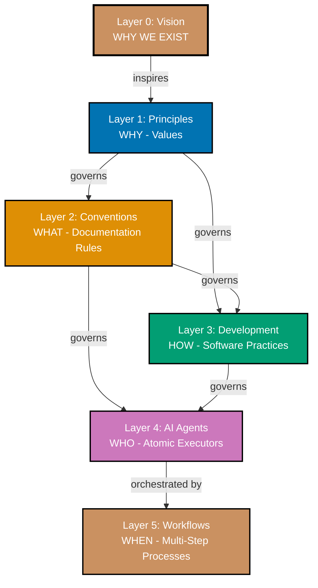
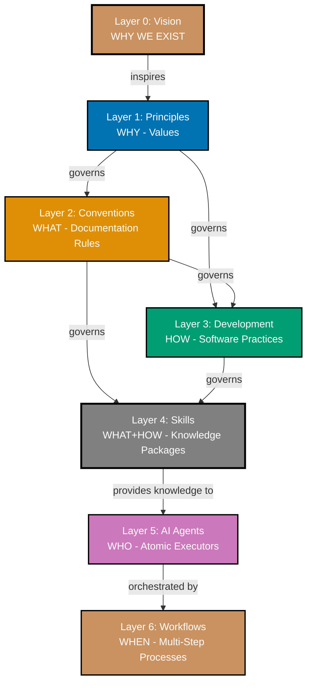
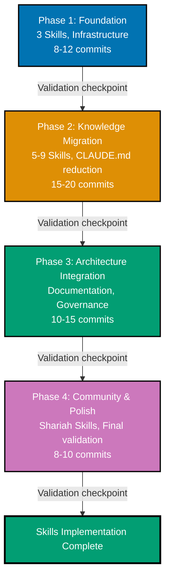

# Technical Documentation

## Architecture Overview

### Current Architecture (Six Layers)



### Proposed Architecture (Seven Layers with Layer 4 Skills)



### Layer 4: Skills Characteristics

**What Skills Are:**

- **Model-invoked knowledge packages** - Claude automatically loads based on description matching
- **Progressive disclosure implementation** - Name/description at startup, full content on-demand
- **Specialized knowledge encoding** - Conventions and practices packaged for efficient access
- **Composable building blocks** - Multiple Skills work together seamlessly
- **Portable standard** - agentskills.io format works across Claude ecosystem

**What Skills Are NOT:**

- **NOT Agents** - Skills provide knowledge; Agents execute tasks (Layer 5)
- **NOT Conventions** - Conventions govern documentation; Skills encode for model consumption (Layer 2 governs Skills)
- **NOT Development Practices** - Practices define how to develop; Skills package that knowledge (Layer 3 governs Skills)
- **NOT Workflows** - Workflows orchestrate agents; Skills provide knowledge to agents (Layer 6 uses agents, not Skills)

**Governance Model:**

- **Governed by Layer 2 (Conventions)** - Skills must follow documentation standards
- **Governed by Layer 3 (Development)** - Skills encode development practices
- **Governs nothing** - Skills are consumed by Layer 5 (Agents), not governance layer
- **Traceability required** - Each Skill must reference Conventions/Practices it implements

**Distinction from Layer 5 (Agents):**

| Aspect              | Layer 4: Skills                    | Layer 5: Agents                      |
| ------------------- | ---------------------------------- | ------------------------------------ |
| **Invocation**      | Model-invoked (auto-load)          | User/Workflow-invoked (explicit)     |
| **Purpose**         | Provide knowledge                  | Execute tasks                        |
| **Output**          | Knowledge for Claude               | Changed files, reports               |
| **Tool Access**     | Optional restrictions              | Explicit tool permissions            |
| **Composition**     | Multiple Skills load automatically | Workflows orchestrate agents         |
| **File Structure**  | `.claude/skills/skill-name/`       | `.claude/agents/agent-name.md`       |
| **User Visibility** | Transparent (auto-loads)           | Visible (user invokes)               |
| **Lifecycle**       | Created, referenced, rarely update | Created, frequently updated/executed |

## Technology Stack

### Core Technologies

**Claude Code Skills:**

- **Standard**: agentskills.io open specification
- **Format**: Markdown with YAML frontmatter
- **Storage**: `.claude/skills/` directory
- **Loading**: Automatic based on description matching

**Repository Stack (existing):**

- **Node.js**: 24.11.1 (Volta-managed)
- **Nx Monorepo**: Workspace organization
- **Git**: Version control with Trunk Based Development
- **Markdown**: Documentation format
- **YAML**: Frontmatter and configuration

**Documentation Tools (existing):**

- **Mermaid**: Diagrams in markdown
- **Diátaxis**: Documentation framework
- **WCAG 2.2**: Accessibility compliance

### Skills File Structure

**Single-file Skill:**

```
.claude/skills/skill-name/
└── SKILL.md          # Frontmatter + content
```

**Multi-file Skill:**

```
.claude/skills/skill-name/
├── SKILL.md          # Frontmatter + overview
├── reference.md      # Detailed reference documentation
├── examples.md       # Code examples and usage patterns
└── scripts/          # Optional utility scripts
    └── helper.sh
```

**SKILL.md frontmatter:**

```yaml
---
name: skill-name
description: Clear description for auto-loading (CRITICAL)
allowed-tools: [Read, Grep] # Optional
model: sonnet # Optional
---
# Skill Content

Markdown instructions, examples, best practices...
```

## Design Decisions

### Decision 1: Skills as Layer 4 (Primary Approach)

**Context:**

The repository needs a way to package specialized knowledge for model consumption without creating more agents. Three architectural approaches were considered:

1. **Layer 4** - Skills as distinct layer between Development and Agents (renumbering existing layers)
2. **Layer 5 subdivision** - Split Agents into 5a (Skills) and 5b (Agents)
3. **Infrastructure** - Skills as tools supporting layers 2-5 (not a layer)

**Decision:** Implement Skills as **Layer 4** (renumbering Agents to Layer 5, Workflows to Layer 6)

**Rationale:**

**Why Layer 4 works:**

- **Clear governance**: Skills are governed by Conventions (Layer 2) and Development (Layer 3)
- **Distinct purpose**: Skills provide knowledge (not governance like L2/L3, not execution like L5)
- **Natural position**: Between "how to develop" (L3) and "who executes" (L5)
- **Clean separation**: Skills = knowledge packages, Agents = task executors
- **Traceability**: Skills reference Conventions/Practices, Agents reference Skills
- **Professional numbering**: Whole numbers align with industry standards (OSI model, TCP/IP layers)

**Why not Layer 5 subdivision:**

- Skills and Agents have fundamentally different invocation models (model-invoked vs. user-invoked)
- Mixing them in same layer would blur governance boundaries
- Skills don't execute tasks; Agents do - different responsibilities

**Why not Infrastructure:**

- Skills encode governance (Conventions + Practices) - too important to be mere infrastructure
- Skills have governance relationship (governed by L2+L3, provide to L5) - infrastructure doesn't
- Skills create new traceability paths - more than just tooling

#### Why Layer 4 (Not Layer 3.5)?

**Decision:** Use whole-number Layer 4 instead of fractional Layer 3.5.

**Rationale:**

1. **Professional Standards** - Industry architectural models (OSI, TCP/IP) use whole numbers, not fractions
2. **Clearer Mental Model** - "Layer 4 Skills" is simpler and more intuitive than "Layer 3.5 Skills"
3. **Future-Proof** - Avoids fractional progression (3.5, 3.75, 4.25, etc.) if further layers needed
4. **Explicit Over Implicit** - Proper whole-number numbering aligns with repository's Explicit Over Implicit principle
5. **Long-Term Clarity** - 10 years from now, "Layer 4" remains immediately understandable

**Alternative Considered:** Layer 3.5 to avoid renumbering existing Agents (Layer 4→5) and Workflows (Layer 5→6).

**Trade-off:** Requires renumbering Layer 4→5 and Layer 5→6, but provides superior long-term clarity and professionalism. The one-time renumbering cost is far outweighed by decades of cleaner communication.

**Consequences:**

- **Positive**: Clear architectural position, clean governance, natural traceability
- **Positive**: Professional whole-number layer system
- **Positive**: Future-proof for Skills expansion and evolution
- **Positive**: Easy to explain Skills role to new contributors
- **Positive**: Aligns with Explicit Over Implicit principle
- **Negative**: Requires renumbering existing layers 4→5, 5→6
- **Mitigation**: One-time systematic update across all documentation provides long-term benefits

**Alternatives Considered:**

See [Alternative Approaches](#alternative-approaches) section for complete analysis.

### Decision 2: Description-Based Auto-Loading

**Context:**

Skills need a mechanism to automatically load when relevant to user tasks. Two approaches:

1. **Description matching** - Claude matches task to Skill description
2. **Explicit tags** - Skills have tags, tasks specify tags needed

**Decision:** Use **description-based matching** (agentskills.io standard)

**Rationale:**

- **Standard compliance**: agentskills.io specifies description-based auto-loading
- **User simplicity**: Users describe tasks naturally; Claude handles Skill loading
- **Flexibility**: Description can encode multiple trigger patterns
- **Portability**: Works across Claude.ai, Code, and API

**Implementation:**

Skill descriptions must be:

- **Clear and specific** - Precisely describe when Skill applies
- **Action-oriented** - Include trigger verbs (e.g., "Use when creating diagrams...")
- **Comprehensive** - Cover all use cases for the Skill
- **Unique** - Avoid description overlap between Skills

**Example:**

```yaml
description: WCAG-compliant Mermaid diagrams using verified accessible color palette. Use when creating diagrams, flowcharts, or any color-dependent visualizations requiring accessibility compliance.
```

**Consequences:**

- **Positive**: Natural user experience, no manual Skill invocation
- **Positive**: Claude handles complexity of matching task to Skill
- **Negative**: Description quality critical - poor descriptions = missed auto-loads
- **Mitigation**: Provide description writing guidelines and examples

### Decision 3: Skills Reference Conventions (Not Replace)

**Context:**

Should Skills replace convention documents or reference them?

**Decision:** Skills **reference** conventions, **not replace** them

**Rationale:**

- **Documentation First principle**: Conventions in `docs/` are canonical documentation
- **Single source of truth**: Convention docs remain authoritative
- **Skills as encoding layer**: Skills package conventions for model consumption
- **Human-readable docs preserved**: Contributors read conventions, Claude reads Skills
- **Version control benefits**: Convention updates automatically benefit Skills

**Implementation:**

- Skills include links to convention documents
- Skills summarize conventions but don't duplicate entire content
- Skills add model-specific guidance (e.g., Mermaid code examples)
- Conventions remain in `docs/`, Skills in `.claude/skills/`

**Example:**

**Convention document** (`docs/explanation/conventions/formatting/ex-co-fo__color-accessibility.md`):

- Complete WCAG requirements
- Color palette with hex codes
- Contrast ratios and testing methodology
- Research sources and citations

**Skill** (`.claude/skills/color-accessibility-diagrams/SKILL.md`):

- Quick reference of color palette
- Mermaid-specific implementation examples
- Common mistakes and fixes
- Link to full convention document

**Consequences:**

- **Positive**: Single source of truth maintained
- **Positive**: Skills can be updated independently without convention changes
- **Positive**: Human-readable documentation preserved for contributors
- **Negative**: Skills and conventions must stay synchronized
- **Mitigation**: `wow__rules-checker` validates Skills reference current conventions

### Decision 4: Multi-Phase Sequential Delivery (Direct Commits to Main)

**Context:**

Skills implementation is large scope (8-12 Skills, architecture updates, 45+ agent changes). The repository uses Trunk Based Development where all work happens on `main` branch with small, frequent commits.

**Decision:** **Multi-phase sequential delivery with direct commits to `main`**

**Rationale:**

- **Aligns with Trunk Based Development**: Repository convention mandates work on `main` branch
- **Risk management**: Phased rollout with validation checkpoints between phases
- **Natural breakpoints**: Foundation → Migration → Architecture → Community
- **Small, frequent commits**: Each logical change committed independently to `main`
- **Backward compatibility**: Each commit maintains compatibility, enabling easy revert
- **Continuous validation**: Run validators after each significant commit
- **No overhead**: Eliminates PR creation, review delays, merge conflicts

**Phase Breakdown:**

1. **Phase 1: Foundation** (~3 Skills, basic structure, ~8-12 commits)
2. **Phase 2: Knowledge Migration** (~5-9 Skills, CLAUDE.md reduction, ~15-20 commits)
3. **Phase 3: Architecture Integration** (documentation, governance, ~10-15 commits)
4. **Phase 4: Community & Polish** (Shariah Skills, final validation, ~8-10 commits)

**Validation Checkpoints:**

Between phases, validate completion before proceeding:

- Phase 1 → Phase 2: Skills infrastructure functional, 3 Skills auto-load
- Phase 2 → Phase 3: CLAUDE.md ≤30k, all Skills working, agents updated
- Phase 3 → Phase 4: Architecture docs complete, governance model established
- Phase 4 → Complete: Community Skills published, all metrics met

**Commit Pattern Example (Phase 1):**

```bash
# Small, atomic commits directly to main
git commit -m "feat(skills): create .claude/skills directory structure"
git push origin main

git commit -m "feat(skills): add maker-checker-fixer-pattern Skill"
git push origin main

git commit -m "test(skills): validate maker-checker-fixer auto-loads"
git push origin main

git commit -m "feat(skills): add color-accessibility-diagrams Skill"
git push origin main

# [Validation checkpoint before Phase 2]
```

**Why not Pull Requests:**

- Repository uses Trunk Based Development (main branch only)
- Small commits to `main` enable faster iteration
- Continuous integration runs on every commit (same validation)
- No PR approval delays or merge conflicts

**Why not single large commit:**

- Too large to review or revert effectively
- All-or-nothing risk (can't validate incrementally)
- Violates Trunk Based Development principle of small commits

**Consequences:**

- **Positive**: Aligns with repository Trunk Based Development convention
- **Positive**: Faster implementation (no approval delays)
- **Positive**: Small commits easy to understand and revert
- **Positive**: Continuous validation throughout implementation
- **Negative**: Requires discipline to commit only tested, working code
- **Negative**: Validation checkpoints require manual review before next phase
- **Mitigation**: Run validators after each significant commit, formal checkpoint review between phases

### Decision 5: Agent Skills Frontmatter (Optional Field)

**Context:**

How should agents reference Skills? Options:

1. **Frontmatter `skills:` field** (chosen)
2. **Inline documentation in agent body**
3. **Separate configuration file**

**Decision:** **Optional `skills:` frontmatter field**

**Rationale:**

- **Consistency**: Frontmatter already used for `name`, `description`, `tools`, `model`, `color`
- **Declarative**: Skills references declared upfront, easy to parse
- **Optional**: Agents not using Skills don't need the field (backward compatible)
- **Composable**: List multiple Skills per agent
- **Parseable**: Tooling can analyze agent-skill relationships

**Implementation:**

```yaml
---
name: docs__maker
description: Expert documentation writer
tools: [Read, Write, Edit, Grep, Glob]
model: sonnet
color: blue
skills:
  - color-accessibility-diagrams
  - maker-checker-fixer-pattern
  - repository-architecture
---
```

**Validation:**

- `wow__rules-checker` validates `skills:` field references valid Skills
- Skills listed must exist in `.claude/skills/`
- Skills field is YAML list (array)

**Consequences:**

- **Positive**: Clear, declarative Skills references
- **Positive**: Easy to analyze agent knowledge dependencies
- **Positive**: Backward compatible (optional field)
- **Negative**: Frontmatter becomes longer for agents referencing many Skills
- **Mitigation**: Limit agent Skills references to 3-5 most critical

## Implementation Approach

### Phase 1: Foundation

**Goal**: Establish Skills infrastructure with first 3 core Skills

**Tasks:**

1. **Create `.claude/skills/` directory structure**
   - Location: `.claude/skills/` at repository root
   - README.md explaining Skills purpose and organization
   - Template files for future Skill creation

2. **Create first 3 Skills:**

   **Skill 1: `maker-checker-fixer-pattern`**
   - Name: `maker-checker-fixer-pattern`
   - Description: Three-stage content quality workflow (Maker creates, Checker validates, Fixer remediates). Use when creating content, validating quality, or applying fixes in docs, Hugo content, READMEs, or plans.
   - Content: Workflow overview, stage responsibilities, tool patterns, when to use each stage
   - Reference: Link to [Maker-Checker-Fixer Pattern Convention](../../../docs/explanation/development/pattern/ex-de-pa__maker-checker-fixer.md)

   **Skill 2: `color-accessibility-diagrams`**
   - Name: `color-accessibility-diagrams`
   - Description: WCAG-compliant Mermaid diagrams using verified accessible color palette. Use when creating diagrams, flowcharts, or any color-dependent visualizations requiring accessibility compliance.
   - Content: Accessible color palette (hex codes), Mermaid implementation examples, common mistakes
   - Reference: Link to [Color Accessibility Convention](../../../docs/explanation/conventions/formatting/ex-co-fo__color-accessibility.md)

   **Skill 3: `repository-architecture`**
   - Name: `repository-architecture`
   - Description: Seven-layer repository governance hierarchy from Vision (Layer 0) to Workflows (Layer 6). Use when understanding repository structure, making architectural decisions, or explaining traceability between layers.
   - Content: Layer overview, governance relationships, traceability examples
   - Reference: Link to [Repository Architecture](../../../docs/explanation/ex__repository-governance-architecture.md)

3. **Update AI Agents Convention**
   - Add `skills:` frontmatter field documentation
   - Explain when to reference Skills vs. inline knowledge
   - Provide examples of Skills references

4. **Validation:**
   - Test Skills auto-load in Claude Code
   - Verify Skills descriptions trigger correctly
   - Confirm Skills content accessible on-demand

**Deliverables:**

- `.claude/skills/` directory with 3 Skills
- Updated AI Agents Convention
- Foundation README documenting Skills approach

**Success Criteria:**

- [ ] `.claude/skills/` directory created with proper structure
- [ ] 3 Skills created with valid SKILL.md frontmatter and content
- [ ] Skills auto-load when relevant tasks mentioned
- [ ] AI Agents Convention documents `skills:` field
- [ ] Foundation README explains Skills purpose and usage

### Phase 2: Knowledge Migration

**Goal**: Create remaining 5-9 Skills and reduce CLAUDE.md size to ≤30k characters

**Tasks:**

1. **Create additional Skills:**

   **Skill 4: `hugo-ayokoding-development`**
   - Hextra theme, bilingual (English/Indonesian), weight system, by-example tutorials
   - Content: Frontmatter structure, navigation conventions, bilingual mirroring, absolute paths
   - Multi-file: SKILL.md (overview) + reference.md (detailed conventions) + examples.md (frontmatter examples)

   **Skill 5: `by-example-tutorial-creation`**
   - 75-90 annotated examples, 1-2.25 comment lines per code line PER EXAMPLE, five-part format
   - Content: Annotation density calculation, code block structure, multiple blocks for comparisons
   - Multi-file: SKILL.md + examples.md (annotated code examples)

   **Skill 6: `factual-validation-methodology`**
   - WebSearch/WebFetch verification with confidence classification
   - Content: Validation workflow, confidence levels, source prioritization
   - Reference: Link to [Factual Validation Convention](../../../docs/explanation/conventions/content/ex-co-co__factual-validation.md)

   **Skill 7: `trunk-based-development`**
   - Main branch workflow, no long-lived branches, feature flags
   - Content: Commit patterns, when to use branches, environment branches explanation
   - Reference: Link to [Trunk Based Development Convention](../../../docs/explanation/development/workflow/ex-de-wo__trunk-based-development.md)

   **Skill 8: `gherkin-acceptance-criteria`**
   - Writing testable acceptance criteria using Gherkin format
   - Content: Given-When-Then syntax, examples, best practices
   - Reference: Link to [Acceptance Criteria Convention](../../../docs/explanation/development/infra/ex-de-in__acceptance-criteria.md)

   **Skill 9 (optional): `hugo-ose-development`**
   - PaperMod theme, English-only, landing page conventions
   - Content: Frontmatter, cover images, platform content structure

   **Skill 10 (optional): `criticality-confidence-system`**
   - Checker criticality levels + Fixer confidence assessment
   - Content: CRITICAL/HIGH/MEDIUM/LOW categorization, confidence levels, priority matrix
   - Reference: Links to [Criticality Levels](../../../docs/explanation/development/quality/ex-de-qu__criticality-levels.md) and [Fixer Confidence Levels](../../../docs/explanation/development/quality/ex-de-qu__fixer-confidence-levels.md)

2. **CLAUDE.md Migration**

   **Identify migration candidates** (sections >500 characters duplicating convention docs):
   - Diagram Convention section
   - Hugo Content Convention sections
   - Maker-Checker-Fixer Pattern section
   - Tutorial Standards section
   - Acceptance Criteria section

   **Migration pattern:**
   - Replace detailed content with 2-5 line summary
   - Add link to full convention document
   - Add note: "Skill available: `skill-name` auto-loads when [context]"

   **Example:**

   Before:

   ```markdown
   ## Maker-Checker-Fixer Pattern

   Seven agent families follow a three-stage workflow for content quality: Maker (create/update) → Checker (validate, generate audit) → User review → Fixer (apply validated fixes with confidence levels). Families: repo-rules, ayokoding-web, docs-tutorial, ose-platform-web-content, readme, docs, plan. Checkers categorize findings by criticality (CRITICAL/HIGH/MEDIUM/LOW) indicating importance/urgency. Fixers combine criticality with confidence (HIGH/MEDIUM/FALSE_POSITIVE) to determine priority (P0-P4) and execution order. [500+ more characters...]
   ```

   After:

   ```markdown
   ## Maker-Checker-Fixer Pattern

   Three-stage content quality workflow: Maker creates/updates, Checker validates with criticality levels, Fixer applies validated fixes based on confidence. Used across 7 agent families. See [Maker-Checker-Fixer Pattern](./docs/explanation/development/pattern/ex-de-pa__maker-checker-fixer.md) for complete workflow. Skill: `maker-checker-fixer-pattern` auto-loads for content quality tasks.
   ```

   **Target**: Maintain ≤30k characters (currently ~29k, progressive disclosure prevents future growth)

3. **Update 5-10 Example Agents**

   Add `skills:` frontmatter to demonstrate Skills references:
   - `docs__maker` → `color-accessibility-diagrams`, `maker-checker-fixer-pattern`
   - `docs__checker` → `maker-checker-fixer-pattern`, `criticality-confidence-system`
   - `ayokoding-web-general-maker` → `hugo-ayokoding-development`, `color-accessibility-diagrams`
   - `ayokoding-web-by-example-maker` → `by-example-tutorial-creation`, `hugo-ayokoding-development`
   - `plan__maker` → `gherkin-acceptance-criteria`, `trunk-based-development`

4. **Validation:**
   - Verify CLAUDE.md character count ≤30,000
   - Test all Skills auto-load correctly
   - Confirm agent Skills references work
   - Validate no information loss in migration

**Deliverables:**

- 5-9 additional Skills (total 8-12 Skills)
- CLAUDE.md reduced to ≤30k characters
- 5-10 agents updated with Skills references
- Migration validation report

**Success Criteria:**

- [ ] 5-9 Skills created with valid structure
- [ ] CLAUDE.md character count remains ≤30,000 (baseline ~29k)
- [ ] All migrated knowledge accessible via Skills
- [ ] 5-10 agents successfully reference Skills
- [ ] No backward compatibility breakage
- [ ] All Skills auto-load when relevant

### Phase 3: Architecture Integration

**Goal**: Document Layer 4 in architecture and establish governance model

**Tasks:**

1. **Update Repository Architecture Document**

   File: `docs/explanation/ex__repository-governance-architecture.md`

   **Add Layer 4 section:**
   - Define Skills layer between Layer 3 and Layer 5
   - Explain model-invoked vs. user-invoked distinction
   - Document governance: Skills governed by L2+L3, provide knowledge to L5
   - Provide traceability examples

   **Update diagram:**
   - Add Layer 4 (Skills) node
   - Renumber Layer 4→5 (Agents), Layer 5→6 (Workflows)
   - Show governance arrows: L2→L4, L3→L4, L4→L5
   - Use gray color for Skills layer (distinct from other layers)

   **Add traceability example:**

   ```
   Principle: Accessibility First (L1)
       ↓ governs
   Convention: Color Accessibility Convention (L2)
       ↓ governs
   Skill: color-accessibility-diagrams (L4)
       ↓ provides knowledge to
   Agent: docs__maker (L5)
   ```

2. **Create Skills Convention Document**

   File: `docs/explanation/development/skills/ex-de-sk__skills.md`

   **Content:**
   - What Skills are and when to create them
   - SKILL.md format and frontmatter requirements
   - Multi-file Skills structure (reference.md, examples.md, scripts/)
   - Skills vs. convention documents decision criteria
   - Governance and traceability requirements
   - Skills naming and organization conventions
   - Examples and templates

   **Principles Implemented:**
   - Progressive Disclosure
   - Automation Over Manual
   - Documentation First
   - Explicit Over Implicit

   **Conventions Implemented:**
   - Content Quality Principles
   - Linking Convention
   - File Naming Convention (no prefixes in Skills folders)

3. **Update CLAUDE.md**

   **Add Layer 4 to architecture summary:**

   ```markdown
   ## Repository Architecture: Seven-Layer Hierarchy

   The repository follows a seven-layer architecture where each layer builds on the foundation of the layer above. Each layer governs the layer below, creating complete traceability from foundational purpose (Layer 0: Vision) through values (Layer 1: Principles) to concrete standards (Layers 2-3), specialized knowledge (Layer 4: Skills), automated enforcement (Layer 5: Agents), and orchestrated processes (Layer 6: Workflows).

   **Layer 4: Skills** - WHAT+HOW specialized knowledge packages (governs nothing, governed by L2+L3, provides knowledge to L5)
   ```

   **Add Skills section:**

   ```markdown
   ## Claude Code Skills

   Skills are model-invoked knowledge packages that auto-load when relevant to user tasks. Skills encode conventions and development practices for efficient model consumption. Located in `.claude/skills/` directory. See [Skills Convention](./docs/explanation/development/skills/ex-de-sk__skills.md) for complete details.
   ```

4. **Update AI Agents Convention**

   File: `docs/explanation/development/agents/ex-de-ag__ai-agents.md`

   **Add Skills references section:**
   - Document `skills:` frontmatter field
   - Explain when agents should reference Skills vs. inline knowledge
   - Provide examples of Skills composition
   - Document validation rules for Skills references

5. **Update Conventions Index**

   File: `docs/explanation/conventions/README.md`

   **Add Skills Convention:**

   ```markdown
   ## Development Infrastructure

   - [Skills Convention](../development/skills/ex-de-sk__skills.md) - Creating and organizing Claude Code Skills for progressive knowledge disclosure
   ```

6. **Validation:**
   - Verify architecture documentation complete and accurate
   - Test Skills Convention examples
   - Confirm CLAUDE.md updated correctly
   - Validate traceability examples

**Deliverables:**

- Updated Repository Architecture document with Layer 4
- New Skills Convention document
- Updated CLAUDE.md with Skills section
- Updated AI Agents Convention with Skills references
- Updated Conventions Index

**Success Criteria:**

- [ ] Repository Architecture clearly explains Layer 4 role
- [ ] Governance relationships documented (L2+L3→L4→L5)
- [ ] Skills Convention provides complete creation guidance
- [ ] CLAUDE.md includes Skills in architecture summary
- [ ] AI Agents Convention documents Skills frontmatter
- [ ] Traceability examples demonstrate Skills integration

### Phase 4: Community & Polish

**Goal**: Create community-shareable Shariah-compliance Skills and finalize implementation

**Tasks:**

1. **Create Shariah-Compliance Skills** (for community sharing)

   **Skill 11: `halal-transaction-validation`** (future/example)
   - Islamic finance transaction rules
   - Content: Riba prohibition, Gharar avoidance, asset-backed requirements
   - Multi-file: SKILL.md + reference.md (detailed rulings) + examples.md (transaction patterns)
   - Note: Requires Islamic finance expertise - create as demonstration or defer to subject matter experts

   **Skill 12: `zakat-calculation-guidance`** (future/example)
   - Zakat computation for enterprise assets
   - Content: Nisab thresholds, asset categories, calculation methodology
   - Multi-file: SKILL.md + reference.md (detailed fiqh) + examples.md (calculation examples)
   - Note: Requires Islamic finance expertise - create as demonstration or defer to subject matter experts

2. **agentskills.io Publishing Preparation**

   **Documentation:**
   - Create guide: "Publishing Skills to agentskills.io"
   - Document Skill export process
   - Explain platform compatibility verification
   - Provide community contribution guidelines

   **Validation:**
   - Test Shariah-compliance Skills in Claude.ai (web)
   - Test Skills in Claude Code
   - Test Skills via API (if accessible)
   - Verify cross-platform compatibility

   **Licensing:**
   - Confirm MIT license applies to Skills
   - Add LICENSE file to `.claude/skills/` directory
   - Document attribution requirements for community use

3. **Final Validation**

   **Run `wow__rules-checker`:**
   - Validate all Skills reference valid conventions
   - Check Skills descriptions are clear and unique
   - Verify Skills frontmatter structure
   - Confirm no duplication between Skills and conventions

   **CLAUDE.md validation:**
   - Verify character count ≤30,000
   - Confirm all migrated content accessible via Skills
   - Test navigation links
   - Validate architecture summary accuracy

   **Agent validation:**
   - Test agents with Skills references work correctly
   - Confirm backward compatibility (agents without Skills still work)
   - Validate Skills auto-load when agents invoked
   - Test Skills composition (multiple Skills loaded together)

   **Documentation validation:**
   - Review Skills Convention for completeness
   - Verify Repository Architecture accuracy
   - Check all traceability examples
   - Confirm cross-references valid

4. **Create Examples and Templates**

   **Skill creation template:**
   - SKILL.md template with frontmatter
   - Multi-file Skill template (reference.md, examples.md)
   - README template for Skills folders

   **Usage examples:**
   - Example 1: Agent referencing single Skill
   - Example 2: Agent referencing multiple Skills (composition)
   - Example 3: Skill referencing another Skill
   - Example 4: Multi-file Skill with scripts

   **Best practices guide:**
   - When to create Skill vs. convention document
   - How to write effective Skill descriptions
   - Skills naming conventions
   - Skills organization patterns

5. **Final Polish**

   **Code cleanup:**
   - Remove any temporary files or test Skills
   - Ensure consistent formatting across all Skills
   - Validate all Skills follow Content Quality Principles

   **Documentation cleanup:**
   - Fix any broken links
   - Ensure all cross-references accurate
   - Validate diagrams render correctly
   - Check for typos or formatting issues

**Deliverables:**

- 2 Shariah-compliance Skills (or examples demonstrating pattern)
- agentskills.io publishing guide
- Skill creation templates and examples
- Final validation report
- Best practices guide

**Success Criteria:**

- [ ] 2 Shariah-compliance Skills created (or pattern demonstrated)
- [ ] Skills verified to work across Claude ecosystem
- [ ] agentskills.io publishing process documented
- [ ] Templates and examples available for future Skill creation
- [ ] All validation passed (wow\_\_rules-checker, CLAUDE.md, agents, docs)
- [ ] Zero breaking changes to existing functionality
- [ ] Best practices guide published

## Data Models

### Skill Frontmatter Schema

```yaml
name: string # Required - Skill identifier (matches folder name)
description: string # Required - Auto-load trigger description (CRITICAL)
allowed-tools: array<string> # Optional - Tool access restrictions
model: string # Optional - Model requirement (sonnet, opus)
```

**Validation rules:**

- `name` must match folder name in kebab-case
- `description` must be clear, specific, action-oriented, comprehensive, unique
- `allowed-tools` must reference valid Claude Code tools
- `model` must be valid Claude model identifier

**Example:**

```yaml
---
name: color-accessibility-diagrams
description: WCAG-compliant Mermaid diagrams using verified accessible color palette. Use when creating diagrams, flowcharts, or any color-dependent visualizations requiring accessibility compliance.
allowed-tools: [Read, Grep]
model: sonnet
---
```

### Agent Skills Reference Schema

**Existing agent frontmatter:**

```yaml
name: string
description: string
tools: array<string>
model: string
color: string
```

**Extended with Skills:**

```yaml
name: string
description: string
tools: array<string>
model: string
color: string
skills: array<string> # NEW - Optional Skills references
```

**Validation rules:**

- `skills` is optional (backward compatible)
- Each skill in array must exist in `.claude/skills/`
- Skills array should be limited to 3-5 most critical Skills
- Skills must be valid skill names (kebab-case)

**Example:**

```yaml
---
name: docs__maker
description: Expert documentation writer
tools: [Read, Write, Edit, Grep, Glob]
model: sonnet
color: blue
skills:
  - color-accessibility-diagrams
  - maker-checker-fixer-pattern
  - repository-architecture
---
```

## Security Considerations

### Skills Tool Access Control

**Risk**: Skills could potentially specify unrestricted tool access

**Mitigation:**

- Skills `allowed-tools` field restricts tool access (opt-in security)
- Skills with no `allowed-tools` get default read-only access
- Critical Skills (e.g., those modifying files) should explicitly whitelist tools
- Document tool access principles in Skills Convention

**Example safe Skill:**

```yaml
allowed-tools: [Read, Grep] # Read-only access
```

**Example privileged Skill:**

```yaml
allowed-tools: [Read, Write, Edit, Grep, Glob, Bash] # Full access - document why needed
```

### Skills Content Validation

**Risk**: Malicious or incorrect Skills could provide harmful guidance

**Mitigation:**

- `wow__rules-checker` validates Skills content against conventions
- Skills must reference authoritative convention documents
- Skills undergo code review like all repository changes
- Community-contributed Skills require verification before acceptance

### CLAUDE.md Dependency Risk

**Risk**: Over-migration to Skills could make CLAUDE.md unusable without Skills

**Mitigation:**

- CLAUDE.md retains high-level navigation (not just Skills references)
- Critical guidance remains in CLAUDE.md (e.g., git workflow, basic structure)
- Skills are enhancement, not replacement for CLAUDE.md
- Test CLAUDE.md effectiveness with and without Skills

### Backward Compatibility

**Risk**: Skills introduction could break existing agent workflows

**Mitigation:**

- Skills are additive (existing agents work without modification)
- `skills:` frontmatter field is optional
- Agent behavior unchanged if `skills:` field absent
- Comprehensive testing before each PR merge

## Testing Strategy

### Unit Testing (Per Skill)

**For each Skill:**

1. **Frontmatter validation**
   - Name matches folder name
   - Description is clear and triggers correctly
   - Allowed-tools (if specified) are valid
   - Model (if specified) is valid

2. **Content validation**
   - Markdown follows Content Quality Principles
   - Links are valid (relative paths, .md extension)
   - Diagrams use accessible color palette
   - References to conventions are accurate

3. **Auto-load testing**
   - Describe task matching Skill description
   - Verify Skill auto-loads in Claude Code
   - Confirm full content accessible
   - Test Skill doesn't load for unrelated tasks

### Integration Testing (Skills + Agents)

**For agents with Skills references:**

1. **Skills reference validation**
   - Agent `skills:` field lists valid Skills
   - Referenced Skills exist in `.claude/skills/`
   - Agent can access Skills knowledge

2. **Composition testing**
   - Multiple Skills load together correctly
   - No conflicts between Skills
   - Knowledge combines coherently

3. **Backward compatibility**
   - Agents without `skills:` field still work
   - Existing workflows unaffected
   - No performance degradation

### System Testing (End-to-End)

**Complete workflows:**

1. **CLAUDE.md size verification**
   - Character count ≤30,000
   - All sections still accessible
   - Navigation links work
   - No information loss

2. **Agent execution**
   - Test 5-10 agents with Skills references
   - Verify agents execute tasks correctly
   - Confirm Skills knowledge applied
   - Validate output quality

3. **Architecture validation**
   - Traceability examples work
   - Layer 4 governance clear
   - Documentation complete and accurate

4. **Cross-platform validation**
   - Test Skills in Claude Code (primary)
   - Test Skills in Claude.ai (web)
   - Test Skills via API (if accessible)
   - Verify consistent behavior

### Validation Checklist (Checkpoint for Each Phase)

**Phase 1 (Foundation):**

- [ ] `.claude/skills/` directory created
- [ ] 3 Skills created with valid structure
- [ ] Skills auto-load tested
- [ ] AI Agents Convention updated
- [ ] No backward compatibility breakage

**Phase 2 (Knowledge Migration):**

- [ ] 5-9 Skills created with valid structure
- [ ] CLAUDE.md character count ≤30,000
- [ ] 5-10 agents updated with Skills references
- [ ] All migrated knowledge accessible
- [ ] Skills auto-load for relevant tasks
- [ ] No information loss validated

**Phase 3 (Architecture Integration):**

- [ ] Repository Architecture updated with Layer 4
- [ ] Skills Convention document created
- [ ] CLAUDE.md includes Skills section
- [ ] AI Agents Convention documents Skills frontmatter
- [ ] Traceability examples accurate
- [ ] All cross-references valid

**Phase 4 (Community & Polish):**

- [ ] 2 Shariah-compliance Skills created (or pattern demonstrated)
- [ ] agentskills.io publishing guide complete
- [ ] Templates and examples available
- [ ] `wow__rules-checker` passes all Skills
- [ ] Final validation complete
- [ ] Best practices guide published
- [ ] No breaking changes

## Deployment Strategy

### Deployment Model: Trunk Based Development

**All work happens on `main` branch** with small, frequent commits directly to main. No feature branches or Pull Requests.

**Multi-Phase Sequential Implementation:**



**Phase Dependencies:**

- Phase 2 requires Phase 1 complete (needs Skills infrastructure)
- Phase 3 requires Phase 2 complete (needs all Skills for documentation)
- Phase 4 requires Phase 3 complete (needs governance model for community Skills)

**Commit Strategy:**

- Small, atomic commits directly to `main` (one logical change per commit)
- Descriptive commit messages following Conventional Commits format
- Run validators after each significant commit (continuous validation)
- Formal checkpoint review between phases (validate checklist before proceeding)
- Feature flags if needed to hide incomplete work (unlikely for infrastructure changes)

### Rollback Strategy

**If issues discovered after commit:**

**Option 1: Forward Fix (Preferred)**

- Create new commit fixing the issue
- Keep history linear (no reverts)
- Document fix in commit message
- Fastest resolution for minor issues

**Option 2: Revert Commit (If breaking)**

- Revert specific commit(s) with `git revert`
- Phase dependencies mean related commits may also need revert
- Re-implement with fixes in new commits
- Maintains complete history (reverts are visible)

**Option 3: Hotfix (For critical issues)**

- Create small hotfix commit on `main`
- Apply fix immediately
- Continue with planned implementation
- Document in plans/ if larger changes needed

**Rollback decision criteria:**

- **Forward fix**: Minor issues, non-breaking, easy fix (most common)
- **Revert commit**: Breaking changes, major architectural issues (rare for this plan)
- **Hotfix**: Critical blocking issue preventing next phase (rare)

### Monitoring & Observability

**Skills adoption metrics:**

- Number of Skills created (target: 8-12)
- Number of agents referencing Skills (target: 5-10+)
- CLAUDE.md character count (target: ≤30,000)
- Skills auto-load success rate (qualitative observation)

**Quality metrics:**

- `wow__rules-checker` pass rate for Skills
- Backward compatibility (zero agent breakage)
- Information preservation (all migrated knowledge accessible)
- Cross-platform compatibility (Claude Code, web, API)

**Usage observation:**

- Which Skills auto-load most frequently (qualitative)
- Skills composition patterns (which Skills used together)
- Agent file size reduction (15-25% expected)

**Note**: Most metrics are qualitative or one-time validation (not continuous monitoring). This is repository infrastructure improvement, not production service.

## Alternative Approaches

This section documents alternative architectural approaches considered and reasons for selecting Layer 4 as primary.

### Alternative A: Layer 5 Subdivision

**Structure:**

```
Layer 5: AI Capabilities (WHO - Automated Execution)
├── 5a: Skills (Model-invoked knowledge)
└── 5b: Agents (User/Workflow-invoked executors)
```

**Rationale:**

- Both Skills and Agents are AI-powered capabilities
- Both exist in `.claude/` directory
- Subdivision keeps them related but distinct

**Why NOT Chosen:**

- **Fundamentally different invocation models** - Model-invoked (Skills) vs. User-invoked (Agents)
- **Different purposes** - Knowledge provision (Skills) vs. Task execution (Agents)
- **Governance ambiguity** - Mixing knowledge and execution in same layer blurs boundaries
- **Traceability confusion** - Agents reference Skills; subdivision makes this awkward
- **No precedent** - Other layers don't have subdivisions

**When this might be better:**

- If Skills and Agents had similar invocation models
- If Skills executed tasks rather than providing knowledge
- If governance relationships were less distinct

### Alternative B: Skills as Infrastructure (Not a Layer)

**Structure:**

```
Skills support Layers 2-4 but aren't a governance layer themselves
Like git hooks, MCP servers, or build tools
```

**Rationale:**

- Skills are tools for knowledge delivery, not governance
- Infrastructure pattern keeps six-layer hierarchy unchanged (Layers 0-5)
- Skills could be considered implementation detail

**Why NOT Chosen:**

- **Skills encode governance** - They package Conventions (L2) and Practices (L3)
- **Governance relationship exists** - Skills governed by L2+L3, provide knowledge to L5
- **Traceability is governance** - Skills create traceability paths (Conventions→Skills→Agents)
- **Too important for infrastructure** - Skills fundamentally change how knowledge is accessed
- **Sets precedent** - If Skills are infrastructure, so could Agents be

**When this might be better:**

- If Skills were purely technical tooling without governance role
- If Skills didn't encode Conventions/Practices
- If Skills had no traceability requirements

### Alternative C: Skills Replace Layer 2/3 Documents

**Structure:**

```
Migrate conventions/practices DIRECTLY into Skills
Reduce docs/ directory size
Skills become primary knowledge source
```

**Rationale:**

- Single source of truth (Skills, not docs + Skills)
- Eliminates synchronization between docs and Skills
- Skills become canonical documentation

**Why NOT Chosen:**

- **Documentation First principle violation** - Docs in `docs/` are for humans, Skills for models
- **Loses human-readable documentation** - Skills optimized for model consumption
- **Breaks existing references** - Many conventions linked from external sources
- **Knowledge accessibility** - Contributors need docs/, not just Skills
- **No version control benefits** - Can't track documentation evolution separately

**When this might be better:**

- If Skills format was equally readable for humans
- If all knowledge consumption was via Claude
- If Documentation First principle didn't exist

### Alternative D: No Skills, Expand CLAUDE.md

**Structure:**

```
Increase CLAUDE.md size limit to 60k-80k characters
Keep all knowledge in CLAUDE.md
No Skills layer needed
```

**Rationale:**

- Simpler architecture (no new layer)
- Single knowledge source
- No progressive disclosure complexity

**Why NOT Chosen:**

- **Performance degradation** - Large CLAUDE.md files slow Claude Code startup
- **Hard 40k limit** - Cannot increase arbitrarily
- **No progressive disclosure** - All knowledge loaded upfront
- **Scalability problem** - Doesn't solve long-term growth
- **Misses opportunity** - Skills enable new patterns (composition, portability)

**When this might be better:**

- If CLAUDE.md size limits didn't exist
- If performance wasn't a concern
- If progressive disclosure wasn't valued

### Decision Summary

**Layer 4 chosen because:**

1. **Clean governance** - Skills governed by L2+L3, provide to L5 (clear relationships)
2. **Distinct purpose** - Knowledge packages (not governance, not execution)
3. **Natural fit** - Between "how to develop" (L3) and "who executes" (L5)
4. **Professional numbering** - Whole numbers align with industry standards (OSI, TCP/IP)
5. **Traceability** - Skills create new traceability paths enhancing architecture
6. **Future-proof** - Enables Skills expansion without architectural changes
7. **Principle alignment** - Implements Progressive Disclosure, Automation Over Manual

**Other alternatives remain viable for specific use cases but don't solve the core problem as cleanly.**

---

**Note**: This technical documentation defines architecture, design decisions, and implementation approach for Skills Layer. See [requirements.md](./requirements.md) for objectives and user stories, and [delivery.md](./delivery.md) for implementation phases and validation.
