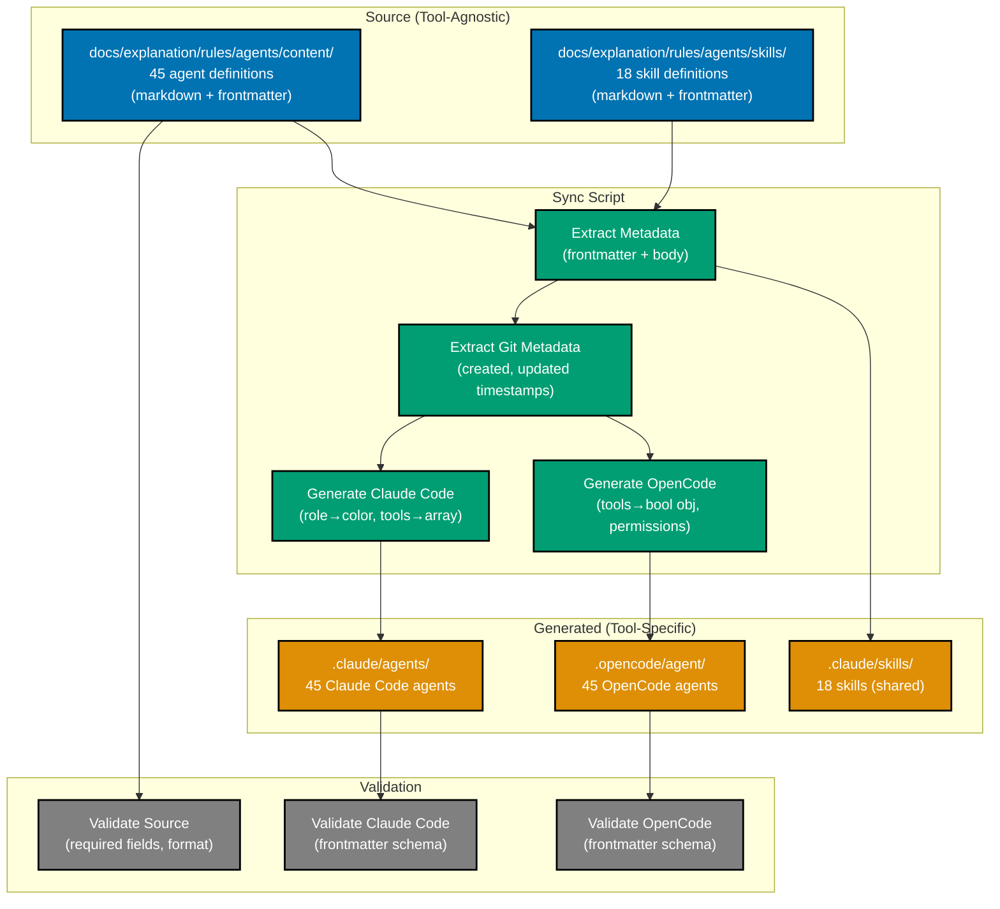

# Technical Design: Agent and Skill Definitions as Documentation Source of Truth

## Architecture Overview



---

## Implementation Language

**Final Implementation**: Go (using Cobra framework in `apps/repo-cli/`)

**Python Code References**: Throughout this document, Python code examples and function signatures are provided as **pseudocode for conceptual clarity**. The actual implementation will be in Go.

**Why Go?**:

- Type safety and compile-time error detection
- Better performance for file operations and git metadata extraction
- Nx monorepo integration (already has Go projects)
- Single binary distribution (no runtime dependencies)

**Migration Path**:

1. **Phase 1**: Develop Go CLI application (`apps/repo-cli`) with Cobra commands
2. **Phase 2+**: All sync, extraction, and validation operations use Go CLI
3. **No Python scripts will be created**

**Command Mapping** (Pseudocode → Actual):

- Pseudocode: `python scripts/sync-docs-to-agents.py`
- Actual: `./repo-cli agents sync`
- Pseudocode: `python scripts/validate-agent-definitions.py`
- Actual: `./repo-cli agents validate`

**Note**: Gherkin acceptance criteria and code examples showing Python syntax should be interpreted as conceptual specifications. Implementation details will follow Go idioms and patterns.

---

## Directory Structure

### Proposed Structure

```
docs/explanation/rules/
└── agents/                                # Layer 4: AI Agents
    ├── README.md                          # Agent catalog (canonical)
    ├── content/
    │   ├── docs-maker.md                  # 45 agent definitions
    │   ├── docs-checker.md
    │   ├── docs-fixer.md
    │   └── ... (42 more)
    ├── skills/                            # Skills (delivery infrastructure)
    │   ├── README.md                      # Skills catalog (canonical)
    │   ├── docs-applying-content-quality/ # 18 skill definitions (folder/SKILL.md)
    │   │   └── SKILL.md
    │   ├── docs-creating-accessible-diagrams/
    │   │   └── SKILL.md
    │   └── ... (16 more)
    └── meta/
        └── ex-ag-me__architecture.md      # Agent architecture doc

.claude/
└── agents/
    ├── README.md                          # Generated banner + catalog
    ├── docs-maker.md                      # Generated (Claude Code format)
    └── ... (44 more)

.opencode/
└── agent/
    ├── README.md                          # Generated banner + catalog
    ├── docs-maker.md                      # Generated (OpenCode format)
    └── ... (44 more)

.claude/
└── skills/
    ├── docs__applying-content-quality/    # Generated (directory structure)
    │   └── SKILL.md
    └── ... (17 more)

apps/repo-cli/                              # Go CLI application using Cobra
├── cmd/
│   ├── root.go                            # Cobra root command
│   ├── agents/
│   │   ├── extract.go                     # Extract agents to docs
│   │   ├── sync.go                        # Sync docs to tool formats
│   │   └── validate.go                    # Validate agent definitions
│   └── skills/
│       ├── extract.go                     # Extract skills to docs
│       └── validate.go                    # Validate skill definitions
├── internal/
│   ├── agent/
│   │   ├── parser.go                      # Parse agent formats
│   │   ├── generator.go                   # Generate tool-specific formats
│   │   └── validator.go                   # Validation logic
│   ├── skill/
│   │   ├── parser.go                      # Parse skill formats
│   │   └── validator.go                   # Validation logic
│   └── git/
│       └── metadata.go                    # Git metadata extraction
├── go.mod
├── go.sum
└── main.go                                 # CLI entry point
```

### Rationale

**Agents in `content/` subdirectory**:

- Separates agent definitions from meta-documentation
- Allows future expansion (e.g., `templates/`, `examples/`)
- Clean separation: `content/` = definitions, `meta/` = docs about definitions

**Skills use folder/SKILL.md structure**:

- Both Claude Code and OpenCode support identical folder/SKILL.md format
- No conversion needed - source structure matches generated structure
- Direct copy/sync from docs to `.claude/skills/`
- Consistent structure throughout (source → generated)

**Generated directories keep existing paths**:

- `.claude/agents/` and `.opencode/agent/` locations unchanged
- Tools continue to work without configuration changes
- `.claude/skills/` retains directory structure (tools expect this)

---

## Tool-Agnostic Format Specification

### Agent Definition Format

**File naming**: `{agent-name}.md` (matches frontmatter `name` field)

**Structure**:

```markdown
---
name: agent-name
description: One-line description of agent purpose
role: writer
model: sonnet
tools:
  - Read
  - Write
  - Edit
  - Glob
  - Grep
skills:
  - skill-name-1
  - skill-name-2
mode: all
---

# Agent Instructions

[Full agent prompt content here - this is the agent's system prompt]

## Section 1

[Detailed instructions...]

## Section 2

[More instructions...]
```

### Frontmatter Fields

| Field         | Type    | Required | Valid Values                                      | Description                               |
| ------------- | ------- | -------- | ------------------------------------------------- | ----------------------------------------- |
| `name`        | string  | Yes      | kebab-case, matches filename                      | Agent identifier                          |
| `description` | string  | Yes      | Non-empty string                                  | One-line agent purpose                    |
| `role`        | string  | Yes      | writer, checker, updater, implementor, specialist | Semantic role (maps to color)             |
| `model`       | string  | Yes      | sonnet, haiku, opus, inherit                      | LLM model selection                       |
| `tools`       | array   | Yes      | Capitalized tool names                            | Required tool access                      |
| `skills`      | array   | No       | Valid skill names (double-underscore)             | Knowledge dependencies                    |
| `mode`        | string  | Yes      | all, subagent, primary                            | Agent invocation mode                     |
| `temperature` | float   | No       | 0.0 - 1.0                                         | LLM temperature (for deterministic tasks) |
| `maxSteps`    | integer | No       | Positive integer                                  | Max execution steps (complex agents)      |

### Valid Tool Names and Mappings

**Tool-Agnostic → Claude Code → OpenCode Mapping Table**:

| Tool-Agnostic (Source) | Claude Code Format | OpenCode Format | Description                    |
| ---------------------- | ------------------ | --------------- | ------------------------------ |
| `Read`                 | `Read`             | `read`          | Read files from filesystem     |
| `Write`                | `Write`            | `write`         | Create new files               |
| `Edit`                 | `Edit`             | `edit`          | Perform string replacements    |
| `MultiEdit`            | `MultiEdit`        | `edit`          | Multiple edits across files    |
| `Glob`                 | `Glob`             | `glob`          | Find files by pattern          |
| `Grep`                 | `Grep`             | `grep`          | Search file contents (ripgrep) |
| `Bash`                 | `Bash`             | `bash`          | Execute shell commands         |
| `LS`                   | `LS`               | `list`          | List files and directories     |
| `WebFetch`             | `WebFetch`         | `webfetch`      | Fetch web content              |
| `WebSearch`            | `WebSearch`        | N/A             | Search web (Claude Code only)  |
| `TodoRead`             | `TodoRead`         | N/A             | Read task lists                |
| `TodoWrite`            | `TodoWrite`        | N/A             | Manage task lists              |
| `NotebookRead`         | `NotebookRead`     | N/A             | Read Jupyter notebooks         |
| `NotebookEdit`         | `NotebookEdit`     | N/A             | Edit Jupyter notebooks         |
| N/A                    | N/A                | `patch`         | Apply patches (OpenCode only)  |

**Format Notes**:

- **Source format**: Capitalized (tool-agnostic, semantic)
- **Claude Code**: Capitalized (as-is from source)
- **OpenCode**: Lowercase (converted during sync)
- **OpenCode structure**: Boolean object `{read: true, write: true, bash: false}`

**Common Agent Tool Subset** (supported by both systems):

- Core file ops: `Read`, `Write`, `Edit`, `Glob`, `Grep`
- Shell: `Bash`
- Web: `WebFetch`

**Recommendation**: Use common subset in agent definitions unless tool-specific features required.

### Role Definitions and Mappings

| Role          | Color    | Semantic Meaning                                 | Example Agents             |
| ------------- | -------- | ------------------------------------------------ | -------------------------- |
| `writer`      | `blue`   | Creates or updates content                       | docs-maker, plan-maker     |
| `checker`     | `green`  | Validates content, generates audit reports       | docs-checker, plan-checker |
| `updater`     | `yellow` | Modifies existing content based on audit reports | docs-fixer, plan-fixer     |
| `implementor` | `purple` | Executes complex multi-step tasks                | plan-executor              |
| `specialist`  | `orange` | Performs specialized tasks (unique purpose)      | swe-hugo-developer         |

**Rationale**: `role` is semantically meaningful (describes what agent does), while `color` is presentation detail for Claude Code UI.

### Skill Definition Format

**Directory naming**: `{category}-{skill-name}/` (folder structure)
**File naming**: `SKILL.md` (inside skill folder)

**Structure**:

```
docs/explanation/rules/agents/skills/{category}-{skill-name}/SKILL.md
```

**SKILL.md content**:

```markdown
---
name: category__skill-name
description: Brief description of skill purpose
---

# Skill: Category - Skill Name

[Skill content following progressive knowledge delivery pattern...]

## Core Concept

[Fundamental knowledge...]

## Detailed Guidance

[In-depth information...]

## Examples

[Practical examples...]
```

**Note**: Skills use identical folder/SKILL.md format as `.claude/skills/*/SKILL.md` - both Claude Code and OpenCode support this format natively, requiring no conversion.

---

## Format Mapping Tables

### Agent Frontmatter: Tool-Agnostic → Claude Code

| Source Field  | Claude Code Field | Transformation                   |
| ------------- | ----------------- | -------------------------------- |
| `name`        | `name`            | Direct copy                      |
| `description` | `description`     | Direct copy                      |
| `role`        | `color`           | Map via role→color table         |
| `model`       | `model`           | Direct copy                      |
| `tools`       | `tools`           | Array (capitalized), direct copy |
| `skills`      | `skills`          | Array, direct copy               |
| `mode`        | (omitted)         | Not used in Claude Code format   |
| `temperature` | `temperature`     | Direct copy (if present)         |
| `maxSteps`    | (omitted)         | Not used in Claude Code format   |
| (generated)   | `created`         | From git: first commit timestamp |
| (generated)   | `updated`         | From git: last commit timestamp  |

### Agent Frontmatter: Tool-Agnostic → OpenCode

| Source Field  | OpenCode Field     | Transformation                                      |
| ------------- | ------------------ | --------------------------------------------------- |
| `name`        | (filename only)    | Used for filename, not in frontmatter               |
| `description` | `description`      | Direct copy                                         |
| `role`        | (embedded in body) | `**Role**: Writer (blue)` in Agent Metadata section |
| `model`       | `model`            | Map via model table (sonnet→zai/glm-4.7)            |
| `tools`       | `tools`            | Boolean object `{read: true, write: true}`          |
| `skills`      | `permission.skill` | Dict `{skill-1: allow, skill-2: allow}`             |
| `mode`        | `mode`             | Direct copy                                         |
| `temperature` | `temperature`      | Direct copy (if present)                            |
| `maxSteps`    | `maxSteps`         | Direct copy (if present)                            |
| (calculated)  | `permission`       | Denylist from tools (deny tools NOT in list)        |
| (generated)   | (embedded in body) | Created/updated timestamps in Agent Metadata        |

### Model Mapping: Tool-Agnostic → OpenCode

| Source Model | OpenCode Model    |
| ------------ | ----------------- |
| `inherit`    | (omit field)      |
| `sonnet`     | `zai/glm-4.7`     |
| `haiku`      | `zai/glm-4.5-air` |
| `opus`       | `zai/glm-4.7`     |

**Note**: Claude Code uses model names as-is. OpenCode requires specific model identifiers.

**Provider Configuration**: Model mappings shown are for default z.ai provider. If using alternative OpenCode LLM providers, update mappings in sync CLI configuration (`apps/repo-cli/internal/agent/generator.go` - `MODEL_MAP` constant). The sync CLI allows provider-specific model mapping configuration.

### MCP (Model Context Protocol) Servers for OpenCode

**Purpose**: Ensure OpenCode has feature parity with Claude Code by providing equivalent MCP capabilities.

**IMPORTANT - Migration Scope Clarification**:

- ⚠️ **NOT included in this migration plan**: MCP server configuration and setup
- **Documented for reference only**: This section provides context about OpenCode's MCP capabilities
- **No action required**: Migration only affects agent definition format and sync process
- **User responsibility**: OpenCode users configure MCP servers independently according to their needs

See [Out of Scope](#out-of-scope) section for complete exclusions.

**Default MCP Configuration** (from `~/.config/opencode/opencode.json`):

```json
{
  "mcp": {
    "zai-mcp-server": {
      "type": "local",
      "command": ["npx", "-y", "@z_ai/mcp-server"],
      "environment": {
        "Z_AI_MODE": "ZAI",
        "Z_AI_API_KEY": "${Z_AI_API_KEY}"
      }
    },
    "web-search-prime": {
      "type": "remote",
      "url": "https://api.z.ai/api/mcp/web_search_prime/mcp",
      "headers": {
        "Authorization": "Bearer ${Z_AI_API_KEY}"
      }
    },
    "web-reader": {
      "type": "remote",
      "url": "https://api.z.ai/api/mcp/web_reader/mcp",
      "headers": {
        "Authorization": "Bearer ${Z_AI_API_KEY}"
      }
    },
    "zread": {
      "type": "remote",
      "url": "https://api.z.ai/api/mcp/zread/mcp",
      "headers": {
        "Authorization": "Bearer ${Z_AI_API_KEY}"
      }
    }
  }
}
```

**MCP Server Capabilities**:

| MCP Server       | Type   | Capabilities                                      | Claude Code Equivalent  |
| ---------------- | ------ | ------------------------------------------------- | ----------------------- |
| zai-mcp-server   | Local  | Image analysis (UI to code, OCR, error diagnosis) | Built-in vision tools   |
| web-search-prime | Remote | Web search with source citations                  | WebSearch tool          |
| web-reader       | Remote | Fetch and convert web content to markdown         | WebFetch tool           |
| zread            | Remote | GitHub repository reading (docs, issues, commits) | N/A (OpenCode-specific) |

**Integration Strategy**:

- **Global configuration**: MCP servers configured in `~/.config/opencode/opencode.json` are available to all OpenCode agents
- **No per-agent configuration needed**: Unlike tool permissions, MCP access is inherited from global config
- **Feature parity**: With these MCP servers, OpenCode agents have equivalent capabilities to Claude Code agents (web search, web reading, vision analysis)

**Security Note**: API keys should be stored in environment variables, not hardcoded in config files.

---

## CLI Application Architecture

### Application: `repo-cli` (Go + Cobra)

**Purpose**: Repository management CLI tool with agent/skill sync capabilities

**Command-line Interface**:

```bash
# Build CLI
cd apps/repo-cli
go build -o repo-cli

# Sync all agents and skills
./repo-cli agents sync

# Sync specific agent only
./repo-cli agents sync --name docs-maker

# Extract agents from Claude Code format to docs
./repo-cli agents extract

# Validate agent definitions
./repo-cli agents validate

# Skills commands
./repo-cli skills sync
./repo-cli skills extract
./repo-cli skills validate

# Dry run (no file writes)
./repo-cli agents sync --dry-run

# Verbose output
./repo-cli agents sync --verbose
```

### Core Components (Go)

```go
// internal/agent/types.go
package agent

import "time"

// AgentDefinition represents tool-agnostic agent definition
type AgentDefinition struct {
    Name        string   `yaml:"name"`
    Description string   `yaml:"description"`
    Role        string   `yaml:"role"`
    Model       string   `yaml:"model"`
    Tools       []string `yaml:"tools"`
    Skills      []string `yaml:"skills,omitempty"`
    Mode        string   `yaml:"mode"`
    Temperature *float64 `yaml:"temperature,omitempty"`
    MaxSteps    *int     `yaml:"maxSteps,omitempty"`
    Body        string   `yaml:"-"` // Agent instructions (not in frontmatter)
}

// SkillDefinition represents tool-agnostic skill definition
type SkillDefinition struct {
    Name        string `yaml:"name"`
    Description string `yaml:"description"`
    Body        string `yaml:"-"`
}

// GitMetadata represents git history timestamps
type GitMetadata struct {
    Created time.Time // ISO 8601 timestamp (UTC+7)
    Updated time.Time // ISO 8601 timestamp (UTC+7)
}

// internal/agent/parser.go
package agent

// ParseAgentDefinition parses tool-agnostic agent markdown file
func ParseAgentDefinition(filepath string) (*AgentDefinition, error) {
    // Parse frontmatter + body
}

// internal/git/metadata.go
package git

// ExtractMetadata extracts created/updated timestamps from git history
func ExtractMetadata(filepath string) (*agent.GitMetadata, error) {
    // Use go-git library
}

// internal/agent/generator.go
package agent

// GenerateClaudeCodeFormat generates Claude Code format markdown
func GenerateClaudeCodeFormat(def *AgentDefinition, meta *GitMetadata) (string, error) {
    // Map role → color, generate Claude Code frontmatter
}

// GenerateOpenCodeFormat generates OpenCode format markdown
func GenerateOpenCodeFormat(def *AgentDefinition, meta *GitMetadata) (string, error) {
    // Map to OpenCode schema, embed metadata in body
}

// cmd/agents/sync.go
package agents

// syncCmd represents the sync command
var syncCmd = &cobra.Command{
    Use:   "sync",
    Short: "Sync agent definitions from docs to tool formats",
    RunE:  runSync,
}

func runSync(cmd *cobra.Command, args []string) error {
    // Main sync orchestration
}
```

### Git Metadata Extraction (Go)

**Strategy**: Use go-git library to find first and last commit touching each file

```go
// internal/git/metadata.go
package git

import (
    "time"
    "github.com/go-git/go-git/v5"
    "github.com/go-git/go-git/v5/plumbing/object"
)

// ExtractMetadata extracts created/updated timestamps from git history
func ExtractMetadata(filepath string) (*GitMetadata, error) {
    repo, err := git.PlainOpen(".")
    if err != nil {
        return nil, err
    }

    // Get commit log for file
    commits, err := repo.Log(&git.LogOptions{
        FileName: &filepath,
        Order:    git.LogOrderCommitterTime,
    })
    if err != nil {
        return nil, err
    }

    var created, updated time.Time
    var firstCommit *object.Commit

    // Iterate commits to find first (created) and last (updated)
    err = commits.ForEach(func(c *object.Commit) error {
        updated = c.Committer.When // Last commit (most recent)
        firstCommit = c             // Keep updating until we reach first
        return nil
    })

    if firstCommit != nil {
        created = firstCommit.Committer.When
    }

    // Convert to UTC+7
    utc7 := time.FixedZone("UTC+7", 7*60*60)
    created = created.In(utc7)
    updated = updated.In(utc7)

    return &GitMetadata{
        Created: created,
        Updated: updated,
    }, nil
}
```

**Fallback**: If git history unavailable (new file, not committed), use file modification time from `os.Stat()`.

### Validation Integration

**Strategy**: Validate at three points

1. **Pre-sync validation**: Validate source definitions before processing
2. **Post-generation validation**: Validate generated formats before writing
3. **Post-sync validation**: Run format validators after all writes complete

```python
def sync_all_agents():
    # 1. Pre-sync validation
    errors = validate_source_definitions('docs/explanation/rules/agents/content/')
    if errors:
        print_errors(errors)
        sys.exit(1)

    # 2. Generate and validate
    for agent_file in agent_files:
        agent = parse_agent_definition(agent_file)
        metadata = extract_git_metadata(agent_file)

        cc_content = generate_claude_code_format(agent, metadata)
        oc_content = generate_opencode_format(agent, metadata)

        # Validate before write
        cc_errors = validate_claude_code_content(cc_content)
        oc_errors = validate_opencode_content(oc_content)

        if cc_errors or oc_errors:
            print_errors(cc_errors + oc_errors)
            sys.exit(1)

        # Write to files
        write_file(f'.claude/agents/{agent.name}.md', cc_content)
        write_file(f'.opencode/agent/{agent.name}.md', oc_content)

    # 3. Post-sync validation
    run_validation_script('scripts/validate-claude-agents.py')
    run_validation_script('scripts/validate-opencode-agents.py')
```

### Atomic Sync Guarantee

**Requirement**: Sync is all-or-nothing (no partial state)

**Implementation**:

1. Generate all files to temporary directory first
2. Validate all generated files
3. If validation passes, atomically replace target directories
4. If validation fails, discard temp directory, leave target unchanged

```python
def sync_all_agents():
    with tempfile.TemporaryDirectory() as tmpdir:
        # Generate to temp dir
        tmp_claude = Path(tmpdir) / 'claude' / 'agents'
        tmp_opencode = Path(tmpdir) / 'opencode' / 'agent'

        for agent_file in agent_files:
            # Generate files to temp dir
            generate_to(agent_file, tmp_claude, tmp_opencode)

        # Validate temp dir
        if not validate_generated_files(tmp_claude, tmp_opencode):
            print("Validation failed, sync aborted")
            sys.exit(1)

        # Atomic replace
        shutil.rmtree('.claude/agents')
        shutil.rmtree('.opencode/agent')
        shutil.copytree(tmp_claude, '.claude/agents')
        shutil.copytree(tmp_opencode, '.opencode/agent')
```

---

## Validation Strategy

### Validation Scripts

| Script                          | Purpose                             | Checks                                                 |
| ------------------------------- | ----------------------------------- | ------------------------------------------------------ |
| `validate-agent-definitions.py` | Validate source agent definitions   | Required fields, valid values, name=filename           |
| `validate-skill-definitions.py` | Validate source skill definitions   | Required fields, double-underscore naming              |
| `validate-claude-agents.py`     | Validate Claude Code format         | Frontmatter schema, color values, tools array          |
| `validate-opencode-agents.py`   | Validate OpenCode format (existing) | Frontmatter schema, lowercase tools, permission format |

### Source Definition Validation

**Script**: `validate-agent-definitions.py`

**Checks**:

```python
def validate_agent_definition(filepath: Path) -> List[str]:
    """
    Validate tool-agnostic agent definition.

    Returns:
        List of error messages (empty if valid)
    """
    errors = []

    # Parse file
    frontmatter, body = parse_markdown(filepath)

    # Required fields present
    required = ['name', 'description', 'role', 'model', 'tools', 'mode']
    for field in required:
        if field not in frontmatter:
            errors.append(f"Missing required field: {field}")

    # Name matches filename
    filename_stem = filepath.stem
    if frontmatter.get('name') != filename_stem:
        errors.append(f"Name '{frontmatter['name']}' must match filename '{filename_stem}'")

    # Role is valid
    valid_roles = ['writer', 'checker', 'updater', 'implementor', 'specialist']
    if frontmatter.get('role') not in valid_roles:
        errors.append(f"Invalid role: {frontmatter['role']} (must be one of {valid_roles})")

    # Model is valid
    valid_models = ['sonnet', 'haiku', 'opus', 'inherit']
    if frontmatter.get('model') not in valid_models:
        errors.append(f"Invalid model: {frontmatter['model']}")

    # Tools are valid
    valid_tools = [
        'Read', 'Write', 'Edit', 'MultiEdit', 'Glob', 'Grep', 'Bash', 'LS',
        'WebFetch', 'WebSearch', 'TodoRead', 'TodoWrite',
        'NotebookRead', 'NotebookEdit'
    ]
    tools = frontmatter.get('tools', [])
    for tool in tools:
        if tool not in valid_tools:
            errors.append(f"Invalid tool: {tool}")

    # Skills exist
    skills = frontmatter.get('skills', [])
    for skill in skills:
        skill_path = Path(f'docs/explanation/rules/agents/skills/{skill}/SKILL.md')
        if not skill_path.exists():
            errors.append(f"Referenced skill not found: {skill}")

    # Mode is valid
    valid_modes = ['all', 'subagent', 'primary']
    if frontmatter.get('mode') not in valid_modes:
        errors.append(f"Invalid mode: {frontmatter['mode']}")

    # Body not empty
    if not body or len(body.strip()) == 0:
        errors.append("Agent body is empty")

    return errors
```

### Claude Code Format Validation

**Script**: `validate-claude-agents.py`

**Checks**:

- `name` field matches filename
- `description` not empty
- `color` is valid (blue, green, yellow, purple, orange)
- `model` is valid (inherit, sonnet, haiku, opus)
- `tools` is array with valid tool names (capitalized)
- `skills` is array (if present)
- `created` and `updated` are ISO 8601 timestamps (if present)
- Body content present

### OpenCode Format Validation

**Script**: `validate-opencode-agents.py` (already exists, may need updates)

**Checks**:

- `description` not empty
- `mode` is valid (all, subagent, primary)
- `model` is valid OpenCode model identifier (if present)
- `tools` is boolean object with lowercase keys
- `permission` has valid actions (allow, deny, ask)
- `permission.skill` is dict (if present)
- Temperature in range 0.0-1.0 (if present)
- Body content present and contains embedded metadata

---

## Migration Scripts Design

### Script: `extract-agents-to-docs.py`

**Purpose**: One-time migration from `.claude/agents/` to `docs/explanation/rules/agents/content/`

**Algorithm**:

```python
def extract_agents():
    """
    Extract agents from Claude Code format to tool-agnostic format.

    Reverse transformation of sync script.
    """
    source_dir = Path('.claude/agents')
    target_dir = Path('docs/explanation/rules/agents/content')
    target_dir.mkdir(parents=True, exist_ok=True)

    for agent_file in source_dir.glob('*.md'):
        if agent_file.name == 'README.md':
            continue

        # Parse Claude Code format
        frontmatter, body = parse_markdown(agent_file)

        # Map to tool-agnostic format
        tool_agnostic = {
            'name': frontmatter['name'],
            'description': frontmatter['description'],
            'role': color_to_role(frontmatter.get('color', 'blue')),
            'model': frontmatter.get('model', 'inherit'),
            'tools': frontmatter.get('tools', []),
            'skills': frontmatter.get('skills', []),
            'mode': determine_mode(frontmatter['name']),  # Infer from name
        }

        # Add optional fields
        if 'temperature' in frontmatter:
            tool_agnostic['temperature'] = frontmatter['temperature']
        if 'maxSteps' in frontmatter:
            tool_agnostic['maxSteps'] = frontmatter['maxSteps']

        # Write tool-agnostic format
        target_file = target_dir / agent_file.name
        write_agent_definition(target_file, tool_agnostic, body)
```

**Color to Role Mapping**:

```python
COLOR_TO_ROLE = {
    'blue': 'writer',
    'green': 'checker',
    'yellow': 'updater',
    'purple': 'implementor',
    'orange': 'specialist'
}

def color_to_role(color: str) -> str:
    """Map Claude Code color to semantic role."""
    return COLOR_TO_ROLE.get(color, 'writer')
```

**Mode Inference**:

```python
SUBAGENT_NAMES = {
    'plan-execution-checker',
    'docs-checker',
    'docs-tutorial-checker',
    # ... (from existing convert script)
}

def determine_mode(agent_name: str) -> str:
    """Infer mode from agent name (heuristic)."""
    return 'subagent' if agent_name in SUBAGENT_NAMES else 'all'
```

### Script: `extract-skills-to-docs.py`

**Purpose**: Copy `.claude/skills/` directory structure to `docs/explanation/rules/agents/skills/`

**Algorithm**:

```python
def extract_skills():
    """
    Copy skill directory structure (folder/SKILL.md format preserved).

    From: .claude/skills/{skill-name}/SKILL.md
    To:   docs/explanation/rules/agents/skills/{skill-name}/SKILL.md
    """
    source_dir = Path('.claude/skills')
    target_dir = Path('docs/explanation/rules/agents/skills')
    target_dir.mkdir(parents=True, exist_ok=True)

    for skill_dir in source_dir.iterdir():
        if not skill_dir.is_dir():
            continue

        skill_file = skill_dir / 'SKILL.md'
        if not skill_file.exists():
            print(f"Warning: Missing SKILL.md in {skill_dir}")
            continue

        # Create target directory
        target_skill_dir = target_dir / skill_dir.name
        target_skill_dir.mkdir(parents=True, exist_ok=True)

        # Read skill content
        with open(skill_file, 'r') as f:
            content = f.read()

        # Parse and add frontmatter if missing
        if not content.startswith('---'):
            # Add minimal frontmatter
            frontmatter = f"""---
name: {skill_dir.name}
description: [TODO: Add description]
---

"""
            content = frontmatter + content

        # Write to target (maintaining folder/SKILL.md structure)
        target_file = target_skill_dir / 'SKILL.md'
        with open(target_file, 'w') as f:
            f.write(content)
```

---

## Pre-Commit Hook Implementation

**File**: `.husky/pre-commit` (append to existing hook)

**Logic**:

```bash
#!/usr/bin/env sh
. "$(dirname -- "$0")/_/husky.sh"

# ... (existing pre-commit checks)

# Check for edits to generated directories
echo "Checking for edits to generated agent/skill directories..."

MODIFIED_GENERATED=$(git diff --cached --name-only --diff-filter=AM | \
  grep -E '^(\.claude/agents/|\.opencode/agent/|\.claude/skills/)' || true)

if [ -n "$MODIFIED_GENERATED" ]; then
  echo ""
  echo "⚠️  WARNING: You are committing changes to generated directories."
  echo ""
  echo "Modified generated files:"
  echo "$MODIFIED_GENERATED" | sed 's/^/  - /'
  echo ""
  echo "Source of truth locations:"
  echo "  - Agents: docs/explanation/rules/agents/content/"
  echo "  - Skills: docs/explanation/rules/agents/skills/"
  echo ""
  echo "To make changes:"
  echo "  1. Edit source files in docs/explanation/"
  echo "  2. Run: python scripts/sync-docs-to-agents.py"
  echo "  3. Commit both source and generated files together"
  echo ""
  echo "To bypass this check (NOT recommended):"
  echo "  git commit --no-verify"
  echo ""
  exit 1
fi

echo "✓ No edits to generated directories detected"
```

**Rationale**: Warn (and block) direct edits to generated files, guide users to edit source instead.

---

## Generated Directory Banners

### `.claude/agents/README.md` Header

```markdown
# ⚠️ DO NOT EDIT - GENERATED FILES

**Source of truth**: `docs/explanation/rules/agents/content/`

Files in this directory are automatically generated by `scripts/sync-docs-to-agents.py`.

**To modify agents**:

1. Edit source files in `docs/explanation/rules/agents/content/`
2. Run sync script: `python scripts/sync-docs-to-agents.py`
3. Commit both source and generated files together

**Direct edits to this directory will be overwritten on next sync.**

---

# AI Agents

[Rest of catalog content...]
```

### `.opencode/agent/README.md` Header

```markdown
# ⚠️ DO NOT EDIT - GENERATED FILES

**Source of truth**: `docs/explanation/rules/agents/content/`

Files in this directory are automatically generated by `scripts/sync-docs-to-agents.py`.

**To modify agents**:

1. Edit source files in `docs/explanation/rules/agents/content/`
2. Run sync script: `python scripts/sync-docs-to-agents.py`
3. Commit both source and generated files together

**Direct edits to this directory will be overwritten on next sync.**

---

# OpenCode Agents

[Rest of catalog content...]
```

---

## Rollback Strategy

**Scenario**: Migration fails, need to revert to previous state

**Steps**:

1. **Git rollback**:

   ```bash
   # Revert to commit before migration
   git reset --hard <commit-before-migration>

   # Or revert specific commit
   git revert <migration-commit>
   ```

2. **Restore from backup**:

   ```bash
   # Before migration, create backup
   cp -r .claude/agents .claude/agents.backup
   cp -r .opencode/agent .opencode/agent.backup

   # Restore if needed
   rm -rf .claude/agents .opencode/agent
   mv .claude/agents.backup .claude/agents
   mv .opencode/agent.backup .opencode/agent
   ```

3. **Incremental rollback** (if partial failure):
   - Sync script atomic guarantees prevent partial state
   - If sync fails, target directories remain unchanged

**Testing rollback**:

- Test rollback procedure before migration (on branch)
- Ensure git history allows clean revert
- Verify agent functionality after rollback

---

## Performance Considerations

### Sync Performance

**Target**: Sync 45 agents + 18 skills in <30 seconds

**Optimization strategies**:

1. **Parallel processing**:

   ```python
   from concurrent.futures import ThreadPoolExecutor

   with ThreadPoolExecutor(max_workers=4) as executor:
       futures = []
       for agent_file in agent_files:
           future = executor.submit(process_agent, agent_file)
           futures.append(future)

       results = [f.result() for f in futures]
   ```

2. **Incremental sync** (future enhancement):
   - Track file modification times
   - Only sync changed files
   - Cache git metadata lookup results

3. **Lazy git metadata** (optimization):
   - Only extract git metadata if not cached
   - Cache in `.sync-cache.json` (gitignored)
   - Invalidate cache on file change

### Validation Performance

**Target**: Validate all agents in <60 seconds

**Current**: `validate-opencode-agents.py` processes 45 agents in ~5 seconds

**Parallelization**:

```python
def validate_all_agents(agent_dir: Path) -> List[ValidationResult]:
    """Validate agents in parallel."""
    agent_files = list(agent_dir.glob('*.md'))

    with ThreadPoolExecutor(max_workers=8) as executor:
        futures = [executor.submit(validate_agent, f) for f in agent_files]
        results = [f.result() for f in futures]

    return results
```

---

## Security Considerations

### File Write Safety

**Concern**: Sync script has write access to `.claude/` and `.opencode/` directories

**Mitigation**:

1. **Validation before write**: Never write invalid content
2. **Atomic operations**: All-or-nothing sync (temp directory strategy)
3. **User review**: Dry-run mode for previewing changes

### Git Hook Bypass

**Concern**: Users can bypass pre-commit hook with `--no-verify`

**Mitigation**:

1. **Documentation**: Clearly state why bypassing is dangerous
2. **CI validation**: GitHub Actions validates source = generated on PR
3. **Periodic audits**: Run consistency check weekly (detect drift)

### Arbitrary Code Execution

**Concern**: Agent definitions could contain malicious content executed during sync

**Mitigation**:

1. **No dynamic execution**: Sync script only parses YAML/markdown, doesn't execute
2. **Input validation**: Sanitize all frontmatter fields
3. **Safe YAML parsing**: Use `yaml.safe_load()`, not `yaml.load()`

---

## Future Enhancements

### Enhancement 1: Incremental Sync

**Feature**: Only sync files that changed since last run

**Implementation**:

```python
def get_changed_agents() -> List[Path]:
    """Get agents modified since last sync."""
    cache = load_sync_cache()  # {filepath: mtime}
    changed = []

    for agent_file in agent_files:
        current_mtime = agent_file.stat().st_mtime
        cached_mtime = cache.get(str(agent_file))

        if cached_mtime is None or current_mtime > cached_mtime:
            changed.append(agent_file)

    return changed
```

**Benefit**: Faster sync for small changes (seconds instead of 30s)

### Enhancement 2: Watch Mode

**Feature**: Automatically sync on file save

**Implementation**:

```python
from watchdog.observers import Observer
from watchdog.events import FileSystemEventHandler

class AgentWatcher(FileSystemEventHandler):
    def on_modified(self, event):
        if event.src_path.endswith('.md'):
            print(f"Change detected: {event.src_path}")
            sync_single_agent(event.src_path)

observer = Observer()
observer.schedule(AgentWatcher(), 'docs/explanation/rules/agents/content/', recursive=False)
observer.start()
```

**Benefit**: Instant feedback during development

### Enhancement 3: Diff Preview

**Feature**: Show what will change before syncing

**Implementation**:

```bash
python scripts/sync-docs-to-agents.py --diff

# Output:
# Agent: docs-maker
#   Claude Code format:
#     - color: blue → blue (unchanged)
#     + description: Expert at... → Expert at creating... (modified)
#   OpenCode format:
#     + tools.bash: true → false (modified)
```

**Benefit**: Safer changes (preview before commit)

---

## Dependencies and Requirements

### Go Dependencies

```go
// apps/repo-cli/go.mod
module github.com/wahidyankf/open-sharia-enterprise/apps/repo-cli

go 1.21

require (
    github.com/spf13/cobra v1.8.0
    github.com/go-git/go-git/v5 v5.11.0
    gopkg.in/yaml.v3 v3.0.1
    github.com/stretchr/testify v1.8.4  // For testing
)
```

**Installation**:

```bash
cd apps/repo-cli
go mod download
```

### Build Commands

```bash
# Development build
cd apps/repo-cli
go build -o repo-cli

# Production build (optimized, smaller binary)
go build -ldflags="-s -w" -o repo-cli

# Install globally (adds to $GOPATH/bin)
go install

# Cross-compile for different platforms
GOOS=linux GOARCH=amd64 go build -o repo-cli-linux-amd64
GOOS=darwin GOARCH=arm64 go build -o repo-cli-darwin-arm64
GOOS=windows GOARCH=amd64 go build -o repo-cli-windows-amd64.exe
```

### System Requirements

- Go 1.21+
- Git (for metadata extraction via go-git)
- Bash (for pre-commit hook)
- Claude Code CLI (for testing Claude Code format)
- OpenCode CLI (for testing OpenCode format)

### Nx Integration

```json
// apps/repo-cli/project.json
{
  "name": "repo-cli",
  "targets": {
    "build": {
      "executor": "@nx/run-commands",
      "options": {
        "command": "go build -o ../../dist/apps/repo-cli/repo-cli",
        "cwd": "apps/repo-cli"
      }
    },
    "test": {
      "executor": "@nx/run-commands",
      "options": {
        "command": "go test ./...",
        "cwd": "apps/repo-cli"
      }
    },
    "lint": {
      "executor": "@nx/run-commands",
      "options": {
        "command": "golangci-lint run",
        "cwd": "apps/repo-cli"
      }
    }
  }
}
```

---

## Testing Strategy

### Unit Tests

**Coverage**: Individual functions in sync script

```python
# tests/test_sync_agent_format.py

def test_role_to_color_mapping():
    assert role_to_color('writer') == 'blue'
    assert role_to_color('checker') == 'green'

def test_generate_claude_code_format():
    agent = AgentDefinition(
        name='test-agent',
        role='writer',
        # ...
    )
    content = generate_claude_code_format(agent, metadata)
    assert 'color: blue' in content

def test_generate_opencode_format():
    agent = AgentDefinition(
        name='test-agent',
        tools=['Read', 'Write'],
        # ...
    )
    content = generate_opencode_format(agent, metadata)
    assert 'tools:\n  read: true\n  write: true' in content
```

### Integration Tests

**Coverage**: End-to-end sync workflow

```python
# tests/test_integration_sync.py

def test_full_sync_workflow(tmp_path):
    # Setup: Create source definition
    source = tmp_path / 'docs/explanation/rules/agents/content/test.md'
    write_test_agent(source)

    # Execute: Run sync
    sync_all_agents(source_dir=tmp_path / 'docs/explanation/rules/agents/content',
                    target_claude=tmp_path / '.claude/agents',
                    target_opencode=tmp_path / '.opencode/agent')

    # Verify: Check both formats exist and valid
    assert (tmp_path / '.claude/agents/test.md').exists()
    assert (tmp_path / '.opencode/agent/test.md').exists()

    cc_content = read_file(tmp_path / '.claude/agents/test.md')
    assert 'color: blue' in cc_content

    oc_content = read_file(tmp_path / '.opencode/agent/test.md')
    assert 'tools:' in oc_content
```

### Validation Tests

**Coverage**: Format validators

```python
# tests/test_validation.py

def test_validate_agent_definition():
    # Valid definition
    errors = validate_agent_definition('tests/fixtures/valid-agent.md')
    assert len(errors) == 0

    # Invalid role
    errors = validate_agent_definition('tests/fixtures/invalid-role.md')
    assert 'Invalid role' in errors[0]

    # Missing required field
    errors = validate_agent_definition('tests/fixtures/missing-description.md')
    assert 'Missing required field: description' in errors[0]
```

### Manual Testing Checklist

- [ ] Create new agent definition in docs, sync, verify both formats work
- [ ] Modify existing agent, sync, verify changes propagate
- [ ] Delete agent from docs, sync, verify removed from both formats
- [ ] Add new skill, sync, verify appears in `.claude/skills/`
- [ ] Run sync twice, verify idempotent (no changes second run)
- [ ] Trigger pre-commit hook by editing `.claude/agents/`, verify blocked
- [ ] Test rollback by reverting migration commit
- [ ] Verify all 45 agents execute correctly in Claude Code CLI
- [ ] Verify all 45 agents execute correctly in OpenCode CLI

---

## Documentation Updates

### Files to Update

| File                                                                  | Changes Required                                             |
| --------------------------------------------------------------------- | ------------------------------------------------------------ |
| `CLAUDE.md`                                                           | Update agent source location, sync workflow                  |
| `AGENTS.md`                                                           | Update agent source location, sync workflow                  |
| `docs/explanation/rules/development/agents/ex-ru-de-ag__ai-agents.md` | Add "Source of Truth" section, document tool-agnostic format |
| `docs/explanation/rules/ex-ru__repository-governance-architecture.md` | Update Layer 4 to reference docs source                      |
| `.claude/agents/README.md`                                            | Add generated banner, link to source                         |
| `.opencode/agent/README.md`                                           | Add generated banner, link to source                         |
| `docs/explanation/rules/agents/README.md`                             | New file: canonical agent catalog                            |
| `docs/explanation/rules/agents/skills/README.md`                      | New file: canonical skills catalog                           |
| `docs/explanation/rules/agents/meta/ex-ag-me__architecture.md`        | New file: agent architecture documentation                   |

### Example CLAUDE.md Update

**Before**:

```markdown
## AI Agents

Agent definitions in `.claude/agents/` (45 agents)...
```

**After**:

```markdown
## AI Agents

**Source of truth**: `docs/explanation/rules/agents/content/` (45 tool-agnostic definitions)
**Generated formats**:

- `.claude/agents/` - Claude Code format (DO NOT EDIT)
- `.opencode/agent/` - OpenCode format (DO NOT EDIT)

**To modify agents**:

1. Edit `docs/explanation/rules/agents/content/{agent-name}.md`
2. Run: `python scripts/sync-docs-to-agents.py`
3. Commit source + generated files

See [Agent Architecture](./docs/explanation/rules/agents/meta/ex-ag-me__architecture.md) for details.
```

---

## Design Decisions (Finalized)

**Decision Date**: 2026-01-05
**Decision Makers**: Repository maintainer
**Status**: ✅ All design questions resolved

### Decision 1: Role Values ✅

**APPROVED**: `writer, checker, updater, implementor, specialist`

**Rationale**:

- Concise and semantically clear
- Maps naturally to existing agent patterns (e.g., `docs-maker` → `writer`)
- Provides clear categorization for all 45 existing agents

**Mapping**:

- `writer` (blue) - Creates or updates content (e.g., docs-maker, plan-maker, readme-maker)
- `checker` (green) - Validates content, generates audit reports (e.g., docs-checker, plan-checker)
- `updater` (yellow) - Modifies existing content based on audit reports (e.g., docs-fixer, plan-fixer)
- `implementor` (purple) - Executes complex multi-step tasks (e.g., plan-executor, swe-hugo-developer)
- `specialist` (orange) - Performs specialized tasks (e.g., docs-file-manager, deployers)

**Rejected Alternative**: More verbose names (`content-creator`, `validator`, `fixer`) - unnecessary verbosity

### Decision 2: Skills Format ✅

**APPROVED**: Keep frontmatter + use kebab-case naming

**Format**:

```markdown
---
name: docs-applying-content-quality
description: Universal markdown content quality standards...
---

# Skill Content
```

**Naming Convention**: **kebab-case (lowercase with hyphens)**

- ✅ Valid: `docs-applying-content-quality`, `plan-creating-project-plans`
- ❌ Invalid: `docs__applying-content-quality` (underscores), `DocsQuality` (camelCase)

**Rationale**:

- **Compatibility**: Both Claude Code and OpenCode require kebab-case for skill names
- **Web Research Verification** (2026-01-05):
  - Claude Code examples: `react-expert`, `slack-gif-creator`, `pdf`
  - OpenCode examples: `pdf-processing`, `data-analysis`, `code-review`
  - Both tools require `name` field to match directory name
- **Consistency**: Maintains format consistency with agent definitions (frontmatter + body)
- **Validation**: Explicit name field enables validation (name matches folder)

**Rejected Alternative**: Double-underscore separator (`category__skill-name`) - incompatible with both tools

### Decision 3: README Catalog Location ✅

**APPROVED**: `docs/explanation/rules/agents/README.md` as canonical source

**Architecture**:

- **Source**: `docs/explanation/rules/agents/README.md` (canonical, manually edited)
- **Generated**: `.claude/agents/README.md` (auto-generated with "DO NOT EDIT" banner)
- **Generated**: `.opencode/agent/README.md` (auto-generated with "DO NOT EDIT" banner)

**Sync Workflow**:

```bash
# Sync generates README files from docs source
./repo-cli agents sync
# Creates/updates .claude/agents/README.md
# Creates/updates .opencode/agent/README.md
```

**Rationale**:

- Co-located with agent source definitions in `docs/`
- Documentation-first approach (aligns with migration philosophy)
- Single source of truth for agent catalog
- Generated copies ensure tool directories stay current

**Rejected Alternative**: Keep `.claude/agents/README.md` as canonical - not aligned with docs-as-source migration goal

### Decision 4: Validation Approach ✅

**APPROVED**: Separate CLI commands (granular control)

**CLI Commands**:

```bash
# Validate source definitions (docs/)
./repo-cli agents validate

# Validate specific format
./repo-cli agents validate --format claude
./repo-cli agents validate --format opencode

# Validate cross-format consistency
./repo-cli agents validate --cross-format

# Validate skills
./repo-cli skills validate
```

**Rationale**:

- **Granular control**: Validate specific formats when needed (faster CI/CD)
- **Flexibility**: Development workflows often need single-format validation
- **Clear intent**: Explicit what's being validated
- **Performance**: Avoid validating all formats when only one needed

**Rejected Alternative**: Unified validator (validates all formats by default) - less flexible for CI/CD pipelines and development workflows

---

**Design Decisions Complete**: All questions resolved. Implementation can proceed.

---

## Meta-Agent Updates

Several agents currently interact with `.claude/agents/`, `.opencode/agent/`, and `.claude/skills/` directories. These must be updated to work with the new architecture where these directories are **generated** (DO NOT EDIT).

### Affected Agents

| Agent               | Current Behavior                                | Required Changes                                          |
| ------------------- | ----------------------------------------------- | --------------------------------------------------------- |
| `agent-maker`       | Creates in `.claude/agents/`                    | Create in `docs/explanation/rules/agents/content/`        |
| `wow-rules-checker` | Validates `.claude/agents/`, `.opencode/agent/` | Validate `docs/explanation/rules/agents/`, skip generated |
| `wow-rules-fixer`   | Fixes in `.claude/agents/` (uses Bash tools)    | Fix in `docs/explanation/rules/agents/`, skip generated   |
| `wow-rules-maker`   | May reference agent locations in docs           | Update location references                                |

### Agent-Maker Updates

**Current behavior**: Creates agents in `.claude/agents/` using Claude Code format

**New behavior**: Creates agents in `docs/explanation/rules/agents/content/` using tool-agnostic format

**Implementation changes**:

````markdown
<!-- In agent-maker instructions -->

## Agent Creation Workflow

1. **Create source definition** in `docs/explanation/rules/agents/content/{agent-name}.md`
   - Use tool-agnostic format (see template below)
   - DO NOT create in `.claude/agents/` (generated directory)

2. **Tool-agnostic format**:
   ```yaml
   ---
   name: agent-name
   description: Brief agent purpose
   role: writer # NOT color: blue
   model: sonnet
   tools:
     - Read # Capitalized
     - Write
     - Edit
   skills:
     - skill-name-1
   mode: all
   ---
   ```
````

3. **Sync to tool formats**:

   ```bash
   python scripts/sync-docs-to-agents.py
   ```

4. **Verify generation**:
   - `.claude/agents/{agent-name}.md` created
   - `.opencode/agent/{agent-name}.md` created

**CRITICAL**: Never write directly to `.claude/agents/` or `.opencode/agent/`. These are generated directories.

````

### Wow-Rules-Checker Updates

**Current behavior**: Validates `.claude/agents/` and `.opencode/agent/`

**New behavior**: Validates `docs/explanation/rules/agents/content/` (source), detects edits to generated directories as errors

**Implementation changes**:

1. **Validation targets**:
   - ✅ Validate: `docs/explanation/rules/agents/content/*.md`
   - ✅ Validate: `docs/explanation/rules/agents/skills/*.md`
   - ❌ Skip: `.claude/agents/*.md` (generated)
   - ❌ Skip: `.opencode/agent/*.md` (generated)
   - ❌ Skip: `.claude/skills/*/SKILL.md` (generated)

2. **Tool-agnostic format checks**:
   ```python
   def validate_agent_source(filepath: Path) -> List[str]:
       """Validate tool-agnostic agent definition."""
       errors = []

       # Check role (not color)
       if 'color' in frontmatter:
           errors.append("Use 'role' field, not 'color' (tool-agnostic format)")

       if 'role' not in frontmatter:
           errors.append("Missing 'role' field")

       # Check capitalized tools
       for tool in frontmatter.get('tools', []):
           if tool != tool.capitalize():
               errors.append(f"Tool must be capitalized: {tool} → {tool.capitalize()}")

       return errors
````

3. **Detect edits to generated directories**:

   ```python
   def check_generated_directory_edits():
       """Detect if generated files were edited."""
       generated_paths = [
           '.claude/agents/',
           '.opencode/agent/',
           '.claude/skills/'
       ]

       modified = git_diff_cached(generated_paths)

       if modified:
           return f"""
           ❌ Generated file should not be edited directly:
             {modified}

           Source of truth: docs/explanation/rules/agents/content/

           To fix:
           1. Revert changes to generated files
           2. Edit source in docs/explanation/
           3. Run: python scripts/sync-docs-to-agents.py
           """
   ```

### Wow-Rules-Fixer Updates

**Current behavior**: Uses Bash tools to modify `.claude/agents/` files

**New behavior**: Modifies `docs/explanation/rules/agents/content/` (source), skips findings referencing generated files

**Implementation changes**:

1. **Fix source, not generated**:

   ```markdown
   ## Fixer Logic

   For each finding in audit report:

   1. **Check if source or generated**:
      - If path starts with `.claude/agents/` → SKIP (generated)
      - If path starts with `.opencode/agent/` → SKIP (generated)
      - If path starts with `.claude/skills/` → SKIP (generated)
      - If path starts with `docs/explanation/rules/agents/` → FIX (source)
      - If path starts with `docs/explanation/rules/agents/skills/` → FIX (source)

   2. **Apply fix to source**:
      - Use Edit tool (not Bash, since docs/ can use Edit)
      - Modify `docs/explanation/rules/agents/content/{agent-name}.md`

   3. **Instruct sync**:
   ```

   ✅ Fixed: docs/explanation/rules/agents/content/docs-maker.md

   Run sync to propagate changes:
   python scripts/sync-docs-to-agents.py

   ```

   ```

2. **Skip generated files with warning**:

   ```python
   def should_skip_finding(filepath: str) -> bool:
       """Check if finding references generated file."""
       generated_patterns = [
           '.claude/agents/',
           '.opencode/agent/',
           '.claude/skills/'
       ]

       for pattern in generated_patterns:
           if filepath.startswith(pattern):
               return True

       return False

   # In fixer loop
   if should_skip_finding(finding.filepath):
       log_warning(f"Skipping finding for generated file: {finding.filepath}")
       log_info(f"Edit source instead: docs/explanation/rules/agents/content/...")
       continue
   ```

### Wow-Rules-Maker Updates

**Current behavior**: May reference `.claude/agents/` in created rules/conventions

**New behavior**: Reference `docs/explanation/rules/agents/content/` as source location

**Implementation changes**:

- Update any rule/convention templates to reference new source locations
- Update examples to show editing docs source, not generated files

---

## Summary of Design Decisions

| Decision Area          | Selected Approach                                | Rationale                                     |
| ---------------------- | ------------------------------------------------ | --------------------------------------------- |
| **Source location**    | `docs/explanation/rules/agents/content/`         | Documentation co-location, tool-agnostic      |
| **Metadata fields**    | `role` (semantic), generate `color` from mapping | Semantic meaning over presentation            |
| **Git metadata**       | Extract from git history (created/updated)       | Accurate timestamps, automatic                |
| **Sync strategy**      | Atomic (temp dir + validation + replace)         | Safety, all-or-nothing guarantee              |
| **Validation points**  | Pre-sync, post-generation, post-sync             | Catch errors early and late                   |
| **Pre-commit hook**    | Warn and block edits to generated dirs           | Enforce source of truth workflow              |
| **Rollback**           | Git revert + backup strategy                     | Safety net for failed migration               |
| **Skills structure**   | Flatten to single file per skill                 | Simplicity, easier to browse                  |
| **README location**    | Generated with banner in tool dirs               | Clear guidance, prevent confusion             |
| **Performance target** | Sync <30s, validation <60s                       | Acceptable for 45 agents + 18 skills          |
| **Tool name format**   | Capitalized in source (Read, Write)              | Tool-agnostic convention                      |
| **Meta-agents**        | Update to work with docs source, skip generated  | Maintain automation while respecting new arch |
